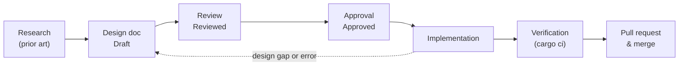

# Contributing to `control-rs`

`control-rs` is developed design-first. Every capability in the library and
its infrastructure crates is specified in a design document before it is
implemented, and the design document is the reference that reviewers,
tests and CI check the code against.

This guide describes that process. Toolchain setup, cargo aliases and the
local CI workflow are in the
[Development Guide](documentation/development-guide.md).

---

## 1. The pipeline



| Stage          | Output                                     | Exit condition                                    |
|:---------------|:-------------------------------------------|:--------------------------------------------------|
| Research       | Sources for the design's References        | Enough prior art to justify the design choices    |
| Design         | `documentation/<project>/<slug>-design.md` | Doc complete against the template, status `Draft` |
| Review         | Review comments, revisions                 | Maintainer sets status `Reviewed`                 |
| Approval       | Approved design doc                        | Maintainer sets status `Approved`                 |
| Implementation | Code, tests, examples, benches             | Code satisfies every requirement in the doc       |
| Verification   | Passing quality gates                      | `cargo ci` passes locally and in GitHub Actions   |
| Merge          | Squash-merged PR on `main`                 | Review approval                                   |

Implementation does not start until the design doc is `Approved`.

### When a design doc is required

| Change                                                          | Design doc                        |
|:----------------------------------------------------------------|:----------------------------------|
| New module, numerical model, algorithm or infrastructure crate  | New doc                           |
| Change to a public API, data layout, wire protocol or CI gate   | Revise the owning doc             |
| New third-party dependency                                      | Revise the owning doc             |
| Change that contradicts an `Approved` doc                       | Revise the doc first              |
| Bug fix, test addition, refactor within an approved design      | None                              |
| Typos, formatting, comments                                     | None                              |

---

## 2. Research

Survey published methods, standards and reference implementations before
writing the design. The purpose is to ground each design choice in prior
art and to find out whether an idea already exists as a published method.

Research notes are working material and are not committed. The committed
record is the design doc's **References** section, which cites published
works only. Original choices made for this crate are stated as ordinary
design prose.

---

## 3. Design

1. Pick the project directory under `documentation/` (`math`,
   `numerical-models`, `ets`, `ets-host`, `ci`, `tui`, `macros`, `vv`, ...)
   and a short slug. The file is `documentation/<project>/<slug>-design.md`.
2. Copy [`documentation/design-template.md`](documentation/design-template.md)
   and fill every section. Omit a subsection only when it does not apply
   (for example, ETS verification for host-only code).
3. Set the status badge to `Draft`, the date badge to today and the author
   badge to your GitHub handle.
4. Open a PR containing the design doc. Design docs normally merge ahead
   of, and separately from, their implementation.

**What the sections must carry.**

- **§2 Requirements**: numbered `FR-n`, `NFR-n` and `C-n`, independent per
  document. Each requirement states an observable behavior, a quality bound
  or a constraint. Implementation detail belongs in §4; test rules belong
  in §6.
- **§4 Architecture**: types, traits, memory layout and algorithms, broad
  to specific. Diagrams in Mermaid.
- **§5 Alternatives**: rejected options framed as technical tradeoffs, not
  as a history of drafts.
- **§6 Verification & Validation**: the plan (`test`, `bench`, `example`,
  `cross-check`), quantitative acceptance bounds with their oracle, and
  the limits of what the plan establishes. This section is the contract
  the implementation is verified against.
- **§7 Performance & Resource Considerations**: stack, allocation, timing
  and `no_std` properties. `no_std` and numeric-type support are decided
  here, per module.
- **§9 Development Plan**: 3 to 5 phases, not a task list.
- **§10 Revision History**: one row per revision.

Write in the present tense, state the current design only and follow
[`documentation/doc-standards.md`](documentation/doc-standards.md). Refer
to other sections and documents with `§` references and code-format
identifiers (`FR-3`, `Storage`, `§4.2`). Vale checks prose under
`documentation/` and `src/` in CI.

---

## 4. Review and approval

Status is shown by the badge below the doc title:

| Status     | Badge markdown                                                              | Set by                               |
|:-----------|:----------------------------------------------------------------------------|:-------------------------------------|
| `Draft`    | ``    | Author, on creation                  |
| `Reviewed` | `` | Maintainer, after a passing review   |
| `Approved` | `` | Maintainer, when ready to implement |

Review checks that requirements are testable, that §4 satisfies §2, that
§6 verifies every requirement with a concrete oracle and bound, and that
the References support the cited claims. `Reviewed` and `Approved` are
always set by a maintainer. Tooling and automation never set them.

---

## 5. Implementation

Implement the `Approved` design. Do not choose between alternatives the
doc leaves open, and do not add capability the doc does not specify.

**When the design is silent or wrong**, stop and revise the doc: fix the
section, add a Revision History row and return it to review. A change to
requirements, public API or architecture needs re-approval before the code
that depends on it lands.

**Code conventions** (enforced by the workspace lint policy in
`Cargo.toml` and `clippy.toml`):

- Library code returns `Result<T, E>` with a crate-local error enum. No
  `unwrap`, `expect`, `panic!` or `unimplemented!` outside tests
  and examples.
- Every public item is documented (`missing_docs = "deny"`), following
  [`documentation/doc-standards.md`](documentation/doc-standards.md),
  including `# Errors` and `# Safety` sections where they apply.
- Minimize dependencies. Before adopting a crate, inspect its real
  dependency tree with `cargo tree` and record the decision in the design
  doc.
- `f64` is the default for continuous-state math. Other numeric types and
  `no_std` support follow the module's design doc.
- Clippy runs with `all`, `pedantic`, `nursery` and `cargo` denied. Fix
  findings rather than suppressing them. A necessary `#[allow]` is scoped
  to the smallest item and carries a comment giving the reason.

**Tests reference requirements.** Name or document each test so the
requirement it verifies (`FR-n` of the owning doc) is identifiable, and
match the kinds listed in §6.1: unit tests beside the module, benches in
`benches/` (criterion), pedagogical examples in `examples/`, numerical
cross-checks in `control-rs-verification` (`cargo compare`) and on-target
suites through the Embedded Test Server.

---

## 6. Verification

Run the full gate set before opening a PR:

```sh
cargo ci                  # all gates in gate.toml
cargo gate fmt,clippy     # a subset while iterating
```

The gates are declared in [`gate.toml`](gate.toml): `fmt`, `clippy`,
`vale`, `build`, `test`, `coverage`, `deny`, `semver`, `geiger`,
`valgrind`, `cross-compare`, `regression` and `mutants`. GitHub Actions
runs the same gates on every PR, across the supported toolchains from the
MSRV (`1.89.0`) to beta. Some gates need extra tools or are Linux-only;
see the Development Guide.

Install the pre-commit hook to format and lint before each commit:

```sh
cp scripts/git-hooks/pre-commit .git/hooks/pre-commit
chmod +x .git/hooks/pre-commit
```

---

## 7. Pull requests

- Branch from `main` as `<handle>/<topic>`. Roadmap work uses the roadmap
  ID in the topic (`<handle>/pr3-2-benchmarking`); see
  [`documentation/roadmap.md`](documentation/roadmap.md).
- Keep one concern per PR: a design doc, or the implementation of one
  approved doc.
- The PR description links the design doc and lists the requirements the
  change implements or modifies.
- PRs are squash-merged into `main`.
- `Cargo.lock` is not committed (library convention).
- Generated reports (`ci-report.md`, `trace-report.*`, `tarpaulin-report.*`,
  `results/`) are ignored and not committed.

---

## 8. AI-assisted development

Contributors may use AI assistants. Assistant instruction files
(`AGENTS.md`, `CLAUDE.md`, `GEMINI.md`) and agent tooling directories are
local and ignored by git; they encode this same process for automated
tools. The process does not change: assistants follow the same gates,
never set `Reviewed` or `Approved`, and the contributor is accountable for
every line submitted.

---

## License

By contributing, you agree that your contributions are dual-licensed under
MIT OR Apache-2.0, matching the project license.
