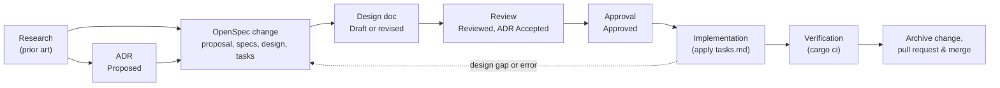

# Contributing to `control-rs`

`control-rs` is developed design-first. Every capability in the library and
its infrastructure crates is specified in a design document before it is
implemented, and the design document is the reference that reviewers,
tests and CI check the code against. Two further records accompany it: a
decision whose reach is wider than one component is written as an
Architecture Decision Record (ADR), and every change is planned as an
OpenSpec change ([ADR-0001](documentation/adr/0001-adopt-adrs-and-openspec.md)).

This guide describes that process. Tool installation is in the
[dependency registry](documentation/dependencies.md); cargo aliases and the
local CI workflow are in the
[Development Guide](documentation/development-guide.md).

---

## 1. The pipeline


```mermaid
flowchart LR
    R["Research<br/>(prior art)"] --> X["ADR<br/>Proposed"]
    R --> P["OpenSpec change<br/>proposal, specs, design, tasks"]
    X --> P
    P --> D["Design doc<br/>Draft or revised"]
    D --> V["Review<br/>Reviewed, ADR Accepted"]
    V --> A["Approval<br/>Approved"]
    A --> I["Implementation<br/>(apply tasks.md)"]
    I --> Q["Verification<br/>(cargo ci)"]
    Q --> M["Archive change,<br/>pull request & merge"]
    I -. "design gap or error" .-> P
```

| Stage          | Output                                                        | Exit condition                                                    |
|:---------------|:--------------------------------------------------------------|:------------------------------------------------------------------|
| Research       | Sources for the design's References                           | Enough prior art to justify the design choices                    |
| Decision       | `documentation/adr/NNNN-<slug>.md`, when §1 calls for one     | ADR complete against the template, status `Proposed`              |
| Proposal       | `openspec/changes/<change>/` with its four artifacts          | `openspec validate` passes; `tasks.md` lists every task           |
| Design         | `documentation/<project>/<slug>-design.md`, new or revised    | Doc complete against the template, status `Draft`                 |
| Review         | Review comments, revisions                                    | Maintainer sets status `Reviewed`; ADR set `Accepted`             |
| Approval       | Approved design doc                                           | Maintainer sets status `Approved`                                 |
| Implementation | Code, tests, examples, benches; `tasks.md` checked off        | Code satisfies every requirement in the doc                       |
| Verification   | Passing quality gates                                         | `cargo ci` passes locally and in GitHub Actions                   |
| Merge          | Archived change; squash-merged PR on `main`                   | Review approval                                                   |

Implementation does not start until the design doc is `Approved` and any ADR
the change depends on is `Accepted`.

### Which records a change needs

| Change                                                                         | ADR                                       | OpenSpec change | Design doc             |
|:-------------------------------------------------------------------------------|:------------------------------------------|:----------------|:-----------------------|
| New module, numerical model, algorithm or infrastructure crate                 | When it makes a cross-cutting choice      | Yes             | New doc                |
| Change to a public API, data layout, wire protocol or CI gate                  | When it changes a recorded decision       | Yes             | Revise the owning doc  |
| New third-party dependency, external tool, toolchain bound or workspace convention | Yes                                   | When behavior changes | Revise the owning doc |
| Change that contradicts an `Approved` doc or an `Accepted` ADR                 | New ADR that supersedes the old one       | Yes             | Revise the doc first   |
| Bug fix, test addition, refactor within an approved design                     | None                                      | None            | None                   |
| Typos, formatting, comments                                                    | None                                      | None            | None                   |

A choice is cross-cutting when a second component, crate or contributor
meets the same question: the formats in `doc-standards.md` §6 give examples.
A choice that only one component meets belongs in that component's design
doc, §5 Alternatives.

---

## 2. Research

Survey published methods, standards and reference implementations before
writing the design. The purpose is to ground each design choice in prior
art and to find out whether an idea already exists as a published method.

Research notes are working material and are not committed. The committed
record is the design doc's **References** section, which cites published
works only. Original choices made for this crate are stated as ordinary
design prose.

---

## 3. Decision, proposal and design

### 3.1 Architecture Decision Record

When the table in §1 calls for an ADR:

1. Take the next unused number from
   [`documentation/adr/README.md`](documentation/adr/README.md). The file is
   `documentation/adr/NNNN-<slug>.md`.
2. Copy [`documentation/adr-template.md`](documentation/adr-template.md) and
   fill every section. Follow
   [`documentation/doc-standards.md`](documentation/doc-standards.md) §6:
   one decision per record, one or two pages, drivers cited by requirement ID.
3. Set the status badge to `Proposed`, the date badge to today and the
   author badge to your GitHub handle. Add the record's row to the index.
4. Open a PR containing the ADR, or include it in the PR that opens the
   OpenSpec change it belongs to. An ADR merges ahead of the implementation
   that depends on it.

### 3.2 OpenSpec change

Every change that the table in §1 marks `Yes` is planned as an OpenSpec
change before its design doc is written or revised:

1. Create `openspec/changes/<change>/` with `openspec new <change>` or your
   assistant's `/opsx:propose` command. Name the change as
   `doc-standards.md` §7.1 describes.
2. Write `proposal.md`, the delta specs under `specs/`, `design.md` and
   `tasks.md`, following `doc-standards.md` §7.2. Each delta-spec requirement
   cites the design-doc requirement it corresponds to (§7.3).
3. Run `openspec validate <change>` and fix what it reports.
4. The change ships in the same PR as the design doc it accompanies, so a
   reviewer reads intent, behavior deltas and plan together.

### 3.3 Design document

1. Pick the project directory under `documentation/` (`math`,
   `numerical-models`, `ets`, `ets-host`, `ci`, `tui`, `macros`, `vv`, ...)
   and a short slug. The file is `documentation/<project>/<slug>-design.md`.
2. Copy [`documentation/design-template.md`](documentation/design-template.md)
   and fill every section. Omit a subsection only when it does not apply
   (for example, ETS verification for host-only code).
3. Set the status badge to `Draft`, the date badge to today and the author
   badge to your GitHub handle.
4. Open a PR containing the design doc and its OpenSpec change. Design docs
   normally merge ahead of, and separately from, their implementation.

**What the sections must carry.**

- **§2 Requirements**: numbered `FR-n`, `NFR-n` and `C-n`, independent per
  document. Each requirement states an observable behavior, a quality bound
  or a constraint. Implementation detail belongs in §4; test rules belong
  in §6.
- **§4 Architecture**: types, traits, memory layout and algorithms, broad
  to specific. Diagrams in Mermaid.
- **§5 Alternatives**: rejected options framed as technical tradeoffs, not
  as a history of drafts. A choice that an ADR already records is cited by
  ADR number, not argued again.
- **§6 Verification & Validation**: the plan (`test`, `bench`, `example`,
  `cross-check`), quantitative acceptance bounds with their oracle, and
  the limits of what the plan establishes. This section is the contract
  the implementation is verified against.
- **§7 Performance & Resource Considerations**: stack, allocation, timing
  and `no_std` properties. `no_std` and numeric-type support are decided
  here, per module.
- **§9 Development Plan**: 3 to 5 phases, not a task list.
- **§10 Revision History**: one row per revision.

Write in the present tense, state the current design only and follow
[`documentation/doc-standards.md`](documentation/doc-standards.md). Refer
to other sections and documents with `§` references and code-format
identifiers (`FR-3`, `Storage`, `§4.2`). Vale checks prose under
`documentation/` and `src/` in CI.

---

## 4. Review and approval

Status is shown by the badge below the doc title:

| Status     | Badge markdown                                                              | Set by                               |
|:-----------|:----------------------------------------------------------------------------|:-------------------------------------|
| `Draft`    | ``    | Author, on creation                  |
| `Reviewed` | `` | Maintainer, after a passing review   |
| `Approved` | `` | Maintainer, when ready to implement |

Review checks that requirements are testable, that §4 satisfies §2, that
§6 verifies every requirement with a concrete oracle and bound, and that
the References support the cited claims. `Reviewed` and `Approved` are
always set by a maintainer. Tooling and automation never set them.

An ADR carries its own status badge (`Proposed`, `Accepted`, `Deprecated`,
`Superseded`; `doc-standards.md` §6.3). Review checks that the drivers trace
to requirements or constraints, that each considered option is a real
alternative and that the consequences name their follow-up work. A
maintainer sets `Accepted` in the same review that sets the accompanying
design doc `Reviewed`. An OpenSpec change has no status badge; its review is
the review of the PR that carries it, and `openspec validate` passing is the
entry condition.

---

## 5. Implementation

Implement the `Approved` design, working through the change's `tasks.md`
and checking each task off as it lands. Do not choose between alternatives
the doc leaves open, and do not add capability the doc does not specify.

**When the design is silent or wrong**, stop and revise the records: update
the OpenSpec change (`openspec update` or by hand), fix the design doc
section, add a Revision History row and return it to review. A change to
requirements, public API or architecture needs re-approval before the code
that depends on it lands. A decision made during implementation whose reach
is wider than the change becomes an ADR before that code lands.

**Code conventions** (enforced by the workspace lint policy in
`Cargo.toml` and `.cargo/clippy.toml`):

- Library code returns `Result<T, E>` with a crate-local error enum. No
  `unwrap`, `expect`, `panic!` or `unimplemented!` outside tests
  and examples.
- Every public item is documented (`missing_docs = "deny"`), following
  [`documentation/doc-standards.md`](documentation/doc-standards.md),
  including `# Errors` and `# Safety` sections where they apply.
- Minimize dependencies. Before adopting a crate, inspect its real
  dependency tree with `cargo tree` and record the decision in the design
  doc.
- `f64` is the default for continuous-state math. Other numeric types and
  `no_std` support follow the module's design doc.
- Clippy runs with `all`, `pedantic`, `nursery` and `cargo` denied. Fix
  findings rather than suppressing them. A necessary `#[allow]` is scoped
  to the smallest item and carries a comment giving the reason.

**Tests reference requirements.** Name or document each test so the
requirement it verifies (`FR-n` of the owning doc) is identifiable, and
match the kinds listed in §6.1: unit tests beside the module, benches in
`benches/` (criterion), pedagogical examples in `examples/`, numerical
cross-checks in `control-rs-verification` (`cargo compare`) and on-target
suites through the Embedded Test Server.

---

## 6. Verification

Run the full gate set before opening a PR:

```sh
cargo ci                  # all gates in gate.toml
cargo gate fmt,clippy     # a subset while iterating
cargo ci -v               # stream gate output, tagged [group] gate
```

The gates are declared in [`.cargo/gate.toml`](.cargo/gate.toml): `fmt`, `clippy`,
`doc`, `vale`, `build`, `test`, `coverage`, `deny`, `deny-duplicates`, `semver`,
`geiger`,
`valgrind`, `cross-compare`, `regression` and `mutants`. GitHub Actions
runs `mutants` as the `mutants-*` chunk gates, one job each, and
runs the other gates on every PR, across the supported toolchains from the
MSRV (`1.89.0`) to beta. Some gates need extra tools or are Linux-only;
see the Development Guide.

A pre-commit hook is tracked at [`.github/pre-commit`](.github/pre-commit).
Install it once after cloning:

```sh
git config core.hooksPath .github/
```

---

## 7. Pull requests

- Branch from `main` as `<handle>/<topic>`. Roadmap work uses the roadmap
  ID in the topic (`<handle>/pr3-2-benchmarking`); see
  [`documentation/roadmap.md`](documentation/roadmap.md).
- Keep one concern per PR: an ADR, a design doc with its OpenSpec change,
  or the implementation of one approved change.
- The PR description links the OpenSpec change, the design doc and any ADR,
  and lists the requirements the change implements or modifies.
- An implementation PR archives its change in its last commit, after
  `cargo ci` passes: `openspec archive <change> -y` merges the delta specs
  into `openspec/specs/` and moves the directory under
  `openspec/changes/archive/`. Every completed change on `main` is archived.
- PRs are squash-merged into `main`.
- The workspace `Cargo.lock` is committed and CI builds against it. Developers
  update it by hand: run `cargo update` in a dedicated PR, run the gates, and
  commit the result. Nothing refreshes it automatically, so dependency
  upgrades appear only in those PRs. CI's lint job builds the runner with
  `cargo --locked ci`, its `fetch` gate runs `cargo fetch --locked`, and the
  publish job runs `cargo publish --locked`, so a PR that changes
  dependencies must include the updated `Cargo.lock`.
  The example crates under `examples/` are separate workspaces whose lock
  files stay ignored.
- Generated reports (`ci-report.md`, `trace-report.*`, `tarpaulin-report.*`)
  are ignored and not committed.

---

## 8. AI-assisted development

Contributors may use AI assistants. Assistant instruction files
(`AGENTS.md`, `CLAUDE.md`, `GEMINI.md`) and agent tooling directories
(`.agents/`, `.claude/`, `.cursor/`) are local and ignored by git; they
encode this same process for automated tools. The workflow files that
`openspec init` writes into those directories are likewise local; the
`openspec/` directory itself is committed. The process does not change:
assistants follow the same gates, never set `Reviewed`, `Approved` or
`Accepted`, and the contributor is accountable for every line submitted.

---

## License

By contributing, you agree that your contributions are dual-licensed under
MIT OR Apache-2.0, matching the project license.
