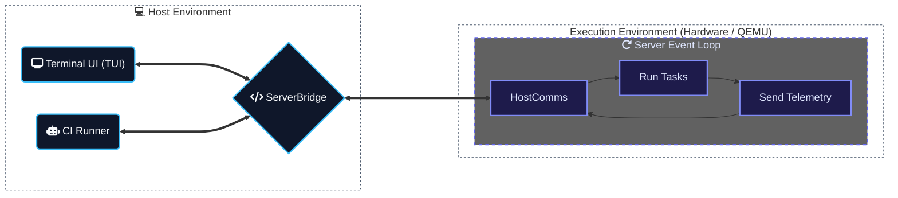

# control-rs

`control-rs` is a `no_std` Rust library for numerical modeling, control
synthesis, and real-time execution. It targets autonomous systems and bare-metal
embedded platforms.

---

## Infrastructure Overview



### 1. Embedded HIL Engine (`control-rs-hil`)

Located in [control-rs-hil](control-rs-hil), this
`no_std` crate provides the target-side infrastructure:

* **Interactive Test Server**: A lightweight event loop that executes test
  suites on request and streams results back.
* **Target Profiling**: Measures execution time using hardware cycle counters (
  ARM DWT) and tracks memory limits using stack painting and scanning.

### 2. Host Orchestration Driver (`control-rs-xtask`)

Located in [control-rs-xtask](control-rs-xtask),
this package runs on the developer's PC:

* **Interactive TUI**: A beautiful terminal dashboard built with `ratatui` to
  monitor live signals, trigger tests, tweak parameters, and view logs.
* **QEMU Bridge**: Automatically handles communications with emulated
  targets.
* **Headless Runner**: Automatically executes cross-compiled test suites and
  outputs performance metrics.

### 3. Continuous Integration (`.github/workflows/CI.yml`)

Automates the full validation pipeline:

* **Multi-Arch Emulation**: Spins up headless QEMU instances for both **ARM
  Cortex-M** (`thumbv7em-none-eabihf`) and **RISC-V** (
  `riscv32imac-unknown-none-elf`) targets.
* **Performance Telemetry**: Aggregates clippy status, test results, code
  coverage, cycle counts, and stack usage into a comprehensive PR/commit
  report (`ci-report.md`).

---

## Quickstart & Commands

Helpful cargo aliases are configured in [.cargo/config.toml](.cargo/config.toml)
to simplify development, testing, formatting, linting, and coverage reporting:

### Cargo Aliases Reference Table

| Category                               | Alias               | Underlying Command                                             | Description                                                         |
|:---------------------------------------|:--------------------|:---------------------------------------------------------------|:--------------------------------------------------------------------|
| **Development & UI**                   | `cargo xtask`       | `run --package control-rs-xtask --`                            | Runs the workspace's auxiliary build/test tasks.                    |
|                                        | `cargo tui`         | `cargo xtask tui`                                              | Launches the interactive TUI console dashboard.                     |
|                                        | `cargo ci`          | `cargo xtask ci`                                               | Runs the continuous integration suite locally.                      |
| **Target Execution (Interactive TUI)** | `cargo qemu`        | `cargo tui qemu`                                               | Launches the interactive TUI console targeting QEMU emulation.      |
|                                        | `cargo teensy`      | `cargo tui teensy`                                             | Launches the interactive TUI console targeting Teensy 4.0 hardware. |
| **Target Execution (CI/Headless)**     | `cargo qemu-ci`     | `cargo ci qemu`                                                | Performs headless CI verification targeting QEMU emulation.         |
|                                        | `cargo teensy-ci`   | `cargo ci teensy`                                              | Performs headless CI verification targeting Teensy 4.0 hardware.    |
| **Formatting**                         | `cargo fmt-all`     | `fmt --all`                                                    | Automatically formats all Rust files in the workspace.              |
|                                        | `cargo fmt-check`   | `fmt --all -- --check`                                         | Checks that all files conform to formatting rules.                  |
| **Linting**                            | `cargo lint`        | `clippy --workspace --lib --bins --tests --examples --benches` | Runs Clippy lints across all packages and targets.                  |
|                                        | `cargo clippy-json` | `cargo lint --message-format=json`                             | Runs Clippy lints and outputs findings in JSON format.              |
|                                        | `cargo clippy-ci`   | `cargo clippy-json -- -D warnings`                             | Runs Clippy CI lints, treating all warnings as compiler errors.     |
| **Coverage**                           | `cargo coverage`    | `tarpaulin --verbose --workspace`                              | Measures test code coverage via `cargo-tarpaulin`.                  |
|                                        | `cargo coverage-ci` | `cargo coverage --color never --out Html --out Json`           | Runs coverage in CI mode, exporting reports in HTML and JSON.       |

### 1. Interactive Testing (Host TUI)

Launch the Ratatui control dashboard. Select tests, run them, and adjust
parameters in real time.

```bash
  $> cargo tui
  
┌ control-rs HIL Console ─────────────────────────────────────────────────────────────────────────────────────────────┐
│ TARGET: QEMU (cortex-m7) | LINK: Semihosting (mps2-an500)                                                           │
└─────────────────────────────────────────────────────────────────────────────────────────────────────────────────────┘
┌ Test Suites & Config Settings ────────────────────────────────┐┌ Target Console / RTT Logs ─────────────────────────┐
│▼ test_axioms                                                  ││[Host] Connected to target. Triggering discovery... │
│  ├─ [ ---- ] test_addition_commutativity                      ││[Host] Discovery complete.                          │
│  ├─ [ ---- ] test_multiplication_commutativity                ││                                                    │
│  ├─ [ ---- ] test_distributivity                              ││                                                    │
│  ├─ [ ---- ] test_identities                                  ││                                                    │
│  ├─ [ ---- ] test_comparisons                                 ││                                                    │
│▼ test_basics                                                  ││                                                    │
│  ├─ [ ---- ] test_new                                         ││                                                    │
│  ├─ [ ---- ] test_from_real                                   ││                                                    │
│  ├─ [ ---- ] test_from_imag                                   ││                                                    │
│  ├─ [ ---- ] test_polar_creation                              ││                                                    │
│  ├─ [ ---- ] test_polar_conversion                            ││                                                    │
│▼ test_core_math                                               ││                                                    │
└───────────────────────────────────────────────────────────────┘└────────────────────────────────────────────────────┘
┌ Keyboard Commands ──────────────────────────────────────────────────────────────────────────────────────────────────┐
│(r)un all | (s)top execution | (f)ilter tests | (Enter) edit/run/toggle | (d)escription | (q)uit                     │
└─────────────────────────────────────────────────────────────────────────────────────────────────────────────────────┘
```

* **Launch TUI for QEMU Emulator (default target: cortex-m7, mps2-an500):**
  ```bash
  cargo qemu # target: arm-none-eabihf, semihosting
  cargo tui qemu risc-v # target: risc-v32, virt
  ```
* **Launch TUI for Physical Teensy 4.0 Hardware:**
  ```bash
  cargo teensy
  ```

### 2. Continuous Integration & Verification

Run the exact verification steps performed by the GitHub Actions pipeline
locally (clippy, formatting, tarpaulin coverage, and QEMU HIL tests).

* **Run all checks (ARM & RISC-V QEMU):**
  ```bash
  cargo ci
  ```
* **Run checks for specific targets:**
  ```bash
  cargo qemu-ci
  cargo teensy-ci
  ```
* **Run workspace code coverage analysis:**
  ```bash
  cargo coverage      # Detailed console coverage
  cargo coverage-ci   # Export HTML and JSON reports (headless CI style)
  ```

---

## Installation

```toml
[dependencies]
control-rs = { git = "https://github.com/Dyse-Industries/control-rs.git" }
```

The crate's tooling requires multiple toolchains be installed:

```bash
rustup target add thumbv7em-none-eabihf riscv32imac-unknown-none-elf
```

## License

Licensed under the MIT license.
