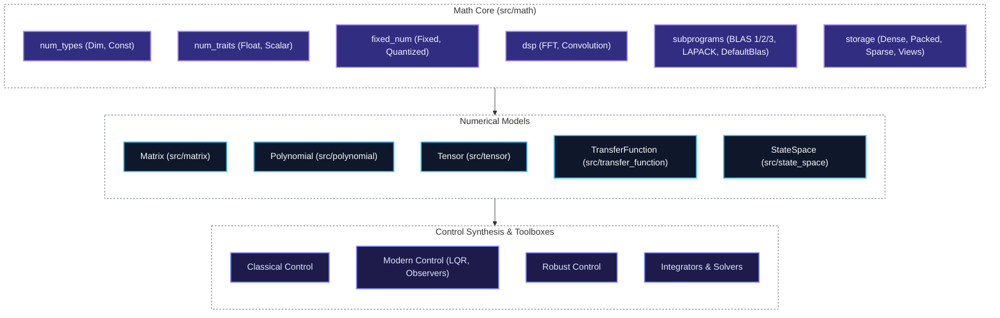

# control-rs

`control-rs` is a high-assurance, `#![no_std]`-first Rust library for numerical
modeling, control synthesis, and real-time execution, targeting autonomous
systems, robotics, and bare-metal embedded flight computers.

---

## Features

- **Static Math Types & Trait Hierarchy** — Type-level dimension arithmetic
  ([`Dim`], [`Const<N>`] via canonical binary type trees), zero-cost algebraic
  traits ([`Float`], [`Scalar`], [`Radical`], [`Conjugate`], etc.), float
  underflow/precision-loss detection, fixed-point arithmetic with IEEE 754
  convergent rounding ([`Fixed`], [`Quantized`]), and complex numbers
  ([`Complex`]).
- **Decoupled Storage Subsystem** — Unified storage abstractions across
  stack-allocated owned buffers ([`ArrayStorage`], [`RowArrayStorage`]),
  zero-copy strided views ([`StorageView`], [`StorageViewMut`],
  [`StaticStorageView`]), packed triangular/symmetric layouts
  ([`TriangularPackedStorage`], [`SymmetricPackedStorage`],
  [`HermitianPackedStorage`]), and sparse formats ([`ArrayCsrStorage`],
  [`ArrayCscStorage`], [`ArrayCooStorage`]) in pure `#![no_std]`.
- **Hardware-Accelerable Subprograms** — Standardized trait hierarchy covering
  BLAS Level 1/2/3, Packed BLAS, Sparse BLAS, and LAPACK direct solvers
  ([`DefaultBlas`]), ready for zero-cost hardware acceleration (ARM NEON,
  CMSIS-DSP, RISC-V NMSIS-DSP, AVX2/FMA, Apple Accelerate).
- **Core Numerical Models** — Zero-alloc [`Matrix`], [`Polynomial`],
  [`Tensor`], [`TransferFunction`], and [`StateSpace`] with static dimension
  checking, zero-copy submatrix/slice views, and unified storage backends.
- **Robust Algorithms & Numerical Stability** — Muller/Higham stabilized
  quadratic root solving, Aberth–Ehrlich polynomial root finding, Padé [6/6]
  scaling-and-squaring matrix exponential ([`expm`]), invariant-enforcing
  triangular/symmetric wrappers, and Van Loan exact ZOH series integration.
- **Cross-Language Validation & ETS** — Comprehensive 4-quadrant verification
  suite cross-checking 100% agreement against Python oracles (NumPy, SciPy,
  JAX, Harold, and 256-bit ball arithmetic via Python-Flint), plus bare-metal
  runners on ARM Cortex-M and RISC-V via [`control-rs-ets`](control-rs-ets).

---

## Numerical Models

`control-rs` is built around five storage-backed numerical primitives:

| Model | Storage & Capacity | Applications | Key Capabilities & Algorithms |
|:---|:---|:---|:---|
| **[`Matrix`](src/matrix/)** | `Storage<T, R, C>` | Kalman filtering (EKF), state-space, linear systems | BLAS 1/2/3, LU with partial pivoting, LDL^T, Cholesky, Householder QR, direct triangular solvers (`UpperTriangular`, `LowerTriangular`, `Symmetric`), Padé [6/6] Matrix Exponential (`expm`), submatrix slicing |
| **[`Polynomial`](src/polynomial/)** | `Storage<T, N, 1>` | Filtering, trajectory generation, root-finding | Ascending-power representation, real/complex Horner evaluation, analytic calculus, DSP convolution (`mul_poly`), Euclidean division (`div_rem`), cubic & quintic splines, bilinear discretization (`compose_bilinear`), Muller/Higham stabilized quadratic roots, Aberth–Ehrlich root finder |
| **[`Tensor`](src/tensor/)** | `FlatBuffer<T>` | Flight lookup tables, gain scheduling, embedded inference | N-D static shapes (`Shape1D`–`Shape4D`), multilinear continuous hypercube grid interpolation (`interpolate`), tensor contraction (`contract_into` via GEMM), axis permutation, activations (`Relu`, piecewise LUT `TableActivation`), fixed-point quantized operations |
| **[`TransferFunction`](src/transfer_function/)** | Polynomial-backed | Classical SISO $H(s)$ & $H(z)$ control loops | Rational transfer functions, complex frequency response (`eval_frequency`, `bode_point`), companion matrix pole & zero extraction, series/parallel/feedback block algebra, canonical state-space realizations (CCF & OCF), pre-warped Tustin & ZOH discretization |
| **[`StateSpace`](src/state_space/)** | Matrix-backed | Multivariable LTI systems, observers, simulation | Continuous ($\dot{x}=Ax+Bu$) & discrete ($x_{k+1}=Ax_k+Bu_k$) dynamics, step simulation, continuous derivatives, series/parallel/feedback interconnections with algebraic loop detection, exact ZOH & Tustin discretization, similarity transforms, controllability/observability matrices, Faddeev–LeVerrier transfer function conversion |

---

### Crate Architecture



---

## Quickstart Examples

### 1. Discrete State-Space Step Simulation

```rust
use control_rs::matrix::Owned;
use control_rs::state_space::ArrayStateSpace;

// Continuous inverted pendulum / harmonic oscillator
let a = Owned::<f64, 2, 2>::from_row_arrays([[0.0, 1.0], [-4.0, -0.8]]);
let b = Owned::<f64, 2, 1>::from_column([0.0, 1.0]);
let c = Owned::<f64, 1, 2>::from_row([1.0, 0.0]);
let d = Owned::<f64, 1, 1>::scalar(0.0);

let sys_c = ArrayStateSpace::continuous(a, b, c, d);

// Exact Zero-Order Hold (ZOH) discretization
let sys_d = sys_c.to_discrete_zoh(0.05);

let mut x = Owned::<f64, 2, 1>::zero();
let u = Owned::<f64, 1, 1>::scalar(1.0);

// Advance 1 discrete time step
let (x_next, y) = sys_d.step(&x, &u);
```

### 2. Rational Transfer Function Frequency Response & Canonical Realization

```rust
use control_rs::transfer_function::ArrayTransferFunction;

// 2nd-order lowpass filter: H(s) = 4 / (s^2 + 2s + 4)
// Ascending coefficient order: [4.0] / [4.0, 2.0, 1.0]
let tf = ArrayTransferFunction::<f64, 1, 3>::continuous([4.0], [4.0, 2.0, 1.0]);

// Evaluate frequency response at omega = 2.0 rad/s
let (mag, phase_rad) = tf.bode_point(2.0);

// Extract complex poles (companion matrix roots)
let poles = tf.poles().expect("stable denominator");

// Convert directly into Controllable Canonical Form (CCF)
let ss_ccf = tf.to_controllable_canonical_form::<2>()
    .expect("proper transfer function");
```

### 3. Fixed-Point Quantization & Multilinear Tensor Lookup

```rust
use control_rs::tensor::{ArrayTensor, Quantized};

// Q7 fixed-point representation with convergent rounding
type Q7 = Quantized<i8, 7>;
let q = Q7::quantize(0.75);
assert_eq!(q.raw(), 96); // 0.75 * 128 = 96

// 2D Gain scheduling table over a 2x2 grid
let table = ArrayTensor::<f32, 2, 2>::from_raw([[1.0, 2.0], [3.0, 4.0]]);
let val = table.interpolate(&[0.5, 0.5]);
assert_eq!(val, 2.5);
```

---

## Validation & Hardware Acceleration

### Multi-Oracle Verification Suite
Located in [`examples/numerical-models-validation/`](examples/numerical-models-validation/), this suite performs automated cross-validation against external reference engines:
- **Matrix & Linear Algebra**: Cross-validated with **SciPy** (`scipy.linalg`) and **JAX** (x64 CPU backend).
- **Polynomials**: Evaluated against **SciPy** and **Python-Flint** (256-bit ball arithmetic for Wilkinson conditioning).
- **State-Space & Transfer Functions**: Cross-checked against **SciPy** (`scipy.signal`) and **Harold**.
- **Tensors & Activations**: Compared against **SciPy** exact functions and **TensorFlow Lite** int8 quantized kernels.

### Standalone Subprogram Backends
Architecture-specific subprogram crates under [`examples/subprograms/`](examples/subprograms/) implement `control_rs::math::subprograms` traits:
- `subprograms/aarch64`: ARM NEON & Apple Accelerate
- `subprograms/x86_64`: AVX2 + FMA & CBLAS
- `subprograms/thumbv7em`: ARM CMSIS-DSP
- `subprograms/riscv32imac`: RISC-V NMSIS-DSP

---

## Links & Documentation

- [Development Guide & Cargo Aliases](documentation/development-guide.md)
- [Examples & Host Validation Guide](examples/README.md)
- [Embedded Test Server (ETS)](control-rs-ets)
- [Workspace Task Runner & TUI](control-rs-xtask)

## Installation

Add to your `Cargo.toml`:

```toml
[dependencies]
control-rs = { git = "https://github.com/Dyse-Industries/control-rs.git" }
```

## License

Licensed under the MIT OR Apache-2.0 license.

