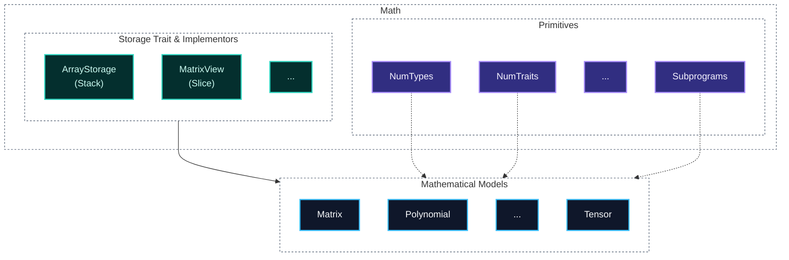

# control-rs

`control-rs` is a `no_std` Rust library for numerical modeling, control
synthesis, and real-time execution, targeting autonomous systems and
bare-metal embedded platforms.

## Features

- **Static Math Types and Traits** - Modified forks of
  [`num-traits`](https://github.com/rust-num/num-traits),
  [`num-complex`](https://github.com/rust-num/num-complex) and
  [`type-num`](https://github.com/paholg/typenum).
- **Core Numerical Primitives** — `Polynomial`, `Matrix`, and `Tensor`, that
  do not alloc and reject size mismatches at compile time.
- **LTI System Models** — `TransferFunction` and `StateSpace`, built on the
  primitives above, with continuous/discrete support and ZOH/Tustin
  discretization.
- **SIL/HIL Testing** — Built-in Hardware-in-the-Loop engine
  ([`control-rs-hil`](control-rs-hil)) for verifying custom software on target
  hardware or QEMU.

## Models

`control-rs` is built around three core numerical primitives — `Polynomial`,
`Matrix`, and `Tensor` — each rigidly bounded to respect embedded hardware
constraints. `TransferFunction` and `StateSpace` are built on top of these
primitives to represent LTI control systems directly.

| Model                | Capacity Limit        | Primary Applications                                               | Key Algorithms & Mechanics                                                  |
|----------------------|-----------------------|--------------------------------------------------------------------|-----------------------------------------------------------------------------|
| **Polynomial**       | 128 elements          | Signal filtering, trajectory generation, discretization.           | Horner's Method (FMA optimized), Tustin transform.                          |
| **Matrix**           | 32x32 (1024 elements) | State-space modeling, observability, MIMO systems.                 | Type-level dimensions, division-free Faddeev-LeVerrier `$p(x)=\det(xI-A)$`. |
| **Tensor**           | 1024 elements total   | Spatial grid modeling, Edge AI, multi-dimensional LTI.             | Column-major sequencing, in-place contraction (`contract_into`).            |
| **TransferFunction** | `Polynomial`-bound    | SISO/MIMO rational transfer functions $H(s)$, $H(z)$.              | Direct storage-backed Horner evaluation, series/parallel/feedback algebra.  |
| **StateSpace**       | `Matrix`-bound        | Continuous/discrete LTI state-space models, Kalman filtering, LQR. | Zero-copy `MatrixView` composition, ZOH/Tustin discretization.              |

### Crate Architecture



---

## Links

- Development workflow, cargo aliases, and architecture diagrams:
  [documentation/development_guide.md](documentation/development-guide.md)
- HIL server internals: [control-rs-hil](control-rs-hil)
- Host-side TUI and task runner: [control-rs-xtask](control-rs-xtask)

## Installation

```toml
[dependencies]
control-rs = { git = "https://github.com/Dyse-Industries/control-rs.git" }
```

## License

Licensed under the MIT license.
