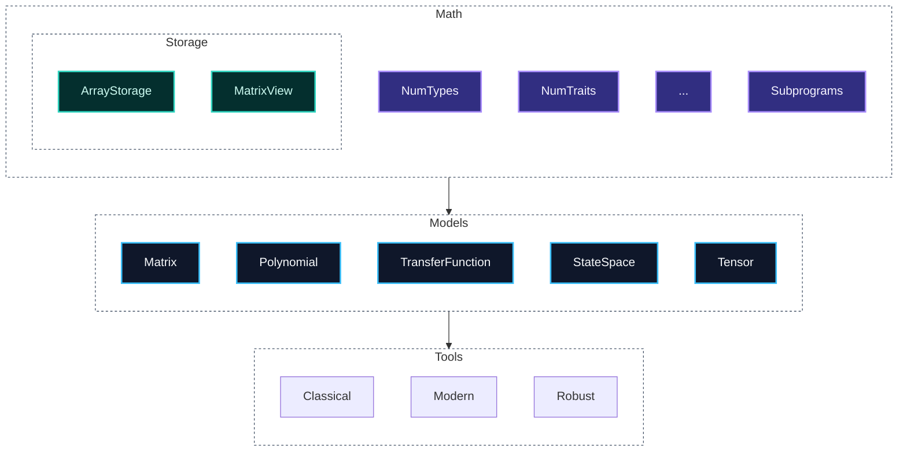

# control-rs

`control-rs` is a `no_std` Rust library for numerical modeling, control
synthesis and real-time execution, targeting autonomous systems and
bare-metal embedded platforms.

## Features

- **Static Math Types & Traits** — Modified forks of
  [`num-traits`](https://github.com/rust-num/num-traits),
  [`num-complex`](https://github.com/rust-num/num-complex) and
  [`typenum`](https://github.com/paholg/typenum).
- **Core Numerical Primitives** — Zero-alloc `Polynomial`, `Matrix` and `Tensor`
  with size mismatches rejected at compile time.
- **LTI System Models** — `TransferFunction` and `StateSpace` with
  continuous/discrete support.
- **SIL / HIL Testing** — Built-in Hardware-in-the-Loop engine
  ([`control-rs-hil`](control-rs-hil)) for target hardware and QEMU.

## Models

`control-rs` is built around three core numerical primitives — `Polynomial`,
`Matrix` and `Tensor`.

| Model                | Capacity         | Applications                            | Algorithms                                           |
|:---------------------|:-----------------|:----------------------------------------|:-----------------------------------------------------|
| **Polynomial**       | 1024 coeffs      | Filtering, trajectories, discretization | Horner (FMA), Tustin                                 |
| **Matrix**           | 128×128          | State-space, observability, MIMO        | Type-level dims, Faddeev–LeVerrier $p(x)=\det(xI-A)$ |
| **Tensor**           | 1024 elems       | Spatial grids, Edge AI, multi-dim LTI   | Column-major layout, in-place `contract_into`        |
| **TransferFunction** | Polynomial-bound | SISO/MIMO $H(s)$, $H(z)$                | Storage-backed Horner; series / parallel / feedback  |
| **StateSpace**       | Matrix-bound     | Continuous/discrete LTI, Kalman, LQR    | Zero-copy `MatrixView`; ZOH / Tustin                 |

### Crate Architecture



---

## Links

- Development workflow, cargo aliases and architecture diagrams:
  [documentation/development_guide.md](documentation/development-guide.md)
- HIL server internals: [control-rs-hil](control-rs-hil)
- Host-side TUI and task runner: [control-rs-xtask](control-rs-xtask)

## Installation

```toml
[dependencies]
control-rs = { git = "https://github.com/Dyse-Industries/control-rs.git" }
```

## License

Licensed under the MIT license.
