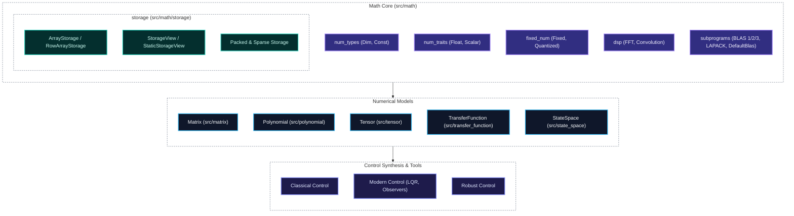

# control-rs

`control-rs` is a `no_std` Rust library for numerical modeling, control
synthesis and real-time execution, targeting autonomous systems and
bare-metal embedded platforms.

## Features

- **Static Math Types & Traits** — Type-level dimensions ([`Dim`], [`Const<N>`]), zero-cost numeric traits ([`Float`], [`Scalar`], [`Radical`], etc.), fixed-point arithmetic with convergent rounding ([`Fixed`], [`Quantized`]), and complex numbers ([`Complex`]).
- **Storage Subsystem** — Decoupled storage backends ([`ArrayStorage`], [`RowArrayStorage`], [`StaticStorageView`], [`TriangularPackedStorage`], [`CsrStorage`]) providing zero-copy column-major, row-major, packed, and sparse layouts in `#![no_std]`.
- **Hardware-Accelerable Subprograms** — Full BLAS Level 1/2/3, Packed BLAS, Sparse BLAS, and LAPACK direct solvers ([`DefaultBlas`]), ready for CMSIS/NMSIS drop-in acceleration via generic engine traits.
- **Core Numerical Models** — Zero-alloc [`Matrix`], [`Polynomial`], [`Tensor`], [`TransferFunction`], and [`StateSpace`] with static dimension checking and unified storage.
- **Host Tests and Embedded Test Server (ETS)** — Comprehensive host test suite and property tests, plus bare-metal runner across ARM Cortex-M and RISC-V targets via [`control-rs-ets`](control-rs-ets).

## Models

`control-rs` is built around five storage-backed numerical primitives.

| Model                | Storage & Capacity       | Applications                            | Key Capabilities & Algorithms                                      |
|:---------------------|:-------------------------|:----------------------------------------|:-------------------------------------------------------------------|
| **Matrix**           | `Storage<T, R, C>` (128×128) | State-space, Kalman filtering, MIMO     | BLAS Level 1/3 operators, LU, LDL^T, Cholesky, Householder QR      |
| **Polynomial**       | `Storage<T, N, 1>` (1024) | Filtering, trajectories, root-finding   | Horner evaluation, calculus (deriv/integ), DSP convolution, companion matrix |
| **Tensor**           | `FlatBuffer<T>` (1024)   | Flight lookup tables, Edge AI inference | Multilinear grid interpolation, convergent `Quantized` fixed-point, activations |
| **TransferFunction** | Polynomial-backed        | SISO $H(s)$, $H(z)$ control loops       | Series, parallel, frequency response (Bode), controllable canonical form |
| **StateSpace**       | Matrix-backed            | Continuous/discrete LTI, observers      | Step simulation, continuous derivative, Taylor ZOH discretization, similarity transforms |

### Crate Architecture



---

## Links

- Development workflow, cargo aliases and architecture diagrams:
  [documentation/development_guide.md](documentation/development-guide.md)
- How to run examples, prototypes, subprogram backends, and ETS firmware:
  [examples/README.md](examples/README.md)
- ETS internals: [control-rs-ets](control-rs-ets)
- Host-side TUI and task runner: [control-rs-xtask](control-rs-xtask)

## Installation

```toml
[dependencies]
control-rs = { git = "https://github.com/Dyse-Industries/control-rs.git" }
```

## License

Licensed under the MIT license.
