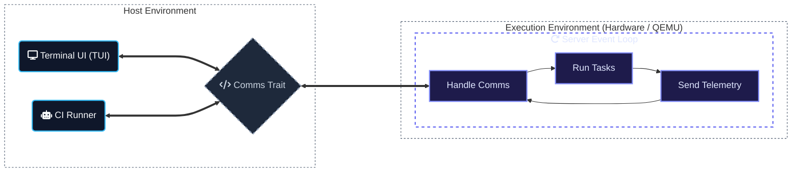

# control-rs

`control-rs` is a `no_std` Rust library for numerical modeling, control
synthesis, and real-time execution. It targets autonomous systems and bare-metal
embedded platforms.

---

## Data-Driven Model-Based Design

Instead of treating system identification as an offline chore, control-rs
provides the no-std, low-level infrastructure required to embed parameter
estimation loops directly onto target silicon within your Hardware-in-the-Loop (
HIL) pipelines.

`control-rs` enables a complete Model-Based Design (MBD) pipeline. By unifying
hardware execution, real-time telemetry, and host-side driver tooling, the
library transitions control design from offline simulation to live, on-target
hardware execution.



### 1. Embedded HIL Engine (`control-rs-hil`)

Located in [control-rs-hil](file:///home/mdyson/control-rs/control-rs-hil), this
`no_std` crate provides the target-side infrastructure:

* **Interactive Test Server**: A lightweight event loop that executes test
  suites on request and streams results back.
* **XOR-Checksum Framing**: Bidirectional postcard-serialized command/telemetry
  streaming over arbitrary transports (USB CDC ACM, UART, Semihosting).
* **Target Profiling**: Measures execution time using hardware cycle counters (
  ARM DWT) and tracks memory limits using stack painting and scanning.

### 2. Host Orchestration Driver (`control-rs-xtask`)

Located in [control-rs-xtask](file:///home/mdyson/control-rs/control-rs-xtask),
this package runs on the developer's PC:

* **Interactive TUI**: A beautiful terminal dashboard built with `ratatui` to
  monitor live signals, trigger tests, tweak parameters, and view logs.
* **QEMU Emulator Bridge**: Automatically handles communications with simulated
  targets.
* **Headless Runner**: Automatically executes cross-compiled test suites and
  outputs performance metrics.

### 3. Continuous Integration (`.github/workflows/CI.yml`)

Automates the full validation pipeline:

* **Multi-Arch Emulation**: Spins up headless QEMU instances for both **ARM
  Cortex-M** (`thumbv7em-none-eabihf`) and **RISC-V** (
  `riscv32imac-unknown-none-elf`) targets.
* **Performance Telemetry**: Aggregates clippy status, test results, code
  coverage, cycle counts, and stack usage into a comprehensive PR/commit
  report (`ci-report.md`).

---

## Quickstart & Commands

Helpful cargo aliases are configured
in [.cargo/config.toml](file:///home/mdyson/control-rs/.cargo/config.toml) to
simplify development:

### 1. Interactive Testing (Host TUI)

Launch the Ratatui control dashboard. Select tests, run them, and adjust
parameters in real time.

* **For QEMU Emulator (ARM):**
  ```bash
  cargo qemu
  ```
* **For Physical Teensy 4.0 Hardware:**
  ```bash
  cargo teensy
  ```

### 2. Continuous Integration & Verification

Run the exact verification steps performed by the GitHub Actions pipeline
locally (clippy, formatting, tarpaulin coverage, and QEMU HIL tests).

* **Run all checks (ARM & RISC-V QEMU):**
  ```bash
  cargo ci
  ```
* **Run checks for specific targets:**
  ```bash
  cargo ci-qemu
  cargo ci-teensy
  ```
* **Run workspace code coverage analysis:**
  ```bash
  cargo coverage
  ```

---

## Library Features

* **Static Dimensions:** Storage dimensions are calculated at compile-time. No
  heap allocation; zero-cost bounds checking.
* **Robust Arithmetic:** Strict algebraic traits (`Scalar`, `Ring`, `Field`) and
  fallible operations (`try_add`, `try_mul`) prevent undefined behavior.
* **Backend-Agnostic BLAS:** BLAS operations are generic traits. Hardware
  backends (e.g., ARM NEON, CMSIS-DSP) are injected at compile-time.

## Installation

```toml
[dependencies]
control-rs = { git = "https://github.com/Dyse-Industries/control-rs.git" }
```

## License

Licensed under the MIT license.