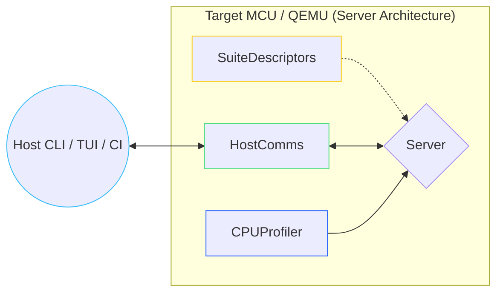

# control-rs-hil

`control-rs-hil` is the target-side (embedded, `no_std`) core library for the
Hardware-in-the-Loop (HIL) testing and benchmarking infrastructure of
`control-rs`.

## Purpose

The purpose of this crate is to provide target-side abstractions, communication
framing, and the interactive test server event loop. It enables control systems
developers to test their algorithms directly on embedded hardware (or within
emulators like QEMU) and collect real-time telemetry, panic logs, and execution
cycle/time benchmarks without dynamic memory allocations (`no_std`).

## Role in the Ecosystem



`control-rs-hil`:

1. **Defines core abstractions** (`CPUProfiler` and `HostComms` traits) for
   hardware communication, timing, and CPU profiling.
2. **Implements packet framing** using a robust CRC-16 checksum binary protocol.
3. **Hosts the server event loop** which processes incoming execution commands
   from the host, executes target tests, and streams back telemetry.

## End-User Example

Developers use `control-rs-hil` by defining a target-side transport (such as a
UART interface) and CPU profiling utilities, and then passing them into the
runner context.

Here is an example implementation:

```rust
#![no_std]
#![no_main]

use control_rs_hil::comms::{Command, FrameReader, HostComms, Telemetry, frame_telemetry};
use control_rs_hil::server::Context;
use control_rs_hil::CPUProfiler;
use control_rs_macros::{hil_setup, hil_suite};

// 1. Define target-side communication channel (e.g., UART or Semihosting)
struct UartComms {
    reader: FrameReader,
}

impl HostComms for UartComms {
    type Error = ();

    fn poll_command(&mut self) -> Result<Option<Command>, Self::Error> {
        // Retrieve byte from hardware peripheral non-blockingly
        if let Some(byte) = read_uart_byte() {
            if let Some(payload) = self.reader.handle_byte(byte) {
                if let Ok(cmd) = postcard::from_bytes(payload) {
                    return Ok(Some(cmd));
                }
            }
        }
        Ok(None)
    }

    fn send_telemetry(&mut self, telemetry: &Telemetry<'_>) -> Result<(), Self::Error> {
        let mut buf = [0u8; 512];
        if let Ok(len) = frame_telemetry(telemetry, &mut buf) {
            for &byte in &buf[..len] {
                write_uart_byte(byte);
            }
            Ok(())
        } else {
            Err(())
        }
    }

    fn flush(&mut self) -> Result<(), Self::Error> {
        Ok(())
    }
}

// 2. Define target-side CPU profiling utilities
struct SystemCPUUtils;

impl CPUProfiler for SystemCPUUtils {
    fn get_cycles(&self) -> u64 {
        get_cycles()
    }

    fn get_nanos(&self) -> u64 {
        get_nanoseconds()
    }

    fn get_sp(&self) -> usize {
        get_sp()
    }

    unsafe fn paint_stack(&self, sp: usize) {
        // Hardware stack painting logic
    }

    unsafe fn read_stack_peak(&self, sp: usize) -> u32 {
        // Hardware stack peak scanning logic
        0
    }
}

// Helper stub functions
fn read_uart_byte() -> Option<u8> { None }
fn write_uart_byte(_b: u8) {}
fn get_cycles() -> u64 { 0 }
fn get_nanoseconds() -> u64 { 0 }
fn get_sp() -> usize { 0 }

// 3. Declare a test suite
#[hil_suite]
pub mod pid_control_suite {
    pub static TARGET_HEADING: u32 = 180;

    fn test_step_response() {
        // Test logic using target settings
        assert!(TARGET_HEADING.get() == 180);
    }
}

// 4. Initialize HIL runner server
#[hil_setup]
fn setup() -> Context<UartComms, SystemCPUUtils> {
    Context::new(
        UartComms { reader: FrameReader::new() },
        SystemCPUUtils,
    )
}
```

## QA / Testing

To ensure that the target-side abstractions, serialization, and compilation
build correctly, execute the following commands:

### Target Compilation Check

Verify that the crate compiles successfully for the thumbv7em target
architecture (configured in `Cargo.toml` / QEMU profile):

```bash
cargo check --package control-rs-hil --target thumbv7em-none-eabihf
```

### Workspace Unit Tests

Ensure HIL serialization/deserialization logic behaves correctly under host-side
unit testing:

```bash
cargo test --package control-rs-hil
```