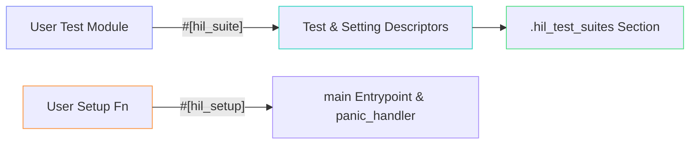

# control-rs-macros

`control-rs-macros` provides procedural macros that simplify test registration
and entrypoint generation for target-side Hardware-in-the-Loop (HIL) test suites
in the `control-rs` library.

## Purpose

The purpose of this crate is to automate the boilerplates of bare-metal embedded
test setups. Declaring a HIL test suite requires setting up memory sections,
registering function pointers, defining static descriptors, exporting symbols to
linker scripts, and configuring custom low-level panic handlers.
`control-rs-macros` encapsulates these behaviors behind clean, declarative Rust
attributes.

## Role in the Ecosystem



Within the `control-rs` ecosystem, `control-rs-macros`:

1. **Translates static variables** in a module into atomic settings that can be
   queried and modified dynamically by the host TUI or CI (via `#[hil_suite]`).
2. **Registers all module functions** as test executables inside a suite
   descriptor array (via `#[hil_suite]`).
3. **Generates the main entrypoint** (`#[entry] fn main() -> !`) and links the
   target-side runner loop automatically (via `#[hil_setup]`).
4. **Implements the low-level target panic handler** that captures stack
   assertions/panics, sends failure telemetry to the host bridge, and resets the
   target safely (via `#[hil_setup]`).

## End-User Example

Using `control-rs-macros`, a developer can set up an executable test image with
minimal code:

```rust
#![no_std]
#![no_main]

use control_rs_hil::comms::Command;
use control_rs_hil::runner::Context;
use control_rs_hil::time::DummyClock;
use control_rs_macros::{hil_setup, hil_suite};

// A simulated transport channel
struct DummyComms;
impl control_rs_hil::comms::HostComms for DummyComms {
    type Error = ();
    fn poll_command(&mut self) -> Result<Option<Command>, Self::Error> { Ok(None) }
    fn send_telemetry(&mut self, _t: &control_rs_hil::comms::Telemetry<'_>) -> Result<(), Self::Error> { Ok(()) }
    fn flush(&mut self) -> Result<(), Self::Error> { Ok(()) }
}

// 1. Declare the test suite and adjustable settings
#[hil_suite]
pub mod control_loop_tests {
    // These static variables are converted into Atomic settings
    pub static PROPORTIONAL_GAIN: u32 = 100;
    pub static INTEGRAL_GAIN: u32 = 20;

    fn test_system_stability() {
        let p_gain = PROPORTIONAL_GAIN.get();
        let i_gain = INTEGRAL_GAIN.get();

        assert!(p_gain > i_gain, "Proportional gain must be greater than integral gain");
    }
}

// 2. Define target-side peripherals setup and launch the runner
#[hil_setup]
fn setup() -> Context<DummyComms, DummyClock> {
    Context {
        comms: DummyComms,
        timer: DummyClock,
    }
}
```

## QA / Testing

Procedural macros are evaluated during compilation. To verify macro expansion
works and compile-time structures align with target and host configurations:

### Macro Verification

Run the compiler checks across the macros crate to verify parsing and expansion
logic:

```bash
cargo check --package control-rs-macros
```

### End-To-End Workspace Check

Run `cargo check` on the root workspace with `hil` feature enabled to check that
macro output compiles correctly under both target and host targets:

```bash
cargo check --workspace --all-targets --all-features
```