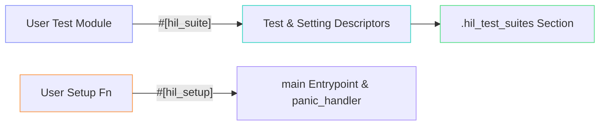

# control-rs-macros

`control-rs-macros` provides procedural macros that simplify test registration
and entrypoint generation for target-side Hardware-in-the-Loop (HIL) test suites
in the `control-rs` library.

## Purpose

The purpose of this crate is to automate the boilerplates of bare-metal embedded
test setups. Declaring a HIL test suite requires setting up memory sections,
registering function pointers, defining static descriptors, exporting symbols to
linker scripts, and configuring custom low-level panic handlers.
`control-rs-macros` encapsulates these behaviors behind clean, declarative Rust
attributes.

## Role in the Ecosystem



`control-rs-macros`:

1. **Translates static variables** into atomic settings that can be
   queried and modified by the host.
2. **Registers all module functions** as executables inside a suite
   descriptor array (via `#[hil_suite]`).
3. **Generates the main entrypoint** (`#[entry] fn main() -> !`) and links the
   target-side runner loop automatically.
4. **Implements the low-level target panic handler** that captures stack
   assertions/panics, sends failure telemetry to the host bridge, and resets the
   target safely.

## End-User Example

Using `control-rs-macros`, a developer can set up an executable test image with
minimal code:

```rust
#![no_std]
#![no_main]

use control_rs_hil::comms::Command;
use control_rs_hil::runner::Context;
use control_rs_hil::time::DummyClock;
use control_rs_macros::{hil_setup, hil_suite};

// A simulated transport channel
struct DummyComms;
impl control_rs_hil::comms::HostComms for DummyComms {
    type Error = ();
    fn poll_command(&mut self) -> Result<Option<Command>, Self::Error> { Ok(None) }
    fn send_telemetry(&mut self, _t: &control_rs_hil::comms::Telemetry<'_>) -> Result<(), Self::Error> { Ok(()) }
    fn flush(&mut self) -> Result<(), Self::Error> { Ok(()) }
}

// 1. Declare the test suite and adjustable settings
#[hil_suite]
pub mod control_loop_tests {
    // These static variables are converted into Atomic settings
    pub static PROPORTIONAL_GAIN: u32 = 100;
    pub static INTEGRAL_GAIN: u32 = 20;

    fn test_system_stability() {
        let p_gain = PROPORTIONAL_GAIN.get();
        let i_gain = INTEGRAL_GAIN.get();

        assert!(p_gain > i_gain, "Proportional gain must be greater than integral gain");
    }
}

// 2. Define target-side peripherals setup and launch the runner
#[hil_setup]
fn setup() -> Context<DummyComms, DummyClock> {
    Context {
        comms: DummyComms,
        timer: DummyClock,
    }
}
```

## QA / Testing

Procedural macros are evaluated during compilation. To verify macro expansion
works and compile-time structures align with target and host configurations:

### Macro Verification

Run the compiler checks across the macros crate to verify parsing and expansion
logic:

```bash
cargo check --package control-rs-macros
```

### End-To-End Workspace Check

Run `cargo check` on the root workspace with `hil` feature enabled to check that
macro output compiles correctly under both target and host targets:

```bash
cargo check --workspace --all-targets --all-features
```

## Inspecting & Verifying the Linker Section

When using procedural macros like `#[hil_suite]` and `#[hil_setup]`, the test
registration pointers are stored in a dedicated linker section named
`.hil_test_suites`. You can inspect this section and verify its pointers using
`cargo-binutils`.

### 1. Inspecting the Section with `cargo-binutils`

First, install `cargo-binutils` and the LLVM tools if you haven't already:

```bash
cargo install cargo-binutils
rustup component add llvm-tools
```

Build your binary for the target. For example, to build the QEMU-based firmware
example:

```bash
CARGO_TARGET_THUMBV7EM_NONE_EABIHF_RUSTFLAGS="-C link-arg=-Tlink.x -C link-arg=-Thil_suites.x" \
  cargo build --package control-rs-hil --bin control-rs-qemu-arm --target thumbv7em-none-eabihf --profile qemu
```

#### A. Checking Section Sizes with `cargo size`

To see if the `.hil_test_suites` section exists and find its address range, run:

```bash
cargo size --package control-rs-hil --target thumbv7em-none-eabihf --profile qemu --bin control-rs-qemu-arm -- -A -x
```

In the output, look for the `.hil_test_suites` entry:

```text
section                 size      addr
.ARM.exidx              0x10   0x100f4
.hil_test_suites         0x4   0x10104
.rodata                0x9f0   0x10108
```

#### B. Reading Raw Pointer Bytes with `cargo objdump`

To print the hexadecimal contents of the `.hil_test_suites` section:

```bash
cargo objdump --package control-rs-hil --target thumbv7em-none-eabihf --profile qemu --bin control-rs-qemu-arm -- --section=.hil_test_suites -s
```

This will output the raw bytes stored in the section:

```text
Contents of section .hil_test_suites:
 10104 c4050100                             ....
```

### 2. Confirming Section Addresses are Valid

To verify that the address pointers stored inside `.hil_test_suites` are valid:

1. **Decode the address**: Convert the raw bytes from the little-endian output
   of `cargo objdump` into a standard memory address.
    - For example, the bytes `c4050100` translate to `0x000105c4` (or
      `0x105c4`).
2. **Verify bounds**: Ensure this address resides inside the `.rodata` section (
   which stores the actual
   static [SuiteDescriptor](src/lib.rs)
   structs generated by the macros).
    - From `cargo size`, `.rodata` spans from `0x10108` to `0x10af8` (
      `0x10108 + 0x9f0`). Since `0x10108 <= 0x105c4 < 0x10af8`, the pointer
      points to a valid read-only memory region.
3. **Inspect the symbol table**: Check what symbol is located at that address
   using `cargo nm`:
   ```bash
   cargo nm --package control-rs-hil --target thumbv7em-none-eabihf --profile qemu --bin control-rs-qemu-arm | grep 000105c4
   ```
   You should see the target-side `SUITE_DESCRIPTOR` symbol matching that
   address:
   ```text
   000105c4 r control_rs_qemu_arm::qemu_math_suite::SUITE_DESCRIPTOR::h5aa33b1373e62446
   ```
   This confirms the `.hil_test_suites` pointer is valid and correctly
   references the generated suite descriptor.