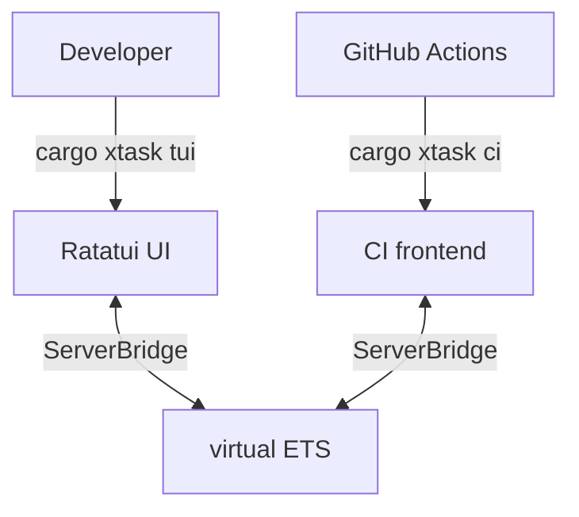

# control-rs-xtask

`control-rs-xtask` is the host-side orchestration and user interface package for
the `control-rs` repository.

## Purpose

The purpose of this crate is to provide CLI and GUI tools to interact with,
monitor, build and test embedded binaries. It hosts:

1. **The Server Bridge** (`bridge.rs`) which communicates with the target binary
   using the Postcard binary framing protocol.
2. **The Terminal User Interface** (`tui.rs`), built on `ratatui` and
   `crossterm`, which allows developers to run tests, inspect cycle counters,
   tweak controller settings and read logs interactively.
3. **The CI frontend** (`main.rs`) which drives virtual ETS (QEMU) or ETS
   (board) through `ServerBridge`, runs the target's suite, and writes
   `ci-report.md` and `ets-results.json`.

## Role in the Ecosystem



Within the `control-rs` ecosystem, `control-rs-xtask` represents the "host
driver":

- It acts as the orchestration framework, invoking cross-compilers (
  `cargo build --target thumbv7em-none-eabihf`), code linters (`clippy`), test
  coverages (`tarpaulin`) and launching `qemu-system-arm`.
- It converts raw target bytes into structured Rust `Telemetry` messages and
  serializes developer controls into `Command` byte streams sent to the target.

## End-User Example

Developers run `control-rs-xtask` using standard `cargo run` wrapper commands.

### 1. Launching the Interactive TUI

To control a simulated target and monitor live cycles/duration metrics, execute:

```bash
cargo run --package control-rs-xtask -- tui
```

*Key Bindings:*

- `r`: Runs all tests.
- `s`: Stops any running test queue.
- `f`: Filters test cases by name query.
- `Enter`: Triggers the selected test or toggles the selected configuration
  setting.
- `q`: Quits the TUI console.

### 2. CI → virtual ETS

To execute the automated lints, host-side unit tests, line coverage checks and
CI → virtual ETS (QEMU):

```bash
cargo run --package control-rs-xtask -- ci
```

This command generates the `ci-report.md` file summarizing formatted test
outputs, clippy errors, coverage percentages and the detailed cycles and
execution times of all target tests.

### 3. Launching QEMU Manually

To build and start the QEMU system emulator target binary directly in standard
semihosting console mode, run:

```bash
cargo run --package control-rs-xtask -- qemu
```

## QA / Testing

Because `control-rs-xtask` runs on the host system, it can be tested directly
with standard cargo commands:

### Host Compilation Check

Ensure the bridge, main command logic and TUI compile cleanly on the host
target:

```bash
cargo check --package control-rs-xtask
```

### Execution Verification

To run the full validation suite including CI → virtual ETS (QEMU):

```bash
cargo run --package control-rs-xtask -- ci
```

Verify that `ci-report.md` is successfully generated in the root of the
workspace and contains no clippy errors or failed test summaries.
