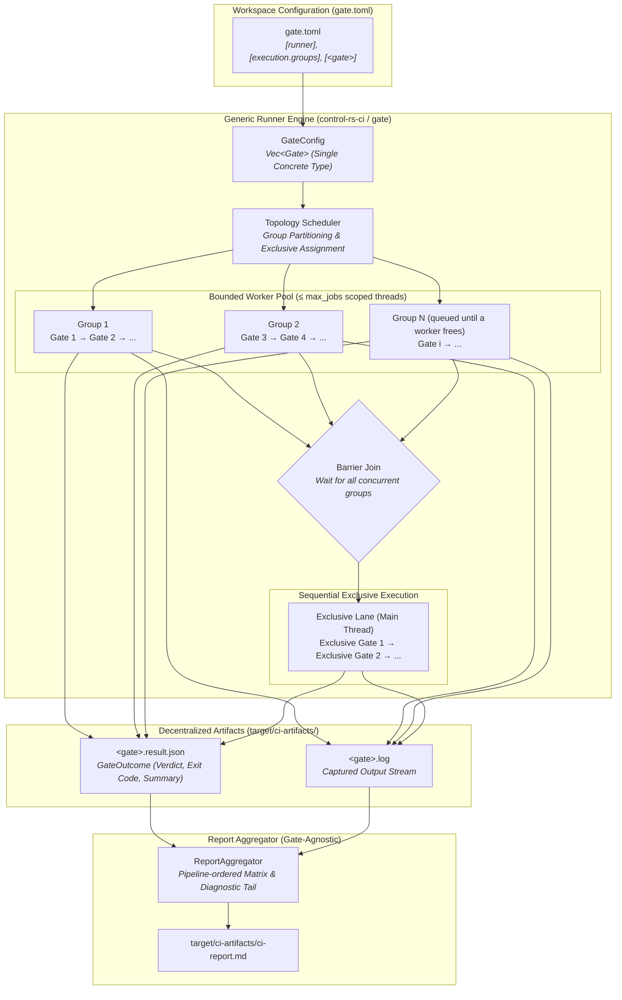

# Continuous Integration & Quality Gate Infrastructure (Design Document)


---

### 1. Introduction

High-assurance control systems and embedded firmware require verifiable,
reproducible, and automated quality gating. `control-rs-ci` provides a modular
quality gate runner, report aggregator, and verification harness for
`control-rs` and downstream safety-critical embedded systems.

The gating and reporting infrastructure follows a **generic gate runner,
minimal-parsing design principle**:

- **Generic Gate Runner & Zero Gate Dependence**: The gate running engine has
  zero hardcoded dependence on specific gate names or behaviors. The earlier
  concept of "built-in" gates is obsolete; every quality gate is defined
  uniformly by its declarative configuration in `gate.toml`.
- **Single Concrete Gate Type**: All quality gates use a single concrete `Gate`
  struct without trait abstractions (`QualityGate`), dynamic dispatch
  (`dyn QualityGate`), or struct proliferation. Every gate executes via the same
  concrete process lifecycle.
- **Uniform Command & Argument Configuration**: Each gate in `gate.toml`
  declares its executable and base subcommand via `command` (for example,
  `"cargo clean"`, `"cargo fmt"`, `"cargo clippy"`, `"cargo deny"`, `"vale"`),
  optional additional arguments via `args`, optional `description`, and optional
  environment variables via `env`. Subcommands are not repeated in `args`: for
  `[clean]`, `command = "cargo clean"` requires no extra arguments (`args = []`
  or omitted), eliminating redundant `args = ["clean"]`.
- **Process Isolation & Log Separation**: Gates execute underlying tools without
  intermediate schema translation. Full `stdout` and `stderr` streams are
  captured to a dedicated log file (`target/ci-artifacts/<gate>.log`), and
  tool-native JSON or data files stay in their native format at the path set by
  the gate's `args`.
- **Standardized Execution Outcomes**: Gates record structured execution
  metadata (`GateOutcome`: gate name, verdict, duration, exit code, summary, and
  log path) written to `target/ci-artifacts/<gate>.result.json`.
- **Zero-Parsing Minimalist Aggregation**: The report aggregator
  (`control-rs-ci report`) operates generically, rendering
  `target/ci-artifacts/ci-report.md` directly from `GateOutcome` records and
  tool logs without requiring specialized per-gate code.
- **Multi-Lane Parallel Scheduling**: Independent execution groups execute
  concurrently on a bounded worker pool (`max_jobs`), while exclusive gates
  execute sequentially following a barrier join.
- **Gate Opacity**: The runner knows a gate only by its declared command,
  arguments, environment, working directory, timeout, policy and default
  selection, and by the exit status and artifacts it produces. Internal parallelism, sharding and output formats
  belong to the gate's own arguments.

---

### 2. Requirements

#### 2.1 Functional Requirements

- **FR-1 — Generic Gate Execution**: The runner must execute any quality gate
  declared in `gate.toml` under `[<gate>]`, supporting compiler checks, linters,
  tests, coverage, security audits, and user-defined verification harnesses.
- **FR-2 — Single Concrete Gate Model**: All quality gates must be represented
  and executed via a single concrete `Gate` type without gate-specific traits,
  subtypes, or dynamic dispatch.
- **FR-3 — Declarative Workspace Configuration (`gate.toml`)**: Runner settings,
  execution groups, exclusive gates, and individual gate execution definitions
  must be declared in a workspace-root `gate.toml` without hardcoded fallback
  vectors in runner source code.
- **FR-4 — Subcommand & Flag Economy**: The runner must parse compound command
  strings (for example `command = "cargo clean"`) and optional argument vectors
  (`args`) without forcing repetition of subcommand names in arguments.
- **FR-5 — Process & Log Stream Isolation**: Every gate must stream 100% of its
  `stdout` and `stderr` output to `target/ci-artifacts/<gate>.log` and record
  standardized metadata to `target/ci-artifacts/<gate>.result.json`.
- **FR-6 — Structured Tool Degradation**: Absence or failure of an external tool
  must surface as a structured warning in `GateOutcome` and log a diagnostic to
  `<gate>.log` rather than aborting or panicking when the gate policy is `warn`.
- **FR-7 — Bounded Execution Timeouts**: Target executions and host gates must
  execute under explicit wall-clock bounds, terminating hung processes cleanly.
- **FR-8 — Multi-Lane Parallel Execution**: The runner must support partitioning
  quality gates into independent concurrent execution groups declared in
  `gate.toml` (`[execution.groups]`), executing groups concurrently across
  worker threads while preserving sequential execution within each group.
- **FR-9 — Exclusive Processor Authority Barriers**: Gates requiring
  unrestricted access to CPU, memory bandwidth, or Cargo locks must declare
  membership in `exclusive_gates`. The runner must drain and join all active
  background group threads before dispatching exclusive gates sequentially.
- **FR-10 — Fail-Closed Report Aggregation**: The report aggregator
  (`control-rs-ci report`) must derive overall pipeline success strictly from
  gate policies applied to `GateOutcome` verdicts. Any missing, corrupt, or
  failing fail-closed gate must fail the aggregator with a non-zero exit code.
- **FR-11 — Artifact Relocation & Cleanup**: All CI outputs must be written
  exclusively to `target/ci-artifacts/`. The runner and CLI tools must provide
  clean operations (`cargo ci clean`, `cargo gate clean`,
  `cargo report --clean`) to remove previous artifacts.
- **FR-12 — Attributed Live Output**: On request (`-v`/`--verbose`), the runner
  must echo every line of each gate's `stdout` and `stderr` to the console as it
  is produced, prefixed with the gate's execution group and name, while still
  satisfying FR-5.
- **FR-13 — Bounded Group Concurrency**: The runner must bound the number of
  concurrently executing groups by a limit declared in `gate.toml`
  (`[execution] max_jobs`) and overridable on the command line
  (`--max-jobs <n>`), defaulting to the number of declared groups. Groups beyond
  the limit must start in declaration order as running groups complete.
- **FR-14 — Gate Argument Passthrough**: The `gate` binary must append
  user-supplied arguments following a `--` separator to the argument vector of
  exactly one selected gate, after the gate's configured `args`, without
  inspecting or rewriting them. A passthrough with zero or more than one
  selected gate must fail before any gate executes.
- **FR-15 — Selection Independent of Policy**: Whether a gate runs in an
  unfiltered invocation (`default`) and how its verdict counts (`mode`) must be
  declared separately. A gate with `default = false` is left out of an
  unfiltered `cargo ci` but runs under its declared `mode` when selected by
  name or group. `mode = "skip"` disables a gate: it never executes, and an
  explicit selection records `Verdict::Skipped`. A selected `fail` gate whose
  result is missing fails the invocation, as in FR-10.
- **FR-16 — Process-Tree Termination**: A gate that exceeds its timeout must be
  terminated together with every descendant process it started, so no build,
  benchmark or emulator outlives the gate that launched it.
- **FR-17 — Bare-Metal Target Build**: The pipeline must compile the target
  firmware for every embedded target declared in `gate.toml`, including targets
  that CI cannot execute (Teensy 4.1), and fail when any build fails.
- **FR-18 — Virtual Target Execution**: The pipeline must build the ETS
  firmware for every QEMU target declared in `gate.toml`, run its suites to
  completion through `control-rs-ets-host` under a per-target wall-clock bound,
  and record test outcomes, cycle counts, wall-clock duration ($\mu\text{s}$)
  and stack peak watermarks in `target/ci-artifacts/ets-results.json`.
- **FR-19 — Non-Zero Exit on Empty or Incomplete Verification**: A target run
  that executes zero tests, leaves queued tests pending, aborts (timeout,
  reset budget, send or reconnect failure, target exit) or reports a failed
  test must exit non-zero, preventing false passes from misconfigured targets
  or filters.

#### 2.2 Non-Functional Requirements

- **NFR-1 — Zero Continuous Allocation**: The runner software operates with zero
  persistent allocation overhead during execution.
- **NFR-2 — Outcome Schema Stability**: The `GateOutcome` JSON schema and
  Markdown report structure (`ci-report.md`) must remain stable and versioned
  across releases.
- **NFR-3 — Headless Dependency Floor**: The runner's dependency closure must
  contain zero GUI, terminal-event, or interactive styling crates.

#### 2.3 Constraints

- **C-1 — Step Summary Size Budget**: `ci-report.md` is budgeted
  to $\le 64\,\text{KiB}$ for human readability and fast PR rendering, with an
  absolute platform ceiling of 1 MiB ($1{,}048{,}576$ bytes) imposed by GitHub
  Actions step summaries [1].
- **C-2 — Single MSRV Baseline**: All host tooling and runner crates must
  conform to the workspace `rust-version`.
- **C-3 — Advisory / Fail-Closed Agreement**: Workflow jobs marked
  `continue-on-error` must match gates configured as `warn`. A fail-closed gate
  (`fail`) must not be bypassed.
- **C-4 — Gate Opacity**: The runner depends only on a gate's declared
  `command`, `args`, `env`, `cwd`, `timeout_secs`, `mode` and `default`, and on
  its exit status and produced artifacts. The runner must not inject, parse or rewrite gate
  arguments or environment to control a gate's internal behavior (for example
  worker counts, shard selection or output format).
- **C-5 — Target Architectures**: Embedded targets are ARM Cortex-M
  (`thumbv7em-none-eabihf`, `thumbv7em-none-eabi`) and RISC-V
  (`riscv32imac-unknown-none-elf`, `riscv64gc-unknown-none-elf`) under QEMU,
  and the NXP i.MX RT1062 (Teensy 4.1, `thumbv7em-none-eabihf`) as a build-only
  target. Host tooling runs on `x86_64` and `aarch64`.
- **C-6 — Indicative Emulation Timing**: Virtual QEMU execution is indicative
  only and does not model microarchitectural cache or bus contention. Cycle
  counts from QEMU are recorded, never gated; precise timing requires physical
  hardware runners (roadmap PR9).

---

### 3. Technical Overview

`control-rs-ci` decouples quality gate execution from report generation while
minimizing parsing overhead. Gates execute concurrently across dedicated worker
threads or sequentially under exclusive authority:



Developers retain single-command local verification through `cargo ci` or
targeted gate execution (`cargo gate`).

---

### 4. Architecture

#### 4.1 Crate & Binary Structure

`control-rs-ci` provides a core library (`lib.rs`) containing generic gate
dispatch, configuration parsing, scheduler coordination, artifact cleanup, and
report rendering logic. The package exposes focused binary targets:

| Binary / Command | Alias              | Responsibility                                                                                         |
|:-----------------|:-------------------|:-------------------------------------------------------------------------------------------------------|
| `control-rs-ci`  | `cargo ci`         | Monolithic coordinator and quality gate runner                                                         |
| `gate`           | `cargo gate`       | Targeted quality gate execution (`--only`, `--skip`, `--up-to`) and argument passthrough (`-- <args>`) |
| `report`         | `cargo report`     | JSON artifact aggregator rendering `ci-report.md`                                                      |
| `regression`     | `cargo regression` | Performance regression evaluator and benchmark budget harness                                          |
| `allow-audit`    | (gate only)        | Clippy suppression ratchet against `.cargo/clippy-allow-baseline.txt` (§4.10)                          |
| `valgrind`       | `cargo valgrind`   | Multi-example Valgrind Memcheck memory leak and safety runner                                          |
| `ets`            | `cargo ets`        | Headless ETS runner: builds target firmware and runs its suites through `control-rs-ets-host` (§4.9)  |

`cargo ci` and `cargo gate` share one option set: `--group`, `--only`, `--skip`,
`--up-to`, `--config`, `--clean`, `--all`, `--list`, `--max-jobs` and `-v`/
`--verbose`. Only `cargo gate` accepts a `--` separator (§4.8); `cargo ci`
rejects it. Without `--verbose` the console shows status lines only and gate
output goes to the log alone; with it, gate output is also echoed live (§4.4).
GitHub Actions invokes every lane with `--verbose`, so each gate's output
appears in its step console.

#### 4.2 Concrete Gate Model & Lifecycle

Every quality gate is represented by a single concrete `Gate` struct:

```rust
#[derive(Debug, Clone, PartialEq, Serialize, Deserialize)]
pub struct GateOutcome {
    pub gate: String,
    pub verdict: Verdict,                // Pass | Warn | Fail | Skipped
    pub exit_code: Option<i32>,
    pub duration_secs: f64,
    pub summary: Option<String>,
    pub log_file: String,               // e.g. "fmt.log"
}

#[derive(Debug, Clone, Copy, PartialEq, Eq, Serialize, Deserialize)]
#[serde(rename_all = "lowercase")]
pub enum Verdict {
    Pass,
    Warn,
    Fail,
    Skipped,
}

/// Generic declarative gate definition parsed from `gate.toml`.
#[derive(Debug, Clone, PartialEq, Eq, Serialize, Deserialize)]
pub struct GateDefinition {
    /// Command string to execute (e.g., `"cargo clean"`, `"cargo fmt"`, `"vale"`).
    pub command: String,
    /// Optional additional command arguments.
    #[serde(default)]
    pub args: Vec<String>,
    /// Optional human-readable description for reports.
    #[serde(default)]
    pub description: Option<String>,
    /// Optional environment variable overrides.
    #[serde(default)]
    pub env: std::collections::HashMap<String, String>,
    /// Execution mode / policy (`fail`, `warn`, `skip`); `fail` when omitted.
    #[serde(default)]
    pub mode: Option<GatePolicy>,
    /// Whether an unfiltered `cargo ci` selects this gate (FR-15).
    #[serde(default = "default_true")]
    pub default: bool,
    /// Working directory relative to the workspace root.
    #[serde(default)]
    pub cwd: Option<PathBuf>,
    /// Wall-clock bound; `[runner] timeout_secs` when omitted.
    #[serde(default)]
    pub timeout_secs: Option<u64>,
    /// Exit codes reported as `Verdict::Skipped`.
    #[serde(default)]
    pub skip_exit_codes: Vec<i32>,
}

/// The single, concrete quality gate type used for all gates.
#[derive(Debug, Clone)]
pub struct Gate {
    pub name: String,
    pub command: String,
    pub args: Vec<String>,
    pub description: Option<String>,
    pub env: std::collections::HashMap<String, String>,
}

impl Gate {
    pub fn name(&self) -> &str { &self.name }
    pub fn description(&self) -> Option<&str> { self.description.as_deref() }
    pub fn command_display(&self) -> String { ... }
    pub fn execute(&self, ctx: &GateContext) -> Result<GateOutcome, GateError> { ... }
}
```

The gate execution lifecycle follows a zero-overhead process runner pattern:

1. **Command String Decomposition**: The `command` string defines the executable
   and base subcommand (for example, `"cargo clean"`, `"cargo fmt"`,
   `"cargo clippy"`, `"cargo deny"`, `"cargo semver-checks"`, `"vale"`). Initial
   whitespace-separated tokens are split into the binary and initial arguments.
2. **Argument Concatenation**: Any flags in `args` are appended to the
   invocation. Subcommands are not repeated in `args`: for `[clean]`,
   `command = "cargo clean"` requires no extra arguments (`args = []` or
   omitted), completely eliminating redundant `args = ["clean"]`. Arguments
   passed through `cargo gate <gate> -- <args>` are appended last (§4.8). The
   runner treats every argument as opaque (C-4).
3. **Log Redirection**: Every gate redirects `stdout` and `stderr` directly into
   its dedicated log file (`target/ci-artifacts/<gate>.log`). With `-v`/
   `--verbose`, the runner reads both streams through pipes, writes each line to
   the same log and echoes it to `stderr` behind a `[<group>] <gate> | ` prefix.
   Line order is then preserved within each stream but not across the two
   streams. Pumps still draining 2 s after the gate exits are detached so that a
   surviving descendant holding the pipe cannot stall the pipeline.
4. **Native Artifacts**: Tools that write data files keep their native format at
   the path set in the gate's `args` (for example, `tarpaulin` writes
   `target/ci-artifacts/tarpaulin-report.json`). Tools that print JSON
   (`geiger`) leave it in `<gate>.log`. `vale` prints one alert per line
   (`--output=line`, `<path>:<line>:<col>:<check>:<message>`), so a log tail in
   the report shows whole alerts with their locations.
5. **Outcome Metadata**: Each gate writes a standardized `<gate>.result.json`
   containing the `GateOutcome`.
6. **Structured Degradation**: If an external executable or cargo subcommand is
   absent from the host, gates operating under `warn` policy log a diagnostic
   and record `Verdict::Warn` without failing the pipeline.
7. **Timeout and Tree Termination**: A gate that exceeds `timeout_secs` is
   terminated with its whole process tree (FR-16). The runner stops the gate
   process, then each descendant found through `pgrep -P`, top-down, so no
   stopped process can fork, and finally sends `SIGKILL` to every stopped
   process. Gates stay in the runner's process group, so a terminal interrupt
   still reaches them. The outcome is `Fail` (`Warn` under a `warn` policy)
   with the elapsed bound in the summary.

#### 4.3 Declarative Configuration (`gate.toml`)

All quality gates, runner settings, execution groups, and exclusive gates are
configured uniformly in `.cargo/gate.toml` (`--config` overrides the path):

```toml
[runner]
title = "control-rs"
out_dir = "target/ci-artifacts"
timeout_secs = 90

[execution]
max_jobs = 2    # optional: concurrent groups; default is the number of groups
exclusive_gates = [
    "regression",
    "mutants",
    "mutants-storage-0",
    # ... one entry per mutation chunk ...
    "mutants-rest",
    "mutants-ci-0",
    # ... one entry per workspace-crate mutation gate ...
    "mutants-tui",
]

[execution.groups]
build_test = ["build", "test"]
lint = ["fmt", "clippy", "allow-audit", "doc", "vale"]
audit = ["deny", "semver", "valgrind", "geiger"]
verify = ["cross-compare"]
coverage = ["coverage"]
target = ["target-build", "ets"]

[clippy]
mode = "fail"
command = "cargo clippy"
args = ["--workspace", "--all-targets", "--", "-D", "warnings"]
description = "Executes Clippy linter across workspace targets"

[vale]
mode = "fail"
command = "vale"
args = ["--config=.vale.ini", "--output=line", "documentation", "src", "..."]
description = "Lints documentation and doc comments for prose style conformity"

[target-build]
mode = "fail"
command = "cargo build"
args = ["--release"]
cwd = "examples/teensy4"
timeout_secs = 1800
description = "Builds firmware for embedded targets without an emulator (Teensy 4.1)"

[ets]
mode = "fail"
command = "cargo run"
args = ["--package", "control-rs-ci", "--bin", "ets", "--", "--timeout", "120", "qemu", "all", "--release"]
timeout_secs = 2400
description = "Builds QEMU ETS firmware and runs every suite headless on each target"

# Disabled: superseded by the mutants-* chunks.
[mutants]
mode = "skip"
command = "cargo mutants"
args = ["--json", "--output", "target/ci-artifacts/mutants.out"]

# Fail-closed, but only run when selected by name (one CI job per chunk).
[mutants-storage-0]
mode = "fail"
default = false
command = "cargo mutants"
args = ["--json", "-f", "src/math/storage.rs", "--shard", "0/5", "--output", "target/ci-artifacts/mutants-storage-0.out"]
timeout_secs = 19800

# Workspace crates: --no-config drops the root-only `--lib` filter.
[mutants-ci-0]
mode = "fail"
default = false
command = "cargo mutants"
args = ["--json", "--no-config", "--package", "control-rs-ci", "--shard", "0/2", "--output", "target/ci-artifacts/mutants-ci-0.out"]
timeout_secs = 19800

[regression]
mode = "fail"
default = false
command = "cargo run"
args = ["--package", "control-rs-ci", "--bin", "regression", "--", "--all", "--budgets", ".cargo/regression.toml"]
timeout_secs = 7200
```

The listing is abridged; `.cargo/gate.toml` is the complete configuration.
`mode` sets the policy and `default` the unfiltered selection (FR-15):

| `mode`  | `default` | Unfiltered `cargo ci` | Selected by name or group | Verdict counts   |
|:--------|:----------|:----------------------|:--------------------------|:-----------------|
| `fail`  | `true`    | runs                  | runs                      | blocks on `Fail` |
| `fail`  | `false`   | not run               | runs                      | blocks on `Fail` |
| `warn`  | either    | as `default`          | runs                      | never blocks     |
| `skip`  | ignored   | not run               | recorded `Skipped`        | never blocks     |

`--all` selects every gate whose `mode` is not `skip`, including
`default = false` gates. `cwd` is resolved against the workspace root.

Mutation testing covers the root package in `mutants-<file>-<k>` chunks and
each workspace tool crate in its own gate: `mutants-ci-0`/`-1` (sharded),
`mutants-compare`, `mutants-ets-host`, `mutants-ets`, `mutants-macros` and
`mutants-tui`. The root `.cargo/mutants.toml` restricts mutation to `--lib`
for the root package only, so the workspace gates pass `--no-config`.
`control-rs-verification` is not mutated: it emits oracles that
`cross-compare` validates. The CI matrix runs one job per gate whose name
starts with `mutants-`.

#### 4.4 Concurrency Topology & Scheduling

The execution topology partitions active gates into two tiers:

1. **User-Defined Groups (`[execution.groups]`)**:
   Named concurrency lanes (for example, `cargo`, `audit`, `static`). The
   scheduler spawns $\min (\text{max\_jobs}, \text{groups})$ scoped worker
   threads via `std::thread::scope`. Workers pull groups from a shared queue in
   declaration order, so at most `max_jobs` groups run at once and a queued
   group starts when a running group completes. `max_jobs` resolves from
   `--max-jobs`, then `[execution] max_jobs`, then the number of declared
   groups; zero is a configuration error. `max_jobs` counts groups only: it does
   not constrain threads or processes a gate spawns internally, which the gate's
   own arguments control (C-4). Gates within a single group execute sequentially
   in their declared order. Output lines display colored group tags (for example
   `[cargo] `, `[audit] `, `[static] `). Each group runs with
   `CARGO_TARGET_DIR=target/ci-groups/<group>`, so concurrent groups never
   serialize on Cargo's build-directory lock. A gate whose `env` sets
   `CARGO_TARGET_DIR` keeps its own value. `--clean` deletes `target/ci-groups`.
   Exclusive gates use the default `target/`. One function,
   `run_group(name, gates, target_dir, ...)`, runs a gate list sequentially for
   both cases: each worker calls it with the different group's target
   directory, then the main thread calls it for the exclusive list with no
   target directory. The former `[execution] parallel` switch is removed; the
   key is ignored if present.
2. **Exclusive Group (`exclusive_gates` and Unassigned Gates)**:
   Gates requiring full processor authority (such as `geiger`, `cross-compare`,
   `valgrind`, `mutants`, `regression`) or any active gate omitted from
   `[execution.groups]`. The runner establishes a strict **barrier join**: all
   group threads must complete and join before exclusive gates begin. Exclusive
   gates execute strictly sequentially, one at a time, displaying the
   `[exclusive] ` tag.

With `-v`/`--verbose` (FR-12), every echoed output line carries the same group
tag followed by the gate name, so interleaved output from concurrent groups
remains attributable:

```text
     Running [lint] `cargo clippy --workspace --all-targets -- -D warnings`
     Running [verify] `cargo run --package control-rs-compare --bin compare -- --config .cargo/compare.toml`
[lint] clippy |     Checking control-rs v0.0.0
[verify] cross-compare |      Running matrix/rust (rust_bin)
[lint] clippy |     Finished `dev` profile [unoptimized + debuginfo] target(s) in 6.41s
      Passed [lint] clippy in 6.52s
```

The tag keeps the group's color and the gate name is dimmed. Both are stripped
when `stderr` is not a terminal or `CARGO_TERM_COLOR=never`, so CI logs stay
plain text. Each line is written to `stderr` in a single call, so lines from
different gates interleave but are never split.

#### 4.5 Report Aggregation & Artifact Protocol

`control-rs-ci report` operates as a gate-agnostic artifact aggregator producing
`target/ci-artifacts/ci-report.md`:

1. **Gate-Agnostic Outcome Ingestion**: The aggregator has zero compile-time
   dependencies on specific gates or internal gate modules. It scans
   `target/ci-artifacts/*.result.json` for generic `GateOutcome` instances.
2. **Preserved Pipeline Ordering**: To ensure intuitive and deterministic
   reporting, status table rows are sequenced by their declaration order in
   `gate.toml` (groups in declaration order, followed by exclusive gates and any
   unassigned gates), rather than random filesystem or alphabetical order.
3. **Generic Summary Matrix Rendering**: Each row renders the gate name, badge
   verdict (`**Pass**`, `*Warn*`, `**FAIL**`, `Skipped`), elapsed duration,
   process exit code, and the `summary` string from `GateOutcome.summary`. Any
   gate (standard cargo tool, shell script, or custom CLI) can supply arbitrary
   concise summary metrics without requiring custom report code.
4. **Policy Evaluation**: Evaluates all gate verdicts against declared policies
   in `gate.toml`. Any failed or omitted fail-closed gate causes the aggregator
   to exit non-zero (FR-10). `cargo report` requires every `fail` gate,
   `default = false` gates included. `cargo ci` with a selection requires every
   selected `fail` gate to have a non-failing result (FR-15).
5. **Decoupled Metric Reporting**: Gates provide arbitrary concise outcome
   summaries through their `GateOutcome.summary` field, rendered directly in the
   matrix without requiring custom parser logic in `report.rs`.
6. **Failure Diagnostics**: Embeds trailing log snippets (20–40 lines) from
   `<gate>.log` into expandable Markdown `<details>` sections for failing or
   warning gates.
7. **Size Budget**: Enforces $\le 64\,\text{KiB}$ maximum report size (C-1) by
   truncating embedded logs when necessary.

#### 4.6 Artifact Relocation & Cleanup

All CI artifacts reside under `target/ci-artifacts/`. Cleanup is supported via
`clean_artifacts`:

- Invoked via `cargo ci clean`, `cargo ci --clean`, `cargo gate clean`, or
  `cargo report --clean`.
- Recursively deletes `target/ci-artifacts/`.
- Removes legacy/stray root artifacts (`ci-report.md`, `mutants.out`,
  `tarpaulin-report.*`).

#### 4.7 Performance Regression Harness (`regression`)

Criterion benchmarks (`benches/jitter.rs`, `benches/scaling.rs`) compute
empirical timing distributions and confidence intervals, but exit with code 0 by
default even when performance degrades. To enforce hard real-time latency
deadlines and performance regression bounds within automated quality gates,
`control-rs-ci` provides a dedicated `regression` binary (`cargo regression`):

1. **Benchmark Execution**: The harness runs `cargo bench` itself (`--all` for
   every workspace bench target, `--bench <NAME>` for one) and reads Criterion's
   standard output, echoing each line. The workflow never runs benchmarks on the
   harness's behalf.
2. **Criterion Ingestion**: For every benchmark in the run, parses the
   identifier, the `time:` point estimate and, when Criterion compared against a
   baseline, the `change:` point estimate and Criterion's verdict. The verdict
   and its p-value exist only in this output; Criterion does not persist them.
3. **Timing Budget Verification**: Asserts the `time:` point estimate
   (Criterion's slope estimate, or the mean when no slope is available) against
   the budget registered for the benchmark in the TOML file named by
   `--budgets` (the gate passes `.cargo/regression.toml`, C-4). The `[budgets]`
   table maps a benchmark ID, or a prefix ending in `*`, to a duration with
   unit `ns`, `us`/`µs`, `ms` or `s` (for example
   `"jitter/state_space_step_response" = "10 us"`). An exact key wins, then the
   longest matching prefix. A benchmark with no matching key fails with
   `No budget registered`; an empty table or a non-positive duration is a
   configuration error. The harness resolves the workspace from the current
   directory, as the other gate binaries do.
4. **Statistical Regression Detection**: A benchmark regresses when Criterion
   reports `Performance has regressed.`: the change is significant ($p < 0.05$)
   and the confidence interval of the mean change lies above the noise
   threshold. The benches set the noise threshold to 15 % in their Criterion
   configuration. Criterion compares the new sample with
   `target/criterion/<benchmark_id>/base/`, then copies `new/` to `base/`. The
   baseline is the `target/criterion` artifact of the newest `main` run that
   uploaded it, whatever that run's conclusion, restored by
   `.github/actions/restore-baseline` before the gate runs, so one failed
   gate on `main` does not discard every baseline. A benchmark without a
   `change:` line has no baseline: the harness reports `no baseline` and checks
   the budget only; the absence is not a failure.
5. **Deterministic Fail-Closed Gating**: Emits exit code 0 if all monitored
   benchmarks satisfy budget and regression constraints, or exits non-zero with
   structured failure diagnostics, enabling fail-closed gating under
   `gate.toml`. A failed `cargo bench`, or output in which no benchmark parses,
   also exits non-zero.

#### 4.8 Gate Argument Passthrough

`cargo gate <gate> -- <args>...` runs one gate with `<args>` appended to its
argument vector after the configured `args`. The selection before `--` must
resolve to exactly one gate (a positional name or `--only <gate>`); zero or
several selected gates exit non-zero before any gate executes. The runner does
not inspect the appended arguments (C-4), so their meaning follows from the
gate's own configuration: for a gate whose `args` already end in `--` (for
example `clippy`), appended arguments reach the inner tool.

```text
cargo gate mutants -- --shard 3/8 --jobs 4
cargo gate test -- --test-threads 1
```

The passthrough lives in `cargo gate` only. `cargo ci` runs a pipeline of many
gates, where one argument list has no single target. The `Running` console line
prints the effective invocation, configured and appended arguments together,
through `Gate::command_display`.

#### 4.9 Target Build & Virtual ETS Execution (`ets`)

Two gates in the `target` group produce the embedded evidence (FR-17, FR-18):

- `target-build` compiles firmware that CI cannot execute. It runs
  `cargo build --release` with `cwd` set to the firmware crate, so the crate's
  own `.cargo/config.toml` supplies the target triple and linker scripts.
- `ets` runs the `ets` binary, which forwards its target arguments unchanged to
  `control_rs_ets_host::target::parse_targets`. The same target syntax as
  `cargo tui` applies (`qemu all`, `qemu arm riscv32`, `--target <triple>`,
  `teensy --port <path>`). Example crate paths come from that syntax and from
  `control-rs-ets-host`, never from `control-rs-ci` source.

For each target, `ets`:

1. Builds the firmware with `build_target_elf` before the session starts, so
   compilation time is bounded by the gate's `timeout_secs` and not by the
   session bound.
2. Runs `run_headless_ets_with_options` with `--timeout <secs>` (default 120)
   as the whole-session bound and `--max-resets <n>` (default 3).
3. Judges the `RunRecord` (FR-19): the target passes only when the run drained
   (`abort` is `None`), no case is pending, at least one case ran and every
   case reports `TestState::Passed`. `RunRecord` carries no verdict of its own;
   this rule is the consumer policy `ets-host-design.md` §4.6 assigns to CI.

`ets` writes `target/ci-artifacts/ets-results.json` (`--out <path>` overrides)
as a JSON array with one entry per target:

```json
[
  {
    "target": "ARM HF (thumbv7em-none-eabihf)",
    "passed": true,
    "reason": null,
    "error": null,
    "record": { "results": [ ... ], "pending": [], "resets": 0, "abort": null, "elapsed": { "secs": 4, "nanos": 0 }, "console": "..." }
  }
]
```

`error` carries a build, spawn or transport failure that prevented a
`RunRecord`. For each target the binary prints one `Pass` or `Fail` line per
executed case (`suite::test` with `time_us`, cycles and peak stack), the
captured target console in full (or `no output`), then the target verdict.
Lines appear when a target's session ends, not as cases complete. It exits
0 only when every target passes. Cycle counts are recorded, not gated (C-6).

#### 4.10 Suppression Ratchet (`allow-audit`)

New clippy suppressions are not accepted; the `allow-audit` gate enforces
this. It counts suppression sites per file and
lint: `#[allow]`, `#[expect]`, `cfg_attr` forms and `allow` levels in Cargo
manifests. `.cargo/clippy-allow-baseline.txt` holds one
`<path> clippy::<lint> <sites>` line per entry. The gate fails when:

1. a file and lint exceeds its count in the baseline, or appears with no entry;
2. a baseline entry exceeds the current count (stale), so removals must be
   recorded with `--write`;
3. with `--base-ref <ref>` (CI passes `origin/main`), an entry exceeds the
   baseline read from `<ref>` with `git show`, so a branch cannot raise the
   baseline and its code together. A line without a count in the base
   baseline reads as unbounded. An unreadable base ref exits 2.

The `lint` job checks out full history for `--base-ref`.

---

### 5. Alternatives

| Alternative                                             | Rejected Because                                                                                                                                                                                                                                                                           | Reference |
|:--------------------------------------------------------|:-------------------------------------------------------------------------------------------------------------------------------------------------------------------------------------------------------------------------------------------------------------------------------------------|:----------|
| **Trait Hierarchy (`QualityGate` + `dyn QualityGate`)** | Trait abstractions added structural complexity, boilerplate, and dynamic dispatch without benefit, as all quality gates share the exact same command execution and monitoring lifecycle.                                                                                                   |           |
| **Hardcoded Built-In Gates vs. Custom Gates Split**     | Hardcoding specific gate names and schemas in the runner prevented flexible argument configuration, created inconsistent TOML schemas, and forced code modifications in `control-rs-ci` for every new tool.                                                                                |           |
| **In-Tree Replacements for Standard Tools**             | Custom helper binaries that re-implement a standard tool (for example bespoke LOC scanners or git validators) bloat the codebase. Delegating to standard CLI tools (`git diff`, standard cargo subcommands) via `command` and `args` eliminates that code. Gate binaries with no standard equivalent (`valgrind`, `regression`, `ets`) remain: each is invoked only through its `gate.toml` entry, and the runner library never calls one (C-4). |           |
| **Monolithic Single-Runner CI**                         | Monolithic execution prevents parallel job fan-out in GitHub Actions, dramatically increasing PR cycle times.                                                                                                                                                                              | [1]       |
| **Runner-Injected Worker Counts**                       | Substituting a runner-derived value (for example `available_parallelism()`) into gate arguments assumes every gate accepts a worker count in a known form. Most gates do not, and the rest spell it differently, which violates C-4.                                                       |           |
| **Passthrough on `cargo ci`**                           | A single argument list has no unambiguous target across a multi-gate pipeline; per-gate passthrough syntax would duplicate `gate.toml`.                                                                                                                                                    |           |
| **Separate Process Group per Gate**                     | `setpgid` makes timeout termination a single `kill -<pgid>`, but moves the gate out of the terminal's foreground group, so an interactive interrupt stops the runner and orphans every running gate. Tree termination (§4.2) keeps interrupts working.                                   |           |
| **`default = false` Expressed as `mode = "skip"`**      | Overloads one field with two meanings, "not selected by default" and "never fails"; a selected skip gate could not fail its job, which violated C-3 for the mutation and regression jobs before revision 1.26.                                                                            |           |
| **Shell Script Orchestration**                          | Hand-rolled shell scripts drift across local and CI environments, lack structured artifact generation, and cannot provide compile-time shape verification or robust timeout isolation.                                                                                                     |           |

---

### 6. Verification & Validation

#### 6.1 Plan

| Kind   | Step                                  | Establishes                                                                                                                                                                                        |
|:-------|:--------------------------------------|:---------------------------------------------------------------------------------------------------------------------------------------------------------------------------------------------------|
| `test` | Gate Execution & Lifecycle Tests      | Dispatches command and arguments, tracks duration, captures stdout/stderr to `<gate>.log`, and records `<gate>.result.json`.                                                                       |
| `test` | Gate Configuration & Validation Tests | Verifies that all enabled gates require explicit configuration in `gate.toml` with zero hardcoded fallbacks.                                                                                       |
| `test` | Compound Command Parsing Tests        | Verifies compound command strings (for example `command = "cargo clean"`) execute correctly without redundant arguments.                                                                           |
| `test` | Multi-Lane Parallel Execution Tests   | Verifies concurrent group execution and barrier synchronization before exclusive gates.                                                                                                            |
| `test` | Bounded Concurrency Tests             | Verifies at most `max_jobs` groups overlap, queued groups start in declaration order, the default equals the group count, and `max_jobs = 0` is rejected (FR-13).                                  |
| `test` | Argument Passthrough Tests            | Verifies `cargo gate <gate> -- <args>` appends `<args>` verbatim after the configured `args`, that zero or several selected gates fail before execution, and that `cargo ci` rejects `--` (FR-14). |
| `test` | Artifact Cleanup Tests                | Verifies `clean_artifacts` removes `target/ci-artifacts/` and scrubs legacy workspace root files.                                                                                                  |
| `test` | Report Aggregation Tests              | Verifies `ci-report.md` generation, fail-closed policy enforcement, and size budget compliance ($\le 64\,\text{KiB}$).                                                                             |
| `test` | Tool Degradation Tests                | Verifies uninstalled tools log diagnostics and emit `Verdict::Warn` when policy is `warn`.                                                                                                         |
| `test` | Selection & Policy Tests              | Verifies `default = false` gates are left out of an unfiltered run and `--all` includes them, a selected `default = false` gate fails its invocation on `Fail`, a selected `skip` gate records `Skipped` without executing, and a missing selected `fail` result fails (FR-15). |
| `test` | Process-Tree Termination Tests        | Verifies a timed-out gate leaves no live descendant: a probe gate records the id of a background grandchild, which must be gone after the timeout (FR-16).                                    |
| `test` | ETS Verdict Tests                     | Verifies the `ets` verdict rule against drained, aborted, pending, empty and failed-case `RunRecord`s (FR-19).                                                                              |
| `test` | Verbose Echo Tests                    | Verifies `-v`/`--verbose` parsing, and that an echoed gate still records both streams in `<gate>.log` with the correct exit code and verdict (FR-5, FR-12).                                        |

#### 6.2 Acceptance

| Claim                             | Oracle                                | Measure         | Bound                                                                                          |
|:----------------------------------|:--------------------------------------|:----------------|:-----------------------------------------------------------------------------------------------|
| **Gate Exit Code Accuracy**       | Process Exit Status                   | Exact Equality  | Process returns code 0 on all-pass; non-zero on any fail-closed gate failure                   |
| **Log File Isolation**            | Filesystem Artifact                   | Exact Match     | 100% of process stdout/stderr stream is captured into `target/ci-artifacts/<gate>.log`         |
| **GateOutcome Metadata Accuracy** | Serialization Oracle                  | Exact Match     | `<gate>.result.json` matches actual process exit status and duration $\pm 50\,\text{ms}$       |
| **Execution Timeout Enforcement** | System Monotonic Clock                | Absolute Time   | Process terminated within $\pm 500\,\text{ms}$ of configured `timeout_secs`                    |
| **Group Concurrency Bound**       | Gate-written start and end timestamps | Maximum overlap | Concurrently running groups $\le$ `max_jobs` for every `max_jobs` in $\{1, 2, \text{groups}\}$ |
| **Passthrough Argument Fidelity** | argv recorded by a probe gate         | Exact Match     | Recorded argv equals configured `args` followed by the passthrough arguments, byte for byte    |
| **Descendant Termination**        | Process table after a timeout         | Live descendants | 0 within 2 s of the timeout                                                                    |
| **Virtual Target Coverage**       | `ets-results.json`                    | Targets reported | One passing entry per declared QEMU target, each with $\ge 1$ passed case and none pending     |
| **Target Firmware Build**         | `cargo build` exit status             | Exit code        | 0 for every declared build-only target                                                         |
| **Step Summary Size Budget**      | Serialized Byte Count                 | Absolute Size   | `ci-report.md` size $\le 64\,\text{KiB}$ target ($< 1\,\text{MiB}$ platform ceiling) [1]       |

#### 6.3 Limits

- Verification establishes host-level process orchestration and reporting
  correctness; target electrical timing and hardware execution require physical
  hardware runners.
- Physical-target execution (Teensy 4.1 over serial) is not run in CI; the
  `ets` binary accepts serial targets, and the runner itself belongs to roadmap
  PR9. Teensy 4.1 evidence is limited to the firmware build (FR-17).
- QEMU timing is indicative (C-6); `ets-results.json` cycle counts are not
  compared against any bound.
- The workspace mutation gates other than `mutants-macros` (0 missed) had no
  measured survivor count when added; mutation score is enforced, not
  established, until their first CI run.
- Process-tree termination depends on `pgrep`; where it is absent, only the
  direct gate process is killed.

---

### 7. Performance & Resource Considerations

- **Step Summary Limit**: `ci-report.md` is budgeted for $\le 64\,\text{KiB}$
  (typically 5–20 KiB) for responsive human inspection and stays strictly under
  the 1 MiB GitHub Actions limit [1].
- **Process & Timeout Bounds**: Gate processes are spawned with bounded timeouts
  (default 90s) to prevent hung runner instances.
- **Memory Footprint**: `control-rs-ci` operates with zero continuous memory
  allocation overhead; artifact ingestion streams JSON data directly to report
  renderers.

---

### 8. Risks & Open Questions

- **Toolchain MSRV Drift**: External cargo subcommands (`cargo-tarpaulin`,
  `cargo-deny`, `cargo-geiger`, `cargo-semver-checks`) must remain compatible
  with the workspace `rust-version`.
- **Newly Blocking Gates**: Revision 1.26 makes the mutation chunks and
  `regression` fail-closed. Their first runs may turn `main` red on surviving
  mutants or budget breaches that the former `skip` policy hid. Revision 1.27
  adds the same risk for the workspace-crate mutation gates and for
  benchmarks without a registered budget.
- **Emulator Availability**: `ets` fails when `qemu-system-*` or a rustup
  target is missing, consistent with fail-closed tool handling; a local
  `cargo ci` without them fails the `target` group.

---

### 9. Development Plan

| Phase / Task                                                  | Description                                                                                                                                                                                                 | Estimated Effort |
|:--------------------------------------------------------------|:------------------------------------------------------------------------------------------------------------------------------------------------------------------------------------------------------------|:-----------------|
| **Phase 1: Generic Gate Engine & Concrete Model**             | Implement single concrete `Gate` type, process spawning with stdout/stderr redirection, `GateOutcome` schema, generic `gate.toml` parser with no hardcoded gate fallbacks, and artifact cleanup operations. | 3                |
| **Phase 2: Generic Gate Configuration & Artifact Relocation** | Standardize all gate execution around declarative `command` and `args` in `gate.toml`, relocate all CI output strictly to `target/ci-artifacts/`, and update report aggregator.                             | 2                |
| **Phase 3: Multi-Lane Parallel Execution & Barrier Join**     | Implement declarative multi-lane parallel scheduler using `std::thread::scope`, `[execution.groups]` in `gate.toml`, and barrier synchronization for `exclusive_gates`.                                     | 3                |
| **Phase 4: Performance Regression Harness (`regression`)**    | Implement `regression` binary in `control-rs-ci`, Criterion output ingestion, budget threshold evaluation, and `gate.toml` gate integration.                                                                | 2                |
| **Phase 5: Bounded Concurrency & Argument Passthrough**       | Replace one-thread-per-group with a `max_jobs` worker pool over a group queue, add `--max-jobs`, and add `--` passthrough to `cargo gate` with single-gate validation.                                      | 2                |
| **Phase 6: Selection, Tree Termination & Target Gates**       | Split `default` from `mode` (FR-15) and require selected results; terminate process trees on timeout (FR-16); add `cwd`, the `target-build` gate and the `ets` binary and gate (FR-17 to FR-19); align CI jobs. | 3                |

---

### 10. Revision History

| Revision | Date               | Author          | Description                                                                                                                                                                                                                                                                       |
|:---------|:-------------------|:----------------|:----------------------------------------------------------------------------------------------------------------------------------------------------------------------------------------------------------------------------------------------------------------------------------|
| 1.0      | May 24, 2026       | @MitchellDScott | Initial CI design document.                                                                                                                                                                                                                                                       |
| 1.5      | September 13, 2026 | @MitchellDScott | Decentralized tool architecture: split into standalone binaries backed by reusable `lib.rs` and JSON artifact exchange protocol.                                                                                                                                                  |
| 1.10     | September 20, 2026 | @MitchellDScott | Declarative multi-lane parallel execution (`[execution.groups]`), exclusive processor authority barrier synchronization (`exclusive_gates`), and concurrency resource allocation.                                                                                                 |
| 1.15     | September 21, 2026 | @MitchellDScott | Generic quality gate runner architecture: eliminated `QualityGate` trait in favor of a single concrete `Gate` type, unified `gate.toml` configuration (`command` and optional `args`), and extracted `metrics`/`git` tools.                                                       |
| 1.16     | September 21, 2026 | @MitchellDScott | Updated Mermaid architecture diagram to reflect generic execution lanes, barrier join, and gate-agnostic report aggregation with pipeline ordering.                                                                                                                               |
| 1.17     | September 21, 2026 | @MitchellDScott | Streamlined generic gate runner: eliminated bespoke in-tree tools (`ci-metrics`, `ci-git`) and raw artifact parsing in favor of standard CLI commands and pure generic reporting.                                                                                                 |
| 1.18     | September 21, 2026 | @MitchellDScott | Integrated performance regression harness (`regression`) and benchmark budget gating for Criterion suites.                                                                                                                                                                        |
| 1.19     | September 21, 2026 | @MitchellDScott | Decentralized gate mode configuration: moved execution policies directly into individual `[<gate>]` tables via `mode`, eliminated redundant centralized `[gates]` section, and organized tables into execution lanes.                                                             |
| 1.20     | September 22, 2026 | @MitchellDScott | Added fail-closed `doc` gate (`cargo doc --workspace --no-deps`, `RUSTDOCFLAGS="-D warnings"`) to the lint group.                                                                                                                                                                 |
| 1.21     | September 22, 2026 | @MitchellDScott | Added `-v`/`--verbose` live output echo with group and gate attribution (FR-12, §4.1, §4.4) and enabled it in every GitHub Actions lane.                                                                                                                                          |
| 1.22     | September 23, 2026 | @MitchellDScott | Per-group Cargo target directories (`target/ci-groups/<group>`) remove build-lock contention between concurrent groups; `--clean` deletes them. Groups always run in parallel through one `run_group` function; `[execution] parallel` removed.                                   |
| 1.23     | September 23, 2026 | @MitchellDScott | `regression` takes budget estimates and regression verdicts from Criterion's printed output instead of `estimates.json`; `--only-compare` removed. Native artifacts stay at tool-defined paths; the `<gate>-raw.json` convention is removed.                                      |
| 1.24     | September 24, 2026 | @MitchellDScott | Restored the concurrency allocation requirement dropped in #60 as FR-13 (`max_jobs` bounds concurrent groups, §4.4). Added FR-14 argument passthrough through `cargo gate` (§4.8) and C-4 gate opacity: gate worker counts and sharding belong to gate arguments, not the runner. |
| 1.25     | September 24, 2026 | @MitchellDScott | `vale` switched from `--output=JSON` to `--output=line` so the report's log tail carries whole alerts with file and line (§4.2, §4.3).                                                                                                                                            |
| 1.26     | September 24, 2026 | @MitchellDScott | Restored target verification that #60 removed without a revision row (former FR-1 two-tier verification, FR-2 target emulation, FR-6 empty-verification exit, C-1, C-2) as FR-17 to FR-19, C-5 and C-6; physical runners stay with roadmap PR9. Added FR-15 selection vs policy (`default`), FR-16 process-tree termination, `cwd`, §4.9 `ets` and the `target` group; §4.3 synced with `.cargo/gate.toml`, which §4.3 now names as the configuration path; §5 narrows the in-tree binary rejection to replacements for standard tools. |
| 1.27     | September 24, 2026 | @MitchellDScott | `regression` budgets from `--budgets` TOML (`.cargo/regression.toml`), unregistered benchmark fails, workspace from the current directory (§4.7). Baseline restore from the newest `main` run carrying the artifact. Workspace-crate mutation gates (§4.3). §4.10 `allow-audit` counts per file and lint, fails on stale entries and on growth against `--base-ref`. |
| 1.28     | September 25, 2026 | @MitchellDScott | §4.9: the `ets` binary prints a line per case and the full target console for every target. |

---

## References

[1] GitHub, "Workflow commands for GitHub Actions," *GitHub Docs*. [Online].
Available: https://docs.github.com/en/actions/reference/workflows-and-actions/workflow-commands.
Accessed: Sep. 9, 2026.
