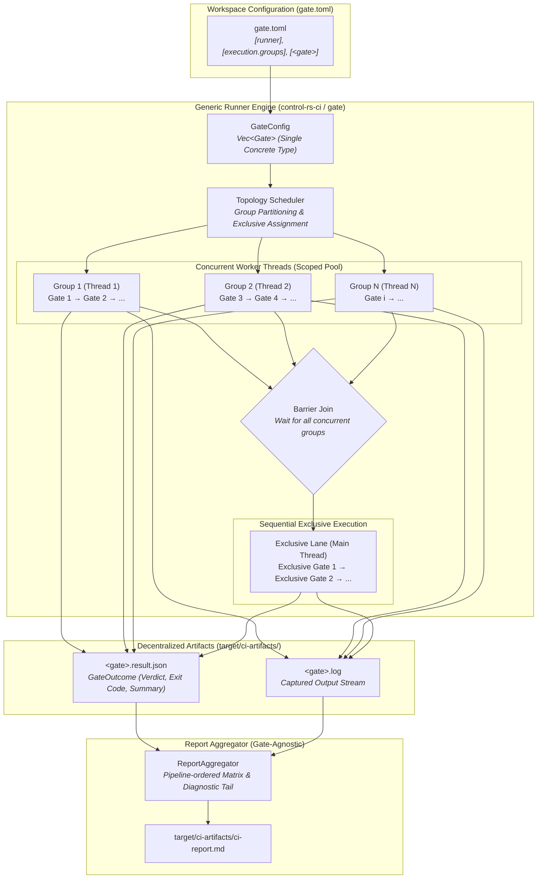

# Continuous Integration & Quality Gate Infrastructure (Design Document)


---

### 1. Introduction

High-assurance control systems and embedded firmware require verifiable, reproducible, and automated quality gating. `control-rs-ci` provides a modular quality gate runner, report aggregator, and verification harness for `control-rs` and downstream safety-critical embedded systems.

The gating and reporting infrastructure follows a **generic gate runner, minimal-parsing design principle**:

- **Generic Gate Runner & Zero Gate Dependence**: The gate running engine has zero hardcoded dependence on specific gate names or behaviors. The earlier concept of "built-in" gates is obsolete; every quality gate is defined uniformly by its declarative configuration in `gate.toml`.
- **Single Concrete Gate Type**: All quality gates use a single concrete `Gate` struct without trait abstractions (`QualityGate`), dynamic dispatch (`dyn QualityGate`), or struct proliferation. Every gate executes via the same concrete process lifecycle.
- **Uniform Command & Argument Configuration**: Each gate in `gate.toml` declares its executable and base subcommand via `command` (for example, `"cargo clean"`, `"cargo fmt"`, `"cargo clippy"`, `"cargo deny"`, `"vale"`), optional additional arguments via `args`, optional `description`, and optional environment variables via `env`. Subcommands are not repeated in `args`: for `[clean]`, `command = "cargo clean"` requires no extra arguments (`args = []` or omitted), eliminating redundant `args = ["clean"]`.
- **Process Isolation & Log Separation**: Gates execute underlying tools without intermediate schema translation. Full `stdout` and `stderr` streams are captured to a dedicated log file (`target/ci-artifacts/<gate>.log`), and any tool-native JSON or data files are dumped directly in their native format (`<gate>-raw.json`).
- **Standardized Execution Outcomes**: Gates record structured execution metadata (`GateOutcome`: gate name, verdict, duration, exit code, summary, log path, and optional raw artifact path) written to `target/ci-artifacts/<gate>.result.json`.
- **Zero-Parsing Minimalist Aggregation**: The report aggregator (`control-rs-ci report`) operates generically, rendering `target/ci-artifacts/ci-report.md` directly from `GateOutcome` records and tool logs without requiring specialized per-gate code.
- **Multi-Lane Parallel Scheduling**: Independent execution groups execute concurrently on dedicated OS threads, while exclusive gates execute sequentially following a barrier join.

---

### 2. Requirements

#### 2.1 Functional Requirements

- **FR-1 — Generic Gate Execution**: The runner must execute any quality gate declared in `gate.toml` under `[<gate>]`, supporting compiler checks, linters, tests, coverage, security audits, and user-defined verification harnesses.
- **FR-2 — Single Concrete Gate Model**: All quality gates must be represented and executed via a single concrete `Gate` type without gate-specific traits, sub-types, or dynamic dispatch.
- **FR-3 — Declarative Workspace Configuration (`gate.toml`)**: Runner settings, execution groups, exclusive gates, and individual gate execution definitions must be declared in a workspace-root `gate.toml` without hardcoded fallback vectors in runner source code.
- **FR-4 — Subcommand & Flag Economy**: The runner must parse compound command strings (for example `command = "cargo clean"`) and optional argument vectors (`args`) without forcing repetition of subcommand names in arguments.
- **FR-5 — Process & Log Stream Isolation**: Every gate must stream 100% of its `stdout` and `stderr` output to `target/ci-artifacts/<gate>.log` and record standardized metadata to `target/ci-artifacts/<gate>.result.json`.
- **FR-6 — Structured Tool Degradation**: Absence or failure of an external tool must surface as a structured warning in `GateOutcome` and log a diagnostic to `<gate>.log` rather than aborting or panicking when the gate policy is `warn`.
- **FR-7 — Bounded Execution Timeouts**: Target executions and host gates must execute under explicit wall-clock bounds, terminating hung processes cleanly.
- **FR-8 — Multi-Lane Parallel Execution**: The runner must support partitioning quality gates into independent concurrent execution groups declared in `gate.toml` (`[execution.groups]`), executing groups concurrently across worker threads while preserving sequential execution within each group.
- **FR-9 — Exclusive Processor Authority Barriers**: Gates requiring unrestricted access to CPU, memory bandwidth, or Cargo locks must declare membership in `exclusive_gates`. The runner must drain and join all active background group threads before dispatching exclusive gates sequentially.
- **FR-10 — Fail-Closed Report Aggregation**: The report aggregator (`control-rs-ci report`) must derive overall pipeline success strictly from gate policies applied to `GateOutcome` verdicts. Any missing, corrupt, or failing fail-closed gate must fail the aggregator with a non-zero exit code.
- **FR-11 — Artifact Relocation & Cleanup**: All CI outputs must be written exclusively to `target/ci-artifacts/`. The runner and CLI tools must provide clean operations (`cargo ci clean`, `cargo gate clean`, `cargo report --clean`) to remove previous artifacts.

#### 2.2 Non-Functional Requirements

- **NFR-1 — Zero Continuous Allocation**: The runner software operates with zero persistent allocation overhead during execution.
- **NFR-2 — Outcome Schema Stability**: The `GateOutcome` JSON schema and Markdown report structure (`ci-report.md`) must remain stable and versioned across releases.
- **NFR-3 — Headless Dependency Floor**: The runner's dependency closure must contain zero GUI, terminal-event, or interactive styling crates.

#### 2.3 Constraints

- **C-1 — Step Summary Size Budget**: `ci-report.md` is budgeted to $\le 64\,\text{KiB}$ for human readability and fast PR rendering, with an absolute platform ceiling of 1 MiB ($1{,}048{,}576$ bytes) imposed by GitHub Actions step summaries [1].
- **C-2 — Single MSRV Baseline**: All host tooling and runner crates must conform to the workspace `rust-version`.
- **C-3 — Advisory / Fail-Closed Agreement**: Workflow jobs marked `continue-on-error` must match gates configured as `warn`. A fail-closed gate (`fail`) must not be bypassed.

---

### 3. Technical Overview

`control-rs-ci` decouples quality gate execution from report generation while minimizing parsing overhead. Gates execute concurrently across dedicated worker threads or sequentially under exclusive authority:



Developers retain single-command local verification through `cargo ci` or targeted gate execution (`cargo gate`).

---

### 4. Architecture

#### 4.1 Crate & Binary Structure

`control-rs-ci` provides a core library (`lib.rs`) containing generic gate dispatch, configuration parsing, scheduler coordination, artifact cleanup, and report rendering logic. The package exposes focused binary targets:

| Binary / Command | Alias              | Responsibility                                                  |
|:-----------------|:-------------------|:----------------------------------------------------------------|
| `control-rs-ci`  | `cargo ci`         | Monolithic coordinator and quality gate runner                  |
| `gate`           | `cargo gate`       | Targeted quality gate execution (`--only`, `--skip`, `--up-to`) |
| `report`         | `cargo report`     | JSON artifact aggregator rendering `ci-report.md`               |
| `regression`     | `cargo regression` | Performance regression evaluator and benchmark budget harness   |
| `valgrind`       | `cargo valgrind`   | Multi-example Valgrind Memcheck memory leak and safety runner   |

#### 4.2 Concrete Gate Model & Lifecycle

Every quality gate is represented by a single concrete `Gate` struct:

```rust
#[derive(Debug, Clone, PartialEq, Serialize, Deserialize)]
pub struct GateOutcome {
    pub gate: String,
    pub verdict: Verdict,                // Pass | Warn | Fail | Skipped
    pub exit_code: Option<i32>,
    pub duration_secs: f64,
    pub summary: Option<String>,
    pub log_file: String,               // e.g. "fmt.log"
}

#[derive(Debug, Clone, Copy, PartialEq, Eq, Serialize, Deserialize)]
#[serde(rename_all = "lowercase")]
pub enum Verdict {
    Pass,
    Warn,
    Fail,
    Skipped,
}

/// Generic declarative gate definition parsed from `gate.toml`.
#[derive(Debug, Clone, PartialEq, Eq, Serialize, Deserialize)]
pub struct GateDefinition {
    /// Command string to execute (e.g., `"cargo clean"`, `"cargo fmt"`, `"vale"`).
    pub command: String,
    /// Optional additional command arguments.
    #[serde(default)]
    pub args: Vec<String>,
    /// Optional human-readable description for reports.
    #[serde(default)]
    pub description: Option<String>,
    /// Optional environment variable overrides.
    #[serde(default)]
    pub env: std::collections::HashMap<String, String>,
    /// Execution mode / policy (`fail`, `warn`, `skip`).
    #[serde(default)]
    pub mode: GatePolicy,
}

/// The single, concrete quality gate type used for all gates.
#[derive(Debug, Clone)]
pub struct Gate {
    pub name: String,
    pub command: String,
    pub args: Vec<String>,
    pub description: Option<String>,
    pub env: std::collections::HashMap<String, String>,
}

impl Gate {
    pub fn name(&self) -> &str { &self.name }
    pub fn description(&self) -> Option<&str> { self.description.as_deref() }
    pub fn command_display(&self) -> String { ... }
    pub fn execute(&self, ctx: &GateContext) -> Result<GateOutcome, GateError> { ... }
}
```

The gate execution lifecycle follows a zero-overhead process runner pattern:

1. **Command String Decomposition**: The `command` string defines the executable and base subcommand (for example, `"cargo clean"`, `"cargo fmt"`, `"cargo clippy"`, `"cargo deny"`, `"cargo semver-checks"`, `"vale"`). Initial whitespace-separated tokens are split into the binary and initial arguments.
2. **Argument Concatenation**: Any flags in `args` are appended to the invocation. Subcommands are not repeated in `args`: for `[clean]`, `command = "cargo clean"` requires no extra arguments (`args = []` or omitted), completely eliminating redundant `args = ["clean"]`.
3. **Log Redirection**: Every gate redirects `stdout` and `stderr` directly into its dedicated log file (`target/ci-artifacts/<gate>.log`).
4. **Native Raw Dumps**: Tools that output JSON or data files (for example, `tarpaulin`, `geiger`, `valgrind`, `vale`) write their native output directly to `target/ci-artifacts/<gate>-raw.json`.
5. **Outcome Metadata**: Each gate writes a standardized `<gate>.result.json` containing the `GateOutcome`.
6. **Structured Degradation**: If an external executable or cargo subcommand is absent from the host, gates operating under `warn` policy log a diagnostic and record `Verdict::Warn` without failing the pipeline.

#### 4.3 Declarative Configuration (`gate.toml`)

All quality gates, runner settings, execution groups, and exclusive gates are configured uniformly in `gate.toml` at the workspace root:

```toml
[runner]
title = "control-rs"
out_dir = "target/ci-artifacts"
timeout_secs = 90

[execution]
parallel = true
exclusive_gates = ["geiger", "cross-compare", "valgrind", "mutants", "regression"]

[execution.groups]
cargo = ["clean", "fmt", "clippy", "build", "test", "coverage"]
audit = ["deny", "semver", "vale"]

# Cargo Lane Gates
[clean]
mode = "fail"
command = "cargo clean"
description = "Cleans workspace build artifacts"

[fmt]
mode = "fail"
command = "cargo fmt"
args = ["--all", "--", "--check"]
description = "Verifies codebase formatting conformity with rustfmt"

[clippy]
mode = "fail"
command = "cargo clippy"
args = ["--workspace", "--all-targets", "--", "-D", "warnings"]
description = "Executes Clippy linter across workspace targets"

[check]
mode = "skip"
command = "cargo check"
args = ["--workspace", "--all-targets"]
description = "Performs compiler type checking without full codegen"

[build]
mode = "fail"
command = "cargo build"
args = ["--workspace", "--all-targets"]
description = "Compiles all workspace targets"

[test]
mode = "fail"
command = "cargo test"
args = ["--workspace"]
description = "Executes host unit and integration test suites"

[coverage]
mode = "fail"
command = "cargo tarpaulin"
args = ["--verbose", "--workspace", "--color", "never", "--out", "Json", "--output-dir", "target/ci-artifacts"]
description = "Measures workspace line coverage using cargo-tarpaulin"

# Audit Lane Gates
[deny]
mode = "fail"
command = "cargo deny"
args = ["check"]
description = "Audits dependencies for security advisories and license compliance"

[semver]
mode = "fail"
command = "cargo semver-checks"
args = ["check-release", "--baseline-rev", "origin/main"]
description = "Verifies public API stability against baseline ref"

[vale]
mode = "fail"
command = "vale"
args = ["--config=.vale.ini", "--output=JSON", "documentation", "src"]
description = "Lints documentation and doc comments for prose style conformity"

# Exclusive Lane Gates
[geiger]
mode = "fail"
command = "cargo geiger"
args = ["--output-format", "Json"]
description = "Scans workspace crates for unsafe code blocks and functions"

[cross-compare]
mode = "fail"
command = "cargo run"
args = ["--package", "control-rs-compare", "--bin", "compare", "--", "--config", "compare.toml"]
description = "Executes multi-language reference oracles and verifies HDF5 tolerance bounds"

[valgrind]
mode = "fail"
command = "cargo run"
args = ["--package", "control-rs-ci", "--bin", "valgrind"]
description = "Executes Valgrind Memcheck against all workspace example binaries to verify zero memory leaks"

[mutants]
mode = "skip"
command = "cargo mutants"
args = ["--json", "--output", "target/ci-artifacts/mutants.out"]
description = "Mutates ASTs to verify test fault-injection rigor using cargo-mutants"

[regression]
mode = "fail"
command = "cargo run"
args = ["--package", "control-rs-ci", "--bin", "regression"]
description = "Evaluates Criterion benchmark outputs against performance budgets and regression baselines"
```

#### 4.4 Concurrency Topology & Scheduling

The execution topology partitions active gates into two tiers:

1. **User-Defined Groups (`[execution.groups]`)**:
   Named concurrency lanes (for example, `cargo`, `audit`, `static`). When parallel execution is enabled, each declared group runs on a dedicated OS worker thread via `std::thread::scope`. Gates within a single group execute sequentially in their declared order. Output lines display colored group tags (for example `[cargo] `, `[audit] `, `[static] `).
2. **Exclusive Group (`exclusive_gates` and Unassigned Gates)**:
   Gates requiring full processor authority (such as `geiger`, `cross-compare`, `valgrind`, `mutants`, `regression`) or any active gate omitted from `[execution.groups]`. The runner establishes a strict **barrier join**: all group threads must complete and join before exclusive gates begin. Exclusive gates execute strictly sequentially, one at a time, displaying the `[exclusive] ` tag.

#### 4.5 Report Aggregation & Artifact Protocol

`control-rs-ci report` operates as a gate-agnostic artifact aggregator producing `target/ci-artifacts/ci-report.md`:

1. **Gate-Agnostic Outcome Ingestion**: The aggregator has zero compile-time dependencies on specific gates or internal gate modules. It scans `target/ci-artifacts/*.result.json` for generic `GateOutcome` instances.
2. **Preserved Pipeline Ordering**: To ensure intuitive and deterministic reporting, status table rows are sequenced by their declaration order in `gate.toml` (groups in declaration order, followed by exclusive gates and any unassigned gates), rather than random filesystem or alphabetical order.
3. **Generic Summary Matrix Rendering**: Each row renders the gate name, badge verdict (`**Pass**`, `*Warn*`, `**FAIL**`, `Skipped`), elapsed duration, process exit code, and the `summary` string from `GateOutcome.summary`. Any gate (standard cargo tool, shell script, or custom CLI) can supply arbitrary concise summary metrics without requiring custom report code.
4. **Policy Evaluation**: Evaluates all gate verdicts against declared policies in `gate.toml`. Any failed or omitted fail-closed gate causes the aggregator to exit non-zero (FR-10).
5. **Decoupled Metric Reporting**: Gates provide arbitrary concise outcome summaries through their `GateOutcome.summary` field, rendered directly in the matrix without requiring custom parser logic in `report.rs`.
6. **Failure Diagnostics**: Embeds trailing log snippets (20–40 lines) from `<gate>.log` into expandable Markdown `<details>` sections for failing or warning gates.
7. **Size Budget**: Enforces $\le 64\,\text{KiB}$ maximum report size (C-1) by truncating embedded logs when necessary.

#### 4.6 Artifact Relocation & Cleanup

All CI artifacts reside under `target/ci-artifacts/`. Cleanup is supported via `clean_artifacts`:
- Invoked via `cargo ci clean`, `cargo ci --clean`, `cargo gate clean`, or `cargo report --clean`.
- Recursively deletes `target/ci-artifacts/`.
- Removes legacy/stray root artifacts (`ci-report.md`, `mutants.out`, `tarpaulin-report.*`).

#### 4.7 Performance Regression Harness (`regression`)

Criterion benchmarks (`benches/jitter.rs`, `benches/scaling.rs`) compute empirical timing distributions and confidence intervals, but exit with code 0 by default even when performance degrades. To enforce hard real-time latency deadlines and performance regression bounds within automated quality gates, `control-rs-ci` provides a dedicated `regression` binary (`cargo regression`):

1. **Criterion Ingestion**: Ingests JSON measurement artifacts emitted by Criterion (`target/criterion/<benchmark_id>/new/estimates.json`).
2. **Timing Budget Verification**: Asserts point estimates (median latency, slope, and standard error) against upper-bound cycle budgets (such as $\le 10\,\mu\text{s}$ jitter for flight control loops).
3. **Statistical Regression Detection**: When baseline measurements exist (`target/criterion/<benchmark_id>/base/estimates.json`), computes relative performance degradation $(\text{median}_{\text{new}} - \text{median}_{\text{base}}) / \text{median}_{\text{base}}$ against acceptable noise tolerance thresholds.
4. **Deterministic Fail-Closed Gating**: Emits exit code 0 if all monitored benchmarks satisfy budget and regression constraints, or exits non-zero with structured failure diagnostics, enabling fail-closed gating under `gate.toml`.

---

### 5. Alternatives

| Alternative | Rejected Because | Reference |
|:------------|:-----------------|:----------|
| **Trait Hierarchy (`QualityGate` + `dyn QualityGate`)** | Trait abstractions added structural complexity, boilerplate, and dynamic dispatch without benefit, as all quality gates share the exact same command execution and monitoring lifecycle. | |
| **Hardcoded Built-In Gates vs. Custom Gates Split** | Hardcoding specific gate names and schemas in the runner prevented flexible argument configuration, created inconsistent TOML schemas, and forced code modifications in `control-rs-ci` for every new tool. | |
| **In-Tree Custom Tool Binaries** | Introducing custom helper binaries (for example bespoke LOC scanners or git validators) bloats the codebase and violates runner generality. Delegating to standard CLI tools (`git diff`, standard cargo subcommands) via `command` and `args` in `gate.toml` eliminates unnecessary code. | |
| **Monolithic Single-Runner CI** | Monolithic execution prevents parallel job fan-out in GitHub Actions, dramatically increasing PR cycle times. | [1] |
| **Shell Script Orchestration** | Hand-rolled shell scripts drift across local and CI environments, lack structured artifact generation, and cannot provide compile-time shape verification or robust timeout isolation. | |

---

### 6. Verification & Validation

#### 6.1 Plan

| Kind   | Step                                  | Establishes                                                                                                              |
|:-------|:--------------------------------------|:-------------------------------------------------------------------------------------------------------------------------|
| `test` | Gate Execution & Lifecycle Tests      | Dispatches command and arguments, tracks duration, captures stdout/stderr to `<gate>.log`, and records `<gate>.result.json`. |
| `test` | Gate Configuration & Validation Tests | Verifies that all enabled gates require explicit configuration in `gate.toml` with zero hardcoded fallbacks.             |
| `test` | Compound Command Parsing Tests        | Verifies compound command strings (for example `command = "cargo clean"`) execute correctly without redundant arguments.        |
| `test` | Multi-Lane Parallel Execution Tests   | Verifies concurrent group execution and barrier synchronization before exclusive gates.                                  |
| `test` | Artifact Cleanup Tests                | Verifies `clean_artifacts` removes `target/ci-artifacts/` and scrubs legacy workspace root files.                         |
| `test` | Report Aggregation Tests              | Verifies `ci-report.md` generation, fail-closed policy enforcement, and size budget compliance ($\le 64\,\text{KiB}$).   |
| `test` | Tool Degradation Tests                | Verifies uninstalled tools log diagnostics and emit `Verdict::Warn` when policy is `warn`.                               |

#### 6.2 Acceptance

| Claim                             | Oracle                     | Measure        | Bound                                                                                    |
|:----------------------------------|:---------------------------|:---------------|:-----------------------------------------------------------------------------------------|
| **Gate Exit Code Accuracy**       | Process Exit Status        | Exact Equality | Process returns code 0 on all-pass; non-zero on any fail-closed gate failure             |
| **Log File Isolation**            | Filesystem Artifact        | Exact Match    | 100% of process stdout/stderr stream is captured into `target/ci-artifacts/<gate>.log`   |
| **GateOutcome Metadata Accuracy** | Serialization Oracle       | Exact Match    | `<gate>.result.json` matches actual process exit status and duration $\pm 50\,\text{ms}$ |
| **Execution Timeout Enforcement** | System Monotonic Clock     | Absolute Time  | Process terminated within $\pm 500\,\text{ms}$ of configured `timeout_secs`              |
| **Step Summary Size Budget**      | Serialized Byte Count      | Absolute Size  | `ci-report.md` size $\le 64\,\text{KiB}$ target ($< 1\,\text{MiB}$ platform ceiling) [1] |

#### 6.3 Limits

- Verification establishes host-level process orchestration and reporting correctness; target electrical timing and hardware execution require physical hardware runners.

---

### 7. Performance & Resource Considerations

- **Step Summary Limit**: `ci-report.md` is budgeted for $\le 64\,\text{KiB}$ (typically 5–20 KiB) for responsive human inspection and stays strictly under the 1 MiB GitHub Actions limit [1].
- **Process & Timeout Bounds**: Gate processes are spawned with bounded timeouts (default 90s) to prevent hung runner instances.
- **Memory Footprint**: `control-rs-ci` operates with zero continuous memory allocation overhead; artifact ingestion streams JSON data directly to report renderers.

---

### 8. Risks & Open Questions

- **Toolchain MSRV Drift**: External cargo subcommands (`cargo-tarpaulin`, `cargo-deny`, `cargo-geiger`, `cargo-semver-checks`) must remain compatible with the workspace `rust-version`.

---

### 9. Development Plan

| Phase / Task                                                      | Description                                                                                                                                                                                                            | Estimated Effort |
|:------------------------------------------------------------------|:-----------------------------------------------------------------------------------------------------------------------------------------------------------------------------------------------------------------------|:-----------------|
| **Phase 1: Generic Gate Engine & Concrete Model**                 | Implement single concrete `Gate` type, process spawning with stdout/stderr redirection, `GateOutcome` schema, generic `gate.toml` parser with no hardcoded gate fallbacks, and artifact cleanup operations.          | 3                |
| **Phase 2: Generic Gate Configuration & Artifact Relocation**     | Standardize all gate execution around declarative `command` and `args` in `gate.toml`, relocate all CI output strictly to `target/ci-artifacts/`, and update report aggregator.                                | 2                |
| **Phase 3: Multi-Lane Parallel Execution & Barrier Join**        | Implement declarative multi-lane parallel scheduler using `std::thread::scope`, `[execution.groups]` in `gate.toml`, and barrier synchronization for `exclusive_gates`.                                              | 3                |
| **Phase 4: Performance Regression Harness (`regression`)**        | Implement `regression` binary in `control-rs-ci`, Criterion `estimates.json` ingestion, budget threshold evaluation, and `gate.toml` gate integration.                                                               | 2                |

---

### 10. Revision History

| Revision | Date               | Author          | Description                                                                                                                                                                                                                     |
|:---------|:-------------------|:----------------|:--------------------------------------------------------------------------------------------------------------------------------------------------------------------------------------------------------------------------------|
| 1.0      | May 24, 2026       | @MitchellDScott | Initial CI design document.                                                                                                                                                                                                     |
| 1.5      | September 13, 2026 | @MitchellDScott | Decentralized tool architecture: split into standalone binaries backed by reusable `lib.rs` and JSON artifact exchange protocol.                                                                                                |
| 1.10     | September 20, 2026 | @MitchellDScott | Declarative multi-lane parallel execution (`[execution.groups]`), exclusive processor authority barrier synchronization (`exclusive_gates`), and concurrency resource allocation.                                             |
| 1.15     | September 21, 2026 | @MitchellDScott | Generic quality gate runner architecture: eliminated `QualityGate` trait in favor of a single concrete `Gate` type, unified `gate.toml` configuration (`command` and optional `args`), and extracted `metrics`/`git` tools. |
| 1.16     | September 21, 2026 | @MitchellDScott | Updated Mermaid architecture diagram to reflect generic execution lanes, barrier join, and gate-agnostic report aggregation with pipeline ordering.                                                                             |
| 1.17     | September 21, 2026 | @MitchellDScott | Streamlined generic gate runner: eliminated bespoke in-tree tools (`ci-metrics`, `ci-git`) and raw artifact parsing in favor of standard CLI commands and pure generic reporting.                                               |
| 1.18     | September 21, 2026 | @MitchellDScott | Integrated performance regression harness (`regression`) and benchmark budget gating for Criterion suites.                                                                                     |
| 1.19     | September 21, 2026 | @MitchellDScott | Decentralized gate mode configuration: moved execution policies directly into individual `[<gate>]` tables via `mode`, eliminated redundant centralized `[gates]` section, and organized tables into execution lanes.         |

---

## References

[1] GitHub, "Workflow commands for GitHub Actions," *GitHub Docs*. [Online]. Available: https://docs.github.com/en/actions/reference/workflows-and-actions/workflow-commands. Accessed: Sep. 9, 2026.
