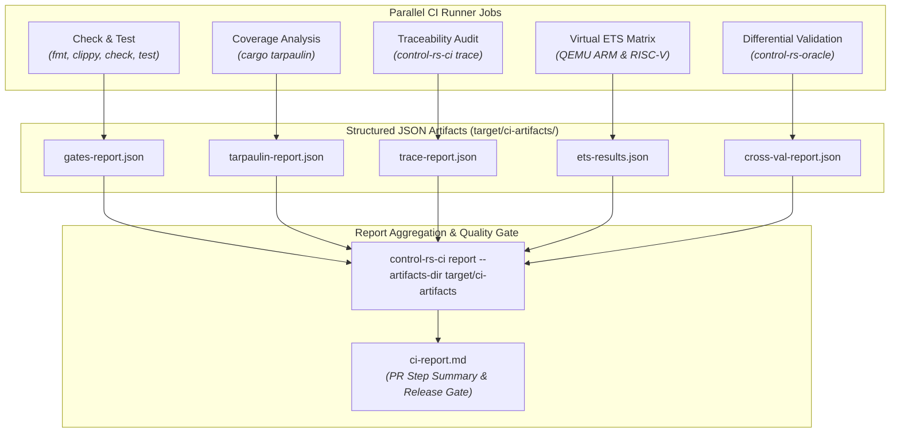

# Continuous Integration & Quality Gate Infrastructure (Design Document)


---

### 1. Introduction

High-assurance control systems and embedded firmware require verifiable, reproducible, and automated quality gating. `control-rs-ci` provides a modular quality gate runner, report aggregator, and verification harness for `control-rs` and downstream safety-critical embedded systems. The architecture decouples domain-specific verification engines from workflow orchestration: the same verification tools that gate continuous integration can be executed locally by developers, across distributed CI runner matrices, or within automated release pipelines.

**Scenario 1 — Local Developer Quality Gate.** A developer runs single-command workspace verification (`cargo ci`) or targeted quality gates (`cargo gate --only clippy,test`, `cargo trace`) prior to committing changes.

**Scenario 2 — Decentralized Pull-Request CI.** GitHub Actions executes parallelized jobs (formatting, static lints, unit tests, code coverage, requirement traceability, and virtual target emulation), each producing structured JSON artifacts. An aggregation job invokes `control-rs-ci report` to ingest these artifacts and render the unified `ci-report.md` PR summary.

**Scenario 3 — Hardware-in-the-Loop Lab Execution.** A self-hosted runner executes the ETS runner over serial/TCP transports to produce `ets-results.json` on physical target hardware (e.g., Teensy 4.1).

**Scenario 4 — Multi-Oracle Differential Cross-Validation.** Automated execution of host validation suites comparing numerical model outputs against high-precision reference datasets (`control-rs-oracle` / SciPy / JAX HDF5) via `control-rs-ci validate`.

**Scenario 5 — Automated Release Gating & Branch Preservation.** Merging to `main` triggers automated packaging validation, topological dependency resolution, version branch preservation (`release/vX.Y.Z`), and release artifact distribution.

---

### 2. Requirements

#### 2.1 Functional Requirements

- **FR-1 — Two-Tier Target Verification**: The pipeline must verify targets across both virtual emulators (Tier 1: QEMU ARM Cortex-M and RISC-V) and physical hardware runners (Tier 2: NXP i.MX RT1062 / Teensy 4.1). Emulated coverage alone cannot establish electrical timing; physical coverage alone does not scale to per-pull-request automation.
- **FR-2 — Headless Target Execution & Profiling**: The runner must compile target firmware, launch execution via `control-rs-ets-host`, and retrieve test outcomes, hardware cycle counts (ARM DWT / RISC-V), wall-clock duration ($\mu\text{s}$), and stack peak watermarks without manual intervention.
- **FR-3 — Configurable Quality Gate Pipeline**: Formatting, linting, compilation checks, builds, tests, coverage, and target emulation must execute in the order declared by the workspace `gate.toml`. Each gate is configured as `skip`, `warn` (run, non-blocking), or `fail` (blocking).
- **FR-4 — QualityGate Trait Abstraction**: Gate execution must be dispatched through a unified `QualityGate` trait abstraction (`CargoArgvGate`, `HostToolGate`, `CoverageGate`, `TraceGate`, `ValidateGate`, `EtsGate`), providing standardized process invocation, timer tracking, log capture, and verdict derivation.
- **FR-5 — Parameterized Artifact & Report Ingestion**: Report titles, input artifact directories (`--artifacts-dir`), and output directories (`--out-dir`) must be parameterized via CLI arguments.
- **FR-6 — Non-Zero Exit on Empty Verification**: Invocations expecting targets or suites that execute zero tests must exit non-zero, preventing false-positive passes from misconfigured filters.
- **FR-7 — Structured Tool Degradation**: Absence or failure of an external tool must surface as a structured error record naming the tool and status rather than aborting or panicking.
- **FR-8 — Bounded Execution Timeouts**: Target executions and host gates must execute under explicit wall-clock bounds, terminating hung processes cleanly.
- **FR-9 — Declarative Workspace Configuration (`gate.toml`)**: Runner settings, execution gates, and target matrices must be declared in a workspace-root `gate.toml`.
- **FR-10 — Requirement Traceability Audit (`control-rs-ci trace`)**: The pipeline must audit declared design requirements against test outcomes and source annotations (`#[req_trace]`), outputting `trace-report.json`.
- **FR-11 — Multi-Suite Differential Cross-Validation (`control-rs-ci validate`)**: The pipeline must execute host validation suites against reference datasets (`control-rs-oracle`), outputting `cross-val-report.json`.
- **FR-12 — Fail-Closed Report Aggregation (`control-rs-ci report`)**: The report aggregator must ingest JSON artifacts into a unified `ci-report.md`. Any missing, unpublished, or failing fail-closed gate artifact must fail the aggregator job with a non-zero exit status.
- **FR-13 — Topological Release Gating**: The release engine must verify workspace package manifests, validate dependency version constraints, and publish crates to crates.io in strict topological dependency order.

#### 2.2 Non-Functional Requirements

- **NFR-1 — Test State Isolation**: Each target test run must begin from a clean device state; target panics must trigger link teardown and target reset before subsequent tests execute.
- **NFR-2 — Artifact Schema Stability**: Standardized JSON schemas (`gates-report.json`, `tarpaulin-report.json`, `trace-report.json`, `ets-results.json`, `cross-val-report.json`) and Markdown output (`ci-report.md`) must remain stable across versions.
- **NFR-3 — Headless Dependency Floor**: The runner's dependency closure must contain zero GUI, terminal-event, or interactive styling crates.

#### 2.3 Constraints

- **C-1 — Target Architectures**: Hardware execution is constrained to ARM Cortex-M (`thumbv7em-none-eabihf`), RISC-V 32/64 (`riscv32imac-unknown-none-elf`), and host (`x86_64`, `aarch64`).
- **C-2 — Indicative Emulation Timing**: Virtual QEMU execution is indicative only and does not model microarchitectural cache or bus contention; precise timing requires physical hardware (Tier 2).
- **C-3 — Step Summary Size Budget**: `ci-report.md` is budgeted to $\le 64\,\text{KiB}$ for human readability and fast PR rendering, with an absolute platform ceiling of 1 MiB ($1{,}048{,}576$ bytes) imposed by GitHub Actions step summaries [1].
- **C-4 — Irreversible Publication**: Crates.io publication is not idempotent; publishing commands must default to dry-run verification.
- **C-5 — Advisory / Fail-Closed Agreement**: Workflow jobs marked `continue-on-error` must match the aggregator's `--warn` list. A fail-closed gate must not use `continue-on-error`.
- **C-6 — Single MSRV Baseline**: All host tooling and runner crates must conform to the workspace `rust-version`.

---

### 3. Technical Overview

`control-rs-ci` decouples domain-specific verification engines from workflow orchestration. In CI environments, verification tasks fan out across parallel jobs, each writing structured JSON artifacts into `target/ci-artifacts/`. A final aggregation job fans in these artifacts, executing `control-rs-ci report` to produce the consolidated `ci-report.md`.



Developers also retain single-command local verification through `cargo ci` or individual sub-commands (`cargo trace`, `cargo report`, `cargo gate`).

---

### 4. Architecture

#### 4.1 Crate & Binary Structure

`control-rs-ci` provides a core library (`lib.rs`) containing shared verification, tracing, comparison, configuration parsing, and report rendering logic. The package exposes a unified CLI entry point alongside standalone binary targets:

| Binary / Command | Alias | Responsibility |
|:---|:---|:---|
| `control-rs-ci` | `cargo ci` | Monolithic coordinator and quality gate runner |
| `gate` | `cargo gate` | Targeted quality gate execution (`--only`, `--skip`, `--up-to`) |
| `trace` | `cargo trace` | Requirement traceability auditor (`trace-report.json`) |
| `compare` / `validate` | `cargo compare` | Host differential cross-validation (`cross-val-report.json`) |
| `report` | `cargo report` | JSON artifact aggregator rendering `ci-report.md` |

#### 4.2 Quality Gate Trait & Dispatch Engine

Gate execution logic is unified via the `QualityGate` trait in `control-rs-ci/src/quality_gate.rs`:

```rust
pub trait QualityGate {
    fn name(&self) -> Gate;
    fn description(&self) -> &'static str;
    fn execute(&self, ctx: &GateContext) -> Result<GateOutcome, GateError>;
}
```

Implementations include:
- `CargoArgvGate`: Standard `cargo` subcommands (`fmt`, `clippy`, `check`, `build`, `test`).
- `HostToolGate`: External utility execution (`cargo-deny`, `cargo-audit`).
- `CoverageGate`: Line coverage measurement (`cargo-tarpaulin`) generating `tarpaulin-report.json`.
- `TraceGate`: Requirement audit scanning design docs and source code (`trace-report.json`).
- `ValidateGate`: Differential oracle comparison (`cross-val-report.json`).
- `EtsGate`: Headless on-target test server runner (`ets-results.json`).

#### 4.3 Declarative Configuration (`gate.toml`)

Runner settings and execution gates are configured in `gate.toml` at the workspace root:

```toml
[runner]
title = "control-rs"
out_dir = "target/ci"
timeout_secs = 90

[gates]
clean = "fail"
fmt = "fail"
clippy = "fail"
check = "fail"
build = "fail"
test = "fail"
coverage = "fail"
ets = "fail"
trace = "fail"
validate = "fail"

[[ets.targets]]
name = "qemu-arm-hf"
target = "thumbv7em-none-eabihf"
bin = "control-rs-qemu-thumbv7em-none-eabihf"
args = ["--release"]

[[ets.targets]]
name = "qemu-riscv32"
target = "riscv32imac-unknown-none-elf"
bin = "control-rs-qemu-riscv32imac-unknown-none-elf"
args = ["--release"]
```

#### 4.4 Artifact Exchange Protocol

The decentralized CI toolchain exchanges data via structured JSON files written to `target/ci-artifacts/`:

1. `gates-report.json`: Array of `{ gate, verdict, duration_secs }` for standard Cargo gates.
2. `tarpaulin-report.json`: Line coverage percentages and covered/uncovered line tallies.
3. `trace-report.json`: Requirement audit outcomes (`Verified`, `Pending`, `Untraced`, `MissingEvidence`).
4. `ets-results.json`: On-target suite results, cycle counts, execution durations, and stack peak watermarks.
5. `cross-val-report.json`: Numerical validation suite verdicts, maximum absolute/relative errors, and tolerance evaluations.

#### 4.5 Report Aggregator & Verdict Generation

`control-rs-ci report` ingests artifacts from `--artifacts-dir` and evaluates overall pipeline success:
- Evaluates gate verdicts against policy (`--require`, `--warn`, `--strict`).
- Fails closed if any required gate is missing an artifact, unpublished, or failed (FR-12).
- Renders `ci-report.md` with gate status tables, code coverage percentages, requirement traceability summaries, and on-target cycle/stack benchmarks, budgeted to $\le 64\,\text{KiB}$ and strictly bounded within GitHub's 1 MiB step summary limit (C-3).

#### 4.6 Execution Tiers: Virtual Emulation & Physical ETS

- **Tier 1 (Virtual QEMU)**: Emulates ARM Cortex-M (`mps2-an500`, `cortex-m7`) [2], [3] and RISC-V (`virt`, `riscv32`) targets. Provides rapid pull-request validation and functional verification without physical hardware dependencies.
- **Tier 2 (Physical Hardware ETS)**: Connects to hardware boards (NXP i.MX RT1062 / Teensy 4.1) over USB CDC serial. Captures hardware cycle counter measurements (ARM DWT CYCCNT) and painted stack memory peaks under deterministic real-time execution.

#### 4.7 Automated Release System & Branch Preservation

When changes merge to `main`, `.github/workflows/release.yml` invokes `control-rs-ci publish` to gate distribution:
1. **Verification**: Ensures all fail-closed gates pass.
2. **Topological Publishing**: Resolves the internal workspace dependency graph and publishes public crates to crates.io in strict topological order (`control-rs-macros` $\to$ `control-rs-ets` $\to$ `control-rs` $\to$ `control-rs-ets-host` $\to$ `control-rs-tui` $\to$ `control-rs-ci` $\to$ `control-rs-oracle`).
3. **Branch-per-Version Preservation**: Automatically creates and pushes immutable Git branches `release/vX.Y.Z` (e.g., `release/v0.1.0`) to origin for audit baselines and historical maintenance.
4. **GitHub Release Assets**: Bundles pre-compiled host CLI binaries (`control-rs-ci`, `control-rs-tui`), SHA-256 checksums, and validation summary reports.

---

### 5. Alternatives

| Alternative | Rejected Because | Reference |
|:------------|:-----------------|:----------|
| **Monolithic Single-Runner CI** | Monolithic execution prevents parallel job fan-out in GitHub Actions, dramatically increasing PR cycle times. | [1] |
| **Renode as Tier 1 Emulator** | Renode models peripheral networks and SoCs [4], [5], but uses integer MIPS performance rather than hardware cycle counters [6], and lacks built-in platform definitions for i.MX RT1062. QEMU is simpler and faster for Tier 1 CPU verification [2], [3]. | [2], [4], [6] |
| **Shell Script Orchestration** | Hand-rolled shell scripts drift across local and CI environments, lack structured artifact generation, and cannot provide compile-time shape verification or robust timeout isolation. | |
| **Silent Missing Gate Passes** | Assuming a missing gate passed allows silent CI configuration regressions where failing jobs are bypassed. Fail-closed aggregation is mandatory. | [1] |

---

### 6. Verification & Validation

#### 6.1 Plan

| Kind | Step | Establishes |
|:-----|:-----|:------------|
| `test` | QualityGate Trait Unit Tests | Dispatches argv, tracks process duration, and handles exit codes correctly across all gate implementations. |
| `test` | Config Parsing & CLI Precedence Tests | `gate.toml` parsing, `--only`, `--skip`, `--up-to`, and `--strict` precedence rules. |
| `test` | Fail-Closed Aggregation Fixture Tests | Aggregator fails when required artifacts are missing, corrupt, or report fail verdicts. |
| `test` | Topological Sorter Unit Tests | Manifest dependency graph correctly sorts workspace crates without cycles. |
| `test` | Multi-Arch QEMU Integration Tests | Headless ETS session executes cleanly against virtual ARM Cortex-M and RISC-V binaries. |
| `example` | Pedagogical Workspace Examples | Verifies that all host examples build and execute cleanly under CI automation. |
| `cross-check` | Differential Oracle Cross-Validation | Verifies numerical model trajectories against SciPy/JAX HDF5 datasets via `control-rs-oracle`. |

#### 6.2 Acceptance

| Claim | Oracle | Measure | Bound |
|:------|:-------|:--------|:------|
| **Gate Exit Code Accuracy** | Process Exit Status | Exact Equality | Process returns code 0 on all-pass; non-zero on any fail-closed gate failure |
| **Execution Timeout Enforcement** | System Monotonic Clock | Absolute Time | Process terminated within $\pm 500\,\text{ms}$ of configured `timeout_secs` |
| **Step Summary Size Budget** | Serialized Byte Count | Absolute Size | `ci-report.md` size $\le 64\,\text{KiB}$ target ($< 1\,\text{MiB}$ platform ceiling) [1] |
| **Topological Sort Order** | Workspace Dependency Graph | Exact Equality | Dependencies precede dependees in publish sequence |

#### 6.3 Limits

- Virtual emulation (Tier 1) does not establish physical cycle-accurate execution times or analog signal integrity (C-2).
- Hardware execution (Tier 2) requires an active physical device connected to a self-hosted runner.

---

### 7. Performance & Resource Considerations

- **Step Summary Limit**: `ci-report.md` is budgeted for $\le 64\,\text{KiB}$ (typically 5–20 KiB) for responsive human inspection and stays strictly under the 1 MiB GitHub Actions limit [1]. When test counts are large, the report truncates per-case tables while preserving aggregate metrics.
- **Process & Timeout Bounds**: External tool processes are spawned with bounded timeouts (default 90s) to prevent hung runner instances.
- **Memory Footprint**: `control-rs-ci` operates with zero continuous memory allocation overhead; artifact ingestion streams JSON data directly to report renderers.

---

### 8. Risks & Open Questions

- **Physical Runner Availability**: Hardware lab runners may experience temporary disconnects; the serial transport must gracefully report unavailable hardware without panicking.
- **Toolchain MSRV Drift**: External cargo subcommands (such as `cargo-tarpaulin` or `rust-hdf5`) must remain compatible with the workspace `rust-version`.

---

### 9. Development Plan

| Phase / Task | Description | Estimated Effort |
|:-------------|:------------|:-----------------|
| **Phase 1: QualityGate Trait & Dispatch Engine** | Implement `QualityGate` trait, `CargoArgvGate`, `gate.toml` configuration parser, and CLI subcommands in `control-rs-ci`. | 4 |
| **Phase 2: Decentralized Artifact Protocol & Aggregator** | Implement `gates-report.json`, `tarpaulin-report.json`, `trace-report.json`, `ets-results.json`, and fail-closed aggregator rendering `ci-report.md`. | 3 |
| **Phase 3: Multi-Target QEMU Emulation & Workflow Hardening** | Configure QEMU ARM Cortex-M and RISC-V matrix in `.github/workflows/CI.yml` and `.github/workflows/examples.yml`. | 3 |
| **Phase 4: Automated Git Release System & Branch Preservation** | Implement `control-rs-ci publish`, topological dependency sorter, and `.github/workflows/release.yml` with `release/vX.Y.Z` branch preservation. | 4 |

---

### 10. Revision History

| Revision | Date | Author | Description |
|:---|:---|:---|:---|
| 1.0 | May 24, 2026 | @MitchellDScott | Initial skeletal outline of CI testing. |
| 1.1 | July 18, 2026 | @MitchellDScott | Multi-tier CI architecture: specified Renode virtual simulation and physical hardware runners. |
| 1.2 | August 6, 2026 | @MitchellDScott | Scope refinement: consolidated Tier 2 physical runner architecture onto dedicated device harnesses. |
| 1.3 | September 9, 2026 | @MitchellDScott | Packaging alignment: updated host orchestration to invoke `control-rs-ets-host::ServerBridge` headlessly. |
| 1.4 | September 9, 2026 | @MitchellDScott | Crate split: relocated to `documentation/ci/`; runner identity moved to `control-rs-ci`. |
| 1.5 | September 13, 2026 | @MitchellDScott | Decentralized tool architecture: split into standalone binaries backed by reusable `lib.rs` and JSON artifact exchange protocol. |
| 1.6 | September 15, 2026 | @MitchellDScott | `QualityGate` trait abstraction, `gate.toml` key-ordered pipeline, and fail-closed aggregation. |
| 1.7 | September 18, 2026 | @MitchellDScott | Complete alignment with Product Roadmap: PR3 QualityGate infrastructure, PR6 QEMU multi-arch virtual ETS, and PR11 automated Git release system with version branch preservation (`release/vX.Y.Z`). |

---

## References

[1] GitHub, "Workflow commands for GitHub Actions," *GitHub Docs*. [Online]. Available: https://docs.github.com/en/actions/reference/workflows-and-actions/workflow-commands. Accessed: Sep. 9, 2026.

[2] QEMU Project, "Arm System emulator," *QEMU System Emulation User's Guide*. [Online]. Available: https://www.qemu.org/docs/master/system/target-arm.html. Accessed: Sep. 9, 2026.

[3] QEMU Project, "Translator Internals," *QEMU Developer's Guide*. [Online]. Available: https://www.qemu.org/docs/master/devel/tcg.html. Accessed: Sep. 9, 2026.

[4] Antmicro, *Renode*: functional simulation framework for embedded systems. [Online]. Available: https://github.com/renode/renode. Accessed: Sep. 9, 2026.

[5] Antmicro, "Testing with Renode," *Renode documentation*. [Online]. Available: https://renode.readthedocs.io/en/latest/introduction/testing.html. Accessed: Sep. 9, 2026.

[6] Antmicro, "Time framework," *Renode documentation*. [Online]. Available: https://renode.readthedocs.io/en/latest/advanced/time_framework.html. Accessed: Sep. 9, 2026.
