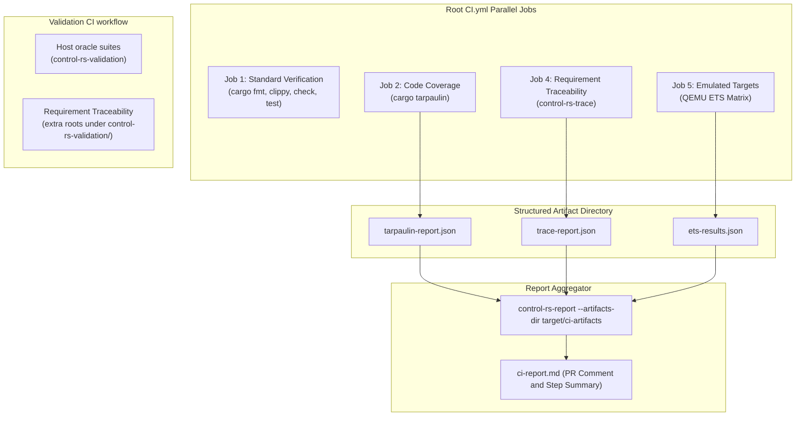

# Continuous Integration Design Document


---

### 1. Introduction

Embedded CI and on-target hardware test environments are usually closed internal
infrastructure. This design exports the verification and ETS testing framework to
developers instead: the same domain-specific tools that gate this repository are the
ones a downstream project can install and invoke independently or inside parallel CI
pipelines.

`control-rs-ci` provides a modular suite of standalone verification binaries alongside
a monolithic local runner:
- `control-rs-trace` (`cargo trace`): Requirement traceability audit engine (FR-10).
- `control-rs-compare` (`cargo compare`): Multi-oracle cross-validation comparator (FR-11).
- `control-rs-report` (`cargo report`): JSON artifact ingestion and Markdown report aggregator.
- `control-rs-ci` (`cargo ci`): Monolithic local development coordinator running all stages or orchestrating ETS matrices.

Standard compilation, formatting (`cargo fmt`), linting (`cargo clippy`), and unit tests
(`cargo test`) run directly in parallelized GitHub Actions jobs, emitting artifacts that
`control-rs-report` ingests to render the final `ci-report.md`.

**Scenario 1 — Local developer gate.** A developer runs `cargo ci` or individual
sub-tools (`cargo trace`, `cargo compare`).

**Scenario 2 — Parallelized pull-request gate.** GitHub Actions executes compilation,
lints, tests, coverage, requirement tracing, and QEMU emulation as
parallel jobs, each writing structured JSON artifacts. A final aggregation job invokes
`control-rs-report` to generate the unified PR comment and job summary.

**Scenario 3 — Hardware lab.** A self-hosted runner with a board attached runs the
ETS runner against a serial target and produces `ets-results.json`.

**Scenario 4 — Downstream adoption.** A firmware project installs `control-rs-ci`
(or standalone binaries like `control-rs-trace`) to gate its own suites without
vendoring this repository.

**Scenario 5 — Release gate.** A maintainer tags a release. `control-rs-ci publish`
checks workspace packaging and dependency ordering before registry upload.

---

### 2. Requirements

#### 2.1. Functional Requirements

- **FR-1 — Two-tier target verification**: The pipeline verifies against both
  emulated and physical targets. Emulated coverage alone cannot establish
  electrical timing or analog behaviour; physical coverage alone does not scale
  to per-pull-request gating.

- **FR-2 — Firmware build, run and capture**: The runner compiles target
  firmware, executes it, and retrieves per-case outcomes and logs without
  manual intervention.

- **FR-3 — Host quality pipeline**: Baseline cache eviction (`cargo clean`),
  formatting, linting, compilation check, workspace build, unit and doc tests,
  then coverage analysis, run in the order declared by the workspace `[gates]`
  table for monolithic runs, or parallelized across dedicated CI runner jobs.
  Baseline `cargo clean` runs as an initial gate when listed. Each listed gate
  is `skip`, `warn` (run, do not fail the pipeline), or `fail`. Gates omitted
  from the table are skipped.

- **FR-4 — Parameterized reporting**: Report title, target identity, input artifacts directory,
  and output directory come from invocation arguments, not from constants compiled into
  the runner. `control-rs-report` ingests arbitrary artifact sets from `--artifacts-dir`.

- **FR-5 — Non-zero exit on empty verification**: An invocation that verifies
  no target exits non-zero. A run with zero verified targets must not report
  success, because a silently empty matrix is indistinguishable from a passing
  one in a workflow log.

- **FR-6 — Structured tool failures**: Absence or failure of an external tool
  surfaces as an error naming the tool and its exit status. The runner does not
  abort the process or panic on a missing binary.

- **FR-7 — Bounded target execution**: Each target runs under an explicit
  wall-clock bound supplied at invocation. A hung target must not hold a runner
  indefinitely.

- **FR-8 — Workspace-declared invocation**: The runner reads its target matrix
  and report settings from a file in the workspace it gates, so an invocation
  carries a workspace path rather than a target list. A matrix restated in a
  cargo alias and again in a workflow drifts between the two.

- **FR-9 — Release gating**: The runner reports, for every publishable member
  of a workspace, whether it packages, whether its dependency requirements
  resolve, and the order in which the members would upload. It performs no
  upload unless asked to, and it derives the order from the manifest graph
  rather than from a list a maintainer keeps in step by hand.

- **FR-10 — Requirement traceability audit**: The pipeline audits every design
  document's declared requirements against the verification dump and the
  test outcomes of the run, and reports a status per requirement. Packaged as
  the standalone binary `control-rs-trace` emitting `trace-report.json` and
  `trace-report.md`.

- **FR-11 — Multi-suite cross-comparison**: The pipeline executes each
  configured host validation suite in `control-rs-validation` (`cargo run --bin`
  plus external `commands`), globs `results/<name>.*.h5`, and 1:1-compares every
  peer file against the suite's true-oracle file. Verdicts come from true-oracle
  dataset attributes, not from a TOML table or producer-side claims. Packaged
  as the standalone binary `compare` emitting `cross-val-report.json` and
  `cross-val-report.md`.

- **FR-13 — Fail-closed aggregation**: A fail-closed gate whose artifact is
  missing, unpublished, or recorded as fail must fail the aggregate report and
  must not unlock the release gate. Presence of a coverage file is not a pass.
  An unrecognized verdict string is a fail, not a skip. A job that did not run
  cannot be mistaken for a passing one.

- **FR-14 — Declared library toolchain**: The oldest pull-request toolchain row
  is the workspace `rust-version` of the published crates. Tooling that needs a
  newer compiler is excluded on that row; the row itself is not deleted.

#### 2.2. Non-Functional Requirements

- **NFR-1 — Test isolation**: Each target run begins from a clean device state.
  Residue from a previous case makes a failure unattributable.

- **NFR-2 — Artifact compatibility**: `ci-report.md` and `ets-results.json`
  keep the shapes the existing workflow summary and pull-request comment jobs
  parse. Changing them silently breaks reporting that lives outside this crate.

- **NFR-3 — Headless dependency floor**: The runner's dependency closure
  contains no terminal-rendering or terminal-event crate.

#### 2.3. Constraints

- **C-1 — Target platforms**: Cortex-M (NXP i.MX RT1062 / Teensy 4.1) and
  RISC-V 32/64.

- **C-2 — Emulated cycle counts are not measurements**: No emulator in the
  matrix models cycle-accurate execution, so cycle, duration and stack figures
  from Tier 1 are indicative only. Measured timing requires Tier 2.

- **C-3 — Job summary size**: A single step's summary is capped at 1 MiB, and
  exceeding it fails the upload and raises an error annotation [1].
  Report generation must stay under that bound.

- **C-4 — Publication is not idempotent**: A version uploaded to crates.io
  cannot be replaced or re-uploaded, and yanking does not free the version
  number. Every release path therefore defaults to reporting, and uploading is
  an explicit opt-in on an otherwise identical run.

- **C-5 — Tolerance ownership at the gate**: A cross-language tolerance bound is
  declared on the true-oracle dataset as HDF5 attributes (`measure`, `bound`,
  optional `interval`, optional `bound.<peer>`). Design-document §6.3 tables
  remain human documentation. The gate does not load `tolerances/*.toml`.

- **C-6 — Advisory and fail-closed jobs agree**: A job marked `continue-on-error`
  is on the aggregator's warn list. A fail-closed gate is not `continue-on-error`.
  The two lists naming the same gate differently is a configuration error.

---

### 3. Technical Overview

The architecture decouples domain-specific verification engines from workflow
orchestration. Rather than running as a single monolithic orchestrator, verification
capabilities are packaged as standalone binary CLI tools (like `cargo-clippy` or
`cargo-tarpaulin`) that can run independently, locally via cargo aliases, or across
parallelized CI workflow jobs.



Host-oracle HDF5 compare runs in Validation CI, not in the root aggregator.
Each validation job writes `target/ci/ci-report.md` for that job's step summary.

Developers also retain single-command local verification through `cargo ci` or
individual sub-tools (`cargo trace`, `cargo compare`, `cargo report`).

---

### 4. Architecture

#### 4.1. Crate and Binary Structure

`control-rs-ci` provides a core library (`lib.rs`) housing all shared verification,
tracing, comparison, and reporting logic. The binaries are targets of that one
crate; there is no `control-rs-trace` or `control-rs-report` package, and the
alias is the supported entry point:

| Binary | Alias | Primary Responsibility |
|:--|:--|:--|
| `ci` | `cargo ci` | Monolithic coordinator and on-target ETS runner |
| `gate` | `cargo gate` | Same entry point as `ci`; collapse pending (`TODO/ci-collapse-duplicate-bins.md`) |
| `trace` | `cargo trace` | Requirement traceability audit |
| `compare` | `cargo compare` | Host validation runner & HDF5 oracle comparison |
| `validate` | `cargo validate` | Same behavior as `compare`; collapse pending |
| `report` | `cargo report` | Aggregates JSON artifacts into `ci-report.md` |

#### 4.2. Command-Line Surfaces

##### 4.2.1. `trace` (`cargo trace`)
```text
Usage: cargo trace [OPTIONS]

Options:
      --repo-root <PATH>     Repository root directory [default: .]
      --test-output <PATH>   Path to captured cargo test output file
      --ets-json <PATH>      Path to captured ETS results JSON file
      --out-dir <DIR>        Directory for trace report output [default: .]
      --json                 Accepted; JSON is always written to trace-report.json
  -h, --help                 Print help
```

`control-rs-validation` is a root workspace member. The tracer still scans its
source tree as an extra root (`control-rs-validation/src`). Root `CI.yml` path
filters omit `control-rs-validation/**`, so Validation CI also runs
`cargo trace` from the repo root when that extra root changes. JSON and markdown
reports are always written; `--json` is accepted so GitHub Actions can pass it.

The binary exits non-zero on a failing audit, independently of the `gate.toml`
`[gates]` policy, which governs only the monolithic runner. Both traceability
jobs are therefore `continue-on-error` while the tracer is out of step with
the rev 1.4 documentation corpus, and the aggregator is passed `--warn trace`.

##### 4.2.2. `compare` (`cargo compare`)
```text
Usage: cargo compare [OPTIONS]

Options:
      --config <FILE>        Suite declarations [default: validate.toml]
      --name <NAME>          Run only this suite
      --timeout <SECS>       Per-suite wall-clock bound
      --out-dir <DIR>        Directory for report output [default: .]
      --repo-root <PATH>     Repository root directory [default: .]
  -h, --help                 Print help
```

##### 4.2.3. Static analysis (deferred)

There is no `analyze` binary, alias, module or GHA job. Static code and budget
analysis is a separate Draft design
(`documentation/ci/static-analyzer-design.md`) and a §9 follow-up; it publishes
no CLI surface and no artifact from this document.

##### 4.2.4. `report` (`cargo report`)
```text
Usage: cargo report [OPTIONS]

Options:
      --artifacts-dir <DIR>  Directory containing JSON verification artifacts [default: .]
      --out-dir <DIR>        Output directory for ci-report.md [default: .]
      --title <TITLE>        Report title [default: control-rs]
      --warn <LIST>          Comma-separated gates reported but not gating
      --require <LIST>       Comma-separated gates that must publish a verdict
  -h, --help                 Print help
```

The aggregator exits non-zero when a downloaded verdict failed and its gate is
not on the `--warn` list, so the aggregate job is the single gate the publish
job depends on. A warn-listed gate with no artifact is `Skipped`. A gate named
in `--require` that published no verdict, an unpublished coverage file, an
empty ETS result set, or an unrecognized verdict string is `Fail` (FR-13).
Presence of `tarpaulin-report.json` is not a pass: the aggregator reads the
coverage job's recorded verdict, or fails closed if that verdict is absent.
`--require` is what makes the rule reach a job that died before its upload
step, since such a job leaves no artifact to read a verdict from.

##### 4.2.5. `control-rs-ci` (`cargo ci`)
```text
Usage: ci [SUBCOMMAND] [OPTIONS]

Subcommands:
  ci       Run the quality gates (default)
  ets      Run the ETS target matrix
  validate Run host validation suites
  publish  Report or perform release publication (FR-9); until this
           subcommand lands, the GitHub tag job runs `cargo package-check`
           and must still wait on every fail-closed job (FR-13)

Options:
  -t, --target <TRIPLE>      Filter ETS targets to this triple
  -b, --bin <BIN>            Filter ETS targets to this binary
      --manifest-path <PATH> Path to target Cargo.toml or crate directory
      --serial               Verify a physical target over serial
      --port <PORT>          Serial device path [default: /dev/ttyACM0]
      --out-dir <DIR>        Directory for report output [default: .]
      --timeout <SECS>       Per-target wall-clock bound [default: 90]
      --title <TITLE>        Report title [default: control-rs]
      --config <FILE>        Workspace runner config [default: gate.toml] (FR-8)
      --only <GATE>          Run only these gates (omitted names run as fail)
      --skip <GATE>          Skip these gates
      --up-to <GATE>         Run listed gates through this name
      --strict               Promote warn to fail
  -h, --help                 Print help
```

#### 4.2.6. Configuration File (`gate.toml`)

Invocation is declared in `gate.toml`, resolved from the manifest
directory, then the working directory. Alternate names `ci.toml`,
`control-rs.toml`, and `control-rs-ci.toml` are still accepted if `gate.toml`
is absent. A missing file yields an empty `[gates]` table (every gate
skipped). Command-line flags overlay the file (`--only`, `--skip`,
`--up-to`, `--strict`). `--strict` promotes `warn` to `fail`. `--only`
selects those gates; a listed `"skip"` or an omitted name is promoted to
`fail`. `--up-to` must name a gate listed in `[gates]`.

Host validation suites are declared in a sibling `validate.toml` (`[[suites]]`
with `name`, `bin`, `oracle`, `commands`). Root `validate.toml` `manifest_path`
values are `control-rs-validation`, `control-rs-validation`, and
`control-rs-validation`. The validate gate loads that file when `[gates]`
includes `validate` and `gate.toml` has no inline `[[examples]]`.

`analyze` is not a `[gates]` key and has no binary; see 4.2.3.

```toml
[runner]
title = "control-rs"        # report title
out_dir = "target/ci"       # report output directory
timeout_secs = 90           # per-target and per-suite wall-clock bound

[gates]                     # key order is the pipeline; omitted gates are skipped
clean = "fail"              # skip | warn | fail (true/false still accepted as fail/skip)
fmt = "fail"
clippy = "fail"
check = "fail"
build = "fail"
test = "fail"
coverage = "fail"
ets = "fail"
trace = "fail"
validate = "fail"

[[ets.targets]]             # one entry per target in the execution matrix
name = "qemu-arm-hf"
target = "thumbv7em-none-eabihf"
bin = "control-rs-qemu-thumbv7em-none-eabihf"
args = ["--release"]
```

#### 4.2.7. Artifact Exchange Protocol

The decentralized toolchain coordinates via well-defined JSON artifact schemas
written to a shared artifacts directory (e.g. `target/ci-artifacts/`):

1. `trace-report.json`: Produced by `control-rs-trace`. Contains document requirements,
   resolved evidence statuses (`Verified`, `Pending`, `Untraced`, `MissingEvidence`), and
   orphan test inventories.
2. `cross-val-report.json`: Produced by `control-rs-compare`. Contains suite verdicts,
   per-dataset maximum absolute/relative errors, and tolerance pass/fail statuses.
3. `ets-results.json`: Produced by `control-rs-ci` / ETS runner. Contains on-target
   suite outcomes, cycle counts, execution durations, and stack peak measurements.
4. `tarpaulin-report.json`: Produced by `cargo-tarpaulin` with `--out Json`. Contains
   line coverage percentages and covered/uncovered line tallies. This basename is
   the contract; the aggregator reads no other.
5. `gates-report.json`: Produced by the `check-and-test` job. Contains one
   `{gate, verdict, seconds}` record per standard gate (`fmt`, `clippy`, `check`,
   `build`, `test`). A gate with no record renders `Skipped`: the aggregator never
   assumes a pass it did not observe.

`control-rs-report` ingests whatever subset of these artifacts is present in the
artifacts directory, rendering the unified `ci-report.md`.

#### 4.3. Stage Sequence and Execution Modes

##### Monolithic Local Mode (`cargo ci`)
Gates run in `[gates]` key order. Report rendering always runs at the end; it
is not a `[gates]` entry. A typical root workspace lists:

1. `cargo clean` (`fail`)
2. `cargo fmt --all -- --check`
3. `cargo clippy --workspace --all-targets --all-features -- -D warnings`
4. `cargo check --workspace`
5. `cargo deny` / `cargo audit` when listed
6. `cargo build --workspace`
7. `cargo test --workspace`
8. `cargo tarpaulin` when listed
9. Requirement traceability (`trace`) when listed

Root `gate.toml` omits `validate` and `ets`. Host numerics run in Validation CI
against the repository-root `validate.toml` (suites live in
`control-rs-validation`). ETS runs via `cargo qemu-ci`
(`--manifest-path examples/qemu/Cargo.toml --only ets`). Static analysis is
deferred (`documentation/ci/static-analyzer-design.md`); there is no live
`analyze` binary or GHA job. Latency benches under
`benches/numerical_models.rs` and `benches/classical_tools.rs` use criterion;
they are not `[gates]` entries and are not fail-closed. The examples workflow
smoke-runs them at a reduced sample count.

An enabled `ets` gate with no matching `[[ets.targets]]` (and no `--serial`
target) exits non-zero (FR-5). An enabled `validate` gate with no suites
does the same.

##### Parallel CI Mode (GitHub Actions Fan-Out / Fan-In)
- Parallel Jobs:
  - `job:check-and-test`: fmt, clippy, check, build, test.
  - `job:coverage`: Tarpaulin coverage analysis -> writes coverage JSON.
  - `job:traceability`: `cargo trace` -> writes `trace-report.json`.
  - `job:ets-qemu`: QEMU target matrix from `examples/qemu/gate.toml` -> writes `ets-results.json`.
- Host numerics: `.github/workflows/validation.yml` (not root `CI.yml`). Path
  filters include `control-rs-validation/**` and `validate.toml`. Suites are
  selected by name from the repository-root `validate.toml`; artifact paths are
  under `control-rs-validation/results`. A repo-root `traceability` job runs
  `cargo trace` so validation `Trace:` annotations still audit when only
  `control-rs-validation/**` changes.
- Pedagogical examples: light `.github/workflows/examples.yml` (clippy and
  `cargo run --release --example <name>` for every `examples/*.rs` target).
  No Python oracles, no ngspice, no HDF5 compare.
- `examples/qemu` and `examples/teensy4` remain in root `CI.yml`.
- Benches (`benches/`): not a fail gate; the examples workflow smoke-runs them
  at a reduced sample count. Local: `cargo bench`.
- Aggregation Job:
  - `job:report`: Downloads all artifacts and executes `control-rs-report --artifacts-dir target/ci-artifacts` to emit `ci-report.md` for PR commenting and step summary.

#### 4.4. Tier 1: Virtual Targets Under QEMU

Tier 1 is the QEMU matrix: `thumbv7em-none-eabi`, `thumbv7em-none-eabihf`,
`riscv32imac-unknown-none-elf` and `riscv64gc-unknown-none-elf`. Each target is
a subprocess transport driven by `control-rs-ets-host`.

QEMU translates guest code to the host instruction set through TCG
[2], and its Arm support spans nearly fifty machine models
[3]. It is what the pipeline runs today, and it gates every
pull request.

Two limits are recorded rather than papered over. QEMU "does not cover more
than a small fraction of the Arm hardware ecosystem" [3], and
firmware built for one machine generally will not run on another
[3], so the matrix is a set of specific board contracts, not
generic Arm coverage. Neither the Arm emulation nor the TCG documentation
states any cycle, cache or timing model, so Tier 1 cycle and duration telemetry
is indicative and C-2 applies.

#### 4.5. Tier 2: Physical ETS

A board attached to a self-hosted runner is driven over serial through the same
`ServerBridge`, using the same wire protocol as an interactive
`control-rs-tui` session. Test isolation (NFR-1) comes from the ETS reset
sequence: a failed case resets the target before the next one runs.

Runner attachment follows the self-hosted-runner-with-hardware-labels pattern
recorded in `documentation/ets-host/research/ets-host.json`; the existing
`teensy-ci` alias is the starting point for wiring it in. Firmware deployment
to physical targets relies on target-specific external flash tools (such as
`teensy_loader_cli` via the cargo runner in `examples/teensy4/.cargo/config.toml`)
rather than internal flasher implementations in `control-rs-ci`. The runner
connects to resident or pre-flashed target firmware over serial.

#### 4.6. Report Artifacts

`ets-results.json` is a JSON array of the per-case objects
`control-rs-ets-host` returns as `TestOutcome`: `suite_name`, `test_name`,
`state`, `cycles`, `time_us`, `stack_peak`. That array shape is the
compatibility surface NFR-2 protects.

`ci-report.md` renders the stage outcomes and the per-case table as GitHub
flavored Markdown, which job summaries support [1]. Because a step
summary is capped at 1 MiB and an oversized upload fails with an error
annotation [1], the per-case table is truncated with a stated count
when the matrix is large enough to approach the cap (C-3).

#### 4.7. Static Stack Analysis

Compile-time stack and panic-path analysis runs as a stage of this pipeline.
Its design is `documentation/ci/static-analyzer-design.md`, which supersedes the
earlier intent to adopt `cargo-call-stack`; `documentation/ets/cpu-profiler-design.md`
§9 Step 4 still names that tool and is reconciled by the same decision. The
analyzer complements the runtime stack painting performed on target, whose
blind spots (hardware exceptions and inline assembly) are documented in
`documentation/ets/cpu-profiler-design.md` §5.

#### 4.8. Release Gating

Publication ordering is a property of the manifest graph, not of the
repository. The command reads the workspace's members, drops those carrying
`publish = false`, and topologically sorts the rest over their intra-workspace
dependency edges. For this workspace that yields `control-rs-macros` and
`control-rs-ets`, then `control-rs`, then `control-rs-ets-host`, then
`control-rs-tui`. Nothing in the runner encodes those names.

Per member it reports four facts:

| Fact | Source |
|:--|:--|
| Packages | `cargo package --no-verify` exit status and file count |
| Metadata complete | `description`, `license`, `repository` and `readme` present |
| Requirements resolve | every dependency carries a version requirement, and no requirement points at a `publish = false` member |
| Already published | the registry index entry for name and version |

A member whose requirements name an unpublished workspace member is reported
as blocked rather than attempted, which is the state `control-rs-tui` and
`control-rs-ci` occupy until `control-rs-ets-host` is released.

Without `--execute` the command performs no registry write (C-4). With it, the
command uploads in the computed order and waits for each member to appear in
the index before starting the next, because a dependent cannot resolve against
a version the index has not yet served.

This is generic over workspaces: nothing above reads a `control-rs` name, so
the same binary gates a downstream firmware project's release exactly as it
gates this one (Scenario 3).

#### 4.9. Component Impact

| Component | Change | Detail |
|:--|:--|:--|
| `control-rs-ci/src/lib.rs` | New | Reusable library exporting gates, target matrix, trace, validate, report modules |
| `control-rs-ci/src/main.rs` | Modified | Main runner binary (`control-rs-ci` / `cargo ci`) with `--no-clean` support |
| `control-rs-ci/src/bin/trace.rs` | New | Thin shell over `cli::trace` for the requirement audit (`cargo trace`) |
| `control-rs-ci/src/bin/compare.rs` | New | Multi-oracle cross-validation front end (`cargo compare`) |
| `control-rs-ci/src/bin/report.rs` | New | Thin shell over `cli::report` for artifact ingestion and `ci-report.md` (`cargo report`) |
| `.cargo/config.toml` | Modified | Added aliases `cargo trace`, `cargo compare`, `cargo validate`, `cargo report`, `cargo gate`, `cargo ci` |
| `.github/workflows/CI.yml` | Modified | Parallelized fan-out jobs with fan-in artifact aggregation via `control-rs-report`; path filter is this file only |
| `.github/workflows/validation.yml` | New | Isolated host-numerics jobs for `control-rs-validation`; repo-root trace job for extra source roots |
| `.github/workflows/examples.yml` | New | Light fmt, clippy, and `cargo run` for pedagogical host crates |
| `control-rs-xtask` | Deprecated | Superseded by this crate plus `control-rs-ets-host` and `control-rs-tui` |

---

### 5. Alternatives

* **Renode as Tier 1**: Deferred, not rejected. Renode simulates "not only CPUs
  but entire SoCs (e.g., heterogeneous multicore SoCs and various peripherals)"
  and multi-node wired and wireless networks [4], which is exactly
  the fidelity QEMU's board models do not offer, and it runs unmodified target
  binaries [4]. Its Robot Framework integration invokes tests with a
  single `renode-test` command [5], resets the emulation between
  cases by default [5], and is documented as suited to CI with a
  `RENODE_CI_MODE` snapshot facility [5]. It is deferred for two
  reasons: it requires an i.MX RT1062 platform description and Robot scripts
  that do not exist, and it does not solve profiling fidelity either, since
  Renode expresses CPU performance in integer MIPS [6] rather than
  modelling cycles. Adopting it would add a peripheral-fidelity tier, not
  replace the QEMU gate.
* **Simulation-only pipeline**: Rejected. No emulator in the matrix models
  cache conflict, branch prediction or analog behaviour, and Renode's virtual
  time is a quantum-based model with integer MIPS performance [6],
  not a cycle model. Real timing evidence requires Tier 2.
* **Manual target testing**: Rejected. It does not scale to per-pull-request
  validation.
* **Proprietary HIL platforms**: Rejected. Closed, expensive, and without native
  `cargo` or container-runner integration.
* **Keeping the runner inside `control-rs-xtask`**: Rejected. It forces the
  terminal stack into a headless container and prevents downstream installation,
  contradicting NFR-3 and Scenario 3.

---

### 6. Verification & Validation

#### 6.1 Approach

The implementation must produce evidence that the stage sequence runs in order
and reports every failure, that exit status reflects the run including the empty
case, that report artifacts keep their parsed shapes, and that a missing tool
degrades to a named error rather than a crash.

| Method | Mechanism |
|:-------|:----------|
| Requirements-based test | `#[test]` over argument parsing, stage sequencing and exit-status computation |
| Requirements-based test | `#[test]` with a `PATH` lacking `cargo-tarpaulin` |
| Back-to-back comparison | Report output compared against artifacts from `control-rs-xtask` for the same run |
| Static analysis | `cargo tree -p control-rs-ci -e normal`; `cargo clippy-ci` |
| On-target execution | Full QEMU matrix; one physical serial session |
| Inspection | Report size against the job-summary cap |
| Requirements-based test | `#[test]` over the topological sort and the blocked-member rule on synthetic manifest graphs |
| Requirements-based test | `#[test]` over config parsing, defaults and precedence against explicit flags |
| Requirements-based test | Fixture artifacts: missing coverage file, coverage file without a fail-closed verdict, unrecognized verdict string, empty host-tool directory, empty ETS results |
| Inspection | Oldest matrix toolchain equals workspace `rust-version`; Validation CI runs on version tags |
| Inspection | A release run without `--execute` observed to make no registry write |
| Coverage measurement | `cargo coverage` |

Target: 80% line coverage of `control-rs-ci`, measured with `cargo coverage`.

Excluded: the `cargo` subprocess wrappers, which are thin shells over external
tools and are exercised by running the pipeline rather than by unit tests; and
the serial path, which requires a device.

1. **End-to-end pull request**: Submit a pull request containing a known
   failure and verify the QEMU run catches it, the summary renders, and the
   comment job parses the artifacts.
2. **Hardware lab run**: Execute the same invocation against an attached board.
3. **Downstream install**: Install the crate in a project outside this
   workspace and gate its suites.

#### 6.2 Acceptance

| Claim | Oracle | Measure | Bound |
|:------|:-------|:--------|:------|
| Empty matrix fails | Enabled `ets` with no matching `[[ets.targets]]` | Process exit code | Non-zero, no passing report written |
| Stage failure propagates | Injected failing stage | Process exit code | Non-zero |
| Missing tool named | `PATH` without `cargo-tarpaulin` | Error text and exit behaviour | Names the tool, no panic, no abort |
| Output location honoured | `--out-dir target/ci-artifacts` | Files present at that path | Both artifacts |
| Results schema | `ets-results.json` against the current file | Field names and JSON array shape | Exact match |
| Report renders | `ci-report.md` in a job summary | Size | Under 1 MiB |
| Publication order | A synthetic workspace with a known dependency graph | Emitted order | Topological, dependants after dependencies |
| Blocked member detected | A member depending on a `publish = false` member | Reported state | Blocked, not attempted, exit non-zero |
| Report-only default | A release run without `--execute` | Registry writes | 0 |
| Matrix agreement | `control-rs-xtask` on the same targets | Per-case state | Exact match |
| Missing fail-closed artifact | Empty artifacts directory with `coverage = fail` | Aggregator exit | Non-zero; coverage rendered Fail, not Skip |
| Coverage file is not a pass | `tarpaulin-report.json` present, no recorded coverage verdict | Aggregator exit | Non-zero |
| Unrecognized verdict | `gates-report.json` with a non-pass/fail/skip string | Aggregator exit | Non-zero |
| Empty ETS written | Enabled ETS matrix that produced zero cases | Aggregator exit | Non-zero (FR-5) |
| Oldest toolchain | Workspace `rust-version` vs CI matrix | Exact equality | The oldest row is that version; hdf5 tooling excluded on it |
| Release waits on oracles | Version tag `v*` | Validation workflow | Runs on the tag. `needs` cannot name a job in another workflow, so ordering against `publish` is a branch-protection required check, not a workflow edge |

Cycle, duration and stack figures carry no bound here. Under C-2 they are
indicative on Tier 1, and their accuracy is established by
`documentation/ets/cpu-profiler-design.md`.

#### 6.3 Limits

- Renode-based peripheral fidelity. Deferred per §5; nothing here establishes
  behaviour against modelled peripherals.
- Measured timing on any target. C-2 rules Tier 1 out and Tier 2 measurement is
  not yet wired into the pipeline.
- Report rendering on any host other than GitHub Actions. The artifacts are
  plain Markdown and JSON, but only the GitHub summary path is exercised.
- Concurrent runs against one physical board. Serial ports are exclusive and
  nothing enforces or tests mutual exclusion.
- Behaviour when a target emits more results than the summary cap allows. The
  truncation rule is specified but its threshold is not yet calibrated.
- **Withdrawn FR-12 (static code analysis)**: not a requirement of this
  document. The analyzer remains a separate Draft design
  (`static-analyzer-design.md`) and a §9 follow-up.

---

### 7. Performance & Resource Considerations

* **Compiler caching**: `sccache` against a shared bucket avoids rebuilding
  dependencies on every run.
* **Target duty cycle**: The ETS stays flashed and receives cases over the
  link, so a suite costs one flash rather than one per case, which bounds flash
  wear on physical targets.
* **Headless closure**: NFR-3 keeps the terminal stack out of the container
  build.

---

### 8. Risks & Open Questions

* **Hardware wear and availability**: Boards degrade. The pipeline should flag
  repeated failures on a specific runner so a board can be replaced rather than
  silently failing every run.
* **Renode determinism**: No Renode source was found stating run-to-run
  determinism, so the deferred Tier is currently justified on peripheral
  modelling alone. Determining whether Renode gives reproducible timing is an
  open research question.
* **i.MX RT1062 platform model**: Whether Renode ships a usable model for the
  Teensy 4.1 SoC, or one would have to be written, is unresolved.
* **Truncation threshold**: C-3 requires a bound but the case count at which
  the report approaches 1 MiB has not been measured.
* **Publication**: The crate is `publish = false` today. Scenario 3 requires
  publishing it, which requires the CLI to be stable.
* **Static analysis gate**: Post-codegen panic and budget analysis is specified
  in `static-analyzer-design.md` and is not a requirement of this document
  until that design is in scope.

---

### 9. Development Plan

| Phase | Description | Estimated Effort (1-10) |
|:--|:--|:--|
| **Phase 1: Crate and gates** | Create the package; move the `cargo` wrappers; implement argument parsing, stage sequencing and exit status including FR-5. | 4 |
| **Phase 2: Matrix and reporting** | Call `run_headless_ets` per target; implement parameterized report generation and `ets-results.json` serialization against the current shapes. | 4 |
| **Phase 3: Workspace cutover** | Retarget aliases and the workflow; verify artifact parity with `control-rs-xtask`. | 3 |
| **Phase 4: Tier 2 wiring** | Attach a board to a self-hosted runner and gate on the serial matrix. | 4 |
| **Phase 5: Release gating** | Implement `publish`: manifest-graph ordering, per-member packaging and metadata checks, report-only default, `--execute` upload with index waits. | 4 |
| **Phase 6: Workspace config** | Implement `--config`, so the target matrix lives in the gated workspace rather than in an alias and a workflow. | 2 |
| **Phase 7: Static analysis** | Land `control-rs-analyze` per `static-analyzer-design.md` only after that design is Approved. | 4 |
| **Phase 8: Fail-closed aggregation (FR-13)** | Repair: coverage and other fail-closed gates fail the aggregator when the artifact is missing or the job failed; include them in publish `needs`; always write ETS JSON; unknown verdict → Fail; host-tool catch-all is not success. Tests: the 6.2 fixture rows. | 3 |
| **Phase 9: Toolchain and release surface (FR-9, FR-14, C-6)** | Repair: restore the MSRV matrix row or bump `rust-version`; run Validation CI on `v*` tags; align `continue-on-error` with `--warn`; implement `publish` or drop it from the CLI table in favour of `package-check`. Tests: oldest-toolchain inspection; tag-path inspection. | 3 |
| **Phase 11: A green verdict means the check ran** | Done: `gate.toml` names every gate; the `fuzz` and `kani` jobs are withdrawn because neither has anything to check (no `fuzz/` workspace, no `#[kani::proof]` harness), both stay selectable with `--only`; a host tool that cannot apply reports Skip rather than Pass, which is what `valgrind` does off `x86_64-unknown-linux-gnu`; `tarpaulin.toml` carries `fail-under`, so the coverage gate measures a floor instead of only proving tarpaulin ran. `cargo audit` runs with `--deny warnings`, so an unmaintained or yanked advisory fails instead of printing; `.cargo/audit.toml` records each accepted advisory with its reason and the condition that retires it. `cargo deny` runs with `--all-features`, because the default feature selection does not resolve the feature- and target-gated dependencies and so checks a narrower graph than the published crates ship. Open: restore `fuzz` and `kani` once a corpus and proof harnesses exist. | 2 |
| **Phase 12: Gates as plugins** | An external gate declared in `gate.toml` and discovered at run time, so a project depending on `control-rs-ci` defines its own gates without forking the binary. Needs its own design pass: the gate contract (invocation, verdict, artifact), discovery and trust, and how a third-party verdict enters the aggregator's fail-closed accounting. | TBD |
| **Phase 10: Tracer rewrite (FR-10)** | Repair: parse design-template rev 1.4; then restore `trace = fail` and drop `continue-on-error` / `--warn trace`. Include `documentation/**` in path filters that run `trace`. | 4 |

---

### 10. Revision History

| Revision | Date | Author | Description |
|:---|:---|:---|:---|
| 1.0 | May 24, 2026 | @MitchellDScott | Initial skeletal outline of CI testing. |
| 1.1 | July 18, 2026 | @MitchellDScott | Multi-tier CI architecture: specified Renode virtual simulation and physical hardware runners. |
| 1.2 | August 6, 2026 | @MitchellDScott | Scope refinement: consolidated Tier 2 physical runner architecture onto dedicated `xtask`-driven device harnesses. |
| 1.3 | September 9, 2026 | @MitchellDScott | Packaging alignment: updated host orchestration to invoke `control-rs-ets-host::ServerBridge` headlessly from private `control-rs-xtask`. |
| 1.4 | September 9, 2026 | @MitchellDScott | Crate split: relocated to `documentation/ci/`; runner identity moved from deprecated `control-rs-xtask` to the `control-rs-ci` binary. |
| 1.5 | September 9, 2026 | @MitchellDScott | Crate architecture and Tier 1 pivot: added module structure, CLI surface, report artifacts and stage sequencing; recovered FR-4 parameterized reporting and FR-5 non-zero exit on empty verification; Tier 1 changed from Renode to QEMU with Renode deferred to §5; §6 restructured per `vv-standards.md`. |
| 1.6 | September 9, 2026 | @MitchellDScott | Structural hardening: updated badge to brightgreen, added --path flag to CLI options, integrated static analysis stage, documented external firmware deployment model. |
| 1.7 | September 9, 2026 | @MitchellDScott | Dropped the author-year / `[n]` mapping table. |
| 1.8 | September 10, 2026 | @MitchellDScott | Release gating: added Scenario 4, FR-8 workspace-declared invocation, FR-9 release gating and C-4 publication is not idempotent; added the `publish` command to §4.2 and a §4.8 specifying manifest-graph ordering, blocked-member reporting and report-only default; §6.2-§6.4 and §9 extended to match. |
| 1.9 | September 11, 2026 | @MitchellDScott | Stage declaration: added FR-10 requirement traceability, FR-11 multi-example cross-comparison, FR-12 static code analysis and C-5 tolerance ownership at the gate; §4.1 renamed `matrix` to `target_matrix` and added the `trace`, `compare` and `analyze` modules; added §4.2.1 for the `control-rs-ci.toml` schema; §4.3 stage sequence and §6.4 extended to match. |
| 1.10 | September 12, 2026 | @MitchellDScott | HDF5 harness migration: updated FR-11, Stage 10, and `compare` module specification to execute native pure-Rust rule-based HDF5 comparison (`rust-hdf5`) against single-file containers (`results/<subject>.h5`). |
| 1.11 | September 12, 2026 | @MitchellDScott | FR-11 aligns HDF5 verdict re-derivation with the producer comparator; legacy JSON envelopes remain valid for unmigrated classical examples. |
| 1.12 | September 12, 2026 | @MitchellDScott | FR-3 cache eviction is optional (`clean = false` default) so test/tarpaulin reuse build artifacts; FR-11 locators point at `test_gate_side_verdict_re_derivation` and `test_container_freshness`; host numerics stay on the examples workflow. |
| 1.13 | September 12, 2026 | @MitchellDScott | Removed clean gate from CI design: `cargo clean` only evicts Cargo artifacts rather than repository-wide simulation outputs and forces redundant recompilation between build and test. |
| 1.14 | September 12, 2026 | @MitchellDScott | FR-3 reinstated baseline `clean` as the default Gate 1 setting; moving eviction to the initial stage ensures a clean build baseline while allowing subsequent gates (`check`, `build`, `test`, `coverage`) to incrementally reuse compiled artifacts without mid-pipeline rebuilds. |
| 1.15 | September 13, 2026 | @MitchellDScott | Decentralized tool architecture: split monolithic CI orchestration into standalone binary CLI tools (`control-rs-trace`, `control-rs-compare`, `control-rs-analyze`, `control-rs-report`) backed by reusable `lib.rs`; added JSON artifact exchange protocol (`target/ci-artifacts/`) and parallel fan-out / fan-in GitHub Actions execution topology. |
| 1.16 | September 14, 2026 | @MitchellDScott | `[gates]` table is the pipeline: key order is execution order; each value is skip/warn/fail; omitted gates are skipped. |
| 1.17 | September 14, 2026 | @MitchellDScott | `gate.toml` / `[runner]` / sibling `validate.toml`; FR-5 empty ETS fails; host numerics stay on Examples CI; `analyze` is a standalone binary. |
| 1.18 | September 15, 2026 | @MitchellDScott | Host numerics move to `validation/` and Validation CI (`.github/workflows/validation.yml`); pedagogical examples get a light Examples workflow; benches are not `[gates]` and not fail-closed; tracer extra source roots scan nested validation crates. |
| 1.19 | September 15, 2026 | @MitchellDScott | Validation CI runs `control-rs-trace` from the repo root; suite step summaries read `target/ci/ci-report.md`; root `CI.yml` path-filters only itself; host oracles are not in the root aggregator mermaid. |
| 1.20 | September 15, 2026 | @MitchellDScott | Host numerics live in the `control-rs-validation` workspace member; `cargo trace --json` is accepted; static analysis remains deferred. |
| 1.21 | September 15, 2026 | @MitchellDScott | Removed deferred FR-12 from §2; static analysis is §8/§9 until that design is in scope. |
| 1.22 | September 16, 2026 | @MitchellDScott | Shipped-surface pass: 4.1 binary table, 4.2.1/4.2.2/4.2.4 flags; static analysis has no CLI (4.2.3); artifact protocol gains `gates-report.json` and drops `analyze-report.json`; traceability is report-only and the aggregator gates. |
| 1.23 | September 16, 2026 | @MitchellDScott | FR-13 fail-closed aggregation, FR-14 declared library toolchain, C-6 advisory/fail-closed agreement; 4.2.4 missing fail-closed artifact is Fail; §6.2 fixture rows; §9 Phases 8–10. |
| 1.24 | September 16, 2026 | @MitchellDScott | FR-13 discharged by `--require`: a named gate with no published verdict and an empty ETS result set both fail; `publish` names every fail-closed job; the release-ordering row states the branch-protection mechanism rather than a workflow edge. |
| 1.25 | September 16, 2026 | @MitchellDScott | `gate.toml` names every gate the workflows run; §9 Phase 11 records that `fuzz` has no workspace to run and `ets` skips implicitly without a target matrix. |
| 1.26 | September 16, 2026 | @MitchellDScott | A gate that cannot execute reports Skip, not Pass: `fuzz` and `kani` jobs withdrawn until they have a corpus and proofs, `valgrind` reports its host restriction, coverage gains a `fail-under` floor. §9 Phase 12 records gates-as-plugins as a future design. |
| 1.27 | September 16, 2026 | @MitchellDScott | `cargo audit --deny warnings` with accepted advisories recorded in `.cargo/audit.toml`, so an unmaintained dependency fails the gate rather than printing a warning. |
| 1.28 | September 16, 2026 | @MitchellDScott | `cargo deny --all-features check`: the default feature selection skips the target-gated RISC-V and embedded edges, so the licence and advisory policy covered less than the published crates ship. |

---

## References

[1] GitHub, "Workflow commands for GitHub Actions," *GitHub Docs*. [Online].
Available: https://docs.github.com/en/actions/reference/workflows-and-actions/workflow-commands.
Accessed: Sep. 9, 2026.

[2] QEMU Project, "Translator Internals," *QEMU Developer's Guide*. [Online].
Available: https://www.qemu.org/docs/master/devel/tcg.html. Accessed:
Sep. 9, 2026.

[3] QEMU Project, "Arm System emulator," *QEMU System Emulation User's Guide*.
[Online]. Available: https://www.qemu.org/docs/master/system/target-arm.html.
Accessed: Sep. 9, 2026.

[4] Antmicro, *Renode*: functional simulation framework for embedded systems.
[Online]. Available: https://github.com/renode/renode. Accessed: Sep. 9, 2026.

[5] Antmicro, "Testing with Renode," *Renode documentation*. [Online].
Available: https://renode.readthedocs.io/en/latest/introduction/testing.html.
Accessed: Sep. 9, 2026.

[6] Antmicro, "Time framework," *Renode documentation*. [Online]. Available:
https://renode.readthedocs.io/en/latest/advanced/time_framework.html. Accessed:
Sep. 9, 2026.
