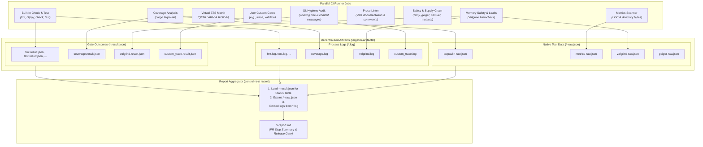
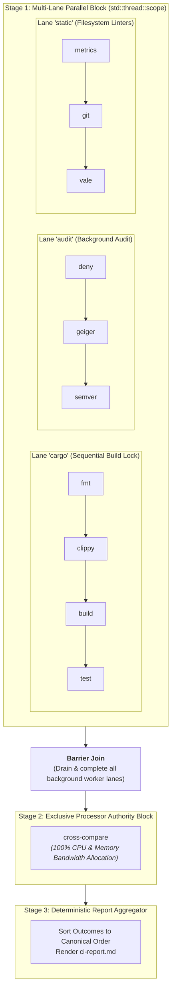

# Continuous Integration & Quality Gate Infrastructure (Design Document)


---

### 1. Introduction

High-assurance control systems and embedded firmware require verifiable,
reproducible, and automated quality gating. `control-rs-ci` provides a modular
quality gate runner, report aggregator, and verification harness for
`control-rs` and downstream safety-critical embedded systems.

The gating and reporting infrastructure follows a **minimal-parsing,
low-complexity design principle**:

- **Gate Execution & Log Separation**: Gates execute their underlying tools
  without performing complex intermediate schema translation. Full `stdout` and
  `stderr` streams are captured to a separate log file (`<gate>.log`), and any
  tool-native JSON or data files are dumped directly in their native format
  (`<gate>-raw.json`).
- **Standardized Execution Outcomes**: The `QualityGate` trait provides standard
  helpers to capture process execution metadata (`GateOutcome`: gate name,
  verdict, execution duration, exit code, summary, log path, and raw artifact
  path)
  written to `<gate>.result.json`.
- **Lightweight Built-In Extraction & Zero-Parsing Custom Gates**: The report
  aggregator (`control-rs-ci report`) performs lightweight, low-effort
  extraction
  on known built-in tool JSONs (for example, line counts from `metrics`, coverage %
  from
  `tarpaulin`, leak counts from `valgrind`, unsafe counts from `geiger`), while
  custom gates require **zero parsing**—reporting purely their verdict,
  duration,
  and linking to their stdout/stderr logs.

This architecture eliminates hundreds of lines of brittle parsing inside gate
runners, keeps gate implementations ultra-simple, and ensures custom
verification
gates integrate seamlessly without custom parsers.

---

### 2. Requirements

#### 2.1 Functional Requirements

- **FR-1 — Two-Tier Target Verification**: The pipeline must verify targets
  across both emulators (Tier 1: QEMU ARM Cortex-M and RISC-V) and physical
  hardware runners (Tier 2: NXP i.MX RT1062 / Teensy 4.1). Emulated coverage
  alone cannot establish electrical timing; physical coverage alone does not
  scale to per-pull-request automation.
- **FR-2 — Target Emulation**: The runner must compile target firmware, launch
  execution via `control-rs-ets-host`, and retrieve test outcomes, hardware
  cycle counts (ARM DWT / RISC-V), wall-clock duration ($\mu\text{s}$), and
  stack peak watermarks without manual intervention.
- **FR-3 — Configurable Pipeline Gates**: Built-in gates (formatting, linting,
  compilation checks, builds, tests, coverage, target emulation, metrics, git,
  vale, deny, geiger, semver, mutants, valgrind) and custom gates must execute
  in the order declared by the workspace. Each gate is configured as `skip`,
  `warn` (run, non-blocking), or `fail` (blocking).
- **FR-4 — QualityGate Trait & Outcome/Log Separation**: The `QualityGate` trait
  must execute gates under bounded timeouts, stream full stdout/stderr to
  `<gate>.log`, allow tools to dump raw native JSON data directly to
  `<gate>-raw.json`, and record execution metadata (`GateOutcome`: name,
  verdict,
  exit code, duration, summary) in `<gate>.result.json`.
- **FR-5 — Minimal-Parsing Report Aggregation**: The report aggregator
  (`control-rs-ci report`) must render `ci-report.md` from `GateOutcome`
  records,
  performing lightweight direct parsing on built-in tool outputs where
  available,
  and treating custom gates as opaque verdict and log providers with zero custom
  parsing.
- **FR-6 — Non-Zero Exit on Empty Verification**: Invocations expecting targets
  or suites that execute zero tests must exit non-zero, preventing
  false-positive passes from misconfigured filters.
- **FR-7 — Structured Tool Degradation**: Absence or failure of an external tool
  must surface as a structured warning in `GateOutcome` and log the missing
  binary diagnostic to `<gate>.log` rather than aborting or panicking.
- **FR-8 — Bounded Execution Timeouts**: Target executions and host gates must
  execute under explicit wall-clock bounds, terminating hung processes cleanly.
- **FR-9 — Declarative Workspace Configuration (`gate.toml`)**: Runner settings,
  execution gates, target matrices, tool thresholds, and user-defined custom
  gates must be declared in a workspace-root `gate.toml`.
- **FR-10 — User-Defined Custom Gate Execution**: The pipeline runner must
  support registering and executing custom verification gates written by the
  user (such as requirement traceability checkers, differential cross-validation
  harnesses, or custom static analyzers), executing them with declared
  arguments, environment variables, working directories, and timeout bounds.
- **FR-11 — Zero-Parsing Custom Gate Integration**: Custom gates execute as
  opaque processes. Their exit code determines the gate verdict, stdout/stderr
  is
  streamed to `<gate>.log`, and their outcome is displayed directly in the
  report without requiring custom JSON formatting or report parsers.
- **FR-12 — Fail-Closed Report Aggregation**: The report aggregator must derive
  overall pipeline success strictly from gate policies applied to `GateOutcome`
  verdicts. Any missing, corrupt, or failing fail-closed gate must fail the
  aggregator job with a non-zero exit status.
- **FR-13 — Topological Release Gating**: The release engine must verify
  workspace package manifests, validate dependency version constraints, and
  publish crates to crates.io in strict topological dependency order.
- **FR-14 — Project Codebase & Footprint Metrics (`metrics`)**: The runner must
  measure codebase size across tracked workspace files and directory footprints,
  writing native metrics data to `metrics-raw.json` and recording
  `metrics.result.json`.
- **FR-15 — Git Status & Commit History Hygiene (`git`)**: The runner must
  inspect working tree status for dirty/untracked files and audit commit
  messages on the active branch against hygiene rules (rejecting placeholder
  summaries such as "wip"/"asdf"), logging findings to `git.log` and recording
  `git.result.json`.
- **FR-16 — Prose & Documentation Style Linting (`vale`)**: The runner must
  execute Vale across documentation and doc comments, saving raw Vale JSON to
  `vale-raw.json`, streaming output to `vale.log`, and gracefully degrading
  (FR-7) when Vale is uninstalled.
- **FR-17 — Supply Chain & Advisory Security Gating (`deny`)**: The runner must
  execute `cargo-deny` against `deny.toml` to audit software licenses and
  RUSTSEC advisories, writing output to `deny.log` and recording
  `deny.result.json`.
- **FR-18 — Unsafe Code Surface & Memory Safety Audit (`geiger`)**: The runner
  must scan workspace crates with `cargo-geiger`, dumping raw metrics to
  `geiger-raw.json`, and enforcing configured `max_unsafe_blocks` bounds.
- **FR-19 — Public API Stability & SemVer Gating (`semver`)**: The runner must
  execute `cargo-semver-checks` against baseline releases, writing output to
  `semver.log` and recording `semver.result.json`.
- **FR-20 — Mutation Testing & Test Suite Rigor (`mutants`)**: The runner must
  support executing `cargo-mutants` to mutate syntax trees and verify test
  fault-detection rigor, dumping mutation metrics to `mutants-raw.json`.
- **FR-21 — Runtime Memory Safety & Leak Checking (`valgrind`)**: The runner
  must execute Valgrind Memcheck against host binaries and workspace examples,
  capturing memcheck logs to `valgrind.log`, raw leak summaries to
  `valgrind-raw.json`, and degrading gracefully (FR-7) when Valgrind is absent.
- **FR-22 — Declarative Multi-Lane Parallel Execution**: The runner must support
  partitioning quality gates into independent concurrent execution lanes declared
  in `gate.toml` (`[execution.lanes]`), executing lanes concurrently across worker
  threads while preserving sequential execution within each lane.
- **FR-23 — Exclusive Processor Authority Barriers (`exclusive = true`)**: Heavy,
  multi-threaded, or hardware-exclusive verification gates (such as `cross-compare`,
  `mutants`, or `valgrind`) must support declaring `exclusive = true`. The scheduler
  must drain and join all active background worker lanes before dispatching an exclusive
  gate with 100% processor authority, and block subsequent stages until complete.
- **FR-24 — Concurrency & Subsystem Resource Allocation**: The runner must support
  configuring thread caps, worker pool limits, and target directory isolation
  (`CARGO_TARGET_DIR`) per lane or per gate in `gate.toml`.

#### 2.2 Non-Functional Requirements

- **NFR-1 — Test State Isolation**: Each target test run must begin from a clean
  device state; target panics must trigger link teardown and target reset before
  subsequent tests execute.
- **NFR-2 — Outcome Schema Stability**: The `GateOutcome` JSON schema and
  Markdown output (`ci-report.md`) must remain stable and versioned across
  releases.
- **NFR-3 — Headless Dependency Floor**: The runner's dependency closure must
  contain zero GUI, terminal-event, or interactive styling crates.

#### 2.3 Constraints

- **C-1 — Target Architectures**: Hardware execution is constrained to ARM
  Cortex-M (`thumbv7em-none-eabihf`), RISC-V 32/64
  (`riscv32imac-unknown-none-elf`), and host (`x86_64`, `aarch64`).
- **C-2 — Indicative Emulation Timing**: Virtual QEMU execution is indicative
  only and does not model microarchitectural cache or bus contention; precise
  timing requires physical hardware (Tier 2).
- **C-3 — Step Summary Size Budget**: `ci-report.md` is budgeted
  to $\le 64\,\text{KiB}$ for human readability and fast PR rendering, with an
  absolute platform ceiling of 1 MiB ($1{,}048{,}576$ bytes) imposed by GitHub
  Actions step summaries [1].
- **C-4 — Irreversible Publication**: Crates.io publication is not idempotent;
  publishing commands must default to dry-run verification.
- **C-5 — Advisory / Fail-Closed Agreement**: Workflow jobs marked
  `continue-on-error` must match the aggregator's `--warn` list. A fail-closed
  gate must not use `continue-on-error`.
- **C-6 — Single MSRV Baseline**: All host tooling and runner crates must
  conform to the workspace `rust-version`.

---

### 3. Technical Overview

`control-rs-ci` decouples gate execution from report generation while
minimizing parsing overhead. Verification tasks fan out across parallel jobs.
Each gate execution captures:

1. **Execution Outcome (`<gate>.result.json`)**: Standardized process metadata
   (`GateOutcome`: gate name, verdict, execution duration, exit code, and
   summary).
2. **Standard Output & Error Log (`<gate>.log`)**: Full, unparsed `stdout` and
   `stderr` stream written to a dedicated log file.
3. **Optional Native Tool Data (`<gate>-raw.json`)**: Raw JSON dumped directly
   by underlying tools (e.g., `tarpaulin`, `metrics`, `valgrind`, `geiger`,
   `vale`)
   without intermediate conversion.

A final aggregation job fans in these artifacts, executing
`control-rs-ci report`
to produce `ci-report.md`. The aggregator processes all gates through their
`GateOutcome` records, performs lightweight, low-effort extraction on built-in
raw JSON files where available, and embeds stdout logs for custom gates and
failures without any custom gate parsing.



Developers also retain single-command local verification through `cargo ci` or
targeted gate execution (`cargo gate`).

---

### 4. Architecture

#### 4.1 Crate & Binary Structure

`control-rs-ci` provides a core library (`lib.rs`) containing shared
verification dispatch, metrics scanning, git hygiene checking, Vale prose
linting, safety-critical audits, custom gate invocation, configuration parsing,
and report rendering logic. The package exposes a unified CLI entry point
alongside focused binary targets:

| Binary / Command | Alias                | Responsibility                                                  |
|:-----------------|:---------------------|:----------------------------------------------------------------|
| `control-rs-ci`  | `cargo ci`           | Monolithic coordinator and quality gate runner                  |
| `gate`           | `cargo gate`         | Targeted quality gate execution (`--only`, `--skip`, `--up-to`) |
| `report`         | `cargo report`       | JSON artifact aggregator rendering `ci-report.md`               |
| `publish`        | `cargo publish-gate` | Topological workspace release validator and publisher           |

#### 4.2 Quality Gate Trait & Output Separation

Gate execution and process handling are unified via the `QualityGate` trait in
`control-rs-ci/src/quality_gate.rs`:

```rust
#[derive(Debug, Clone, PartialEq, Serialize, Deserialize)]
pub struct GateOutcome {
    pub gate: String,
    pub verdict: Verdict,                // Pass | Warn | Fail | Skipped
    pub exit_code: Option<i32>,
    pub duration_secs: f64,
    pub summary: Option<String>,
    pub log_file: String,               // e.g. "valgrind.log"
    pub raw_artifact: Option<String>,   // e.g. "valgrind-raw.json"
}

#[derive(Debug, Clone, Copy, PartialEq, Eq, Serialize, Deserialize)]
#[serde(rename_all = "lowercase")]
pub enum Verdict {
    Pass,
    Warn,
    Fail,
    Skipped,
}

pub trait QualityGate {
    fn name(&self) -> &str;
    fn description(&self) -> &'static str;
    fn execute(&self, ctx: &GateContext) -> Result<GateOutcome, GateError>;

    /// Spawns the process, redirects stdout and stderr directly to `log_path`,
    /// bounds execution by `timeout`, and captures process exit status and 
    /// duration.
    fn spawn_and_log(
        &self,
        cmd: &mut std::process::Command,
        log_path: &std::path::Path,
        timeout: std::time::Duration,
    ) -> Result<(std::process::ExitStatus, f64), GateError>;
}
```

The gate execution model follows a **zero-overhead process runner pattern**:

- **Log Redirection**: Every gate redirects `stdout` and `stderr` directly into
  its dedicated log file (`target/ci-artifacts/<gate>.log`). Gates do not parse
  or reformat CLI log streams.
- **Native Raw Dumps**: Tools that output JSON or data files (for example, `tarpaulin`,
  `metrics`, `geiger`, `valgrind`, `vale`) write their native output directly to
  `target/ci-artifacts/<gate>-raw.json` in whatever structure the tool natively
  emits.
- **Outcome Metadata**: Each gate writes a small `<gate>.result.json` containing
  the standardized `GateOutcome`.
- **Custom Gates**: `CustomCommandGate` executes arbitrary user-defined binaries
  or scripts, writes stdout/stderr to `<custom_gate>.log`, and records the
  resulting exit status. **Zero custom parsing** is performed on custom
  commands.

#### 4.3 Declarative Configuration (`gate.toml`)

Runner settings, execution gates, safety thresholds, metrics limits, git hygiene
policies, Vale rules, and user-defined custom gates are configured in
`gate.toml` at the workspace root:

```toml
[runner]
title = "control-rs"
out_dir = "target/ci"
timeout_secs = 90

[gates]
clean = "fail"
fmt = "fail"
clippy = "fail"
check = "fail"
build = "fail"
test = "fail"
coverage = "fail"
ets = "fail"
metrics = "warn"
git = "fail"
vale = "warn"
deny = "fail"
geiger = "fail"
semver = "fail"
mutants = "warn"
valgrind = "warn"

[metrics]
max_source_lines = 100_000
tracked_dirs = ["src", "control-rs-ets", "control-rs-macros",
    "control-rs-ets-host", "control-rs-tui", "control-rs-ci"]

[git]
require_clean_working_tree = true
enforce_conventional_commits = true
disallowed_patterns = ["wip", "temp", "asdf", "fix typo", "debug", "test1"]
max_header_length = 72

[vale]
config = ".vale.ini"
paths = ["documentation", "src", "control-rs-ets", "control-rs-macros",
    "control-rs-ets-host", "control-rs-tui", "control-rs-ci"]

[geiger]
max_unsafe_blocks = 0   # Zero-unsafe baseline for high-assurance core crates

[semver]
baseline_ref = "origin/main"

[mutants]
timeout_multiplier = 2.0

[valgrind]
leak_check = "full"
error_exitcode = 1
bins = ["control-rs-ci", "control-rs-tui"]
examples = ["pendulum", "lqr_control"]

[[ets.targets]]
name = "qemu-arm-hf"
target = "thumbv7em-none-eabihf"
bin = "control-rs-qemu-thumbv7em-none-eabihf"
args = ["--release"]

[[ets.targets]]
name = "qemu-riscv32"
target = "riscv32imac-unknown-none-elf"
bin = "control-rs-qemu-riscv32imac-unknown-none-elf"
args = ["--release"]

# User-Defined Custom Quality Gates (Zero Parsing)
[custom_gates.traceability]
command = "cargo run --package control-rs-trace"
policy = "fail"
timeout_secs = 60

[custom_gates.cross_validation]
command = "cargo run --package control-rs-validate"
policy = "fail"
timeout_secs = 120
```

#### 4.4 Artifact Structure & Decentralized Storage Protocol

Quality gate runs produce three lightweight artifact streams in
`target/ci-artifacts/`:

1. **Gate Outcomes (`<gate>.result.json`)**:
   Standardized metadata recording execution status, duration, and exit codes.
   ```json
   {
     "gate": "valgrind",
     "verdict": "pass",
     "exit_code": 0,
     "duration_secs": 8.42,
     "summary": "Valgrind Memcheck clean (0 leaks, 0 errors)",
     "log_file": "valgrind.log",
     "raw_artifact": "valgrind-raw.json"
   }
   ```
2. **Process Execution Logs (`<gate>.log`)**:
   Unmodified standard output and standard error captured during execution
   (e.g., `fmt.log`, `clippy.log`, `valgrind.log`, `traceability.log`).
3. **Optional Native Tool Data (`<gate>-raw.json`)**:
   Unmodified native JSON or text files generated directly by underlying tools
   (e.g., `tarpaulin-raw.json`, `metrics-raw.json`, `geiger-raw.json`,
   `vale-raw.json`, `valgrind-raw.json`).

#### 4.5 Report Aggregator & Lightweight Extraction

`control-rs-ci report` minimizes parsing effort while producing a comprehensive
`ci-report.md`:

1. **Outcome Ingestion & Executive Summary**:
   The aggregator reads all `target/ci-artifacts/*.result.json` files and
   formats
   the primary status matrix:

| Gate           | Verdict | Duration | Exit Code | Summary                    | Log   |
|:---------------|:--------|:---------|:----------|:---------------------------|:------|
| `fmt`          | Pass    | 0.42s    | 0         | Formatting clean           | [log] |
| `valgrind`     | Pass    | 8.42s    | 0         | 0 leaks, 0 errors          | [log] |
| `traceability` | Pass    | 1.15s    | 0         | Process completed (code 0) | [log] |

2. **Policy Evaluation & Gate Completeness**:
   The aggregator verifies that all gates configured as `fail` in `gate.toml`
   are present and reported `Verdict::Pass`. Any missing or failed fail-closed
   gate triggers non-zero exit status (FR-12).
3. **Lightweight Built-In Metrics Extraction**:
   For built-in gates where native JSON outputs provide high-value metrics, the
   aggregator performs simple, low-effort extraction of key fields:
    - **Line Coverage (`tarpaulin-raw.json`)**: Extracts total coverage
      percentage.
    - **Codebase Metrics (`metrics-raw.json`)**: Extracts source line count and
      total disk bytes.
    - **Unsafe Surface (`geiger-raw.json`)**: Extracts total unsafe block count.
    - **Memory Leaks (`valgrind-raw.json`)**: Extracts lost byte count and
      memory error count.
      If a raw JSON file is missing or unparseable, the aggregator gracefully
      falls back to displaying the exit status from `GateOutcome` without
      failing the report.
4. **Zero-Parsing Custom Gates & Failure Diagnostics**:
   Custom gates are rendered strictly from their `GateOutcome` and linked log
   file. When any gate (built-in or custom) fails or emits warnings, the
   aggregator embeds the trailing 20–40 lines of `<gate>.log` into an expandable
   Markdown details section for immediate triage.
5. **Step Summary Sizing Budget**:
   The aggregator caps embedded log sections to guarantee `ci-report.md` remains
   $\le 64\,\text{KiB}$ (C-3).

#### 4.6 Execution Tiers: Virtual Emulation & Physical ETS

- **Tier 1 (Virtual QEMU)**: Emulates ARM Cortex-M (`mps2-an500`,
  `cortex-m7`) [2], [3] and RISC-V (`virt`, `riscv32`) targets. Provides rapid
  pull-request validation and functional verification without physical hardware
  dependencies.
- **Tier 2 (Physical Hardware ETS)**: Connects to hardware boards (NXP i.MX
  RT1062 / Teensy 4.1) over USB CDC serial. Captures hardware cycle counter
  measurements (ARM DWT CYCCNT) and painted stack memory peaks under
  deterministic real-time execution.

#### 4.7 Automated Release System & Branch Preservation

When changes merge to `main`, `.github/workflows/release.yml` invokes
`control-rs-ci publish` to gate distribution:

1. **Verification**: Ensures all fail-closed gates pass.
2. **Topological Publishing**: Resolves the internal workspace dependency graph
   and publishes public crates to crates.io in strict topological order
   (`control-rs-ets` $\to$ `control-rs-macros` $\to$ `control-rs` $\to$
   `control-rs-ets-host` $\to$ `control-rs-tui` $\to$ `control-rs-ci`).
3. **Branch-per-Version Preservation**: Automatically creates and pushes
   immutable Git branches `release/vX.Y.Z` (for example, `release/v0.1.0`) to origin
   for audit baselines and historical maintenance.
4. **GitHub Release Assets**: Bundles pre-compiled host CLI binaries
   (`control-rs-ci`, `control-rs-tui`), SHA-256 checksums, and validation
   summary reports.

#### 4.8 Configurable Multi-Lane Parallel Execution & Processor Authority

Sequential quality gate execution scales with the sum of all tool durations.
`control-rs-ci` provides a zero-dependency, configurable multi-lane parallel
execution model using `std::thread::scope`:

##### Declarative Lane & Authority Architecture



##### Declarative `gate.toml` Configuration Schema

Execution lanes, concurrency flags, thread allocations, and barrier gates are
declared in `gate.toml`:

```toml
[execution]
parallel = true # Enable multi-lane concurrency (defaults to true)
exclusive_gates = ["cross-compare", "valgrind", "mutants"] # Full processor authority barriers

# Declarative execution lanes:
# Gates in different lanes run concurrently in parallel worker threads;
# gates within a single lane execute sequentially in declared order.
[execution.lanes]
cargo = ["fmt", "clippy", "build", "test"]
audit = ["deny", "geiger", "semver"]
static = ["metrics", "git", "vale"]
```

##### Cargo Build-Lock & Process Isolation

1. **Zero-Contention Default Lanes**: Gates that acquire Cargo's primary `target/`
   compilation lock (`fmt`, `clippy`, `build`, `test`) reside in a single sequential
   lane (`cargo`), while non-compiling gates (`audit`, `static`) run in parallel
   without lock contention.
2. **Directory Isolation (`CARGO_TARGET_DIR`)**: Gates requiring concurrent Cargo
   compilation (such as `cargo-semver-checks` or isolated custom gates) are
   assigned dedicated target directories (`CARGO_TARGET_DIR=target/ci-artifacts/targets/<gate>`).
3. **Full Processor Authority (`exclusive = true`)**: Heavy numerical suites,
   mutation engines, and memory profilers that require unrestricted CPU and
   memory bandwidth declare `exclusive = true`. The runner drains all active
   background threads before starting the exclusive gate, eliminating contention.
4. **Deterministic Aggregation**: Outcomes from asynchronous lanes are gathered
   into a thread-safe collector and sorted to match the declared canonical gate
   order before rendering `ci-report.md`.

---

### 5. Alternatives

| Alternative                                        | Rejected Because                                                                                                                                                                                                                                          | Reference     |
|:---------------------------------------------------|:----------------------------------------------------------------------------------------------------------------------------------------------------------------------------------------------------------------------------------------------------------|:--------------|
| **Heavy Intermediate Schema Parsing Inside Gates** | Requires writing and maintaining complex regex/AST parsers inside each gate to convert raw tool data into a heavy intermediate schema. Fragile, high maintenance, and creates barriers for custom gates.                                                  |               |
| **Monolithic Single-Runner CI**                    | Monolithic execution prevents parallel job fan-out in GitHub Actions, dramatically increasing PR cycle times.                                                                                                                                             | [1]           |
| **Hardcoding Domain Gates into CI Crate**          | Hardcoding custom checks (traceability, differential validation) directly into `control-rs-ci` violates modular decoupling and prevents users from defining project-specific gates.                                                                       |               |
| **Renode as Tier 1 Emulator**                      | Renode models peripheral networks and SoCs [4], [5], but uses integer MIPS performance rather than hardware cycle counters [6], and lacks built-in platform definitions for i.MX RT1062. QEMU is simpler and faster for Tier 1 CPU verification [2], [3]. | [2], [4], [6] |
| **Shell Script Orchestration**                     | Hand-rolled shell scripts drift across local and CI environments, lack structured artifact generation, and cannot provide compile-time shape verification or robust timeout isolation.                                                                    |               |
| **Silent Missing Gate Passes**                     | Assuming a missing gate passed allows silent CI configuration regressions where failing jobs are bypassed. Fail-closed aggregation is mandatory.                                                                                                          | [1]           |

---

### 6. Verification & Validation

#### 6.1 Plan

| Kind      | Step                                  | Establishes                                                                                                              |
|:----------|:--------------------------------------|:-------------------------------------------------------------------------------------------------------------------------|
| `test`    | QualityGate Trait Unit Tests          | Dispatches argv, tracks process duration, and handles exit codes correctly across built-in gate implementations.         |
| `test`    | GateOutcome & Log File Isolation      | Verifies that stdout/stderr is written to `<gate>.log` and `<gate>.result.json` records accurate status.                 |
| `test`    | Lightweight Built-In Extraction Tests | Verifies direct, safe extraction from `tarpaulin-raw.json`, `metrics-raw.json`, `valgrind-raw.json`, `geiger-raw.json`.  |
| `test`    | Custom Gate Zero-Parsing Tests        | Verifies that custom commands are reported accurately with logs attached and zero custom parsing overhead.               |
| `test`    | Project Codebase Metrics Scanner      | Accurately counts source, comment, blank, and total lines by file type, and calculates directory byte footprints.        |
| `test`    | Git Hygiene & Commit Message Linter   | Detects dirty working tree state and rejects non-compliant or sloppy commit messages (for example, "wip", "asdf").              |
| `test`    | Vale Prose Linter Dispatch            | Invocations capture output to `vale.log` and degrade gracefully when Vale is uninstalled.                                |
| `test`    | Supply Chain & Advisory Gating        | Executes `cargo-deny` with `deny.toml` policy and logs licensing and security advisory records.                          |
| `test`    | Memory Safety & Geiger Scanner        | Accurately writes `geiger-raw.json` and enforces `max_unsafe_blocks` bounds.                                             |
| `test`    | SemVer Public API Compatibility Check | Dispatches `cargo-semver-checks` against baseline reference and logs breaking signature changes.                         |
| `test`    | Mutation Testing Execution Harness    | Dispatches `cargo-mutants` with timeout multipliers and writes `mutants-raw.json`.                                       |
| `test`    | Valgrind Memory Safety & Leak Check   | Dispatches Valgrind Memcheck against host binaries, writing `valgrind.log` and `valgrind-raw.json` with degradation.     |
| `test`    | Config Parsing & CLI Precedence Tests | `gate.toml` parsing (built-in, metrics, git, vale, safety gates, custom), `--only`, `--skip`, `--up-to`, and precedence. |
| `test`    | Fail-Closed Aggregation Fixture Tests | Aggregator fails when required artifacts (built-in or custom) are missing, corrupt, or report fail verdicts.             |
| `test`    | Topological Sorter Unit Tests         | Manifest dependency graph correctly sorts workspace crates without cycles.                                               |
| `test`    | Multi-Arch QEMU Integration Tests     | Headless ETS session executes cleanly against virtual ARM Cortex-M and RISC-V binaries.                                  |
| `example` | Pedagogical Workspace Examples        | Verifies that all host examples build and execute cleanly under CI automation.                                           |

#### 6.2 Acceptance

| Claim                              | Oracle                     | Measure        | Bound                                                                                    |
|:-----------------------------------|:---------------------------|:---------------|:-----------------------------------------------------------------------------------------|
| **Gate Exit Code Accuracy**        | Process Exit Status        | Exact Equality | Process returns code 0 on all-pass; non-zero on any fail-closed gate failure             |
| **Log File Isolation**             | Filesystem Artifact        | Exact Match    | 100% of process stdout/stderr stream is captured into `target/ci-artifacts/<gate>.log`   |
| **GateOutcome Metadata Accuracy**  | Serialization Oracle       | Exact Match    | `<gate>.result.json` matches actual process exit status and duration $\pm 50\,\text{ms}$ |
| **Commit Hygiene Policy**          | Git History Audit          | Pattern Match  | Rejects 100% of disallowed commit message patterns (`wip`, `temp`, etc.) on fail-closed  |
| **Vale Missing Binary Handling**   | QualityGate Execution      | Error Record   | Emits structured warning and continues when `vale = "warn"`, exits non-zero if `"fail"`  |
| **Supply Chain Violation Check**   | `cargo-deny` Audit Engine  | Exact Match    | Rejects banned licenses and un-reviewed RUSTSEC advisories on fail-closed                |
| **Unsafe Surface Policy Bound**    | `cargo-geiger` Scanner     | Integer Count  | Fails when `unsafe` blocks $> \text{max\_unsafe\_blocks}$ in configured crates           |
| **SemVer Compatibility Gate**      | `cargo-semver-checks`      | Exact Match    | Rejects breaking public API modifications unless major version bump is declared          |
| **Valgrind Zero-Leak Bound**       | Valgrind Memcheck          | Leak & Error # | Zero definitely/indirectly lost bytes and zero memory errors on host binaries & examples |
| **Custom Gate Policy Enforcement** | Process Exit Status        | Exact Equality | Non-zero exit code on blocking custom gate failure; 0 on advisory (`warn`) failure       |
| **Execution Timeout Enforcement**  | System Monotonic Clock     | Absolute Time  | Process terminated within $\pm 500\,\text{ms}$ of configured `timeout_secs`              |
| **Step Summary Size Budget**       | Serialized Byte Count      | Absolute Size  | `ci-report.md` size $\le 64\,\text{KiB}$ target ($< 1\,\text{MiB}$ platform ceiling) [1] |
| **Topological Sort Order**         | Workspace Dependency Graph | Exact Equality | Dependencies precede dependees in publish sequence                                       |

#### 6.3 Limits

- Virtual emulation (Tier 1) does not establish physical cycle-accurate
  execution times or analog signal integrity (C-2).
- Hardware execution (Tier 2) requires an active physical device connected to a
  self-hosted runner.

---

### 7. Performance & Resource Considerations

- **Step Summary Limit**: `ci-report.md` is budgeted for $\le 64\,\text{KiB}$
  (typically 5–20 KiB) for responsive human inspection and stays strictly under
  the 1 MiB GitHub Actions limit [1]. When test counts are large, the report
  truncates per-case tables while preserving aggregate metrics.
- **Process & Timeout Bounds**: Built-in and custom gate processes are spawned
  with bounded timeouts (default 90s) to prevent hung runner instances.
- **Memory Footprint**: `control-rs-ci` operates with zero continuous memory
  allocation overhead; artifact ingestion streams JSON data directly to report
  renderers.

---

### 8. Risks & Open Questions

- **Physical Runner Availability**: Hardware lab runners may experience
  temporary disconnects; the serial transport must gracefully report unavailable
  hardware without panicking.
- **Toolchain MSRV Drift**: External cargo subcommands (such as
  `cargo-tarpaulin`, `cargo-deny`, `cargo-geiger`, `cargo-semver-checks`) must
  remain compatible with the workspace `rust-version`.
- **Custom Gate Schema Extensibility**: Defining a lightweight schema contract
  for custom JSON reports ensures new user-written gates render cleanly in
  `ci-report.md` without requiring changes to the core aggregator binary.

---

### 9. Development Plan

| Phase / Task                                                          | Description                                                                                                                                                                                                                                                                                                                          | Estimated Effort |
|:----------------------------------------------------------------------|:-------------------------------------------------------------------------------------------------------------------------------------------------------------------------------------------------------------------------------------------------------------------------------------------------------------------------------------|:-----------------|
| **Phase 1: Core QualityGate Infrastructure & Built-In Cargo Gates**   | Implement `QualityGate` trait, `spawn_and_log` stdout/stderr redirection, `GateOutcome` schema, `gate.toml` configuration parser, core built-in Cargo gates (`fmt`, `clippy`, `check`, `build`, `test`, `clean` via `CargoArgvGate`), and baseline repository hygiene gates (`MetricsGate`, `GitHygieneGate`) in `control-rs-ci`.    | 3                |
| **Phase 2: Decentralized Artifact Protocol & Core Reporting**         | Implement report aggregator (`control-rs-ci report`), `*.result.json` outcome ingestion, baseline `ci-report.md` status table generation, failure diagnostics with log snippet embedding, and $\le 64\,\text{KiB}$ step summary budget enforcement.                                                                                  | 2                |
| **Phase 3: Advanced Safety, Linter & Verification Gates**             | Implement specialized built-in tool gates and lightweight extraction: `CoverageGate` (`cargo-tarpaulin`), `ValeGate` (prose linting with degradation), `DenyGate` (`cargo-deny`), `GeigerGate` (`cargo-geiger`), `SemverGate` (`cargo-semver-checks`), `MutantsGate` (`cargo-mutants`), and `ValgrindGate` (Memcheck leak checking). | 4                |
| **Phase 4: User-Defined Custom Gate Engine & Multi-Target Emulation** | Implement `CustomCommandGate` (zero-parsing opaque runner for user-defined binaries/scripts) and configure QEMU ARM Cortex-M and RISC-V headless emulation matrix (`EtsGate`) in `.github/workflows/CI.yml` and `.github/workflows/examples.yml`.                                                                                    | 3                |
| **Phase 5: Automated Git Release System & Branch Preservation**       | Implement `control-rs-ci publish`, topological dependency sorter, and `.github/workflows/release.yml` with `release/vX.Y.Z` branch preservation.                                                                                                                                                                                     | 3                |
| **Phase 6: Multi-Lane Parallel Execution & Processor Authority**     | Implement declarative multi-lane parallel scheduler using `std::thread::scope`, `[execution.lanes]` in `gate.toml`, barrier synchronization for `exclusive = true` gates, and `CARGO_TARGET_DIR` directory isolation.                                                                                                            | 3                |

---

### 10. Revision History

| Revision | Date               | Author          | Description                                                                                                                                                                                                                     |
|:---------|:-------------------|:----------------|:--------------------------------------------------------------------------------------------------------------------------------------------------------------------------------------------------------------------------------|
| 1.0      | May 24, 2026       | @MitchellDScott | Initial skeletal outline of CI testing.                                                                                                                                                                                         |
| 1.1      | July 18, 2026      | @MitchellDScott | Multi-tier CI architecture: specified Renode virtual simulation and physical hardware runners.                                                                                                                                  |
| 1.2      | August 6, 2026     | @MitchellDScott | Scope refinement: consolidated Tier 2 physical runner architecture onto dedicated device harnesses.                                                                                                                             |
| 1.3      | September 9, 2026  | @MitchellDScott | Packaging alignment: updated host orchestration to invoke `control-rs-ets-host::ServerBridge` headlessly.                                                                                                                       |
| 1.4      | September 9, 2026  | @MitchellDScott | Crate split: relocated to `documentation/ci/`; runner identity moved to `control-rs-ci`.                                                                                                                                        |
| 1.5      | September 13, 2026 | @MitchellDScott | Decentralized tool architecture: split into standalone binaries backed by reusable `lib.rs` and JSON artifact exchange protocol.                                                                                                |
| 1.6      | September 15, 2026 | @MitchellDScott | `QualityGate` trait abstraction, `gate.toml` key-ordered pipeline, and fail-closed aggregation.                                                                                                                                 |
| 1.7      | September 18, 2026 | @MitchellDScott | Complete alignment with Product Roadmap: PR3 QualityGate infrastructure, PR6 QEMU multi-arch virtual ETS, and PR11 automated Git release system with version branch preservation (`release/vX.Y.Z`).                            |
| 1.8      | September 19, 2026 | @MitchellDScott | Decoupled domain-specific gates: extracted requirement traceability and differential cross-validation to standalone design docs, and generalized `control-rs-ci` for user-defined custom gates.                                 |
| 1.9      | September 19, 2026 | @MitchellDScott | Added built-in project codebase metrics gating (line counts by type, directory byte footprints) and repository git hygiene gating (working tree status, commit message validation).                                             |
| 1.10     | September 19, 2026 | @MitchellDScott | Added built-in prose and documentation style linting gate (`ValeGate`, FR-16) for automated `.vale.ini` rule enforcement and report generation (`vale-report.json`).                                                            |
| 1.11     | September 19, 2026 | @MitchellDScott | Added built-in safety-critical quality gates: supply chain licensing (`DenyGate`, FR-17), memory safety surface (`GeigerGate`, FR-18), API SemVer stability (`SemverGate`, FR-19), and mutation testing (`MutantsGate`, FR-20). |
| 1.12     | September 19, 2026 | @MitchellDScott | Added built-in runtime memory safety and leak checking gate (`ValgrindGate`, FR-21) for host binaries and workspace examples (`valgrind-report.json`).                                                                          |
| 1.13     | September 19, 2026 | @MitchellDScott | Decoupled gating and reporting: established standardized `GateReport` uniform envelope contract and gate-agnostic report aggregation with zero per-tool parsers in the report binary.                                           |
| 1.14     | September 19, 2026 | @MitchellDScott | Minimal-parsing architecture: gates dump native tool JSON and redirect stdout/stderr to `<gate>.log`; report performs lightweight extraction for built-ins and zero parsing for custom gates.                                   |
| 1.15     | September 19, 2026 | @MitchellDScott | Refined development plan: staged implementation starting with core QualityGate infrastructure and built-in Cargo/hygiene gates, deferring complex tool integrations and custom gates to follow-up phases.                       |
| 1.16     | September 20, 2026 | @MitchellDScott | Added declarative multi-lane parallel execution (`[execution.lanes]`, FR-22), exclusive processor authority barrier synchronization (`exclusive = true`, FR-23), and concurrency resource allocation (FR-24).                |

---

## References

[1] GitHub, "Workflow commands for GitHub Actions," *GitHub Docs*. [Online].
Available
: 
https://docs.github.com/en/actions/reference/workflows-and-actions/workflow-commands.
Accessed: Sep. 9, 2026.

[2] QEMU Project, "Arm System emulator," *QEMU System Emulation User's
Guide*. [Online].
Available: https://www.qemu.org/docs/master/system/target-arm.html. Accessed:
Sep. 9, 2026.

[3] QEMU Project, "Translator Internals," *QEMU Developer's Guide*. [Online].
Available: https://www.qemu.org/docs/master/devel/tcg.html. Accessed: Sep. 9,

2026.

[4] Antmicro, *Renode*: functional simulation framework for embedded
systems. [Online]. Available: https://github.com/renode/renode. Accessed: Sep.
9, 2026.

[5] Antmicro, "Testing with Renode," *Renode documentation*. [Online].
Available: https://renode.readthedocs.io/en/latest/introduction/testing.html.
Accessed: Sep. 9, 2026.

[6] Antmicro, "Time framework," *Renode documentation*. [Online].
Available: https://renode.readthedocs.io/en/latest/advanced/time_framework.html.
Accessed: Sep. 9, 2026.


