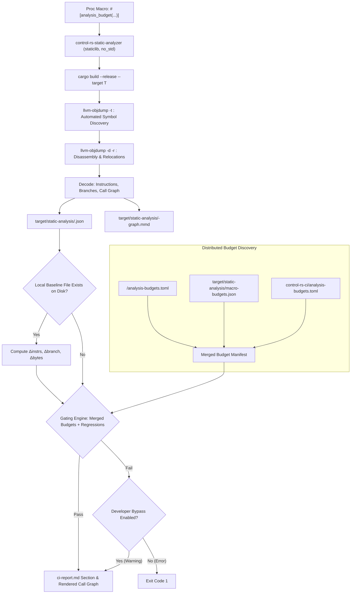
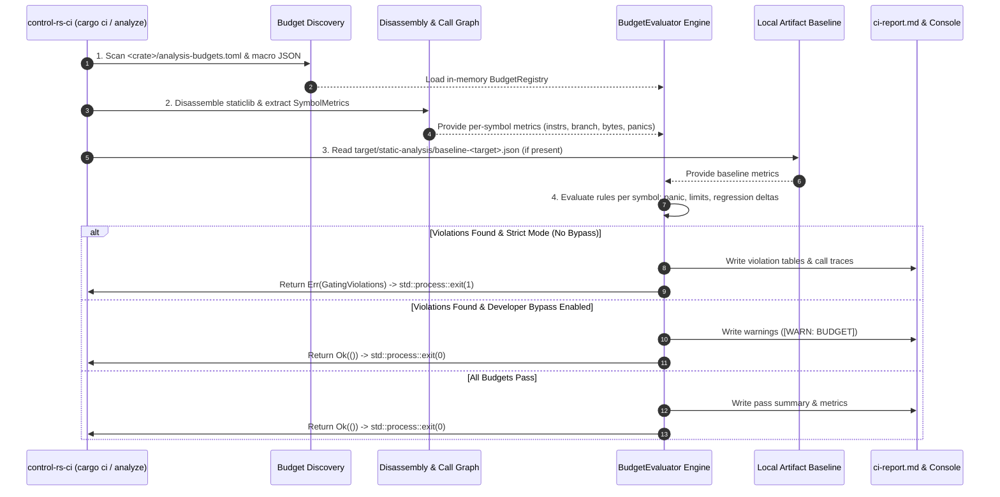

# Static Code Analysis Task (Design Document)


---

### 1. Introduction

This document specifies the static analysis subsystem of `control-rs-ci`,
along with the `control-rs-static-analyzer` fixture crate. Static analysis
operates as an integrated gate within the CI pipeline, performing post-codegen
object-level verification of instruction budgets, branch counts, code size, and
panic-path reachability across bare-metal target architectures.

#### Scenario 1: Embedded Control Engineer Verifying Panic Freedom

An embedded control engineer is deploying an attitude estimator and PID
controller to bare-metal microcontroller targets. The codebase passes all
source-level linters (`clippy` denying panics, unwrap, indexing, and arithmetic
side effects), but compiler-inserted bounds checks, generic formatting calls, or
core panicking infrastructure may still be generated in the final machine code.
If a panic path survives optimization, encountering it in flight causes an
unhandled CPU fault or watchdog reset. The engineer needs an automated
post-codegen verification tool to prove that compiled control routines contain
zero reachable panic call edges.

#### Scenario 2: Component Author Defining Distributed Budgets via Proc Macros or Local Files

A component developer in a modular crate (such as `control-rs-ets` or a
downstream control toolbox) needs to enforce instruction and branch budgets on
their algorithms without having access to or modifying the central
`control-rs-ci` crate. The author declares budgets directly at the component
level—either using procedural macro attributes (`#[analysis_budget(...)]`) above
wrapper functions or by placing an `analysis-budgets.toml` file in their crate
root. The static analyzer automatically discovers and merges these distributed
component budgets during analysis.

#### Scenario 3: CI Pipeline Maintainer Enforcing Execution Budgets

A CI maintainer needs automated pull-request gating to enforce strict
instruction count and branch complexity limits on inner control loops across
target ISAs (`thumbv7em-none-eabihf` and `riscv32imac-unknown-none-elf`). By
embedding static analysis directly into `cargo ci`, pull requests automatically
verify machine-code budgets, compare metrics against local stashed baseline
artifacts, and fail if unapproved regressions occur, preventing real-time
deadline violations on embedded targets.

#### Scenario 4: Library Developer Prototyping and Visualizing Call Graphs

A library developer is refactoring matrix multiplication and polynomial
evaluation routines. Using cargo aliases (`cargo analyze --item crs_poly_eval`),
the developer rapidly inspects disassembled machine instructions, branch counts,
and an exported renderable call graph (in Mermaid format) on host without
running the entire test suite. With developer bypass options enabled, the
developer iterates freely during prototyping without being blocked by budget
gates or regression checks until the implementation stabilizes.

---

### 2. Requirements

#### 2.1 Functional Requirements

- **FR-1 — Object-level metric extraction**: Build the target code for a
  specified cross-compilation triple and extract instruction counts, branch
  counts, `.text` size, and static call trees per symbol directly from the
  compiled binary object [1], [2].
  Source-level analysis is insufficient because compiler-inserted bounds checks
  and monomorphizations only exist in machine code [3].
- **FR-2 — Panic path reachability detection**: Traverse static call graphs and
  relocation entries to identify every call path reaching a panic entry point
  from an analyzed root [2], [4]. Bounded to static
  call chains resolvable through symbol and relocation tables; dynamic dispatch
  or untracked function pointers require separate validation [5].
- **FR-3 — Distributed & component-level budget enforcement**: Evaluate
  extracted metrics against per-symbol budgets defined either via distributed
  component files (`<crate>/analysis-budgets.toml`) or via procedural macro
  attributes (`#[analysis_budget(...)]`), merged automatically during analysis.
  The gate must provide a developer bypass option (`--bypass-gate` / non-strict
  mode) that converts gating failures into non-fatal diagnostic warnings during
  prototyping.
- **FR-4 — Local artifact baseline diffing**: Compare extracted per-symbol
  metrics against a local baseline artifact file (
  `target/static-analysis/baseline-<target>.json`) when present on disk,
  computing delta values for instructions, branches, and code size. The analyzer
  interacts solely with local filesystem paths without invoking remote or
  version-control operations; external caching and stashing across CI runs is
  managed by the CI workflow.
- **FR-5 — Structured reporting and CI integration**: Execute static analysis as
  a built-in phase of `cargo ci`, appending a dedicated summary section to
  `ci-report.md` and producing machine-readable JSON artifacts, while supporting
  standalone item inspection via cargo aliases.
- **FR-6 — Automated item discovery in static-analyzer fixture**: Automatically
  discover analyzable functions and entry points within the
  `control-rs-static-analyzer` fixture crate from the compiled symbol table
  without requiring manual symbol registration in `control-rs-ci` [6],
  [7], [3].
  Uninstantiated generic items are excluded from analysis until instantiated in
  the fixture crate.
- **FR-7 — Renderable call-graph export**: Emit a structured, renderable
  description of the discovered static call graph (in Mermaid flowchart syntax
  and node-link JSON) to enable developers and CI reports to visualize call
  paths, recursion, and dependency fan-out directly.

#### 2.2 Non-Functional Requirements

- **NFR-1 — Deterministic output**: Analysis JSON artifacts and call graph
  descriptions must produce byte-identical results for identical inputs,
  toolchains, and target architectures, with stable symbol ordering and
  formatting.
- **NFR-2 — Self-contained toolchain dependencies**: The analyzer must rely
  solely on standard Rust toolchain components (such as `llvm-tools` via
  `cargo-binutils` or `llvm-objdump`) without requiring external network access
  or git commands during execution [8], [2].
- **NFR-3 — Bounded execution time**: Analysis execution must be bounded via
  depth and node limits, adding no more than two minutes per target architecture
  to continuous integration runs.

#### 2.3 Constraints

- **C-1 — Target architecture matrix**: Analysis targets are constrained to
  `thumbv7em-none-eabihf` (ARM Cortex-M4F/M7) and
  `riscv32imac-unknown-none-elf` (RISC-V 32-bit), compiled under the release
  profile with fat LTO and single codegen units [5], [9].
- **C-2 — Strict `#![no_std]` and zero runtime allocation in fixture**: The
  `control-rs-static-analyzer` crate must compile with `#![no_std]` and without
  a host memory allocator, ensuring analysis matches the embedded deployment
  environment.
- **C-3 — Host-only task isolation**: The static analyzer task logic resides
  exclusively within `control-rs-ci` and must never introduce runtime
  dependencies into the core `control-rs` library crate.

---

### 3. Technical Overview

The static analyzer provides post-compilation inspection of `control-rs`
algorithms by compiling monomorphized library fixtures from
`control-rs-static-analyzer` into standalone static libraries, decoding the
generated machine code, constructing static call graphs, evaluating distributed
component budgets, and emitting renderable Mermaid graph diagrams. The task
requires expertise in ELF object formats, symbol tables, relocation processing,
disassembler interfaces, ISA-specific control-transfer instruction taxonomy (ARM
Thumb-2 and RISC-V RV32IMAC), procedural macro metadata generation, local
artifact regression comparison, and CI reporting integration.

---

### 4. Architecture

#### 4.1. Analysis Pipeline Overview

The static analysis pipeline runs either as a built-in step during `cargo ci` or
via standalone cargo aliases (`cargo analyze`, `cargo analyze-ci`).



Each analyzed root produces a node in the call graph containing:

- `depth`: Static call-graph distance from the analyzed root.
- `instrs`: Decoded instruction count for the symbol's own assembly body.
- `branch`: Control-transfer instruction count classified per target ISA.
- `panics`: Reachable panic call paths and relocation target entries.
- `callees`: List of direct call edges resolving to internal or external
  symbols.

#### 4.2. Automated Item Discovery & `control-rs-static-analyzer` Crate

Generic functions produce no machine code until instantiated with concrete
scalar types and dimensions [3]. To provide
concrete entry points for analysis, a dedicated fixture crate
`control-rs-static-analyzer` is established.

The fixture is a `#![no_std]` `staticlib` [1] that
instantiates monomorphizations behind `#[unsafe(no_mangle)] pub extern "C"`
wrapper functions [6], [7]:

```rust
#![no_std]
use control_rs::matrix::Matrix;
use control_rs_macros::analysis_budget;

#[analysis_budget(max_instrs = 320, max_branch = 40, allow_panic = false)]
#[unsafe(no_mangle)]
pub extern "C" fn crs_matrix_mul_f32_3x3(
    a: &Matrix<f32, 3, 3>,
    b: &Matrix<f32, 3, 3>,
    out: &mut Matrix<f32, 3, 3>,
) {
    *out = a * b;
}
```

**Automated Discovery**: Developers do not register symbols or items in `control-rs-ci`.
Instead, the analyzer scans the compiled static library's symbol table with
`llvm-objdump -t` and automatically discovers all defined `.text` symbols
matching the prefix `crs_*`. Adding a new
exported wrapper to `control-rs-static-analyzer` immediately includes it in
analysis, visualization, and CI gating without modifying any `control-rs-ci` source
files.

#### 4.3. Distributed Budget Architecture & Proc-Macro Generation

To ensure components can define and maintain their own budgets without requiring
access to `control-rs-ci`, the analyzer supports a multi-tier distributed
budget architecture:

1. **Procedural Macro Budget Attributes (`#[analysis_budget(...)]`)**:
   Provided by `control-rs-macros`, the attribute attaches inline budget
   constraints directly to the function definition. During compilation, the
   macro emits a build artifact or JSON descriptor into
   `target/static-analysis/macro-budgets.json` recording the symbol name, target
   overrides, instruction limits, and panic allowances.
2. **Distributed Component Configuration Files (`<crate>/analysis-budgets.toml`)
   **:
   Individual crates within the workspace can define their own
   `analysis-budgets.toml` in their crate directory:
   ```toml
   [thumbv7em-none-eabihf."crs_matrix_mul_f32_3x3"]
   allow_panic = false
   max_instrs = 320
   max_branch = 40
   max_text_bytes = 1024
   ```
3. **Budget Discovery & Precedence**:
   During analysis, `control-rs-ci` discovers all budget sources across the
   workspace and merges them using the following precedence:
    - *Tier 1 (Highest)*: Function-level procedural macro attributes (
      `#[analysis_budget]`).
    - *Tier 2*: Component-local `analysis-budgets.toml` files in respective
      crate directories.
    - *Tier 3 (Lowest)*: Centralized workspace
      `control-rs-ci/analysis-budgets.toml` defaults.

#### 4.4. Disassembly and Symbol Extraction

The analyzer invokes `llvm-objdump` (shipped with the Rust toolchain via
`rustup component add llvm-tools` and `cargo-binutils`) [8], [2]:

1. `llvm-objdump -t --demangle <artifact>`: Discovers all defined `.text`
   symbols, section bindings, and byte sizes without manual item lists [2].
2. `llvm-objdump -d -r --demangle <artifact>`: Emits disassembly of executable
   sections with interspersed relocation records [2].

#### 4.5. Control-Transfer Instruction Classification

Instructions are classified into sequential instructions and control-transfer (
branch) instructions:

- **RISC-V (RV32I/RV32IMAC)**: Unconditional jumps (`JAL`, `JALR`) and
  conditional branches (`BEQ`, `BNE`, `BLT`, `BLTU`, `BGE`, `BGEU`) [9].
- **ARM Thumb-2 (Thumbv7E-M)**: Branch instructions (`B`, `B.W`, `BL`, `BLX`,
  `BX`, `CBZ`, `CBNZ`, `TBB`, `TBH`) and conditional instruction blocks.
- **Capstone Group Taxonomy**: Mapped conceptually to standard control-transfer
  groups: `CS_GRP_JUMP`, `CS_GRP_CALL`, `CS_GRP_RET`, `CS_GRP_INT`,
  `CS_GRP_IRET`, and `CS_GRP_BRANCH_RELATIVE` [10].

#### 4.6. Static Call Graph Construction & Renderable Diagram Export

The analyzer scans the disassembly of each root symbol for call instructions and
relocation directives (`R_ARM_THM_CALL`, `R_RISCV_CALL`, `R_RISCV_CALL_PLT`):

1. When a relocation points to a symbol defined within the local artifact's
   `.text` section, a child node is recursively created and analyzed up to
   `--depth`.
2. Genuinely external symbols or library stubs remain leaf nodes.
3. Recursive cycles are detected and terminated using a visited symbol set.
4. **Renderable Call Graph Generation**: The call graph is rendered into Mermaid
   flowchart syntax (`graph TD`) and saved as
   `target/static-analysis/<target>-graph.mmd`.
   Nodes are annotated with instruction and branch counts, and panic edges are
   highlighted with distinct styling (e.g. `style Node fill:#f88,stroke:#f00`).

#### 4.7. Panic Reachability Detection Heuristics

The analyzer inspects all call and relocation targets across the resolved call
tree. A path is marked as panicking if any child or leaf matches known panic
landing symbols, such as `core::panicking::*`, `panic_bounds_check`,
`rust_begin_unwind`, or symbols containing the substring `panic`.

#### 4.8. Budget Enforcement Engine & Evaluation Lifecycle

Budget enforcement is executed within the `control-rs-ci` host process by a
dedicated `BudgetEvaluator` module. The enforcement lifecycle follows a
deterministic four-stage evaluation pipeline:



##### Detailed Enforcement Rules and Execution Steps

1. **Stage 1: Budget Manifest Ingestion**:
   The analyzer crawls all workspace crate roots for `analysis-budgets.toml`
   files, reads `target/static-analysis/macro-budgets.json`, and loads workspace
   defaults into an in-memory
   `BudgetRegistry: HashMap<(TargetTriple, SymbolPattern), SymbolBudget>`.

2. **Stage 2: Symbol Metric Association**:
   For each discovered symbol on target `T`, the engine queries the
   `BudgetRegistry`. If a symbol matches no explicit rule and no wildcard
   default (`crs_*`), its metrics are recorded in the report but not gated (
   unless `--fail-on-unbudgeted` is passed).

3. **Stage 3: Decision Rule Evaluation**:
   The engine applies five sequential checks for each budgeted symbol:
    - **Rule 1 — Panic Freedom**: If `budget.allow_panic == false` (default) and
      `metrics.panic_paths.len() > 0`, the engine generates a
      `Violation::ReachablePanic { symbol, paths }`.
    - **Rule 2 — Instruction Ceiling**: If `metrics.instrs > budget.max_instrs`,
      generates a
      `Violation::InstructionCeilingExceeded { symbol, limit, actual, overflow }`.
    - **Rule 3 — Branch Complexity**: If `metrics.branch > budget.max_branch`,
      generates a
      `Violation::BranchCeilingExceeded { symbol, limit, actual, overflow }`.
    - **Rule 4 — Code Size Ceiling**: If
      `metrics.text_bytes > budget.max_text_bytes`, generates a
      `Violation::CodeSizeCeilingExceeded { symbol, limit, actual, overflow }`.
    - **Rule 5 — Local Baseline Regression**: If
      `target/static-analysis/baseline-<target>.json` exists,
      computes $\Delta\text{instrs} = \text{current} - \text{baseline}$.
      If $\Delta\text{instrs} > \text{allowed\_delta}$ (e.g. $+5\%$ or $+10$
      instructions), generates a `Violation::RegressionExceeded`.

4. **Stage 4: Enforcement & Process Termination**:
    - **Strict / CI Mode (`cargo analyze-ci` or `cargo ci`)**: If any violation
      is emitted and developer bypass is disabled:
        - Formats full violation summaries, offending call chains, and Mermaid
          diagrams into `ci-report.md`.
        - Logs detailed error messages to `stderr`.
        - Calls `std::process::exit(1)`, causing the CI pipeline step to fail
          immediately.
    - **Developer Prototyping Mode (`cargo analyze` or `--bypass-gate`)**:
        - Prints non-fatal yellow diagnostics (`[WARN: BUDGET]`) to `stdout`/
          `stderr`.
        - Appends diagnostic findings to `ci-report.md`.
        - Calls `std::process::exit(0)`, allowing local iteration to continue
          unblocked.

#### 4.9. CI Integration and Cargo Aliases

Static analysis is integrated into the workspace test runner and CI pipeline:

1. **CI Pipeline (`cargo ci`)**: `run_ci_all_qemu` and `run_ci_single` in
   `control-rs-ci` execute static analysis alongside formatting, clippy,
   tarpaulin, and CI → virtual ETS. The results populate a dedicated section in
   `ci-report.md`, including collapsible call-graph diagrams and summary
   metrics.
2. **Developer Aliases (`.cargo/config.toml`)**:

| Alias                         | Command                                                                 | Purpose                                                        |
|:------------------------------|:------------------------------------------------------------------------|:---------------------------------------------------------------|
| `cargo analyze`               | `cargo run -p control-rs-ci --bin control-rs-analyze --`                | Run full analysis and graph export across default targets      |
| `cargo analyze-ci`            | `cargo run -p control-rs-ci --bin control-rs-analyze -- --json --strict`| Strict gating run for CI                                       |
| `cargo analyze --item <name>` | `cargo run -p control-rs-ci --bin control-rs-analyze -- --item <name>`  | Fast inspection and call-graph rendering for a specific symbol |

#### 4.10. File and Component Impact Analysis

- `Cargo.toml`: Add `control-rs-static-analyzer` to workspace members.
- `control-rs-static-analyzer/`: New `no_std` crate declaring monomorphization
  wrappers.
- `control-rs-macros/`: Add `#[analysis_budget(...)]` attribute macro for
  compile-time budget metadata generation.
- `control-rs-ci/src/lib.rs`: Expose `analyze` module.
- `control-rs-ci/src/bin/analyze.rs`: Standalone binary `control-rs-analyze` emitting
  `analyze-report.json` and `analyze-report.md`.
- `control-rs-ci/src/analyze/`: Modules for disassembler execution, automated
  symbol discovery, distributed budget discovery/merging, `BudgetEvaluator`
  engine, call-graph decoding, Mermaid graph generation, and local artifact
  diffing.
- `control-rs-ci/analysis-budgets.toml`: Checked-in workspace-level default
  budget configuration.
- `.cargo/config.toml`: Add `analyze` and `analyze-ci` aliases targeting `control-rs-analyze`.
- `.github/workflows/CI.yml`: Execute `control-rs-analyze` in parallel CI job,
  saving `analyze-report.json` to artifacts directory.

---

### 5. Alternatives

- **`cargo-call-stack` as Static Analyzer**: Superseded by this custom static
  analysis subsystem. `documentation/ci/ci-design.md` §4.7 records that decision,
  and `documentation/ets/cpu-profiler-design.md` §5 explains why static analysis
  complements rather than replaces the runtime stack high-water mark: the
  runtime and static measures answer different questions and both are retained.
- **Centralized vs. Distributed & Proc-Macro Budgets**: A single centralized
  `control-rs-ci/analysis-budgets.toml` requires all component developers to
  modify `control-rs-ci` sources. Supporting distributed component
  `analysis-budgets.toml` files and `#[analysis_budget]` attribute macros allows
  individual components to own and version their budgets independently without
  coupling to host-side task tooling.
- **Subprocess `llvm-objdump` vs. In-process Object Parsers (`object`, `goblin`)**:
  Direct integration of `gimli-rs/object` (0.40.0) [11],
  [12] or `m4b/goblin` (0.10.7) [13], [14] was
  evaluated. While in-process object parsers eliminate subprocess execution,
  `llvm-objdump` provides unified disassembly and relocation decoding across ARM
  and RISC-V without introducing external C libraries or maintaining custom
  architecture disassemblers. Subprocess invocation via `cargo-binutils`
  [15] is proven in `control-rs-ci`. If subprocess overhead
  becomes prohibitive, `object` (0.40.0) serves as the primary in-process
  migration target.
- **Subprocess Disassembly vs. Direct Engine Bindings (`capstone-rs`)**:
  `capstone-rs` (0.14.0) [16], [17] provides
  high-level Rust bindings to the Capstone disassembly framework. However, it
  requires compiling C dependencies and managing external build scripts. Using
  `llvm-objdump` maintains a pure Rust toolchain dependency model without C
  compiler prerequisites on the host.
- **Whole-Artifact Analysis vs. Interactive Inspection (`cargo-show-asm`)**:
  `cargo-show-asm` (0.2.62) [18], [19] displays Assembly,
  LLVM-IR, and MIR for specific functions. However, it is designed for
  interactive developer inspection rather than automated whole-artifact batch
  extraction, recursive call-graph construction, budget gating, and CI report
  generation.
- **Relocation Call Trees vs. Binary Size Profilers (`cargo-bloat`, `twiggy`)**:
  `cargo-bloat` (0.12.1) [20], [21] and `twiggy` (
  0.8.0) [22], [23] attribute `.text` section size to
  individual symbols and dependencies. However, size profilers do not trace
  relocation-based call chains, do not classify control-transfer instructions,
  and cannot verify panic reachability.
- **DWARF Symbolication (`gimli`, `addr2line`)**: `gimli` (0.34.0) [24],
  [25] and `addr2line` (0.27.1) [26],
  [27] enable source-line mapping from DWARF. Because budget gating and panic
  reachability operate directly on machine instructions and symbol relocations,
  DWARF parsing is deferred as an optional diagnostic enhancement.
- **Static Relocation Analysis vs. Link-Time Assertions (`no-panic`, `panic-never`)**:
  Attribute macros like `no-panic` (0.1.37) [4], [28] and
  `panic-never` (0.1.0) [29] force linker errors when panicking
  symbols survive optimization. However, link-time assertions provide binary
  pass/fail feedback with opaque error messages, provide no instruction/branch
  metrics, provide no call-tree attribution, and cannot generate baseline diffs.
  Static relocation analysis provides actionable diagnostics while evaluating
  budgets.
- **Compiler Immediate Abort (`-Zpanic-immediate-abort`)**: Rust unstable
  features support `panic=immediate-abort` and `-Zbuild-std-features` to remove
  panic formatting strings [30]. However, immediate abort requires
  nightly compiler flags, alters code generation globally, and strips
  diagnostics rather than verifying algorithm panic-freedom.

---

### 6. Verification & Validation

#### 6.1 Approach

The implementation must produce evidence that it finds every reachable panic
edge in an analyzed symbol, that it never reports one that is not reachable,
that budgets from every declaration site merge in a defined precedence, and
that two runs of the same input on the same toolchain produce identical output.

| Method | Mechanism |
|:-------|:----------|
| Requirements-based test | Unit tests over symbol discovery without registry entries |
| Requirements-based test | Unit tests over budget discovery and merge precedence across proc-macro, component TOML and workspace defaults |
| Requirements-based test | Unit tests over violation classes: reachable panic, instruction, branch and text-size ceilings |
| Requirements-based test | Unit tests over `--strict` and `--bypass-gate` exit behaviour |
| Requirements-based test | Disassembly parser tests over ARM Thumb-2 and RISC-V token sequences |
| Requirements-based test | Mermaid export tests asserting valid flowchart syntax and correct panic-edge annotation |
| Requirements-based test | Baseline diffing tests, including graceful fallback when no baseline exists |
| Back-to-back comparison | Synthetic fixtures with known panic status: an unchecked slice access must be detected with a full path; a verified panic-free arithmetic function must report zero |
| Metamorphic relation | Golden snapshot determinism: repeated analysis of a static fixture on one toolchain |
| Resource usage evaluation | Wall-clock analysis time over the target matrix |
| Static analysis | `cargo tree`; inspection of toolchain invocation |
| Compile-time shape check | Fixture builds `no_std` for every triple in the matrix |
| Coverage measurement | `cargo coverage` |

Target: 85% line coverage of the analyzer, measured with `cargo coverage`.

Excluded: disassembler subprocess invocation, which is exercised by the fixture
runs rather than by unit tests; and Mermaid rendering of graphs beyond the
fixture set, whose output is validated for syntax rather than for layout.

- **CI workflow validation**: Submit a pull request introducing an `assert_eq!`
  into an analyzed algorithm and verify that `cargo ci` fails with the panic
  path named in the report.
- **Component-author workflow**: Declare a budget from a downstream crate using
  only the proc-macro attribute and confirm it is enforced without editing any
  file in `control-rs-ci`.

#### 6.2 Acceptance

| Claim | Oracle | Measure | Bound |
|:------|:-------|:--------|:------|
| Panic detection, positive | Fixture containing an unchecked slice access | Reachable panic symbols reported, with call path | ≥ 1, path complete to the panicking leaf |
| Panic detection, negative | Fixture proven panic-free by construction | Reachable panic symbols reported | 0, no false positive |
| Budget precedence | Fixture declaring the same budget at all three levels | Effective budget applied | Proc-macro over component TOML over workspace default |
| Gate behaviour | A violating fixture | Exit code under `--strict`, then `--bypass-gate` | 1, then 0 with a warning |
| Determinism | Two runs, same fixture and toolchain | Byte difference in JSON and Mermaid output | 0 |
| Baseline fallback | No baseline file on disk | Run outcome | Completes, reports absent baseline, does not fail |
| Analysis time | The workspace's default target matrix | Wall-clock time added to `cargo ci` | Within the NFR-3 bound |

Determinism is bounded per toolchain, not across toolchains: instruction
selection changes between compiler versions, so a snapshot is evidence only
against the toolchain that produced it.

#### 6.3 Limits

- **FR-1..FR-7, NFR-1..NFR-3**: no `control-rs-analyze` binary, no
  `control-rs-static-analyzer` fixture, and no `test:` locator exists.
  Planned methods in 6.2 are the contract once the implementation lands.
- Soundness of panic analysis on arbitrary code, including indirect calls
  and inline assembly.
- Behaviour across compiler versions. Determinism, when implemented, is
  bounded per toolchain; a toolchain upgrade invalidates stored baselines.
- Budget enforcement under LTO that inlines across call-graph boundaries.

### 7. Performance & Resource Considerations

- **Build overhead**: Analysis compiles one release static library per target
  triple with fat LTO and `codegen-units = 1`. Build artifacts share Cargo's
  `target/` cache.
- **Disassembly execution time**: Subprocess execution and stream parsing of
  `.text` disassembly takes less than 3 seconds per target.
- **Graph search bounding**: Traversal is bounded by `--depth` (default: 8) and
  `--max-nodes` (default: 500), preventing unbounded recursion and ensuring
  analysis completes well within the 2-minute CI budget (NFR-3).

---

### 8. Risks & Open Questions

#### Open questions

- **Substring-based panic symbol filtering heuristic**: Matching relocation target symbols against `"panic"` and `"core::panicking"` substrings is an empirical heuristic rather than a formal compiler ABI guarantee.
- **Branch mnemonic taxonomy for Thumb-2 and RV32IMAC**: Classifying branch instructions via string prefix and regex matching in `control-rs-ci` relies on disassembly text stability without full instruction bit-decoding.
- **Combined relative-plus-absolute threshold for baseline diff gating**: Calibrating absolute instruction deltas and percentage tolerances to prevent CI noise from minor LLVM register allocation shifts.
- **Distributed component budget schema generalization**: Evaluating whether downstream components require custom budget metrics beyond instruction, branch, code size, and panic ceilings.

#### Risks & Limitations

- **Indirect call resolution**: Call instructions routed through registers (
  function pointers or `dyn Trait` dynamic dispatch) lack static symbol
  relocation entries and cannot be resolved through static relocation
  inspection [5].
- **Fixture maintenance drift**: The analyzer measures what is instantiated in
  `control-rs-static-analyzer`. If developers add new algorithms to `control-rs`
  without adding corresponding fixture wrappers, those instantiations bypass
  static analysis gating.

---

### 9. Development Plan

| Task / Feature                                                        | Description                                                                                                                                                                                            | Estimated Effort (1-10) |
|:----------------------------------------------------------------------|:-------------------------------------------------------------------------------------------------------------------------------------------------------------------------------------------------------|:------------------------|
| **Phase 1: `control-rs-static-analyzer` Crate & Distributed Budgets** | Create `control-rs-static-analyzer` `no_std` static library; implement `#[analysis_budget]` attribute macro in `control-rs-macros`; implement distributed TOML and macro budget discovery and merging. | 4                       |
| **Phase 2: Disassembly, Call-Graph & Mermaid Engine**                 | Implement build driver, per-symbol disassembly decoding, instruction/branch/panic classification, static call tree construction, and Mermaid diagram export in `control-rs-ci`.                     | 6                       |
| **Phase 3: Gating, Developer Bypass & Local Artifact Diffing**        | Implement `BudgetEvaluator` engine with strict and bypass exit semantics, local file-based baseline JSON diffing, and markdown report generation.                                                      | 4                       |
| **Phase 4: CI Integration (`cargo ci`) & Aliases**                    | Integrate static analysis into `cargo ci` execution in `control-rs-ci`, configure cargo aliases (`cargo analyze`, `cargo analyze-ci`), and update GitHub Actions baseline artifact caching.         | 3                       |

---

### 10. Revision History

| Revision | Date            | Author          | Description                                                                                                                            |
|:---------|:----------------|:----------------|:---------------------------------------------------------------------------------------------------------------------------------------|
| 1.0      | August 24, 2026 | @MitchellDScott | Initial proposal for static binary inspection and metrics derived from `lib-measure`.                                                  |
| 1.1      | August 25, 2026 | @MitchellDScott | Architecture & analysis pipeline: specified disassembly decoding, panic branch detection, symbol size attribution, and CI integration. |
| 1.2      | August 25, 2026 | @MitchellDScott | Distributed budgets & call graphs: added distributed TOML / `#[analysis_budget]` macro budgets and Mermaid call graph export.          |
| 1.3      | September 9, 2026 | @MitchellDScott | Crate split: relocated to `documentation/ci/`; analyzer host retargeted from deprecated `control-rs-xtask` to `control-rs-ci`. |
| 1.4      | September 9, 2026 | @MitchellDScott | Standards pass: restructured §6 per `vv-standards.md` with explicit bounds and a populated 6.7, added the inline cite key table so year suffixes resolve, reconciled the `cargo-call-stack` supersession with `ci-design.md` and `cpu-profiler-design.md`, corrected the stale `control-rs-hil` crate name. |
| 1.5      | September 9, 2026 | @MitchellDScott | Structural hardening: clarified role as CI component, fixed §5 bullet indentation, verified §6 traceability and reference ordering. |
| 1.6      | September 9, 2026 | @MitchellDScott | Dropped the author-year / `[n]` mapping table. |
| 1.7      | September 13, 2026 | @MitchellDScott | Standalone tool packaging: packaged analyzer engine into standalone `control-rs-analyze` (`cargo analyze`) binary emitting `analyze-report.json` and `analyze-report.md`. |
| 1.8      | September 15, 2026 | @MitchellDScott | Locator-only §6.4; unimplemented analyzer listed in 6.7. |

---

## References

[1] Rust Project Developers, "Linkage," *The Rust Reference*. [Online].
Available: https://doc.rust-lang.org/reference/linkage.html. Accessed: Aug. 24,

2026.

[2] LLVM Project, "llvm-objdump," *LLVM Command Guide*. [Online].
Available: https://llvm.org/docs/CommandGuide/llvm-objdump.html. Accessed: Aug.
24, 2026.

[3] Rust Project Developers, "Monomorphization," *Rust Compiler Development
Guide*. [Online].
Available: https://rustc-dev-guide.rust-lang.org/backend/monomorph.html.
Accessed: Aug. 24, 2026.

[4] dtolnay, *no-panic*, dtolnay/no-panic. [Online].
Available: https://github.com/dtolnay/no-panic. Accessed: Aug. 24, 2026.

[5] japaric, *cargo-call-stack*, japaric/cargo-call-stack. [Online].
Available: https://github.com/japaric/cargo-call-stack. Accessed: Aug. 24, 2026.

[6] Rust Project Developers, "Application Binary Interface," *The Rust
Reference*. [Online]. Available: https://doc.rust-lang.org/reference/abi.html.
Accessed: Aug. 24, 2026.

[7] Rust Project Developers, "Unsafe attributes," *The Rust Edition
Guide*. [Online].
Available: https://doc.rust-lang.org/edition-guide/rust-2024/unsafe-attributes.html.
Accessed: Aug. 24, 2026.

[8] rust-embedded, *cargo-binutils*, rust-embedded/cargo-binutils. [Online].
Available: https://github.com/rust-embedded/cargo-binutils. Accessed: Aug. 24,

2026.

[9] RISC-V International, "RV32I Base Integer Instruction Set, Version 2.1," in
*The RISC-V Instruction Set Manual Volume I: Unprivileged ISA*, Rep. no.
v20260120, 2026. [Online].
Available: https://docs.riscv.org/reference/isa/v20260120/unpriv/rv32.html.
Accessed: Aug. 24, 2026.

[10] capstone-rust, "capstone::InsnGroupType," *capstone (docs.rs)* (Version
0.14.0). [Online].
Available: https://docs.rs/capstone/latest/capstone/InsnGroupType/index.html.
Accessed: Aug. 24, 2026.

[11] gimli-rs, *object*, gimli-rs/object. [Online].
Available: https://github.com/gimli-rs/object. Accessed: Aug. 24, 2026.

[12] gimli-rs, *object* (Version 0.40.0). [Online].
Available: https://crates.io/api/v1/crates/object. Accessed: Aug. 24, 2026.

[13] m4b, *goblin*, m4b/goblin. [Online].
Available: https://github.com/m4b/goblin. Accessed: Aug. 24, 2026.

[14] m4b, *goblin* (Version 0.10.7). [Online].
Available: https://crates.io/api/v1/crates/goblin. Accessed: Aug. 24, 2026.

[15] rust-embedded, *cargo-binutils* (Version 0.4.0). [Online].
Available: https://crates.io/api/v1/crates/cargo-binutils. Accessed: Aug. 24,
2026.

[16] capstone-rust, *capstone-rs*, capstone-rust/capstone-rs. [Online].
Available: https://github.com/capstone-rust/capstone-rs. Accessed: Aug. 24,

2026.

[17] capstone-rust, *capstone* (Version 0.14.0). [Online].
Available: https://crates.io/api/v1/crates/capstone. Accessed: Aug. 24, 2026.

[18] pacak, *cargo-show-asm*, pacak/cargo-show-asm. [Online].
Available: https://github.com/pacak/cargo-show-asm. Accessed: Aug. 24, 2026.

[19] pacak, *cargo-show-asm* (Version 0.2.62). [Online].
Available: https://crates.io/api/v1/crates/cargo-show-asm. Accessed: Aug. 24,

2026.

[20] RazrFalcon, *cargo-bloat*, RazrFalcon/cargo-bloat. [Online].
Available: https://github.com/RazrFalcon/cargo-bloat. Accessed: Aug. 24, 2026.

[21] RazrFalcon, *cargo-bloat* (Version 0.12.1). [Online].
Available: https://crates.io/api/v1/crates/cargo-bloat. Accessed: Aug. 24, 2026.

[22] rustwasm, *twiggy*, rustwasm/twiggy. [Online].
Available: https://github.com/rustwasm/twiggy. Accessed: Aug. 24, 2026.

[23] rustwasm, *twiggy* (Version 0.8.0). [Online].
Available: https://crates.io/api/v1/crates/twiggy. Accessed: Aug. 24, 2026.

[24] gimli-rs, *gimli*, gimli-rs/gimli. [Online].
Available: https://github.com/gimli-rs/gimli. Accessed: Aug. 24, 2026.

[25] gimli-rs, *gimli* (Version 0.34.0). [Online].
Available: https://crates.io/api/v1/crates/gimli. Accessed: Aug. 24, 2026.

[26] gimli-rs, *addr2line*, gimli-rs/addr2line. [Online].
Available: https://github.com/gimli-rs/addr2line. Accessed: Aug. 24, 2026.

[27] gimli-rs, *addr2line* (Version 0.27.1). [Online].
Available: https://crates.io/api/v1/crates/addr2line. Accessed: Aug. 24, 2026.

[28] dtolnay, *no-panic* (Version 0.1.37). [Online].
Available: https://crates.io/api/v1/crates/no-panic. Accessed: Aug. 24, 2026.

[29] japaric, *panic-never* (Version 0.1.0). [Online].
Available: https://crates.io/api/v1/crates/panic-never. Accessed: Aug. 24, 2026.

[30] Rust Project Developers, "Unstable Features," *The Cargo Book*. [Online].
Available: https://doc.rust-lang.org/cargo/reference/unstable.html. Accessed:
Aug. 24, 2026.
