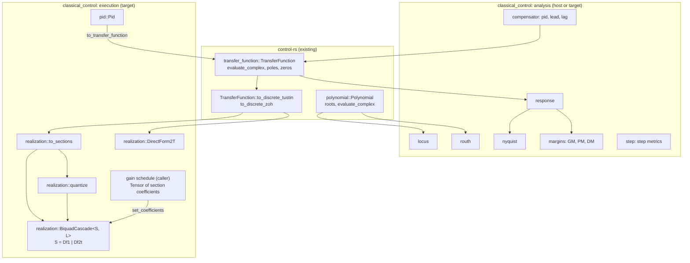
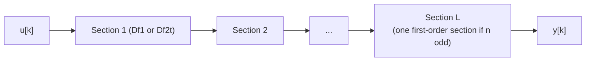

# Classical Control Toolbox (classical-control)


---

### 1. Introduction

The `classical_control` module of `control-rs` provides single-input,
single-output analysis, compensator construction and firmware execution over
the existing `Polynomial` and `TransferFunction` types. Analysis covers root
locus, the Routh-Hurwitz test, Bode, Nyquist and Nichols response data,
stability and delay margins, and step-response metrics. Execution covers
Direct Form I and Transposed Direct Form II realizations in floating or
fixed point, second-order-section cascades with coefficient update for gain
schedules, and a discrete PID controller with anti-windup, so a compensator
designed on the host runs unchanged on the target and is tested there
through ETS. Every routine writes into caller-owned, statically sized buffers;
no routine plots.
The module replaces the stub `src/classical_tools`.

Primary usage scenarios:

- **Stability screening**: A user checks a characteristic polynomial for
  right-half-plane roots without solving for them. Failure is a wrong count,
  or a silent result on a degenerate Routh array.
- **Loop shaping**: A user sweeps an open-loop transfer function over
  frequency and reads gain, phase and delay margins and crossover
  frequencies. Failure is a margin outside the stated refinement bound, or a
  reported crossover that does not exist.
- **Gain selection**: A user computes closed-loop pole loci over a gain set
  to choose a proportional gain and checks the closed-loop step response.
  Failure is a locus point that is not a root of the closed-loop
  characteristic polynomial, or a metric that disagrees with its definition.
- **Compensator construction**: A user builds a PID, lead or lag
  compensator as a `TransferFunction` and composes it with the plant.
  Failure is a coefficient that differs from the named form.
- **Firmware deployment**: A user discretizes a compensator, factors it into
  second-order sections or runs a PID with output limits, and executes it
  once per sample on the target. Failure is an output sequence that departs
  from the reference realization, unbounded integrator growth under
  saturation, an output jump on a gain change, or a per-sample cost that
  varies with data.
- **Fixed-point deployment**: A user quantizes a floating-point section
  design to `Fixed<Repr, SHIFT>` and runs it on an FPU-less core, or swaps
  section coefficients from a gain schedule between samples. Failure is a
  coefficient silently clipped at quantization, a panic or wrap on
  overflow, or an output outside the stated deviation from the
  floating-point realization.

---

### 2. Requirements

#### 2.1 Functional Requirements

- **FR-1 — Root locus**: For an open-loop `TransferFunction`
  $L (s) = N (s)/D (s)$ and a caller-supplied gain set $\lbrace k_i \rbrace$,
  returns for
  each $k_i$ the roots of $D (s) + k_i N (s)$.
- **FR-2 — Routh-Hurwitz count**: For a real characteristic polynomial,
  returns the number of roots in the open right half plane and whether roots
  lie on the imaginary axis, without computing roots, including the
  zero-first-column and zero-row cases.
- **FR-3 — Frequency response**: For a continuous or discrete
  `TransferFunction` and a caller-supplied frequency set, returns
  $G (j\omega)$ or $G (e^{j\omega T_s})$ as complex values and as magnitude in
  dB with unwrapped phase in degrees, which serve Bode, Nyquist and Nichols
  data.
- **FR-4 — Nyquist encirclement count**: For a continuous open-loop
  `TransferFunction`, returns the net number of encirclements of $-1$ by the
  Nyquist contour, indenting around open-loop poles on the imaginary axis.
- **FR-5 — Stability margins**: From an open-loop `TransferFunction` and a
  frequency set, returns gain margin, phase margin, their crossover
  frequencies and the stability margin $\min_\omega |1 + L (j\omega)|$, and
  reports a margin as absent when its crossover does not occur in the set.
- **FR-6 — PID compensator**: Constructs a PID `TransferFunction` in
  standard, series or parallel form, with an optional first-order
  derivative filter.
- **FR-7 — Lead and lag compensators**: Constructs lead and lag
  `TransferFunction` values from their corner frequencies and gain.
- **FR-8 — Direct-form realization**: For a discrete `TransferFunction`
  normalized to $a_0 = 1$, executes its difference equation one sample per
  call in Transposed Direct Form II with one state per denominator order,
  for any `T: Scalar`, and resets the state to zero on request.
- **FR-9 — Second-order-section cascade**: Executes a series of
  second-order sections of one caller-selected structure, Direct Form I (FR-17)
  or Transposed Direct Form II, one sample per call, for any
  `T: Scalar`, and resets every section state on request.
- **FR-10 — Section factorization**: Converts a discrete `TransferFunction`
  into second-order sections by pairing poles with their nearest zeros,
  starting with the poles closest to the unit circle, with at most one
  first-order section for odd order, such that the product of the sections
  equals the source transfer function.
- **FR-11 — Discrete PID execution**: Per sample, returns
  $u = \operatorname{sat} (K_p e + I + D)$ between output limits
  $u_{min} \le u_{max}$, with the derivative acting on the measurement
  through a first-order filter discretized by backward difference and the
  integral discretized by forward Euler.
- **FR-12 — Integrator anti-windup**: Under output saturation, updates the
  integrator by a caller-selected mode: conditional integration (clamping)
  or back-calculation with tracking time constant $T_t$.
- **FR-13 — Bumpless gain change**: Changing a PID gain between samples
  corrects the integrator so the unsaturated output recomputed from the last
  sample's error and derivative state is unchanged.
- **FR-14 — PID analysis model**: Returns the continuous-time transfer
  function of the unsaturated controller, coefficient-identical to the
  FR-6 parallel form with derivative filter.
- **FR-15 — Step-response metrics**: From sampled response data
  $(t_k, y_k)$, returns rise time from 10% to 90%, settling time for a
  caller threshold (default 2%), percent overshoot, peak and peak time,
  taking $y_{init} = 0$ and $y_{final}$ as the last sample unless supplied.
- **FR-16 — Delay margin**: Returns the delay margin at each gain crossover
  found under FR-5, in time units for continuous systems and in samples for
  discrete systems.
- **FR-17 — Direct Form I section**: Executes a second-order section in
  Direct Form I with four states (two past inputs, two past outputs), one
  sample per call, and resets the state to zero on request.
- **FR-18 — Coefficient update**: Replaces the coefficients of a section,
  cascade or direct form between samples without clearing its state.
- **FR-19 — Coefficient quantization**: Converts floating-point section
  coefficients to `Fixed<Repr, SHIFT>` with round-to-nearest, and returns
  an error naming the section when a coefficient lies outside the
  representable range instead of saturating it.
- **FR-20 — Section stability test**: Reports whether a first- or
  second-order section, or every section in a caller-supplied set, has its
  poles strictly inside the unit circle, from its denominator coefficients
  without root finding.

#### 2.2 Non-Functional Requirements

- **NFR-1 — Numeric output only**: No routine depends on a plotting or GUI
  library; outputs are numeric buffers.
- **NFR-2 — Caller-owned buffers**: Sweep and locus outputs are written into
  caller-provided, statically sized buffers; no routine allocates.
- **NFR-3 — Fixed operation count**: Routh array construction,
  frequency-response evaluation and margin refinement perform a fixed number
  of operations for a given polynomial order, frequency count and refinement
  depth.
- **NFR-4 — Constant per-sample cost**: Each update of FR-8, FR-9, FR-11
  and FR-17, and each FR-18 coefficient update, executes a fixed operation
  count set by order or section count, with no allocation and no
  data-dependent loop bound.

#### 2.3 Constraints

- **C-1 — Existing model types**: Builds on `Polynomial` and
  `TransferFunction` and introduces no parallel representation.
- **C-2 — Capacity bounds**: Conforms to `polynomial-design.md` C-1 and
  `transfer-function-design.md` C-3.
- **C-3 — Root-crate module**: Ships as `src/classical_control` of
  `control-rs` (the stub `src/classical_tools` renamed) and adds no
  dependency.
- **C-4 — Error convention**: Conforms to `error-design.md` NFR-1.
- **C-5 — Excluded scope**: Multivariable systems and interactive tuning
  are out of scope; the PID (FR-11 to FR-14) requires `T: Float`.
- **C-6 — On-target test enrollment**: The test modules for FR-8 to FR-13
  and FR-17 to FR-20 declare ETS suites per `macros-design.md` FR-1.
- **C-7 — Discretization ownership**: Continuous-to-discrete conversion
  conforms to `transfer-function-design.md` FR-4; this module adds none.
- **C-8 — Multiply accumulate**: Realizations bound
  `T: Scalar + SaturatingNeg + MulAcc`, accumulate through `MulAcc`, and
  conform to `num-traits-design.md` FR-7 and `fixed-num-design.md` FR-8.
- **C-9 — Fixed-point scale**: Fixed-point realizations use scales for which
  `Fixed<Repr, SHIFT>: Scalar`, conforming to `fixed-num-design.md` FR-7.

---

### 3. Technical Overview

`src/classical_control` is an unconditional, `#![no_std]` module of the root
crate beside `modern_control`, `robust_control` and `nonlinear_control`. It
splits into two layers. The analysis layer drives `Polynomial::roots`,
`TransferFunction::evaluate_complex`, `TransferFunction::eval_frequency`
and `TransferFunction::poles`, and adds sweep drivers, crossing detection,
metrics and constructors. The execution layer turns a discrete
`TransferFunction`, obtained through `TransferFunction::to_discrete_tustin`
or `to_discrete_zoh` (C-7), into per-sample state machines that run on the
target.



---

### 4. Architecture

#### 4.1 Module Layout

```text
src/classical_control/
├── mod.rs          # ClassicalError; re-exports
├── locus.rs        # root_locus
├── routh.rs        # routh_count
├── response.rs     # frequency_response, ResponsePoint
├── nyquist.rs      # nyquist_encirclements
├── margins.rs      # stability_margins, Margins, delay margin
├── step.rs         # step_info, StepInfo
├── compensator.rs  # pid, lead, lag
├── realization.rs  # DirectForm2T, Df1, Df2t, BiquadCascade, to_sections, quantize
└── pid.rs          # Pid, AntiWindup
```

Each submodule holds its own inline `tests` module, so test paths are
`classical_control::<submodule>::tests::<name>`; `ets_suite` expands only
an inline module (C-6).

`src/lib.rs` declares `pub mod classical_control;` in place of
`pub mod classical_tools;`. Buffer lengths are const generics: a locus over
$K$ gains of an order-$n$ system writes `[[Complex<T>; n]; K]`, a sweep
over $M$ frequencies writes `[ResponsePoint<T>; M]`, a direct form holds
`[T; ORDER]` and a cascade holds `[S; L]` for a section type `S`.

#### 4.2 Root Locus

For each gain $k_i$, form $D (s) + k_i N (s)$ with `Polynomial` arithmetic and
solve it with `Polynomial::roots`, as python-control computes the locus from
the roots of $1 + kG (s)$ over a gain range [1]. `Polynomial::roots` uses
the companion-matrix eigenvalue route that NumPy also uses [2]. The gain
set is the caller's; python-control instead chooses gains to capture the
main features of the locus [1], and continuation methods trace branches
adaptively [3]. Both are rejected (§5). Root order across consecutive
gains is not matched; each row is an unordered root set.

#### 4.3 Routh-Hurwitz Count

Build the Routh array from the coefficient slice by the tabular recurrence
and count sign changes in the first column. Two special cases follow the
standard handling [4]: a zero first-column entry with a nonzero remainder
is replaced by $\varepsilon > 0$ and the count taken as
$\varepsilon \to 0^+$; a row of zeros is replaced by the coefficients of the
derivative of the auxiliary polynomial, and the result sets the
imaginary-axis flag. The $\varepsilon$ limit is evaluated symbolically on
signs, not with a numeric $\varepsilon$, so the count is exact for exact
coefficients. A coefficient whose magnitude falls below a caller tolerance
is treated as zero; the tolerance is part of the call.

#### 4.4 Frequency Response and Nichols Data

`frequency_response` evaluates $G (j\omega)$ for continuous systems and
$G (e^{j\omega T_s})$ for discrete systems, the conventions python-control
documents [5]. Each `ResponsePoint` holds $\omega$, the complex value,
the magnitude in dB and the phase in degrees. Phase is unwrapped along the
sweep so consecutive samples differ by less than $180^\circ$. Bode data is
(magnitude, phase) against $\omega$; Nyquist data is the complex value
[6]; Nichols data is magnitude in dB against phase [7]. No routine
samples frequencies itself.

#### 4.5 Nyquist Encirclements

`nyquist_encirclements` returns the net number of encirclements of $-1$
[6]. It evaluates $L (s)$ on the Nyquist contour: the imaginary axis from
$-j\omega_{max}$ to $j\omega_{max}$, a semicircle at infinity resolved by
properness, and small semicircular indentations around open-loop poles on
or near the imaginary axis, as python-control does [6]. The count is the
total winding angle of $1 + L$ divided by $2\pi$, accumulated over a
caller-sized contour buffer. Open-loop poles come from
`TransferFunction::poles`. The routine reports the count and the number of
open-loop right-half-plane poles; it does not infer closed-loop stability
on the caller's behalf. A discrete system returns
`ClassicalError::NotContinuous`.

#### 4.6 Stability and Delay Margins

`stability_margins` brackets each crossing by a sign change between
consecutive sweep samples, as the interpolating method of python-control
does from frequency data [8]. The gain crossover is a sign change of
$|L| - 1$. The phase crossover is a sign change of $\operatorname{Im} L$
while $\operatorname{Re} L < 0$, which avoids the $\pm 180^\circ$ branch
cut of a wrapped phase. Because the `TransferFunction` is available, each
bracket is then refined by a const number $B$ of bisection steps on $L$
itself, so the crossover error is the bracket width divided by $2^B$ and
does not depend on the sweep density alone (NFR-3). Gain margin is $1/|L|$
at the phase crossover, phase margin is $180^\circ + \angle L$ at the gain
crossover and the stability margin is the minimum of $|1 + L|$ over the
samples [8]. All crossings in the set are returned, since only margins in
the swept region can be found [8]; a margin without a crossing is `None`.

The delay margin is the delay that destabilizes the loop at a gain
crossover [9]. A pure delay $\tau$ adds phase $-\omega\tau$ at unit
gain, so at gain crossover $\omega_{gc}$ with phase margin $\phi_m$ in
radians, $\tau = \phi_m / \omega_{gc}$. For discrete systems the result is
divided by $T_s$ and reported in samples, the unit MATLAB uses [9].

#### 4.7 Step-Response Metrics

`step_info` evaluates the definitions of MATLAB `stepinfo` on caller
samples [10]. With $y_{norm} = (y - y_{init})/ (y_{final} - y_{init})$:
rise time is the time from 10% to 90% of the way to $y_{final}$; settling
time is the first $T$ after which
$|y - y_{final}| \le \theta |y_{final} - y_{init}|$ holds for every later
sample, with $\theta = 0.02$ by default; overshoot is
$\max (0, 100 \max_k (y_{norm,k} - 1))$; peak is $\max_k |y_k - y_{init}|$
at peak time [10]. Defaults are $y_{init} = 0$ and $y_{final}$ the last
sample [10]. Threshold crossings for rise time are interpolated
linearly between bracketing samples. The routine takes response data only,
so it applies equally to simulated and on-target logs.

#### 4.8 Compensators

`pid` builds the three forms as `TransferFunction` values [11]:

| Form     | Transfer function                            |
|:---------|:---------------------------------------------|
| Standard | $K_p (1 + \frac{1}{T_i s} + T_d s)$          |
| Series   | $K_c (1 + \frac{1}{\tau_i s})(\tau_d s + 1)$ |
| Parallel | $K_p + \frac{K_i}{s} + K_d s$                |

An ideal derivative has high gain at high frequency [12, Sec. 11.5], so
`pid` accepts an optional filter time constant $T_f$ that replaces $s$ in
the derivative term by $s/ (1 + T_f s)$, the first-order filter with time
constant $T_d/N$ that Åström describes [13, Sec. 6.3]. Without $T_f$ the
result is improper and is returned only where `TransferFunction` admits it
(`transfer-function-design.md` C-1); otherwise `ClassicalError::Improper`.
`lead` returns $K (1 + s/b)/ (1 + s/ (bN))$ and `lag` returns
$M (1 + s/a)/ (1 + sM/a)$ [11]. Constructed compensators are ordinary
`TransferFunction` data and compose through `series`, `parallel` and
`feedback`. A discrete compensator is the Tustin image of the continuous
one with prewarping at the design crossover, which matches the continuous
response at that frequency [14], through
`TransferFunction::to_discrete_tustin` (C-7).

#### 4.9 Firmware Realizations

All realizations use the denominator convention
$H (z) = \frac{b_0 + b_1 z^{-1} + \dots + b_n z^{-n}}{1 + a_1 z^{-1} + \dots + a_n z^{-n}}$
and the Transposed Direct Form II recurrence that SciPy `lfilter`
implements [15]:

```math
y[k] = b_0 u[k] + d_1[k-1], \qquad
d_i[k] = b_i u[k] - a_i y[k] + d_{i+1}[k-1], \quad d_{n+1} \equiv 0.
```

Direct Form I (FR-17) computes the same section from past inputs and
outputs:

```math
y[k] = b_0 u[k] + b_1 u[k-1] + b_2 u[k-2] - a_1 y[k-1] - a_2 y[k-2].
```

The two structures trade state for robustness. TDF-II places the zeros
ahead of the poles in series order, so the large pole gain at some
frequencies acts on a signal the zeros have already attenuated [16],
and it needs half the state, two rather than four per biquad [17], [18]. DF1 is
numerically more robust for fixed-point data, while TDF-II
needs a wide dynamic range in its states [17]; in fixed point DF-II can
overflow internally, where DF-I overflows only if the output does [19].
DF1 also introduces minimal artifacts when its coefficients
change online, while DF2T suits
static filters [20]. The caller picks the structure per cascade: `Df2t`
for floating-point static filters, `Df1` for fixed point and for
scheduled sections.

- **`DirectForm2T<T, ORDER>`** holds $b_0$, `[T; ORDER]` numerator and
  denominator tails and `[T; ORDER]` state, built from a discrete
  `TransferFunction` divided through by $a_0$ (FR-8).
- **`Df2t<T>`** holds $(b_0, b_1, b_2, a_1, a_2)$ and $(d_1, d_2)$, the
  layout CMSIS-DSP uses per DF2T stage [17]. **`Df1<T>`** holds the same
  coefficients and $(u_{k-1}, u_{k-2}, y_{k-1}, y_{k-2})$, the CMSIS DF1
  state [18]. Both implement a sealed `Section<T>` trait with
  `update(u) -> y`, `reset()` and `set_coefficients(c)`, the whole
  run-time surface (FR-18). CMSIS stores $a_1, a_2$ negated relative to
  this convention [17]; coefficients exported for CMSIS are negated at
  export, never in the recurrence.
- **`BiquadCascade<S, L>`** runs `[S; L]` in series (FR-9), the structure
  SciPy `sosfilt` uses to minimize numerical precision errors for
  high-order filters [21]. SciPy recommends sections over a single
  high-order direct form for most filtering tasks [15].

**Accumulation.** Each output is one `MulAcc` chain that narrows once (C-8).
Sections store $-a_1, -a_2$, the CMSIS-DSP convention [17], so
every chain is multiply-accumulates only; `set_coefficients` takes the
§4.9 convention and negates once. `Df1` computes $y$ as one `from_acc`
of five `mac` steps over its four states and the input, the five-product,
single-narrowing scheme of the CMSIS DF1 kernels
[18]. `Df2t` and `DirectForm2T` keep their states in `T::Acc`, so the
wide dynamic range TDF-II states need [17] is the accumulator's, and
only the output narrows:

```text
y  = from_acc(mac(d1, b0, u))
d1 = mac(mac(d2, b1, u), -a1, y)
d2 = mac(mac(0,  b2, u), -a2, y)
```

For `f32` and `f64` the accumulator is the type itself and `mac` is
the unfused multiply and add (`num-traits-design.md` FR-7); for `Fixed` it
is the wide integer of `fixed-num-design.md` FR-8. One generic `update`
serves every type, rounds once per output for `Fixed`, and never panics or
wraps (`num-traits-design.md` FR-6). Fused or vendor arithmetic enters
through an accelerated type that implements `MulAcc` outside the crate,
such as the `f32` newtype and CMSIS-style `q31` type planned beside
`CmsisDspBlas` in `examples/subprograms/thumbv7em/`
(`num-traits-design.md` §4.5).

`to_sections` (FR-10) builds the cascade on the host or the target at
initialization. It takes poles and zeros from `TransferFunction::poles`
and `zeros`, pairs each pole with its nearest zero starting with the poles
closest to the unit circle, groups conjugate pairs into real second-order
sections and, for odd order, keeps one first-order section with
$b_2 = a_2 = 0$, following SciPy `zpk2sos` [22]. The pairing minimizes
the peak gain of each section [22]. The overall gain is placed in the
first section; section scaling beyond that is an assumption to review (§8).

**Fixed point.** `quantize` (FR-19) converts `f64` section coefficients,
the input of `Df1` and `Df2t`, to `Fixed<Repr, SHIFT>` with round-to-nearest and refuses, with
`ClassicalError::CoefficientRange { section }`, any coefficient outside the
type's range. Stable second-order sections have $|a_1| < 2$, so the scale
must leave integer bits; C-9 already requires
$\text{SHIFT} \le \text{BITS} - 2$ for `Scalar`. This plays the role of
the CMSIS `postShift`, which lets coefficients exceed $[-1, 1)$ [18],
but is fixed per type rather than per call. Overflow saturates in the
accumulator and at the
output, as the CMSIS Q15 DF1 output saturates [18].

**Section stability (FR-20).** A section with denominator
$1 + a_1 z^{-1} + a_2 z^{-2}$ is stable if and only if $|a_2| < 1$ and
$|a_1| < 1 + a_2$, and a first-order section if and only if $|a_1| < 1$
[23]. `is_stable` evaluates these comparisons; `all_stable` folds them
over a slice of sections. For `Fixed` the comparisons are exact.

**Gain schedules.** A schedule is a caller-side wrapper: a `Tensor` of
section coefficients indexed by the scheduling variable, read each sample (or on
change) and written with `set_coefficients` (FR-18). The realization
keeps its state across the update, and DF1 sections keep it in signal
units, which is why `Df1` is the scheduled structure [20]. The stability
region above is an intersection of half-planes in $(a_1, a_2)$ and so is
convex. Multilinear interpolation over a `Tensor` grid (`tensor-design.md` FR-2)
returns a convex combination of grid-point
coefficients. A schedule that interpolates section coefficients, and
whose grid sections all pass `all_stable`, therefore yields a stable
section at every frozen value of the scheduling variable. This holds per
section, so it requires interpolating second-order sections, not
`DirectForm2T` coefficients, and holds for any pairing that is consistent
across the grid. Frozen-value stability does not bound the response when
the scheduling variable moves quickly (§6.3, §8). The wrapper itself is not
part of this module.



#### 4.10 Discrete PID

`Pid<T>` is constructed from $K_p$, $K_i$, $K_d$, $T_f$, a fixed sample
period $h$, limits $u_{min} \le u_{max}$ and an `AntiWindup` mode, and
computes its coefficients once so each `step` runs a fixed sequence (NFR-4).
The derivative acts on the measurement, not the error, with the filter
$T_f \dot D + D = -K_d \dot y$ discretized by backward difference as in
Wittenmark et al. [24]. Backward difference keeps the filter coefficient
$a_d = T_f/ (T_f + h)$ in $[0, 1]$ for all parameters [13, Sec. 6.7]. The
filtered measurement derivative is stored without $K_d$ so a gain change
does not rescale history:

```math
\delta_k = a_d \delta_{k-1} - \frac{y_k - y_{k-1}}{T_f + h}, \qquad
D_k = K_d \delta_k.
```

The integral uses forward Euler, suited to sample times short relative to
the controller bandwidth [25]. One `step(r, y) -> u`:

1. $e = r - y$; update $\delta$ ($y_{k-1} = y_k$ on the first call).
2. $v = K_p e + I + K_d \delta$; $u = \min (\max (v, u_{min}), u_{max})$.
3. Update $I$ by the anti-windup mode, then store $y_{k-1}$ and return $u$.

Output is computed before the state update so the delay from measurement
to actuation is the computation of steps 1 and 2; this ordering is an
assumption to check against the source (§8).

Saturation breaks the loop and lets the integrator run away [12, Sec.].
`AntiWindup` has two modes:

| Mode                     | Integrator update                                                                           | Basis                                                                                                                                                                                                                                                 |
|:-------------------------|:--------------------------------------------------------------------------------------------|:------------------------------------------------------------------------------------------------------------------------------------------------------------------------------------------------------------------------------------------------------|
| `Clamping`               | $I \leftarrow I + K_i h e$ unless $u \ne v$ and $e$ has the sign of $v - u$, then $I$ holds | Conditional integration: integration stops when the output exceeds its limits and the integrator input has the sign of the saturation input [25]; the test on $v - u$ is an assumption that keeps the rule valid for limits that do not straddle zero |
| `BackCalculation { tt }` | $I \leftarrow I + h (K_i e + (u - v)/T_t)$                                                  | Feeds back the difference between saturated and unsaturated output so the integrator resets to the limit [24], [25]                                                                                                                                   |

$T_t$ is the caller's; Åström gives $T_d < T_t < T_i$ and
$T_t = \sqrt{T_i T_d}$ as a rule of thumb [13, Sec. 6.5], with
$T_i = K_p/K_i$ and $T_d = K_d/K_p$ in parallel gains. The rustdoc states
the rule; the constructor does not default it.

`set_gains` implements bumpless transfer by updating the integrator state,
as DiscretePIDs.jl does [26]:
$I \leftarrow I + (K_p - K_p') e_{k} + (K_d - K_d') \delta_k$, which keeps
$v$ unchanged for the last sample (FR-13). `to_transfer_function` returns
`compensator::pid` in parallel form with filter $T_f$ (FR-14). The design
matches the deployable PID controllers in other ecosystems, which are
allocation-free [26], parameterize anti-windup by $T_t$ [26] and
advertise no derivative kick [27].

#### 4.11 Error Handling

```rust
#[derive(Debug, Clone, Copy, PartialEq, Eq)]
pub enum ClassicalError {
    /// Root finding failed for a locus gain or a factorization (FR-1, FR-10).
    Root(RootError),
    /// The Routh leading coefficient is zero (FR-2).
    ZeroLeadingCoefficient,
    /// The Nyquist contour passes through -1 (FR-4).
    ContourThroughCriticalPoint,
    /// A parameter is non-positive where positivity is required, or
    /// u_min > u_max (FR-6, FR-7, FR-11, FR-12).
    InvalidParameter,
    /// The requested PID form is improper and has no filter (FR-6).
    Improper,
    /// A realization was requested from a continuous system (FR-8, FR-10).
    NotDiscrete,
    /// A Nyquist count was requested for a discrete system (FR-4).
    NotContinuous,
    /// The section count does not match the factored order (FR-10).
    SectionCount,
    /// A coefficient of this section is outside the fixed-point range
    /// (FR-19).
    CoefficientRange { section: usize },
}
```

The enum has a hand-written `Display`, `impl core::error::Error` and
`From<RootError>` (C-4). Errors arise at construction and quantization
only: `update`, `step`, `reset` and `set_coefficients` are infallible, so the
per-sample path has no error
branch (NFR-4). Buffer-length mismatch is excluded by const generics
(`error-design.md` FR-2).

---

### 5. Alternatives

| Alternative                                           | Rejected Because                                                                                                                                                                     | Reference            |
|:------------------------------------------------------|:-------------------------------------------------------------------------------------------------------------------------------------------------------------------------------------|:---------------------|
| Automatic gain selection for the root locus           | Needs heuristics over locus features and a variable-length output, which conflicts with NFR-2. Callers supply the gain set.                                                          | [1]                  |
| Continuation tracing of locus branches                | Integrates a differential equation per branch; step count is data-dependent, which conflicts with NFR-3.                                                                             | [3]                  |
| Polynomial (exact) margin computation                 | Needs polynomial root finding per call, and python-control falls back from it when it is inaccurate in discrete time. Bisection on $L$ reaches a stated bound at fixed cost (NFR-3). | [8]                  |
| Linear interpolation of crossings only                | Accuracy is tied to sweep density; bisection on $L$ costs $B$ extra evaluations per crossing and removes that dependence.                                                            | [8]                  |
| Distinct compensator type                             | Compensators are ordinary `TransferFunction` values in the reference toolbox; a separate type duplicates composition (C-1).                                                          | [11]                 |
| One section structure for all types                   | DF2T halves the state but needs wide state range in fixed point, and DF1 is the robust fixed-point and retuning structure; offering both behind `Section<T>` costs one extra type.   | [17], [19], [20]     |
| Saturate out-of-range coefficients at quantization    | Silently changes the pole and zero locations; an error makes the caller pick a wider integer part.                                                                                   | [18]                 |
| Per-term multiply-add (`Scalar::mul_add`)             | Rounds each term, up to five times per `Fixed` section output, where a wide accumulator narrows once as the CMSIS DF1 kernels do.                                                    | [18]                 |
| Fused `libm` multiply-add as the float default        | Software fusion is slower than an unfused multiply and add on most targets; fusion is faster only with an `fma` instruction, so it belongs to an accelerated type (C-8).             | [28]                 |
| Interpolate `DirectForm2T` coefficients in a schedule | The convexity argument for frozen-value stability holds for the section stability triangle only.                                                                                     | [23]                 |
| Single high-order direct form as the only realization | Second-order sections have fewer numerical problems at high order; `DirectForm2T` is kept for low orders and caller choice.                                                          | [15], [21]           |
| Link CMSIS-DSP                                        | Adds a C library dependency (C-3) and ties the realization to Arm targets; the native sections cover its DF1 and DF2T structures generically.                                        | [17]                 |
| Run the PID through `DirectForm2T`                    | A linear realization cannot saturate or stop integration; windup is an execution concern under actuator limits.                                                                      | [12, Sec. 11.4]      |
| Integrator leak factor $\gamma$ while saturated       | No cited basis; clamping and back-calculation are the documented modes, and $\gamma = 1$ is clamping without its sign condition.                                                     | [25]                 |
| Velocity (incremental) PID                            | Bumpless by construction, but the actuator or a downstream accumulator must integrate the output; the positional form with integrator correction gives the same bumpless property.   | [13, Sec. 6.7], [26] |
| Discrete compensator constructors                     | Duplicates `transfer-function-design.md` FR-4 (C-7); Tustin with prewarping already matches the continuous response at the design frequency.                                         | [14]                 |

---

### 6. Verification & Validation

#### 6.1 Verification

| Condition | Requirement | Method       | Target                                                                             | Criterion                                                                                                                                                                                                    |
|:----------|:------------|:-------------|:-----------------------------------------------------------------------------------|:-------------------------------------------------------------------------------------------------------------------------------------------------------------------------------------------------------------|
| VC-1.1    | FR-1        | `libtest`    | `control_rs::classical_control::locus::tests::locus_roots_satisfy_characteristic`  | Every returned root satisfies §6.2 for $D + k_i N$ over a 3-pole, 1-zero plant and 20 gains; FR-1 holds iff all conditions hold                                                                              |
| VC-1.2    | FR-1        | `libtest`    | `control_rs::classical_control::locus::tests::locus_zero_gain`                     | At $k = 0$ the roots equal `TransferFunction::poles` within §6.2                                                                                                                                             |
| VC-2.1    | FR-2        | `libtest`    | `control_rs::classical_control::routh::tests::routh_matches_known_roots`           | For polynomials built by `Polynomial::from_roots` with 0 to 4 right-half-plane roots, the count equals the constructed count exactly; FR-2 holds iff all conditions hold                                     |
| VC-2.2    | FR-2        | `libtest`    | `control_rs::classical_control::routh::tests::routh_zero_first_column`             | $s^4 + s^3 + 2s^2 + 2s + 3$ returns 2 right-half-plane roots                                                                                                                                                 |
| VC-2.3    | FR-2        | `libtest`    | `control_rs::classical_control::routh::tests::routh_zero_row`                      | $s^3 + s^2 + s + 1$ returns 0 right-half-plane roots and the imaginary-axis flag                                                                                                                             |
| VC-3.1    | FR-3        | `libtest`    | `control_rs::classical_control::response::tests::first_second_order_closed_form`   | Magnitude and phase of first-order and second-order systems meet §6.2; FR-3 holds iff all conditions hold                                                                                                    |
| VC-3.2    | FR-3        | `libtest`    | `control_rs::classical_control::response::tests::discrete_unit_circle`             | A discrete system is evaluated at $e^{j\omega T_s}$ and matches the closed form within §6.2                                                                                                                  |
| VC-3.3    | FR-3        | `libtest`    | `control_rs::classical_control::response::tests::phase_unwrapped`                  | Consecutive phase samples of a fourth-order lag differ by less than $180^\circ$                                                                                                                              |
| VC-4.1    | FR-4        | `libtest`    | `control_rs::classical_control::nyquist::tests::encirclements_known_cases`         | Stable, open-loop unstable and integrating plants return the encirclement counts implied by their known closed-loop pole locations; FR-4 holds iff all conditions hold                                       |
| VC-4.2    | FR-4        | `libtest`    | `control_rs::classical_control::nyquist::tests::contour_through_critical_point`    | A loop with $L(j\omega_0) = -1$ returns `ContourThroughCriticalPoint`                                                                                                                                        |
| VC-5.1    | FR-5        | `libtest`    | `control_rs::classical_control::margins::tests::third_order_margins`               | Gain margin, phase margin and both crossovers of $4/(s+1)^3$ meet §6.2; FR-5 holds iff all conditions hold                                                                                                   |
| VC-5.2    | FR-5        | `libtest`    | `control_rs::classical_control::margins::tests::absent_crossover`                  | A first-order loop returns `None` for gain margin                                                                                                                                                            |
| VC-5.3    | FR-5        | `libtest`    | `control_rs::classical_control::margins::tests::margins_cross_check`               | Margins on the cross-check cases meet their tolerance entries in §6.2                                                                                                                                        |
| VC-6.1    | FR-6        | `libtest`    | `control_rs::classical_control::compensator::tests::pid_forms`                     | The three forms produce coefficient vectors equal to their closed-form expansions exactly; FR-6 holds iff all conditions hold                                                                                |
| VC-6.2    | FR-6        | `libtest`    | `control_rs::classical_control::compensator::tests::pid_filtered_proper`           | A filtered PID is proper and an unfiltered derivative returns `Improper` where the capacity cannot hold it                                                                                                   |
| VC-7.1    | FR-7        | `libtest`    | `control_rs::classical_control::compensator::tests::lead_lag`                      | Lead and lag coefficients equal their closed forms exactly and non-positive parameters return `InvalidParameter`; FR-7 holds iff all conditions hold                                                         |
| VC-8.1    | FR-8        | `libtest`    | `control_rs::classical_control::realization::tests::df2t_matches_reference`        | `DirectForm2T` output sequences for orders 1 to 4 meet the §6.2 cross-check entries; FR-8 holds iff all conditions hold                                                                                      |
| VC-8.2    | FR-8        | `libtest`    | `control_rs::classical_control::realization::tests::df2t_reset`                    | After `reset`, the output sequence equals that of a newly built realization exactly                                                                                                                          |
| VC-8.3    | FR-8        | `libtest`    | `control_rs::classical_control::realization::tests::df2t_from_continuous`          | Building from a continuous `TransferFunction` returns `NotDiscrete`                                                                                                                                          |
| VC-8.4    | FR-8        | `libtest`    | `control_rs::classical_control::realization::tests::df2t_fixed_total`              | `DirectForm2T<Fixed<i32, 29>, 2>` driven at full-scale input saturates without panic or wrap                                                                                                                 |
| VC-9.1    | FR-9        | `libtest`    | `control_rs::classical_control::realization::tests::cascade_matches_reference`     | `BiquadCascade` output sequences of `Df1` and `Df2t` sections meet the §6.2 cross-check entries; FR-9 holds iff all conditions hold                                                                          |
| VC-9.2    | FR-9        | `libtest`    | `control_rs::classical_control::realization::tests::cascade_reset`                 | After `reset`, every section state is zero                                                                                                                                                                   |
| VC-10.1   | FR-10       | `libtest`    | `control_rs::classical_control::realization::tests::sections_reproduce_source`     | The frequency response of the factored cascade equals that of the source within §6.2 for even and odd orders up to 8; FR-10 holds iff all conditions hold                                                    |
| VC-10.2   | FR-10       | `libtest`    | `control_rs::classical_control::realization::tests::sections_pairing_order`        | Each section's zeros are the remaining zeros nearest its poles, with poles taken in order of distance to the unit circle, and an odd order yields exactly one section with $b_2 = a_2 = 0$                   |
| VC-11.1   | FR-11       | `libtest`    | `control_rs::classical_control::pid::tests::unsaturated_matches_recurrence`        | Within limits, outputs equal the closed-form recurrence of §4.10 within §6.2; FR-11 holds iff all conditions hold                                                                                            |
| VC-11.2   | FR-11       | `libtest`    | `control_rs::classical_control::pid::tests::setpoint_step_no_derivative_kick`      | A setpoint step at constant measurement leaves $D$ unchanged exactly                                                                                                                                         |
| VC-11.3   | FR-11       | `libtest`    | `control_rs::classical_control::pid::tests::output_within_limits`                  | Every output lies in $[u_{min}, u_{max}]$ and `new` returns `InvalidParameter` for $u_{min} > u_{max}$, $h \le 0$ or $T_f < 0$                                                                               |
| VC-12.1   | FR-12       | `libtest`    | `control_rs::classical_control::pid::tests::clamping_holds_integrator`             | Under sustained saturation in `Clamping`, $I$ is constant exactly and resumes integrating when the error changes sign; FR-12 holds iff all conditions hold                                                   |
| VC-12.2   | FR-12       | `libtest`    | `control_rs::classical_control::pid::tests::back_calculation_fixed_point`          | Under sustained saturation in `BackCalculation`, $I$ converges to the closed-form fixed point within §6.2                                                                                                    |
| VC-13.1   | FR-13       | `libtest`    | `control_rs::classical_control::pid::tests::bumpless_gain_change`                  | After `set_gains`, the recomputed unsaturated output differs from the previous one by at most the §6.2 bound                                                                                                 |
| VC-14.1   | FR-14       | `libtest`    | `control_rs::classical_control::pid::tests::analysis_model_matches_compensator`    | `to_transfer_function` coefficients equal `compensator::pid` parallel form with filter exactly                                                                                                               |
| VC-15.1   | FR-15       | `libtest`    | `control_rs::classical_control::step::tests::second_order_closed_form`             | Rise time, settling time, overshoot, peak and peak time of a sampled underdamped second-order step meet §6.2; FR-15 holds iff all conditions hold                                                            |
| VC-15.2   | FR-15       | `libtest`    | `control_rs::classical_control::step::tests::defaults_and_threshold`               | Omitted $y_{final}$ uses the last sample and a 5% threshold yields the closed-form 5% settling time within one sample period                                                                                 |
| VC-16.1   | FR-16       | `libtest`    | `control_rs::classical_control::margins::tests::delay_margin_closed_form`          | The delay margin of $4/(s+1)^3$ and of its discretization meets §6.2, in seconds and in samples respectively; FR-16 holds iff all conditions hold                                                            |
| VC-17.1   | NFR-1       | `inspection` | —                                                                                  | The module imports no plotting or GUI crate                                                                                                                                                                  |
| VC-18.1   | NFR-2       | `inspection` | —                                                                                  | No routine allocates; outputs are const-sized buffers                                                                                                                                                        |
| VC-19.1   | NFR-3       | `analysis`   | —                                                                                  | Routh construction, response evaluation and margin refinement have loop bounds fixed by order, frequency count and $B$                                                                                       |
| VC-20.1   | NFR-4       | `analysis`   | —                                                                                  | `update`, `step`, `reset` and `set_coefficients` contain no allocation, no fallible operation and only loops bounded by `ORDER` or `L`                                                                       |
| VC-21.1   | C-1         | `review`     | —                                                                                  | The public API takes and returns `Polynomial`, `TransferFunction`, realizations and buffers only                                                                                                             |
| VC-22.1   | C-2         | `review`     | —                                                                                  | Every const parameter is bounded as the cited constraints require                                                                                                                                            |
| VC-23.1   | C-3         | `inspection` | —                                                                                  | The change adds no entry to `[dependencies]` in the root `Cargo.toml`                                                                                                                                        |
| VC-24.1   | C-4         | `inspection` | —                                                                                  | `ClassicalError` derives the `error-design.md` NFR-1 traits and has hand-written `Display`                                                                                                                   |
| VC-25.1   | C-5         | `review`     | —                                                                                  | The public API exposes no multivariable or interactive item, and the PID items bound `T: Float`                                                                                                              |
| VC-26.1   | C-6         | `inspection` | —                                                                                  | The `realization` and `pid` test modules carry `#[cfg_attr(not(test), control_rs_macros::ets_suite)]`                                                                                                        |
| VC-27.1   | C-7         | `review`     | —                                                                                  | The module defines no continuous-to-discrete transform                                                                                                                                                       |
| VC-28.1   | FR-17       | `libtest`    | `control_rs::classical_control::realization::tests::df1_matches_df2t`              | For `f64` sections, `Df1` and `Df2t` outputs agree within §6.2 on the cross-check cases; FR-17 holds iff all conditions hold                                                                                 |
| VC-28.2   | FR-17       | `libtest`    | `control_rs::classical_control::realization::tests::df1_fixed_matches_reference`   | `Df1<Fixed<i16, 13>>` and `Df1<Fixed<i32, 29>>` outputs meet the §6.2 fixed-point bound against the `f64` realization                                                                                        |
| VC-28.3   | FR-17       | `kani`       | `control_rs::classical_control::realization::proofs::prove_df1_fixed_update_total` | For all `Fixed<i16, 13>` coefficients, states and inputs, `Df1::update` returns without panic                                                                                                                |
| VC-28.4   | FR-17       | `libtest`    | `control_rs::classical_control::realization::tests::df1_fixed_single_rounding`     | Without saturation, each `Df1<Fixed<i16, 13>>` output equals the exact integer sum of its five products rounded once with ties to even                                                                       |
| VC-29.1   | FR-18       | `libtest`    | `control_rs::classical_control::realization::tests::set_coefficients_keeps_state`  | After `set_coefficients`, state equals its value before the call and the next output equals that of a section built with the new coefficients and the same state; FR-18 holds iff all conditions hold        |
| VC-30.1   | FR-19       | `libtest`    | `control_rs::classical_control::realization::tests::quantize_round_and_range`      | Each quantized coefficient is within $\Delta/2$ of its source and a coefficient outside the range returns `CoefficientRange` with its section index; FR-19 holds iff all conditions hold                     |
| VC-31.1   | C-8         | `inspection` | —                                                                                  | Every recurrence in `realization` is a `MulAcc` chain with one `from_acc` per output, and the section types bound `T: Scalar + SaturatingNeg + MulAcc`                                                       |
| VC-33.1   | FR-20       | `libtest`    | `control_rs::classical_control::realization::tests::stability_triangle`            | For sections built from pole pairs at radius $0.5$, $0.99$, $1.0$ and $1.01$ over a grid of angles, and for first-order sections, `is_stable` equals `max \|pole\| < 1`; FR-20 holds iff all conditions hold |
| VC-33.2   | FR-20       | `libtest`    | `control_rs::classical_control::realization::tests::interpolated_schedule_stable`  | Every multilinear interpolation of a `Tensor` grid of stable sections at 1,000 random query points passes `is_stable`                                                                                        |
| VC-32.1   | C-9         | `review`     | —                                                                                  | Fixed-point realizations are bounded `T: Scalar`, so only `fixed-num-design.md` FR-7 scales instantiate                                                                                                      |

Coverage: 90% line coverage of `src/classical_control`, measured with
`cargo coverage`. Excluded: none.

#### 6.2 Acceptance

| Claim                                | Oracle                                                                                                | Measure                                                                                   | Bound                                                                                     |
|:-------------------------------------|:------------------------------------------------------------------------------------------------------|:------------------------------------------------------------------------------------------|:------------------------------------------------------------------------------------------|
| Routh count (FR-2)                   | Closed-form: polynomials constructed from known roots                                                 | Exact equality                                                                            | Equal                                                                                     |
| Locus roots (FR-1)                   | Invariant: residual of $D + k N$ at each root                                                         | $\lvert D(p) + kN(p) \rvert / \sum_j \lvert c_j \rvert \lvert p \rvert^j$                 | $\le 10 n u$                                                                              |
| Frequency response (FR-3)            | Closed-form first-order and second-order responses                                                    | Relative error of magnitude; absolute error of phase                                      | $\le 10 u$; $\le 10^{-9}$ deg                                                             |
| Margins (FR-5)                       | Closed form for $4/(s+1)^3$: $\omega_{pc} = \sqrt{3}$, $K_g = 2$, $\omega_{gc} = \sqrt{16^{1/3} - 1}$ | Relative error of each crossover and margin                                               | $\le \Delta_\omega / (2^B \omega) + 10 u$, with $\Delta_\omega$ the bracketing grid step; phase margin adds $10 u \cdot 180^\circ / \phi_m$ |
| Margins (FR-5)                       | Independent reference implementation (`cross-check`)                                                  | Relative error of each margin and crossover                                               | Tolerance entries `classical-control/<case>/<margin>`                                     |
| Delay margin (FR-16)                 | Closed form $\phi_m/\omega_{gc}$ from the FR-5 closed form                                            | Relative error                                                                            | Sum of the FR-5 relative bounds on $\phi_m$ and $\omega_{gc}$                             |
| DF2T and cascade output (FR-8, FR-9) | Independent reference implementation (`cross-check`): SciPy `lfilter` and `sosfilt`                   | Maximum absolute output error over the sequence, relative to $\max_k \lvert y_k \rvert$   | Tolerance entries `classical-control/<case>/output`                                       |
| Fixed-point DF1 rounding (FR-17)     | Closed form: exact integer accumulation of the five products                                          | Exact equality with the once-rounded sum                                                  | Equal                                                                                     |
| Fixed-point sections (FR-17, FR-8)   | Independent reference: the same sections in `f64`                                                     | Maximum absolute output error over the sequence, in units of $\Delta = 2^{-\text{SHIFT}}$ | Tolerance entries `classical-control/<case>/fixed`                                        |
| DF1 against DF2T (FR-17)             | Metamorphic: both structures on the same `f64` sections                                               | Maximum absolute output error relative to $\max_k \lvert y_k \rvert$                      | $\le 10 L u \cdot \max_k \sum_j \lvert h_j \rvert$, with $h$ the cascade impulse response |
| Section factorization (FR-10)        | Metamorphic: response of the cascade against the source at $M$ frequencies                            | Relative error of $H(e^{j\omega T_s})$                                                    | Tolerance entries `classical-control/<case>/sections`                                     |
| PID recurrence (FR-11)               | Manufactured: §4.10 recurrence evaluated in `f64` for an `f32` controller                             | Relative error per sample                                                                 | $\le 10 k u$ at sample $k$                                                                |
| Back-calculation (FR-12)             | Closed-form fixed point $I^* = u_{lim} - K_p e - K_d \delta + T_t K_i e$ under constant $e$, $\delta$ | Relative error after $20 T_t / h$ samples                                                 | $\le 10^{-6}$ for `f64`                                                                   |
| Bumpless change (FR-13)              | Invariant: $v$ before and after `set_gains`                                                           | $\lvert v' - v \rvert$                                                                    | $\le 4 u (\lvert K_p e \rvert + \lvert I \rvert + \lvert K_d \delta \rvert)$              |
| PID model (FR-14)                    | Closed-form coefficient expansion                                                                     | Exact equality                                                                            | Equal                                                                                     |
| Step metrics (FR-15)                 | Closed form for $\omega_n^2/(s^2 + 2\zeta\omega_n s + \omega_n^2)$ sampled at period $h$              | Absolute error of times; absolute error of overshoot (%)                                  | $\le h$; $\le 100 \lvert \ddot y(t_p) \rvert h^2 / 8$                                     |
| Compensators (FR-6, FR-7)            | Closed-form coefficient expansion                                                                     | Exact equality                                                                            | Equal                                                                                     |

$u$ is the unit roundoff of `T`. The locus residual normalization is the
standard backward-error scaling for polynomial roots; the bound assumes the
`Polynomial::roots` accuracy of `polynomial-design.md`. The step-metric
overshoot bound is the Taylor bound on a smooth peak sampled within $h/2$
of its true time. The back-calculation fixed point follows from setting the
§4.10 update to zero with $u = u_{lim}$. The phase margin
$180^\circ + \angle L$ cancels, so a phase rounding of $10 u \cdot 180^\circ$
is $180^\circ / \phi_m$ times larger relative to $\phi_m$.

#### 6.3 Limits

- Root locus rows are unordered; branch continuity is not verified.
- Realization accuracy is checked against cross-check references on the
  stated cases, not bounded analytically; the bound depends on pole radius
  and section pairing.
- Fixed-point accuracy is checked against tolerance entries, not bounded
  analytically; quantization limit cycles are not exercised.
- The gain-schedule wrapper is outside the module; only the FR-18 update it
  calls and frozen-value stability (FR-20) are verified. Stability under
  fast scheduling variation is not established.
- ETS suites run the FR-8 to FR-13 and FR-17 to FR-19 tests on the target (C-6);
  cycle and stack budgets per `update` are not asserted by this plan.
- The step-metric oracle covers underdamped second-order responses only.

---

### 7. Performance & Resource Considerations

**Allocation.** All outputs are caller-owned const-sized buffers; Routh
uses one $(n+1) \times \lceil (n+1)/2 \rceil$ stack array (NFR-2).
Realizations and `Pid` hold all state inline; their size is fixed by
`ORDER` or `L`. `to_sections` uses stack arrays of the source capacity.

**Execution time.** Routh is $O (n^2)$. A response sweep of $M$ points costs
$M$ evaluations of numerator and denominator by Horner's rule, $O (Mn)$. A
root locus over $K$ gains costs $K$ root solves at the cost of
`Polynomial::roots`. Margins add $O (M)$ over a sweep plus $B$ evaluations
per crossing. `DirectForm2T::update` costs $2n + 1$ `mac` calls and one
`from_acc`; `Df1` and `Df2t` cost 5 `mac` calls and one `from_acc` per
section;
`Pid::step` costs a fixed count independent of data apart from the clamp
comparison (NFR-4). `to_sections` costs two root solves and is meant for
initialization, not the sample loop.

**Numeric types.** Analysis is generic over `T: Float` (`f32`, `f64`);
Routh signs are exact for exactly representable coefficients. Realizations
are generic over `T: Scalar` (`f32`, `f64`, `Fixed` at C-9 scales); the PID
is `T: Float` (C-5). A float `mac` is one multiply and one add; a `Fixed`
`mac` is one widening multiply and one wide add, and `from_acc` one
rescale and narrow (`fixed-num-design.md` FR-8). State per section is two
`T::Acc` values for `Df2t` and four `T` values for `Df1` [17], [18]; for
`Fixed<i16, _>` a `Df2t` section therefore holds two `i64`
states.

**`no_std`.** The whole module is `#![no_std]` and runs under ETS on the
target (C-6).

---

### 8. Risks & Open Questions

- **Limit cycles (FR-17, FR-19).** Quantization limit cycles in fixed-point
  sections are not in the evidence base.
- **Fast scheduling (FR-18, FR-20).** Frozen-value stability of every
  interpolated section does not imply stability when the scheduling
  variable changes quickly; the evidence base has no rate bound for
  time-varying sections.
- **Accumulator headroom (C-8).** `Fixed<i32, _>` accumulators have one
  guard bit, as the CMSIS Q31 kernels do [18]; two extreme products
  saturate a chain (`fixed-num-design.md` §8.9). Fixed-point biquads with
  configurable guard bits exist in Rust [27].
- **Float reproducibility (C-8).** Host and target float realizations agree
  bit for bit only if the compiler never fuses `a * b + c`
  (`num-traits-design.md` §8.6); an accelerated fused type differs by up to
  one rounding per term, which the cross-check tolerances must allow.
- **Computational delay (§4.10).** The output-before-update ordering is an
  assumption; the Wittenmark et al. section on computational delay [24]
  is not in the evidence base.
- **Section scaling and order (FR-10).** Placing the gain in the first
  section is an assumption; peak-gain scaling across sections and the
  execution order of the paired sections are not specified by the
  evidence.
- **Derivative kick (FR-11).** The only primary support for measurement
  derivative is a crate feature list [27]; the textbook statement is not
  in the evidence base.
- **Discrete Nyquist (FR-4).** The contour is specified for continuous
  systems; the discrete unit-circle contour is not in the evidence base.
- **Routh tolerance (FR-2).** The zero test needs a caller tolerance; no
  cited rule sets its default.
- **Index.** `documentation/README.md` has no control-toolboxes table.

---

### 9. Development Plan

| Phase                             | Delivers                                                                                                                                                                                 | Requirements                                                                             | Effort | Status  |
|:----------------------------------|:-----------------------------------------------------------------------------------------------------------------------------------------------------------------------------------------|:-----------------------------------------------------------------------------------------|:-------|:--------|
| 1. Module, Routh and compensators | `src/classical_control` (stub renamed), `ClassicalError`, `routh`, `compensator`                                                                                                         | FR-2, FR-6, FR-7, C-1, C-3, C-4, C-7                                                     | 3 days | Complete |
| 2. Frequency domain               | `response`, `nyquist`, `margins` with bisection refinement and delay margin, cross-check tolerances                                                                                      | FR-3, FR-4, FR-5, FR-16, NFR-1, NFR-2, NFR-3                                             | 4 days | Complete |
| 3. Locus and step metrics         | `locus`, `step`                                                                                                                                                                          | FR-1, FR-15, C-2                                                                         | 2 days | Complete |
| 4. Floating-point execution       | `realization` (`DirectForm2T`, `Df2t`, `Df1`, cascade, `to_sections`, `set_coefficients`, `is_stable`), `pid`, ETS suites, SciPy cross-check cases; needs `num-traits-design.md` Phase 6 | FR-8, FR-9, FR-10, FR-11, FR-12, FR-13, FR-14, FR-17, FR-18, FR-20, NFR-4, C-5, C-6, C-8 | 5 days | Complete |
| 5. Fixed-point execution          | `quantize`, `Fixed` instantiations, fixed-point tolerance entries, VC-28.3 proof; needs `fixed-num-design.md` Phase 6                                                                    | FR-19, C-9                                                                               | 3 days | Complete |

Phase 4 starts from the prior `classical_tools` realization and PID code (commit
`9996a73`), reworked to §4.9 and §4.10.

---

### 10. Revision History

| Revision | Date            | Author          | Description                                                                                                                                                                                                                                                                                                                                              |
|:---------|:----------------|:----------------|:---------------------------------------------------------------------------------------------------------------------------------------------------------------------------------------------------------------------------------------------------------------------------------------------------------------------------------------------------------|
| 1.0      | October 4, 2026 | @MitchellDScott | Initial design document: FR-1 to FR-7, NFR-1 to NFR-3, C-1 to C-5.                                                                                                                                                                                                                                                                                       |
| 2.0      | October 5, 2026 | @MitchellDScott | Adds firmware execution and analysis extensions: FR-8 to FR-20, NFR-4, C-6 to C-9. DF1 and DF2T sections over `T: Scalar + MulAcc` with one narrowing per output, fixed-point quantization, coefficient update and section stability for gain schedules. Changes NFR-3 (margin refinement) and C-5 (run-time PID and fixed-point realizations in scope). |
| 2.1      | October 6, 2026 | @MitchellDScott | Implementation: inline test module per submodule (§4.1), `quantize` takes section coefficients (§4.9), `ClassicalError::NotContinuous` for discrete Nyquist input (§4.5, §4.11), phase-margin bound scaled by $180^\circ / \phi_m$ (§6.2); phases 1 to 5 complete. |

---

## References

[1] Python Control Systems Library, *control.root_locus_map* (Version
0.10.2). [Online].
Available: https://python-control.readthedocs.io/en/latest/generated/control.root_locus_map.html.
Accessed: Oct. 4, 2026.

[2] NumPy Developers, *numpy.roots* (Version 2.2). [Online].
Available: https://numpy.org/doc/2.2/reference/generated/numpy.roots.html.
Accessed: Sep. 4, 2026.

[3] C. T. Pan and K. S. Chao, "A computer-aided root-locus method," *IEEE Trans.
Autom. Control*, vol. 23, no. 5, pp. 856–860, 1978, doi:
10.1109/TAC.1978.1101860.

[4] T. Davidson, "Section 4: Stability and the Routh-Hurwitz condition," *EE
3CL4 Course Notes, McMaster University*. [Online].
Available: https://www.ece.mcmaster.ca/~davidson/EE3CL4/slides/Routh_Hurwitz_handout.pdf.
Accessed: Sep. 4, 2026.

[5] Python Control Systems Library, *control.frequency_response* (Version
0.10.2). [Online].
Available: https://python-control.readthedocs.io/en/latest/generated/control.frequency_response.html.
Accessed: Oct. 4, 2026.

[6] Python Control Systems Library, *control.nyquist_response* (Version
0.10.2). [Online].
Available: https://python-control.readthedocs.io/en/latest/generated/control.nyquist_response.html.
Accessed: Oct. 4, 2026.

[7] Python Control Systems Library, *control.nichols_plot* (Version
0.10.2). [Online].
Available: https://python-control.readthedocs.io/en/latest/generated/control.nichols_plot.html.
Accessed: Oct. 4, 2026.

[8] Python Control Systems Library, *control.stability_margins* (Version
0.10.2). [Online].
Available: https://python-control.readthedocs.io/en/latest/generated/control.stability_margins.html.
Accessed: Oct. 5, 2026.

[9] The MathWorks, Inc., "allmargin," *Control System Toolbox
Documentation*. [Online].
Available: https://www.mathworks.com/help/control/ref/dynamicsystem.allmargin.html.
Accessed: Oct. 5, 2026.

[10] The MathWorks, Inc., "stepinfo," *Control System Toolbox
Documentation*. [Online].
Available: https://www.mathworks.com/help/control/ref/dynamicsystem.stepinfo.html.
Accessed: Oct. 5, 2026.

[11] JuliaControl, "lib/ControlSystemsBase/src/pid_design.jl," in
*JuliaControl/ControlSystems.jl*. [Online].
Available: https://github.com/JuliaControl/ControlSystems.jl/blob/master/lib/ControlSystemsBase/src/pid_design.jl.
Accessed: Oct. 4, 2026.

[12] K. J. Åström and R. M. Murray, *Feedback Systems: An Introduction for
Scientists and Engineers*, 2nd ed. Princeton, NJ, USA: Princeton University
Press, 2020.

[13] K. J. Åström, *Control System Design*, preprint, 2002, ch. 6. [Online].
Available: https://www.cds.caltech.edu/~murray/courses/cds101/fa02/caltech/astrom-ch6.pdf.
Accessed: Oct. 5, 2026.

[14] The MathWorks, Inc., "Continuous-Discrete Conversion Methods," *Control
System Toolbox Documentation*. [Online].
Available: https://www.mathworks.com/help/control/ug/continuous-discrete-conversion-methods.html.
Accessed: Oct. 5, 2026.

[15] SciPy Developers, *scipy.signal.lfilter* (Version 1.18.0). [Online].
Available: https://docs.scipy.org/doc/scipy/reference/generated/scipy.signal.lfilter.html.
Accessed: Oct. 5, 2026.

[16] J. O. Smith III, "Numerical Robustness of TDF-II," in *Introduction to
Digital Filters with Audio Applications*, Sept. 2007 ed. Stanford, CA, USA:
CCRMA, Stanford University. [Online].
Available: https://ccrma.stanford.edu/~jos/fp/Numerical_Robustness_TDF_II.html.
Accessed: Oct. 5, 2026.

[17] Arm Limited, "Biquad Cascade IIR Filters Using a Direct Form II Transposed
Structure," *CMSIS-DSP Documentation*. [Online].
Available: https://arm-software.github.io/CMSIS-DSP/latest/group__BiquadCascadeDF2T.html.
Accessed: Oct. 5, 2026.

[18] Arm Limited, "Biquad Cascade IIR Filters Using Direct Form I Structure,"
*CMSIS-DSP Documentation*. [Online].
Available: https://arm-software.github.io/CMSIS-DSP/latest/group__BiquadCascadeDF1.html.
Accessed: Oct. 5, 2026.

[19] J. O. Smith III, "Direct Form II," in *Introduction to Digital Filters with
Audio Applications*, Sept. 2007 ed. Stanford, CA, USA: CCRMA, Stanford
University. [Online].
Available: https://ccrma.stanford.edu/~jos/fp/Direct_Form_II.html. Accessed:
Oct. 5, 2026.

[20] korken89, *biquad* (Version 0.6.0). [Online].
Available: https://docs.rs/biquad/0.6.0/biquad/. Accessed: Oct. 5, 2026.

[21] SciPy Developers, *scipy.signal.sosfilt* (Version 1.18.0). [Online].
Available: https://docs.scipy.org/doc/scipy/reference/generated/scipy.signal.sosfilt.html.
Accessed: Oct. 5, 2026.

[22] SciPy Developers, *scipy.signal.zpk2sos* (Version 1.18.0). [Online].
Available: https://docs.scipy.org/doc/scipy/reference/generated/scipy.signal.zpk2sos.html.
Accessed: Oct. 5, 2026.

[23] STMicroelectronics, "BQD filter design equations," STMicroelectronics,
Appl. Note AN2874, Rev. 1, Feb. 2009. [Online].
Available: https://www.st.com/resource/en/application_note/an2874-bqd-filter-design-equations-stmicroelectronics.pdf.
Accessed: Oct. 5, 2026.

[24] B. Wittenmark, K.-E. Årzén, and K. J. Åström, "Computer control: An
overview," International Federation of Automatic Control (IFAC), IFAC
Professional Brief, 2002. [Online].
Available: https://lup.lub.lu.se/search/files/6377599/8627775.pdf. Accessed:
Oct. 5, 2026.

[25] The MathWorks, Inc., "Discrete PID Controller," *Simulink
Documentation*. [Online].
Available: https://www.mathworks.com/help/simulink/slref/discretepidcontroller.html.
Accessed: Oct. 5, 2026.

[26] JuliaControl, "README.md," in *JuliaControl/DiscretePIDs.jl*. [Online].
Available: https://github.com/JuliaControl/DiscretePIDs.jl. Accessed: Oct. 5,

2026.

[27] QUARTIQ, *idsp* (Version 0.22.1). [Online].
Available: https://docs.rs/idsp/0.22.1/idsp/. Accessed: Oct. 5, 2026.

[28] The Rust Project Developers, "f32::mul_add," *The Rust Standard
Library*. [Online]. Available: https://doc.rust-lang.org/std/primitive.f32.html.
Accessed: Sep. 4, 2026.
