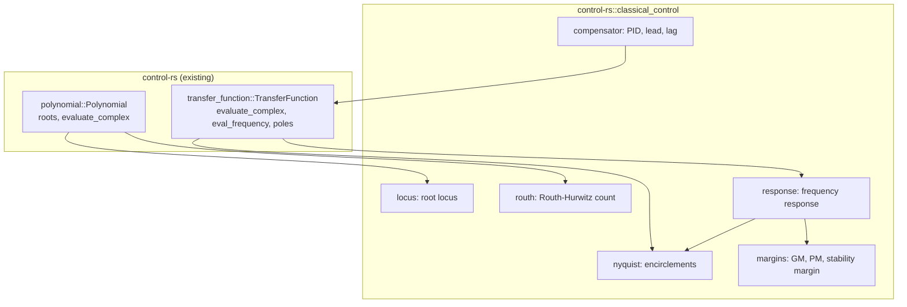

# Classical Control Toolbox (classical-control)


---

### 1. Introduction

The `classical_control` module of `control-rs` provides single-input,
single-output analysis and compensator construction over the existing
`Polynomial` and `TransferFunction` types: root locus, the Routh-Hurwitz
test, Bode, Nyquist and Nichols response data, stability margins, and PID
and lead/lag compensators. Every routine returns numbers into caller-owned,
statically sized buffers; no routine plots. The module replaces the stub
`src/classical_tools`.

Primary usage scenarios:

- **Stability screening**: A user checks a characteristic polynomial for
  right-half-plane roots without solving for them. Failure is a wrong count,
  or a silent result on a degenerate Routh array.
- **Loop shaping**: A user sweeps an open-loop transfer function over
  frequency and reads gain margin, phase margin and crossover frequencies.
  Failure is a margin off by more than the sweep resolution allows, or a
  reported crossover that does not exist.
- **Gain selection**: A user computes closed-loop pole loci over a gain set
  to choose a proportional gain. Failure is a locus point that is not a root
  of the closed-loop characteristic polynomial.
- **Compensator construction**: A user builds a PID, lead or lag
  compensator as a `TransferFunction` and composes it with the plant.
  Failure is a coefficient that differs from the named form.

---

### 2. Requirements

#### 2.1 Functional Requirements

- **FR-1 — Root locus**: For an open-loop `TransferFunction`
  $L(s) = N(s)/D(s)$ and a caller-supplied gain set $\{k_i\}$, returns for
  each $k_i$ the roots of $D(s) + k_i N(s)$.
- **FR-2 — Routh-Hurwitz count**: For a real characteristic polynomial,
  returns the number of roots in the open right half plane and whether roots
  lie on the imaginary axis, without computing roots, including the
  zero-first-column and zero-row cases.
- **FR-3 — Frequency response**: For a continuous or discrete
  `TransferFunction` and a caller-supplied frequency set, returns
  $G(j\omega)$ or $G(e^{j\omega T_s})$ as complex values and as magnitude in
  dB with unwrapped phase in degrees, which serve Bode, Nyquist and Nichols
  data.
- **FR-4 — Nyquist encirclement count**: For a continuous open-loop
  `TransferFunction`, returns the net number of encirclements of $-1$ by the
  Nyquist contour, indenting around open-loop poles on the imaginary axis.
- **FR-5 — Stability margins**: From an open-loop `TransferFunction` and a
  frequency set, returns gain margin, phase margin, their crossover
  frequencies and the stability margin $\min_\omega |1 + L(j\omega)|$, and
  reports a margin as absent when its crossover does not occur in the set.
- **FR-6 — PID compensator**: Constructs a PID `TransferFunction` in
  standard, series or parallel form, with an optional first-order
  derivative filter.
- **FR-7 — Lead and lag compensators**: Constructs lead and lag
  `TransferFunction` values from their corner frequencies and gain.

#### 2.2 Non-Functional Requirements

- **NFR-1 — Numeric output only**: No routine depends on a plotting or GUI
  library; outputs are numeric buffers.
- **NFR-2 — Caller-owned buffers**: Sweep and locus outputs are written into
  caller-provided, statically sized buffers; no routine allocates.
- **NFR-3 — Fixed operation count**: Routh array construction and
  frequency-response evaluation perform a fixed number of operations for a
  given polynomial order and frequency count.

#### 2.3 Constraints

- **C-1 — Existing model types**: Builds on `Polynomial` and
  `TransferFunction` and introduces no parallel representation.
- **C-2 — Capacity bounds**: Conforms to `polynomial-design.md` C-1 and
  `transfer-function-design.md` C-3.
- **C-3 — Root-crate module**: Ships as `src/classical_control` of
  `control-rs` (the stub `src/classical_tools` renamed) and adds no
  dependency.
- **C-4 — Error convention**: Conforms to `error-design.md` NFR-1.
- **C-5 — Excluded scope**: Multivariable systems, interactive tuning, and
  run-time PID execution (anti-windup, bumpless transfer) are out of scope.

---

### 3. Technical Overview

`src/classical_control` is an unconditional module of the root crate beside
`modern_control`, `robust_control` and `nonlinear_control`. It adds no
evaluation or root-finding primitive of its own: it drives
`Polynomial::roots`, `TransferFunction::evaluate_complex` and
`TransferFunction::eval_frequency`, and adds sweep drivers, projections,
crossing detection and constructors.



---

### 4. Architecture

#### 4.1 Module Layout

```text
src/classical_control/
├── mod.rs          # ClassicalError; re-exports
├── locus.rs        # root_locus
├── routh.rs        # routh_count
├── response.rs     # frequency_response, ResponsePoint
├── nyquist.rs      # nyquist_encirclements
├── margins.rs      # stability_margins, Margins
├── compensator.rs  # pid, lead, lag
└── tests/          # one test file per submodule
```

`src/lib.rs` declares `pub mod classical_control;` in place of
`pub mod classical_tools;`. Buffer lengths are const generics: a locus over
$K$ gains of an order-$n$ system writes `[[Complex<T>; n]; K]`, and a sweep
over $M$ frequencies writes `[ResponsePoint<T>; M]`.

#### 4.2 Root Locus

For each gain $k_i$, form $D(s) + k_i N(s)$ with `Polynomial` arithmetic and
solve it with `Polynomial::roots`, as python-control computes the locus from
the roots of $1 + kG(s)$ over a gain range [1]. `Polynomial::roots` uses the
companion-matrix eigenvalue route that numpy also uses [2]. The gain set is
the caller's; python-control instead chooses gains to capture the main
features of the locus [1], and continuation methods trace branches
adaptively [3]. Both are rejected for v1 (§5). Root order across
consecutive gains is not matched; each row is an unordered root set.

#### 4.3 Routh-Hurwitz Count

Build the Routh array from the coefficient slice by the tabular recurrence
and count sign changes in the first column. Two special cases follow the
standard handling [4]: a zero first-column entry with a nonzero remainder
is replaced by $\varepsilon > 0$ and the count taken as
$\varepsilon \to 0^+$; a row of zeros is replaced by the coefficients of the
derivative of the auxiliary polynomial, and the result sets the
imaginary-axis flag. The $\varepsilon$ limit is evaluated symbolically on
signs, not with a numeric $\varepsilon$, so the count is exact for exact
coefficients. A coefficient whose magnitude falls below a caller tolerance
is treated as zero; the tolerance is part of the call.

#### 4.4 Frequency Response and Nichols Data

`frequency_response` evaluates $G(j\omega)$ for continuous systems and
$G(e^{j\omega T_s})$ for discrete systems, the conventions python-control
documents [5]. Each `ResponsePoint` holds $\omega$, the complex value, the
magnitude in dB and the phase in degrees. Phase is unwrapped along the
sweep so consecutive samples differ by less than $180^\circ$. Bode data is
(magnitude, phase) against $\omega$; Nyquist data is the complex value
[6]; Nichols data is magnitude in dB against phase [7]. No routine samples
frequencies itself.

#### 4.5 Nyquist Encirclements

`nyquist_encirclements` returns the net number of encirclements of $-1$
[6]. It evaluates $L(s)$ on the Nyquist contour: the imaginary axis from
$-j\omega_{max}$ to $j\omega_{max}$, a semicircle at infinity resolved by
properness, and small semicircular indentations around open-loop poles on
or near the imaginary axis, as python-control does [6]. The count is the
total winding angle of $1 + L$ divided by $2\pi$, accumulated over a
caller-sized contour buffer. Open-loop poles come from
`TransferFunction::poles`. The routine reports the count and the number of
open-loop right-half-plane poles; it does not infer closed-loop stability
on the caller's behalf.

#### 4.6 Stability Margins

From a response sweep, `stability_margins` finds the gain crossover (where
$|L| = 1$) and the phase crossover (where $\angle L = -180^\circ$) by sign
changes between consecutive samples, and interpolates each crossing
linearly in $\log\omega$ between the bracketing samples. Gain margin is
$1/|L|$ at the phase crossover and phase margin is $180^\circ + \angle L$
at the gain crossover [8]. The stability margin is the minimum of
$|1 + L|$ over the samples [8]. A margin without a crossing in the sweep is
`None`. python-control offers a polynomial method alongside interpolation
[8]; this design uses interpolation only (§5), so accuracy depends on
sweep density (§6.3).

#### 4.7 Compensators

`pid` builds the three forms as `TransferFunction` values [9]:

| Form | Transfer function |
|:--|:--|
| Standard | $K_p (1 + \frac{1}{T_i s} + T_d s)$ |
| Series | $K_c (1 + \frac{1}{\tau_i s})(\tau_d s + 1)$ |
| Parallel | $K_p + \frac{K_i}{s} + K_d s$ |

An ideal derivative has high gain at high frequency [10, Sec. 11.5], so `pid` accepts
an optional filter time constant $T_f$ that replaces $s$ in the derivative
term by $s/(1 + T_f s)$. Without $T_f$ the result is improper and is
returned only where `TransferFunction` admits it
(`transfer-function-design.md` C-1); otherwise `ClassicalError::Improper`.
`lead` returns $K (1 + s/b)/(1 + s/(bN))$ and `lag` returns
$M (1 + s/a)/(1 + sM/a)$ [9]. Constructed compensators are ordinary
`TransferFunction` data and compose through `series`, `parallel` and
`feedback`.

#### 4.8 Error Handling

```rust
#[derive(Debug, Clone, Copy, PartialEq, Eq)]
pub enum ClassicalError {
    /// Root finding failed for a locus gain (FR-1).
    Root(RootError),
    /// The Routh leading coefficient is zero (FR-2).
    ZeroLeadingCoefficient,
    /// The Nyquist contour passes through -1 (FR-4).
    ContourThroughCriticalPoint,
    /// A constructor parameter is non-positive where positivity is
    /// required (FR-6, FR-7).
    InvalidParameter,
    /// The requested PID form is improper and has no filter (FR-6).
    Improper,
}
```

The enum has a hand-written `Display`, `impl core::error::Error` and
`From<RootError>` (C-4). Buffer-length mismatch is excluded by const
generics (`error-design.md` FR-2).

---

### 5. Alternatives

| Alternative | Rejected Because | Reference |
|:--|:--|:--|
| Automatic gain selection for the root locus | Needs heuristics over locus features [1] and a variable-length output, which conflicts with NFR-2. Callers supply the gain set. | [1] |
| Continuation tracing of locus branches | Integrates a differential equation per branch [3]; step count is data-dependent, which conflicts with NFR-3 at no gain over a caller grid for v1. | [3] |
| Polynomial (exact) margin computation | Solving $|L(j\omega)|^2 = 1$ and $\operatorname{Im} L = 0$ needs polynomial root finding per call; python-control falls back from it when it is inaccurate in discrete time [8]. Kept as an extension in §8. | [8] |
| Distinct compensator type | Compensators are ordinary `TransferFunction` values in the reference toolbox [9]; a separate type duplicates composition (C-1). | [9] |
| Run-time PID with anti-windup in this module | Windup is an execution concern under actuator saturation [10, Sec. 11.4], not a design-time transfer function; excluded by C-5. | [10] |

---

### 6. Verification & Validation

#### 6.1 Verification

| Condition | Requirement | Method | Target | Criterion |
|:--|:--|:--|:--|:--|
| VC-1.1 | FR-1 | `libtest` | `control_rs::classical_control::locus::tests::locus_roots_satisfy_characteristic` | Every returned root satisfies §6.2 for $D + k_i N$ over a 3-pole, 1-zero plant and 20 gains; FR-1 holds iff all conditions hold |
| VC-1.2 | FR-1 | `libtest` | `control_rs::classical_control::locus::tests::locus_zero_gain` | At $k = 0$ the roots equal `TransferFunction::poles` within §6.2 |
| VC-2.1 | FR-2 | `libtest` | `control_rs::classical_control::routh::tests::routh_matches_known_roots` | For polynomials built by `Polynomial::from_roots` with 0 to 4 right-half-plane roots, the count equals the constructed count exactly; FR-2 holds iff all conditions hold |
| VC-2.2 | FR-2 | `libtest` | `control_rs::classical_control::routh::tests::routh_zero_first_column` | $s^4 + s^3 + 2s^2 + 2s + 3$ returns 2 right-half-plane roots |
| VC-2.3 | FR-2 | `libtest` | `control_rs::classical_control::routh::tests::routh_zero_row` | $s^3 + s^2 + s + 1$ returns 0 right-half-plane roots and the imaginary-axis flag |
| VC-3.1 | FR-3 | `libtest` | `control_rs::classical_control::response::tests::first_second_order_closed_form` | Magnitude and phase of first- and second-order systems meet §6.2; FR-3 holds iff all conditions hold |
| VC-3.2 | FR-3 | `libtest` | `control_rs::classical_control::response::tests::discrete_unit_circle` | A discrete system is evaluated at $e^{j\omega T_s}$ and matches the closed form within §6.2 |
| VC-3.3 | FR-3 | `libtest` | `control_rs::classical_control::response::tests::phase_unwrapped` | Consecutive phase samples of a fourth-order lag differ by less than $180^\circ$ |
| VC-4.1 | FR-4 | `libtest` | `control_rs::classical_control::nyquist::tests::encirclements_known_cases` | Stable, open-loop unstable and integrating plants return the encirclement counts implied by their known closed-loop pole locations; FR-4 holds iff all conditions hold |
| VC-4.2 | FR-4 | `libtest` | `control_rs::classical_control::nyquist::tests::contour_through_critical_point` | A loop with $L(j\omega_0) = -1$ returns `ContourThroughCriticalPoint` |
| VC-5.1 | FR-5 | `libtest` | `control_rs::classical_control::margins::tests::third_order_margins` | Gain and phase margins of a third-order loop with closed-form crossovers meet §6.2; FR-5 holds iff all conditions hold |
| VC-5.2 | FR-5 | `libtest` | `control_rs::classical_control::margins::tests::absent_crossover` | A first-order loop returns `None` for gain margin |
| VC-6.1 | FR-6 | `libtest` | `control_rs::classical_control::compensator::tests::pid_forms` | The three forms produce coefficient vectors equal to their closed-form expansions exactly; FR-6 holds iff all conditions hold |
| VC-6.2 | FR-6 | `libtest` | `control_rs::classical_control::compensator::tests::pid_filtered_proper` | A filtered PID is proper and an unfiltered derivative returns `Improper` where the capacity cannot hold it |
| VC-7.1 | FR-7 | `libtest` | `control_rs::classical_control::compensator::tests::lead_lag` | Lead and lag coefficients equal their closed forms exactly and non-positive parameters return `InvalidParameter`; FR-7 holds iff all conditions hold |
| VC-8.1 | NFR-1 | `inspection` | — | The module imports no plotting or GUI crate |
| VC-9.1 | NFR-2 | `inspection` | — | No routine allocates; outputs are const-sized buffers |
| VC-10.1 | NFR-3 | `analysis` | — | Routh construction and response evaluation have loop bounds fixed by order and frequency count |
| VC-11.1 | C-1 | `review` | — | The public API takes and returns `Polynomial`, `TransferFunction` and buffers only |
| VC-12.1 | C-2 | `review` | — | Every const parameter is bounded as the cited constraints require |
| VC-13.1 | C-3 | `inspection` | — | The change adds no entry to `[dependencies]` in the root `Cargo.toml` |
| VC-14.1 | C-4 | `inspection` | — | `ClassicalError` derives the `error-design.md` NFR-1 traits and has hand-written `Display` |
| VC-15.1 | C-5 | `review` | — | The public API exposes no multivariable, interactive or run-time PID item |

Coverage: 90% line coverage of `src/classical_control`, measured with
`cargo coverage`. Excluded: none.

#### 6.2 Acceptance

| Claim | Oracle | Measure | Bound |
|:--|:--|:--|:--|
| Routh count (FR-2) | Closed-form: polynomials constructed from known roots | Exact equality | Equal |
| Locus roots (FR-1) | Invariant: residual of $D + k N$ at each root | $\lvert D(p) + kN(p) \rvert / \sum_j \lvert c_j \rvert \lvert p \rvert^j$ | $\le 10 n u$ |
| Frequency response (FR-3) | Closed-form first- and second-order responses | Relative error of magnitude; absolute error of phase | $\le 10 u$; $\le 10^{-9}$ deg |
| Margins (FR-5) | Independent reference implementation (`cross-check`) | Relative error of each margin and crossover | Tolerance entries `classical-control/<case>/<margin>` |
| Compensators (FR-6, FR-7) | Closed-form coefficient expansion | Exact equality | Equal |

$u$ is the unit roundoff of `T`. The locus residual normalization is the
standard backward-error scaling for polynomial roots; the bound assumes the
`Polynomial::roots` accuracy of `polynomial-design.md`.

#### 6.3 Limits

- Margin accuracy is limited by sweep density; the plan checks margins only
  against the cross-check oracle on the stated grids.
- Root locus rows are unordered; branch continuity is not verified.
- On-target execution through ETS suites is not exercised.

---

### 7. Performance & Resource Considerations

**Allocation.** All outputs are caller-owned const-sized buffers; Routh
uses one $(n+1) \times \lceil (n+1)/2 \rceil$ stack array (NFR-2).

**Execution time.** Routh is $O(n^2)$. A response sweep of $M$ points costs
$M$ evaluations of numerator and denominator by Horner's rule, $O(Mn)$. A
root locus over $K$ gains costs $K$ root solves at the cost of
`Polynomial::roots`. Margins add $O(M)$ over a sweep.

**Numeric types.** Generic over `T: Float` (`f32`, `f64`); `Routh` signs
are exact for exactly representable coefficients.

---

### 8. Risks & Open Questions

- **Exact margins (FR-5).** Interpolated margins are only as dense as the
  sweep. Decide whether a polynomial crossover solve [8] joins v1.
- **Discrete Nyquist (FR-4).** The contour is specified for continuous
  systems; the discrete unit-circle contour is not in the evidence base.
- **Routh tolerance (FR-2).** The zero test needs a caller tolerance; no
  cited rule sets its default.
- **Index.** `documentation/README.md` has no control-toolboxes table.

---

### 9. Development Plan

| Phase | Delivers | Requirements | Effort | Status |
|:--|:--|:--|:--|:--|
| 1. Module and Routh | `src/classical_control` (stub renamed), `ClassicalError`, `routh` | FR-2, NFR-3, C-1, C-3, C-4 | 2 days | Planned |
| 2. Frequency domain | `response`, `nyquist`, `margins`, cross-check tolerances | FR-3, FR-4, FR-5, NFR-1, NFR-2 | 4 days | Planned |
| 3. Locus and compensators | `locus`, `compensator` | FR-1, FR-6, FR-7, C-2, C-5 | 3 days | Planned |

---

### 10. Revision History

| Revision | Date | Author | Description |
|:--|:--|:--|:--|
| 1.0 | October 4, 2026 | @MitchellDScott | Initial design document: FR-1 to FR-7, NFR-1 to NFR-3, C-1 to C-5. |

---

## References

[1] Python Control Systems Library, *control.root_locus_map* (Version
0.10.2). [Online]. Available:
https://python-control.readthedocs.io/en/latest/generated/control.root_locus_map.html.
Accessed: Oct. 4, 2026.

[2] NumPy Developers, *numpy.roots* (Version 2.2). [Online]. Available:
https://numpy.org/doc/2.2/reference/generated/numpy.roots.html. Accessed:
Sep. 4, 2026.

[3] C. T. Pan and K. S. Chao, "A computer-aided root-locus method," *IEEE
Trans. Autom. Control*, vol. 23, no. 5, pp. 856–860, 1978,
doi: 10.1109/TAC.1978.1101860.

[4] T. Davidson, "Section 4: Stability and the Routh-Hurwitz condition,"
*EE 3CL4 Course Notes, McMaster University*. [Online]. Available:
https://www.ece.mcmaster.ca/~davidson/EE3CL4/slides/Routh_Hurwitz_handout.pdf.
Accessed: Sep. 4, 2026.

[5] Python Control Systems Library, *control.frequency_response* (Version
0.10.2). [Online]. Available:
https://python-control.readthedocs.io/en/latest/generated/control.frequency_response.html.
Accessed: Oct. 4, 2026.

[6] Python Control Systems Library, *control.nyquist_response* (Version
0.10.2). [Online]. Available:
https://python-control.readthedocs.io/en/latest/generated/control.nyquist_response.html.
Accessed: Oct. 4, 2026.

[7] Python Control Systems Library, *control.nichols_plot* (Version 0.10.2).
[Online]. Available:
https://python-control.readthedocs.io/en/latest/generated/control.nichols_plot.html.
Accessed: Oct. 4, 2026.

[8] Python Control Systems Library, *control.stability_margins* (Version
0.10.2). [Online]. Available:
https://python-control.readthedocs.io/en/latest/generated/control.stability_margins.html.
Accessed: Oct. 4, 2026.

[9] JuliaControl, "lib/ControlSystemsBase/src/pid_design.jl," in
*JuliaControl/ControlSystems.jl*. [Online]. Available:
https://github.com/JuliaControl/ControlSystems.jl/blob/master/lib/ControlSystemsBase/src/pid_design.jl.
Accessed: Oct. 4, 2026.

[10] K. J. Åström and R. M. Murray, *Feedback Systems: An Introduction for
Scientists and Engineers*, 2nd ed. Princeton, NJ, USA: Princeton University
Press, 2020.
