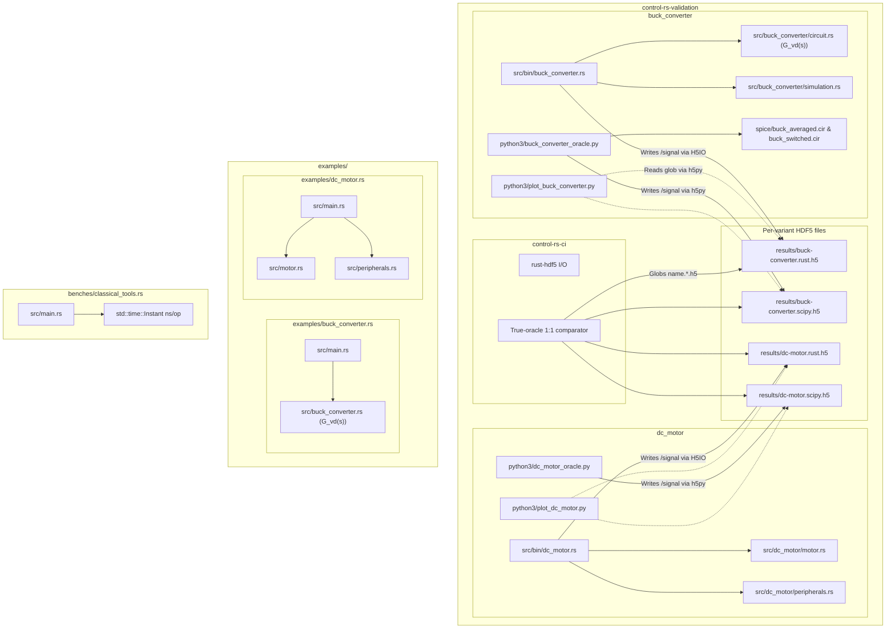

# Classical Tools Integration & Examples (Design Document)


---

### 1. Introduction

This document specifies three host surfaces for `classical_tools`. Two physical plants are the vehicles: a synchronous buck converter averaged small-signal control-to-output voltage model $G_{vd}(s)$ in continuous conduction mode (CCM), and a third-order DC motor armature servo. While unit tests verify isolated algorithm mechanics (such as Routh array recursion or Aberth polynomial root-solving), the host surfaces evaluate closed-loop pipelines on those plants as follows:

1. **Validation (`control-rs-validation/`)**: Oracle, HDF5, and true-oracle 1:1 CI gates in one workspace member.
   - **Synchronous Buck Converter** (`src/buck_converter/`, bin `buck_converter`): An averaged small-signal control-to-output voltage model $G_{vd}(s)$ operating in continuous conduction mode (CCM), compensated by lead synthesis and executed via discrete Direct Form II Transposed (DF2T) recurrence. Verified back-to-back against SciPy analytical models and physical circuit simulations in `ngspice` (small-signal AC, averaged transient step, and switched PWM ripple).
   - **DC Motor Armature Servo** (`src/dc_motor/`, bin `dc_motor`): A third-order electromechanical position and velocity servo subjected to transport delay ($\tau_d = 1\text{ ms}$), actuator voltage saturation ($\pm 12\text{ V}$), and a 16-bit optical encoder. Compares lead compensation against PID control with anti-windup, verified back-to-back against SciPy.
   Validation suites conform to the host oracle harness contract (`documentation/vv/oracle-harness-design.md`).
2. **Pedagogical examples (`examples/`)**: Root-package demos of the same two plants (`examples/buck_converter.rs`, `examples/dc_motor.rs`). They print plant parameters, compensator results, and a short closed-loop narrative. They do not write HDF5, invoke SciPy/`ngspice` oracles, or run true-oracle comparison.
3. **Benches (`benches/classical_tools.rs`)**: Criterion measures DF2T update, PID update, Routh, margins, and lead synthesis. Measurements are not a CI fail gate.

Shared Python lives at `control-rs-validation/python3/h5_write.py` (oracle I/O) and `control-rs-validation/python3/control_rs_plot/` (plot theme; validation plot scripts may import it). The Python venv remains crate-root `.venv`. `control-rs-validation` depends on `control-rs` and `control-rs-ci`.

---

### 2. Requirements

#### 2.1 Functional Requirements

- **FR-1 — Compensator synthesis on a resonant plant**: A validation suite demonstrates that the toolbox stabilizes an underdamped second-order plant and reports the resulting stability margins and transient regulation. A worked switching-converter plant is the vehicle (Erickson and Maksimovic, 2001); the need is evidence that synthesis works on a plant whose resonance the compensator must dominate.
- **FR-2 — Compensation under non-ideal actuation**: A validation suite demonstrates control of a plant carrying transport delay, actuator saturation and sensor quantization together. Each non-ideality alone is representable in simulation; the need is evidence that they compose without the toolbox silently linearizing them away.
- **FR-3 — Agreement with independent implementations**: Validation suite outputs are compared back-to-back against at least one implementation not derived from this source, over frequency response and transient response. Comparison against a single oracle would not distinguish a shared modelling error from agreement (Benner et al., 1999).
- **FR-4 — Inspectable result artifacts**: Each validation suite persists one HDF5 file per variant (`results/<name>.<variant>.h5`) and renders diagnostic figures a reviewer can read without rerunning the suite. The figures are diagnostics, not a pass criterion; gating remains the true-oracle comparison of FR-3.
- **FR-5 — Pedagogical plant examples**: A reader can run `examples/buck_converter.rs` and `examples/dc_motor.rs` to see synthesis and closed-loop behavior without installing SciPy/ngspice or writing HDF5. Bound: examples are not the numerical gate.
- **FR-6 — Host latency benches**: `benches/classical_tools.rs` reports criterion samples for discrete realizations and analysis kernels. Bound: measurements, not fail-closed B2B.

#### 2.2 Non-Functional Requirements

- **NFR-1 — Real-time firmware conformance**: Discrete controllers in validation suites, pedagogical examples, and benches execute under `#![no_std]` with bounded per-step latency and zero heap allocation. Discretization is by the standard bilinear and hold transformations (Oppenheim and Schafer, 2010), so the discrete form carries the same latency bound as the continuous design (Astrom and Murray, 2008).

#### 2.3 Constraints

- **C-1 — Harness Contract Conformance**: Interpreter discovery, oracle execution, fail-closed comparison, and result serialization in `control-rs-validation` must strictly adhere to `documentation/vv/oracle-harness-design.md`.
- **C-2 — Physical Parameter Realism**: Component values, time constants, and operating points must reflect real-world physical hardware (e.g., $100\,\mu\text{H}$ inductor, $100\,\mu\text{F}$ capacitor, $5\,\text{V}$ regulation from $12\,\text{V}$ rail).

---

### 3. Technical Overview

The examples validate `classical_tools` across two physical domains:

1. **Power Electronics (Buck Converter)**:
   Linearized averaged model about duty cycle $D_0 = V_{out}/V_{in} = 5/12$:
   $$G_{vd}(s) = \frac{V_{in}}{L C s^2 + (L/R_L)s + 1} = \frac{1.2 \times 10^9}{s^2 + 10^4 s + 10^8}$$
   Natural frequency $\omega_n = 10^4\text{ rad/s}$, damping ratio $\zeta = 0.5$. Uncompensated crossover occurs at $\approx 35.3\text{ krad/s}$ with $17.1^\circ$ phase margin. Lead synthesis targets crossover near $30\text{ krad/s}$ with $\ge 45^\circ$ phase margin, realized digitally via Tustin bilinear transform at $f_s = 100\text{ kHz}$.

2. **Electromechanical Motion (DC Motor Servo)**:
   Armature differential equation: $V(t) = R_a i(t) + L_a \frac{di}{dt} + K_b \omega(t)$.
   Rotor mechanical equation: $J \frac{d\omega}{dt} + b \omega(t) = K_t i(t)$.
   Parameters: $R_a = 2.0\,\Omega$, $L_a = 0.5\text{ mH}$, $K_t = 0.05\text{ N}\cdot\text{m/A}$, $K_b = 0.05\text{ V}\cdot\text{s/rad}$, $J = 2\times 10^{-4}\text{ kg}\cdot\text{m}^2$, $b = 1\times 10^{-4}\text{ N}\cdot\text{m}\cdot\text{s/rad}$. Transport delay $\tau_d = 1\text{ ms}$ adds phase lag $\phi(\omega) = -\omega \tau_d$.

---

### 4. Architecture



---

### 5. Alternatives

1. **Synthetic Polynomial Benchmark Functions**: Synthetic transfer functions test isolated algebraic identities but fail to reveal real engineering failure modes (such as phase lag accumulation across transport delays, anti-windup clamping under step changes, or switching ripple interactions). Modeling a buck converter and DC motor exercises the exact loops intended for firmware closure.
2. **Pure Python Analytical Oracles vs. Mixed SPICE Simulation**: Analytical transfer function evaluations in SciPy confirm mathematical syntax but do not prove physical validity. Incorporating `ngspice` confirms that state-space averaged linearization faithfully predicts real electronic circuit responses.

---

### 6. Verification & Validation

#### 6.1 Approach

- Demonstrate that `classical_tools` frequency-domain margins, Routh stability, root locus, and digital filter synthesis match external oracles to stated tolerances.
- Demonstrate that `DirectForm2T` discrete firmware realization matches analytical closed-loop expectations.
- Demonstrate physical circuit consistency with `ngspice` AC and transient simulations.

All host cross-validation methods declare strict conformance to `documentation/vv/oracle-harness-design.md`:

| Method | Mechanism |
|:---|:---|
| Back-to-back comparison | Host oracle harness (`oracle-harness-design.md`); `control-rs-validation/python3/buck_converter_oracle.py` (SciPy & ngspice) via `control-rs-ci` |
| Back-to-back comparison | Host oracle harness (`oracle-harness-design.md`); `control-rs-validation/python3/dc_motor_oracle.py` (SciPy) via `control-rs-ci` |
| Requirements-based test | `#[test]` in `control-rs-validation/src/buck_converter/oracle.rs` and `control-rs-validation/src/dc_motor/oracle.rs` |
| Inspection | Pedagogical example sources exist and run without oracles |
| Resource usage evaluation | Criterion benches in `benches/classical_tools.rs`; not a fail-closed gate |
| Static analysis | `cargo clippy-ci`, `cargo lint` |
| Inspection | Circuit component specs and physical parameters audit in validation suites |
| Coverage measurement | `cargo coverage` of validation runners |

Target: 100% statement coverage of cross-validation runner code in `control-rs-validation/src/buck_converter/oracle.rs` and `control-rs-validation/src/dc_motor/oracle.rs`, measured with `cargo coverage`. Excluded: Python oracles and plot scripts.

Validation is established by executing both plant oracle suites in continuous integration:
```bash
(cd control-rs-validation && cargo run)
(cd control-rs-validation && cargo run)
```
Each run executes native Rust algorithms, writes `results/<name>.rust.h5`, and may spawn plot scripts. Suite `commands` write peer variant files. The gate globs `results/<name>.*.h5` and compares against the true oracle. Plot failure does not fail the gate.

Pedagogical copies of the same plants are not the numerical gate:
```bash
cargo run --example buck_converter
cargo run --example dc_motor
```

Host latency benches report Instant ns/op and are not a fail-closed B2B gate:
```bash
(cd benches/classical_tools.rs && cargo run --release)
```

#### 6.2 Acceptance

This table defines the single authoritative specification of cross-language tolerances for `classical_tools` validation suites, keyed by `(subject, operation, oracle library)`:

| Key | Subject | Operation | Oracle Library | Measure | Tolerance Bound | Justification |
|:---|:---|:---|:---|:---|:---|:---|
| `buck.plant.natural_frequency` | **Buck Converter** | Plant Natural Frequency $\omega_n$ | SciPy `scipy.signal` | Absolute error | $\le 10^{-9}\text{ rad/s}$ | Analytical $1/\sqrt{LC}$ formula agreement |
| `buck.plant.damping_ratio` | **Buck Converter** | Plant Damping Ratio $\zeta$ | SciPy `scipy.signal` | Absolute error | $\le 10^{-9}$ | Analytical $\frac{\sqrt{L/C}}{2 R_L}$ formula agreement |
| `buck.margins.uncompensated.gain_crossover` | **Buck Converter** | Uncompensated Gain Crossover $\omega_{gc}$ | SciPy `scipy.signal` | Absolute error | $\le 2.0\text{ rad/s}$ | Grid interpolation resolution over $1\text{ Mrad/s}$ span ($<0.01\%$) |
| `buck.margins.uncompensated.phase_margin` | **Buck Converter** | Uncompensated Phase Margin | SciPy `scipy.signal` | Absolute error | $\le 0.01^\circ$ | Frequency sweep phase evaluation precision |
| `buck.compensator.gain_k` | **Buck Converter** | Compensator Lead Gain $K$ | SciPy `scipy.signal` | Absolute error | $\le 10^{-5}$ | Coupled transcription of the same closed-form lead synthesis (`independent = false`) |
| `buck.compensator.time_constant_t_s` | **Buck Converter** | Compensator Time Constant $T$ | SciPy `scipy.signal` | Absolute error | $\le 10^{-8}\text{ s}$ | Coupled transcription (`independent = false`) |
| `buck.compensator.attenuation_alpha` | **Buck Converter** | Compensator Attenuation $\alpha$ | SciPy `scipy.signal` | Absolute error | $\le 10^{-5}$ | Coupled transcription (`independent = false`) |
| `buck.compensator.zero_rad_s` | **Buck Converter** | Compensator Zero $\omega_z$ | SciPy `scipy.signal` | Absolute error | $\le 10^{-3}\text{ rad/s}$ | Coupled transcription (`independent = false`) |
| `buck.compensator.pole_rad_s` | **Buck Converter** | Compensator Pole $\omega_p$ | SciPy `scipy.signal` | Absolute error | $\le 10^{-2}\text{ rad/s}$ | Coupled transcription (`independent = false`) |
| `buck.compensator.max_phase_lead_deg` | **Buck Converter** | Maximum Phase Lead Angle | SciPy `scipy.signal` | Absolute error | $\le 10^{-4\circ}$ | Coupled transcription (`independent = false`) |
| `buck.compensator.df2t_b0` | **Buck Converter** | Bilinear Tustin Coefficient $b_0$ | SciPy `scipy.signal` | Absolute error | $\le 10^{-5}$ | Coupled transcription of bilinear mapping at $100\text{ kHz}$ (`independent = false`) |
| `buck.compensator.df2t_b1` | **Buck Converter** | Bilinear Tustin Coefficient $b_1$ | SciPy `scipy.signal` | Absolute error | $\le 10^{-5}$ | Coupled transcription (`independent = false`) |
| `buck.compensator.df2t_a1` | **Buck Converter** | Bilinear Tustin Coefficient $a_1$ | SciPy `scipy.signal` | Absolute error | $\le 10^{-5}$ | Coupled transcription (`independent = false`) |
| `buck.margins.compensated.gain_crossover` | **Buck Converter** | Compensated Gain Crossover | SciPy `scipy.signal` | Absolute error | $\le 2.0\text{ rad/s}$ | Bisection crossover refinement over grid |
| `buck.margins.compensated.phase_margin` | **Buck Converter** | Compensated Phase Margin | SciPy `scipy.signal` | Absolute error | $\le 0.01^\circ$ | High-density sweep angle accuracy |
| `buck.margins.compensated.delay_margin` | **Buck Converter** | Compensated Delay Margin | SciPy `scipy.signal` | Absolute error | $\le 0.05\,\mu\text{s}$ | Derived $\text{PM}/\omega_{gc}$ delay headroom |
| `buck.frequency_sweep.uncomp_mag_db` | **Buck Converter** | Uncompensated Frequency Sweep Magnitude | SciPy `scipy.signal` | Absolute error | $\le 10^{-3}\text{ dB}$ | Elementwise evaluation over 1,000 points |
| `buck.frequency_sweep.comp_mag_db` | **Buck Converter** | Compensated Frequency Sweep Magnitude | SciPy `scipy.signal` | Absolute error | $\le 10^{-3}\text{ dB}$ | Elementwise evaluation over 1,000 points |
| `buck.frequency_sweep.uncomp_phase_deg` | **Buck Converter** | Uncompensated Frequency Sweep Phase | SciPy `scipy.signal` | Absolute error | $\le 10^{-2\circ}$ | Elementwise evaluation over 1,000 points |
| `buck.frequency_sweep.comp_phase_deg` | **Buck Converter** | Compensated Frequency Sweep Phase | SciPy `scipy.signal` | Absolute error | $\le 10^{-2\circ}$ | Elementwise evaluation over 1,000 points |
| `buck.root_locus.poles_re` | **Buck Converter** | Root Locus Closed-Loop Poles Real | SciPy `np.roots` | Absolute error | $\le 10^{-4}$ | Per-gain sorted real parts on the shared $K\in[0,2K_{\mathrm{nom}}]$ mesh |
| `buck.root_locus.poles_im` | **Buck Converter** | Root Locus Closed-Loop Poles Imag | SciPy `np.roots` | Absolute error | $\le 10^{-4}$ | Per-gain sorted imag parts on the shared $K\in[0,2K_{\mathrm{nom}}]$ mesh |
| `buck.ngspice.ac_plant_dc_gain` | **Buck Converter** | Small-Signal AC Plant DC Gain | ngspice `ac_sweep` | Absolute error | $\le 0.05\text{ dB}$ | SPICE netlist vs analytical $20\log_{10}(V_{in})$ |
| `buck.ngspice.step_final_voltage` | **Buck Converter** | Transient Step Final Voltage | ngspice `averaged_step` | Absolute error | $\le 0.005\text{ V}$ | Rust linear-step last sample vs SPICE averaged recovery |
| `buck.ngspice.step_steady_state_error` | **Buck Converter** | Transient Steady-State Error | ngspice `averaged_step` | Absolute error | $\le 0.005\text{ V}$ | Linearized simulation vs SPICE averaged recovery |
| `buck.ngspice.load_restored_voltage` | **Buck Converter** | Load Disturbance Restored Voltage | ngspice `averaged_load` | Absolute error | $\le 0.005\text{ V}$ | Lossless CCM regulation restored to $V_{OUT} = 5.0\text{ V}$ |
| `buck.ngspice.switched_ripple` | **Buck Converter** | Switched PWM Ripple | ngspice `switched_step` | Interval enclosure | $[1.0, 10.0]\text{ mV}$ | Physical switching ripple near $3.6\text{ mV}$ pk-pk |
| `dc_motor.plant.num` | **DC Motor** | Plant Numerator Polynomial | SciPy `scipy.signal` | Absolute error | $\le 10^{-12}$ | Electromechanical constant scaling |
| `dc_motor.plant.den` | **DC Motor** | Plant Denominator Polynomial | SciPy `scipy.signal` | Absolute error | $\le 10^{-12}$ | Characteristic polynomial convolution |
| `dc_motor.margins.uncompensated.gain_crossover` | **DC Motor** | Uncompensated Gain Crossover | SciPy (Brent root) | Absolute error | $\le 5 \times 10^{-3}\text{ rad/s}$ | 10-step bisection vs Brent scalar solver |
| `dc_motor.margins.uncompensated.phase_margin` | **DC Motor** | Uncompensated Phase Margin | SciPy (Brent root) | Absolute error | $\le 5 \times 10^{-3\circ}$ | Refined crossover phase evaluation |
| `dc_motor.compensator.gain_k` | **DC Motor** | Lead Gain $K$ | SciPy `scipy.signal` | Absolute error | $\le 10^{-4}$ | Coupled transcription of lead synthesis (`independent = false`) |
| `dc_motor.compensator.time_constant_t_s` | **DC Motor** | Lead Time Constant $T$ | SciPy `scipy.signal` | Absolute error | $\le 10^{-6}\text{ s}$ | Coupled transcription (`independent = false`) |
| `dc_motor.compensator.attenuation_alpha` | **DC Motor** | Lead Attenuation $\alpha$ | SciPy `scipy.signal` | Absolute error | $\le 10^{-5}$ | Coupled transcription (`independent = false`) |
| `dc_motor.compensator.max_phase_lead_deg` | **DC Motor** | Maximum Phase Lead Angle $\phi_m$ | SciPy `scipy.signal` | Absolute error | $\le 0.05^\circ$ | Coupled transcription (`independent = false`) |
| `dc_motor.compensator.df2t_b0` | **DC Motor** | DF2T Realization $b_0$ | SciPy `scipy.signal` | Absolute error | $\le 10^{-4}$ | Coupled transcription of bilinear discretization (`independent = false`) |
| `dc_motor.compensator.df2t_b1` | **DC Motor** | DF2T Realization $b_1$ | SciPy `scipy.signal` | Absolute error | $\le 10^{-4}$ | Coupled transcription (`independent = false`) |
| `dc_motor.compensator.df2t_a1` | **DC Motor** | DF2T Realization $a_1$ | SciPy `scipy.signal` | Absolute error | $\le 10^{-4}$ | Coupled transcription (`independent = false`) |
| `dc_motor.margins.compensated.gain_crossover` | **DC Motor** | Compensated Gain Crossover | SciPy (Brent root) | Absolute error | $\le 5 \times 10^{-3}\text{ rad/s}$ | Bisection crossover refinement |
| `dc_motor.margins.compensated.phase_margin` | **DC Motor** | Compensated Phase Margin | SciPy (Brent root) | Absolute error | $\le 5 \times 10^{-3\circ}$ | Refined crossover phase evaluation |
| `dc_motor.margins.compensated.delay_margin` | **DC Motor** | Compensated Delay Margin | SciPy `scipy.signal` | Absolute error | $\le 1.0\,\mu\text{s}$ | Delay headroom comparison |
| `dc_motor.stability.rhp_poles` | **DC Motor** | Compensated Closed-Loop RHP Poles | SciPy `scipy.signal` | Exact equality | $0$ | Strict Hurwitz stability verification |
| `dc_motor.frequency_sweep.mag_db` | **DC Motor** | Frequency Sweep Magnitude | SciPy `scipy.signal` | Absolute error | $\le 10^{-6}\text{ dB}$ | 1,000-point frequency response sweep |
| `dc_motor.frequency_sweep.phase_deg` | **DC Motor** | Frequency Sweep Phase | SciPy `scipy.signal` | Absolute error | $\le 10^{-6\circ}$ | 1,000-point frequency response sweep |
| `dc_motor.root_locus.poles` | **DC Motor** | Root Locus Final Closed-Loop Poles | SciPy companion roots | Absolute error | $\le 10^{-6}$ | Order-invariant sorted pole comparison at final gain $K_{\max} = 2 K_{\text{nom}}$ |

#### 6.3 Limits

- Adaptive root-locus *intermediate* gain meshes: SciPy lacks an adaptive continuation engine, so the DC-motor adaptive trajectory is not a host B2B claim. Cross-validation asserts parity of the final closed-loop poles at $K_{\max}$ (`dc_motor.root_locus.poles`). The buck converter uses a uniform $K$ sweep on the same mesh as SciPy; those per-gain sorted poles are gated (`buck.root_locus.poles_{re,im}`).
- Temperature-dependent parameter drift and non-ideal circuit parasitics are not modeled.
- On-target PWM/ADC hardware-in-the-loop is not part of this host-surface plan.
- FR-6 ns/op figures are measurements, not a fail-closed bound.

---

### 7. Performance & Resource Considerations

Both examples execute in $< 2\text{ seconds}$ on standard host hardware, including the Python subprocess invocations and ngspice transient circuit simulations.

---

### 8. Risks & Open Questions

- **ngspice Dependency**: Running the switched circuit simulation requires `ngspice` to be installed on the host system. When `ngspice` is absent from `PATH`, the buck-converter oracle gracefully skips circuit simulations while continuing analytical SciPy verification.
- **Missing Research Pair**: This integration and examples design document currently relies on inline literature citations [1]–[4] without a dedicated paired research JSON/BibTeX store under `documentation/control-toolboxes/research/classical-tools-examples.{json,bib}`. Upstream evidence collection remains an open task for future research sweeps.

---

### 9. Development Plan

| Phase | Description | Status |
|:---|:---|:---|
| Phase 1: Buck Converter Example | Implement averaged model, lead synthesis, ngspice netlists, and CI gate. | Shipped |
| Phase 2: DC Motor Example | Implement armature dynamics, transport delay, saturation, encoder quantization, and CI gate. | Shipped |
| Phase 3: Examples Design Specification | Document architectures and tolerance table under classical-tools. | Active |
| Phase 4: Pedagogical Examples and Classical-Tools Bench | Nested pedagogical crates under `examples/buck_converter.rs` and `examples/dc_motor.rs`, plus `benches/classical_tools.rs` Instant ns/op measurements. | Planned |

---

### 10. Revision History

| Revision | Date              | Author          | Description                                                                                                                                                                                                         |
|:---------|:------------------|:----------------|:--------------------------------------------------------------------------------------------------------------------------------------------------------------------------------------------------------------------|
| 1.0      | September 8, 2026 | @MitchellDScott | Initial draft establishing integration and example design for classical tools.                                                                                                                                      |
| 1.1      | September 9, 2026 | @MitchellDScott | Structural hardening: updated badge to standard dialect, replaced 'shall' with 'must', mapped C-2 in §6.2/6.4, noted missing research pair in §8, standardized revision history and references. |
| 1.2      | September 12, 2026 | @MitchellDScott | HDF5 container migration: updated FR-4 and architecture diagram to specify single-file HDF5 result persistence (`results/<subject>.h5`) via `rust-hdf5` and `h5py` conforming to `documentation/vv/oracle-harness-design.md`. |
| 1.4      | September 12, 2026 | @MitchellDScott | DC-motor plant constants aligned with `motor.rs`; plot scripts named; 1,000-point sweeps; buck locus poles gated; compensator rows marked `independent = false`; ngspice step baseline is the Rust linear-step last sample. |
| 1.5      | September 15, 2026 | @MitchellDScott | Split validation/, examples/, and bench/; relocate plant oracle suites under validation/. |
| 1.6      | September 15, 2026 | @MitchellDScott | Plant oracles live in the `control-rs-validation` workspace member; pedagogical examples are root-package `examples/*.rs`; benches use criterion. |
| 1.7      | September 15, 2026 | @MitchellDScott | Catalogue methods only in §6.2; demos are inspection/validation; latency is resource-usage evaluation. |

---

## References

Inline citations are author–year and resolve to this list.

- [1] R. W. Erickson and D. Maksimovic, *Fundamentals of Power Electronics*, 2nd ed. Norwell, MA, USA: Kluwer Academic Publishers, 2001.
- [2] K. J. Astrom and R. M. Murray, *Feedback Systems: An Introduction for Scientists and Engineers*. Princeton, NJ, USA: Princeton University Press, 2008.
- [3] A. V. Oppenheim and R. W. Schafer, *Discrete-Time Signal Processing*, 3rd ed. Upper Saddle River, NJ, USA: Prentice Hall, 2010.
- [4] P. Benner et al., "SLICOT: Subroutine Library in Systems and Control Theory," 1999.
