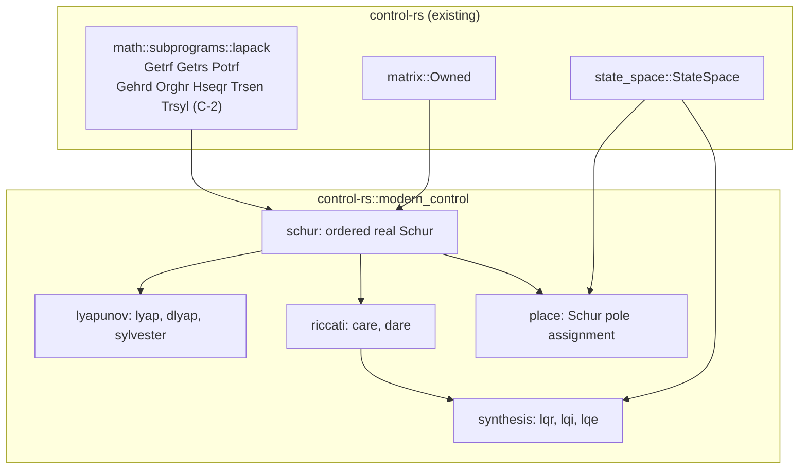

# Modern Control Toolbox (modern-control)


---

### 1. Introduction

The `modern_control` module of `control-rs` provides the dense matrix
equation solvers and the state-space synthesis routines of linear modern
control: Lyapunov, Stein and Sylvester equations, the continuous and discrete
algebraic Riccati equations (CARE, DARE), linear quadratic regulator and
estimator gains, and eigenvalue assignment. Every routine operates on the
statically sized `Matrix` and `StateSpace` types, runs in
`#![no_std]` without allocation and terminates within a fixed iteration
budget, so the same call serves host design work and on-target re-synthesis.

The solvers follow the Schur-vector family used by SLICOT and
MatrixEquations.jl [1]-[3]: reduce to real Schur form, reorder eigenvalues,
solve on the quasi-triangular form and transform back. The dense eigen
kernels this needs (Hessenberg reduction, Hessenberg QR, Schur reordering and
the quasi-triangular Sylvester solve) do not exist in
`src/math/subprograms.rs` today; this design depends on them (C-2).

Primary usage scenarios:

- **Regulator design**: A user computes an LQR, discrete LQR or LQI gain for
  a plant model. Failure is a gain that does not stabilize the plant, or a
  silent result when no stabilizing solution exists.
- **Estimator gain design**: A user computes the steady-state Kalman
  (LQE) gain for given process and measurement noise covariances. Failure is
  an unstable error dynamics matrix $A - LC$ or a non-symmetric covariance.
- **Eigenvalue assignment**: A user places the closed-loop eigenvalues of a
  controllable pair $(A, B)$ at a requested set. Failure is a gain whose
  closed-loop spectrum misses the request, or a gain returned for an
  uncontrollable mode the request moves.
- **Stability and Gramian analysis**: A user solves a Lyapunov or Stein
  equation for a stability certificate or a controllability Gramian. Failure
  is a returned solution when the equation is singular.
- **On-target re-synthesis**: Firmware recomputes a gain after a model
  update inside a control task. Failure is an unbounded iteration, a heap
  allocation or a stack footprint above the task's budget.

---

### 2. Requirements

#### 2.1 Functional Requirements

- **FR-1 — Continuous Lyapunov solution**: Given $A \in \mathbb{R}^{N \times N}$
  and symmetric $Q$, returns the symmetric $X$ satisfying
  $A^T X + X A + Q = 0$, or an error when $\lambda_i(A) + \lambda_j(A) = 0$
  for some eigenvalue pair.
- **FR-2 — Discrete Lyapunov solution**: Given $A$ and symmetric $Q$, returns
  the symmetric $X$ satisfying $A^T X A - X + Q = 0$, or an error when
  $\lambda_i(A) \lambda_j(A) = 1$ for some eigenvalue pair.
- **FR-3 — Sylvester solution**: Given $A \in \mathbb{R}^{M \times M}$,
  $B \in \mathbb{R}^{N \times N}$ and $C \in \mathbb{R}^{M \times N}$, returns
  $X$ satisfying $A X + X B = C$, or an error when $A$ and $-B$ share an
  eigenvalue.
- **FR-4 — Stabilizing CARE solution**: Given $(A, B, Q, R)$ with $R$
  symmetric positive definite and $Q$ symmetric positive semidefinite,
  returns the symmetric $X$ satisfying
  $A^T X + X A - X B R^{-1} B^T X + Q = 0$ with
  $A - B R^{-1} B^T X$ Hurwitz, together with the closed-loop eigenvalues, or
  an error when no stabilizing solution exists.
- **FR-5 — Stabilizing DARE solution**: Given the same data, returns the
  symmetric $X$ satisfying
  $X = A^T X A - A^T X B (R + B^T X B)^{-1} B^T X A + Q$ with the closed-loop
  matrix Schur stable, together with the closed-loop eigenvalues, or an error
  when no stabilizing solution exists or $A$ is singular.
- **FR-6 — Linear quadratic regulator gain**: Given a continuous or discrete
  `StateSpace` and weights $(Q, R)$, returns the gain $K$ of $u = -Kx$
  that minimizes the infinite-horizon quadratic cost, the Riccati solution and
  the closed-loop eigenvalues.
- **FR-7 — Integral-action regulator gain**: Given a `StateSpace` with $N_y$
  outputs and weights on the augmented state, returns
  $K = [K_x \; K_i]$ for the plant augmented with one integrator per output.
- **FR-8 — Steady-state estimator gain**: Given a continuous or discrete
  `StateSpace`, a process-noise input matrix $G$ and noise covariances
  $(Q_n, R_n)$, returns the steady-state Kalman gain $L$, the error
  covariance and the eigenvalues of $A - LC$.
- **FR-9 — Eigenvalue assignment**: Given $(A, B)$ and $N$ requested
  eigenvalues closed under complex conjugation, returns $K$ with
  $\operatorname{eig}(A - BK)$ equal to the request, or an error when the
  request is not conjugate-closed or moves an uncontrollable eigenvalue.

#### 2.2 Non-Functional Requirements

- **NFR-1 — Bounded iteration**: Every iterative step (Hessenberg QR) runs
  under a fixed iteration budget that is part of the call contract; exhausting
  it returns an error instead of looping.
- **NFR-2 — Cubic operation count**: Each solver performs $O(N^3)$
  floating-point operations for state dimension $N$ (Riccati solvers in
  $2N$).
- **NFR-3 — Bounded stack workspace**: Each Riccati solve uses at most
  $3 (2N)^2 + O(N)$ scalars of stack workspace and no heap.

#### 2.3 Constraints

- **C-1 — Real floating-point scalars**: Solvers are generic over
  `T: Float` (`f32`, `f64`); complex and fixed-point scalars are excluded.
- **C-2 — Dense eigen kernels**: Depends on LAPACK-equivalent traits
  `Gehrd`, `Orghr`, `Hseqr`, `Trsen` and `Trsyl` with `DefaultBlas`
  implementations, specified by a revision of `subprograms-design.md`. This
  module does not implement them.
- **C-3 — Root-crate module**: Ships as the module `src/modern_control` of
  `control-rs` and adds no dependency to the root crate.
- **C-4 — `#![no_std]` execution**: Conforms to `subprograms-design.md`
  NFR-1.
- **C-5 — Riccati dimension bound**: Riccati, LQR, LQI and LQE routines
  accept $N \le 16$ so the $2N$ Hamiltonian or symplectic matrix stays within
  `state-space-design.md` C-2.
- **C-6 — Error convention**: Conforms to `error-design.md` NFR-1.
- **C-7 — Excluded scope**: Runtime observers and filters (Luenberger,
  Kalman, EKF, UKF), cross-weighted cost terms, descriptor systems, $H_\infty$
  and model predictive control are out of scope.

---

### 3. Technical Overview

`src/modern_control` is an unconditional module of the root crate beside
`classical_control`, `robust_control` and `nonlinear_control`, so it
inherits the crate's `#![no_std]` build and adds no dependency. It reuses
`Matrix`, `Owned`, `StateSpace`, the numeric traits and `LinAlgError`, and
replaces the four-line stub `src/modern_tools`.



Four submodules sit on a shared ordered-Schur layer:

- **`schur`**: wraps the C-2 kernels into one call that returns $Z$, $T$
  with $A = Z T Z^T$ and the eigenvalues, optionally reordered so a selected
  set leads [4]-[6].
- **`lyapunov`**: Bartels-Stewart solution of FR-1 to FR-3 on the Schur
  form [7], [2].
- **`riccati`**: Schur-vector solution of FR-4 and FR-5 from the stable
  invariant subspace of the Hamiltonian or symplectic matrix [1], [8].
- **`synthesis`** and **`place`**: gain formulas over the Riccati solution
  (FR-6 to FR-8) and Schur pole assignment (FR-9) [9], [10].

---

### 4. Architecture

#### 4.1 Module Layout

```text
src/modern_control/
├── mod.rs          # ModernError; re-exports
├── schur.rs        # OrderedSchur over Gehrd/Orghr/Hseqr/Trsen
├── lyapunov.rs     # lyap, dlyap, sylvester
├── riccati.rs      # care, dare
├── synthesis.rs    # lqr, lqi, lqe
├── place.rs        # place
└── tests/          # one test file per submodule
```

`src/lib.rs` declares `pub mod modern_control;` in place of
`pub mod modern_tools;`; no manifest changes.

Signatures follow the root crate's dimension discipline: sizes are const
generics, and a derived size is a separate const parameter constrained by
a `DimAdd` or `DimMul` bound, as `StateSpace::series` and
`StateSpace::controllability_matrix` do (`state-space-design.md`). For the
Riccati solvers the $2N$ dimension is `const N2: usize` with
`Const<N2>: Dim<TypeNum = <TypeNum<N> as DimMul<U2>>::Output>`, so a caller
cannot pass a mismatched workspace size.

#### 4.2 Ordered Real Schur Layer

`schur` reduces $A$ to upper Hessenberg form by an orthogonal similarity
(`Gehrd`, `Orghr`) [4], computes the real Schur form $T$ and Schur vectors
$Z$ by Hessenberg QR (`Hseqr`) [5], and, when a selection predicate is given,
reorders $T$ so the selected eigenvalues lead and the leading columns of $Z$
span their invariant subspace (`Trsen`) [6]. $T$ is upper quasi-triangular
with $1 \times 1$ and $2 \times 2$ blocks; each $2 \times 2$ block holds a
complex conjugate pair [2], [11]. The two selection predicates are
$\operatorname{Re}\lambda < 0$ (continuous) and $|\lambda| < 1$ (discrete).
`Hseqr` runs under the NFR-1 budget, following the sweep-budget contract of
`subprograms-design.md` FR-8; the nalgebra Schur API exposes the same choice
as a `max_niter` argument [12].

#### 4.3 Lyapunov, Stein and Sylvester Solvers

All three use Bartels-Stewart [7]:

1. Compute $A = U S U^T$ (and $B = V T V^T$ for FR-3).
2. Transform the right-hand side: $\tilde{C} = U^T C V$.
3. Solve the quasi-triangular equation by block back-substitution.
4. Transform back: $X = U \tilde{X} V^T$.

The continuous forms (FR-1, FR-3) use `Trsyl`, which solves
$\operatorname{op}(A) X \pm X \operatorname{op}(B) = \text{scale} \cdot C$
on Schur-canonical input [13]; FR-1 calls it with
$\operatorname{op}(A) = S^T$, $\operatorname{op}(B) = S$. The Stein equation
(FR-2) has no `Trsyl` analogue, so `lyapunov` carries its own
quasi-triangular back-substitution over the same Schur form, as SB03MD does
for both forms [2]. Both carry the `scale` factor ($\le 1$) that prevents
overflow in $X$ [13], [2]; a scale below one is returned as an error rather
than a silently rescaled solution. FR-1 and FR-2 symmetrize the result,
$X \leftarrow \tfrac{1}{2}(X + X^T)$. SB03MD reports $O(N^3)$ cost and
backward stability for this method [2].

Solving for the Cholesky factor of $X$ directly (Hammarling) is not part of
this design (§5).

#### 4.4 Riccati Solvers

**CARE (FR-4).** Form the Hamiltonian

$$H = \begin{bmatrix} A & -G \\ -Q & -A^T \end{bmatrix}, \quad G = B R^{-1} B^T,$$

with $G$ from a Cholesky solve of $R$ (`Potrf`, `Potrs`). Compute the
ordered Schur form of $H$ with the $N$ eigenvalues of negative real part
leading. Partition the leading $N$ Schur vectors as
$[U_{11}; U_{21}]$; then $U_{11}$ is invertible and
$X = U_{21} U_{11}^{-1}$ [1]. $X$ is obtained from
$U_{11}^T X = U_{21}^T$ by LU (`Getrf`, `Getrs`) and symmetrized. The leading
$N$ eigenvalues of $H$ are the closed-loop eigenvalues and are returned
with $X$, as SB02MD does [8].

**DARE (FR-5).** With $A$ nonsingular, form the symplectic matrix

$$S = \begin{bmatrix} A + G A^{-T} Q & -G A^{-T} \\ -A^{-T} Q & A^{-T} \end{bmatrix}$$

and order the $N$ eigenvalues inside the unit circle first [1]. The solution
follows from the leading Schur vectors as for CARE.

**Existence.** A unique non-negative definite solution exists when $(A, B)$
is stabilizable and $(E, A)$ is detectable with $E E^T = Q$ [8]. The solver
does not test these premises up front. It detects their failure from the
computation: fewer than $N$ eigenvalues satisfy the selection predicate
(eigenvalues on the imaginary axis or unit circle), `Trsen` cannot separate
the clusters, or $U_{11}$ is singular. Each returns
`ModernError::NoStabilizingSolution`.

**Accuracy.** For an ill-conditioned $R$ the generalized pencil method of
SB02OD is the better-suited path [14]. This design forms $R^{-1}$ through
Cholesky and states the consequence in §6.3.

#### 4.5 Regulator and Estimator Synthesis

`lqr` dispatches on `StateSpace::is_discrete()`, as python-control dispatches
`lqr` to `dlqr` for discrete systems [9]:

| Routine | Riccati | Gain |
|:--|:--|:--|
| `lqr` (continuous) | `care(A, B, Q, R)` | $K = R^{-1} B^T X$ |
| `lqr` (discrete) | `dare(A, B, Q, R)` | $K = (R + B^T X B)^{-1} B^T X A$ |
| `lqi` | `lqr` on $A_a = \begin{bmatrix} A & 0 \\ -C & 0 \end{bmatrix}$, $B_a = \begin{bmatrix} B \\ -D \end{bmatrix}$ | $K = [K_x \; K_i]$ |
| `lqe` (continuous) | `care(A^T, C^T, G Q_n G^T, R_n)` | $L = P C^T R_n^{-1}$ |
| `lqe` (discrete) | `dare(A^T, C^T, G Q_n G^T, R_n)` | $L = A P C^T (C P C^T + R_n)^{-1}$ |

`lqi` adds one integrator per output, the integral action that python-control
offers as an `lqr` option [9]; its augmented dimension $N_x + N_y$ is a
`DimAdd` const parameter and falls under C-5. `lqe` uses the regulator and
estimator duality: the estimator Riccati equation is the regulator equation of
$(A^T, C^T)$, as the python-control `lqe` and `dlqe` problem statements show
[15], [16]. The LQR cost and its algebraic Riccati equation follow the
standard infinite-horizon formulation [17].

#### 4.6 Eigenvalue Assignment

`place` implements the Schur method of SB01BD [10]. It reduces $A$ to ordered
real Schur form, then assigns the requested eigenvalues one real eigenvalue or
one conjugate pair at a time through rank-1 or rank-2 feedback updates while
keeping the Schur structure. An uncontrollable eigenvalue met during the
recursion is deflated; if the request moves it, `place` returns
`ModernError::UncontrollableMode`. SB01BD bounds the cost at $14 N^3$
operations and reports no stability proof but reliable observed results [10].
The single-input case is the same routine with $m = 1$.

#### 4.7 Error Handling

```rust
#[derive(Debug, Clone, Copy, PartialEq, Eq)]
pub enum ModernError {
    /// A kernel failed: `MaxIterationsReached` (Hseqr budget, NFR-1),
    /// `NotPositiveDefinite` (R or R_n), `SingularMatrix` (LU).
    LinAlg(LinAlgError),
    /// Lyapunov, Stein or Sylvester operator is singular or the kernel
    /// scale factor dropped below one (FR-1 to FR-3).
    SingularEquation,
    /// No stabilizing Riccati solution (FR-4, FR-5).
    NoStabilizingSolution,
    /// DARE requires a nonsingular state matrix (FR-5).
    SingularStateMatrix,
    /// Requested eigenvalues are not closed under conjugation (FR-9).
    InvalidPoleSet,
    /// The request moves an uncontrollable eigenvalue (FR-9).
    UncontrollableMode,
}
```

The enum has a hand-written `Display` and `impl core::error::Error`, and
`From<LinAlgError>` (C-6). Dimension mismatch is not a variant; the const
generic bounds of §4.1 exclude it (`error-design.md` FR-2).

---

### 5. Alternatives

| Alternative | Rejected Because | Reference |
|:--|:--|:--|
| Workspace crate `control-rs-modern` | Adds a package with its own manifest, version and publication [18], [19] without a dependency or build boundary that needs one; the sibling toolboxes are root-crate modules. | [18], [19] |
| Feature-gated module | No optional dependency to gate, and features must stay additive [20]; the sibling toolbox modules are unconditional. | [20] |
| Classical eigenvector method for the Riccati invariant subspace | Schur vectors avoid the numerical hazards of eigenvectors at multiple or near-multiple eigenvalues [1]. | [1] |
| Generalized Schur (QZ) pencil for CARE/DARE | Handles ill-conditioned $R$ and singular $A$ [14], but needs a generalized Schur kernel set [21] in addition to C-2. Kept as the first extension (§8). | [14], [21] |
| Newton-Kleinman iteration | Each step solves a Lyapunov equation [22], and the step count is data-dependent, which conflicts with NFR-1. Suitable later as refinement of a Schur solution. | [22] |
| Cholesky-factor Lyapunov solver (Hammarling) | Returns the factor of $X$ without forming $X$ [23], [24]; no FR here consumes a factor. Belongs with model reduction. | [23], [24] |
| KNV or Tits-Yang robust pole assignment | Iterative eigenvector-conditioning maximization [25]; KNV lacks documented complex-pole support [26]. Data-dependent iteration conflicts with NFR-1. | [25], [26] |
| Ackermann's pole-placement formula (J. Ackermann, not Ackermann steering) | A closed-form single-input gain formula [27], [28]; FR-9's Schur method already covers $m = 1$, so a second routine adds API without capability. | [27], [28] |
| Adopt nalgebra's `Schur` | Second matrix type system beside `Matrix`; its iteration loop can run until convergence when `max_niter == 0` [12]. Violates C-3 and the minimal-dependency rule. | [12] |

---

### 6. Verification & Validation

#### 6.1 Verification

| Condition | Requirement | Method | Target | Criterion |
|:--|:--|:--|:--|:--|
| VC-1.1 | FR-1 | `libtest` | `control_rs::modern_control::lyapunov::tests::lyap_residual` | For stable and indefinite $A$ with $N \in \{1, 2, 5, 16\}$, the relative residual meets §6.2; FR-1 holds iff all conditions hold |
| VC-1.2 | FR-1 | `libtest` | `control_rs::modern_control::lyapunov::tests::lyap_symmetric` | The returned $X$ equals $X^T$ exactly |
| VC-1.3 | FR-1 | `libtest` | `control_rs::modern_control::lyapunov::tests::lyap_singular` | An $A$ with eigenvalues $\pm 1$ returns `SingularEquation` |
| VC-2.1 | FR-2 | `libtest` | `control_rs::modern_control::lyapunov::tests::dlyap_residual` | For Schur-stable $A$ including complex pairs, the relative residual meets §6.2; FR-2 holds iff all conditions hold |
| VC-2.2 | FR-2 | `libtest` | `control_rs::modern_control::lyapunov::tests::dlyap_singular` | An $A$ with eigenvalues $2$ and $0.5$ returns `SingularEquation` |
| VC-3.1 | FR-3 | `libtest` | `control_rs::modern_control::lyapunov::tests::sylvester_residual` | For $M \ne N$ with real and complex spectra, the relative residual meets §6.2; FR-3 holds iff all conditions hold |
| VC-3.2 | FR-3 | `libtest` | `control_rs::modern_control::lyapunov::tests::sylvester_common_eigenvalue` | $A$ and $-B$ sharing an eigenvalue returns `SingularEquation` |
| VC-4.1 | FR-4 | `libtest` | `control_rs::modern_control::riccati::tests::care_carex` | On the CAREX examples within C-5, the residual meets §6.2; FR-4 holds iff all conditions hold |
| VC-4.2 | FR-4 | `libtest` | `control_rs::modern_control::riccati::tests::care_closed_loop_stable` | Every eigenvalue of $A - G X$ has negative real part and matches the returned eigenvalues within §6.2 |
| VC-4.3 | FR-4 | `libtest` | `control_rs::modern_control::riccati::tests::care_unstabilizable` | An unstabilizable pair returns `NoStabilizingSolution` |
| VC-5.1 | FR-5 | `libtest` | `control_rs::modern_control::riccati::tests::dare_residual` | For Schur-stable and unstable $A$ the residual meets §6.2 and the closed loop is Schur stable; FR-5 holds iff all conditions hold |
| VC-5.2 | FR-5 | `libtest` | `control_rs::modern_control::riccati::tests::dare_singular_a` | A singular $A$ returns `SingularStateMatrix` |
| VC-5.3 | FR-5 | `libtest` | `control_rs::modern_control::riccati::tests::dare_undetectable` | A pair with an unobservable mode on the unit circle returns `NoStabilizingSolution` |
| VC-6.1 | FR-6 | `libtest` | `control_rs::modern_control::synthesis::tests::lqr_continuous_discrete` | For a continuous and a discrete plant the gain equals the §4.5 formula on the returned $X$ within §6.2; FR-6 holds iff all conditions hold |
| VC-6.2 | FR-6 | `libtest` | `control_rs::modern_control::synthesis::tests::lqr_scalar_closed_form` | The scalar plant's gain matches the closed-form root of the scalar CARE within §6.2 |
| VC-7.1 | FR-7 | `libtest` | `control_rs::modern_control::synthesis::tests::lqi_zero_steady_error` | Simulating the augmented closed loop with a step reference drives the output error below $10^{-6}$; FR-7 holds iff all conditions hold |
| VC-8.1 | FR-8 | `libtest` | `control_rs::modern_control::synthesis::tests::lqe_duality` | The `lqe` gain equals the transposed `lqr` gain of the dual system exactly; FR-8 holds iff all conditions hold |
| VC-8.2 | FR-8 | `libtest` | `control_rs::modern_control::synthesis::tests::lqe_stable_error` | Every eigenvalue of $A - LC$ is stable for a continuous and a discrete plant |
| VC-9.1 | FR-9 | `libtest` | `control_rs::modern_control::place::tests::place_real_complex` | For real, complex-pair and repeated requests with $m \in \{1, 2\}$, $\operatorname{eig}(A - BK)$ matches the request within §6.2; FR-9 holds iff all conditions hold |
| VC-9.2 | FR-9 | `libtest` | `control_rs::modern_control::place::tests::place_invalid_set` | A request with an unpaired complex eigenvalue returns `InvalidPoleSet` |
| VC-9.3 | FR-9 | `libtest` | `control_rs::modern_control::place::tests::place_uncontrollable` | A request that moves an uncontrollable eigenvalue returns `UncontrollableMode` |
| VC-10.1 | NFR-1 | `libtest` | `control_rs::modern_control::schur::tests::budget_exhausted` | A zero iteration budget returns `LinAlg(MaxIterationsReached)` |
| VC-10.2 | NFR-1 | `inspection` | — | No loop in the module lacks a static or budgeted bound |
| VC-11.1 | NFR-2 | `analysis` | — | The operation count of each routine is $O(N^3)$, with constants recorded per routine |
| VC-12.1 | NFR-3 | `analysis` | — | The stack workspace of `care` and `dare` is at most $3 (2N)^2 + O(N)$ scalars |
| VC-13.1 | C-1 | `libtest` | `control_rs::modern_control::riccati::tests::care_f32` | The CAREX subset passes with `f32` against the §6.2 bound scaled to `f32` epsilon |
| VC-14.1 | C-2 | `review` | — | Every C-2 kernel is specified and Approved in `subprograms-design.md` before implementation starts |
| VC-15.1 | C-3 | `inspection` | — | The change adds no entry to `[dependencies]` in the root `Cargo.toml` |
| VC-16.1 | C-4 | `inspection` | — | The root crate builds for a bare-metal target with `#![no_std]` and the module links no allocator |
| VC-17.1 | C-5 | `libtest` | `control_rs::modern_control::riccati::tests::dimension_bound` | A `compile_fail` doctest rejects $N = 17$ for `care` |
| VC-18.1 | C-6 | `inspection` | — | `ModernError` derives the `error-design.md` NFR-1 traits and has hand-written `Display` |
| VC-19.1 | C-7 | `review` | — | The public API exposes no item in the excluded scope |

Coverage: 90% line coverage of `src/modern_control`, measured with
`cargo coverage`. Excluded: none.

#### 6.2 Acceptance

| Claim | Oracle | Measure | Bound |
|:--|:--|:--|:--|
| Lyapunov and Stein residual (FR-1, FR-2) | Invariant: residual of the returned $X$ | $\lVert A^T X + X A + Q \rVert_F / (2 \lVert A \rVert_F \lVert X \rVert_F + \lVert Q \rVert_F)$ and the Stein analogue | $\le 10 N u$ |
| Sylvester residual (FR-3) | Invariant: residual of the returned $X$ | $\lVert A X + X B - C \rVert_F / ((\lVert A \rVert_F + \lVert B \rVert_F) \lVert X \rVert_F + \lVert C \rVert_F)$ | $\le 10 \max(M, N) u$ |
| CARE solution (FR-4) | CAREX benchmark collection [29] | Relative residual, and relative error to the published solution where one exists | Residual $\le 10 N u \kappa$; $\kappa$ from §8 |
| CARE and DARE solution (FR-4, FR-5) | Independent reference implementation (`cross-check`) | Relative error of $X$ | Tolerance entries `modern-control/<case>/x` |
| LQR scalar gain (FR-6) | Closed-form root of the scalar CARE | Relative error | $\le 10 u$ |
| Placed eigenvalues (FR-9) | Metamorphic: eigenvalues of $A - BK$ against the request | Relative error per eigenvalue | $\le 10^3 N u \lVert A \rVert_F$ |

$u$ is the unit roundoff of `T`. The Lyapunov bounds rest on the backward
stability SB03MD reports for the Schur method [2]. They are bounds on the
normalized residual, not on the error of $X$: for the Sylvester equation the
backward error can exceed the relative residual by an arbitrary factor [30],
so the forward error is checked only against the cross-check oracle.

#### 6.3 Limits

- The plan does not prove the Riccati premises (stabilizability,
  detectability); it checks that their failure is reported (VC-4.3,
  VC-5.3).
- Accuracy for ill-conditioned $R$ or nearly singular $A$ in the DARE is not
  established (§4.4).
- SB01BD has no published numerical-stability proof [10]; FR-9 acceptance is
  empirical over the stated cases.
- On-target execution through ETS suites is not exercised; host `libtest`
  only.

---

### 7. Performance & Resource Considerations

**Allocation.** The module is `#![no_std]` with stack workspaces sized by
const generics (C-4). The Riccati solvers hold $H$ (or $S$), $Z$ and one
$N \times N$ LU work matrix; at $N = 16$ with `f64` this is
$3 \cdot 32^2 \cdot 8 = 24$ KiB (NFR-3).

**Execution time.** The Schur-based Lyapunov and Riccati solvers are
$O(N^3)$ [2], [8]; Riccati work is cubic in $2N$, so about eight times the
Lyapunov work at equal $N$. Pole assignment costs at most $14 N^3$
operations [10]. Hessenberg QR is the only iterative step, and its budget
(NFR-1) fixes the worst case; jitter between the typical and worst case is
the budget slack.

**Numeric types.** `f32` and `f64` (C-1). `f64` is the default for design
work; `f32` serves on-target re-synthesis on single-precision FPUs, with the
accuracy of VC-13.1.

---

### 8. Risks & Open Questions

- **Kernel availability (C-2, blocking).** `Gehrd`, `Orghr`, `Hseqr`,
  `Trsen` and `Trsyl` need a `subprograms-design.md` revision, an
  implementation in `DefaultBlas` and their own verification before this
  module can be implemented. The roadmap places subprogram work at PR11,
  after this toolbox (PR5).
- **DARE with singular $A$ (FR-5).** Plants with pure delays have singular
  $A$. The QZ pencil path [14], [21] removes the restriction at the cost of
  `Gges` and a generalized reordering kernel. Decide whether it joins C-2 now.
- **Riccati acceptance constant (§6.2).** The CARE residual bound uses a
  conditioning factor $\kappa$; no Riccati condition estimate is in the
  evidence base. Fix $\kappa$ per CAREX example from the published
  condition data or replace the row with the cross-check row only.
- **Balancing.** Scaling the Hamiltonian before Schur reduction is not
  covered by the evidence and is not specified.
- **Index.** `documentation/README.md` has no control-toolboxes table.

---

### 9. Development Plan

| Phase | Delivers | Requirements | Effort | Status |
|:--|:--|:--|:--|:--|
| 1. Module and Schur layer | `src/modern_control` submodules (stub `src/modern_tools` renamed), `ModernError`, `schur` over the C-2 kernels | NFR-1, C-1, C-2, C-3, C-4, C-6, C-7 | 3 days | Planned |
| 2. Matrix equations | `lyap`, `dlyap`, `sylvester` | FR-1, FR-2, FR-3, NFR-2 | 4 days | Planned |
| 3. Riccati solvers | `care`, `dare`, CAREX tests, cross-check tolerances | FR-4, FR-5, NFR-3, C-5 | 5 days | Planned |
| 4. Synthesis | `lqr`, `lqi`, `lqe`, `place` | FR-6, FR-7, FR-8, FR-9 | 5 days | Planned |

Phase 1 starts after the C-2 kernels are Approved and implemented.

---

### 10. Revision History

| Revision | Date | Author | Description |
|:--|:--|:--|:--|
| 1.0 | October 4, 2026 | @MitchellDScott | Initial design document: FR-1 to FR-9, NFR-1 to NFR-3, C-1 to C-7. |
| 1.1 | October 4, 2026 | @MitchellDScott | C-3 changed from a workspace crate to a root-crate module; §3, §4.1, §5, §6.1, §8 and §9 updated. |
| 1.2 | October 4, 2026 | @MitchellDScott | Module renamed `src/modern_control` (C-3) to match the `*_control` toolbox naming; roadmap references renumbered. |

---

## References

[1] A. J. Laub, "A Schur method for solving algebraic Riccati equations,"
Lab. for Information and Decision Systems, Massachusetts Institute of
Technology, Cambridge, MA, USA, Rep. no. LIDS-R-859, Oct. 1978.


[2] SLICOT, "SB03MD -- SLICOT Library Routine Documentation," in
*SLICOT-Reference*. [Online]. Available:
https://github.com/SLICOT/SLICOT-Reference/blob/main/doc/SB03MD.html.
Accessed: Oct. 4, 2026.


[3] A. Varga, "MatrixEquations.jl: Solution of Lyapunov, Sylvester and
Riccati matrix equations using Julia," in *GitHub*. [Online]. Available:
https://github.com/andreasvarga/MatrixEquations.jl. Accessed: Oct. 4, 2026.


[4] Reference-LAPACK, "SRC/dgehrd.f," in *Reference-LAPACK/lapack*.
[Online]. Available:
https://github.com/Reference-LAPACK/lapack/blob/master/SRC/dgehrd.f.
Accessed: Oct. 4, 2026.


[5] Reference-LAPACK, "SRC/dhseqr.f," in *Reference-LAPACK/lapack*.
[Online]. Available:
https://github.com/Reference-LAPACK/lapack/blob/master/SRC/dhseqr.f.
Accessed: Oct. 4, 2026.


[6] Reference-LAPACK, "SRC/dtrsen.f," in *Reference-LAPACK/lapack*.
[Online]. Available:
https://github.com/Reference-LAPACK/lapack/blob/master/SRC/dtrsen.f.
Accessed: Oct. 4, 2026.


[7] Wikipedia contributors, "Bartels--Stewart algorithm," *Wikipedia*.
[Online]. Available:
https://en.wikipedia.org/wiki/Bartels%E2%80%93Stewart_algorithm. Accessed:
Oct. 4, 2026.


[8] SLICOT, "SB02MD -- SLICOT Library Routine Documentation," in
*SLICOT-Reference*. [Online]. Available:
https://github.com/SLICOT/SLICOT-Reference/blob/main/doc/SB02MD.html.
Accessed: Oct. 4, 2026.


[9] Python Control Systems Library, *control.lqr* (Version 0.10.2).
[Online]. Available:
https://python-control.readthedocs.io/en/latest/generated/control.lqr.html.
Accessed: Oct. 4, 2026.


[10] SLICOT, "SB01BD -- SLICOT Library Routine Documentation," in
*SLICOT-Reference*. [Online]. Available:
https://github.com/SLICOT/SLICOT-Reference/blob/main/doc/SB01BD.html.
Accessed: Oct. 4, 2026.


[11] Reference-LAPACK, "SRC/dgees.f," in *Reference-LAPACK/lapack*.
[Online]. Available:
https://github.com/Reference-LAPACK/lapack/blob/master/SRC/dgees.f.
Accessed: Oct. 4, 2026.


[12] nalgebra, "src/linalg/schur.rs," in *dimforge/nalgebra*. [Online].
Available: https://github.com/dimforge/nalgebra/blob/main/src/linalg/schur.rs.
Accessed: Oct. 4, 2026.


[13] Reference-LAPACK, "SRC/dtrsyl.f," in *Reference-LAPACK/lapack*.
[Online]. Available:
https://github.com/Reference-LAPACK/lapack/blob/master/SRC/dtrsyl.f.
Accessed: Oct. 4, 2026.


[14] SLICOT, "SB02OD -- SLICOT Library Routine Documentation," in
*SLICOT-Reference*. [Online]. Available:
https://github.com/SLICOT/SLICOT-Reference/blob/main/doc/SB02OD.html.
Accessed: Oct. 4, 2026.


[15] Python Control Systems Library, *control.lqe* (Version 0.10.2).
[Online]. Available:
https://python-control.readthedocs.io/en/latest/generated/control.lqe.html.
Accessed: Oct. 4, 2026.


[16] Python Control Systems Library, *control.dlqe* (Version 0.10.2).
[Online]. Available:
https://python-control.readthedocs.io/en/latest/generated/control.dlqe.html.
Accessed: Oct. 4, 2026.


[17] R. Tedrake, "Ch. 8 - Linear Quadratic Regulators," *Underactuated
Robotics*. [Online]. Available: https://underactuated.mit.edu/lqr.html.
Accessed: Oct. 4, 2026.


[18] The Cargo Book, "Workspaces," *Rust documentation*. [Online]. Available:
https://doc.rust-lang.org/cargo/reference/workspaces.html. Accessed: Oct. 4,
2026.


[19] The Cargo Book, "SemVer Compatibility," *Rust documentation*.
[Online]. Available: https://doc.rust-lang.org/cargo/reference/semver.html.
Accessed: Oct. 4, 2026.


[20] The Cargo Book, "Features," *Rust documentation*. [Online]. Available:
https://doc.rust-lang.org/cargo/reference/features.html. Accessed: Oct. 4,
2026.


[21] Reference-LAPACK, "SRC/dgges.f," in *Reference-LAPACK/lapack*.
[Online]. Available:
https://github.com/Reference-LAPACK/lapack/blob/master/SRC/dgges.f.
Accessed: Oct. 4, 2026.


[22] J. Saak and S. W. R. Werner, "Using LDL^T factorizations in Newton's
method for solving general large-scale algebraic Riccati equations," arXiv,
Rep. no. arXiv:2402.06844, 2024.


[23] S. J. Hammarling, "Numerical solution of the stable, non-negative
definite Lyapunov equation," *IMA J. Numer. Anal.*, vol. 2, no. 3,
pp. 303–323, Jul. 1982, doi: 10.1093/imanum/2.3.303.


[24] SLICOT, "SB03OD -- SLICOT Library Routine Documentation," in
*SLICOT-Reference*. [Online]. Available:
https://github.com/SLICOT/SLICOT-Reference/blob/main/doc/SB03OD.html.
Accessed: Oct. 4, 2026.


[25] A. L. Tits and Y. Yang, "Globally convergent algorithms for robust pole
assignment by state feedback," Inst. for Systems Research, Univ. of
Maryland, College Park, MD, USA, Rep. no. ISR TR 1995-3, 1995.


[26] SciPy Developers, *scipy.signal.place_poles* (Version 1.18.0).
[Online]. Available:
https://docs.scipy.org/doc/scipy/reference/generated/scipy.signal.place_poles.html.
Accessed: Oct. 4, 2026.


[27] Wikipedia contributors, "Ackermann's formula," *Wikipedia*. [Online].
Available: https://en.wikipedia.org/wiki/Ackermann%27s_formula. Accessed:
Oct. 4, 2026.


[28] Python Control Systems Library, *control.acker* (Version 0.10.2).
[Online]. Available:
https://python-control.readthedocs.io/en/latest/generated/control.acker.html.
Accessed: Oct. 4, 2026.


[29] J. Abels and P. Benner, "CAREX - A collection of benchmark examples for
continuous-time algebraic Riccati equations (Version 2.0)," SLICOT, Rep. no.
SLICOT Working Note 1999-14, 1999.


[30] N. J. Higham, "Perturbation theory and backward error for AX - XB = C,"
*BIT Numer. Math.*, vol. 33, pp. 124–136, 1993, doi: 10.1007/BF01990348.
