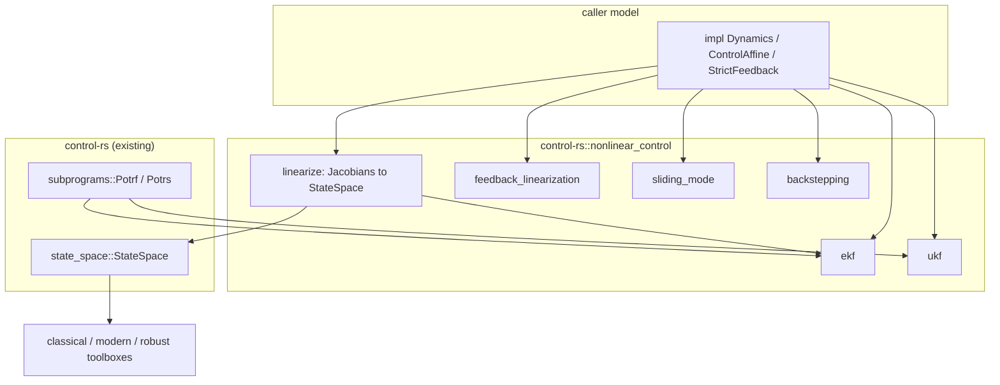

# Nonlinear Control Toolbox (nonlinear-control)


---

### 1. Introduction

The `nonlinear_control` module of `control-rs` provides synthesis and
estimation for nonlinear plants: linearization to `StateSpace` at an
operating point, input-output feedback linearization, sliding mode control,
integrator backstepping, and extended and unscented Kalman filters. It
performs no linear analysis of its own: linearization hands a `StateSpace`
to the classical, modern and robust toolboxes. The module replaces the stub
`src/nonlinear_tools`.

Primary usage scenarios:

- **Local analysis**: A user linearizes a nonlinear model at a trim point and
  analyzes or designs on the resulting `StateSpace`. Failure is a Jacobian
  error larger than the finite-difference bound.
- **Nonlinear tracking**: A user runs feedback linearization, sliding mode
  or backstepping in a control loop. Failure is a control law that divides
  by a vanishing term without reporting it, or tracking error outside the
  law's stated bound.
- **State estimation**: Firmware runs an EKF or UKF each sample. Failure is a
  covariance that loses symmetry or positive definiteness, an allocation, or
  a step whose cost varies with the data.

---

### 2. Requirements

#### 2.1 Functional Requirements

- **FR-1 — Operating-point linearization**: Given a continuous model
  $\dot{x} = f(x, u)$, $y = h(x, u)$ or a discrete model
  $x_{k+1} = f(x_k, u_k)$, and an operating point $(x_0, u_0)$, returns the
  `StateSpace` $(A, B, C, D)$ of Jacobians, from caller-supplied Jacobians
  when present and central differences otherwise.
- **FR-2 — Input-output feedback linearization**: For a single-input,
  single-output control-affine model $\dot{x} = f(x) + g(x)u$, $y = h(x)$ of
  relative degree $p$, computes
  $u = (-L_f^p h(x) + v) / (L_g L_f^{p-1} h(x))$ with
  $v = y_r^{(p)} - \sum_{i=0}^{p-1} k_i (y^{(i)} - y_r^{(i)})$, or an error when
  $|L_g L_f^{p-1} h(x)|$ is below a caller threshold.
- **FR-3 — Sliding mode control**: For a single-input model with sliding
  variable $s = \sum_{i=0}^{n-1} \lambda_i e^{(i)}$, computes
  $u = \hat{u}_{eq}(x) - K \operatorname{sat}(s / \Phi)$ with caller gain $K$
  and boundary-layer width $\Phi > 0$.
- **FR-4 — Integrator backstepping**: For a strict-feedback model
  $\dot{x}_1 = f_1(x_1) + g_1(x_1) x_2$, $\dot{x}_2 = f_2(x) + g_2(x) u$ with a
  caller-supplied stabilizing virtual control $\phi(x_1)$, its gradient and
  the gradient of its Lyapunov function $V_1$, computes the backstepping
  control $u$.
- **FR-5 — Extended Kalman filter**: Performs the discrete predict and update
  steps for $x_{k+1} = f(x_k, u_k) + w_k$, $y_k = h(x_k) + v_k$ with
  covariances $Q$, $R$, using Jacobians per FR-1 and the Joseph-form
  covariance update.
- **FR-6 — Unscented Kalman filter**: Performs the discrete predict and
  update steps for the same model with the scaled unscented transform on
  $2n + 1$ sigma points and parameters $(\alpha, \beta, \kappa)$.

#### 2.2 Non-Functional Requirements

- **NFR-1 — Fixed step cost**: Each control-law evaluation and each filter
  step performs a number of operations fixed by $(n, m, p)$ and the number
  of model calls; no loop depends on data.
- **NFR-2 — No allocation**: All state, covariance and sigma-point storage is
  const-sized; no routine allocates.
- **NFR-3 — Covariance validity**: Filter covariances remain symmetric after
  every step, and a non-positive-definite covariance is reported, not used.

#### 2.3 Constraints

- **C-1 — Analysis through `StateSpace`**: Linear analysis of a nonlinear
  model goes through FR-1 and the linear toolboxes; this module adds no
  separate stability or frequency analysis.
- **C-2 — Model traits**: Models are caller types implementing this
  module's traits; no symbolic differentiation and no code generation.
- **C-3 — Real floating-point scalars**: `T: Float` (`f32`, `f64`).
- **C-4 — Root-crate module**: Ships as `src/nonlinear_control` of
  `control-rs` (the stub `src/nonlinear_tools` renamed) and adds no
  dependency.
- **C-5 — Error convention**: Conforms to `error-design.md` NFR-1.
- **C-6 — Excluded scope**: Multi-input feedback linearization,
  continuous-time (Kalman-Bucy) filters, particle filters, smoothers, model
  predictive control and global stability certification are out of scope.

---

### 3. Technical Overview

`src/nonlinear_control` sits beside `classical_control`, `modern_control`
and `robust_control`. Caller models implement small traits; the module
supplies linearization, three control laws and two filters over them.
python-control's `linearize` returns the linearization of an I/O system at
a state and input as a `StateSpace` object [1]; FR-1 has the same contract,
which keeps analysis in the linear toolboxes (C-1).



---

### 4. Architecture

#### 4.1 Module Layout and Model Traits

```text
src/nonlinear_control/
├── mod.rs                    # NonlinearError; model traits; re-exports
├── linearize.rs              # linearize, jacobian
├── feedback_linearization.rs # IoLinearization
├── sliding_mode.rs           # SlidingMode
├── backstepping.rs           # IntegratorBackstepping
├── ekf.rs                    # Ekf
├── ukf.rs                    # Ukf, SigmaParams
└── tests/
```

| Trait | Methods | Used by |
|:--|:--|:--|
| `Dynamics<T, NX, NU, NY>` | `f(x, u)`, `h(x, u)`; optional `df_dx`, `df_du`, `dh_dx`, `dh_du` returning `Option` | FR-1, FR-5, FR-6 |
| `ControlAffine<T, NX>` | `lf_h(x, k)` for $L_f^k h$, `lg_lf_h(x)` for $L_g L_f^{p-1} h$, `relative_degree()` | FR-2 |
| `StrictFeedback<T, N1>` | `f1`, `g1`, `f2`, `g2`, `phi`, `dphi_dx1`, `dv1_dx1` | FR-4 |

The caller supplies Lie derivatives and gradients (C-2); the module checks
their shapes through const generics only.

#### 4.2 Linearization

With caller Jacobians, $A = \partial f/\partial x$, $B = \partial f/\partial u$,
$C = \partial h/\partial x$, $D = \partial h/\partial u$ at $(x_0, u_0)$ are
copied into a `StateSpace` [1]. Without them, each column is the central
difference $(f(x_0 + h_j e_j) - f(x_0 - h_j e_j)) / (2h_j)$ with
$h_j = \varepsilon^{1/3} \max(|x_{0,j}|, 1)$. Shrinking $h$ reduces
truncation error and raises rounding error, so all finite-difference
formulas are ill-conditioned [2]; the cube-root scaling is the crate's
choice for the central formula and is checked against analytic Jacobians
in §6. The result is continuous or discrete to match the model, so
`StateSpace` discretization and every linear toolbox apply unchanged.

#### 4.3 Feedback Linearization

For $\dot{x} = f(x) + g(x)u$ [3], the relative degree $p$ is the number of
integrators between input and output [3], and
$u = (-L_f^p h + v)/(L_g L_f^{p-1} h)$ yields $y^{(p)} = v$. The outer law
places the error dynamics by the caller's gains $k_i$. When
$|L_g L_f^{p-1} h(x)|$ falls below the caller threshold the law returns
`NonlinearError::SingularDecoupling` instead of dividing. The remaining
$n - p$ states form the zero dynamics [3]; a non-minimum-phase system should
not be input-output linearized [3], and the module cannot check this from
the trait, so the precondition is stated in the API documentation and in
§6.3.

#### 4.4 Sliding Mode

$s$ is a caller-weighted sum of tracking-error derivatives. A switching law
chatters [4]; replacing the sign function by a saturation inside a boundary
layer of width $\Phi$ removes the chattering but leaves a bounded
steady-state tracking error [4]. FR-3 therefore uses $\operatorname{sat}$
only, with $\Phi > 0$ enforced, and the acceptance test checks
$|s| \le \Phi$ after the reaching phase, not $s = 0$.

#### 4.5 Integrator Backstepping

Backstepping steps back from $x_1$ to $u$ for strict-feedback systems [3].
With virtual control $\phi(x_1)$ stabilizing the $x_1$ subsystem under
Lyapunov function $V_1$, define $z = x_2 - \phi(x_1)$ and

$$u = \frac{1}{g_2(x)} \left[ \frac{\partial \phi}{\partial x_1} \left( f_1 + g_1 x_2 \right) - \frac{\partial V_1}{\partial x_1} g_1 - k z - f_2 \right],$$

with $k > 0$, which makes $V = V_1 + z^2/2$ decrease. A vanishing $g_2$
returns `SingularDecoupling`. Only the two-block form is provided;
deeper chains compose by nesting the caller's `phi`.

#### 4.6 Extended Kalman Filter

`Ekf<T, NX, NU, NY>` stores $\hat{x}$ and $P$. Predict propagates
$\hat{x} \leftarrow f(\hat{x}, u)$ and $P \leftarrow F P F^T + Q$ with
$F = \partial f / \partial x$ from §4.2. Update forms
$S = H P H^T + R$, solves $K = P H^T S^{-1}$ by Cholesky (`Potrf`, `Potrs`),
and updates $P$ in Joseph form $(I - KH) P (I - KH)^T + K R K^T$, which
FilterPy uses because it is more stable numerically and holds for a
non-optimal $K$ [5]. Like FilterPy, the filter does not choose initial
$\hat{x}$, $P$, $Q$ or $R$ for the caller [6]. $P$ is symmetrized after each
step (NFR-3).

#### 4.7 Unscented Kalman Filter

`Ukf<T, NX, NU, NY>` uses the scaled unscented transform of Julier in the
Wan and van der Merwe formulation, as FilterPy does [7]. With
$\lambda = \alpha^2 (n + \kappa) - n$, the $2n + 1$ sigma points are
$\hat{x}$ and $\hat{x} \pm$ the columns of the Cholesky factor of
$(n + \lambda) P$; mean weights are $\lambda/(n + \lambda)$ and
$1/(2(n + \lambda))$, and the first covariance weight adds
$1 - \alpha^2 + \beta$. Defaults follow the reference: $\alpha$ a small
positive value, $\beta = 2$ for Gaussian priors and $\kappa = 0$ or $3 - n$
[7]. The EKF achieves only first-order accuracy [8]; the UKF avoids the
Jacobian at the cost of $2n + 1$ model evaluations per step. A failed Cholesky factorization returns
`NonlinearError::LinAlg(NotPositiveDefinite)` and leaves the state
unchanged (NFR-3).

#### 4.8 Error Handling

```rust
#[derive(Debug, Clone, Copy, PartialEq, Eq)]
pub enum NonlinearError {
    /// A kernel failed: NotPositiveDefinite (P, S), SingularMatrix.
    LinAlg(LinAlgError),
    /// L_g L_f^{p-1} h or g_2 is below the caller threshold (FR-2, FR-4).
    SingularDecoupling,
    /// Boundary-layer width or a gain is non-positive (FR-3, FR-4).
    InvalidParameter,
    /// A model call returned a non-finite value (FR-1, FR-5, FR-6).
    NonFiniteModel,
}
```

The enum has a hand-written `Display`, `impl core::error::Error` and
`From<LinAlgError>` (C-5).

---

### 5. Alternatives

| Alternative | Rejected Because | Reference |
|:--|:--|:--|
| Forward-difference Jacobians | Half the model calls of central differences but a larger truncation error at the same rounding error [2]; the central formula is kept and caller Jacobians take precedence. | [2] |
| Automatic or symbolic differentiation | Needs a dual-number or symbolic layer over caller models; violates C-2 for v1. | — |
| Discontinuous (sign) sliding law | Causes chattering [4]; FR-3 uses the boundary-layer saturation and accepts a bounded error [4]. | [4] |
| Standard covariance update $P = (I - KH)P$ | Less stable numerically and invalid for a non-optimal gain [5]. | [5] |
| EKF only | First-order accuracy [8]; the UKF is kept for strongly nonlinear models at $2n+1$ model calls. | [8] |
| Separate nonlinear stability analysis | Duplicates the linear toolboxes; C-1 routes local analysis through `StateSpace` as `linearize` does [1]. | [1] |

---

### 6. Verification & Validation

#### 6.1 Verification

| Condition | Requirement | Method | Target | Criterion |
|:--|:--|:--|:--|:--|
| VC-1.1 | FR-1 | `libtest` | `control_rs::nonlinear_control::linearize::tests::pendulum_analytic_jacobian` | The finite-difference linearization of a pendulum and a cart-pole matches the analytic Jacobians within §6.2; FR-1 holds iff all conditions hold |
| VC-1.2 | FR-1 | `libtest` | `control_rs::nonlinear_control::linearize::tests::caller_jacobian_preferred` | When the model supplies Jacobians, `f` is evaluated zero extra times and the result equals them exactly |
| VC-1.3 | FR-1 | `libtest` | `control_rs::nonlinear_control::linearize::tests::linear_model_exact` | Linearizing a linear model returns its matrices within §6.2 |
| VC-2.1 | FR-2 | `libtest` | `control_rs::nonlinear_control::feedback_linearization::tests::output_tracks_reference` | Simulating a relative-degree-2 minimum-phase model under the law tracks a sinusoid with error below $10^{-6}$ after 5 time constants; FR-2 holds iff all conditions hold |
| VC-2.2 | FR-2 | `libtest` | `control_rs::nonlinear_control::feedback_linearization::tests::singular_decoupling` | A state with $L_g L_f^{p-1} h = 0$ returns `SingularDecoupling` |
| VC-3.1 | FR-3 | `libtest` | `control_rs::nonlinear_control::sliding_mode::tests::boundary_layer_reached` | With a bounded matched disturbance, $|s| \le \Phi$ holds after the reaching time; FR-3 holds iff all conditions hold |
| VC-3.2 | FR-3 | `libtest` | `control_rs::nonlinear_control::sliding_mode::tests::invalid_width` | $\Phi \le 0$ returns `InvalidParameter` |
| VC-4.1 | FR-4 | `libtest` | `control_rs::nonlinear_control::backstepping::tests::lyapunov_decreases` | Along a simulated trajectory, $V = V_1 + z^2/2$ is non-increasing at every step; FR-4 holds iff all conditions hold |
| VC-5.1 | FR-5 | `libtest` | `control_rs::nonlinear_control::ekf::tests::linear_model_equals_kf` | On a linear model, EKF estimates equal a linear Kalman filter's within §6.2; FR-5 holds iff all conditions hold |
| VC-5.2 | FR-5 | `libtest` | `control_rs::nonlinear_control::ekf::tests::nees_consistent` | On a nonlinear range-bearing model over 100 Monte Carlo runs, the average NEES lies in its 95% chi-square interval |
| VC-6.1 | FR-6 | `libtest` | `control_rs::nonlinear_control::ukf::tests::unscented_transform_exact_for_quadratic` | The transformed mean of a quadratic map of a Gaussian equals the closed form within §6.2; FR-6 holds iff all conditions hold |
| VC-6.2 | FR-6 | `libtest` | `control_rs::nonlinear_control::ukf::tests::cross_check_filterpy` | A 4-state run matches the cross-check tolerance |
| VC-7.1 | NFR-1 | `analysis` | — | Every loop is bounded by $(n, m, p)$ or the sigma-point count |
| VC-8.1 | NFR-2 | `inspection` | — | No routine allocates; all storage is const-sized |
| VC-9.1 | NFR-3 | `libtest` | `control_rs::nonlinear_control::ukf::tests::non_pd_covariance_reported` | An indefinite $P$ returns `NotPositiveDefinite` and leaves the state unchanged, and $P = P^T$ exactly after every successful step |
| VC-10.1 | C-1 | `review` | — | The module exposes no stability, margin or frequency routine |
| VC-11.1 | C-2 | `review` | — | Models enter only through the module's traits |
| VC-12.1 | C-3 | `libtest` | `control_rs::nonlinear_control::ekf::tests::f32_runs` | The EKF test model runs with `f32` and keeps $P$ positive definite |
| VC-13.1 | C-4 | `inspection` | — | The change adds no entry to `[dependencies]` in the root `Cargo.toml` |
| VC-14.1 | C-5 | `inspection` | — | `NonlinearError` derives the `error-design.md` NFR-1 traits and has hand-written `Display` |
| VC-15.1 | C-6 | `review` | — | The public API exposes no excluded item |

Coverage: 90% line coverage of `src/nonlinear_control`, measured with
`cargo coverage`. Excluded: none.

#### 6.2 Acceptance

| Claim | Oracle | Measure | Bound |
|:--|:--|:--|:--|
| Finite-difference Jacobian (FR-1) | Closed-form Jacobian | Relative error per column | $\le 10\, u^{2/3}$ times the column's third-derivative scale |
| Linear-model linearization (FR-1) | Closed form | Relative error | $\le 10\, u^{2/3}$ |
| EKF on a linear model (FR-5) | Metamorphic: linear Kalman filter | Relative error of $\hat{x}$ and $P$ | $\le 10^2 n u$ |
| UKF transform of a quadratic (FR-6) | Closed form | Relative error of mean | $\le 10^2 n u$ |
| UKF run (FR-6) | Independent reference implementation (`cross-check`) | Relative error of $\hat{x}$, $P$ | Tolerance entries `nonlinear-control/<case>/<signal>` |

$u$ is the unit roundoff of `T`. The $u^{2/3}$ bounds follow from balancing
the central formula's truncation and rounding errors at
$h \propto u^{1/3}$ [2].

#### 6.3 Limits

- Zero-dynamics stability (FR-2) is a caller precondition the module cannot
  check.
- Filter consistency is shown statistically on two models, not proved.
- Tracking claims are verified in host simulation, not on target hardware.

---

### 7. Performance & Resource Considerations

**Allocation.** State, covariance and Jacobian storage is const-sized. The
UKF holds $(2n + 1)$ propagated sigma points of size $n$ and $p$ (NFR-2).

**Execution time.** Central-difference linearization costs $2(n + m)$ model
calls. An EKF step costs one $f$ call, one $h$ call, Jacobians, and
$O(n^3 + p^3)$ arithmetic; a UKF step costs $2n + 1$ calls of $f$ and of $h$
and $O(n^3)$ arithmetic. All counts are fixed (NFR-1).

**Numeric types.** `f32` and `f64` (C-3). On `f32` the Joseph form and
symmetrization preserve positive definiteness in the tested cases.

---

### 8. Risks & Open Questions

- **Square-root UKF (FR-6).** A square-root form keeps the covariance
  factor positive definite by construction; it is not in the evidence base
  and is not specified.
- **Jacobian step (FR-1).** The cube-root step is a crate choice backed only
  by a secondary source [2]; review it against a primary reference.
- **MIMO feedback linearization.** Excluded by C-6; the decoupling-matrix
  form needs its own evidence.
- **Index.** `documentation/README.md` has no control-toolboxes table.

---

### 9. Development Plan

| Phase | Delivers | Requirements | Effort | Status |
|:--|:--|:--|:--|:--|
| 1. Module and linearization | `src/nonlinear_control` (stub renamed), traits, `NonlinearError`, `linearize` | FR-1, C-1, C-2, C-3, C-4, C-5 | 3 days | Planned |
| 2. Estimators | `Ekf`, `Ukf`, cross-check tolerances | FR-5, FR-6, NFR-2, NFR-3 | 5 days | Planned |
| 3. Control laws | feedback linearization, sliding mode, backstepping | FR-2, FR-3, FR-4, NFR-1, C-6 | 4 days | Planned |

---

### 10. Revision History

| Revision | Date | Author | Description |
|:--|:--|:--|:--|
| 1.0 | October 4, 2026 | @MitchellDScott | Initial design document: FR-1 to FR-6, NFR-1 to NFR-3, C-1 to C-6. |

---

## References

[1] Python Control Systems Library, *control.linearize* (Version 0.10.2).
[Online]. Available:
https://python-control.readthedocs.io/en/latest/generated/control.linearize.html.
Accessed: Oct. 4, 2026.

[2] Wikipedia contributors, "Numerical differentiation," *Wikipedia*.
[Online]. Available: https://en.wikipedia.org/wiki/Numerical_differentiation.
Accessed: Oct. 4, 2026.

[3] KTH Royal Institute of Technology, "EL2620 Nonlinear Control, Lecture
10," *Course lecture slides*. [Online]. Available:
https://kth.se/social/upload/4fd0a827f276547ebf000002/lec10.pdf. Accessed:
Oct. 4, 2026.

[4] W. M. Bessa, "A remark on the boundedness and convergence properties of
smooth sliding mode controllers," arXiv, Rep. no. arXiv:0802.2978, 2008.

[5] R. R. Labbe, "filterpy/kalman/kalman_filter.py," in *rlabbe/filterpy*.
[Online]. Available:
https://github.com/rlabbe/filterpy/blob/master/filterpy/kalman/kalman_filter.py.
Accessed: Oct. 4, 2026.

[6] R. R. Labbe, "ExtendedKalmanFilter," *FilterPy documentation*. [Online].
Available: https://filterpy.readthedocs.io/en/latest/kalman/ExtendedKalmanFilter.html.
Accessed: Oct. 4, 2026.

[7] R. R. Labbe, "UnscentedKalmanFilter," *FilterPy documentation*.
[Online]. Available:
https://filterpy.readthedocs.io/en/latest/kalman/UnscentedKalmanFilter.html.
Accessed: Oct. 4, 2026.

[8] E. A. Wan and R. van der Merwe, "The unscented Kalman filter for
nonlinear estimation," in *Proc. IEEE 2000 Adaptive Systems for Signal
Processing, Communications, and Control Symp.*, Lake Louise, AB, Canada,
2000, pp. 153–158.
