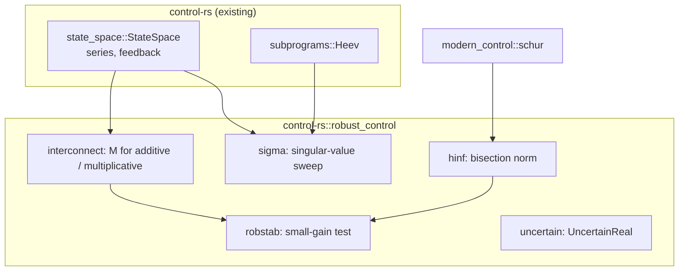

# Robust Control Analysis Toolbox (robust-control)


---

### 1. Introduction

The `robust_control` module of `control-rs` provides robustness analysis for
a nominal LTI loop with one unstructured, norm-bounded uncertainty block:
the $M\Delta$ interconnection for additive and multiplicative uncertainty,
the small-gain robust-stability test, the $H_\infty$ norm with guaranteed
accuracy, singular-value frequency data, and a parametric uncertain real
value. It analyzes; it does not synthesize controllers. The module replaces
the stub `src/robust_tools`.

Primary usage scenarios:

- **Robust-stability check**: A user tests whether a controller keeps a
  plant with weighted multiplicative uncertainty stable. Failure is a
  "robust" verdict for a loop that a perturbation inside the bound
  destabilizes, or the reverse.
- **Norm computation**: A user computes $\lVert G \rVert_\infty$ of a stable
  system to a stated tolerance. Failure is a value outside the tolerance or
  a loop that does not terminate.
- **Frequency data**: A user sweeps $\bar{\sigma}(G(j\omega))$ to see where
  the robustness margin is smallest. Failure is a singular value that
  differs from the matrix 2-norm at that frequency.
- **Uncertain parameters**: A user records a physical parameter as a
  nominal value with bounds and evaluates the plant at its extremes.
  Failure is a value outside its declared bounds.

---

### 2. Requirements

#### 2.1 Functional Requirements

- **FR-1 — Single-block interconnection**: Given a nominal plant $P_0$, a
  controller $K$ and a weight $W$ as `StateSpace` models, forms the
  interconnection $M$ seen by an unstructured block $\Delta$ with
  $\lVert \Delta \rVert_\infty \le 1$, for additive and output
  multiplicative uncertainty.
- **FR-2 — Small-gain robust stability**: Given a stable $M$, returns
  whether $\lVert M \rVert_\infty < 1$ and the robustness margin
  $1 / \lVert M \rVert_\infty$; given an unstable $M$, returns an error.
- **FR-3 — $H_\infty$ norm**: Given a stable continuous `StateSpace`,
  returns $\lVert G \rVert_\infty$ within a caller relative tolerance, and
  the frequency at which it is attained.
- **FR-4 — Singular-value response**: Given a `StateSpace` and a
  caller-supplied frequency set, returns
  $\bar{\sigma}(G(j\omega_i))$ at each frequency.
- **FR-5 — Uncertain real value**: Represents a real parameter as a nominal
  value with lower and upper deviation bounds, and returns its nominal
  value, its bounds, and the value at a normalized coordinate
  $\delta \in [-1, 1]$.

#### 2.2 Non-Functional Requirements

- **NFR-1 — Bounded iteration**: The $H_\infty$ bisection runs at most a
  fixed number of iterations; exhausting it returns an error with the
  current bracket.
- **NFR-2 — Externally checkable output**: Every routine's output can be
  compared against an independent reference implementation.

#### 2.3 Constraints

- **C-1 — Analysis only**: Controller synthesis ($H_\infty$, $\mu$,
  DK-iteration) is excluded.
- **C-2 — No structured $\mu$**: Block-diagonal uncertainty and
  structured-singular-value bounds are excluded.
- **C-3 — Root-crate module**: Ships as `src/robust_control` of
  `control-rs` (the stub `src/robust_tools` renamed) and adds no dependency.
- **C-4 — Modern-control dependency**: Uses the ordered real Schur layer of
  `modern-control-design.md` (§4.2) for Hamiltonian eigenvalues and the
  existing `Heev` kernel (`subprograms-design.md` FR-8) for singular
  values.
- **C-5 — Error convention**: Conforms to `error-design.md` NFR-1.

---

### 3. Technical Overview

`src/robust_control` sits beside `classical_control`, `modern_control` and
`nonlinear_control`. It builds $M$ from `StateSpace` interconnections, tests
$\lVert M \rVert_\infty < 1$ with the small-gain theorem [1], and computes
the norm by Hamiltonian bisection [2].



The $M\Delta$ framework and parametric uncertainty are the two modeling
routes RobustAndOptimalControl.jl provides [3]; its analysis for the
framework remains limited and its structured singular value handles
diagonal complex perturbations only [4]. This design takes the single
full-block case, where the small-gain theorem is necessary and sufficient
[1], and leaves structured $\mu$ out (C-2).

---

### 4. Architecture

#### 4.1 Module Layout

```text
src/robust_control/
├── mod.rs          # RobustError; re-exports
├── interconnect.rs # additive, output_multiplicative
├── hinf.rs         # hinf_norm
├── sigma.rs        # sigma_max_response
├── robstab.rs      # robust_stability
├── uncertain.rs    # UncertainReal<T>
└── tests/
```

`src/lib.rs` declares `pub mod robust_control;` in place of
`pub mod robust_tools;`.

#### 4.2 Interconnection

For output multiplicative uncertainty $P = (I + W\Delta) P_0$ under feedback
$K$, the block sees $M = -(I + P_0 K)^{-1} P_0 K W$, the weighted
complementary sensitivity [1]. For additive uncertainty $P = P_0 + W\Delta$,
$M = -K (I + P_0 K)^{-1} W$. Both are built from `StateSpace::series` and
`StateSpace::feedback`; the result is a `StateSpace` whose state dimension
is the sum of the three, bounded by `state-space-design.md` C-2.

#### 4.3 Small-Gain Test

If $M$ is stable, the loop is stable for every $\Delta$ with
$\lVert \Delta \rVert_\infty \le 1$ if and only if
$\lVert M \rVert_\infty < 1$ [1]. `robust_stability` first checks that
$M$ is stable from the eigenvalues of its $A$ (via `modern_control::schur`),
returns `RobustError::UnstableNominal` otherwise, then computes
$\lVert M \rVert_\infty$ (§4.4) and returns the verdict and the margin
$1/\lVert M \rVert_\infty$. A norm within the tolerance band around 1
returns `Inconclusive` rather than a verdict.

#### 4.4 $H_\infty$ Norm by Bisection

Bisection on $\gamma$ computes the norm with guaranteed accuracy and needs no
frequency search [2]. For $G = (A, B, C, D)$ with $A$ Hurwitz and
$\gamma > \bar{\sigma}(D)$, $\lVert G \rVert_\infty \ge \gamma$ if and only
if the Hamiltonian

$$H(\gamma) = \begin{bmatrix} A + B R^{-1} D^T C & B R^{-1} B^T \\ -C^T (I + D R^{-1} D^T) C & -(A + B R^{-1} D^T C)^T \end{bmatrix}, \quad R = \gamma^2 I - D^T D,$$

has an eigenvalue on the imaginary axis. Each step forms $H(\gamma)$,
computes its eigenvalues with the Schur layer (C-4), and halves the bracket
$[\gamma_l, \gamma_u]$ until $\gamma_u - \gamma_l \le \text{tol} \cdot
\gamma_l$. The initial lower bound is the largest of $\bar{\sigma}(D)$ and
$\bar{\sigma}(G(j\omega))$ at $\omega = 0$ and at the imaginary part of the
poles; the upper bound doubles from it until the test fails. An eigenvalue
counts as imaginary when its real part is below a tolerance scaled by
$\lVert H \rVert$. SLICOT's AB13DD bounds its iteration count at 30 [5];
NFR-1 takes the same form, with the count derived from the tolerance.

#### 4.5 Singular-Value Response

At each frequency, form $G(j\omega) = C (j\omega I - A)^{-1} B + D$ with a
complex LU solve, then $\bar{\sigma} = \sqrt{\lambda_{max}(G^H G)}$ from the
Hermitian eigensolver `Heev`. This is the frequency-search lower bound that
bisection improves on [2]; it serves plotting and initial brackets.

#### 4.6 Uncertain Real Values

`UncertainReal<T>` holds a nominal value $x_0$ and deviations
$d_l, d_u \ge 0$, with value
$x(\delta) = x_0 + \delta d_u$ for $\delta \ge 0$ and
$x_0 + \delta d_l$ for $\delta < 0$. It is a plain value type with no
propagation algebra. RobustAndOptimalControl.jl represents the same
nominal-plus-deviation parameter by samples [3]; this design keeps the
interval and lets the caller evaluate a plant at chosen $\delta$ values.

#### 4.7 Error Handling

```rust
#[derive(Debug, Clone, Copy, PartialEq, Eq)]
pub enum RobustError {
    /// A kernel failed (Schur budget, Heev budget, singular LU).
    LinAlg(LinAlgError),
    /// The interconnection or system is not stable (FR-2, FR-3).
    UnstableNominal,
    /// Bisection exhausted its budget (NFR-1); `hinf_norm` returns the
    /// last bracket alongside this error.
    NotConverged,
    /// The norm lies within the tolerance band around 1 (FR-2).
    Inconclusive,
    /// A deviation bound is negative (FR-5).
    InvalidBounds,
}
```

The enum has a hand-written `Display`, `impl core::error::Error` and
`From<LinAlgError>` (C-5).

---

### 5. Alternatives

| Alternative | Rejected Because | Reference |
|:--|:--|:--|
| Frequency search for $\lVert G \rVert_\infty$ | Gives only a lower bound and costs more than bisection for the same accuracy [2]. Kept as FR-4 data. | [2] |
| Quadratically convergent two-step method (Bruinsma and Steinbuch) | The method AB13DD implements [5]; it needs the same Schur layer and is a faster replacement for §4.4 once v1 is verified. | [5] |
| Structured $\mu$ bounds | Bounds rather than exact values, and reference implementations cover only diagonal complex blocks [4]; violates C-2. | [4] |
| LMI-based analysis with a Rust conic solver | Clarabel.rs solves SDPs in Rust [6], but it is an interior-point solver with its own dependency tree; violates C-3. | [6] |
| Sampled parametric uncertainty | Samples represent the parameter in the reference toolbox [3], but a sample set has no fixed bound on its count for embedded use; the interval form is kept. | [3] |

---

### 6. Verification & Validation

#### 6.1 Verification

| Condition | Requirement | Method | Target | Criterion |
|:--|:--|:--|:--|:--|
| VC-1.1 | FR-1 | `libtest` | `control_rs::robust_control::interconnect::tests::multiplicative_matches_formula` | $M(j\omega)$ equals $-(I + P_0K)^{-1}P_0KW$ evaluated directly at 10 frequencies within §6.2; FR-1 holds iff all conditions hold |
| VC-1.2 | FR-1 | `libtest` | `control_rs::robust_control::interconnect::tests::additive_matches_formula` | $M(j\omega)$ equals $-K(I + P_0K)^{-1}W$ at 10 frequencies within §6.2 |
| VC-2.1 | FR-2 | `libtest` | `control_rs::robust_control::robstab::tests::small_gain_verdicts` | Loops with $\lVert M \rVert_\infty$ of 0.5 and 2 return robust and not robust; FR-2 holds iff all conditions hold |
| VC-2.2 | FR-2 | `libtest` | `control_rs::robust_control::robstab::tests::destabilizing_delta_exists` | For the non-robust loop, the constant $\Delta$ built at the peak frequency destabilizes the closed loop |
| VC-2.3 | FR-2 | `libtest` | `control_rs::robust_control::robstab::tests::unstable_nominal` | An unstable $M$ returns `UnstableNominal` |
| VC-3.1 | FR-3 | `libtest` | `control_rs::robust_control::hinf::tests::first_second_order_closed_form` | Norms of first-order and lightly damped second-order systems meet §6.2; FR-3 holds iff all conditions hold |
| VC-3.2 | FR-3 | `libtest` | `control_rs::robust_control::hinf::tests::mimo_cross_check` | A 4-state, 2-input, 2-output system matches the cross-check tolerance |
| VC-4.1 | FR-4 | `libtest` | `control_rs::robust_control::sigma::tests::sigma_equals_two_norm` | $\bar{\sigma}$ equals the matrix 2-norm of $G(j\omega)$ computed independently within §6.2; FR-4 holds iff all conditions hold |
| VC-5.1 | FR-5 | `libtest` | `control_rs::robust_control::uncertain::tests::bounds_and_coordinates` | $x(-1)$, $x(0)$ and $x(1)$ equal $x_0 - d_l$, $x_0$ and $x_0 + d_u$ exactly and negative deviations return `InvalidBounds`; FR-5 holds iff all conditions hold |
| VC-6.1 | NFR-1 | `libtest` | `control_rs::robust_control::hinf::tests::budget_exhausted` | A one-iteration budget returns `NotConverged` |
| VC-7.1 | NFR-2 | `review` | — | Every FR has a cross-check or closed-form oracle in §6.2 |
| VC-8.1 | C-1 | `review` | — | The public API exposes no synthesis routine |
| VC-9.1 | C-2 | `review` | — | No type represents block-diagonal uncertainty |
| VC-10.1 | C-3 | `inspection` | — | The change adds no entry to `[dependencies]` in the root `Cargo.toml` |
| VC-11.1 | C-4 | `inspection` | — | Hamiltonian eigenvalues come from `modern_control::schur` and singular values from `Heev` |
| VC-12.1 | C-5 | `inspection` | — | `RobustError` derives the `error-design.md` NFR-1 traits and has hand-written `Display` |

Coverage: 90% line coverage of `src/robust_control`, measured with
`cargo coverage`. Excluded: none.

#### 6.2 Acceptance

| Claim | Oracle | Measure | Bound |
|:--|:--|:--|:--|
| $H_\infty$ norm (FR-3) | Closed form: $1/(\tau s + 1)$ has norm 1; $\omega_n^2/(s^2 + 2\zeta\omega_n s + \omega_n^2)$ has norm $1/(2\zeta\sqrt{1-\zeta^2})$ for $\zeta < 1/\sqrt{2}$ | Relative error | $\le$ caller tolerance $+ 10 N u$ |
| $H_\infty$ norm, MIMO (FR-3) | Independent reference implementation (`cross-check`) | Relative error | Tolerance entry `robust-control/<case>/hinf` |
| Interconnection (FR-1) | Direct evaluation of the closed-form $M(j\omega)$ | Relative error, Frobenius norm | $\le 10^2 N u \kappa(I + P_0K)$ |
| Singular values (FR-4) | Independent 2-norm of the evaluated matrix | Relative error | $\le 10 N u$ |
| Uncertain real (FR-5) | Closed form | Exact equality | Equal |

$u$ is the unit roundoff of `T` and $N$ the state dimension. The bisection
bound follows from its guaranteed bracket [2].

#### 6.3 Limits

- Discrete-time norms are not covered (§8).
- The imaginary-axis eigenvalue test uses a tolerance; systems with poles
  near the axis are checked only through the cross-check cases.
- On-target execution through ETS suites is not exercised.

---

### 7. Performance & Resource Considerations

**Allocation.** All workspaces are const-sized stack arrays; the
Hamiltonian is $2N \times 2N$ and its Schur vectors are not needed, so one
$2N \times 2N$ array and one eigenvalue array suffice per iteration.

**Execution time.** Each bisection step is one $O((2N)^3)$ Schur reduction;
the step count is $\lceil \log_2(\gamma_u/\gamma_l / \text{tol}) \rceil$,
fixed by the tolerance (NFR-1). A singular-value sweep of $M$ points costs
$M$ complex LU solves and $M$ Hermitian eigensolves.

**Numeric types.** `T: Float` (`f32`, `f64`); the norm is a design-time
quantity and `f64` is the default.

---

### 8. Risks & Open Questions

- **Dependency order (C-4).** This module needs `modern_control::schur`,
  which needs the new `subprograms` kernels; robust work cannot start before
  those land.
- **Discrete-time norm (FR-3).** AB13DD covers discrete systems [5]; the
  discrete Hamiltonian (symplectic) test is not in the evidence base.
- **Imaginary-axis tolerance (§4.4).** No cited rule sets the tolerance on
  the real part; a wrong choice flips a bisection step.
- **Index.** `documentation/README.md` has no control-toolboxes table.

---

### 9. Development Plan

| Phase | Delivers | Requirements | Effort | Status |
|:--|:--|:--|:--|:--|
| 1. Module and values | `src/robust_control` (stub renamed), `RobustError`, `UncertainReal`, `sigma` | FR-4, FR-5, C-2, C-3, C-5 | 2 days | Planned |
| 2. Norm | `hinf` bisection, cross-check tolerances | FR-3, NFR-1, NFR-2, C-4 | 4 days | Planned |
| 3. Robust stability | `interconnect`, `robstab` | FR-1, FR-2, C-1 | 3 days | Planned |

---

### 10. Revision History

| Revision | Date | Author | Description |
|:--|:--|:--|:--|
| 1.0 | October 4, 2026 | @MitchellDScott | Initial design document: FR-1 to FR-5, NFR-1 to NFR-2, C-1 to C-5. |

---

## References

[1] M. Dahleh, M. A. Dahleh, and G. Verghese, *Lectures on Dynamic Systems
and Control*, Ch. 20: Stability Robustness. Cambridge, MA, USA: MIT
OpenCourseWare, 2011.

[2] S. Boyd, V. Balakrishnan, and P. Kabamba, "On computing the H-infinity
norm of a transfer matrix," in *Proc. American Control Conf.*, 1988.

[3] JuliaControl, "Uncertainty modeling," *RobustAndOptimalControl.jl*.
[Online]. Available:
https://juliacontrol.github.io/RobustAndOptimalControl.jl/dev/uncertainty/.
Accessed: Oct. 4, 2026.

[4] JuliaControl, "RobustAndOptimalControl.jl documentation,"
*RobustAndOptimalControl.jl*. [Online]. Available:
https://juliacontrol.github.io/RobustAndOptimalControl.jl/dev/. Accessed:
Oct. 4, 2026.

[5] SLICOT, "AB13DD -- SLICOT Library Routine Documentation," in
*SLICOT-Reference*. [Online]. Available:
https://github.com/SLICOT/SLICOT-Reference/blob/main/doc/AB13DD.html.
Accessed: Oct. 4, 2026.

[6] Oxford Control Group, "Clarabel.rs README," in
*oxfordcontrol/Clarabel.rs*. [Online]. Available:
https://github.com/oxfordcontrol/Clarabel.rs. Accessed: Oct. 4, 2026.
