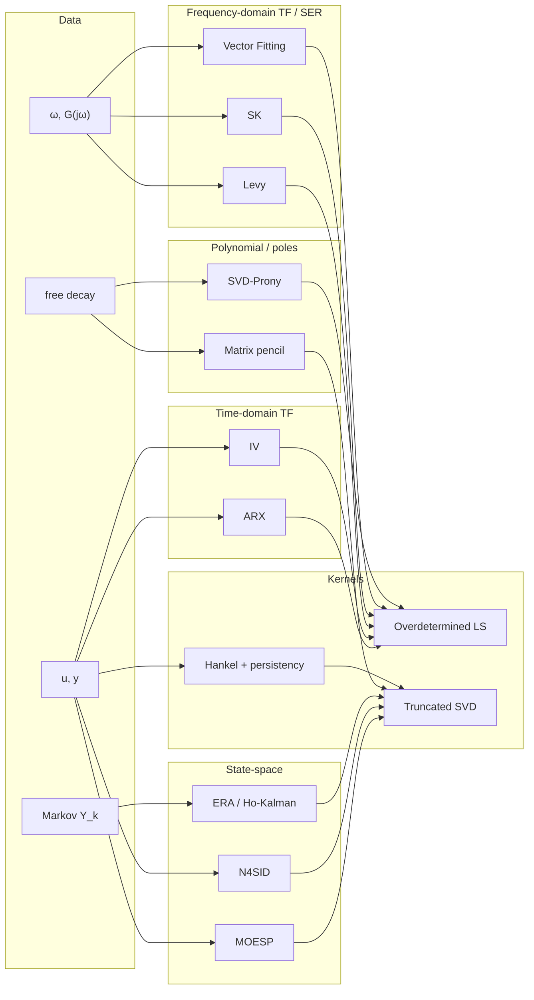

# System Identification Toolbox (`sysid`) (Design Document)


---

### 1. Introduction

`sysid` is a native `control-rs` toolbox that constructs landed numerical
models from measured records. It consumes time-series input/output pairs,
impulse or Markov sequences, frequency-response samples, or free-decay
traces and emits `TransferFunction`, `StateSpace`, `Polynomial`, `Matrix`,
or `Tensor` instances via the existing constructors
([`numerical-models-design.md`](../numerical-models/numerical-models-design.md)).
Identification is a data-based alternative to assembling those models from
known coefficients (Gilson, 2015; Ljung, 2001).

The module is bound by [`controls-tools-design.md`](./controls-tools-design.md)
constraints C-1..C-4: native on-target Rust, no host-to-target codegen, no
dynamic allocation, and no runtime symbolic dependency. Factory APIs for
this work are specified here rather than on the numerical-model types
([`numerical-models-design.md`](../numerical-models/numerical-models-design.md) §4.3).

Primary usage scenarios:

1. **Discrete rational plant from an open-loop I/O record.** A SISO
   experiment yields $G(z)=B(z)/A(z)$ for later classical-tools use
   (Ljung, 2001; Galrinho, 2016; Gilson, 2015).
2. **Continuous rational or pole-residue model from a frequency sweep.**
   Samples $\{(\omega_k,G(j\omega_k))\}$ yield $N(s)/D(s)$ or an equivalent
   state-equation realization (Levy, 1959; Sanathanan and Koerner, 1963;
   Gustavsen, 1999; Gustavsen and Semlyen, 1998).
3. **Discrete state-space realization from an impulse / Markov test.**
   Markov parameters $Y_k$ yield $(A,B,C,D)$ (Ho and Kalman, 1966; Juang
   and Pappa, 1985).
4. **MIMO state-space model from I/O without a nonlinear search.** Paired
   $(u[k],y[k])$ yield $(A,B,C,D)$ by subspace linear algebra (Verhaegen
   and Dewilde, 1992; Van Overschee and De Moor, 1994; Qin, 2006).
5. **Poles and characteristic polynomial from free decay.** A free
   response yields exponential parameters or a monic polynomial (Hua and
   Sarkar, 1990).
6. **Experiment screening.** A trajectory is laid out as a Hankel matrix
   and tested for persistency of excitation before an estimator runs
   (Markovsky and Mercère, 2016).

---

### 2. Requirements

#### 2.1. Functional Requirements

- **FR-1 — Time-domain rational models from I/O**: The toolbox obtains a
  discrete rational model from sampled $u$ and $y$. ARX is the
  linear-regression case of prediction-error estimation; instrumental
  variables cover noise-model misspecification and closed-loop records
  where linear regression remains usable (Ljung, 2001; Galrinho, 2016;
  Gilson, 2015). Full non-convex PEM over ARMAX or Box–Jenkins structures
  is not required on-target.

- **FR-2 — Frequency-response rational models**: The toolbox obtains a
  continuous rational model, or a pole-residue state-equation form, from
  complex frequency samples. Levy supplies weighted polynomial-ratio least
  squares; Sanathanan–Koerner and Vector Fitting iterate linearly
  reweighted least squares (Levy, 1959; Sanathanan and Koerner, 1963;
  Gustavsen, 1999; Gustavsen and Semlyen, 1998). AAA is not required for
  the first delivery.

- **FR-3 — State-space models from Markov sequences or I/O**: The toolbox
  obtains $(A,B,C,D)$ from Markov parameters (Ho–Kalman / ERA) or from
  input-output block data (MOESP observability class; N4SID state-sequence
  class) using QR/RQ and SVD, without a nonlinear search (Ho and Kalman,
  1966; Juang and Pappa, 1985; Verhaegen and Dewilde, 1992; Van Overschee
  and De Moor, 1994; Mercère, 2013; Qin, 2006). Closed-loop subspace
  identification is not required (Qin, 2006).

- **FR-4 — Poles from free response**: The toolbox recovers exponential
  frequencies and dampings, or an equivalent characteristic polynomial,
  from a free-response record. Matrix pencil and SVD-Prony are the
  evidenced pair (Hua and Sarkar, 1990).

- **FR-5 — Hankel layout and persistency test**: The toolbox forms a
  Hankel matrix from a trajectory and reports whether the input is
  persistently exciting of a stated order (full row rank of $H_L(u)$)
  (Markovsky and Mercère, 2016).

- **FR-6 — Emit landed model containers**: Estimators fill existing
  `continuous` / `discrete` / `from_coefficients` / `from_raw`
  constructors. They do not add identification methods onto the numerical
  model types ([`numerical-models-design.md`](../numerical-models/numerical-models-design.md)).

- **FR-7 — Rank and excitation as errors**: Rank-deficient regressors,
  singular Hankel blocks, and failed persistency tests return `Result`
  errors. They do not panic in library code.

#### 2.2. Non-Functional Requirements

- **NFR-1 — No dynamic allocation**: Estimators, scratchpads, and data
  matrices execute on statically sized storage, matching toolbox C-3 and
  the landed model backends ([`controls-tools-design.md`](./controls-tools-design.md)).

- **NFR-2 — Bounded arithmetic**: ARX, Levy, ERA, MOESP, and N4SID run
  in a finite flop count with no nonlinear optimizer (Galrinho, 2016; Van
  Overschee and De Moor, 1994; Juang and Pappa, 1985). Iterative SK,
  Vector Fitting, and Steiglitz–McBride / WNSF take an explicit iteration
  cap supplied by the caller (Galrinho, 2016; Gustavsen, 1999).

#### 2.3. Constraints

- **C-1 — Compile-time sizes**: Dataset length, model orders, and Hankel
  block dimensions are const-generic. Runtime resizing is out of scope
  ([`controls-tools-design.md`](./controls-tools-design.md)).

- **C-2 — Native authorability, no codegen**: Every estimator is Rust
  against landed `Matrix` / `Polynomial` / `TransferFunction` /
  `StateSpace` / `Tensor`. Host MATLAB/Python generation of vendored
  source is forbidden ([`controls-tools-design.md`](./controls-tools-design.md) C-1, C-2).

- **C-3 — Factories, not model methods**: Identification does not extend
  the numerical-model public API. Sibling [`numerical-models-design.md`](../numerical-models/numerical-models-design.md)
  already defers those factories to this document.

- **C-4 — Open-loop subspace**: Traditional CVA / N4SID / MOESP estimates
  are biased under feedback (Qin, 2006). Closed-loop records use FR-1
  IV/PEM paths, not the first subspace factories.

---

### 3. Technical Overview

Parametric identification is a prediction-error problem. ARX is the
linear special case; ARMAX, output-error, and Box–Jenkins need a
non-convex search unless an iterative least-squares surrogate is used
(Ljung, 2001; Galrinho, 2016). Subspace methods and instrumental
variables are the evidenced alternatives to that search (Galrinho, 2016;
Gilson, 2015; Mercère, 2013).

Frequency-domain construction is a rational-approximation problem: Levy
and Sanathanan–Koerner fit polynomial ratios (Levy, 1959; Sanathanan and
Koerner, 1963); Vector Fitting is the same SK iteration in a partial-fraction
basis and yields a state-equation realization (Gustavsen, 1999; Gustavsen
and Semlyen, 1998). AAA is a barycentric competitor (Nakatsukasa et al.,
2018). Loewner builds a descriptor interpolant $(E,A,B,C,D)$ from
tangential samples (Mayo and Antoulas, 2007; Gosea and Antoulas, 2017).
McKelvey et al. (1996) give noniterative subspace algorithms from
frequency-response data.

Time-domain state-space construction splits into Markov realization
(Ho and Kalman, 1966; Juang and Pappa, 1985) and I/O subspace methods.
Qin (2006) places CVA, N4SID, and MOESP in one SVD-of-a-weighted-matrix
family. Mercère (2013) splits that family into observability-matrix
methods (MOESP, IV-4SID) and state-sequence methods (N4SID, CVA).

Poles from free response are a matrix-prediction problem: SVD-Prony
versus matrix pencil (Hua and Sarkar, 1990). Hankel persistency is the
precondition for treating a data window as the system behavior
(Markovsky and Mercère, 2016).

Landed kernels today are square Householder QR plus LU/LDLT/Cholesky;
there is no SVD ([`matrix-design.md`](../numerical-models/matrix-design.md)). Rectangular
least squares and truncated SVD are therefore toolbox kernels, not
reuse of an existing public factorization.

```
Measurements ──► Hankel / regressor layout ──► LS (QR) or SVD
                      │                              │
          persistency test                    estimator family
                      │                              │
                      ▼                              ▼
              landed constructors ◄── TF / SS / Polynomial / Matrix / Tensor
```

---

### 4. Architecture

`sysid` is a new crate module. It does not appear in the current public
module list.



#### 4.1. Data layout

A Hankel matrix of $L$ block rows is the shared layout for persistency
tests, subspace I/O blocks, ERA shifted blocks, and free-response
pencils (Markovsky and Mercère, 2016; Juang and Pappa, 1985; Hua and
Sarkar, 1990; Verhaegen and Dewilde, 1992). Persistency of order $L$ is
full row rank of $H_L(u)$ (Markovsky and Mercère, 2016). Under exact
data, controllability, and persistency of order $n+\ell+1$, the image of
$H_t(w_d)$ is the $t$-sample behavior (Markovsky and Mercère, 2016).

#### 4.2. Shared kernels **[Proposal (not in evidence)]**

- **Overdetermined least squares** on $M\times N$ stacks, $M\ge N$, using
  Householder QR or regularized normal equations. Landed QR is
  square-only ([`matrix-design.md`](../numerical-models/matrix-design.md)).
- **Truncated SVD** for ERA, MOESP, N4SID, matrix pencil, and optional
  frequency-domain subspace (Juang and Pappa, 1985; Verhaegen and Dewilde,
  1992; Van Overschee and De Moor, 1994; Hua and Sarkar, 1990; McKelvey et
  al., 1996). Not present in the landed matrix API ([`matrix-design.md`](../numerical-models/matrix-design.md)).

Both kernels use caller-provided scratch of compile-time size (NFR-1).

#### 4.3. Estimator families (in scope)

| Family | Input | Output | Evidence |
|:-------|:------|:-------|:---------|
| ARX | $u,y$ | discrete $B/A$ | linear PEM (Ljung, 2001; Galrinho, 2016) |
| IV | $u,y$ (open or closed loop) | discrete $B/A$ | Gilson (2015) |
| Levy | $(\omega,G)$ | continuous $N/D$ | Levy (1959) |
| Sanathanan–Koerner | $(\omega,G)$ | continuous $N/D$ | Sanathanan and Koerner (1963) |
| Vector Fitting | $(\omega,G)$ | pole-residue / SER | Gustavsen (1999); Gustavsen and Semlyen (1998) |
| ERA | Markov $Y_k$ | discrete $(A,B,C,D)$ | Juang and Pappa (1985); Ho and Kalman (1966) |
| MOESP | $u,y$ | discrete $(A,B,C,D)$ | Verhaegen and Dewilde (1992); Mercère (2013) |
| N4SID | $u,y$ | discrete $(A,B,C,D)$ | Van Overschee and De Moor (1994); Mercère (2013) |
| Matrix pencil / SVD-Prony | free decay | poles / polynomial | Hua and Sarkar (1990) |
| Hankel factory | trajectory | `Matrix` + rank flag | Markovsky and Mercère (2016) |

Vector Fitting is SK with partial-fraction bases; pole flipping is part of
the published VF description (Gustavsen, 1999). Product of VF is a
state-equation realization as well as a rational fit (Gustavsen and
Semlyen, 1998). ARX/Levy/SK coefficients feed
`ArrayTransferFunction::{continuous,discrete}`
([`transfer-function-design.md`](../numerical-models/transfer-function-design.md)). ERA /
MOESP / N4SID / VF SER feed `ArrayStateSpace::{continuous,discrete}`
([`state-space-design.md`](../numerical-models/state-space-design.md)). Pencil/Prony
coefficients feed `ArrayPolynomial::from_coefficients`
([`polynomial-design.md`](../numerical-models/polynomial-design.md)).

#### 4.4. Surveyed, not first-delivery **[Proposal (not in evidence) where noted]**

These methods are in the surveyed sources and are recorded so the toolbox
does not silently shrink the survey. They are not FR-required.

- **Output-error / ARMAX / Box–Jenkins PEM**: model structures exist
  (Ljung, 2001; Galrinho, 2016). On-target delivery uses ARX, IV, or
  iterative least squares (Steiglitz–McBride / WNSF) instead of a
  general nonlinear PEM (Galrinho, 2016).
- **CVA**: same weighted-SVD family as N4SID/MOESP (Qin, 2006; Larimore,
  1990; Mercère, 2013). First subspace pair is MOESP + N4SID; CVA is a
  later weighting choice.
- **Frequency-domain subspace** (McKelvey et al., 1996): in-scope after
  the SVD kernel exists; not a separate FR.
- **AAA** (Nakatsukasa et al., 2018): barycentric, greedy support-point
  growth. **Proposal (not in evidence)** that const-generic buffers make
  greedy degree growth a host-side or later factory.
- **Loewner** (Mayo and Antoulas, 2007; Gosea and Antoulas, 2017):
  descriptor $(E,A,B,C,D)$. Landed `StateSpace` has no $E$
  ([`state-space-design.md`](../numerical-models/state-space-design.md)). **Proposal (not in evidence)** that Loewner waits on descriptor
  storage or is restricted to cases reducible to $E=I$.
- **DMD** (Schmid, 2010): linear map $v_{i+1}=Av_i$ from snapshots.
  **Proposal (not in evidence)** how $B,C,D$ are completed when only $A$
  is identified.
- **Block-Hankel tensor BSI** (Van Eeghem et al., 2016): MIMO FIR under
  independent inputs. Deferred until the SVD/Hankel kernels and a tensor
  layout factory exist. Product uses `Tensor::from_raw` / `from_storage`
  ([`tensor-design.md`](../numerical-models/tensor-design.md)).

---

### 5. Alternatives

- **Identification methods on `StateSpace` / `TransferFunction`.** Rejected
  under C-3. Sibling numerical-model design already routes factories here.
  Core types stay coefficient containers ([`numerical-models-design.md`](../numerical-models/numerical-models-design.md)).

- **General PEM as the on-target default.** PEM is the parametric
  benchmark and is non-convex except for ARX (Galrinho, 2016). On-target
  default is ARX + IV + subspace + linear frequency fits. Steiglitz–McBride
  / WNSF remain the evidenced iterative-LS path if OE/BJ accuracy is
  needed without a nonlinear solver (Galrinho, 2016).

- **Levy/SK polynomial bases versus Vector Fitting versus AAA.** Polynomial
  ratios are the Levy/SK statement (Levy, 1959; Sanathanan and Koerner,
  1963). VF uses partial fractions for conditioning and stable-pole
  flipping (Gustavsen, 1999). AAA is domain-flexible barycentric fitting
  and does not claim $L^2$/$L^\infty$ optimality (Nakatsukasa et al.,
  2018). First frequency path is Levy, then SK, then VF. AAA is deferred
  (see §4.4).

- **Time-domain subspace versus frequency-domain subspace versus Loewner.**
  MOESP/N4SID need I/O time series (Verhaegen and Dewilde, 1992; Van
  Overschee and De Moor, 1994). McKelvey et al. (1996) need $G(j\omega)$.
  Loewner needs tangential interpolation data and a descriptor $E$ (Mayo
  and Antoulas, 2007). First SS path is ERA + MOESP + N4SID.

- **SVD-Prony versus matrix pencil.** Both are matrix-prediction special
  cases; pencil is reported less noise-sensitive for unknown damping (Hua
  and Sarkar, 1990). Both are in FR-4; pencil is the preferred default.

---

### 6. Verification & Validation

#### 6.1. Verification

| Method | Mechanism | Requirement |
|:-------|:----------|:------------|
| Unit | ARX recovery on a known discrete $B/A$ under white equation error | FR-1 |
| Unit | IV remains consistent on an OE plant with colored output noise | FR-1 |
| Unit | Levy then SK fit a known $N/D$ on a noiseless $j\omega$ grid | FR-2 |
| Unit | VF pole-residue reconstruction matches a known partial-fraction $G(s)$ | FR-2 |
| Unit | ERA reconstructs Markov parameters of a known discrete SS | FR-3 |
| Unit | MOESP and N4SID recover a known open-loop MIMO SS up to similarity | FR-3 |
| Unit | Matrix pencil and SVD-Prony recover known damped exponentials | FR-4 |
| Unit | Hankel $H_L(u)$ full row rank iff a designed PE input of order $L$ | FR-5 |
| Unit | Successful estimates equal models built with landed constructors | FR-6 |
| Unit | Rank-deficient and non-PE inputs return errors, not panics | FR-7 |
| ETS | Same unit suite on QEMU `thumbv7em` / RISC-V targets | NFR-1 |
| Alloc audit | Host interceptor counts zero heap allocations | NFR-1 |

No external-toolbox oracle is in the surveyed sources. Synthetic plants with
known $\theta^\ast$ are the primary oracle. An optional host prototype
under `examples/prototypes/control-toolboxes/sysid/` may supply golden vectors later;
it is not a gate.

**Proposal (not in evidence):** the numeric bounds in §6.3. Surveyed sources
do not state recovery tolerances.

#### 6.2. Validation

Run `examples/` identification demos that print recovered $B/A$ or
$(A,B,C,D)$ next to the planted model. Confirm classical-tools consumers
can take the emitted `TransferFunction` / `StateSpace` without extra
conversion.

#### 6.3. Acceptance

| Claim | Oracle | Bound |
|:------|:-------|:------|
| ARX coefficients | planted $\theta^\ast$, noiseless | $\|\hat\theta-\theta^\ast\|_2 \le 10^{-8}$ (`f64`) |
| Levy/SK/VF frequency fit | planted $G(j\omega)$ | $\max_k\|G(j\omega_k)-\hat G(j\omega_k)\| \le 10^{-6}$ |
| ERA Markov match | planted $Y_k$ | $\|\hat Y_k-Y_k\|_F \le 10^{-8}$ |
| Pencil poles | planted $s_i$ | $\max_i\|s_i-\hat s_i\| \le 10^{-8}$ |
| Allocations | interceptor | 0 |

---

### 7. Performance & Resource Considerations

Hankel and subspace blocks dominate stack use. **Assumption:** first-cut
embedded tasks keep $K\le 200$ samples and $n_x\le 6$ so scratch stays
within a few tens of kilobytes on Cortex-M7. Exact limits are a per-target
tuning parameter, not a crate constant.

N4SID/MOESP cost is governed by RQ/QR and SVD of the I/O block (Van
Overschee and De Moor, 1994; Verhaegen and Dewilde, 1992). ARX/Levy cost
is a single dense least-squares solve (Galrinho, 2016; Levy, 1959). SK/VF
repeat that solve up to the caller cap (Gustavsen, 1999).

---

### 8. Risks & Open Questions

Research queries still `open` (not designed as methods here): Laguerre /
Kautz bases; recursive / online RPEM–RLS; grey-box structured PEM; OKID
Markov-parameter identification.

**Proposal (not in evidence)** items the review should judge:

1. Rectangular QR and truncated SVD as `sysid` kernels (landed QR is
   square; no SVD) ([`matrix-design.md`](../numerical-models/matrix-design.md)).
2. AAA deferred because greedy support-point growth fights C-1
   (Nakatsukasa et al., 2018).
3. Loewner deferred until descriptor $E$ exists on `StateSpace` (Mayo and
   Antoulas, 2007; [`state-space-design.md`](../numerical-models/state-space-design.md)).
4. DMD emits $A$ only; $B,C,D$ completion unspecified (Schmid, 2010).
5. CVA and McKelvey frequency-domain subspace wait on the SVD kernel
   (Larimore, 1990; McKelvey et al., 1996).
6. Tensor block-Hankel BSI waits on Hankel/SVD plus an independence
   assumption (Van Eeghem et al., 2016).
7. Steiglitz–McBride / WNSF as the OE/BJ path, not a general PEM solver
   (Galrinho, 2016).
8. VF pole flipping on-target (Gustavsen, 1999) versus returning unstable
   poles as an error.
9. Numeric recovery bounds in §6.3.
10. Embedded stack budget in §7 ($K\le 200$, $n_x\le 6$).

`.bib` gaps (fields omitted, not invented): `SanathananKoerner1963` and
`GustavsenSemlyen1998` lack volume/pages; `HoKalman1966` lacks DOI;
`Larimore1990` lacks venue address; `Gilson2015` lacks pages.

---

### 9. Development Plan

| Phase | Description | Estimated Effort (1–10) |
|:------|:------------|:------------------------|
| 1. Kernels and Hankel | Rectangular LS, truncated SVD scratch, Hankel factory, persistency rank test (FR-5, FR-7, NFR-1). | 5 |
| 2. Rational factories | ARX, IV, Levy, SK, Vector Fitting emitting `TransferFunction` or SER (FR-1, FR-2). | 5 |
| 3. Realization and poles | ERA, MOESP, N4SID, matrix pencil / SVD-Prony (FR-3, FR-4). | 6 |
| 4. V&V | Synthetic oracles, ETS on QEMU targets, alloc audit (NFR-1, NFR-2). | 3 |

Deferred after Phase 4 unless a later design pass promotes them: AAA,
Loewner, CVA, DMD, WNSF/Steiglitz–McBride, tensor BSI, closed-loop
subspace.

---

### 10. Revision History

| Revision | Date            | Author          | Description                                                                                                                                           |
|:---------|:----------------|:----------------|:------------------------------------------------------------------------------------------------------------------------------------------------------|
| 1.0      | August 25, 2026 | @MitchellDScott | Initial draft: system identification scope across time-domain, frequency-domain, and subspace methods.                                                 |
| 1.1      | August 25, 2026 | @MitchellDScott | Algorithm grounding: scoped core algorithms (PEM/ARX/IV, Levy/Sanathanan-Koerner/Vector Fitting, Ho–Kalman/ERA, MOESP/N4SID, and pencil/SVD-Prony). |

---

## References

[2] M. Gilson, "What Has Instrumental Variable Method to Offer for System
    Identification?," in *Proc. 8th IFAC Int. Conf. Mathematical Modelling
    (MATHMOD 2015)*, Vienna, Austria, 2015, doi: 10.1016/j.ifacol.2015.05.176.

[3] L. Ljung, "Prediction Error Estimation Methods," Department of
    Electrical Engineering, Linköping University, Linköping, Sweden, Rep. no.
    LiTH-ISY-R-2365, Oct. 2001. [Online]. Available:
    https://www.rt.isy.liu.se/research/reports/2001/2365.pdf. Accessed: Aug. 25, 2026.

[4] M. Galrinho, "Least Squares Methods for System Identification of
    Structured Models," KTH Royal Institute of Technology, Stockholm, Sweden,
    Rep. no. TRITA-EE 2016:115, 2016. [Online]. Available:
    https://www.diva-portal.org/smash/get/diva2:953835/FULLTEXT01.pdf.
    Accessed: Aug. 25, 2026.

[5] E. C. Levy, "Complex-Curve Fitting," *IRE Trans. Autom. Control*, vol.
    AC-4, no. 1, pp. 37–43, May 1959, doi: 10.1109/tac.1959.6429401.

[6] C. K. Sanathanan and J. Koerner, "Transfer Function Synthesis as a
    Ratio of Two Complex Polynomials," *IEEE Trans. Autom. Control*, 1963,
    doi: 10.1109/tac.1963.1105517.

[7] B. Gustavsen, "Vector Fitting," *SINTEF*. [Online]. Available:
    https://www.sintef.no/en/software/vector-fitting/. Accessed: Aug. 25, 2026.

[8] B. Gustavsen and A. Semlyen, "Application of Vector Fitting to State
    Equation Representation of Transformers for Simulation of Electromagnetic
    Transients," *IEEE Trans. Power Del.*, 1998, doi: 10.1109/61.686981.

[9] B. L. Ho and R. E. Kalman, "Effective Construction of Linear
    State-Variable Models from Input/Output Functions," *Regelungstechnik*,
    vol. 14, pp. 545–548, 1966.

[10] J.-N. Juang and R. S. Pappa, "An Eigensystem Realization Algorithm for
     Modal Parameter Identification and Model Reduction," *J. Guid. Control
     Dyn.*, vol. 8, no. 5, pp. 620–627, Sep. 1985, doi: 10.2514/3.20031.

[11] M. Verhaegen and P. Dewilde, "Subspace Model Identification Part 1.
     The Output-Error State-Space Model Identification Class of Algorithms,"
     *Int. J. Control*, vol. 56, no. 5, pp. 1187–1210, 1992,
     doi: 10.1080/00207179208934363.

[12] P. Van Overschee and B. De Moor, "N4SID: Subspace Algorithms for the
     Identification of Combined Deterministic-Stochastic Systems,"
     *Automatica*, vol. 30, no. 1, pp. 75–93, Jan. 1994,
     doi: 10.1016/0005-1098(94)90230-5.

[13] S. J. Qin, "An Overview of Subspace Identification," *Comput. Chem.
     Eng.*, vol. 30, no. 10–12, pp. 1502–1513, Sep. 2006,
     doi: 10.1016/j.compchemeng.2006.05.045.

[14] Y. Hua and T. K. Sarkar, "Matrix Pencil Method for Estimating
     Parameters of Exponentially Damped/Undamped Sinusoids in Noise,"
     *IEEE Trans. Acoust., Speech, Signal Process.*, vol. 38, no. 5, pp.
     814–824, May 1990, doi: 10.1109/29.56027.

[15] I. Markovsky and G. Mercère, "Subspace Identification with Constraints
     on the Impulse Response," Author PDF. [Online]. Available:
     https://imarkovs.github.io/publications/ijc-rev.pdf. Accessed: Aug. 25, 2026.

[16] G. Mercère, "Regression Techniques for Subspace-Based Black-Box
     State-Space System Identification: An Overview," LIAS, University of
     Poitiers, Poitiers, France, Rep. no. UP AS 001, 2013. [Online].
     Available: https://arxiv.org/abs/1305.7121. Accessed: Aug. 25, 2026.

[17] Y. Nakatsukasa, O. Sète, and L. N. Trefethen, "The AAA Algorithm for
     Rational Approximation," *SIAM J. Sci. Comput.*, vol. 40, no. 3, pp.
     A1494–A1522, 2018, doi: 10.1137/16M1106122.

[18] A. J. Mayo and A. C. Antoulas, "A Framework for the Solution of the
     Generalized Realization Problem," *Linear Algebra Appl.*, vol. 425, no.
     2–3, pp. 634–662, Sep. 2007, doi: 10.1016/j.laa.2007.03.008.

[19] I. V. Gosea and A. C. Antoulas, "Approximation of a Damped
     Euler–Bernoulli Beam Model in the Loewner Framework," arXiv, Rep. no.
     1712.06031, 2017. [Online]. Available: https://arxiv.org/abs/1712.06031.
     Accessed: Aug. 25, 2026.

[20] T. McKelvey, H. Akçay, and L. Ljung, "Subspace-Based Multivariable
     System Identification from Frequency Response Data," *IEEE Trans.
     Autom. Control*, vol. 41, no. 7, pp. 960–979, Jul. 1996,
     doi: 10.1109/9.508900.

[21] W. E. Larimore, "Canonical Variate Analysis in Identification,
     Filtering, and Adaptive Control," in *Proc. 29th IEEE Conf. Decision
     and Control*, 1990, pp. 596–604, doi: 10.1109/cdc.1990.203665.

[22] P. J. Schmid, "Dynamic Mode Decomposition of Numerical and
     Experimental Data," *J. Fluid Mech.*, vol. 656, pp. 5–28, Jul. 2010,
     doi: 10.1017/S0022112010001217.

[23] F. Van Eeghem, M. Sørensen, and L. De Lathauwer, "Tensor
     Decompositions with Several Block-Hankel Factors and Application in
     Blind System Identification," KU Leuven ESAT/STADIUS, Leuven, Belgium,
     2016. [Online]. Available:
     https://ftp.esat.kuleuven.be/pub/stadius/fvaneegh/vaneeghem2016tensor.pdf.
     Accessed: Aug. 25, 2026.
