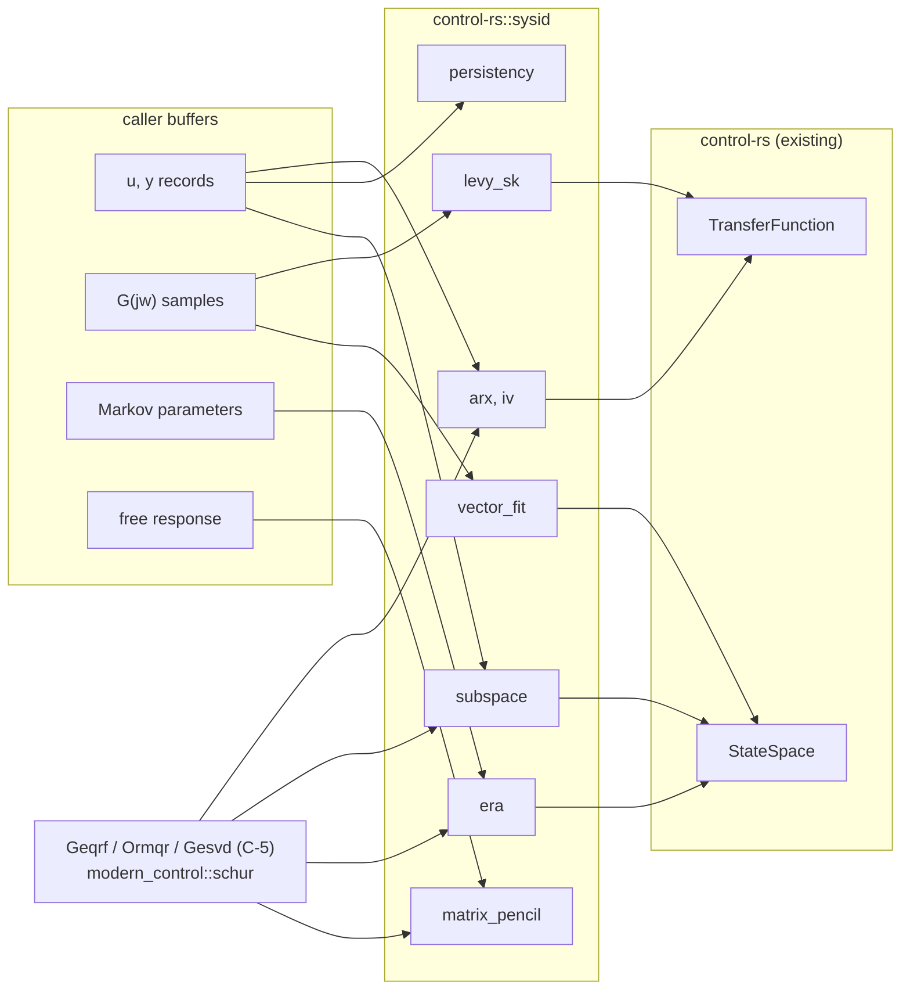

# System Identification Toolbox (sysid)


---

### 1. Introduction

The `sysid` module of `control-rs` estimates linear models from measured
data: ARX and instrumental-variable regression from input-output records,
rational transfer functions from frequency-response samples, state-space
models by the eigensystem realization algorithm and subspace methods, and
poles from a free response by the matrix pencil method. Every estimator is a
factory that fills an existing `TransferFunction` or `StateSpace`; none adds
methods to the model types.

Primary usage scenarios:

- **Plant modeling from a test record**: A user fits an ARX or subspace model
  to a step or chirp experiment and designs a controller on it. Failure is a
  model returned from data that do not excite the order requested.
- **Frequency-response fitting**: A user fits a rational model to measured
  frequency samples. Failure is a fit that diverges or never terminates.
- **Modal estimation**: A user extracts frequencies and damping from a free
  decay. Failure is a pole set whose count exceeds the data's rank.
- **On-target re-identification**: Firmware re-estimates a low-order model
  from a fixed buffer. Failure is an allocation or data-dependent run time.

---

### 2. Requirements

#### 2.1 Functional Requirements

- **FR-1 — ARX estimation**: From $N$ samples of $u$ and $y$ and orders
  $(n_a, n_b, n_k)$, returns the equation-error least-squares ARX model as a
  discrete `TransferFunction`.
- **FR-2 — Instrumental-variable estimation**: From the same data, returns
  an ARX-structure model whose regression uses instruments built from $u$
  and an auxiliary model's simulated output.
- **FR-3 — Rational frequency fit**: From complex frequency samples
  $G(j\omega_k)$, returns a rational `TransferFunction` by Levy's
  linearization followed by Sanathanan-Koerner reweighting for at most a
  caller iteration count.
- **FR-4 — Vector fitting**: From the same samples and a starting pole set,
  returns a stable pole-residue model as a `StateSpace` by iterative pole
  relocation for at most a caller iteration count.
- **FR-5 — Eigensystem realization**: From Markov parameters, returns a
  discrete `StateSpace` of a caller order from the SVD of their block Hankel
  matrix, together with the Hankel singular values.
- **FR-6 — Subspace identification**: From input-output records, returns a
  discrete `StateSpace` by QR compression of the block Hankel data and SVD
  order revelation, with MOESP or N4SID weighting.
- **FR-7 — Matrix pencil poles**: From a free-response record, returns the
  discrete poles of a caller order (frequencies and damping ratios) from the
  matrix pencil of its Hankel matrix.
- **FR-8 — Persistency of excitation**: Returns whether an input record is
  persistently exciting of order $k$, that is, whether its depth-$k$ block
  Hankel matrix has full row rank to a caller tolerance.
- **FR-9 — Rank failures as errors**: A rank-deficient regressor, a Hankel
  matrix with fewer significant singular values than the requested order, or
  an input that fails FR-8 for the requested order returns an error.

#### 2.2 Non-Functional Requirements

- **NFR-1 — No allocation**: Data, regressor and Hankel matrices and all
  workspaces are const-sized.
- **NFR-2 — Bounded arithmetic**: FR-1, FR-2, FR-5, FR-6 and FR-7 perform a
  fixed number of operations for their sizes; FR-3 and FR-4 stop at a caller
  iteration cap.

#### 2.3 Constraints

- **C-1 — Compile-time sizes**: Record length, orders and Hankel block
  dimensions are const generics.
- **C-2 — Factories, not model methods**: Estimators return model types
  through their existing constructors and add no methods to them.
- **C-3 — Open-loop subspace data**: FR-6 assumes open-loop records;
  closed-loop records use FR-2.
- **C-4 — Root-crate module**: Ships as the new module `src/sysid` of
  `control-rs` and adds no dependency.
- **C-5 — Kernel dependencies**: Depends on a singular value decomposition
  kernel (`Gesvd`) specified by a revision of `subprograms-design.md`, on
  the existing `Geqrf` and `Ormqr`, and on `modern_control::schur` for
  eigenvalues.
- **C-6 — Error convention**: Conforms to `error-design.md` NFR-1.

---

### 3. Technical Overview

`src/sysid` holds factories over buffers. Regression estimators use QR;
realization, subspace and pencil estimators use block Hankel matrices, SVD
for order and basis, and an eigenvalue solve for poles.


```mermaid
flowchart LR
    subgraph data["caller buffers"]
        IO["u, y records"]
        FRD["G(jw) samples"]
        MK["Markov parameters"]
        FD["free response"]
    end
    subgraph sysid["control-rs::sysid"]
        ARX["arx, iv"]
        SK["levy_sk"]
        VF["vector_fit"]
        ERA["era"]
        SUB["subspace"]
        MP["matrix_pencil"]
        PE["persistency"]
    end
    subgraph models["control-rs (existing)"]
        TF["TransferFunction"]
        SS["StateSpace"]
    end
    K["Geqrf / Ormqr / Gesvd (C-5)<br/>modern_control::schur"]
    IO --> ARX --> TF
    IO --> PE
    IO --> SUB --> SS
    FRD --> SK --> TF
    FRD --> VF --> SS
    MK --> ERA --> SS
    FD --> MP
    K --> ARX
    K --> SUB
    K --> ERA
    K --> MP
```

---

### 4. Architecture

#### 4.1 Module Layout

```text
src/sysid/
├── mod.rs          # SysIdError; re-exports
├── hankel.rs       # block Hankel builder, persistency test
├── arx.rs          # arx, iv
├── frequency.rs    # levy_sk, vector_fit
├── realization.rs  # era
├── subspace.rs     # moesp, n4sid
├── pencil.rs       # matrix_pencil
└── tests/
```

`src/lib.rs` gains `pub mod sysid;`.

#### 4.2 ARX and Instrumental Variables

ARX minimizes the equation error by least squares [1]. The regressor rows
are $[-y_{t-1}, \dots, -y_{t-n_a}, u_{t-n_k}, \dots, u_{t-n_k-n_b+1}]$ and
the estimate solves $\min \lVert \Phi \theta - y \rVert$ [1] by `Geqrf` and a
triangular solve, never by forming $\Phi^T \Phi$. A diagonal entry of $R$
below the caller tolerance relative to $|R_{11}|$ returns
`SysIdError::RankDeficient` (FR-9). Equation-error estimates take a noise
model only through extensions such as pseudo-linear regression, which
first fits a high-order ARX model and regresses again on its residuals [1].
FR-2 uses the same two-stage shape with instruments in place of residuals:
stage one fits ARX, stage two replaces the lagged outputs in the
instrument matrix $Z$ with the stage-one model's simulated output and
solves $Z^T \Phi \theta = Z^T y$ by LU. The instrument choice is the
crate's and is flagged in §8.

#### 4.3 Frequency-Domain Rational Fits

Levy's method linearizes the fit by neglecting the denominator [2], which
equals the true error only when the denominator is nearly constant [2].
Sanathanan-Koerner iteration divides each row by the previous iteration's
denominator, which acts as a frequency-dependent weight [2]. `levy_sk` runs
Levy once, then SK until the relative coefficient change falls below the
tolerance or the caller cap is reached; reaching the cap returns the last
iterate with `Converged::No`. Real coefficients come from stacking real and
imaginary parts.

Vector fitting relocates poles iteratively by repeated linear solves [2],
[3] on a partial-fraction basis. Each iteration fits residues of an
auxiliary function $\sigma(s)$, takes the new poles as the zeros of
$\sigma$ (an eigenvalue problem), and flips unstable poles to the left half
plane. The final pole-residue model is realized as a block-diagonal
`StateSpace`.

#### 4.4 Eigensystem Realization

ERA builds a block Hankel matrix from Markov parameters and realizes a
state-space model from its SVD [4]. With $H_0 = U \Sigma V^T$ truncated to
order $n$, $A = \Sigma_n^{-1/2} U_n^T H_1 V_n \Sigma_n^{-1/2}$, $B$ and $C$
are the first block column and row of $\Sigma_n^{1/2} V_n^T$ and
$U_n \Sigma_n^{1/2}$, and $D$ is the zeroth Markov parameter. The Hankel
singular values are returned for order selection. OKID derives Markov
parameters from input-output data [4]; it is not part of v1 (§5).

#### 4.5 Subspace Identification

Subspace identification preprocesses the data, compresses the block Hankel
matrix with a QR factorization, and reveals the order as the number of
non-zero singular values of a projected matrix [5]; the QR path is the
numerically stable one [5]. MOESP and N4SID differ in the weighting of that
matrix [5], [4]. From the extended observability matrix,
$C$ is its first block row and $A$ solves the shift-invariance equation in
least squares; $B$ and $D$ follow from a linear regression on the data.
The order is the caller's; fewer significant singular values than that
order returns `RankDeficient` (FR-9).

#### 4.6 Matrix Pencil

The matrix pencil method forms an $(N - L) \times (L + 1)$ Hankel matrix of
the samples and solves a generalized eigenvalue problem [6]; the model order
comes from truncating singular values [6]. With $Y = U \Sigma V^T$ truncated
to order $M$, and $V_1$, $V_2$ the rows of $V_M$ without its last and first
row, the poles are the eigenvalues of $V_1^{+} V_2$, a standard $M \times M$
problem solved by the Schur layer. Each discrete pole $z$ gives
$\omega = |\ln z| / T_s$ and $\zeta = -\operatorname{Re}(\ln z)/|\ln z|$.

#### 4.7 Persistency of Excitation

An input is persistently exciting of order $k$ if its depth-$k$ Hankel matrix
has full row rank [7]. `persistency` builds that matrix and counts singular
values above the caller tolerance relative to the largest. FR-6 and FR-1
call it for the order their structure requires before estimating.

#### 4.8 Error Handling

```rust
#[derive(Debug, Clone, Copy, PartialEq, Eq)]
pub enum SysIdError {
    /// A kernel failed (QR, SVD budget, Schur budget, LU).
    LinAlg(LinAlgError),
    /// Regressor or Hankel rank is below the requested order (FR-9).
    RankDeficient,
    /// The input is not persistently exciting of the needed order (FR-8).
    NotPersistentlyExciting,
    /// A pole relocation produced no stable pole set (FR-4).
    NoStablePoles,
}
```

The enum has a hand-written `Display`, `impl core::error::Error` and
`From<LinAlgError>` (C-6). Reaching an iteration cap is not an error; FR-3
and FR-4 return the iterate with a convergence flag.

---

### 5. Alternatives

| Alternative | Rejected Because | Reference |
|:--|:--|:--|
| Levy's method alone | Biased unless the denominator is nearly constant [2]; SK reweighting is kept. | [2] |
| Prony's method for modal estimation | The matrix pencil method is reported more robust to noise than Prony-based linear methods [6]. | [6] |
| Normal-equations least squares | Squares the regressor's condition number; QR is used. The correlation-matrix route also costs accuracy in subspace preprocessing [5]. | [5] |
| OKID before ERA in v1 | Adds an observer-based least-squares stage [4]; ERA from caller Markov parameters ships first. | [4] |
| Prediction-error minimization (ARMAX, Box-Jenkins) | Needs a nonlinear search with data-dependent iterations, conflicting with NFR-2; pseudo-linear regression [1] is the bounded substitute if a noise model is needed later. | [1] |

---

### 6. Verification & Validation

#### 6.1 Verification

| Condition | Requirement | Method | Target | Criterion |
|:--|:--|:--|:--|:--|
| VC-1.1 | FR-1 | `libtest` | `control_rs::sysid::arx::tests::noise_free_exact` | Noise-free data from a known ARX model return its coefficients within §6.2; FR-1 holds iff all conditions hold |
| VC-1.2 | FR-1 | `libtest` | `control_rs::sysid::arx::tests::cross_check` | Noisy data match the cross-check tolerance |
| VC-2.1 | FR-2 | `libtest` | `control_rs::sysid::arx::tests::iv_colored_noise_bias` | With colored output noise over 50 Monte Carlo runs, the mean IV error is smaller than the mean ARX error; FR-2 holds iff all conditions hold |
| VC-3.1 | FR-3 | `libtest` | `control_rs::sysid::frequency::tests::sk_exact_rational` | Samples of a known rational function return its coefficients within §6.2; FR-3 holds iff all conditions hold |
| VC-3.2 | FR-3 | `libtest` | `control_rs::sysid::frequency::tests::sk_cap_respected` | A cap of 1 returns after one SK iteration with `Converged::No` |
| VC-4.1 | FR-4 | `libtest` | `control_rs::sysid::frequency::tests::vf_recovers_poles` | Samples of a known 6-pole function return its poles within §6.2, all stable; FR-4 holds iff all conditions hold |
| VC-5.1 | FR-5 | `libtest` | `control_rs::sysid::realization::tests::era_markov_exact` | Markov parameters of a known system return a model with equal Markov parameters within §6.2; FR-5 holds iff all conditions hold |
| VC-6.1 | FR-6 | `libtest` | `control_rs::sysid::subspace::tests::moesp_n4sid_noise_free` | Noise-free open-loop data return models whose eigenvalues and frequency responses match the true system within §6.2; FR-6 holds iff all conditions hold |
| VC-6.2 | FR-6 | `libtest` | `control_rs::sysid::subspace::tests::cross_check` | Noisy data match the cross-check tolerance |
| VC-7.1 | FR-7 | `libtest` | `control_rs::sysid::pencil::tests::damped_sinusoids` | Two noise-free damped sinusoids return their frequencies and damping ratios within §6.2; FR-7 holds iff all conditions hold |
| VC-8.1 | FR-8 | `libtest` | `control_rs::sysid::hankel::tests::persistency_orders` | A sum of $q$ sinusoids is reported persistently exciting of order $2q$ and not of $2q + 1$; FR-8 holds iff all conditions hold |
| VC-9.1 | FR-9 | `libtest` | `control_rs::sysid::arx::tests::rank_deficient_errors` | A constant input with $n_b = 2$ returns `RankDeficient`, and a third-order ERA request on a first-order system returns `RankDeficient`; FR-9 holds iff all conditions hold |
| VC-10.1 | NFR-1 | `inspection` | — | No routine allocates; all storage is const-sized |
| VC-11.1 | NFR-2 | `analysis` | — | Loop bounds of FR-1, FR-2, FR-5, FR-6 and FR-7 depend only on sizes, and FR-3 and FR-4 loops on the cap |
| VC-12.1 | C-1 | `review` | — | Every size is a const generic |
| VC-13.1 | C-2 | `review` | — | No method is added to `TransferFunction` or `StateSpace` |
| VC-14.1 | C-3 | `review` | — | FR-6 documentation states the open-loop precondition |
| VC-15.1 | C-4 | `inspection` | — | The change adds no entry to `[dependencies]` in the root `Cargo.toml` |
| VC-16.1 | C-5 | `review` | — | `Gesvd` is specified and Approved in `subprograms-design.md` before implementation starts |
| VC-17.1 | C-6 | `inspection` | — | `SysIdError` derives the `error-design.md` NFR-1 traits and has hand-written `Display` |

Coverage: 90% line coverage of `src/sysid`, measured with `cargo coverage`.
Excluded: none.

#### 6.2 Acceptance

| Claim | Oracle | Measure | Bound |
|:--|:--|:--|:--|
| Noise-free ARX, SK, ERA, subspace (FR-1, FR-3, FR-5, FR-6) | Manufactured data from a known model | Relative error of coefficients, Markov parameters or eigenvalues | $\le 10^3 N u \kappa$, $\kappa$ the condition number of the regressor or Hankel matrix |
| Vector fitting poles (FR-4) | Manufactured samples | Relative pole error | $\le 10^3 N u \kappa$ |
| Matrix pencil (FR-7) | Manufactured noise-free sinusoids | Relative error of frequency and damping | $\le 10^3 N u \kappa$ |
| Noisy ARX and subspace (FR-1, FR-6) | Independent reference implementation (`cross-check`) | Relative error of coefficients or frequency response | Tolerance entries `sysid/<case>/<signal>` |
| Persistency (FR-8) | Closed form: $q$ sinusoids excite order $2q$ | Exact equality | Equal |

$u$ is the unit roundoff of `T` and $N$ the record length. The
$\kappa$-scaled bounds follow from the backward stability of QR least
squares; $\kappa$ is computed by the test from the regressor's singular
values.

#### 6.3 Limits

- Statistical properties (consistency, efficiency) are checked by Monte
  Carlo on one model, not proved.
- Closed-loop subspace data are excluded by C-3 and not tested.
- On-target execution through ETS suites is not exercised.

---

### 7. Performance & Resource Considerations

**Allocation.** Data and Hankel matrices are const-sized stack or static
arrays (NFR-1). A record of $N = 1000$ samples with a depth-20 block Hankel
for one input and one output occupies about $2 \cdot 20 \cdot 1000 \cdot 8$
bytes = 320 KB in `f64`, so on-target use needs short records or `static`
storage; host use has no such limit.

**Execution time.** ARX QR is $O(N p^2)$ for $p = n_a + n_b$ parameters.
ERA and subspace methods are dominated by one QR of the Hankel data and one
SVD. FR-3 and FR-4 cost one least-squares solve per iteration up to the cap
(NFR-2).

**Numeric types.** `f64` default; `f32` supported where the regressor
condition number allows.

---

### 8. Risks & Open Questions

- **SVD kernel (C-5, blocking).** FR-5 to FR-8 need `Gesvd`, which does not
  exist; it belongs in the same `subprograms-design.md` revision as the
  modern-control kernels.
- **Instrument choice (FR-2).** The evidence base has no primary IV source;
  the two-stage simulated-output instrument is a crate choice to review.
- **Closed-loop bias (C-3).** The bias of open-loop subspace methods under
  feedback is not sourced (Qin 2006 unreachable).
- **Index.** `documentation/README.md` has no control-toolboxes table.

---

### 9. Development Plan

| Phase | Delivers | Requirements | Effort | Status |
|:--|:--|:--|:--|:--|
| 1. Module and regression | `src/sysid`, `SysIdError`, `hankel`, `arx`, `iv` | FR-1, FR-2, FR-8, FR-9, C-1, C-2, C-4, C-6 | 4 days | Planned |
| 2. Frequency fits | `levy_sk`, `vector_fit` | FR-3, FR-4, NFR-2 | 4 days | Planned |
| 3. Realization and subspace | `era`, `moesp`, `n4sid`, `matrix_pencil`, cross-check tolerances | FR-5, FR-6, FR-7, NFR-1, C-3, C-5 | 6 days | Planned |

---

### 10. Revision History

| Revision | Date | Author | Description |
|:--|:--|:--|:--|
| 1.0 | October 4, 2026 | @MitchellDScott | Initial design document: FR-1 to FR-9, NFR-1 to NFR-2, C-1 to C-6. |

---

## References

[1] F. Bagge Carlson, "Transfer-function estimation,"
*ControlSystemIdentification.jl documentation*. [Online]. Available:
https://baggepinnen.github.io/ControlSystemIdentification.jl/stable/tf/.
Accessed: Oct. 4, 2026.

[2] P. Triverio, "Vector Fitting," arXiv, Rep. no. arXiv:1908.08977, 2019.

[3] SINTEF, "Vector Fitting: Algorithm," *SINTEF*. [Online]. Available:
https://www.sintef.no/en/software/vector-fitting/algorithm/. Accessed: Oct.
4, 2026.

[4] F. Bagge Carlson, "State-space estimation,"
*ControlSystemIdentification.jl documentation*. [Online]. Available:
https://baggepinnen.github.io/ControlSystemIdentification.jl/stable/ss/.
Accessed: Oct. 4, 2026.

[5] SLICOT, "IB01AD -- SLICOT Library Routine Documentation," in
*SLICOT-Reference*. [Online]. Available:
https://github.com/SLICOT/SLICOT-Reference/blob/main/doc/IB01AD.html.
Accessed: Oct. 4, 2026.

[6] Y.-I. Segman, A. Amar, and R. Talmon, "Structure-aware matrix pencil
method," arXiv, Rep. no. arXiv:2502.17047, 2025.

[7] J. Coulson, H. J. van Waarde, and F. Dörfler, "Robust fundamental lemma
for data-driven control," arXiv, Rep. no. arXiv:2205.06636, 2022.
