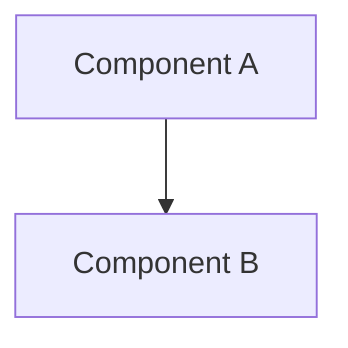

# Type/Module Name (Design Document)

---

### 1. Introduction

Brief description of the motivation, scope, goals, and primary usage scenarios.

---

### 2. Requirements

#### 2.1 Functional Requirements

- **FR-1 — [Short Name]**: [Description of observable behavior or capability.]
- **FR-2 — [Short Name]**: [Description of observable behavior or capability.]

#### 2.2 Non-Functional Requirements

- **NFR-1 — [Short Name]**: [Description of quality, performance, or resource property.]
- **NFR-2 — [Short Name]**: [Description of quality, performance, or resource property.]

#### 2.3 Constraints

- **C-1 — [Short Name]**: [Description of bound, environment, or architectural constraint.]
- **C-2 — [Short Name]**: [Description of bound, environment, or architectural constraint.]

---

### 3. Technical Overview

A high-level explanation of the component's scope, primary subsystems, and integration within the crate.

---

### 4. Architecture

Describe the implementation in detail, starting from a broad scope and focusing in on the specifics.

#### 4.1 [Subsystem / Component Name]

[Details on data structures, traits, functions, and memory layouts.]

#### 4.2 [Subsystem / Component Name]

[Details on algorithms, state machines, and mathematical formulations.]

---

### 5. Alternatives

Describe any architecture or implementation choices that were considered but not chosen, along with the technical tradeoffs justifying the decision.

| Alternative | Rejected Because | Reference |
|:------------|:-----------------|:----------|
| [...]       | [...]            | [...]     |

---

### 6. Verification & Validation

The plan for showing this component is correct and meets its requirements.

#### 6.1 Plan

| Kind | Step | Establishes |
|:-----|:-----|:------------|
| `test` | [...] | [...] |
| `bench` | [...] | [...] |
| `example` | [...] | [...] |
| `cross-check` | [...] | [...] |

#### 6.2 Acceptance

Numerical claims and quantitative bounds.

| Claim | Oracle | Measure | Bound |
|:------|:-------|:--------|:------|
| [...] | [...]  | [...]   | [...] |

#### 6.3 Limits

What this verification plan does not establish, unverified conditions, or explicitly deferred capabilities.

---

### 7. Performance & Resource Considerations

Describe requirements and bounds based on the practical nature of the implementation (for example, memory footprint, execution timing, stack budgets, `#![no_std]` zero-allocation guarantees).

---

### 8. Risks & Open Questions

Acknowledge any unspecified details, technical risks, design assumptions, or open questions.

---

### 9. Development Plan

Include the required implementation tasks and phases:

| Phase / Task | Description | Estimated Effort |
|:-------------|:------------|:-----------------|
| Phase 1: [...] | [...]       | [...]            |
| Phase 2: [...] | [...]       | [...]            |
| Phase 3: [...] | [...]       | [...]            |

---

### 10. Revision History

| Revision | Date            | Author       | Description              |
|:---------|:----------------|:-------------|:-------------------------|
| 1.0      | Month DD, YYYY  | @AuthorName  | Initial design document. |

---

## References

[1] Author, "Title," *Publication/Venue*, Year.
