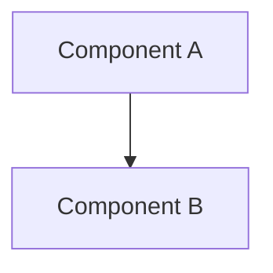

# Type/Module Name (Design Document)

<!--
Authoring notes live in HTML comments like this one. They do not render and
Vale skips them. Delete each note once its section is written.

1. Copy this file to `documentation/<project>/<slug>-design.md`.
2. Set the date badge to today (`September_5,_2026`: day not zero-padded) and
   the author badge to your GitHub handle.
3. Leave the status at `Draft`. Only a maintainer sets
   `Doc%20Status-Reviewed-yellow` or `Doc%20Status-Approved-brightgreen`
   (CONTRIBUTING.md §4).
4. Add a row for this document to its project table in
   `documentation/README.md`.
-->

---

### 1. Introduction

[Motivation and scope in one or two paragraphs.]

Primary usage scenarios:

- **[Scenario name]**: [A job a user performs with this component, and what failure looks like.]
- **[Scenario name]**: [A job a user performs with this component, and what failure looks like.]

<!--
Name 2 to 5 jobs a user can succeed or fail at. Every requirement in §2
traces to a scenario here or to an inherited constraint. A requirement that
traces to neither is architecture and belongs in §4.
-->

---

### 2. Requirements

<!--
The requirement tracer (`vv/requirement-traceability-design.md` §4.1) parses
this section, so the shape of each bullet matters.

- One claim per bullet, written exactly as `- **FR-n — Name**: Text` with an
  em dash. No nested sub-bullets, no suffixed IDs (`NFR-1a`) and no ID
  families other than `FR`, `NFR` and `C`.
- Name the requirement after the need, not the solution: "Exact product
  rescale", not "Widening multiply helper".
- IDs are permanent. Append new IDs; never renumber or reuse one, because
  other documents and test markers cite them. To retire an ID, keep the
  bullet and replace its text:
  `- **FR-4 — Strided reinterpretation (withdrawn)**: Withdrawn in revision 1.3; replaced by FR-9.`
- An inherited bound is one `C-n` that points at its owner instead of
  restating it:
  `- **C-1 — Inherited numeric types**: Conforms to num-types-design.md C-1.`
- Cite another document's requirement as `<slug>-design.md` FR-n, in code
  format.
- A bound is either an NFR or a C, never both.
-->

#### 2.1 Functional Requirements

- **FR-1 — [Short Name]**: [Observable behavior or capability.]
- **FR-2 — [Short Name]**: [Observable behavior or capability.]

#### 2.2 Non-Functional Requirements

- **NFR-1 — [Short Name]**: [Quality, performance, or resource bound.]
- **NFR-2 — [Short Name]**: [Quality, performance, or resource bound.]

#### 2.3 Constraints

- **C-1 — [Short Name]**: [Bound, target environment, inherited decision, or explicit exclusion.]
- **C-2 — [Short Name]**: [Bound, target environment, inherited decision, or explicit exclusion.]

---

### 3. Technical Overview

A high-level explanation of the component's scope, its primary subsystems, where it lives in the workspace (crate and module) and which sibling designs it depends on.

---

### 4. Architecture

Describe the implementation in detail, starting from a broad scope and focusing in on the specifics.

#### 4.1 [Subsystem / Component Name]

[Details on data structures, traits, functions, and memory layouts.]

#### 4.2 [Subsystem / Component Name]

[Details on algorithms, state machines, and mathematical formulations.]

#### 4.3 Error Handling

[The error type, its variants and the conditions that produce each.]

#### 4.4 Dependencies

| Crate | Features | `no_std` | Justification |
|:------|:---------|:---------|:--------------|
| [...] | [...]    | [...]    | [...]         |

<!--
Keep Error Handling and Dependencies as the last two subsections, numbered
after your own. Omit Error Handling when the component cannot fail. Omit
Dependencies when the design adds no third-party crate; otherwise base each
row on the crate's real dependency tree (`cargo tree`, CONTRIBUTING.md §5).
-->

---

### 5. Alternatives

Describe any architecture or implementation choices that were considered but not chosen, along with the technical tradeoffs justifying the decision.

| Alternative | Rejected Because | Reference |
|:------------|:-----------------|:----------|
| [...]       | [...]            | [...]     |

<!--
One row per rejected option. Where possible, state the reason in terms of §2
("violates C-2", "misses the NFR-1 budget").
-->

---

### 6. Verification & Validation

The plan for showing this component is correct and meets its requirements.

#### 6.1 Plan

| Kind | Step | Establishes | Requirements |
|:-----|:-----|:------------|:-------------|
| `test` | [...] | [...] | [FR-1, FR-2] |
| `bench` | [...] | [...] | [NFR-1] |
| `example` | [...] | [...] | [...] |
| `cross-check` | [...] | [...] | [...] |
| `gate` | [...] | [...] | [C-1] |

Coverage: [target]% line coverage of [crate or module], measured with `cargo coverage`. Excluded: [item and reason].

<!--
Kinds, one word per row. Omit a kind the component does not use.
- `test`: unit, integration, property and doctests, and ETS suites.
- `bench`: criterion benches. The `regression` gate enforces the budget keyed
  in `.cargo/regression.toml`.
- `example`: a runnable example. Fitness evidence, not proof of correctness.
- `cross-check`: `cargo compare` against an independent oracle.
- `gate`: another `cargo ci` gate, such as `clippy`, `deny`, `geiger` or a
  `no_std` target build.

Every FR, NFR and C appears in the Requirements column of at least one row.
The tracer reports as-built status once code exists; this column is the
design-time intent a reviewer checks before any code exists
(CONTRIBUTING.md §4). A requirement that only human review can check is
listed in 6.3.

The `coverage` gate measures line coverage but enforces no threshold, so a
reviewer checks the target stated here.
-->

#### 6.2 Acceptance

Numerical claims and quantitative bounds.

| Claim | Oracle | Measure | Bound |
|:------|:-------|:--------|:------|
| [...] | [...]  | [...]   | [...] |

<!--
Omit 6.2 when the component makes no quantitative claim.

Oracle, strongest first. Use the strongest that applies:
1. Closed-form or manufactured solution.
2. Independent reference implementation (`cross-check`).
3. Metamorphic relation between input and output changes.
4. Invariant or algebraic property over generated inputs.
5. Recorded golden value, with the tool, version and inputs that produced it.

Measure: exact equality for integer, fixed-point and structural results;
absolute, relative, ULP or scaled-residual error for floating point.

Bound: justify each bound from conditioning or a cited error analysis, never
from what the current implementation achieves. A `cross-check` row cites its
tolerance entry (`<case>/<signal>` in the suite's tolerance table) instead of
restating the number. A `bench` row states its budget.
-->

#### 6.3 Limits

What this verification plan does not establish, unverified conditions, or explicitly deferred capabilities.

<!--
Scope, not a backlog. Name requirements that only review can check and
targets or configurations the plan does not exercise. Work planned for later
belongs in §9.
-->

---

### 7. Performance & Resource Considerations

Describe how the design meets its resource bounds: stack and static memory, allocation (`#![no_std]`, zero-heap guarantees), execution time and jitter, and supported numeric types (`f32`, `f64`, fixed-point).

<!--
A bound that must hold is an NFR or C in §2. This section explains how the
design meets it. `no_std` and numeric-type support are decided here, per
module (CONTRIBUTING.md §3).
-->

---

### 8. Risks & Open Questions

Acknowledge any unspecified details, technical risks, design assumptions, or open questions.

<!--
Name the requirement or section each question affects. Resolve any question
that blocks implementation before approval: implementation does not choose
between options the document leaves open (CONTRIBUTING.md §5).
-->

---

### 9. Development Plan

| Phase | Delivers | Requirements | Effort | Status |
|:------|:---------|:-------------|:-------|:-------|
| 1. [Name] | [...] | [FR-1, C-1] | [n days] | Planned |
| 2. [Name] | [...] | [FR-2, NFR-1] | [n days] | Planned |
| 3. [Name] | [...] | [FR-3] | [n days] | Planned |

<!--
3 to 5 phases, not a task list (CONTRIBUTING.md §3). Every requirement lands
in at least one phase. Effort is in engineer-days. Status is `Planned`,
`In progress` or `Complete`.
-->

---

### 10. Revision History

| Revision | Date           | Author       | Description              |
|:---------|:---------------|:-------------|:-------------------------|
| 1.0      | Month D, YYYY  | @AuthorName  | Initial design document. |

<!--
One row per revision, oldest first, above References. Bump the major number
for a change that needs re-approval (requirements, public API or
architecture, CONTRIBUTING.md §5) and the minor number otherwise. Name every
requirement ID the revision adds, changes or withdraws.
-->

---

## References

[1] A. Author, "Title," *Publication/Venue*, vol. n, no. n, pp. n–n, Year.

[2] Organization, "Page Title," *Site Name*. [Online]. Available: https://example.com. Accessed: Mon. D, YYYY.

<!--
IEEE style, numbered in order of first citation, cited inline as [n].
Published works only (CONTRIBUTING.md §2).
-->
