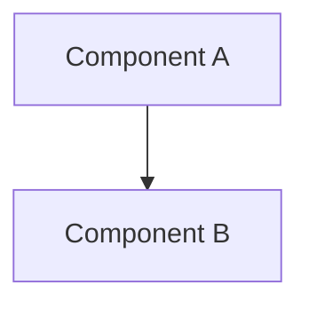

# Type/Module Name (Design Document)

---

## Introduction

Brief description of the motivation, scope, goals, and primary usage scenarios.

---

## Requirements

### Functional Requirements

- **FR-1 — [Short Name]**: [Observable behavior or capability.]
- **FR-2 — [Short Name]**: [Observable behavior or capability.]

### Non-Functional Requirements

- **NFR-1 — [Short Name]**: [Quality, performance, or resource bound.]
- **NFR-2 — [Short Name]**: [Quality, performance, or resource bound.]

### Constraints

- **C-1 — [Short Name]**: [Bound, target environment, inherited decision, or explicit exclusion.]
- **C-2 — [Short Name]**: [Bound, target environment, inherited decision, or explicit exclusion.]

---

## Technical Overview

A high-level explanation of the component's scope, its primary subsystems, where it lives in the workspace (crate and module) and which sibling designs it depends on.

```mermaid
flowchart TD
    A[Component A] --> B[Component B]
```

---

## Architecture

Describe the implementation in detail, starting from a broad scope and focusing in on the specifics.

### [Subsystem / Component Name]

[Details on data structures, traits, functions, and memory layouts.]

### [Subsystem / Component Name]

[Details on algorithms, state machines, and mathematical formulations.]

---

## Alternatives

Describe any architecture or implementation choices that were considered but not chosen, along with the technical tradeoffs justifying the decision.

| Alternative | Rejected Because | Reference |
|:------------|:-----------------|:----------|
| [...]       | [...]            | [...]     |

---

## Verification & Validation

The plan for showing this component is correct and meets its requirements.

### Verification

How each requirement is verified and what "passed" means. Each requirement is
partitioned into verification conditions and decision criteria (`VC-x.y`). The `Gates`
cell names the gate whose result is the evidence; an empty cell means the condition is
checked by review and reads `Unchecked`. `Criterion` is one sentence stating the
pass condition, including any bound. Specific tests assert these conditions and link
to them via markers (`#[req("doc#VC-x.y")]` in Rust or comments `# req: doc#VC-x.y`).

| Condition | Requirement | Gates        | Criterion |
|:----------|:------------|:-------------|:----------|
| VC-1.1    | FR-1        | `test`       | [...]     |
| VC-2.1    | FR-2        | `bench`      | [...]     |
| VC-2.2    | FR-2        | `example`    | [...]     |
| VC-3.1    | C-1         |              | [...]     |

### Limits

What this verification plan does not establish, unverified conditions, or explicitly deferred capabilities.

---

## Performance & Resource Considerations

Describe requirements and bounds based on the practical nature of the implementation (for example, memory footprint, execution timing, stack budgets, `#![no_std]` zero-allocation guarantees).

---

## Risks & Open Questions

Acknowledge any unspecified details, technical risks, design assumptions, or open questions.

---

## Development Plan

Include the required implementation tasks and phases:

| Phase / Task | Description | Estimated Effort |
|:-------------|:------------|:-----------------|
| Phase 1: [...] | [...]       | [...]            |
| Phase 2: [...] | [...]       | [...]            |
| Phase 3: [...] | [...]       | [...]            |

---

## Revision History

| Revision | Date            | Author       | Description              |
|:---------|:----------------|:-------------|:-------------------------|
| 1.0      | Month DD, YYYY  | @AuthorName  | Initial design document. |

---

## References

[1] Author, "Title," *Publication/Venue*, Year.
