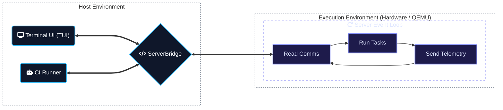

# Development Guide


Reference for working on `control-rs`: model internals, workspace
architecture, cargo aliases and CI/ETS verification workflows.

---

## Infrastructure



### 1. Embedded Test Server (`control-rs-ets`)

Located in [control-rs-ets](../control-rs-ets), this `no_std` crate provides
the target-side infrastructure:

- **Interactive Test Server**: A lightweight event loop that executes test
  suites on request and streams results back.
- **Target Profiling**: Measures execution time using hardware cycle counters
  (ARM DWT) and tracks memory limits using stack painting and scanning.

### 2. Host-Side (`control-rs-ets-host`, `control-rs-tui`, `control-rs-ci`)

- **`control-rs-ets-host`**: Reusable library providing `ServerBridge`, protocol
  framing, transport drivers, and headless ETS test execution.
- **`control-rs-tui`**: Standalone interactive Terminal User Interface (TUI)
  console for virtual ETS and hardware ETS sessions.
- **`control-rs-ci`**: Declarative CI runner executing quality gates, on-target
  ETS matrices, static code analysis, and host validation cross-comparison
  suites.

### 3. Continuous Integration (`.github/workflows/CI.yml`)

- **Multi-Arch Emulation**: CI → virtual ETS (QEMU) for both **ARM
  Cortex-M** (`thumbv7em-none-eabihf`) and **RISC-V**
  (`riscv32imac-unknown-none-elf`) targets. `examples/qemu` and
  `examples/teensy4` remain in root `CI.yml`.
- **Code Quality Reporting**: Executes formatting checks (`cargo fmt-check`),
  linting (`cargo clippy-ci`), compilation verification (`cargo check`), workspace
  compilation (`cargo build`), unit and integration testing (`cargo test`), and
  code coverage (`cargo coverage-ci` via `cargo-tarpaulin`), generating a
  comprehensive report (`ci-report.md`).
- **Host numerics**: Dedicated Validation CI workflow
  [`.github/workflows/validation.yml`](../.github/workflows/validation.yml)
  runs isolated, parallel jobs per suite group. Path filters include
  `control-rs-validation/**` and `validate.toml`; artifact paths are under
  `control-rs-validation/results`. Each job runs the Rust-side invariants
  (`cargo test -p control-rs-validation`), then the emitter and oracle
  subprocess list declared for each suite in the repository-root
  `validate.toml`. Plot scripts are a non-gating convenience after the compare
  step.
  The runner does not locate a Python interpreter or any other oracle toolchain.
  `control-rs-validation` is a workspace member but is not a `[gates]` entry:
  its suites need Python, HDF5 and ngspice, so they are verified in Validation
  CI rather than root `cargo ci`. The validation harness lives in
  `control-rs-ci`. A repo-root `traceability` job in Validation CI runs
  `cargo trace` so validation `Trace:` annotations still audit when only
  `control-rs-validation/**` changes.
- **Pedagogical examples**: Light
  [`.github/workflows/examples.yml`](../.github/workflows/examples.yml)
  runs clippy and `cargo run --release --example <name>` for every example, and
  smoke-runs both criterion benches. No Python oracles, no ngspice, no HDF5
  compare.

### 4. Host surfaces (`examples/`, `benches/`, `control-rs-validation/`)

Standard cargo layout. `examples/*.rs` and `benches/*.rs` are targets of the
root package; `control-rs-validation` is a workspace member. Root package
`exclude` lists `documentation/` and the nested crates under `examples/`.
`.gitignore` covers `control-rs-validation/results/` and `examples/*/results/`.

- **`examples/` — pedagogical demos.** `matrix`, `polynomial`, `state_space`,
  `transfer_function`, `tensor`, `dc_motor` and `buck_converter`, run with
  `cargo run --example <name>`. No HDF5, no oracle compare. The nested crates
  `examples/subprograms/`, `examples/qemu/` and `examples/teensy4/` keep their
  own `[workspace]` because they cross-compile.
- **`benches/` — criterion latency.** `benches/numerical_models.rs` and
  `benches/classical_tools.rs`, run with `cargo bench`. Not a CI fail gate and
  not a `[gates]` entry.
- **`control-rs-validation/` — oracle gates.** Fail-closed HDF5 / true-oracle
  1:1 suites on ill-conditioned kernels. Suites are declared once in the
  repository-root `validate.toml`; run one with
  `cargo run -p control-rs-ci --bin compare -- --name <suite>`. Rust-side
  invariants run without Python via `cargo test -p control-rs-validation`.
  Shared helper: `control-rs-validation/python3/h5_write.py`.

---

## Toolchain Setup

The workspace's tooling requires multiple toolchains be installed:

```bash
rustup target add thumbv7em-none-eabihf riscv32imac-unknown-none-elf
```

---

## Git Pre-Commit Hook

The canonical hook is [`scripts/git-hooks/pre-commit`](../scripts/git-hooks/pre-commit).
Install it into a clone with:

```bash
cp scripts/git-hooks/pre-commit .git/hooks/pre-commit
chmod +x .git/hooks/pre-commit
```

It formats the workspace, re-stages any formatted files, and runs `clean`,
`build`, `check`, and `lint` across the workspace, which now includes the
examples, the benches, and `control-rs-validation`, before allowing a commit.

---

## Cargo Aliases

Helpful cargo aliases are configured
in [.cargo/config.toml](../.cargo/config.toml)
to simplify development, testing, formatting, linting, and quality gate execution.
All aliases route through the dedicated host tools (`control-rs-ci`, `control-rs-tui`):

| Category                               | Alias               | Underlying Command                                                       | Description                                                            |
|:---------------------------------------|:--------------------|:-------------------------------------------------------------------------|:-----------------------------------------------------------------------|
| **Development & UI**                   | `cargo tui`         | `run --package control-rs-tui --`                                        | Launches the interactive TUI console dashboard.                        |
|                                        | `cargo ci`          | `run --package control-rs-ci --`                                         | Runs the continuous integration pipeline locally.                      |
| **Target Execution (Interactive TUI)** | `cargo qemu`        | `run --package control-rs-tui -- --manifest-path examples/qemu/Cargo.toml ...` | TUI → virtual ETS (QEMU).                                              |
|                                        | `cargo teensy`      | `run --package control-rs-tui -- --serial --port /dev/teensy`            | TUI → ETS (Teensy 4.0).                                                 |
| **Target Execution (CI)**              | `cargo qemu-ci`     | `run --package control-rs-ci --bin ci -- --manifest-path examples/qemu/Cargo.toml --only ets` | CI → virtual ETS matrix (QEMU).                                        |
|                                        | `cargo teensy-ci`   | `run --package control-rs-ci --bin ci -- --only ets --serial --port /dev/ttyACM0` | CI → ETS (Teensy 4.0).                                                 |
| **Cross-Validation**                   | `cargo validate`    | `run --package control-rs-ci --bin validate --`                           | Runs oracle 1:1 HDF5 comparison from `validate.toml`.                  |
| **Formatting**                         | `cargo fmt-all`     | `fmt --all`                                                              | Automatically formats all Rust files in the workspace.                  |
|                                        | `cargo fmt-check`   | `fmt-all -- --check`                                                     | Checks that all files conform to formatting rules.                      |
| **Linting**                            | `cargo lint`        | `clippy --workspace --all-targets`                                    | Runs Clippy lints across all packages and targets.               |
|                                        | `cargo clippy-ci`   | `lint --all-features -- -D warnings`                                     | Runs Clippy CI lints, treating all warnings as compiler errors.         |
| **Coverage**                           | `cargo coverage`    | `tarpaulin --verbose --workspace`                                        | Measures test code coverage via `cargo-tarpaulin`.                      |
|                                        | `cargo coverage-ci` | `cargo coverage --color never --out Html --out Json`                     | Runs coverage in CI mode, exporting reports in HTML and JSON.           |

### Continuous Integration Pipeline & Quality Gates

`cargo ci` executes the gates listed in `[gates]` of `gate.toml`, in key order.
Each value is `skip`, `warn`, or `fail`. Omitted gates are skipped. A typical
root workspace lists `clean`, `fmt`, `clippy`, `check`, `deny`, `audit`,
`build`, `test`, `coverage`, and `trace`. Host numerics (`validate`) live on
the nested validation crates and Validation CI. Benches are not
`[gates]` and are not fail-closed.

#### Gate Controls

- `--up-to <GATE>`: Runs listed gates from the start up to the specified gate (must be in `[gates]`).
- `--only <GATE>`: Runs only the specified gate(s). Omitted names and listed `"skip"` values run as `fail`.
- `--skip <GATE>`: Skips specific gate(s), repeatable (e.g. `--skip coverage`).
- `--strict`: Promotes `warn` to `fail`.
- Gate toggle flags: `--no-clean`, `--no-fmt`, `--no-clippy`, `--no-check`, `--no-build`, `--no-test`, `--no-cov`, `--no-ets`, `--no-trace`, `--no-validate`.

---

## Interactive Testing (Host TUI)

Launch the Ratatui control dashboard. Select tests, run them and adjust
parameters in real time.

```bash
  $> cargo tui

┌ control-rs ETS Console ─────────────────────────────────────────────────────────────────────────────────────────────┐
│ TARGET: QEMU (cortex-m7) | LINK: Semihosting (mps2-an500)                                                           │
└─────────────────────────────────────────────────────────────────────────────────────────────────────────────────────┘
┌ Test Suites & Config Settings ────────────────────────────────┐┌ Target Console / RTT Logs ─────────────────────────┐
│▼ test_axioms                                                  ││[Host] Connected to target. Triggering discovery... │
│  ├─ [ ---- ] test_addition_commutativity                      ││[Host] Discovery complete.                          │
│  ├─ [ ---- ] test_multiplication_commutativity                ││                                                    │
│  ├─ [ ---- ] test_distributivity                              ││                                                    │
│  ├─ [ ---- ] test_identities                                  ││                                                    │
│  ├─ [ ---- ] test_comparisons                                 ││                                                    │
│▼ test_basics                                                  ││                                                    │
│  ├─ [ ---- ] test_new                                         ││                                                    │
│  ├─ [ ---- ] test_from_real                                   ││                                                    │
│  ├─ [ ---- ] test_from_imag                                   ││                                                    │
│  ├─ [ ---- ] test_polar_creation                              ││                                                    │
│  ├─ [ ---- ] test_polar_conversion                            ││                                                    │
│▼ test_core_math                                               ││                                                    │
└───────────────────────────────────────────────────────────────┘└────────────────────────────────────────────────────┘
┌ Keyboard Commands ──────────────────────────────────────────────────────────────────────────────────────────────────┐
│(r)un all | (s)top execution | (f)ilter tests | (Enter) edit/run/toggle | (d)escription | (q)uit                     │
└─────────────────────────────────────────────────────────────────────────────────────────────────────────────────────┘
```

- **Launch TUI for QEMU Emulator (default target: cortex-m7, mps2-an500):**
  ```bash
  cargo qemu # target: arm-none-eabihf, semihosting
  cargo tui qemu risc-v # target: risc-v32, virt
  ```
- **Launch TUI for Physical Teensy 4.0 Hardware:**
  ```bash
  cargo teensy
  ```

## Continuous Integration & Verification

Run the exact verification steps performed by the GitHub Actions pipeline
locally (clippy, formatting, and tarpaulin coverage; target execution via
virtual ETS is run separately via `cargo qemu-ci`).
Host-numerics HDF5 V&V is Validation CI. The Python 3.12 virtualenv lives at
the **crate root** (`.venv`). Activate it, then compare from the repository
root:

```bash
python3.12 -m venv .venv
source .venv/bin/activate
pip install -r control-rs-validation/python3/requirements.txt
cargo compare --name matrix --out-dir target/ci
```

- **Run host CI checks (formatting, Clippy, and coverage/tests):**
  ```bash
  cargo ci
  ```
- **Run target execution / virtual ETS (QEMU & hardware):**
  ```bash
  cargo qemu-ci
  cargo teensy-ci
  ```
- **Run workspace code coverage analysis:**
  ```bash
  cargo coverage      # Detailed console coverage
  cargo coverage-ci   # Export HTML and JSON reports (headless CI style)
  ```

### Standalone Host CLI Options

#### Interactive TUI (`control-rs-tui`)
Installed via `cargo install control-rs-tui` or invoked via `cargo tui`:
- `--manifest-path, -p <PATH>`: Working directory or crate manifest path containing the target (default: `.`)
- `--target, -t <TRIPLE>`: Target architecture triple (e.g. `thumbv7em-none-eabihf`)
- `--bin, -b <BIN>`: Target binary name (e.g. `control-rs-qemu-thumbv7em-none-eabihf`)
- `--args <ARGS>`: Forwarded cargo/runner arguments
- `--release`: Build and run target binary in release mode
- `--serial`: Use serial communication mode
- `--port <PORT>`: Serial port path (e.g. `/dev/ttyACM0` or `/dev/teensy`)
- `--baud <BAUD>`: Serial baud rate (default: 115200)

#### Repository CI Runner (`control-rs-ci` / `cargo ci`)

The CI runner is driven declaratively by `gate.toml` at the root of each
workspace. Suite lists for host numerics live in a sibling `validate.toml`.

**Workspace Scoping Rule**: Every `gate.toml` configures the workspace that contains it. `[[ets.targets]]` refer to items in that workspace and do not specify `manifest_path`. Nested crates (such as `examples/qemu`) keep their own `gate.toml` and are executed via `--manifest-path <path>` or from that directory.

```toml
# Root workspace gate.toml
[runner]
title = "control-rs"
out_dir = "target/ci"
timeout_secs = 90

[gates]
clean = "fail"
fmt = "fail"
clippy = "fail"
check = "fail"
deny = "fail"
audit = "fail"
build = "fail"
test = "fail"
coverage = "fail"
trace = "fail"
```

For nested firmware crates such as `examples/qemu/gate.toml`, targets refer directly to local binaries:

```toml
# examples/qemu/gate.toml
[runner]
title = "control-rs-qemu"
out_dir = "target/ci"
timeout_secs = 60

[gates]
clean = "fail"
fmt = "fail"
clippy = "fail"
check = "fail"
build = "fail"
ets = "fail"

[[ets.targets]]
name = "qemu-arm-hf"
target = "thumbv7em-none-eabihf"
bin = "control-rs-qemu-thumbv7em-none-eabihf"
args = ["--release"]
```


##### CLI Options & Gate Controls

- `--config <PATH>`: Configuration file path (default: `gate.toml`)
- `--manifest-path <PATH>`: Target crate manifest path (`Cargo.toml`) or directory
- `--out-dir <DIR>`: Output directory for reports (default: `.`)
- `--title <TITLE>`: Markdown report title header
- `--timeout <SECS>`: Per-target wall-clock bound
- `--fmt`: Apply formatting (`cargo fmt-all`) instead of checking
- `--up-to <GATE>`: Run listed gates from start up to specified gate (must be in `[gates]`)
- `--only <GATE>`: Run only specified gate(s); omitted or skip-listed names run as `fail`
- `--skip <GATE>`: Skip specified gate(s), repeatable (e.g. `coverage`)
- `--strict`: Promote `warn` to `fail`
- `--no-<gate>`: Convenience toggles (`--no-cov`, `--no-validate`, etc.)
- `-t, --target <TRIPLE>`: Filter ETS targets to matching cross-compilation triple
- `-b, --bin <BIN>`: Filter ETS targets to matching binary name
- `--serial`: Verify a physical hardware target over serial
- `--port <PORT>`: Serial device path (default: `/dev/ttyACM0`)

Examples:
```bash
# Run full CI pipeline
cargo ci

# Run fast local checks up to unit tests
cargo ci --up-to test

# Run only on-target ETS QEMU tests
cargo qemu-ci

# Run one host-oracle suite (crate-root .venv on PATH)
cargo compare --name matrix --out-dir target/ci
cargo compare --name dc-motor --out-dir target/ci

# Run interactive TUI against an external ETS target
cargo tui --manifest-path examples/qemu/Cargo.toml --target thumbv7em-none-eabihf --bin control-rs-qemu-thumbv7em-none-eabihf --release

# Run interactive TUI against hardware over serial
cargo tui --serial --port /dev/teensy --baud 115200
```
