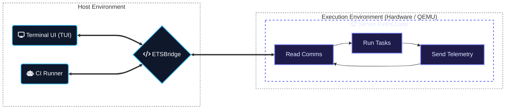

# Development Guide

Reference for working on `control-rs`: model internals, workspace
architecture, cargo aliases and CI/ETS verification workflows.

---

## Infrastructure



### 1. Embedded Test Server (`control-rs-ets`)

Located in [control-rs-ets](../control-rs-ets), this `no_std` crate provides
the target-side infrastructure:

- **Interactive Test Server**: An event loop that executes test
  suites on request and streams results back.
- **Target Profiling**: Measures execution time using hardware cycle counters
  (ARM DWT) and tracks memory limits using stack painting and scanning.

### 2. Host Infrastructure (`control-rs-ets-host`, `control-rs-tui`,
`control-rs-ci`)

- **Session Engine (`control-rs-ets-host`)**: Headless session state machine,
  COBS framing, serial/TCP transport abstractions, and automated test execution.
- **Terminal User Interface (`control-rs-tui`)**: Interactive dashboard
  (Ratatui)
  for real-time on-target telemetry inspection and manual test execution.
- **Quality Gate Runner (`control-rs-ci`)**: Declarative quality gate runner
  (`gate.toml`), report generator (`ci-report.md`), and requirement traceability
  auditor.

### 3. Continuous Integration (`.github/workflows/CI.yml`)

- **Multi-Arch Emulation**: CI → virtual ETS (QEMU) for both **ARM
  Cortex-M** (`thumbv7em-none-eabihf`) and **RISC-V**
  (`riscv32imac-unknown-none-elf`) targets.
- **Code Quality Reporting**: `control-rs-ci` executes workspace quality gates
  and aggregates structured JSON artifacts into `ci-report.md`.
- **Differential Validation**: Host cross-validation of the numerical models
  against Python reference oracles (`control-rs-verification`, compared by
  `control-rs-compare`).

---

## Prerequisites

| Requirement | Version / Value | Needed for |
|:--|:--|:--|
| Rust toolchain | minimum `1.89.0`; CI also tests stable and beta | Everything |
| Bare-metal targets | `rustup target add thumbv7em-none-eabihf thumbv7em-none-eabi riscv32imac-unknown-none-elf riscv64gc-unknown-none-elf` | `examples/qemu`, `examples/teensy4`, ETS |
| QEMU | `qemu-system-arm`, `qemu-system-riscv32`, `qemu-system-riscv64` | `cargo qemu`, virtual ETS |
| `libudev-dev` | Linux only | Serial transport in `control-rs-ets-host` |
| Python | 3.12, virtualenv at the workspace root (`.venv`) | `cargo compare`, `cross-compare` gate |
| `vale` | 3.22, then `vale --config=.vale.ini sync` | `vale` gate |
| `cargo-tarpaulin` | latest | `cargo coverage`, `coverage` gate |
| `cargo-deny`, `cargo-geiger`, `cargo-semver-checks` | latest | `deny`, `geiger`, `semver` gates |
| `cargo-mutants` | latest | `mutants` gate (skipped by default) |
| `valgrind` | Linux only | `cargo valgrind`, `valgrind` gate |
| `cargo-binutils` | latest | Linker-section inspection in `control-rs-macros` |

The `valgrind` gate runs on Linux only; CI runs it there.

---

## Cargo Aliases

Helpful cargo aliases are configured
in [.cargo/config.toml](../.cargo/config.toml)
to simplify development, testing, formatting, linting and coverage reporting:

| Category                               | Alias               | Underlying Command                                             | Description                                                         |
|:---------------------------------------|:--------------------|:---------------------------------------------------------------|:--------------------------------------------------------------------|
| **Development & Quality Gates**        | `cargo ci`          | `run --package control-rs-ci --bin control-rs-ci --`           | Runs the full continuous integration pipeline locally.              |
|                                        | `cargo gate`        | `run --package control-rs-ci --bin gate --`                    | Runs targeted quality gates (for example, `cargo gate fmt,clippy`). |
|                                        | `cargo report`      | `run --package control-rs-ci --bin report --`                  | Aggregates JSON artifacts into `ci-report.md`.                      |
|                                        | `cargo compare`     | `run --package control-rs-compare --bin compare --`            | Executes reference oracles and compares HDF5 dataset results.       |
|                                        | `cargo valgrind`    | `run --package control-rs-ci --bin valgrind --`                | Runs Valgrind Memcheck against the workspace example binaries.      |
|                                        | `cargo regression`  | `run --package control-rs-ci --bin regression --`              | Checks `criterion` results against budgets and baselines.      |
| **Interactive TUI**                    | `cargo tui`         | `run --package control-rs-tui --`                              | Launches the interactive TUI console dashboard.                     |
| **Target Execution (Interactive TUI)** | `cargo qemu`        | `cargo tui qemu`                                               | TUI → virtual ETS (QEMU ARM Cortex-M7).                             |
|                                        | `cargo teensy`      | `cargo tui teensy`                                             | TUI → ETS (Teensy 4.0/4.1 over serial).                             |
| **Formatting**                         | `cargo fmt-all`     | `fmt --all`                                                    | Automatically formats all Rust files in the workspace.              |
|                                        | `cargo fmt-check`   | `fmt --all -- --check`                                         | Checks that all files conform to formatting rules.                  |
| **Linting**                            | `cargo lint`        | `clippy --workspace --lib --bins --tests --examples --benches` | Runs Clippy lints across all packages and targets.                  |
|                                        | `cargo clippy-json` | `cargo lint --message-format=json`                             | Runs Clippy lints and outputs findings in JSON format.              |
|                                        | `cargo clippy-ci`   | `cargo clippy-json -- -D warnings`                             | Runs Clippy CI lints, treating all warnings as compiler errors.     |
| **Coverage**                           | `cargo coverage`    | `tarpaulin --verbose --workspace`                              | Measures test code coverage via `cargo-tarpaulin`.                  |
|                                        | `cargo coverage-ci` | `cargo coverage --color never --out Html --out Json`           | Runs coverage in CI mode, exporting reports in HTML and JSON.       |

---

## Interactive Testing (Host TUI)

Launch the Ratatui control dashboard. Select tests, run them and adjust
parameters in real time.

```bash
  $> cargo tui

┌ control-rs ETS Console ─────────────────────────────────────────────────────────────────────────────────────────────┐
│ TARGET: QEMU (cortex-m7) | LINK: Semihosting (mps2-an500)                                                           │
└─────────────────────────────────────────────────────────────────────────────────────────────────────────────────────┘
┌ Test Suites & Config Settings ────────────────────────────────┐┌ Target Console / RTT Logs ─────────────────────────┐
│▼ test_axioms                                                  ││[Host] Connected to target. Triggering discovery... │
│  ├─ [ ---- ] test_addition_commutativity                      ││[Host] Discovery complete.                          │
│  ├─ [ ---- ] test_multiplication_commutativity                ││                                                    │
│  ├─ [ ---- ] test_distributivity                              ││                                                    │
│  ├─ [ ---- ] test_identities                                  ││                                                    │
│  ├─ [ ---- ] test_comparisons                                 ││                                                    │
│▼ test_basics                                                  ││                                                    │
│  ├─ [ ---- ] test_new                                         ││                                                    │
│  ├─ [ ---- ] test_from_real                                   ││                                                    │
│  ├─ [ ---- ] test_from_imag                                   ││                                                    │
│  ├─ [ ---- ] test_polar_creation                              ││                                                    │
│  ├─ [ ---- ] test_polar_conversion                            ││                                                    │
│▼ test_core_math                                               ││                                                    │
└───────────────────────────────────────────────────────────────┘└────────────────────────────────────────────────────┘
┌ Keyboard Commands ──────────────────────────────────────────────────────────────────────────────────────────────────┐
│(r)un all | (s)top execution | (f)ilter tests | (Enter) edit/run/toggle | (d)escription | (q)uit                     │
└─────────────────────────────────────────────────────────────────────────────────────────────────────────────────────┘
```

- **Launch TUI for QEMU Emulator (default target: cortex-m7, mps2-an500):**
  ```bash
  cargo qemu # target: arm-none-eabihf, semihosting
  cargo tui qemu risc-v # target: risc-v32, virt
  ```
- **Launch TUI for Physical Teensy 4.0 Hardware:**
  ```bash
  cargo teensy
  ```

## Continuous Integration & Verification

`cargo ci` runs every gate declared in [`gate.toml`](../gate.toml), grouped
as in GitHub Actions. `cargo gate` runs a subset. Gate output goes to
`target/ci-artifacts/<gate>.log`; add `-v` to also stream it to the console,
each line prefixed with its group and gate (for example
`[verify] cross-compare | ...`), as the GitHub Actions lanes do.

```bash
cargo ci                  # all gates
cargo ci -v               # all gates, output streamed with [group] gate prefixes
cargo gate fmt,clippy     # selected gates
cargo coverage            # console coverage
cargo coverage-ci         # HTML and JSON coverage reports
```

Numerical cross-validation runs the Python oracles in
[`control-rs-verification`](../control-rs-verification/README.md) and compares
their HDF5 output with the Rust results. Setup and flags:
[`control-rs-compare`](../control-rs-compare/README.md).

```bash
python3.12 -m venv .venv
source .venv/bin/activate
pip install -r control-rs-verification/python3/requirements.txt
cargo compare
```

