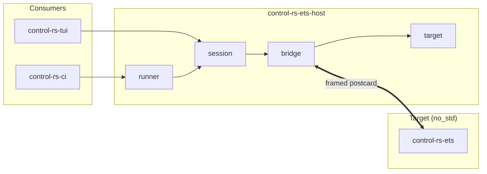

# Host ETS Library (Design Document)


---

### 1. Introduction

`control-rs-ets-host` is the host-side counterpart to the on-target Embedded
Test Server. It owns the connection to a target, the wire framing, and the
command/telemetry session that drives test discovery and execution. It renders
nothing and runs no repository quality gates.

The host orchestration layer already exists: `ServerBridge` and the headless
run loop drive QEMU targets on `ubuntu-latest` today. It
is currently compiled inside `control-rs-xtask` alongside the terminal
dashboard and the CI runner, so no consumer can take the transport without
also taking `ratatui`, `crossterm`, and the repository's lint tasks. This
document specifies that layer as an independent library crate.

**Scenario 1 — Headless target execution.** A CI runner builds a target ELF,
opens a session, discovers suites, runs them to completion, and receives a
structured result, with no terminal attached.

**Scenario 2 — Interactive session.** The terminal dashboard opens the same
session and consumes the same message stream, adding only presentation.

**Scenario 3 — Downstream adoption.** An external firmware project depending
on `control-rs-ets` drives its own on-target suites from an integration test
without vendoring this repository.

---

### 2. Requirements

#### 2.1. Functional Requirements

- **FR-1 — Target session lifecycle**: Open, poll, and close a session against
  a target identified at run time. Session setup is not required to know
  whether the target is emulated or physical.

- **FR-2 — Two transports**: Carry the session over a spawned subprocess
  (QEMU under `cargo run`) or a USB CDC serial port. Additional transports are
  out of scope for this crate revision.

- **FR-3 — Framed message exchange**: Serialize commands and deserialize
  telemetry across a sync-header, length-prefixed, CRC-checked frame, rejecting
  frames that fail integrity checks rather than surfacing partial payloads.

- **FR-4 — Suite discovery and run queue**: Enumerate the suites and cases a
  target registers, and drive a queue of run requests through to per-case
  results.

- **FR-5 — Panic recovery**: Detect a target panic, tear down the link, reset
  the target, and re-establish discovery without losing already-collected
  results.

- **FR-6 — Bounded headless run**: Expose a single entrypoint that runs a
  target to completion under a caller-supplied wall-clock timeout and returns a
  structured result. A run that exceeds the bound terminates the target and
  reports the timeout.

- **FR-7 — Target ELF construction**: Build a target binary for a given triple
  and binary name so that a caller can go from source tree to running session
  in one step.

- **FR-8 — Wire-contract compatibility check**: Establish at session open that
  the target speaks the same protocol revision as this crate, and fail the
  session with a named mismatch rather than decoding. A CRC-valid frame carries
  no evidence that the two sides agree on the meaning of its payload.

- **FR-9 — QEMU shorthand names the example crate**: A shorthand architecture
  name (arm, risc-v, …) builds and runs the QEMU example firmware, not a
  workspace-root `cargo run` for that triple. A documented shorthand that
  starts from `.` with no binary is not a session.

#### 2.2. Non-Functional Requirements

- **NFR-1 — No presentation dependencies**: The dependency closure contains no
  terminal-rendering or terminal-event crates. This is the property that makes
  the crate usable from a headless container and from a library consumer.

- **NFR-2 — Structured errors**: Transport, build, and subprocess failures
  return typed errors naming the failing stage. The crate does not abort the
  host process and does not panic outside tests.

#### 2.3. Constraints

- **C-1 — Host-only execution**: The crate requires `std`, OS threads,
  `std::process::Command`, and platform serial drivers. It is not `no_std` and
  cannot be merged into `control-rs-ets`, which is a `no_std`, `no_alloc`
  firmware library.

- **C-2 — Wire compatibility**: The framing and message schemas are fixed by
  the target-side implementation in `../ets/host-comm-design.md`. This crate is the mirror
  of that contract, not an independent protocol.

- **C-3 — Minimal dependencies**: Transport and codec dependencies are limited
  to `control-rs-ets`, `serial2`, `postcard`, and `crc`. `thiserror` is
  admitted in addition, because the crate error rule requires library errors to
  be a crate-local `thiserror` enum; it is a compile-time derive with no
  runtime dependency of its own.

---

### 3. Technical Overview

The crate is a synchronous session driver. A `Target` descriptor names either a
subprocess or a serial device; a `ServerBridge` turns that descriptor into a
byte stream plus a pair of reader threads; a session state machine converts the
resulting message stream into suite metadata, per-case telemetry, and a
terminal result. Two consumers sit above it: the terminal dashboard, which
renders the message stream, and the CI runner, which discards everything except
the structured result.



---

### 4. Architecture

#### 4.1. Module Structure

| Module    | Responsibility                                                                                                       |
|:----------|:---------------------------------------------------------------------------------------------------------------------|
| `target`  | `Target`, `SubprocessTarget`, `SerialTarget`, QEMU architecture descriptors, ELF path resolution, `build_target_elf` |
| `bridge`  | `ServerBridge` construction, reader threads, `BridgeMessage` stream, `send_command`, `try_wait`, `kill`              |
| `session` | Discovery and run-queue state machine, panic detection, reset and reconnect sequence                                 |
| `runner`  | `run_headless_ets(target, timeout) -> Result<EtsRunResult, HostError>`                                               |

`target`, `bridge`, and `session` are extracted from the existing
`control-rs-xtask` modules of the same names; `runner` is the promotion of the
headless loop currently embedded in the task runner.

#### 4.2. Transport

* **Subprocess**: Spawn `cargo run --bin <bin> --target <triple>` inside the
  QEMU example crate with piped stdin, stdout, and stderr. Semihosting is not
  used for data transport (see §5). Shorthand architecture names resolve that
  crate path and the matching binary name (FR-9).
* **Serial**: Open a USB CDC port at a configured baud rate, defaulting to
  115200, through `serial2`.

Both transports resolve to the same reader/writer pair, so `session` is
transport-agnostic.

#### 4.3. Framing

Frames follow the target-side contract in `../ets/host-comm-design.md`:

| Field          | Width    | Value                                 |
|:---------------|:---------|:--------------------------------------|
| Sync header    | 2 B      | `0xAA 0x55`                           |
| Payload length | 2 B      | big-endian, payload ≤ 512 B           |
| Payload        | variable | `postcard`                            |
| Integrity      | 2 B      | big-endian CRC-16 (`CRC_16_IBM_SDLC`) |

`postcard` is the codec on both ends because it is a `no_std`-focused Serde
implementation that avoids code differences between microcontroller and host
[1]. COBS delimiting was rejected on the target side to reduce
framing overhead; the host mirrors that decision.

Two reader threads consume the uplink: one decodes frames into
`BridgeMessage::Telemetry`, the other forwards unframed console lines as
`BridgeMessage::RawConsole`. Console output therefore survives a target that
crashes before it can frame anything.

The frame carries no version field, and `Command` and `Telemetry` are
`postcard`-encoded enums whose variant discriminants are positional. Inserting
or reordering a variant therefore shifts the encoding of every later variant
while leaving the CRC valid, so skew presents as a correctly-framed message
decoded as the wrong variant rather than as a transport error. The encoding
rule and the absence of any cross-revision compatibility guarantee are
established in `../ets/host-comm-design.md` §4.2.1, which owns the wire
contract. FR-8 is discharged by a `PROTOCOL_VERSION` constant exported from
`control-rs-ets::comms` and transmitted by the target in `Telemetry::TargetInfo`
(which also conveys `board_id`, `core_clock_hz`, and `fpu_flags`); the
host compares `protocol_version` to its own compiled value before issuing any
`RunExecutable` and fails the session on mismatch with `HostError::ProtocolMismatch`.

#### 4.4. Session State Machine

1. **Discovery** — send `ListSuites`, collect the suite and case registry, and
   validate `Telemetry::TargetInfo`.
2. **Run queue** — issue `RunExecutable` per queued case, accumulate cycle,
   duration, and peak-stack telemetry.
3. **Panic** — on `Telemetry::TargetPanic`, stop issuing runs, send
   `Command::TryReset`, allow 50 ms for the frame to drain, and drop the
   bridge. On serial connections, the server firmware is responsible for
   resolving hangs and resetting hardware; the host assumes `Command::TryReset`
   will be serviced or a timeout will be reported.
4. **Reset** — wait 1 s for the target bootloader and hardware initialization,
   rebuild the bridge, clear the queue, and re-enter discovery. Results already
   collected are retained. The 1 s figure is the value the existing headless
   loop uses; the interactive console uses 2 s, and the two are reconciled to
   the headless value here because the console's extra second covers terminal
   redraw, not target boot.
5. **Completion** — the queue drains, the reset budget is exhausted, or the
   caller's timeout expires.

Discovery re-sends `ListSuites` every 500 ms until the target answers, so a
target that boots slower than the host connects is not deadlocked.

Resets are bounded. A session performs at most `max_resets` panic-recovery
cycles, defaulting to 3. Exhausting the budget ends the session at step 5 with
the results collected so far; it is not an error. Without a bound, a target
that panics on every case reproduces the panic until the wall clock expires and
returns nothing useful.

#### 4.5. Error Type

`HostError` is a crate-local `thiserror` enum. Each variant names the stage
that failed, per NFR-2. The variants correspond one-to-one with the failure
points the existing implementation already surfaces as strings:

| Variant | Raised when |
|:--|:--|
| `Build { target, source }` | `cargo build` for the target ELF cannot be spawned, or exits non-zero |
| `SerialOpen { port, attempts, source }` | The serial port cannot be opened after the retry budget |
| `SerialClone { source }` | The reader half of an opened port cannot be cloned |
| `Spawn { source }` | The subprocess transport cannot be spawned, or its pipes cannot be taken |
| `Transport { source }` | A read or write on an established link fails |
| `ProtocolMismatch { host, target }` | FR-8: the target reports a different `PROTOCOL_VERSION` |
| `Discovery` | The target never completes discovery within the session bound |

Serial opening retries 5 times at 1 s intervals before returning
`SerialOpen`, matching current behaviour. Frame-level integrity failures are
not `HostError`: a frame that fails its CRC is dropped by the reader and the
stream resynchronizes on the next sync header (FR-3), because a single
corrupted frame on a noisy link is expected traffic, not a session failure.

#### 4.6. Run Result

```
EtsRunResult {
    completion: Completion,      // Drained | TimedOut | ResetBudgetExhausted
    results:    Vec<TestOutcome>,
    console:    String,
    resets:     u32,
}

TestOutcome {
    suite_name: String,
    test_name:  String,
    state:      TestState,       // from control-rs-ets::comms
    cycles:     Option<u64>,
    time_us:    Option<u64>,
    stack_peak: Option<u32>,
}
```

`TestOutcome` is field-identical to the `HeadlessTestResult` the task runner
serializes today, and `ets-results.json` remains a JSON array of these objects.
That is what keeps the existing workflow summary and PR-comment jobs parsing
`TestOutcome` and `Completion` are public API; changing a
field is a breaking release of this crate.

`EtsRunResult` carries no pass/fail verdict. Whether a run with failures, a
timeout, or an exhausted reset budget constitutes a CI failure is a policy
decision belonging to the consumer, not to the transport library.

#### 4.7. Headless Entrypoint

`run_headless_ets` wraps §4.4 with a wall-clock bound and returns
`EtsRunResult`. It performs no file I/O and no report formatting, so report
shape is a consumer decision rather than a library one. The 90-second bound
currently hard-coded in the task runner becomes a parameter.

The bound is whole-session, measured from bridge construction, not per case.
Exceeding it kills the target and returns `Ok` with
`completion: Completion::TimedOut` and every result collected up to that point.
This is a deliberate change from the current behaviour, which returns an error
string and discards the partial results: a run that timed
out after twenty passing cases and one hang is more diagnosable with the twenty
results than without them. `Err(HostError)` is reserved for failures that
prevent a session from producing results at all, per §4.5.

#### 4.8. Component Impact

| Component                            | Change     | Detail                                                                       |
|:-------------------------------------|:-----------|:-----------------------------------------------------------------------------|
| `control-rs-ets-host/src/target.rs`  | New        | Target descriptors and ELF build, from `bridge.rs` and `tasks.rs`            |
| `control-rs-ets-host/src/bridge.rs`  | Moved      | From `control-rs-xtask/src/bridge.rs`; positional argument grammar dropped   |
| `control-rs-ets-host/src/session.rs` | New        | Discovery and run loop, from `tasks.rs`                                      |
| `control-rs-ets-host/src/runner.rs`  | New        | `run_headless_ets` with parameterized timeout                                |
| `control-rs-xtask`                   | Deprecated | Retained, superseded by this crate plus `control-rs-tui` and `control-rs-ci` |

---

### 5. Alternatives

* **Embed the host layer in `control-rs-ets`**: Rejected. `control-rs-ets` is
  `no_std` and `no_alloc`; the host layer needs process spawning, threads, and
  platform serial drivers (C-1).
* **Keep the host layer inside `control-rs-xtask`**: Rejected. It forces every
  consumer of the transport to accept the terminal stack and the repository's
  quality gates, which contradicts NFR-1 and Scenario 3.
* **`probe-rs`/`embedded-test` as the harness**: Rejected. That harness reads
  tests from the ELF, flashes them together, and resets the device between
  cases [2]. ETS instead keeps a persistent idle server and
  dispatches cases over the link, which preserves target state across a suite
  and avoids per-case flash wear. `defmt-test` shares the same
  reset-per-binary model [3].
* **`postcard-rpc`**: Rejected. It layers an eight-byte key and sequence number
  over each `postcard` message to route RPC endpoints and topics [4].
  The ETS command set is small and statically known, so the header cost
  buys no routing the enum dispatch does not already provide.
* **RTT via a J-Link probe**: Rejected as the primary transport. RTT moves data
  without halting the core [5] and J-Run demonstrates
  reset-run-capture automation over it [6], but it binds the crate
  to a vendor probe and SDK. USB CDC and QEMU stdio are already present on
  every target in the matrix.
* **A Python harness over the serial port**: Rejected. `pytest-embedded`
  bundles serial, flashing, and QEMU services behind an expect-style API
  [7], but it puts the host driver in a second language and
  outside `cargo`.

---

### 6. Verification & Validation

#### 6.1 Approach

The implementation must produce evidence that the crate speaks the target's
wire contract exactly, that a session survives a target panic without losing
collected results, that every failure path returns a named error instead of
aborting, and that the dependency closure stays free of presentation crates.

| Method | Mechanism |
|:-------|:----------|
| Requirements-based test | `#[test]` over frame encode and decode, session transitions and error construction |
| Metamorphic relation | `#[test]` corrupting one payload byte and asserting the frame is dropped, not delivered |
| Requirements-based test | Golden wire vectors: one checked-in byte sequence per `Command` and `Telemetry` variant, asserted against the encoder |
| Requirements-based test | Mock message stream driving the session state machine to each terminal `Completion` |
| Static analysis | `cargo tree -p control-rs-ets-host -e normal`; `cargo clippy-ci` |
| Resource usage evaluation | Process and thread accounting after a killed session |
| On-target execution | The QEMU virtual ETS matrix and one physical serial session |
| Back-to-back comparison | Outcomes compared against the deprecated `control-rs-xtask` baseline for the same targets |
| Coverage measurement | `cargo coverage` |

The golden vectors are the mechanism that makes C-2 testable. They live beside
the encoder in `control-rs-ets` so a target-side change that shifts a
discriminant fails there first, rather than in a board session.

Target: 85% line coverage of `control-rs-ets-host`, measured with
`cargo coverage`.

Excluded: the serial transport, whose open path requires a physical device and
is exercised by validation rather than unit tests; reader-thread teardown
races, which are not deterministically reachable from a test; and the
`SerialClone` variant, reachable only from an OS-level failure.

1. **QEMU matrix**: Run every virtual ETS target through `run_headless_ets` and
   compare outcomes against the deprecated `control-rs-xtask` baseline.
2. **Hardware session**: Run a physical serial session end to end, including a
   deliberate target panic and recovery.
3. **Downstream consumption (Scenario 3)**: Build a crate outside this
   workspace that depends only on `control-rs-ets-host` and drives a test ELF.

#### 6.2 Acceptance

| Claim | Oracle | Measure | Bound |
|:------|:-------|:--------|:------|
| Frame round trip | The encoder's own output re-read by `FrameReader` | Byte equality | Exact |
| Corrupted frame rejection | A frame with one flipped payload byte | Frames delivered to the session | 0 |
| Golden vector stability | Checked-in bytes per variant | Byte equality | Exact |
| Protocol mismatch detection | A discovery response with a different `PROTOCOL_VERSION` | Returned variant | `Err(HostError::ProtocolMismatch)` |
| Panic recovery retains results | Scripted stream with a panic after *n* cases | Results present after reset | *n*, none lost |
| Reset budget | Stream that panics on every case | Reset cycles performed | Exactly `max_resets`, then `Completion::ResetBudgetExhausted` |
| Timeout bound | Target that never completes | Wall-clock time to return | Within the supplied bound plus 1 s, `Completion::TimedOut` |
| Orphan processes | Killed session | Child processes surviving return | 0 |
| QEMU shorthand path | Architecture name without `--manifest-path` | Spawn directory and binary | QEMU example crate and its target binary, not workspace root |
| Send failure | Broken transport on `ListSuites` | Returned error | Transport error, not a hung empty discovery |
| Dependency floor | `cargo tree` output | Terminal-rendering or terminal-event crates present | 0 |
| Outcome agreement | Deprecated `control-rs-xtask` baseline on the same QEMU targets | Per-case state, suite and test name | Exact match |

Cycle, duration and stack-peak telemetry are passed through unmodified from the
target, so this plan states no numeric bound on them; their accuracy is
established by `../ets/cpu-profiler-design.md`, not here.

#### 6.3 Limits

- Wire compatibility against any `control-rs-ets` revision other than the
  pinned one. The golden vectors prove the two agree at one version; they say
  nothing about forward or backward compatibility across a protocol change.
- Serial behaviour on Windows and macOS. `serial2` is cross-platform, but the
  matrix runs Linux only, so platform-specific port semantics are unestablished.
- Throughput and latency of the link. No requirement states a bound, and none
  is measured.
- Recovery from a target that corrupts the stream continuously rather than
  panicking. Resynchronization is tested for a single corrupted frame only.
- Concurrent sessions against distinct targets. The crate is synchronous and
  single-session; nothing establishes that two sessions in one process are
  independent.

### 7. Performance & Resource Considerations

* Reader threads block on the transport rather than polling, so an idle session
  costs no host CPU.
* Removing the terminal stack from this crate's closure is what lets a headless
  container skip building it; the reduction is a packaging consequence, not a
  runtime one.
* Framing cost is bounded by the 512-byte payload cap.

---

### 8. Risks & Open Questions

* **Release mechanism for the version pin**: FR-8 detects skew at run time and
  the crate depends on an exact `control-rs-ets` version, but the mechanism
  that keeps the two versions moving together at release time, workspace
  version inheritance or a release script, is not yet decided.
* **Serial enumeration**: Port paths are supplied by the caller. Automatic
  device discovery, as offered by board-aware harnesses (pytest-embedded,
  2026), is unspecified.
* **`#[non_exhaustive]` on the protocol enums**: Marking `Command` and
  `Telemetry` non-exhaustive would let a variant be appended without a breaking
  change to downstream matches, at the cost of forcing a wildcard arm on every
  consumer. Not decided; it is a `control-rs-ets` change, not one this crate
  can make.
* **Emulator scope**: The subprocess transport currently assumes QEMU. Renode
  models peripherals QEMU does not [8], and is referenced by the CI
  design; whether it becomes a third transport or stays a CI-level concern is
  unresolved.

---

### 9. Development Plan

| Phase                                     | Description                                                                                                   | Estimated Effort (1-10) |
|:------------------------------------------|:--------------------------------------------------------------------------------------------------------------|:------------------------|
| **Phase 1: Crate skeleton and transport** | Create the package; move `bridge` and target descriptors; drop positional argument parsing; typed error enum. | 4                       |
| **Phase 2: Session extraction**           | Move the discovery and run-queue state machine out of the task runner; cover it with mock-stream tests.       | 4                       |
| **Phase 3: Headless entrypoint**          | Promote the headless loop to `run_headless_ets` with a caller-supplied timeout and structured result.         | 3                       |
| **Phase 4: Consumer cutover**             | Point `control-rs-tui` and `control-rs-ci` at this crate; confirm the QEMU matrix reproduces current results. | 3                       |
| **Phase 5: Shorthand, protocol, and send errors** | Repair: default QEMU shorthand to the example crate and its bins (FR-9); implement `PROTOCOL_VERSION` / `TargetInfo` or demote FR-8; surface send failures; always write ETS JSON; share command framing with the target; same default serial port for interactive and CI aliases; restore QEMU wall-clock headroom. Tests: 6.2 shorthand and protocol-mismatch rows; send-failure row. | 4 |

---

### 10. Revision History

| Revision | Date              | Author          | Description                                                                |
|:---------|:------------------|:----------------|:---------------------------------------------------------------------------|
| 1.0      | September 9, 2026 | @MitchellDScott | Initial draft: host ETS session library extracted from `control-rs-xtask`. |
| 1.1      | September 9, 2026 | @MitchellDScott | Implementability pass: defined `HostError` and `EtsRunResult`, fixed the timeout return contract, stated the reset delay and reset budget, added FR-8 wire-contract check, admitted `thiserror` under C-3, restructured §6 per `vv-standards.md`. |
| 1.2      | September 9, 2026 | @MitchellDScott | Hardening pass: updated badge to brightgreen, clarified serial session reset semantics, integrated TargetInfo protocol check, clarified xtask as deprecated parity baseline, and normalized §6.4 catalogue method names. |
| 1.3      | September 16, 2026 | @MitchellDScott | Retired `vv-standards.md`: §6 authoring rules are `design-template.md` §6. |
| 1.4      | September 16, 2026 | @MitchellDScott | FR-9 QEMU shorthand names the example crate; 6.2 shorthand and send-failure rows; §9 Phase 5. |

---

## References

[1] J. Munns, *postcard*: `no_std` Serde serializer and deserializer
(Version 1.1.3). [Online]. Available: https://docs.rs/postcard. Accessed:
Aug. 7, 2026.

[2] probe-rs, "README.md," in *probe-rs/embedded-test*, v0.7.1. [Online].
Available: https://github.com/probe-rs/embedded-test. Accessed: Aug. 7, 2026.

[3] Knurling-rs and Ferrous Systems, *defmt-test*: test harness for embedded
devices (Version 0.2.2). [Online]. Available:
https://lib.rs/crates/defmt-test. Accessed: Aug. 7, 2026.

[4] J. Munns, "docs/overview.md," in *jamesmunns/postcard-rpc*. [Online].
Available:
https://github.com/jamesmunns/postcard-rpc/blob/main/docs/overview.md.
Accessed: Aug. 7, 2026.

[5] SEGGER Microcontroller GmbH, "Real Time Transfer (RTT)," *SEGGER product
pages*. [Online]. Available:
https://www.segger.com/products/debug-probes/j-link/technology/about-real-time-transfer/.
Accessed: Aug. 7, 2026.

[6] P. Curtis, "J-Run: Automating performance tests on real hardware," *SEGGER
Blog*, 2018. [Online]. Available:
https://blog.segger.com/j-run-automating-performance-tests/. Accessed:
Aug. 7, 2026.

[7] Espressif Systems, "README.md," in *espressif/pytest-embedded*. [Online].
Available: https://github.com/espressif/pytest-embedded. Accessed:
Aug. 7, 2026.

[8] Antmicro, *Renode*: functional simulation framework for embedded systems.
[Online]. Available: https://github.com/renode/renode. Accessed: Aug. 7, 2026.
