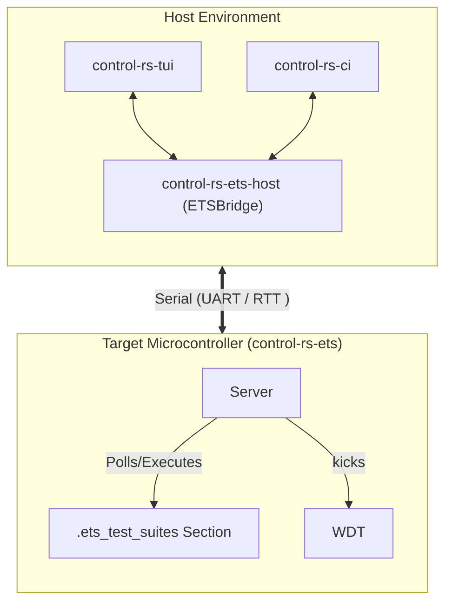
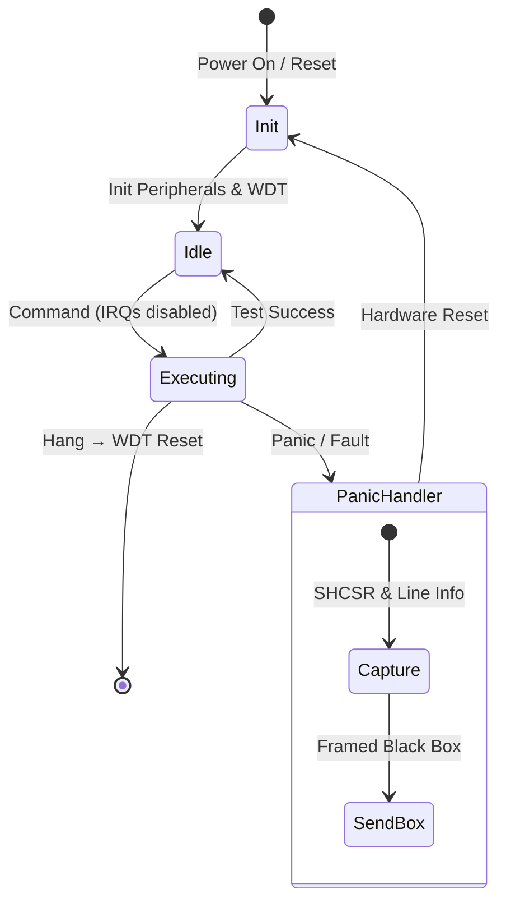

# Embedded Test Server (Design Document)


---

### 1. Introduction

While host-based unit tests execute quickly, they cannot capture physical timing
constraints, register configurations or real-time hardware behaviors. The
Embedded Test Server (ETS) bridges this gap by executing compiled firmware
directly on the target Microcontroller Unit (MCU), operating as an interactive,
persistent test server. Rather than running a static, sequential test suite that
requires restarting the board every run, the Server remains idle on the device,
waiting for commands.

---

### 2. Requirements

#### 2.1 Functional Requirements

- **FR-1 — Interactive Server Execution**: The target Server must run
  persistently as an idle loop, listening for host commands and executing tests
  on command without restarting the device between test cases.
- **FR-2 — Distributed Test Discovery**: The system must automatically collect
  and register test cases across multiple modules via linker metadata without a
  centralized runtime registry.
- **FR-3 — Telemetry Stream**: The target must transmit execution status,
  assertions, performance metrics and debugging logs back to the host over the
  active transport interface.
- **FR-4 — Crash Recovery**: On a test panic or hardware exception, the Server
  must capture diagnostic details (a "Firmware Black Box") and transmit them
  before initiating system recovery.
- **FR-5 — Cooperative lockup recovery**: If a test hangs, the target
  services a cooperative reset request from the host. Hardware watchdog
  recovery is out of scope (6.7).

#### 2.2 Non-Functional Requirements

- **NFR-1 — Real-Time Determinism**: Telemetry and control operations must
  maintain microsecond-level timing budgets so they do not induce jitter in
  the test under execution.
- **NFR-2 — Timing-Critical Logging**: The logging system must format without
  blocking the CPU or performing expensive on-target string formatting during tests.

#### 2.3 Constraints

- **C-1 — Zero Dynamic Allocation**: The target Server must compile under
  `#![no_std]` with strictly zero dynamic heap allocation.
- **C-2 — Memory & Flash Efficiency**: The target Server (excluding tests) must
  consume under 32 KB Flash and 8 KB RAM, with test suite descriptors residing
  in ROM.

---

### 3. Technical Overview

The ETS framework is structured as a dual-targeted system. `control-rs-tui`
and `control-rs-ci` are host frontends; `control-rs-ets-host::ETSBridge`
drives both. The target-side `Server` is ETS on a physical board and virtual
Embedded Test Server (virtual ETS) under QEMU.

1. **Host-Side (PC)**:
    - **`control-rs-ets-host`**: Reusable host library providing
      `ETSBridge`, framing protocols (`postcard`, `crc`), transport drivers,
      and headless test-runner state machines.
    - **`control-rs-tui`**: Standalone interactive terminal console
      (`control-rs-tui` → virtual ETS or `control-rs-tui` → ETS).
    - **`control-rs-ci`**: Repository quality-gate runner; drives headless ETS
      tests via `control-rs-ets-host` and writes `ci-report.md` and
      `ets-results.json`.
2. **Target-Side (MCU or emulator)**:
    - **ETS / virtual ETS**: The main loop that receives commands, dispatches
      test functions and manages the test state machine. ETS is the board
      path; virtual ETS is the same `Server` under QEMU.
    - **HostComms Concrete Drivers**: Drivers implementing UART (with DMA) or
      SEGGER RTT for data transport.
    - **Distributed Test Sections**: Test functions compiled into a dedicated
      ELF memory section.
    - **Watchdog & Panic Handler**: Systems ensuring target safety, diagnostic
      capture and system reset.



---

### 4. Architecture

#### 4.1. Workspace Structure & Cross-Compilation

To prevent compilation friction, `control-rs` implements a dual-targeted nested
Cargo workspace structure. This separates platform-independent business logic
from target-specific peripheral drivers:

```
control-rs (Root Workspace)
├── control-rs-ets/       # Target-side server event loop, settings registry and profiling (no_std)
├── control-rs-ets-host/  # Host transport, framing, and headless runner library (published)
├── control-rs-tui/       # Standalone interactive terminal console binary (published)
├── control-rs-ci/        # Repository quality-gate runner binary (publish = false)
├── control-rs-macros/    # Procedural macros for test suite setup and registry generation
├── examples/             # Target binary examples (qemu/teensy4) executing on-device
└── src/                  # Standard host-side library algorithms and modules
```

Because serial ports and USB debug bridges are exclusive resources, parallel
host execution will deadlock. Host-side integration tests (via `cargo test`)
must claim exclusive access and run in a single-threaded configuration using
the `--test-threads=1` flag in Cargo.

#### 4.2. Test Discovery via Linker Metaprogramming

To avoid the overhead of runtime registration or unstable nightly custom test
harnesses, test discovery is implemented as a "distributed slice" inside a
dedicated linker section named `.ets_test_suites`.

This mechanism is implemented today: `control-rs-macros` emits
`#[unsafe(link_section = ".ets_test_suites")]` static descriptors and
`control-rs-ets/build.rs` generates a linker script reserving the section with
`KEEP` and exposing `__ets_test_suites_start`/`__ets_test_suites_end` boundary
symbols.

Each test is declared using static structs:

```rust
pub struct ExecDescriptor {
    pub description: &'static str,
    pub name: &'static str,
    pub test_fn: fn(),
}

pub struct SuiteDescriptor {
    pub description: &'static str,
    pub executables: &'static [ExecDescriptor],
    pub name: &'static str,
    pub settings: &'static [&'static dyn Setting],
}
```

#### 4.3. Execution Model & Watchdog

The Server's runner executes test suites in a non-preemptive executive loop.
Once a test function is invoked, it retains total program control until
finished.

##### Vulnerability to Lockups

If a test enters an infinite loop or blocks waiting for an interrupt that never
fires, the MCU will freeze. The host will register a timeout, but the target
will remain unresponsive, requiring physical intervention.

##### Future Extension: Mitigation via Task Watchdogs

While cooperative tests run in a non-preemptive environment and can
theoretically lock up the target MCU, the current MVP executes without active
watchdog timers to simplify initial deployment.

To prevent target freezes in production, a future extension will introduce
**Task Watchdog**:

1. The hardware Watchdog Timer (WDT) is initialized on boot.
2. Individual test sub-tasks dynamically register virtual watchdogs with a
   central multiplexer.
3. The hardware WDT is fed only if *all* registered virtual watchdogs check in
   within their individual timeouts.

#### 4.4. Panic Handling, Firmware Black Box and State Recovery

When a test assertion fails, the custom `#[panic_handler]` takes over to capture
debugging forensic data and return the system to a clean state.

##### Firmware Black Box

Before rebooting, the panic handler constructs a diagnostic payload:

- Panic line number and file.
- Hardware interlock states.
- System Handler Control and State Register to capture fault details.

##### Programmatic Reset: SCB vs. WDT

- **Hard Resets**: If a test panics during a DMA write, a soft reset will reboot
  the CPU but leave the DMA active, corrupting RAM after the reboot.

If the system requires recovery from board-level power failures, external
supervisor ICs and bulk capacitors are integrated to allow the MCU to gracefully
shut down and prevent NVRAM corruption.

#### 4.5. Target-Side Execution Flow



---

### 5. Alternatives

#### 5.1. Debug-Probe-Driven execution (probe-rs + embedded-test)

* Instead of UART communication, the host uses `probe-rs` to flash tests and
  direct execution using ARM semihosting (`SYS_GET_CMDLINE`).
    - *Reason for Rejection*: Semihosting halts the CPU pipeline during I/O
      operations [1]. This introduces millisecond-level timing overhead,
      destroying the real-time determinism.

#### 5.2. Soft Reset (SCB::sys_reset)

* Using the CPU System Control Block to reboot.
    - *Reason for Rejection*: Leaves peripherals (like DMA) active, risking
      post-reboot memory corruption (Heisenbugs). Watchdog starvation is chosen
      for a guaranteed clean state.

#### 5.3. Third-Party Distributed Slice (`linkme`)

* A distributed slice is "a collection of static elements that are gathered into a contiguous section of the binary by the linker", whose elements "may be defined individually from anywhere in the dependency graph of the final binary" [2]. Adopting `linkme::DistributedSlice` in place of the hand-rolled
  `.ets_test_suites` linker section.
    - *Reason Not Adopted*: The custom mechanism is already implemented,
      tested and shipped (§4.2). Adopting `linkme` would trade that
      working code for reduced linker-script maintenance burden and
      `linkme`'s existing cross-platform linker-section portability; whether
      the migration is worth the churn remains open (§8).

#### 5.4. COBS Byte-Stuffed Framing

* Delimiting frames with COBS byte-stuffing (escaping the frame boundary byte
  out of the payload) instead of a length-prefixed header.
    - *Reason for Rejection*: The `HostComms` design
      (`documentation/ets/host-comm-design.md`, §4.4–§5) selected
      a sync-byte (`0xAA 0x55`) + big-endian length prefix + CRC-16-IBM-SDLC
      trailer to minimize target-side processing and framing overhead and
      this is what `control-rs-ets/src/comms.rs` implements. The tradeoff is a
      weaker resynchronization guarantee than COBS provides (§7).

---

### 6. Verification & Validation

#### 6.1 Approach

The implementation must produce evidence that the server discovers every
registered suite, executes cases on command without restarting between them,
reports profiling telemetry the host can attribute to a case, and recovers from
a target fault with a diagnosable record rather than a silent reset.

| Method | Mechanism |
|:-------|:----------|
| Requirements-based test | `#[test]` over the server state machine on the host with a mocked transport |
| Requirements-based test | Descriptor set recovered from the linked ELF compared against source annotations |
| On-target execution | ETS suites under QEMU across every triple in the matrix |
| On-target execution | Physical Teensy 4.1 session, including deliberate panic capture and cooperative reset |
| Resource usage evaluation | Stack painting and high-water measurement |
| Static analysis | `cargo clippy-ci`; inspection for allocation and for `core::fmt` on the hot path |
| Metamorphic relation | Frame resynchronization after injected line corruption |
| Coverage measurement | `cargo coverage` on host-testable modules |

Stack measurement uses painting, which is "very common in embedded systems and
is used by both FreeRTOS and Zephyr RTOS" and works by painting the stack with a
known value and measuring the highest location disturbed [3]. Its
complement, per-function static usage from `-fstack-usage`, is "difficult to use
when trying to analyze nested function calls" [3], which is why
the runtime high-water mark is the primary measure here and static analysis is
a separate task (`../ci/static-analyzer-design.md`).

Target: 80% line coverage of host-testable server logic, measured with
`cargo coverage`.

Excluded: target-specific driver and profiler implementations, which require
hardware or an emulator and are covered by on-target execution; the panic
handler, which is reachable only from a real fault; and generated descriptor
statics, which are data.

1. **Hardware run**: Execute the full suite on a Teensy 4.1, including a
   deliberate panic, and confirm the host receives a diagnosable record.
2. **Emulated matrix**: Execute the same suite under QEMU on every supported
   triple.
3. **Third-party adoption**: Build a downstream firmware project that declares
   its own suites and drives them through `control-rs-ets-host`.

#### 6.2 Acceptance

| Claim | Oracle | Measure | Bound |
|:------|:-------|:--------|:------|
| Discovery completeness | Source annotations | Suites and cases reported to the host | Exact set equality |
| Persistent execution | A suite of *n* cases | Target restarts during the suite | 0, absent an injected fault |
| Cycle telemetry attribution | Host-side case boundaries | Reports attributed to the running case | 1:1, no orphans |
| Panic capture | Deliberate panic on target | Panic record received by the host before reset | Received, with location |
| Cooperative reset | Target command listener | Reset request serviced via `Command::TryReset` | Acknowledged, clean reboot |
| Frame resynchronization | Injected corrupted bytes | Frames lost before the stream recovers | At most one |
| Allocation freedom | Disassembly of a target build | Allocator symbols | 0 |
| Hot-path formatting | Disassembly of a target build | `core::fmt` reachable from telemetry emission | None outside the `SetSetting` error path |

#### 6.3 Limits

- Active hardware watchdog timer lockup recovery. Target operates in a
  cooperative executive loop without an active WDT; lockup recovery is FR-5
  cooperative reset plus host session timeout.
- **NFR-1 (microsecond telemetry jitter)**: no measured on-target jitter
  bound is recorded; QEMU cycle figures are indicative per `ci-design.md` C-2.
- **C-2 (32 KB flash / 8 KB RAM)**: no `budget:` locator is enforced; the
  bound remains a design cap pending a size gate.
- Panic capture across a brownout, and descriptor-section corruption at
  runtime, are not established.

### 7. Performance & Resource Considerations

* **Flash/RAM Footprint**: The target-side Server must consume less than 32
  KB of Flash and 8 KB of RAM. Descriptors are stored strictly in ROM.
* **Real-Time Telemetry Jitter**: Telemetry transmission must not induce jitter
  in the 1000 Hz control loop. Hot-path telemetry is serialized as postcard
  enums with no on-target string formatting; `core::fmt` is confined to the
  `SetSetting` error path. `defmt` is not currently a dependency; adopting its
  deferred host-side formatting (sub-5 µs print overhead) remains an option if
  formatted logging is ever needed on the hot path.
* **DMA vs. Polling**: UART communications must use DMA to free CPU cycles
  during test runs.
* **Resynchronization Latency**: The implemented framing (sync-byte
  `0xAA 0x55` + big-endian length prefix + CRC-16-IBM-SDLC trailer)
  resynchronizes by scanning for the next sync-byte pair with a matching
  length and checksum, typically within one frame duration (< 1ms at 115200
  baud) under isolated bit errors. This is a weaker guarantee than COBS's
  escape-based delimiter, which can never appear mid-payload: a corrupted
  length field can produce a false frame boundary that a sync-byte scan alone
  cannot detect.

---

### 8. Risks & Open Questions

* **RTT Buffer Overflow**: In non-blocking RTT mode, high-frequency logging can
  overflow the target buffer if the debug probe doesn't read it quickly enough,
  leading to lost logs.
* **Watchdog Library Adoption**: `task-watchdog` multiplexes multiple task
  watchdogs into a single hardware watchdog timer [6], and `mwdg` provides a
  `no_std` software multi-watchdog library where tasks register nodes with
  individual timeouts [7]. Both address task watchdog multiplexing (§4.3);
  evaluating them against this crate's driver model remains an open task.
* **Preemptive Scheduling Alternative**: RTIC provides prioritization and
  preemptive multitasking with compile-time deadlock freedom [4]. Its
  priority-based preemptive model addresses the cooperative multitasking
  lockup hazard (§2) at the scheduler level rather than via watchdog
  multiplexing. Adopting it would represent a broader change to the target
  execution model and is deferred.
* **Test Discovery Dependency Tradeoff**: Replacing the custom
  `.ets_test_suites` mechanism with `linkme` (§5.3) trades working code for
  reduced linker-script maintenance burden; this trade remains open.
* **CI Orchestration Precedent**: Golioth's self-hosted-runner-with-hardware-labels
  pattern [8] is the primary reference model for CI integration with attached
  hardware, informing the host-side dependency partitioning across
  `control-rs-ets-host` and `control-rs-ci`.
* **TUI Distribution**: Resolved. The console ships as the standalone
  published binary `control-rs-tui`, installable with `cargo install`, so an
  end user consuming `control-rs` as a published crate obtains it without this
  repository. See `documentation/tui/tui-design.md`.

---

### 9. Development Plan

| Task / Feature                                                 | Description                                                                                                                                                                      | Estimated Effort |
|:---------------------------------------------------------------|:---------------------------------------------------------------------------------------------------------------------------------------------------------------------------------|:-----------------|
| **Step 1: Test Discovery (Linker)** — *Shipped*                | `.ets_test_suites` section discovery and linker `KEEP` directive, implemented in `control-rs-macros` and `control-rs-ets/build.rs`.                                              | Complete         |
| **Step 2: Postcard Messaging & Sync-Byte Framing** — *Shipped* | Postcard message schemas and sync-byte + length + CRC-16 framing, implemented per the `HostComms` design.                                                                        | Complete         |
| **Step 3: ETS & Driver Integration**                           | Implement target-side server loop with UART DMA / RTT drivers. Blocking-HAL vs. Embassy driver model undecided — no `embassy` dependency currently exists in the workspace (§8). | 3 days           |
| **Step 4: Watchdog & Panic Recovery**                          | Integrate multiplexed virtual task watchdogs (custom or adopted, §8) and custom HardFault panic handler.                                                                         | 2 days           |
| **Step 5: Host Orchestrator (`control-rs-ci`)**                | Build host-side CLI parser, ELF discovery tool, and headless test driver using `control-rs-ets-host`.                                                                            | 3 days           |

---

### 10. Revision History

| Revision | Date            | Author          | Description                                                                                                            |
|:---------|:----------------|:----------------|:-----------------------------------------------------------------------------------------------------------------------|
| 1.0      | May 23, 2026    | @MitchellDScott | Initial specification for the embedded hardware-in-the-loop test harness.                                              |
| 1.1      | July 18, 2026   | @MitchellDScott | Architecture & framing: integrated linker-section test discovery, watchdog multiplexing, and binary telemetry framing. |
| 1.2      | August 6, 2026  | @MitchellDScott | Wire protocol: adopted sync-byte/CRC-16 framing with `postcard`-encoded payloads and zero-copy dispatch.               |
| 1.3      | August 25, 2026 | @MitchellDScott | Module renaming: retitled Embedded Test Server (ETS) and renamed crate `control-rs-hil` → `control-rs-ets`.            |
| 1.4      | September 9, 2026 | @MitchellDScott | Packaging split: restructured host architecture into `control-rs-ets-host`, `control-rs-tui`, and private `control-rs-xtask`. |
| 1.5      | September 9, 2026 | @MitchellDScott | Project split: relocated to `documentation/ets/`; host frontends retargeted to `control-rs-ci` and `control-rs-tui`; research pair `embedded-test-server.json` + `.bib` restored. |
| 1.6      | September 9, 2026 | @MitchellDScott | Citation pass: converted numeric cites to author-year, replaced the mid-document reference list with a full IEEE list at the end, grounded the watchdog, linker and stack-measurement claims, restructured §6 per `vv-standards.md`. |
| 1.7      | September 9, 2026 | @MitchellDScott | Hardening pass: demoted status badge to Draft, rebuilt §6.4 traceability table (mapped FR-4/FR-5, eliminated phantom NFR-3), deferred watchdog to §6.7, removed TUI console from §9 Step 5, and standardized References. |
| 1.8      | September 15, 2026 | @MitchellDScott | Locator-only §6.4; FR-5 is cooperative reset; NFR-1 and C-2 listed in 6.7 until measured. |

---

## References

[1] embedded-test, "embedded_test," *docs.rs*. [Online]. Available: https://docs.rs/embedded-test/latest/embedded_test/. Accessed: Aug. 7, 2026.

[2] David Tolnay, "linkme," *dtolnay/linkme*. [Online]. Available: https://docs.rs/linkme/latest/linkme/struct.DistributedSlice.html. Accessed: Aug. 7, 2026.

[3] Noah Pendleton, "Measuring Stack Usage the Hard Way," *Interrupt (Memfault blog)*. [Online]. Available: https://interrupt.memfault.com/blog/measuring-stack-usage. Accessed: Aug. 7, 2026.

[4] RTIC project, "Real-Time Interrupt-driven Concurrency (RTIC)," *rtic-rs/rtic*. [Online]. Available: https://github.com/rtic-rs/rtic. Accessed: Aug. 7, 2026.

[5] James Munns, *panic-persist* (Version 0.3.0 (Jul. 17, 2026)). [Online]. Available: https://docs.rs/panic-persist/latest/panic_persist/. Accessed: Aug. 7, 2026.

[6] Piers Finlayson, *task-watchdog* (Version 0.1.2 (Mar. 30, 2025)). [Online]. Available: https://crates.io/crates/task-watchdog/0.1.1. Accessed: Aug. 7, 2026.

[7] vpetrigo, *mwdg* (Version 0.3.0 (Jul. 26, 2026)). [Online]. Available: https://docs.rs/mwdg/latest/mwdg/. Accessed: Aug. 7, 2026.

[8] Nick Miller, "How Golioth uses Hardware-in-the-Loop (HIL) Testing: Part 2," *The Golioth Developer Blog*. [Online]. Available: https://blog.golioth.io/golioth-hil-testing-part2/. Accessed: Aug. 7, 2026.
