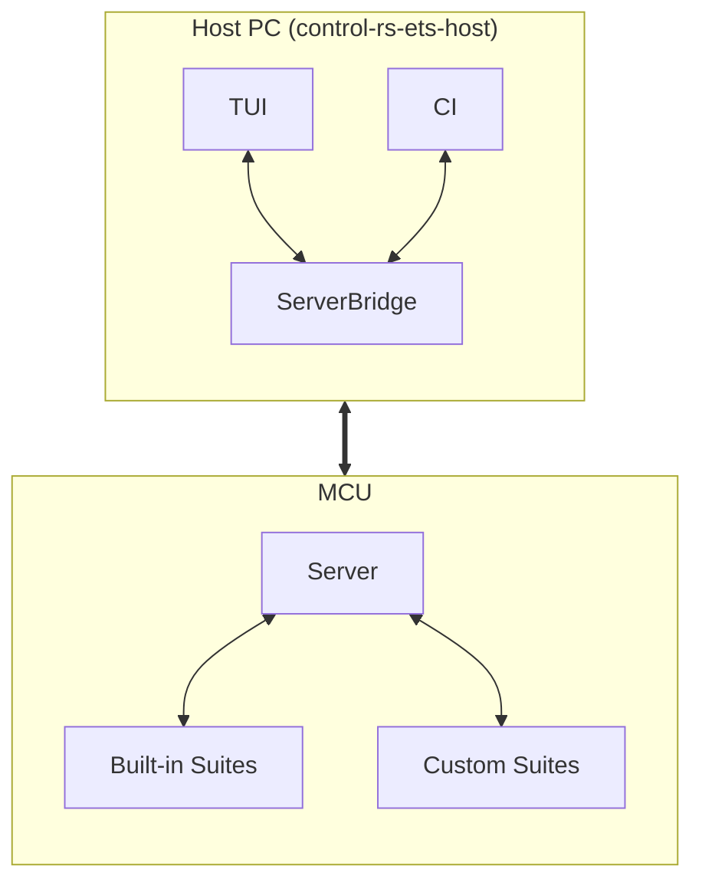

# Embedded Test Server (ETS)


---

### 1. Introduction

Traditionally, embedded hardware libraries treat benchmarks,
on-target ETS tests and Continuous Integration (CI) test matrices
as internal, closed-source chores.

### 2. Architecture & Component Mapping

The ETS infrastructure is decomposed into specialized crates and architectural
domains, each specified by an authoritative design document:

1. **Target Server Runtime**: [embedded-test-server-design.md](embedded-test-server-design.md)
   specifies the on-target execution loop, test dispatch, panic capture, and
   reboot lifecycles under `#![no_std]`.
2. **Target Transport Abstraction**: [host-comm-design.md](host-comm-design.md)
   specifies the `HostComms` middleware trait, peripheral drivers, and
   sync-header CRC-16 `postcard` packet framing.
3. **Profiling Instrumentation**: [cpu-profiler-design.md](cpu-profiler-design.md)
   specifies cycle-accurate benchmarking, execution duration timers, and stack
   high-water mark evaluation.
4. **Test Case Registration**: [test-suite-design.md](test-suite-design.md) and
   `../macros/macros-design.md` specify distributed linker-section discovery and
   attribute macros.
5. **Host Transport & Session Bridge**: [../ets-host/ets-host-design.md](../ets-host/ets-host-design.md)
   specifies `control-rs-ets-host`, owning subprocess/serial connections, framing
   decoders, and headless run orchestrations.
6. **Interactive Presentation**: [../tui/tui-design.md](../tui/tui-design.md)
   specifies `control-rs-tui`, providing a real-time terminal dashboard over
   the host bridge.
7. **CI Quality Gates**: [../ci/ci-design.md](../ci/ci-design.md) specifies
   `control-rs-ci`, running automated headless test sweeps across QEMU and
   physical hardware targets.

---

### 3. Technical Overview

The published crate `control-rs` acts as an umbrella crate, re-exporting the
necessary tooling components so users only need a single dependency.

**Workspace crates:**

* **`control-rs`**: Implementations of types, algorithms and sub-programs.
* **`control-rs-ets`**: Interactive server to execute tests and benchmarks.
* **`control-rs-macros`**: Helper macros to wrap tests and settings in test
  suites and setup function in a `main()`.
* **`control-rs-ets-host`**: Host transport, framing and headless test runner.
* **`control-rs-tui`**: Interactive terminal console over `control-rs-ets-host`.
* **`control-rs-ci`**: Repository quality-gate runner over `control-rs-ets-host`.



### 4. Architecture

#### 4.1. Execution Context

To ensure maximum compatibility across different development boards and
architectures, the server will require the user to initialize a generic object.
This object provides the specific drivers for cpu profiling and communication:

* **HostComms:** A generic trait acting as a middleware for firmware-to-host
  communications. Users implement this for the available communication
  peripherals (e.g., UART, USB).
* **CPUProfiler:** A generic trait that allows users to configure CPU
  profiling utilities for ETS. Users implement this trait to
  provide low-level access to CPU cycle counters, nanosecond system timers,
  stack pointers, stack painting/scanning and critical sections.

#### 4.2. Communication & Transport Layer

The communication protocol used between the Server on the MCU and the host TUI
is a simple frame-based binary packet structure. This allows the host TUI to
parse continuous telemetry streams byte-by-byte instead of blocking until a
full message has arrived.

#### 4.3. End-User Integration Model

This is the primary user-facing benefit. Users can easily set up and run
benchmarks using their hardware's specific HAL.

##### 4.3.1. `Cargo.toml`

```toml
[dependencies]
control-rs = { version = "1.0", features = ["ets"] }
teensy4-bsp = "0.4" # User's specific hardware HAL (Teensy 4.1)

[[bin]]
path = 'src/bin/custom_drone_benchmarks.rs'
```

##### 4.3.2. `.cargo/config.toml`

```toml
[target.thumbv7em-none-eabihf]
runner = [
    "bash",
    "-c",
    "rust-objcopy -O ihex \"$0\" \"${0}.hex\" && teensy_loader_cli -w -v --mcu=TEENSY41 \"${0}.hex\""
]
rustflags = [
    "-C", "link-arg=-Tt4link.x",
]
```

##### 4.3.3. Application: `src/bin/custom_board.rs`

Users can invoke the harness from the command line:

```bash
cargo run --release \
    --bin custom_board \
    --target thumbv7em-none-eabihf
```