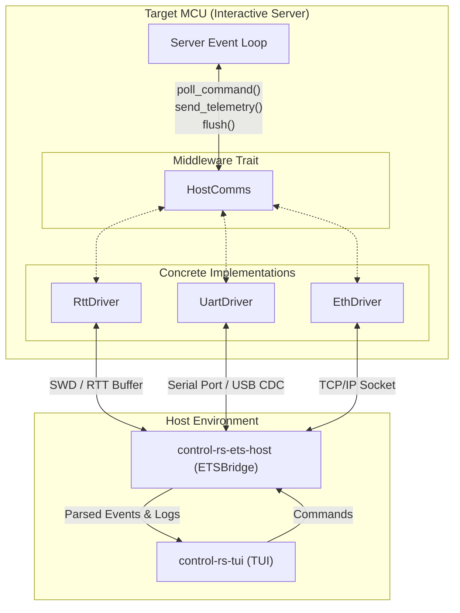

# HostComms (Design Document)


---

### 1. Introduction

The `HostComms` trait is designed to provide a unified, hardware-agnostic
communication abstraction for target firmware operating in resource-constrained
environments. This allows the Embedded Test Server (ETS) running on-target to
separate physical transport mechanics (such as UART, Ethernet MAC/PHY, or debug
probes) from test execution and telemetry dispatch. Host-side demultiplexing,
session management, and decoding are owned by `control-rs-ets-host::ETSBridge`
(`../ets-host/ets-host-design.md`), while user presentation is handled by
`control-rs-tui` (`../tui/tui-design.md`).

---

### 2. Requirements

#### 2.1 Functional Requirements

- **FR-1 — Target Transport Abstraction**: The target firmware must expose a
  hardware-agnostic API to poll commands, transmit telemetry, and flush data
  without coupling test execution logic to physical peripheral hardware.
- **FR-2 — Bidirectional Packet Exchange**: The system must support host-to-target
  command packets and target-to-host telemetry packets over a shared stream.
- **FR-3 — Catastrophic Failure Capture**: The target must capture panics and
  hardware exceptions, format them with timestamps and backtraces, and transmit
  them as prioritized telemetry before halting or rebooting.
- **FR-4 — Explicit Wire-Contract Revision**: The protocol carries an explicit
  `PROTOCOL_VERSION` revision identifier in target telemetry that a host checks
  before acting on any payload, preventing misinterpretation of schema changes.
- **FR-5 — Target Hardware and Environment Telemetry**: The target must transmit
  hardware identity and environment metadata—including board identifier, core
  clock frequency, FPU status, and link configuration—enabling the host to
  interpret timing and platform capabilities without local out-of-band assumptions.

#### 2.2 Non-Functional Requirements

- **NFR-1 — Low Latency & Determinism**: Telemetry serialization and transmission
  must introduce $\le 10\ \mu\text{s}$ jitter into the nominal 1 kHz control loop deadline.
- **NFR-2 — Bounded Stack & Predictable Footprint**: Serialization paths must
  operate within bounded, pre-allocated stack envelopes without recursion or
  large intermediate copies.
- **NFR-3 — High Bandwidth Efficiency**: The protocol must minimize transport
  payload footprint via binary serialization, shifting formatting and UI state
  management onto the host.

#### 2.3 Constraints

- **C-1 — Strict `#![no_std]` and Zero Heap Allocation**: The target firmware
  library must compile under `#![no_std]` with strictly zero dynamic heap
  allocation.
- **C-2 — Stack Footprint Restrictions**: Peak stack usage during message
  serialization must remain within the per-target stack budget specified in
  `cpu-profiler-design.md` to prevent overflow on memory-constrained
  microcontrollers.
- **C-3 — Physical Interface Scope**: Target transport implementations are
  restricted to standard embedded peripherals (UART, Ethernet MAC/PHY) or
  hardware debug probes (SWD/JTAG).

---

### 3. Technical Overview

The `HostComms` architecture focuses on the **target-side (microcontroller)**
execution environment:

1. **Target-side Trait & Drivers**: A zero-cost abstraction trait (`HostComms`)
   and associated concrete peripheral drivers (UART DMA, SEGGER RTT, Ethernet MAC/PHY)
   that pack telemetry data, frame packets, and poll for inbound commands without dynamic
   allocation.
2. **Wire Framing & Postcard Payloads**: Compact binary framing (Sync Header, length,
   payload, CRC-16) wrapping `postcard`-serialized Rust enum schemas.
3. **Host Counterpart**: The target-side stream is consumed on the PC host by
   `control-rs-ets-host::ETSBridge` (`../ets-host/ets-host-design.md`), which
   demultiplexes packets and feeds decoded events to `control-rs-tui`
   (`../tui/tui-design.md`).

Target implementation relies on:

* Bare-metal embedded Rust (`#![no_std]`, `core::fmt`), asynchronous peripherals, or DMA drivers.
* High-efficiency binary serialization format design and bitwise framing algorithms (`postcard`, sync-byte framing, CRC-16).
* Fast panic hook telemetry for fatal trap capture.



---

### 4. Architecture

#### 4.1. Middleware Trait

The core of the abstraction is the `HostComms` trait. Implementations of this
trait encapsulate the hardware-specific details of reading and writing bytes.

```rust
pub trait HostComms {
    /// The error type associated with transport failures.
    type Error;

    /// Closes the communication interface (e.g. signaling semihosting exit).
    fn close(&mut self) {}

    /// Closes the communication interface with a failure/error status.
    fn close_on_failure(&mut self) {}

    /// Flush any pending buffered data out to the physical interface.
    fn flush(&mut self) -> SendResult<Self::Error>;

    /// Read incoming bytes and try to parse a Command.
    ///
    /// This should be non-blocking.
    fn poll_command(&mut self) -> PollResult<Self::Error>;

    /// Send a telemetry message to the host.
    fn send_telemetry(
        &mut self,
        telemetry: &Telemetry<'_>,
    ) -> SendResult<Self::Error>;
}
```

The associated type `Error` allows concrete drivers to bubble up
hardware-specific failures (e.g., framing errors, overflow flags, socket
disconnects) to the calling Server loop.

#### 4.2. Command Schema & Binary Serialization

Commands originating from the host are defined by a strict, shared Rust schema
to ensure structural alignment:

```rust
#[derive(Debug, Clone, PartialEq, Eq)]
pub enum Command {
    /// Request the target to stream the list of all suites, tests and settings.
    ListSuites,
    /// Request execution of a specific test.
    RunExecutable {
        /// The ID of the test suite to execute.
        suite_id: u16,
        /// The ID of the test within the suite.
        test_id: u16,
    },
    /// Update a setting's value.
    SetSetting {
        /// The ID of the setting to update.
        setting_id: u16,
        /// The ID of the suite containing the setting.
        suite_id: u16,
        /// The new value of the setting.
        value: SettingValue,
    },
    /// Request the target to reset.
    TryReset,
}

#[derive(Debug, Clone, PartialEq, Eq)]
pub enum Telemetry<'a> {
    DiscoveryComplete,
    Log(LogMessage<'a>),
    MetricReport(MetricReport),
    SettingInfo(SettingInfo<'a>),
    SuiteInfo(SuiteInfo<'a>),
    TargetPanic(PanicReport<'a>),
    TestInfo(TestInfo<'a>),
    TestStateChange(TestStateChange),
    /// Appended variant carrying protocol revision and target hardware metadata.
    TargetInfo {
        protocol_version: u8,
        board_id: u16,
        core_clock_hz: u32,
        fpu_flags: u8,
    },
}
```

To minimize parsing overhead and memory usage in a `#![no_std]` environment, the
architecture uses the **`postcard`** crate.

Postcard achieves a minimal wire footprint through:

* **Varints**: Variable-length integer encoding that compresses smaller
  numbers (like enum variants and array bounds) into fewer bytes.
* **Endianness**: Explicit Little-Endian byte ordering, which matches the native
  architecture of common microcontrollers (ARM Cortex-M, RISC-V), avoiding
  CPU-intensive byte-swapping.
* **Zero Allocation**: Serialization is done directly into pre-allocated static
  buffers (such as `heapless::Vec`) or streaming writers to mitigate stack
  overflow risks on low-resource targets.


##### 4.2.1. Discriminant Stability and `PROTOCOL_VERSION`

`postcard` encodes a tagged union as "a `varint(u32)` containing the
discriminant, followed by the encoded value matching that discriminant"
[1], and encodes a struct "as the elements that comprise it, in
their order of definition (top to bottom)" [1]. Variant order and
field order are therefore part of the wire contract, not an implementation
detail: inserting a variant ahead of an existing one renumbers every later
discriminant, and the resulting frame still passes its CRC.

Serde's externally tagged representation, which postcard uses, is
"characterized by being able to know which variant we are dealing with before
beginning to parse the content of the variant" [2], and is "the only
one that works in no-alloc projects" [2], so the target cannot adopt
a self-describing alternative under C-1 and NFR-2.

FR-4 and FR-5 are discharged by `PROTOCOL_VERSION` and `Telemetry::TargetInfo`.
`PROTOCOL_VERSION` is a `u8` constant in `control-rs-ets::comms` incremented
whenever `Command` or `Telemetry` gains, loses, or reorders a variant, or
whenever a variant's payload changes shape. The target transmits
`Telemetry::TargetInfo` carrying `protocol_version`, `board_id`, `core_clock_hz`,
and `fpu_flags` (obtained with the assistance of the target profiler). A host
that receives a `protocol_version` value other than its own compiled constant
terminates the session immediately and reports the mismatch; it does not attempt
to decode further frames. `control-rs-ets-host` implements the host half of this
check (`../ets-host/ets-host-design.md` §4.3), while `control-rs-tui`
(`../tui/tui-design.md` FR-1) consumes the board and clock metadata to populate
the header.

Two rules keep the constant honest:

- Variants are appended, never inserted or reordered. Appending leaves existing
  discriminants unchanged.
- Existing variant payload fields and their order are immutable; modifying,
  removing, or reordering fields requires defining a new variant or incrementing
  `PROTOCOL_VERSION`.

#### 4.3 Log Payload Representation

Standard string formatting on a microcontroller is computationally and space-expensive,
bloating target flash memory with static templates and consuming excessive CPU cycles
to interpolate values. In this baseline, log messages are captured as structured byte
or string slices within `postcard`-serialized enums with no on-target string formatting
(see `embedded-test-server-design.md` §7). Deferred formatting via external compression
crates is deferred to future work (see §6.3):

```rust
#[derive(Debug, Clone)]
#[cfg_attr(feature = "serde", derive(serde::Serialize, serde::Deserialize))]
pub struct LogMessage<'a> {
    /// The log text payload.
    pub payload: &'a str,
    /// The ID of the test suite.
    pub suite_id: u16,
    /// The ID of the test executable.
    pub test_id: u16,
    /// Microseconds elapsed since boot / epoch.
    pub timestamp_us: u64,
}
```

#### 4.4. Packet Framing & Consistency

Serial channels like UART operate as continuous byte streams without packet
boundaries. To segment individual commands and telemetry logs, the system
utilizes a custom framed binary packet structure with Sync Headers and CRC-16
integrity validation:

* **Sync Header**: 2 bytes (`0xAA 0x55`) used to identify the beginning of a
  frame.
* **Payload Length**: 2 bytes (big-endian) defining the size of the serialized
  postcard payload.
* **Postcard Payload**: The serialized data block (limited to a maximum of 512
  bytes).
* **Integrity Check**: A 2-byte (big-endian) CRC-16 checksum (calculated using
  `CRC_16_IBM_SDLC`) appended at the end of the frame payload.
* **Single-Pass Decoding**: The host `FrameReader` processes incoming streams
  statefully byte-by-byte, checking for the sync header, validating lengths and
  confirming the CRC-16 checksum before deserializing.

#### 4.5. Target-Side Driver Implementations

Users are responsible for implementing the `HostComms` trait for their target
board.

```rust
// Example skeleton for a target UART implementation
struct UartComms {
    uart: hardware::Uart,
    buffer: heapless::Vec<u8, 256>,
}

impl HostComms for UartComms {
    type Error = hardware::Error;

    fn poll_command(&mut self) -> Result<Option<Command>, Self::Error> {
        // Non-blocking read and framing parsing logic
        Ok(None)
    }

    fn send_telemetry(&mut self, log: &LogMessage) -> Result<(), Self::Error> {
        // Serialize via postcard, add sync headers and CRC-16 checksum and write to UART DMA buffer
        Ok(())
    }

    fn flush(&mut self) -> Result<(), Self::Error> {
        // Wait for DMA write to complete
        Ok(())
    }
}
```

#### 4.6. Host Interoperability

On the host side, `control-rs-ets-host::ETSBridge`
(`../ets-host/ets-host-design.md`) consumes the byte stream generated by
`HostComms`. Standard environments utilize `serial2` for direct serial (UART/USB
CDC) port communication and process isolation, or debug utilities like `probe-rs`
for flashing and RTT buffer polling over SWD/JTAG. The target-side `HostComms`
implementation remains entirely agnostic to which host mechanism reads its framed
stream.

---

### 5. Alternatives

* **Text-Based Serialization (JSON, XML)**: Considered for ease of debugging but
  rejected. Verbose text formats consume excessive bandwidth and require
  significant CPU cycles and allocation on the target to parse and format.
* **Protobuf & FlatBuffers**: Protobuf requires a memory-allocation-heavy
  deserialization step, which is unacceptable under strict `#![no_std]`.
  FlatBuffers avoids parsing overhead (zero-copy) but consumes a larger memory
  footprint due to strict alignment padding and has a less ergonomic API for
  bare-metal targets. Postcard was selected for its native Rust type mapping,
  zero-allocation design and variable-length integer compression. Although COBS
  framing was considered for packet delimiting, the final implementation uses a
  sync-byte and length-based frame header with CRC-16 checksums to minimize
  target-side processing and framing overhead.
* **Standard Printing (`printf`, `core::fmt`)**: Rejected for primary logging
  because it stores massive static format string templates in target flash
  memory and formats them at runtime, causing significant execution delays.
  Deferred formatting (`defmt`) was chosen.

---

### 6. Verification & Validation

#### 6.1 Approach

The implementation must produce evidence that a command survives serialization,
framing and reconstruction unchanged; that the wire contract is pinned against
silent drift; that telemetry does not violate the target's real-time budget;
and that the target transmits a diagnosable record of its own crash.

| Method | Mechanism |
|:-------|:----------|
| Requirements-based test | `#[test]` round-tripping every `Command` and `Telemetry` variant through serialization, framing and reconstruction |
| Requirements-based test | Golden byte vectors: one checked-in encoding per variant, asserted against the serializer |
| Metamorphic relation | `#[test]` flipping one payload byte and asserting the frame is rejected, not delivered |
| Requirements-based test | `#[test]` asserting a discovery response carrying a foreign `PROTOCOL_VERSION` is refused before any payload is acted on |
| Requirements-based test | `#[test]` asserting `Telemetry::TargetInfo` packet contains valid protocol version, board ID, clock frequency, and FPU flags |
| Resource usage evaluation | Stack-depth measurement across the serialization path; `no_alloc` review |
| On-target execution | ETS timing regression measuring jitter introduced by telemetry |
| On-target execution | Fault injection: panic, hard fault and brownout on a physical target |
| On-target execution | Verification of `Telemetry::TargetInfo` against physical board configuration |
| Static analysis | `cargo clippy-ci`; source inspection for allocation in the transport path |
| Compile-time shape check | Target builds for every supported triple |
| Coverage measurement | `cargo coverage` |

Target: 90% line coverage of the `comms` module, measured with
`cargo coverage`.

Excluded: target-specific driver implementations, which require hardware and
are covered by on-target execution; and the panic transmission path, which is
reachable only from a real fault and is covered by fault injection.

* **Fault injection**: Simulate on-target panics, hard faults and brownouts and
  confirm crash details reach the host.
* **Hardware portability**: Deploy the same server logic over UART DMA and
  SEGGER RTT to confirm transport independence.
* **Cross-revision check**: Run a host built against one `PROTOCOL_VERSION`
  against a target built at another and confirm the session is refused with a
  named mismatch rather than mis-decoding.

#### 6.2 Acceptance

| Claim | Oracle | Measure | Bound |
|:------|:-------|:--------|:------|
| Round-trip fidelity | The serializer's own output re-read by the deserializer | Field equality across every variant | Exact |
| Golden vector stability | Checked-in bytes per variant | Byte equality | Exact |
| Corrupted frame rejection | Frame with one flipped payload byte | Frames delivered upward | 0 |
| Version mismatch refused | Discovery response with a foreign `PROTOCOL_VERSION` | Session outcome | Refused before any command is issued |
| Target metadata accuracy | Hardware registers and sys_clock | Frequency and board ID equality | Exact match with target board config |
| Serialization stack cost | Stack painting across the encode path | Peak bytes | Within the per-target budget of `cpu-profiler-design.md` |
| Telemetry jitter | Control-loop period with and without telemetry enabled | Added jitter | $\le 10\ \mu\text{s}$ (NFR-1) |
| Allocation freedom | Disassembly and source inspection | Allocator symbols on the transport path | 0 |

The `CRC_16_IBM_SDLC` parameterization is taken from the `crc` crate's
well-known algorithm set, whose documented check value for the standard input
`123456789` is `0x906e` [3]; the implementation is expected to
reproduce that value.

#### 6.3 Limits

- Compatibility across protocol revisions. FR-4 detects a mismatch; nothing
  here establishes that any two revisions can interoperate, and postcard places
  cross-revision compatibility outside the format's scope [1].
- Ethernet and WebSocket transports. C-3 admits Ethernet, but driver implementation
  and network performance are not currently verified.
- Behaviour under sustained line corruption. Rejection is tested for a single
  corrupted frame, not for a continuously noisy link.
- Absolute latency of the link. NFR-1 bounds added jitter, not end-to-end
  latency, and no latency figure is measured.
- `defmt` compression ratios and deferred formatting. Deferred as future work;
  active baseline is postcard binary schemas without on-target formatting.
- Hardware watchdog integration and lockup recovery. Deferred to future work;
  target reset operates cooperatively via `Command::TryReset`.

### 7. Performance & Resource Considerations

* **Solver Timing Budget**: ETS solvers operate on strict millisecond steps. The
  entire target execution block—including controls, sensor reads and telemetry
  serialization—must complete before the solver step expires. Late responses are
  flagged as timing failures.
* **Static Allocation Bounds**: All target buffer structures are statically
  allocated using `heapless` types. Storing large data blocks requires chunking
  to prevent stack overflows, as no heap is available.
* **Transport Comparison**:

| Transport Protocol  | Physical Interface  | CPU Overhead                                | Implementation Complexity                               | Primary Use Case in HIL Architectures                         |
|:--------------------|:--------------------|:--------------------------------------------|:--------------------------------------------------------|:--------------------------------------------------------------|
| **UART (with DMA)** | TX, RX, GND         | Low (DMA handles data movement)             | Medium (Requires async executor and DMA configuration)  | Standard serial telemetry, electrically isolated test setups. |
| **Ethernet**        | RJ45 / Twisted Pair | High (Requires full TCP/IP stack execution) | High (Requires network routing and MAC/PHY integration) | High-bandwidth, remote networked test rigs.                   |
| **SEGGER RTT**      | SWD / JTAG pins     | Minimal (In-memory copy only)               | Low (Utilizes existing debug hardware)                  | High-speed, low-overhead tracing and debug polling.           |

---

### 8. Risks & Open Questions

* **ELF Synchronization Risk**: Since `defmt` strips string templates from the
  binary, the host must use the exact matching ELF file to decode log indices.
  If the target firmware is updated and the host references an outdated ELF
  file, the telemetry log will decode as gibberish.
* **Non-Blocking RTT Overflow**: In non-blocking RTT mode, if telemetry is
  generated faster than the SWD probe polls target RAM, older packets will be
  overwritten. This data loss risk must be monitored via buffer occupancy
  metrics.
* **probe-rs Board Support Limits**: Some legacy or highly custom
  microcontrollers are not supported by the `probe-rs` CMSIS-Pack library.
  Developers on these platforms must fall back to standard serial/TCP inputs,
  losing SWD background RAM access but maintaining basic HostComms telemetry.

---

### 9. Development Plan

| Task / Feature                                       | Description                                                                                                                                | Estimated Effort |
|:-----------------------------------------------------|:-------------------------------------------------------------------------------------------------------------------------------------------|:-----------------|
| **Step 1: Core Serialization & Framing** — *Shipped* | Postcard schemas, sync-header framing/deframing and CRC-16 verification, implemented in `control-rs-ets/src/comms.rs`.                     | Complete         |
| **Step 2: Target Trait & Drivers**                   | Implement the `HostComms` trait on the target, writing drivers for Embassy UART DMA and SEGGER RTT buffers.                                | 2 weeks          |
| **Step 3: Target Crash Handlers**                    | Integrate `panic-probe` and `panic-persist` handlers to write backtrace logs to active buffers and persistent RAM regions.                 | 1 week           |
| **Step 4: TargetInfo Wire Dispatch**                 | Repair (outstanding): implement `Telemetry::TargetInfo` carrying `PROTOCOL_VERSION`, board ID, core clock frequency, and FPU flags. Blocks host FR-8 and TUI FR-1 until landed. Tests: host 6.2 protocol-mismatch row; golden vector for the new variant. | 1 week           |
| **Step 5: Target Hardware Integration**              | Verify framed transmission and crash capture across Teensy 4.1 hardware and QEMU ARM Cortex-M emulation.                                   | 2 weeks          |

---

### 10. Revision History

| Revision | Date           | Author          | Description                                                                                                               |
|:---------|:---------------|:----------------|:--------------------------------------------------------------------------------------------------------------------------|
| 1.0      | May 23, 2026   | @MitchellDScott | Initial draft outlining the `HostComms` transport trait.                                                                  |
| 1.1      | July 18, 2026  | @MitchellDScott | Protocol integration: added binary telemetry framing, serialization protocols, and remote tooling research.               |
| 1.2      | August 6, 2026 | @MitchellDScott | Transport standardization: standardized on `serial2` host transport, postcard payload schemas, and target crash handling. |
| 1.3      | September 9, 2026 | @MitchellDScott | Packaging alignment: allocated host DEMUX and transport management to `control-rs-ets-host` and presentation to `control-rs-tui`. |
| 1.4      | September 9, 2026 | @MitchellDScott | Project split: relocated to `documentation/ets/host-comm-design.md` from the retired xtask project. |
| 1.5      | September 9, 2026 | @MitchellDScott | Wire contract: added FR-4 and `PROTOCOL_VERSION` with append-only variants and golden byte vectors; cited the postcard encoding rules; §6 restructured per `vv-standards.md`. |
| 1.6      | September 9, 2026 | @MitchellDScott | Hardening pass: narrowed scope to target trait/drivers, demoted badge to Draft, added FR-5 and Telemetry::TargetInfo, deduplicated NFR-2/C-1, deferred defmt and watchdog to §6.7, and updated §9. |
| 1.7      | September 16, 2026 | @MitchellDScott | Step 4 marked outstanding repair: `TargetInfo` / `PROTOCOL_VERSION` still absent on the wire; blocks host FR-8 and TUI FR-1. |

---

## References

[1] J. Munns, "Wire format," *The postcard wire specification*. [Online].
Available: https://postcard.jamesmunns.com/wire-format. Accessed: Sep. 9, 2026.

[2] Serde contributors, "Enum representations," *Serde documentation*.
[Online]. Available: https://serde.rs/enum-representations.html. Accessed:
Sep. 9, 2026.

[3] crc-rs contributors, *crc*: Rust implementation of CRC with support of
various standards. [Online]. Available: https://docs.rs/crc. Accessed:
Sep. 9, 2026.
