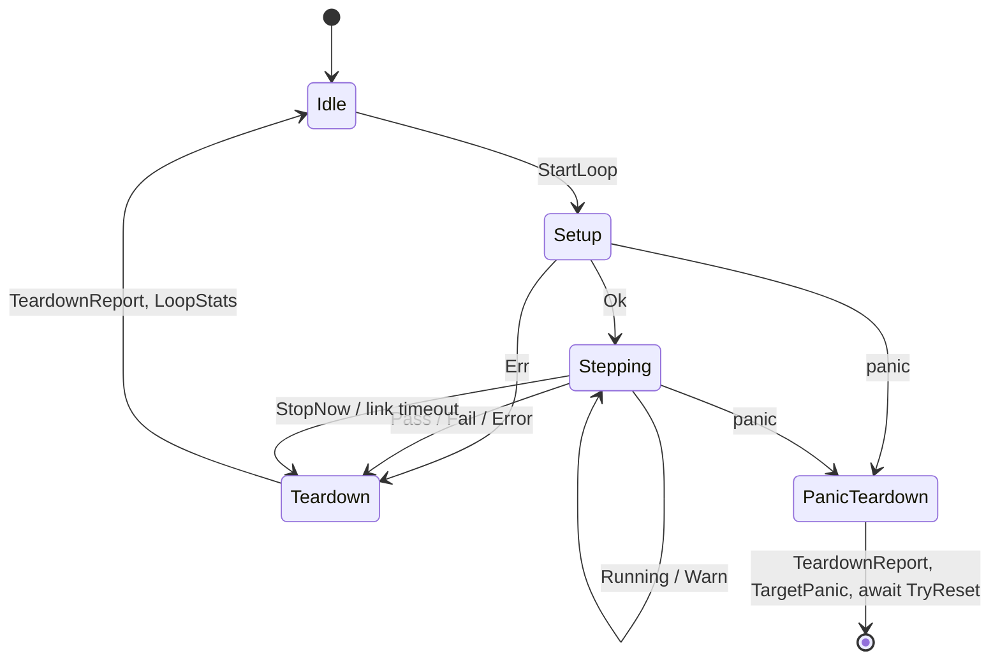

# Loop Suites (loop-suite)

---

### 1. Introduction

An ETS case is a `fn()` that the server runs once inside a critical section
and reports as passed when it returns. Hardware-in-the-loop work needs the
opposite: code that runs continuously with its interrupt handlers live, that
the host can tune and stop, and that always returns the hardware to a safe
state. A loop suite provides that inside `control-rs-ets`, with an execution
environment equivalent to a sketch: setup once, step repeatedly [1], [2], [3],
plus a guaranteed teardown. Lifecycle and goal semantics for production firmware
are out of scope; they belong to a separate Layer 2 runtime server
([ADR-0002](../adr/0002-separate-verification-and-runtime-servers.md)).

Primary usage scenarios:

- **Closed-loop hardware run**: A developer runs a motor-control loop on a
  board with its PWM and ADC interrupts active, adjusts gains from the host
  and stops the run. Failure: interrupts are masked, the loop is starved by
  the server, or a setting change is not applied until the run ends.
- **Self-terminating test**: A loop judges its own progress and ends the run
  with a verdict, or keeps running while reporting a warning. Failure: the
  verdict or message is lost or attributed to the wrong suite.
- **Fault containment**: The host stops the run, the host link drops, setup
  fails or the loop panics while hardware is energized. Failure: teardown
  does not run, runs twice, or its own failure is not visible to the host.
- **Emulator regression**: CI runs the same loop suite on the QEMU targets
  for a bounded duration. Failure: the suite only runs on hardware or the
  run cannot be bounded.
- **Coexistence**: A firmware image carries existing suites and loop suites.
  Failure: existing case indexing, wire encoding or profiling changes.

---

### 2. Requirements

#### 2.1 Functional Requirements

- **FR-1 — Loop suite declaration**: A loop suite consists of a setup, a step
  and a teardown function plus settings, is declared without a central
  registry and is discovered alongside existing suites.
- **FR-2 — Continuous execution**: Starting a loop suite runs setup once and
  then runs the step function repeatedly until the run ends.
- **FR-3 — Step status**: Each step returns one of `Running`, `Warn`, `Pass`,
  `Fail` or `Error`; `Running` and `Warn` continue the run, the other three
  end it, and every status may carry a message.
- **FR-4 — Executive stop**: A host stop request ends the run at the next
  step boundary and returns control to the server.
- **FR-5 — Guaranteed teardown**: Teardown runs exactly once for every run
  whose setup was invoked, whether the run ends by status, stop request,
  setup failure, link loss or panic.
- **FR-6 — Teardown outcome**: Teardown reports success or failure with an
  optional message, and the host receives it separately from the run verdict.
- **FR-7 — Live settings**: Setting updates are applied between steps while a
  run is active.
- **FR-8 — Sample stream**: A step can emit an opaque sample payload that the
  host receives during the run, and samples lost to back-pressure are counted
  and reported.
- **FR-9 — Host link supervision**: A loop suite can declare a host link
  timeout; when no host frame arrives within it, the run ends with teardown.
- **FR-10 — Run statistics**: The end of a run reports the step count and
  elapsed time.
- **FR-11 — Host session control**: The host library starts and stops loop
  suites and records status, messages, teardown outcome, samples and
  statistics per run.
- **FR-12 — Bounded headless run**: The headless runner runs each loop suite
  for at most a caller-given duration and records its outcome.
- **FR-13 — Console control**: The console lists loop suites, starts and stops
  them and shows status, message, teardown outcome and statistics.

#### 2.2 Non-Functional Requirements

- **NFR-1 — Interrupt transparency**: Outside the panic path, the loop-suite
  runner never masks interrupts during setup, steps, teardown or the work
  between steps.
- **NFR-2 — Constant step-boundary cost**: Server work between two steps is at
  most one non-blocking command poll, one sample transfer, one status frame
  and one flush, independent of run length.
- **NFR-3 — Wire compatibility**: Existing command and telemetry encodings are
  unchanged; additions are appended and the protocol revision increments.

#### 2.3 Constraints

- **C-1 — Inherited allocation bound**: Conforms to
  `embedded-test-server-design.md` C-1.
- **C-2 — Inherited target architectures**: Conforms to
  `test-suite-design.md` C-2.
- **C-3 — Inherited global state rule**: Conforms to `test-suite-design.md`
  C-3.
- **C-4 — Existing suites unchanged**: Existing suites keep their
  descriptors, indices and the profiling of `cpu-profiler-design.md` FR-5;
  loop suites do not use FR-5.
- **C-5 — No new dependencies**: The design adds no third-party crate.
- **C-6 — Layer boundary**: `control-rs-ets` and its host crates depend on no
  Layer 2 crate, and loop suites carry no lifecycle or goal semantics.
- **C-7 — Single active run**: At most one loop suite runs at a time, and the
  server accepts no case or second run while it is active.

---

### 3. Technical Overview

Loop suites extend four crates. `control-rs-ets` gains the descriptor, the
run state machine in `Server` and the wire additions. `control-rs-macros`
gains `#[ets_loop_suite]`. `control-rs-ets-host` gains run control in its
session and headless runner, and `control-rs-tui` gains a run view. The design
builds on `embedded-test-server-design.md` (server loop, panic path),
`host-comm-design.md` (framing, revision), `test-suite-design.md`
(registration, settings), `ets-host-design.md` and `tui-design.md`.

The shape follows established suite lifecycles: run-once setup, a repeated
body, and teardown hooks [4], [5]. Teardown is guaranteed once setup has been
entered, and an abort still runs it [6], [7]. The step return value decides
whether execution continues, as in repeated-execution test contexts [8] and
phase results [9].

---

### 4. Architecture

#### 4.1 Descriptor and Registration

A loop suite is a static descriptor in flash: name, description, settings,
`setup: fn() -> Result<(), &'static str>`, `step: fn() -> LoopStatus`,
`teardown: fn() -> Result<(), &'static str>` and `link_timeout_ms: u32`
(`0` disables FR-9). Function pointers match `ExecDescriptor`; suite state
lives in the same atomic and interior-mutable statics settings already use
(C-3). `LoopStatus` is `Running`, `Warn`, `Pass`, `Fail` or `Error`, each with
an optional `&'static str` message.

`#[ets_loop_suite]` on an inline module expands like `#[ets_suite]`: settings
are collected from statics, and the functions are marked `#[setup]`,
`#[step]` and `#[teardown]` inside the module, so the markers do not collide
with the crate-level `#[ets_setup]`. Descriptors are linked into a separate
section, `.ets_loop_suites` (`__DATA,__ets_loops` on Apple hosts), with its own
start and end symbols emitted by `control-rs-ets/build.rs`. The existing
`.ets_test_suites` slice, and with it every existing index, is untouched
(C-4).

Loop suites share the suite identifier space: identifier `n + k` is the
`k`-th loop suite when the image holds `n` existing suites. `SettingInfo` and
`SetSetting` therefore address loop-suite settings without change.

#### 4.2 Wire Additions

All additions are appended to `Command` and `Telemetry`, so existing
discriminants keep their encoding, and `PROTOCOL_VERSION` becomes `2`
(NFR-3, `host-comm-design.md` FR-4).

| Direction | Variant | Content |
|:--|:--|:--|
| Command | `StartLoop` | `suite_id` |
| Command | `StopNow` | `suite_id` |
| Command | `Heartbeat` | none |
| Telemetry | `LoopSuiteInfo` | `suite_id`, name, description, `setting_count` |
| Telemetry | `LoopState` | `suite_id`, state, optional message |
| Telemetry | `LoopSample` | `suite_id`, `seq`, `dropped`, payload bytes |
| Telemetry | `TeardownReport` | `suite_id`, `ok`, optional message |
| Telemetry | `LoopStats` | `suite_id`, `steps`, `time_us` |

The wire state adds `Aborted` (stop request) and `TimedOut` (link timeout)
to the five step statuses, mirroring the abort and timeout outcomes of
hardware test frameworks [10]. `Warn` is a passing state flagged for
attention, comparable to a marginal measurement [11]. Discovery streams
`LoopSuiteInfo` after the existing `SuiteInfo` records and before
`DiscoveryComplete`.

#### 4.3 Run State Machine

`Server::run` dispatches `StartLoop` to a run loop that owns control until the
run ends:

1. Record the active run in an atomic indicator (as `CURRENT_SUITE`), send
   `LoopState(Running)` and call `setup`. An `Err` sets the verdict to
   `Error` with its message and skips to step 5.
2. Call `step`. Send `LoopState` only when the status variant or message
   differs from the last one sent.
3. At the step boundary: transfer at most one pending sample, poll one
   command, flush. `StopNow` sets `Aborted`; `SetSetting` applies (FR-7);
   `Heartbeat` and any valid frame refresh the link deadline; `ListSuites`,
   `RunExecutable` and `StartLoop` are rejected with an error log (C-7).
4. If the link deadline passed, set `TimedOut`. Otherwise, on `Running` or
   `Warn`, go to step 2.
5. Call `teardown` and send `TeardownReport`, then `LoopStats` and the final
   `LoopState`. Clear the active run and return to the command loop.

The step boundary is the only point where the server regains control, as
between sketch iterations [3]. A stop request is therefore cooperative at
that boundary. A step cannot be preempted from the server: a `no_std` panic
handler diverges [12], so no mechanism returns control from inside a running
step short of a reset. The host escalates an unacknowledged `StopNow` to the
existing reset path (§4.6).

Nothing in this path calls `disable_interrupts` (NFR-1). Setup runs with
interrupts enabled, unlike framework initialization that holds a critical
section [13]; the stepping phase matches a background task that runs with
interrupts enabled [14]. A suite that needs a critical section takes one
itself.

#### 4.4 Teardown and the Panic Path

Teardown runs once per run whose setup was invoked, including a failed setup,
because setup may have partially configured hardware. Its `Result` is
reported as `TeardownReport`, independent of the verdict, in the way hardware
test executors log a failing teardown without changing the test outcome [7].

The panic handler generated by `ets_panic!` (`util::handle_failure`) checks the
active-run indicator after masking interrupts. If a run is active and its
teardown has not started, it marks teardown as started, calls it and sends
`TeardownReport`, then `LoopState(Fail)` with the panic location and the
existing `TargetPanic`, and waits for `TryReset` as today. A panic raised
inside teardown is reported as `TeardownReport { ok: false }` and teardown is
not re-entered. On this path teardown runs with interrupts masked, so it must
not depend on interrupts.

#### 4.5 Samples and Statistics

`control_rs_ets::emit_sample(&[u8])` copies a payload into a single static
slot bounded by the frame payload limit. If the slot is still occupied, the
call increments a drop counter instead of blocking. The server drains the slot
at the step boundary into `LoopSample` with a sequence number and the drop
count (FR-8). The payload encoding is the suite's choice; the host stores the
bytes.

Statistics are a step counter and two timer reads, at setup entry and at
teardown entry, reported in `LoopStats` (FR-10). Loop suites paint no stack
and run no critical section: painting the free stack while interrupts are
live would overwrite interrupt frames, and both mechanisms violate NFR-1.

#### 4.6 Host and Console

`control-rs-ets-host` session state gains loop-suite items keyed by suite
identifier, actions for `StartLoop` and `StopNow`, a run record (states,
messages, teardown outcome, sample count and drop count, statistics) and a
periodic `Heartbeat` while a run with a non-zero `link_timeout_ms` is
active, in the manner of a ground-station heartbeat failsafe [15]. An
unacknowledged `StopNow` escalates to `TryReset` and link teardown after a
host timeout. The headless runner takes a per-suite duration bound and sends
`StopNow` when it elapses (FR-12). `control-rs-tui` lists loop suites in the
existing tree with start and stop keys, and shows state, message, teardown
outcome, statistics and sample rate; setting edits reuse `tui-design.md` FR-7.

#### 4.7 File Impact

| File | Change |
|:--|:--|
| `control-rs-ets/src/lib.rs` | Loop descriptor, `LoopStatus`, `emit_sample` |
| `control-rs-ets/src/comms.rs` | Appended variants, `PROTOCOL_VERSION = 2` |
| `control-rs-ets/src/server.rs` | Loop suite slice, discovery, run loop |
| `control-rs-ets/src/util.rs` | Panic-path teardown |
| `control-rs-ets/build.rs` | `.ets_loop_suites` section and symbols |
| `control-rs-macros/src/lib.rs` | `#[ets_loop_suite]`, entrypoint passes the loop slice |
| `control-rs-ets-host/src/{bridge,session,runner}.rs` | Owned telemetry, run control, bounded run |
| `control-rs-tui/src/tui.rs` | Loop-suite view and keys |
| `examples/qemu/` | One loop suite exercising every end path |

#### 4.8 Error Handling

Setup and teardown errors are `&'static str` messages carried in telemetry,
matching `SetResult` in `settings.rs`. Transport errors propagate through the
existing `ServerResult`. Out-of-range identifiers and commands rejected under
C-7 produce error logs through `report_error_log`, as existing commands do.

---

### 5. Alternatives

| Alternative | Rejected Because | Reference |
|:------------|:-----------------|:----------|
| Host-owned loop over existing atomic cases | Each step costs a host round trip and runs with interrupts masked; violates FR-2 and NFR-1 | `cpu-profiler-design.md` FR-5 |
| A kind flag on `SuiteDescriptor` in the existing section | Changes the existing descriptor layout and slice; violates C-4 and NFR-3 | §4.1 |
| Trait-object suites (`&'static dyn LoopSuite`) | Still needs interior-mutable statics for state and diverges from the function-pointer descriptors used by every existing suite | `test-suite-design.md` C-3 |
| Adopting a third-party harness | Violates C-5; available harnesses initialize and tear down state per test case rather than sustaining a run [5], [16] | [5], [16] |
| Preemptive stop from a transport interrupt | No `no_std` mechanism returns from a running step without a reset [12]; the boundary stop plus host reset escalation covers the case | [12] |
| Setup inside a critical section | Peripheral bring-up often depends on interrupts; violates NFR-1 | [13] |
| Full per-step profiling (cycles and stack paint) | Stack painting races live interrupt frames, and per-step critical sections violate NFR-1 | §4.5 |
| Lifecycle and goal semantics in ETS | Production runtime concerns; violates C-6 | ADR-0002 |

---

### 6. Verification & Validation

#### 6.1 Verification

| Condition | Requirement | Method | Target | Criterion |
|:----------|:------------|:-------|:-------|:----------|
| VC-1.1 | FR-1 | `libtest` | `control_rs_macros::tests::loop_suite_expands_descriptor` | The macro emits one descriptor holding the marked setup, step and teardown functions and the module settings; FR-1 holds iff all conditions hold |
| VC-1.2 | FR-1 | `libtest` | `control_rs_ets::server::tests::test_loop_suite_discovery` | Discovery streams one `LoopSuiteInfo` per loop suite after all `SuiteInfo` records, with identifiers `n` to `n + m - 1` |
| VC-2.1 | FR-2 | `libtest` | `control_rs_ets::server::tests::test_loop_setup_once_then_steps` | Setup is called exactly once and before the first step, and steps repeat while the status is `Running` |
| VC-3.1 | FR-3 | `libtest` | `control_rs_ets::server::tests::test_loop_status_continues_or_ends` | `Running` and `Warn` lead to another step and `Pass`, `Fail` and `Error` lead to teardown with no further step; FR-3 holds iff all conditions hold |
| VC-3.2 | FR-3 | `libtest` | `control_rs_ets::server::tests::test_loop_state_sent_on_change` | A `LoopState` frame carrying the status and message is sent exactly when the status variant or message changes |
| VC-4.1 | FR-4 | `libtest` | `control_rs_ets::server::tests::test_loop_stop_now_at_boundary` | After `StopNow` is polled no further step is called, teardown runs and the final state is `Aborted` |
| VC-5.1 | FR-5 | `libtest` | `control_rs_ets::server::tests::test_loop_teardown_once_per_end_path` | For each end path (terminal status, stop, setup error, link timeout) teardown is called exactly once; FR-5 holds iff all conditions hold |
| VC-5.2 | FR-5 | `libtest` | `control_rs_ets::util::tests::test_panic_teardown_runs_once` | The panic-path teardown helper calls an active run's teardown once and never re-enters it when the panic arises in teardown |
| VC-5.3 | FR-5 | `inspection` | — | The QEMU example log shows exactly one `TeardownReport` before `TargetPanic` for a step that panics |
| VC-6.1 | FR-6 | `libtest` | `control_rs_ets::server::tests::test_teardown_report_independent_of_verdict` | A failing teardown yields `TeardownReport { ok: false }` with its message while the final state keeps the step verdict |
| VC-7.1 | FR-7 | `libtest` | `control_rs_ets::server::tests::test_loop_set_setting_between_steps` | A `SetSetting` polled during a run is visible to the next step and is confirmed by `SettingInfo` |
| VC-8.1 | FR-8 | `libtest` | `control_rs_ets::server::tests::test_loop_sample_drained_per_step` | One emitted sample per step arrives as `LoopSample` with consecutive sequence numbers; FR-8 holds iff all conditions hold |
| VC-8.2 | FR-8 | `libtest` | `control_rs_ets::server::tests::test_loop_sample_overflow_counts_drops` | Emitting into an occupied slot does not block and the next `LoopSample` reports the exact number dropped |
| VC-9.1 | FR-9 | `libtest` | `control_rs_ets::server::tests::test_loop_link_timeout_tears_down` | With a non-zero timeout and no host frame the run ends `TimedOut` with teardown, and with a zero timeout it continues; FR-9 holds iff all conditions hold |
| VC-9.2 | FR-9 | `libtest` | `control_rs_ets_host::session::tests::heartbeat_sent_while_supervised_run_active` | The session emits `Heartbeat` at its period only while a run with a non-zero timeout is active |
| VC-10.1 | FR-10 | `libtest` | `control_rs_ets::server::tests::test_loop_stats_reported` | `LoopStats` reports the exact number of steps called and a non-decreasing elapsed time from the profiler clock |
| VC-11.1 | FR-11 | `libtest` | `control_rs_ets_host::session::tests::loop_run_record_complete` | A run driven through the fake link records every state, message, teardown outcome, sample count, drop count and statistic sent; FR-11 holds iff all conditions hold |
| VC-11.2 | FR-11 | `libtest` | `control_rs_ets_host::session::tests::unacknowledged_stop_escalates_reset` | A `StopNow` with no final state within the host timeout is followed by `TryReset` and link teardown |
| VC-12.1 | FR-12 | `libtest` | `control_rs_ets_host::runner::tests::headless_loop_suite_bounded` | The headless runner sends `StopNow` when the duration bound elapses and records the outcome |
| VC-13.1 | FR-13 | `libtest` | `control_rs_tui::tui::tests::loop_suite_start_stop_keys` | The start and stop keys on a loop suite produce `StartLoop` and `StopNow` for that identifier; FR-13 holds iff all conditions hold |
| VC-13.2 | FR-13 | `inspection` | — | The run view shows state, message, teardown outcome, statistics and sample rate for an active and a finished run |
| VC-14.1 | NFR-1 | `libtest` | `control_rs_ets::server::tests::test_loop_never_masks_interrupts` | A profiler that counts `disable_interrupts` calls records zero calls across a run that visits every end path except panic; NFR-1 holds iff all conditions hold |
| VC-14.2 | NFR-1 | `inspection` | — | No loop-suite code path outside `handle_failure` calls an interrupt-masking primitive |
| VC-15.1 | NFR-2 | `libtest` | `control_rs_ets::server::tests::test_loop_boundary_work_bounded` | Each step boundary performs at most one poll, one sample frame, one state frame and one flush |
| VC-16.1 | NFR-3 | `libtest` | `control_rs_ets::comms::tests::existing_variant_encoding_unchanged` | Every pre-existing command and telemetry variant encodes to the same bytes as protocol revision 1; NFR-3 holds iff all conditions hold |
| VC-16.2 | NFR-3 | `libtest` | `control_rs_ets_host::bridge::tests::revision_mismatch_refused` | A target reporting a protocol revision other than 2 is refused at session open |
| VC-17.1 | C-1 | `inspection` | — | The `control-rs-ets` target build links no allocator |
| VC-18.1 | C-2 | `inspection` | — | The virtual ETS job builds and runs the loop example on all four QEMU targets |
| VC-19.1 | C-3 | `inspection` | — | The added code declares no `static mut` |
| VC-20.1 | C-4 | `libtest` | `control_rs_ets::server::tests::test_server_run_test` `control_rs_ets::server::tests::test_server_discovery` | The existing case and discovery tests pass unchanged |
| VC-21.1 | C-5 | `review` | — | No crate is added to any manifest |
| VC-22.1 | C-6 | `review` | — | The dependency graphs of the four touched crates contain no Layer 2 crate and the API names no lifecycle or goal concept |
| VC-23.1 | C-7 | `libtest` | `control_rs_ets::server::tests::test_loop_rejects_commands_during_run` | `RunExecutable`, `ListSuites` and a second `StartLoop` during a run are logged as errors and change no state |

Coverage: 80% line coverage of the loop-suite additions to `control-rs-ets`
and `control-rs-ets-host`, measured with `cargo coverage`. Excluded:
`handle_failure`, which diverges and is covered by VC-5.2 and VC-5.3, and the
target entrypoint expansion.

#### 6.2 Acceptance

| Claim | Oracle | Measure | Bound |
|:------|:-------|:--------|:------|
| Teardown count per run | Counter incremented in the example teardown | Teardowns per run, each end path on each QEMU target | Exactly 1 |
| Stop latency in steps | Step counter in the example suite | Steps called after `StopNow` is polled | 0 |
| Step accounting | Step counter in the example suite | `LoopStats.steps` minus counted steps | Exactly 0 |
| Sample accounting | Sequence numbers and drop counts received | Emitted minus (received plus dropped) | Exactly 0 |

#### 6.3 Limits

- Stop requests and link supervision act at step boundaries; a step that
  never returns is not stopped. The task watchdog that would bound it is
  deferred by `embedded-test-server-design.md` §4.3.
- Step timing and jitter under the server's boundary work are not measured.
- Panic-path teardown is exercised on QEMU only; hardware panics on the
  Teensy 4.1 are not part of CI.
- Sample payload content is not verified; only delivery and accounting are.

---

### 7. Performance & Resource Considerations

Descriptors are static data in flash. RAM grows by one sample slot of at most
the frame payload limit, the active-run indicator and the drop and sequence
counters. Nothing allocates (C-1).

Per step, the server performs the bounded work of NFR-2, plus one timer read
when the suite declares a link timeout. Statistics cost two timer reads per
run. Elapsed time uses `get_nanos` rather than the 32-bit DWT cycle counter
[17], which wraps within seconds at typical core clocks and would bound run
length. State frames are sent on change, so a steady `Running` costs no
bandwidth; sample frames are limited to one per step, and the drop counter
makes link saturation visible. No numeric types are involved.

---

### 8. Risks & Open Questions

- **Approved sibling documents (blocking)**: `host-comm-design.md` FR-4
  (revision 2), `embedded-test-server-design.md` FR-1 and FR-4 (run loop and
  panic teardown), `test-suite-design.md` FR-1 (second section),
  `cpu-profiler-design.md` FR-5 (scope note), `ets-host-design.md` FR-4 and
  FR-8, and `tui-design.md` FR-2 and FR-5 each need a revision row and
  re-approval before implementation.
- **Panic-path teardown with interrupts masked (FR-5)**: teardown must be
  written so it completes without interrupts. Review whether this is
  acceptable for every intended board.
- **Message type (FR-3)**: `&'static str` messages cannot carry runtime
  values; values go in samples. A fixed-capacity formatted message is the
  alternative if review requires it.
- **Maximum step duration (FR-10)**: adding the longest step to `LoopStats`
  costs two timer reads per step. It is excluded until review decides.
- **Single sample slot (FR-8)**: one slot bounds RAM but drops bursts emitted
  within one step. A small ring is the alternative.
- **Layer 2 interaction (C-6, not specified here)**: HIL tests of a Layer 2
  lifecycle node, for example in `control-rs-esc`, are loop suites whose
  setup, step and teardown drive that node. The node's lifecycle and goal
  semantics and its production link are verified by the Layer 2 runtime
  design, not by this document.

---

### 9. Development Plan

| Phase | Delivers | Requirements | Effort | Status |
|:------|:---------|:-------------|:-------|:-------|
| 1. Contract | Sibling document revisions, descriptor, linker section, macro, wire additions | FR-1, NFR-3, C-1, C-2, C-3, C-5, C-6 | 3 days | Planned |
| 2. Server run loop | Run state machine, panic-path teardown, samples, statistics, link supervision | FR-2, FR-3, FR-4, FR-5, FR-6, FR-7, FR-8, FR-9, FR-10, NFR-1, NFR-2, C-4, C-7 | 4 days | Planned |
| 3. Host | Session run control, heartbeat, stop escalation, bounded headless run | FR-11, FR-12 | 3 days | Planned |
| 4. Console and acceptance | TUI run view, QEMU example, §6.2 acceptance on all targets | FR-13 | 3 days | Planned |

---

### 10. Revision History

| Revision | Date | Author | Description |
|:---------|:-----|:-------|:------------|
| 1.0 | October 7, 2026 | @MitchellDScott | Initial design document: FR-1 to FR-13, NFR-1 to NFR-3, C-1 to C-7. |

---

## References

[1] Arduino, "Language/Structure/Sketch/setup.adoc," in *arduino/reference-en*.
[Online]. Available:
https://github.com/arduino/reference-en/blob/master/Language/Structure/Sketch/setup.adoc.
Accessed: Oct. 7, 2026.

[2] Arduino, "Language/Structure/Sketch/loop.adoc," in *arduino/reference-en*.
[Online]. Available:
https://github.com/arduino/reference-en/blob/master/Language/Structure/Sketch/loop.adoc.
Accessed: Oct. 7, 2026.

[3] Arduino Team, "cores/arduino/main.cpp," in *arduino/ArduinoCore-avr*.
[Online]. Available:
https://github.com/arduino/ArduinoCore-avr/blob/master/cores/arduino/main.cpp.
Accessed: Oct. 7, 2026.

[4] Zephyr Project, "doc/develop/test/ztest.rst," in
*zephyrproject-rtos/zephyr*. [Online]. Available:
https://github.com/zephyrproject-rtos/zephyr/blob/main/doc/develop/test/ztest.rst.
Accessed: Oct. 7, 2026.

[5] ThrowTheSwitch, "docs/UnityGettingStartedGuide.md," in
*ThrowTheSwitch/Unity*. [Online]. Available:
https://github.com/ThrowTheSwitch/Unity/blob/master/docs/UnityGettingStartedGuide.md.
Accessed: Oct. 7, 2026.

[6] OpenHTF, "openhtf/core/phase_group.py," in *google/openhtf*. [Online].
Available:
https://github.com/google/openhtf/blob/master/openhtf/core/phase_group.py.
Accessed: Oct. 7, 2026.

[7] OpenHTF, "openhtf/core/test_executor.py," in *google/openhtf*. [Online].
Available:
https://github.com/google/openhtf/blob/master/openhtf/core/test_executor.py.
Accessed: Oct. 7, 2026.

[8] Zephyr Project, "subsys/testsuite/ztest/include/zephyr/ztress.h," in
*zephyrproject-rtos/zephyr*. [Online]. Available:
https://github.com/zephyrproject-rtos/zephyr/blob/main/subsys/testsuite/ztest/include/zephyr/ztress.h.
Accessed: Oct. 7, 2026.

[9] OpenHTF, "openhtf/core/phase_descriptor.py," in *google/openhtf*.
[Online]. Available:
https://github.com/google/openhtf/blob/master/openhtf/core/phase_descriptor.py.
Accessed: Oct. 7, 2026.

[10] OpenHTF, "openhtf/core/test_record.py," in *google/openhtf*. [Online].
Available:
https://github.com/google/openhtf/blob/master/openhtf/core/test_record.py.
Accessed: Oct. 7, 2026.

[11] OpenHTF, "openhtf/core/measurements.py," in *google/openhtf*. [Online].
Available:
https://github.com/google/openhtf/blob/master/openhtf/core/measurements.py.
Accessed: Oct. 7, 2026.

[12] The Rust Project Developers, "Panic," *The Rust Reference*. [Online].
Available: https://doc.rust-lang.org/reference/panic.html. Accessed: Oct. 7,
2026.

[13] RTIC, "App initialization and the #[init] task," *The RTIC Book*.
[Online]. Available:
https://github.com/rtic-rs/rtic/blob/master/book/en/src/by-example/app_init.md.
Accessed: Oct. 7, 2026.

[14] RTIC, "The background task #[idle]," *The RTIC Book*. [Online].
Available:
https://github.com/rtic-rs/rtic/blob/master/book/en/src/by-example/app_idle.md.
Accessed: Oct. 7, 2026.

[15] ArduPilot Dev Team, "GCS Failsafe," *ArduPilot Copter documentation*.
[Online]. Available: https://ardupilot.org/copter/docs/gcs-failsafe.html.
Accessed: Oct. 7, 2026.

[16] probe-rs, *embedded-test*: test harness for embedded devices. [Online].
Available: https://github.com/probe-rs/embedded-test. Accessed: Oct. 7, 2026.

[17] Rust Embedded Cortex-M team, *cortex-m*: cortex-m/src/peripheral/dwt.rs.
[Online]. Available:
https://github.com/rust-embedded/cortex-m/blob/master/cortex-m/src/peripheral/dwt.rs.
Accessed: Oct. 7, 2026.
