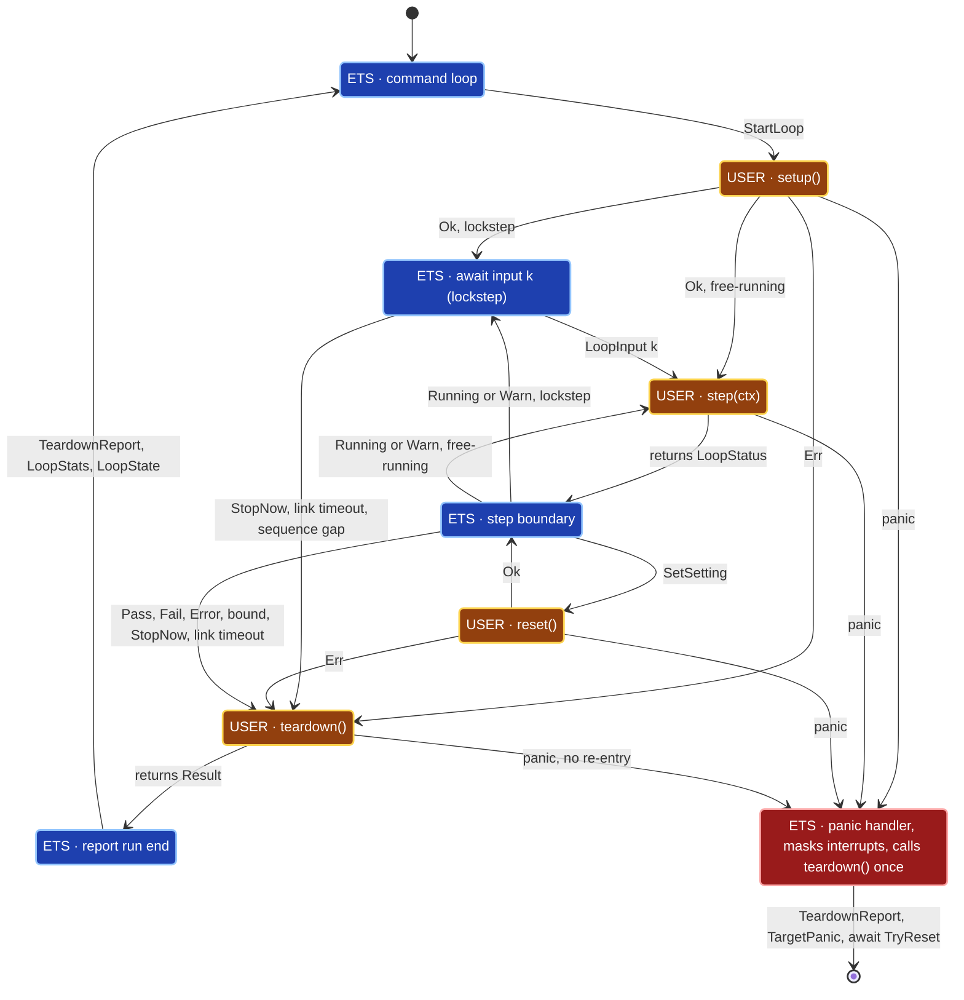

# ETS Lifecycle Suites (loop-suite)


---

### 1. Introduction

An ETS case is a `fn()` that the server runs once inside a critical section
and reports as passed when it returns. Hardware-in-the-loop work needs the
opposite: code that runs continuously with its interrupt handlers live, that
the host can tune and stop, and that always returns the hardware to a safe
state. A loop provides that as a second executable kind of the existing
`control-rs-ets` server, with an execution environment equivalent to a
sketch: setup once, step repeatedly [1], [2], [3], plus a guaranteed
teardown. A loop is declared inside an `#[ets_suite]` module beside the
suite's atomic cases and uses the suite's settings. Users deploy cases and
loops in one firmware image, and the TUI shows them side by side as rows of
the same suite; the server gains only the run states
([ADR-0002](../adr/0002-extend-ets-with-lifecycle-suites.md)). To the user, a
suite's setup, step, reset and teardown are one **lifecycle case** of that
suite, listed and triggered like any other case, and a suite that provides
one is a **lifecycle suite**. This document calls its execution a
loop run, and the types and wire variants keep the `Loop` prefix.
Lifecycle and goal semantics for production firmware are out of scope (C-6).

Primary usage scenarios:

- **Closed-loop hardware run**: A developer runs a motor-control loop on a
  board with its PWM and ADC interrupts active, adjusts gains from the host
  and stops the run. Failure: interrupts are masked, the loop is starved by
  the server, or a setting change is not applied until the run ends.
- **Self-terminating test**: A loop judges its own progress and ends the run
  with a verdict, or keeps running while reporting a warning. Failure: the
  verdict or message is lost or attributed to the wrong loop.
- **Fault containment**: The host stops the run, the host link drops, setup
  fails or the loop panics while hardware is energized. Failure: teardown
  does not run, runs twice, or its own failure is not visible to the host.
- **Simulation in the loop**: A host-side plant simulation exchanges one
  input packet and one output packet per step with the controller on the
  target, in lockstep or free-running. Failure: an output is paired with the
  wrong input, a lockstep step runs without its input, or host and target
  disagree on the packet types.
- **Emulator scope**: Emulator runs verify what code computes, not how
  firmware behaves over time against live peripherals and interrupts. QEMU
  firmware may link loops whose step is pure computation over its
  input, and runs them only in lockstep against a host simulation, started
  manually through `control-rs-ets-host`. No CI gate runs loops.
  Failure: a QEMU run depends on emulated timing or peripherals, runs
  free-running, or a CI job runs a loop.
- **Coexistence**: A suite holds atomic cases and loops side by side.
  Failure: existing case indexing, wire encoding or profiling changes, a
  loop does not see its suite's settings, or the console separates a loop
  from the cases of its suite.

---

### 2. Requirements

#### 2.1 Functional Requirements

- **FR-1 — Loop declaration**: A loop is declared directly in an
  `#[ets_suite]` module beside the suite's settings and cases, at most one
  per suite, as one lifecycle case; a partial set of its four functions is a
  compile error naming each missing one, consists of a setup, a step, a reset
  and
  a teardown function and a typed input and output packet, uses the suite's
  settings, needs no central registry and is discovered with its suite.
- **FR-2 — Continuous execution**: Starting a loop runs setup once and
  then runs the step function repeatedly until the run ends.
- **FR-3 — Step status**: Each step returns `Running(packet)`,
  `Warn(packet, message)`, `Pass`, `Fail` or `Error`. `Running` and `Warn`
  continue the run and carry the step's output packet; the other three end
  it. Every status except `Running` may carry a message.
- **FR-4 — Executive stop**: A host stop request ends the run at the next
  step boundary and returns control to the server.
- **FR-5 — Guaranteed teardown**: Teardown runs exactly once for every run
  whose setup was invoked, whether the run ends by status, stop request, step
  bound, setup
  failure, link loss or panic.
- **FR-6 — Teardown outcome**: Teardown reports success or failure with an
  optional message, and the host receives it separately from the run verdict.
- **FR-7 — Live settings**: A setting update for the running loop's suite
  received during a run is stored between steps and followed by a call to
  the loop's reset function, which returns hardware to a safe state under the
  new value.
- **FR-8 — Step output stream**: The output packet of each continuing step
  reaches the host tagged with its step index.
- **FR-9 — Host link supervision**: A loop can declare a host link
  timeout; when no host frame arrives within it, the run ends with teardown.
- **FR-10 — Run statistics**: The end of a run reports the step count and
  elapsed time.
- **FR-11 — Host session control**: The host library starts and stops loop
  suites and records status, messages, teardown outcome, input and output
  packets and statistics per run.
- **FR-12 — Bounded headless run**: The headless runner runs no loop
  unless the caller selects it; a selected loop runs for a single step
  by default, or for a caller-given step count or duration, and the runner
  records its outcome.
- **FR-13 — Console control**: The console shows each loop as a row of its
  suite beside the suite's cases, starts and stops it and shows status,
  message, teardown outcome and statistics. Run all starts cases only and
  never a lifecycle case.
- **FR-14 — Host input stream**: During a run the host sends input packets
  tagged with a step index, and the step reads the newest received input and
  its index through its context.
- **FR-15 — Lockstep execution**: A run started in lockstep calls step `k`
  only after input `k` has arrived and sends output `k` for every step.
- **FR-16 — Host simulation hook**: The host library drives a run from a
  host simulation that produces input `0` and maps each output `k` to input
  `k + 1`.

#### 2.2 Non-Functional Requirements

- **NFR-1 — Interrupt transparency**: Outside the panic path, the loop
  runner never masks interrupts during setup, steps, teardown or the work
  between steps.
- **NFR-2 — Constant step-boundary cost**: In free-running mode, server work
  between two steps is at most one non-blocking command poll, one output
  frame, one status frame and one flush, independent of run length. In
  lockstep mode the boundary additionally repeats non-blocking polls until
  the next input arrives, the run is stopped or the link deadline passes.
- **NFR-3 — Wire compatibility**: Existing command and telemetry encodings are
  unchanged; additions are appended and the protocol revision increments.

#### 2.3 Constraints

- **C-1 — Inherited allocation bound**: Conforms to
  `embedded-test-server-design.md` C-1.
- **C-2 — Inherited target architectures**: Conforms to
  `test-suite-design.md` C-2.
- **C-3 — Inherited global state rule**: Conforms to `test-suite-design.md`
  C-3.
- **C-4 — Existing suites unchanged**: Suite descriptors, suite and case
  indices and the profiling of `cpu-profiler-design.md` FR-5 are unchanged;
  loops are numbered after their suite's cases and do not use FR-5.
- **C-5 — No new dependencies**: The design adds no third-party crate.
- **C-6 — Layer boundary**: `control-rs-ets` and its host crates depend on no
  Layer 2 crate, and loops carry no production lifecycle-node states or goal
  semantics. "Lifecycle case" names only the setup, step, reset and teardown
  run.
- **C-7 — Single active run**: At most one loop runs at a time, and the
  server accepts no case, second run or setting update for another suite
  while it is active.
- **C-8 — Emulator lockstep only**: On QEMU targets loops run only in
  lockstep, and no `control-rs-ci` gate runs loops.
- **C-9 — Single loop per suite**: A suite provides at most one setup, one
  step, one reset and one teardown, beside one set of settings and any
  number of cases; the loop owns the hardware the suite configures and is the
  only `reset` its settings trigger.

---

### 3. Technical Overview

Loops extend four crates. `control-rs-ets` gains the descriptor, the
run state machine in `Server` and the wire additions. `control-rs-macros`
gains loop markers in `#[ets_suite]`. `control-rs-ets-host` gains run
control in its session and headless runner and a host simulation hook, and
`control-rs-tui` gains loop rows beside the cases of each suite. The design
builds on `embedded-test-server-design.md` (server loop, panic path),
`host-comm-design.md` (framing, revision), `test-suite-design.md`
(registration, settings), `ets-host-design.md` and `tui-design.md`.

The shape follows established suite lifecycles: run-once setup, a repeated
body, and teardown hooks [4], [5]. Teardown is guaranteed once setup has been
entered, and an abort still runs it [6], [7]. The step return value decides
whether execution continues, as in repeated-execution test contexts [8] and
phase results [9].



Control ownership:

| Class             | States                                           | Control                                                                                                                                            |
|:------------------|:-------------------------------------------------|:---------------------------------------------------------------------------------------------------------------------------------------------------|
| `ETS` (dark blue) | command loop, await input, step boundary, report | The server holds control: it polls, sends telemetry and decides the next state. User interrupt handlers stay live (NFR-1).                         |
| `USER` (brown)    | `setup`, `step`, `reset`, `teardown`             | The server has yielded by calling the suite's function. It regains control only when the function returns or panics; it cannot preempt it (§4.3).  |
| Fault (dark red)  | panic handler                                    | The server reclaims control through `ets_panic!` with interrupts masked, runs teardown once if it has not started and waits for `TryReset` (§4.4). |

`SetSetting` is also accepted while awaiting input; after `reset` returns
`Ok`, the run resumes the wait. Teardown entered from the panic handler runs
with interrupts masked.

---

### 4. Architecture

#### 4.1 Descriptor and Registration

**Declaration.** A suite is one `#[ets_suite]` module. It provides one set of
static settings and any number of atomic cases, and may provide one loop:
one function each marked `#[setup]`, `#[step]`, `#[reset]` and `#[teardown]`,
directly in the suite module (C-9). These markers do not collide with the
crate-level `#[ets_setup]`. A suite that provides a loop is a lifecycle suite;
it
still runs its cases one by one as before. The loop's setup, reset and
teardown serve the loop run only; cases do not call them.

```rust
#[ets_suite]
/// Motor HIL suite.
pub mod motor {
    /// Proportional gain.
    static KP: f32 = 0.5;

    /// Atomic cases, as many as needed.
    fn current_sensor_reads_zero() { /* ... */ }
    fn pwm_disabled_at_boot() { /* ... */ }

    // The suite's single loop.
    #[setup]
    fn setup() -> Result<(), &'static str> { /* ... */ }
    /// Closed-loop speed control.
    #[step(link_timeout_ms = 1000)]
    fn speed_loop(ctx: &LoopContext<'_, f32>) -> LoopStatus<f32> { /* uses KP */ }
    #[reset]
    fn reset() -> Result<(), &'static str> { /* ... */ }
    #[teardown]
    fn teardown() -> Result<(), &'static str> { /* ... */ }
}
```

**Macro handling.** `#[ets_suite]` already walks the module's top-level
items, converting statics to settings and registering functions without
arguments as cases. It gains one rule: a function carrying `#[setup]`,
`#[step]`, `#[reset]` or `#[teardown]` is not a case. It strips the marker,
and when any marker is present it requires all four exactly once, generates
the untyped step wrapper (§4.5) and emits one `LoopDescriptor` pointing at
the suite's `SUITE_DESCRIPTOR`. The loop's name and description are the
step function's name and doc comment. The optional `link_timeout_ms = N`
argument sits on `#[step]`. A marker outside an `#[ets_suite]` module is an
unknown attribute to rustc and fails to compile. Inside a suite the macro
rejects an incomplete or malformed lifecycle case with a spanned
`syn::Error`, never a panic:

| Condition                                                                      | Span                           | Message                                                                                                           |
|:-------------------------------------------------------------------------------|:-------------------------------|:------------------------------------------------------------------------------------------------------------------|
| Some but not all of the four markers                                           | The `#[ets_suite]` module name | ``suite `motor` defines a lifecycle case but is missing `#[reset]`, `#[teardown]` `` (every missing marker named) |
| A marker repeated                                                              | The second marked function     | ``suite `motor` already has a `#[step]` function: `speed_loop` ``                                                 |
| `#[setup]`, `#[reset]` or `#[teardown]` not `fn() -> Result<(), &'static str>` | The function signature         | Expected signature, as text                                                                                       |
| `#[step]` not `fn(&LoopContext<'_, I>) -> LoopStatus<O>`                       | The function signature         | Expected signature, as text                                                                                       |
| `link_timeout_ms` in `1..=499`                                                 | The argument                   | ``link_timeout_ms must be 0 or at least 500``                                                                     |

**Descriptor.** A `LoopDescriptor` is static data in flash:
`suite: &'static SuiteDescriptor`, name, description,
`input_type: &'static str`, `output_type: &'static str`,
`setup: fn() -> Result<(), &'static str>`,
`step: fn(&mut LoopIo<'_>) -> LoopOutcome`,
`reset: fn() -> Result<(), &'static str>`,
`teardown: fn() -> Result<(), &'static str>` and `link_timeout_ms: u32`
(`0` disables FR-9). Function pointers match `ExecDescriptor`; loop state
lives in the same atomic and interior-mutable statics settings already use
(C-3). `SuiteDescriptor` is unchanged (C-4).

The descriptor is untyped so that every loop fits one homogeneous section.
`LoopIo` holds the step index, the newest input bytes with their index and
the output buffer; `LoopOutcome` is the status variant and its optional
message. The author writes the typed step

```rust
#[step]
fn step(ctx: &LoopContext<'_, I>) -> LoopStatus<O>
```

with `I: serde::Deserialize<'de>` and `O: serde::Serialize`, and the macro
fills `input_type` and `output_type` with `core::any::type_name`.
`LoopStatus<O>` is `Running(O)`, `Warn(O, Option<&'static str>)`,
`Pass(Option<&'static str>)`, `Fail(Option<&'static str>)` or
`Error(Option<&'static str>)`. A loop without host input uses `I = ()`, and
one without output uses `O = ()`. `serde` and `postcard` are existing
`control-rs-ets` dependencies (C-5).

**Section.** The macro links a `&'static LoopDescriptor` pointer into
`.ets_loops` (`__DATA,__ets_loops` on Apple hosts), bounded by
`__ets_loops_start` and `__ets_loops_end` and retained like the suite section.
The three linker-script generators (`control-rs-ets/build.rs`,
`examples/qemu/build.rs`, `examples/teensy4/build.rs`) emit it beside
`.ets_test_suites`. A separate section keeps `SuiteDescriptor`, the
`.ets_test_suites` slice and every existing index untouched (C-4).

**Identifiers.** A loop is addressed like a case, by `(suite_id, test_id)`.
For suite `s` with `c` cases, its loop, if any, has `test_id = c`. The
server resolves the parent with `core::ptr::eq` against the suite slice at
discovery and on each
`StartLoop`; a loop whose parent is not in the slice, or a second loop for
the same suite (possible only with a hand-written descriptor), is skipped
with an error log. Case identifiers `0..c` are unchanged, `SettingInfo` and
`SetSetting`
address the suite's settings without change, and the console shows cases and
loops as one numbered list per suite.

**Entrypoint hand-off.** `ets_entrypoint!` declares
`__ets_loops_start` and `__ets_loops_end` beside the existing
pair and converts them with
`util::get_loops(start, end) -> &'static [&'static LoopDescriptor]`,
which has the same safety contract as `util::get_suites`. It then constructs
the server as `Server::new(context, suites).with_loops(loops)`.
`with_loops` is a `const fn` that replaces the empty default slice, so
`Server::new` keeps its signature and every existing call site and test
compiles unchanged (C-4). An image without loops links an empty section
and yields an empty slice.

#### 4.2 Wire Additions

All additions are appended to `Command` and `Telemetry`, so existing
discriminants keep their encoding, and `PROTOCOL_VERSION` becomes `2`
(NFR-3, `host-comm-design.md` FR-4).

| Direction | Variant          | Fields                                                                                                                  |
|:----------|:-----------------|:------------------------------------------------------------------------------------------------------------------------|
| Command   | `StartLoop`      | `suite_id: u16`, `test_id: u16`, `max_steps: u64` (`0` unbounded), `lockstep: bool`                                     |
| Command   | `StopNow`        | `suite_id: u16`, `test_id: u16`                                                                                         |
| Command   | `Heartbeat`      | none                                                                                                                    |
| Command   | `LoopInput`      | `suite_id: u16`, `test_id: u16`, `seq: u64`, `payload: &'a [u8]`                                                        |
| Telemetry | `SuiteLoops`     | `suite_id: u16`, `loop_count: u8` (`0` or `1`, C-9)                                                                     |
| Telemetry | `LoopInfo`       | `suite_id: u16`, `test_id: u16`, `name: &'a str`, `description: &'a str`, `input_type: &'a str`, `output_type: &'a str` |
| Telemetry | `LoopState`      | `suite_id: u16`, `test_id: u16`, `state: LoopRunState`, `message: Option<&'a str>`                                      |
| Telemetry | `LoopSample`     | `suite_id: u16`, `test_id: u16`, `seq: u64`, `payload: &'a [u8]`                                                        |
| Telemetry | `TeardownReport` | `suite_id: u16`, `test_id: u16`, `ok: bool`, `message: Option<&'a str>`                                                 |
| Telemetry | `LoopStats`      | `suite_id: u16`, `test_id: u16`, `steps: u64`, `time_us: u64`                                                           |

Field semantics:

- **Integers** are `postcard` varints, so a field's width bounds its range,
  not its encoded size. `suite_id` and `test_id` match the existing
  identifiers (§4.1). `steps`,
  `max_steps` and `time_us` are `u64`, as `MetricReport.time_us` is, and do not
  wrap within any run in scope.
- **`seq`** is the step index `k`, counted from `0` per run. On
  `LoopSample` it is the step that produced the output; on `LoopInput` it is
  the step the input is for. A missing index among received outputs is a
  frame lost on the link.
- **`payload`** is the `postcard` encoding of the suite's `O` (`LoopSample`)
  or `I` (`LoopInput`), at most `MAX_PACKET_SIZE = 493` bytes:
  `MAX_PAYLOAD_SIZE` (512) minus the worst-case header (variant tag 1,
  `suite_id` 3, `test_id` 3, `seq` 10, length prefix 2).
- **`Command` lifetime**: `LoopInput` borrows its payload, so `Command`
  becomes `Command<'a>` and `HostComms::poll_command` returns
  `PollResult<'_, Self::Error>`, borrowing the frame reader's buffer. Existing
  variants keep their encoding (NFR-3); each `HostComms` implementor changes
  its signature only. The server copies the payload into its input buffer
  before the next poll.
- **`state`** is a new fieldless enum `LoopRunState`, appended to `comms.rs`
  in the order `Running`, `Warn`, `Pass`, `Fail`, `Error`, `Aborted`,
  `TimedOut`, `Bounded` and encoded as its varint discriminant `0..=7`.
  `TestState` is not extended, so its encoding is unchanged (NFR-3). The order
  is append-only.
- **`message`** is `None` when the status or result carries no message. A
  message longer than `MAX_MESSAGE_SIZE = 256` bytes is truncated at the last
  `char` boundary at or below that length, so `LoopState` and `TeardownReport`
  always fit one frame.

`LoopRunState` adds `Aborted` (stop request), `TimedOut` (link timeout) and
`Bounded` (`max_steps` reached) to the five step statuses, mirroring the abort
and timeout outcomes of hardware test frameworks [10]. `Warn` is a passing
state flagged for attention, comparable to a marginal measurement [11].
Discovery sends, after each suite's existing records, `SuiteLoops` with that
suite's loop count (`0` or `1`) and then the suite's `LoopInfo`, if any. The
count
lets the host mark a suite's loops complete as it does its cases, so a lost
`LoopInfo` frame is detected rather than hiding a loop.

#### 4.3 Run State Machine

`Server::run` dispatches `StartLoop` to a run loop that owns control until the
run ends:

1. Record the active run in an atomic indicator (as `CURRENT_SUITE`), set
   `k = 0`, clear the input buffer, send `LoopState(Running)` and call
   `setup`. An `Err` sets the verdict to `Error` with its message and skips
   to step 5.
2. In lockstep, repeat step 3's poll until input `k` is stored, a verdict is
   set or the link deadline passes; the last two go to step 5. Call `step`
   with `k`, the newest input and the output buffer. On `Running` or `Warn`
   with a non-empty output, or in lockstep with any output, send
   `LoopSample { seq: k }`. Send `LoopState` only when the status variant or
   message differs from the last one sent; the packet is not compared.
   Increment `k`.
3. At the step boundary: on `Pass`, `Fail` or `Error`, or when `max_steps`
   is non-zero and reached (`Bounded`), go to step 5 without polling.
   Otherwise poll one command and flush. `LoopInput` refreshes the link
   deadline and is stored when its `seq` is not older than the stored input
   (free-running) or equals `k` (lockstep); an older `seq` is ignored with an
   error log, and in lockstep a `seq` above `k` sets `Error`
   (`input sequence gap`). `StopNow` sets `Aborted`; `SetSetting` stores the
   value and calls `reset` (FR-7), with an `Err` setting the verdict to
   `Error` with its message; `Heartbeat` and any valid frame refresh the link
   deadline; `ListSuites`, `RunExecutable`, `StartLoop` and a `SetSetting`
   for another suite are rejected with an error log (C-7).
4. If a verdict was set in step 3 or the link deadline, read from
   `get_nanos`, passed (`TimedOut`), go to step 5. Otherwise go to step 2.
5. Call `teardown` and send `TeardownReport`, then `LoopStats` and the final
   `LoopState`. Clear the active run and return to the command loop.

The run loop relies on the existing `HostComms::poll_command` contract that a
poll does not wait. The QEMU semihosting transports do not meet it: `READC`
waits for one host byte per poll. Lockstep tolerates this. The run waits for
input `k` anyway, and the host's `Heartbeat` every 100 ms and its input
frames keep bytes arriving, so each boundary poll returns. `FrameReader` keeps
its state across one-byte polls, so no byte is lost. A free-running run on
QEMU would be paced by host bytes rather than by the step, which makes its
behavior an artifact of the link; the host therefore refuses it (C-8, §4.6).
While `READC` waits the link deadline is not checked, so a host that stops
sending is handled by its stop escalation, which kills the QEMU subprocess.
Checking the bound before polling ends a bounded run without host input.

The step boundary is the only point where the server regains control, as
between sketch iterations [3]. A stop request is therefore cooperative at
that boundary. A step cannot be preempted from the server: a `no_std` panic
handler diverges [12], so no mechanism returns control from inside a running
step short of a reset. The host escalates an unacknowledged `StopNow` to the
existing reset path (§4.6).

Nothing in this path calls `disable_interrupts` (NFR-1). Setup runs with
interrupts enabled, unlike framework initialization that holds a critical
section [13]; the stepping phase matches a background task that runs with
interrupts enabled [14]. A suite that needs a critical section takes one
itself.

#### 4.4 Teardown and the Panic Path

Teardown runs once per run whose setup was invoked, including a failed setup,
because setup may have partially configured hardware.

User setup, step, reset and teardown code is expected to panic occasionally
(fewer
than 0.1% of runs). The panic path is a supported run end with a defined
report sequence, not a server fault. Its `Result` is
reported as `TeardownReport`, independent of the verdict, in the way hardware
test executors log a failing teardown without changing the test outcome [7].

The panic handler generated by `ets_panic!` (`util::handle_failure`) checks the
active-run indicator after masking interrupts. If a run is active and its
teardown has not started, it marks teardown as started, calls it and sends
`TeardownReport`, then `LoopState(Fail)` with the panic location and the
existing `TargetPanic`, and waits for `TryReset` as today. A panic raised
inside teardown is reported as
`TeardownReport { ok: false }` and teardown is not re-entered. On this path
teardown runs with interrupts masked, so it must
not depend on interrupts.

#### 4.5 Packets and Statistics

The wrapper generated for `#[step]` performs, per call:

1. Decode `io.input`, when present, into `I` with `postcard::from_bytes`.
2. Call the typed step with a `LoopContext` exposing `step() -> u64`,
   `input() -> Option<&I>` and `input_seq() -> Option<u64>`.
3. Encode the `O` of `Running` or `Warn` into `io.output` with
   `postcard::to_slice`, and return the untyped `LoopOutcome`.

An input that fails to decode skips the step and returns `Error` with the
message `input decode`; an output larger than `MAX_PACKET_SIZE` returns
`Error` with `output overflow`. In lockstep `input()` is always `Some` and
`input_seq() == Some(step())`. In free-running mode the input is the newest
received and may be absent or older than the current step; `input_seq` lets
the step judge its age.

The run loop holds the input and output buffers, `MAX_PACKET_SIZE` bytes
each, in its own frame. The input buffer is written only at the step
boundary and the output buffer only by the wrapper during a step; interrupt
handlers touch neither, so no static is added (C-3). Free-running mode sends
only non-empty outputs. Lockstep sends every output, empty included, because
output `k` is the host's cue for input `k + 1` (FR-15). The server drops no
output: a link slower than the step rate lowers the step rate through
`send_telemetry`, which `LoopStats` shows.

Statistics are a step counter and two timer reads, at setup entry and at
teardown entry, reported in `LoopStats` (FR-10). Loops paint no stack
and run no critical section: painting the free stack while interrupts are
live would overwrite interrupt frames, and both mechanisms violate NFR-1.

#### 4.6 Host and Console

`control-rs-ets-host` session state gains loop items keyed by
`(suite_id, test_id)` and listed with their suite's cases, actions for
`StartLoop` and `StopNow`, a run record (states,
messages, teardown outcome, input and output packets, statistics) and a
`Heartbeat` every `HEARTBEAT_PERIOD = 100 ms` while any run is active, in the
manner of a ground-station heartbeat failsafe [15]. The heartbeat is sent
whatever the suite's `link_timeout_ms`, so the host needs no per-suite
timeout.
A `StopNow` is acknowledged by the run's final `LoopState`. If none arrives
within `stop_timeout` (default `2 s`, set in the session and runner options),
the host sends `TryReset` and tears down the link. A step that never returns
cannot service `TryReset`, so on serial the target stays unrecovered, the
limit of `ets-host-design.md` §6.3. The
headless runner starts only the loops the caller selects, by default
none, so the `control-rs-ci` `ets` gate runs none (C-8). A selected suite
gets `StartLoop` with `max_steps = 1` unless the caller gives a step count or
a per-suite duration; a duration bound sends `StopNow` when it elapses (FR-12).
The runner starts a run in lockstep only when the caller supplies a
simulation. On a subprocess (QEMU) target the session refuses `StartLoop`
with `lockstep = false` with a named error and sends nothing (C-8). The
session is the single writer of command frames, so `Heartbeat`, `LoopInput`
and control commands never interleave bytes on the link. `control-rs-tui`
shows each loop as a row of its suite beside the suite's cases, in the same
table, and starts and stops it from that row; the row shows state, message,
teardown outcome, statistics and input and output rates, and setting edits
reuse `tui-design.md` FR-7.

**Host simulation (FR-16).** `control-rs-ets-host` defines

```rust
pub trait LoopSim {
    type Input: serde::Serialize;
    type Output: serde::de::DeserializeOwned;
    fn initial(&mut self) -> Self::Input;
    fn advance(&mut self, k: u64, output: Self::Output) -> Self::Input;
}
```

and a byte-level erased form that the session stores. A run started with a
simulation sends `StartLoop`, then `LoopInput { seq: 0, initial() }`. Each
`LoopSample { seq: k }` is decoded and `advance(k, output)` yields
`LoopInput { seq: k + 1 }`. In lockstep this pairing is exact; in
free-running mode the same hook runs on each received output and the target
steps on the newest input. The session compares `type_name` of the
simulation's types with `LoopInfo.input_type` and `output_type` and logs
a warning on mismatch, because `type_name` is not a guaranteed identity.
Without a simulation the session sends no `LoopInput`, so a lockstep run
waits at step `0` until stopped or timed out.

#### 4.7 File Impact

| File                                                  | Change                                                                                                                  |
|:------------------------------------------------------|:------------------------------------------------------------------------------------------------------------------------|
| `control-rs-ets/src/lib.rs`                           | Loop descriptor, `LoopStatus<O>`, `LoopContext<I>`, `LoopIo`, `LoopOutcome`, `MAX_PACKET_SIZE`                          |
| `control-rs-ets/src/comms.rs`                         | Appended variants, `Command<'a>`, `PollResult<'_, E>`, `LoopRunState`, `MAX_MESSAGE_SIZE`, `PROTOCOL_VERSION = 2`       |
| `control-rs-ets/src/server.rs`                        | `with_loops`, discovery, run loop                                                                                       |
| `control-rs-ets/src/util.rs`                          | `get_loops`, panic-path teardown, test `HostComms` signature                                                            |
| `control-rs-ets/build.rs`                             | `.ets_loops` section and symbols                                                                                        |
| `control-rs-macros/src/lib.rs`                        | Loop markers in `#[ets_suite]`, typed step wrapper, entrypoint hand-off (§4.1)                                          |
| `control-rs-ets-host/src/{bridge,session,runner}.rs`  | Owned telemetry, run control, heartbeat, stop escalation, bounded run                                                   |
| `control-rs-ets-host/src/sim.rs`                      | `LoopSim`, erased form, input pacing                                                                                    |
| `control-rs-tui/src/tui.rs`                           | Loop view and keys                                                                                                      |
| `examples/qemu/build.rs`, `examples/teensy4/build.rs` | `.ets_loops` section and symbols                                                                                        |
| `examples/teensy4/src/`                               | Example loop (§4.9), `send_telemetry` buffer, `poll_command` through `BufferedFrameReader` (`host-comm-design.md` FR-6) |
| `examples/qemu/src/`                                  | Lockstep example suite (§4.9), `send_telemetry` buffers at `MAX_FRAME_SIZE`, `poll_command` signature                   |

#### 4.8 Error Handling

Setup and teardown errors are `&'static str` messages carried in telemetry,
matching `SetResult` in `settings.rs`. Transport errors propagate through the
existing `ServerResult`. Out-of-range identifiers and commands rejected under
C-7 produce error logs through `report_error_log`, as existing commands do.
Outside a run, `RunExecutable` addressing a loop and `StartLoop` addressing a
case are rejected the same way.

#### 4.9 Example Suites

`examples/teensy4/src/loop_end_paths.rs` declares the suite `loop_end_paths`,
linked by the Teensy 4.1 firmware, with one atomic case (`mode_is_valid`) and
one loop (`end_paths`, `link_timeout_ms = 1000`, `I = f32`,
`O = (u64, f32)`), so the console shows a case and a loop side by side. The
suite's `mode: u8` setting selects the loop's end path, and the host sets it
with `SetSetting` before each
`StartLoop`. Every continuing step returns `(k, u)` with `u = -0.5 x` for the
newest input `x` (`0` when none), and teardown increments a teardown counter
and reports it in its message. The host test simulation is the integrator
`x_{k+1} = x_k + u_k`, `x_0 = 1`.

| `mode` | Behavior                                                           | Expected end                                           |
|:-------|:-------------------------------------------------------------------|:-------------------------------------------------------|
| 0      | `Running` forever, run twice                                       | `Bounded` (`max_steps = 50`); `Aborted` (1 s duration) |
| 1      | `Running` for 10 steps, then `Pass`                                | `Pass`                                                 |
| 2      | `Warn` with a message for 5 steps, then `Pass`                     | `Warn` frames, then `Pass`                             |
| 3      | `Fail` with a message at step 5                                    | `Fail`                                                 |
| 4      | `Error` with a message at step 5                                   | `Error`                                                |
| 5      | `setup` returns `Err`                                              | `Error`, no step, one `TeardownReport`                 |
| 6      | `Running`; host re-sends `mode = 6` mid-run, `reset` returns `Err` | `Error` after the reset                                |
| 7      | `Pass` at step 5; `teardown` returns `Err`                         | `Pass` with `TeardownReport { ok: false }`             |
| 8      | Lockstep with the integrator, `max_steps = 100`                    | `Bounded`; output `k` answers input `k`; `x_k = 0.5^k` |
| 9      | Panics at step 5                                                   | `TeardownReport`, `LoopState(Fail)`, `TargetPanic`     |
| 10     | `Pass` at step 5; `teardown` panics                                | `TeardownReport { ok: false }`, `TargetPanic`          |
| 11     | `Running`; host suspends `Heartbeat`                               | `TimedOut` within 1.1 s                                |

Modes 9 and 10 end the firmware session and spend one reset of the runner's
reset budget each, so they run last. The firmware's `send_telemetry` buffer
grows from 512 bytes to `MAX_FRAME_SIZE` (518), because a full `LoopSample`
frame does not fit 512. The other modes run free-running with the same
simulation attached.

**QEMU lockstep example.** `examples/qemu/src/loop_lockstep.rs` declares the
suite `lockstep` with one loop, `integrator`, with `I = f32` and `O = f32`,
linked by all four QEMU binaries. Its step reads no peripheral and returns
`Running(-0.5 * x)` for
input `x`. Driven through `control-rs-ets-host` with the integrator
simulation, `lockstep = true` and `max_steps = 100`, it ends `Bounded` with
`x_k = 0.5^k` exactly, because halving is exact in `f32` over this range. The
four binaries' `send_telemetry` buffers grow to `MAX_FRAME_SIZE`. The run is
manual; no `control-rs-ci` gate starts it (C-8).

---

### 5. Alternatives

| Alternative                                                        | Rejected Because                                                                                                                                        | Reference                     |
|:-------------------------------------------------------------------|:--------------------------------------------------------------------------------------------------------------------------------------------------------|:------------------------------|
| Host-owned loop over existing atomic cases                         | Each step costs a host round trip and runs with interrupts masked; violates FR-2 and NFR-1                                                              | `cpu-profiler-design.md` FR-5 |
| Loops as standalone suites with their own identifiers and settings | Separates a loop's settings and console row from the cases of the same suite                                                                            | ADR-0002                      |
| A kind flag on `SuiteDescriptor` in the existing section           | Changes the existing descriptor layout and slice; violates C-4 and NFR-3                                                                                | §4.1                          |
| Trait-object suites (`&'static dyn Loop`)                          | Still needs interior-mutable statics for state and diverges from the function-pointer descriptors used by every existing suite                          | `test-suite-design.md` C-3    |
| Adopting a third-party harness                                     | Violates C-5; available harnesses initialize and tear down state per test case rather than sustaining a run [5], [16]                                   | [5], [16]                     |
| Preemptive stop from a transport interrupt                         | No `no_std` mechanism returns from a running step without a reset [12]; the boundary stop plus host reset escalation covers the case                    | [12]                          |
| Setup inside a critical section                                    | Peripheral bring-up often depends on interrupts; violates NFR-1                                                                                         | [13]                          |
| Full per-step profiling (cycles and stack paint)                   | Stack painting races live interrupt frames, and per-step critical sections violate NFR-1                                                                | §4.5                          |
| Generic descriptor `LoopDescriptor<I, O>`                          | A linker section holds one type; distinct `I` and `O` cannot share it, so the macro erases the types instead                                            | §4.1                          |
| Owned fixed-size payload in `Command`                              | Every `Command` value, including each poll result, grows by `MAX_PACKET_SIZE`; borrowing from the frame reader avoids the copy                          | §4.2                          |
| `emit_sample` side channel beside the status packet                | Duplicates the output path with a second buffer, drop counter and sequence; one packet per step is the stream FR-8 requires                             | §4.5                          |
| Free-running loops on QEMU                                         | Emulated peripherals, interrupts and timing do not represent runtime behavior, and the waiting semihosting poll paces a free-running step by host bytes | §1, §4.3                      |
| Loops in the `control-rs-ci` `ets` gate                            | Out of scope by decision; the gate keeps verifying atomic suites, and a loop run needs a per-suite selection and simulation the gate does not hold      | §1, C-8                       |
| A separate loop server or firmware                                 | Duplicates discovery, settings, framing, panic handling and host tooling, and both suite kinds could not share one image or one TUI                     | ADR-0002                      |
| Lifecycle and goal semantics in ETS                                | Production runtime concerns; violates C-6                                                                                                               | ADR-0002                      |

---

### 6. Verification & Validation

#### 6.1 Verification

| Condition | Requirement | Method       | Target                                                                                                       | Criterion                                                                                                                                                                                                                                                                                                                                                                                                                                                                                                                                                                                      |
|:----------|:------------|:-------------|:-------------------------------------------------------------------------------------------------------------|:-----------------------------------------------------------------------------------------------------------------------------------------------------------------------------------------------------------------------------------------------------------------------------------------------------------------------------------------------------------------------------------------------------------------------------------------------------------------------------------------------------------------------------------------------------------------------------------------------|
| VC-1.1    | FR-1        | `libtest`    | `control_rs_macros::tests::loop_expands_descriptor`                                                          | `#[ets_suite]` with settings, two cases and the four loop markers registers exactly the two cases and emits one `LoopDescriptor` whose `suite` points at that suite's descriptor, named after the step function, holding the marked setup, reset and teardown functions, an untyped step wrapper around the typed step and the `type_name` of `I` and `O`; every row of the §4.1 diagnostics table is a compile error with that span, and the missing-marker error names each missing marker; `ets_entrypoint!` passes the loop slice through `with_loops`; FR-1 holds iff all conditions hold |
| VC-1.2    | FR-1        | `libtest`    | `control_rs_ets::server::tests::test_loop_discovery`                                                         | After each suite's existing records, discovery sends one `SuiteLoops` with that suite's loop count, `0` or `1`, and the suite's `LoopInfo`, if any, with `test_id` equal to the suite's case count; case identifiers are unchanged                                                                                                                                                                                                                                                                                                                                                             |
| VC-2.1    | FR-2        | `libtest`    | `control_rs_ets::server::tests::test_loop_setup_once_then_steps`                                             | Setup is called exactly once and before the first step, and steps repeat while the status is `Running`                                                                                                                                                                                                                                                                                                                                                                                                                                                                                         |
| VC-3.1    | FR-3        | `libtest`    | `control_rs_ets::server::tests::test_loop_status_continues_or_ends`                                          | `Running(o)` and `Warn(o, m)` lead to another step carrying `o`, and `Pass`, `Fail` and `Error` lead to teardown with no further step; FR-3 holds iff all conditions hold                                                                                                                                                                                                                                                                                                                                                                                                                      |
| VC-3.2    | FR-3        | `libtest`    | `control_rs_ets::server::tests::test_loop_state_sent_on_change`                                              | A `LoopState` frame carrying the status and message is sent exactly when the status variant or message changes, and a changed packet alone sends none                                                                                                                                                                                                                                                                                                                                                                                                                                          |
| VC-4.1    | FR-4        | `libtest`    | `control_rs_ets::server::tests::test_loop_stop_now_at_boundary`                                              | After `StopNow` is polled no further step is called, teardown runs and the final state is `Aborted`                                                                                                                                                                                                                                                                                                                                                                                                                                                                                            |
| VC-5.1    | FR-5        | `libtest`    | `control_rs_ets::server::tests::test_loop_teardown_once_per_end_path`                                        | For each end path (terminal status, stop, step bound, setup error, link timeout) teardown is called exactly once; FR-5 holds iff all conditions hold                                                                                                                                                                                                                                                                                                                                                                                                                                           |
| VC-5.2    | FR-5        | `libtest`    | `control_rs_ets::util::tests::test_panic_teardown_runs_once`                                                 | The panic-path teardown helper calls an active run's teardown once and never re-enters it when the panic arises in teardown, and a panic in reset takes the same path                                                                                                                                                                                                                                                                                                                                                                                                                          |
| VC-5.3    | FR-5        | `inspection` | —                                                                                                            | The Teensy 4.1 example log for modes 9 and 10 (§4.9) shows exactly one `TeardownReport` before `TargetPanic`                                                                                                                                                                                                                                                                                                                                                                                                                                                                                   |
| VC-6.1    | FR-6        | `libtest`    | `control_rs_ets::server::tests::test_teardown_report_independent_of_verdict`                                 | A failing teardown yields `TeardownReport { ok: false }` with its message while the final state keeps the step verdict                                                                                                                                                                                                                                                                                                                                                                                                                                                                         |
| VC-7.1    | FR-7        | `libtest`    | `control_rs_ets::server::tests::test_loop_set_setting_between_steps`                                         | A `SetSetting` for the running loop's suite polled during a run stores the value and calls reset once before the next step, the new value is visible to reset and that step and confirmed by `SettingInfo`, and a reset `Err` ends the run `Error` with teardown                                                                                                                                                                                                                                                                                                                               |
| VC-8.1    | FR-8        | `libtest`    | `control_rs_ets::server::tests::test_loop_output_per_step`                                                   | In free-running mode each continuing step with a non-empty output yields one `LoopSample` whose `seq` is the step index and whose payload is the `postcard` encoding of `O`, and an empty output yields none; FR-8 holds iff all conditions hold                                                                                                                                                                                                                                                                                                                                               |
| VC-8.2    | FR-8        | `libtest`    | `control_rs_macros::tests::loop_step_wrapper_output_overflow`                                                | An output whose encoding exceeds `MAX_PACKET_SIZE` makes the wrapper return `Error` with `output overflow`, and the run ends with teardown                                                                                                                                                                                                                                                                                                                                                                                                                                                     |
| VC-9.1    | FR-9        | `libtest`    | `control_rs_ets::server::tests::test_loop_link_timeout_tears_down`                                           | With a non-zero timeout and no host frame the run ends `TimedOut` with teardown, and with a zero timeout it continues; FR-9 holds iff all conditions hold                                                                                                                                                                                                                                                                                                                                                                                                                                      |
| VC-9.2    | FR-9        | `libtest`    | `control_rs_ets_host::session::tests::heartbeat_sent_while_supervised_run_active`                            | The session emits `Heartbeat` every 100 ms while any run is active and none while idle                                                                                                                                                                                                                                                                                                                                                                                                                                                                                                         |
| VC-10.1   | FR-10       | `libtest`    | `control_rs_ets::server::tests::test_loop_stats_reported`                                                    | `LoopStats` reports the exact number of steps called and a non-decreasing elapsed time from the profiler clock                                                                                                                                                                                                                                                                                                                                                                                                                                                                                 |
| VC-11.1   | FR-11       | `libtest`    | `control_rs_ets_host::session::tests::loop_run_record_complete`                                              | A run driven through the fake link records every state, message, teardown outcome, input and output packet and statistic sent; FR-11 holds iff all conditions hold                                                                                                                                                                                                                                                                                                                                                                                                                             |
| VC-11.2   | FR-11       | `libtest`    | `control_rs_ets_host::session::tests::unacknowledged_stop_escalates_reset`                                   | A `StopNow` with no final state within `stop_timeout` (default 2 s) is followed by `TryReset` and link teardown                                                                                                                                                                                                                                                                                                                                                                                                                                                                                |
| VC-12.1   | FR-12       | `libtest`    | `control_rs_ets_host::runner::tests::headless_loop_bounded`                                                  | By default the headless runner sends no `StartLoop`; for a selected suite it sends `StartLoop` with `max_steps = 1` and records the `Bounded` outcome, and with a duration it sends `StopNow` when the duration elapses                                                                                                                                                                                                                                                                                                                                                                        |
| VC-12.2   | FR-12       | `libtest`    | `control_rs_ets::server::tests::test_loop_max_steps_bounds_run`                                              | With `max_steps = n` exactly `n` steps are called, no command is polled after step `n`, then teardown runs and the final state is `Bounded`                                                                                                                                                                                                                                                                                                                                                                                                                                                    |
| VC-13.1   | FR-13       | `libtest`    | `control_rs_tui::tui::tests::loop_start_stop_keys`                                                           | The start and stop keys on a loop row produce `StartLoop` and `StopNow` for that `(suite_id, test_id)`, and run all with loops discovered sends `RunExecutable` for every case and no `StartLoop`; FR-13 holds iff all conditions hold                                                                                                                                                                                                                                                                                                                                                         |
| VC-13.2   | FR-13       | `inspection` | —                                                                                                            | A loop row appears in its suite beside the suite's cases and shows state, message, teardown outcome, statistics and input and output rates for an active and a finished run                                                                                                                                                                                                                                                                                                                                                                                                                    |
| VC-14.1   | FR-14       | `libtest`    | `control_rs_ets::server::tests::test_loop_input_newest_wins`                                                 | In free-running mode the step sees the newest stored input and its `seq`, an older `seq` is ignored with an error log, and before any input `input()` is `None`; FR-14 holds iff all conditions hold                                                                                                                                                                                                                                                                                                                                                                                           |
| VC-14.2   | FR-14       | `libtest`    | `control_rs_macros::tests::loop_step_wrapper_input_decode`                                                   | An input that fails to decode as `I` skips the step and the wrapper returns `Error` with `input decode`                                                                                                                                                                                                                                                                                                                                                                                                                                                                                        |
| VC-15.1   | FR-15       | `libtest`    | `control_rs_ets::server::tests::test_loop_lockstep_waits_for_input`                                          | In lockstep step `k` is called only after input `k` is stored, sees `input_seq() == Some(k)`, every step sends output `k` including empty outputs, and an input with `seq > k` ends the run `Error` with `input sequence gap`; FR-15 holds iff all conditions hold                                                                                                                                                                                                                                                                                                                             |
| VC-15.2   | FR-15       | `libtest`    | `control_rs_ets::server::tests::test_loop_lockstep_wait_ends`                                                | A lockstep run waiting for input ends `Aborted` on `StopNow` and `TimedOut` at the link deadline, each with one teardown                                                                                                                                                                                                                                                                                                                                                                                                                                                                       |
| VC-16.1   | FR-16       | `libtest`    | `control_rs_ets_host::sim::tests::loop_sim_drives_lockstep`                                                  | With a test simulation the session sends input `0` after `StartLoop` and input `k + 1` produced by `advance(k, output)` for each received output `k`; FR-16 holds iff all conditions hold                                                                                                                                                                                                                                                                                                                                                                                                      |
| VC-16.2   | FR-16       | `libtest`    | `control_rs_ets_host::sim::tests::loop_sim_type_mismatch_warns`                                              | A simulation whose type names differ from `LoopInfo.input_type` or `output_type` produces one warning log and the run proceeds                                                                                                                                                                                                                                                                                                                                                                                                                                                                 |
| VC-17.1   | NFR-1       | `libtest`    | `control_rs_ets::server::tests::test_loop_never_masks_interrupts`                                            | A profiler that counts `disable_interrupts` calls records zero calls across a run that visits every end path except panic; NFR-1 holds iff all conditions hold                                                                                                                                                                                                                                                                                                                                                                                                                                 |
| VC-17.2   | NFR-1       | `inspection` | —                                                                                                            | No loop code path outside `handle_failure` calls an interrupt-masking primitive                                                                                                                                                                                                                                                                                                                                                                                                                                                                                                                |
| VC-18.1   | NFR-2       | `libtest`    | `control_rs_ets::server::tests::test_loop_boundary_work_bounded`                                             | In free-running mode each step boundary performs at most one poll, one output frame, one state frame and one flush; in lockstep the only added work is repeated polls while waiting                                                                                                                                                                                                                                                                                                                                                                                                            |
| VC-19.1   | NFR-3       | `libtest`    | `control_rs_ets::comms::tests::existing_variant_encoding_unchanged`                                          | Every pre-existing command and telemetry variant encodes to the same bytes as protocol revision 1, `LoopRunState` encodes to discriminants `0..=7` in declared order, a `LoopSample` and a `LoopInput` with a `MAX_PACKET_SIZE` payload and maximal header fields and a `LoopState` with a `MAX_MESSAGE_SIZE` message each fit `MAX_PAYLOAD_SIZE`, and a `LoopInput` decoded through `FrameReader` borrows its payload; NFR-3 holds iff all conditions hold                                                                                                                                    |
| VC-19.2   | NFR-3       | `libtest`    | `control_rs_ets_host::bridge::tests::revision_mismatch_refused`                                              | A target reporting a protocol revision other than 2 is refused at session open                                                                                                                                                                                                                                                                                                                                                                                                                                                                                                                 |
| VC-20.1   | C-1         | `inspection` | —                                                                                                            | The `control-rs-ets` target build links no allocator                                                                                                                                                                                                                                                                                                                                                                                                                                                                                                                                           |
| VC-21.1   | C-2         | `inspection` | —                                                                                                            | `control-rs-ets` with the loop additions and the QEMU lockstep example build for all four C-2 targets                                                                                                                                                                                                                                                                                                                                                                                                                                                                                          |
| VC-22.1   | C-3         | `inspection` | —                                                                                                            | The added code declares no `static mut`                                                                                                                                                                                                                                                                                                                                                                                                                                                                                                                                                        |
| VC-23.1   | C-4         | `libtest`    | `control_rs_ets::server::tests::test_server_run_test` `control_rs_ets::server::tests::test_server_discovery` | The existing case and discovery tests pass unchanged                                                                                                                                                                                                                                                                                                                                                                                                                                                                                                                                           |
| VC-24.1   | C-5         | `review`     | —                                                                                                            | No crate is added to any manifest                                                                                                                                                                                                                                                                                                                                                                                                                                                                                                                                                              |
| VC-25.1   | C-6         | `review`     | —                                                                                                            | The dependency graphs of the four touched crates contain no Layer 2 crate and the API names no lifecycle or goal concept                                                                                                                                                                                                                                                                                                                                                                                                                                                                       |
| VC-26.1   | C-7         | `libtest`    | `control_rs_ets::server::tests::test_loop_rejects_commands_during_run`                                       | `RunExecutable`, `ListSuites`, a second `StartLoop` and a `SetSetting` for another suite during a run are logged as errors and change no state; outside a run, `RunExecutable` on a loop and `StartLoop` on a case are logged as errors                                                                                                                                                                                                                                                                                                                                                        |
| VC-27.1   | C-8         | `libtest`    | `control_rs_ets_host::session::tests::free_running_refused_on_subprocess`                                    | On a subprocess target the session refuses `StartLoop` with `lockstep = false` with a named error and writes no frame, and accepts `lockstep = true`; C-8 holds iff all conditions hold                                                                                                                                                                                                                                                                                                                                                                                                        |
| VC-27.2   | C-8         | `review`     | —                                                                                                            | No `control-rs-ci` gate selects a loop or constructs a `LoopSim`                                                                                                                                                                                                                                                                                                                                                                                                                                                                                                                               |
| VC-28.1   | C-9         | `libtest`    | `control_rs_macros::tests::second_loop_in_suite_rejected`                                                    | A suite module with a second `#[setup]`, `#[step]`, `#[reset]` or `#[teardown]` fails to compile with a spanned error on the second; C-9 holds iff all conditions hold                                                                                                                                                                                                                                                                                                                                                                                                                         |
| VC-28.2   | C-9         | `libtest`    | `control_rs_ets::server::tests::test_second_loop_for_suite_skipped`                                          | With two hand-written `LoopDescriptor`s pointing at one suite, discovery reports `loop_count = 1`, the second is skipped with one error log and a `StartLoop` for it is rejected                                                                                                                                                                                                                                                                                                                                                                                                               |

Coverage: 80% line coverage of the loop additions to `control-rs-ets`
and `control-rs-ets-host`, measured with `cargo coverage`. Excluded:
`handle_failure`, which diverges and is covered by VC-5.2 and VC-5.3, and the
target entrypoint expansion.

#### 6.2 Acceptance

| Claim                  | Oracle                                        | Measure                                                                     | Bound     |
|:-----------------------|:----------------------------------------------|:----------------------------------------------------------------------------|:----------|
| Teardown count per run | `TeardownReport` frames received per run      | Each §4.9 mode on the Teensy 4.1                                            | Exactly 1 |
| Stop latency in steps  | Step counter in the example suite             | Steps called after `StopNow` is polled                                      | 0         |
| Step accounting        | Step counter in the example suite             | `LoopStats.steps` minus counted steps                                       | Exactly 0 |
| Output accounting      | `seq` of received `LoopSample`                | Missing indices in lockstep mode 8                                          | Exactly 0 |
| Lockstep pairing       | Simulation log of (input `seq`, output `seq`) | Outputs not answering the input of the same index                           | 0         |
| Lockstep plant         | `x_k = 0.5^k` for the §4.9 integrator         | Max abs error of `x_k`, `k` in `0..100`, `f32`                              | `1e-6`    |
| QEMU lockstep plant    | `x_k = 0.5^k` for `lockstep::integrator`      | `x_k` differing from `0.5^k`, `k` in `0..100`, each QEMU target, manual run | 0         |

#### 6.3 Limits

- Stop requests and link supervision act at step boundaries; a step that
  never returns is not stopped. The task watchdog that would bound it is
  deferred by `embedded-test-server-design.md` §4.3.
- Step timing and jitter under the server's boundary work are not measured.
- No CI gate runs loops (C-8). CI covers them through `libtest` with a
  fake link; §6.2 acceptance and VC-5.3 are manual Teensy 4.1 runs, and the
  QEMU lockstep run is manual.
- QEMU covers lockstep computation only; free-running behavior,
  interrupts and peripherals are verified on hardware.
- Packet content is verified only by the §4.9 integrator; host and target
  packet types are matched by `type_name` only, which warns rather than
  refuses (§4.6).
- Lockstep step rate is bounded by one link round trip per step and is not
  measured.

---

### 7. Performance & Resource Considerations

Descriptors are static data in flash. RAM grows by the active-run
indicator; while a run is active its frame holds the input and output
buffers, `2 × MAX_PACKET_SIZE` = 992 bytes of stack. Nothing allocates (C-1).

Per step, the server performs the bounded work of NFR-2, plus one timer read
when the suite declares a link timeout. Statistics cost two timer reads per
run. Elapsed time uses `get_nanos` rather than the 32-bit DWT cycle counter
[17], which wraps within seconds at typical core clocks and would bound run
length. State frames are sent on change, so a steady `Running` costs no
bandwidth; output frames are limited to one per step, and a saturated link
lowers the step rate, which `LoopStats` shows. No numeric types are involved.

---

### 8. Risks & Open Questions

- **Sibling documents (resolved)**: `host-comm-design.md`,
  `embedded-test-server-design.md`, `test-suite-design.md`,
  `cpu-profiler-design.md`, `ets-host-design.md`, `tui-design.md` and
  `macros-design.md` carry revision rows dated October 7, 2026 that track
  this design through revision 1.7. ADR-0002 cites this revision.
- **Teensy command polling (FR-4, FR-9, resolved)**: the shipped
  `examples/teensy4` `poll_command` discarded the bytes after the first
  complete frame of a 64-byte read, so a `StopNow` sharing a USB packet with a
  `Heartbeat` was lost. `host-comm-design.md` FR-6 and its
  `BufferedFrameReader` fix this for every chunked driver; it is a
  prerequisite of Phase 1.
- **Reset contract (FR-7)**: `reset` is user code; whether it reaches a safe
  state is the suite author's responsibility and is not verified by the
  server. Each setting change calls it, so high-rate tuning from the console
  is bounded by its duration.
- **Panic-path teardown with interrupts masked (FR-5)**: teardown must be
  written so it completes without interrupts. Review whether this is
  acceptable for every intended board.
- **Message type (FR-3)**: `&'static str` messages cannot carry runtime
  values; values go in packets. A fixed-capacity formatted message is the
  alternative if review requires it.
- **Maximum step duration (FR-10)**: adding the longest step to `LoopStats`
  costs two timer reads per step. It is excluded until review decides.
- **Interrupt-side data (FR-8)**: only the step emits packets. Data captured
  in interrupt handlers reaches the host through the step's output, at the
  step rate.
- **QEMU without a host (C-8)**: a lockstep run waits in `READC` with no link
  deadline check. A host that dies leaves QEMU blocked until its subprocess
  is killed; `control-rs-ets-host` kills it on stop escalation and session
  teardown.
- **`Command<'a>` (NFR-3, resolved)**: the lifetime changes the `HostComms`
  signature for every firmware and test implementor; `host-comm-design.md`
  1.10 records it.
- **Layer 2 interaction (C-6, not specified here)**: HIL tests of a Layer 2
  lifecycle node, for example in `control-rs-esc`, are loops whose
  setup, step and teardown drive that node. The node's lifecycle and goal
  semantics and its production link are outside this document.

---

### 9. Development Plan

| Phase                     | Delivers                                                                                                                            | Requirements                                                                                | Effort | Status  |
|:--------------------------|:------------------------------------------------------------------------------------------------------------------------------------|:--------------------------------------------------------------------------------------------|:-------|:--------|
| 1. Contract               | `host-comm-design.md` Step 7 complete (prerequisite), sibling document revisions, descriptor, linker section, macro, wire additions | FR-1, NFR-3, C-1, C-2, C-3, C-5, C-6                                                        | 3 days | Planned |
| 2. Server run loop        | Run state machine, panic-path teardown, packets, lockstep, statistics, link supervision                                             | FR-2, FR-3, FR-4, FR-5, FR-6, FR-7, FR-8, FR-9, FR-10, FR-14, FR-15, NFR-1, NFR-2, C-4, C-7 | 4 days | Planned |
| 3. Host                   | Session run control, heartbeat, stop escalation, bounded headless run, simulation hook                                              | FR-11, FR-12, FR-16                                                                         | 3 days | Planned |
| 4. Console and acceptance | TUI run view, Teensy example, QEMU lockstep example, §6.2 acceptance on the Teensy 4.1 and manual QEMU lockstep runs                | FR-13, C-8                                                                                  | 3 days | Planned |

---

### 10. Revision History

| Revision | Date            | Author          | Description                                                                                                                                                                                                                                                                                                                                                                                                                                                                                                                                                                                                                                                                                                                                   |
|:---------|:----------------|:----------------|:----------------------------------------------------------------------------------------------------------------------------------------------------------------------------------------------------------------------------------------------------------------------------------------------------------------------------------------------------------------------------------------------------------------------------------------------------------------------------------------------------------------------------------------------------------------------------------------------------------------------------------------------------------------------------------------------------------------------------------------------|
| 1.0      | October 7, 2026 | @MitchellDScott | Initial design document: FR-1 to FR-13, NFR-1 to NFR-3, C-1 to C-7.                                                                                                                                                                                                                                                                                                                                                                                                                                                                                                                                                                                                                                                                           |
| 1.1      | October 7, 2026 | @MitchellDScott | Wire field types and `LoopRunState`, heartbeat period and stop timeout, `emit_sample` results, entrypoint hand-off, hardware example suite (§4.9), bound check before poll, loop suites excluded from QEMU firmware; badge alt text.                                                                                                                                                                                                                                                                                                                                                                                                                                                                                                          |
| 1.2      | October 7, 2026 | @MitchellDScott | Host simulation data path: typed `LoopContext<I>` and `LoopStatus<O>` with `Running(packet)` and `Warn(packet, message)`, `LoopInput`, lockstep mode, `LoopSim`; FR-14 to FR-16; `emit_sample` removed; VC-14 to VC-23 renumbered VC-17 to VC-26.                                                                                                                                                                                                                                                                                                                                                                                                                                                                                             |
| 1.3      | October 7, 2026 | @MitchellDScott | Sibling revisions applied (§8) and ADR-0002 updated; status badge in the `design-template.md` form.                                                                                                                                                                                                                                                                                                                                                                                                                                                                                                                                                                                                                                           |
| 1.4      | October 7, 2026 | @MitchellDScott | Teensy command-loss risk resolved by `host-comm-design.md` FR-6 (`BufferedFrameReader`), made a Phase 1 prerequisite.                                                                                                                                                                                                                                                                                                                                                                                                                                                                                                                                                                                                                         |
| 1.5      | October 7, 2026 | @MitchellDScott | Lockstep loop suites allowed on QEMU, free-running refused by the host; new C-8 (emulator lockstep only, no `control-rs-ci` gate runs loop suites); FR-12 runs loop suites only when selected; QEMU lockstep example (§4.9); VC-27.1, VC-27.2; §8 `Command<'a>` resolved.                                                                                                                                                                                                                                                                                                                                                                                                                                                                     |
| 1.6      | October 7, 2026 | @MitchellDScott | ADR-0002 rewritten as the decision to extend the existing server with loop suites (`0002-extend-ets-with-loops.md`); §1 states both suite kinds share one image and TUI; §5 separate-server row.                                                                                                                                                                                                                                                                                                                                                                                                                                                                                                                                              |
| 1.7      | October 7, 2026 | @MitchellDScott | Loops are declared as nested `#[ets_loop]` modules inside `#[ets_suite]` and use the suite's settings; `LoopDescriptor` points at its suite; loops addressed by `(suite_id, test_id)` after the suite's cases; `SuiteLoops` discovery count; `MAX_PACKET_SIZE` 493; terminology "loop"; FR-1, FR-7, FR-13, C-4, C-7, §4.1, §4.2, §4.9 and VCs updated; at most one loop per suite (C-9, VC-28.1, VC-28.2), `SuiteLoops.loop_count: u8`; loop markers sit directly in the suite module (one setup, step, reset and teardown per suite, any number of cases), no nested `#[ets_loop]` module; the four functions are presented as the suite's lifecycle case, §4.1 diagnostics table, C-6 wording; title and user-facing name "lifecycle suite" |

---

## References

[1] Arduino, "Language/Structure/Sketch/setup.adoc," in *arduino/reference-en*.
[Online]. Available:
https://github.com/arduino/reference-en/blob/master/Language/Structure/Sketch/setup.adoc.
Accessed: Oct. 7, 2026.

[2] Arduino, "Language/Structure/Sketch/loop.adoc," in *arduino/reference-en*.
[Online]. Available:
https://github.com/arduino/reference-en/blob/master/Language/Structure/Sketch/loop.adoc.
Accessed: Oct. 7, 2026.

[3] Arduino Team, "cores/arduino/main.cpp," in *arduino/ArduinoCore-avr*.
[Online]. Available:
https://github.com/arduino/ArduinoCore-avr/blob/master/cores/arduino/main.cpp.
Accessed: Oct. 7, 2026.

[4] Zephyr Project, "doc/develop/test/ztest.rst," in
*zephyrproject-rtos/zephyr*. [Online]. Available:
https://github.com/zephyrproject-rtos/zephyr/blob/main/doc/develop/test/ztest.rst.
Accessed: Oct. 7, 2026.

[5] ThrowTheSwitch, "docs/UnityGettingStartedGuide.md," in
*ThrowTheSwitch/Unity*. [Online]. Available:
https://github.com/ThrowTheSwitch/Unity/blob/master/docs/UnityGettingStartedGuide.md.
Accessed: Oct. 7, 2026.

[6] OpenHTF, "openhtf/core/phase_group.py," in *google/openhtf*. [Online].
Available:
https://github.com/google/openhtf/blob/master/openhtf/core/phase_group.py.
Accessed: Oct. 7, 2026.

[7] OpenHTF, "openhtf/core/test_executor.py," in *google/openhtf*. [Online].
Available:
https://github.com/google/openhtf/blob/master/openhtf/core/test_executor.py.
Accessed: Oct. 7, 2026.

[8] Zephyr Project, "subsys/testsuite/ztest/include/zephyr/ztress.h," in
*zephyrproject-rtos/zephyr*. [Online]. Available:
https://github.com/zephyrproject-rtos/zephyr/blob/main/subsys/testsuite/ztest/include/zephyr/ztress.h.
Accessed: Oct. 7, 2026.

[9] OpenHTF, "openhtf/core/phase_descriptor.py," in *google/openhtf*.
[Online]. Available:
https://github.com/google/openhtf/blob/master/openhtf/core/phase_descriptor.py.
Accessed: Oct. 7, 2026.

[10] OpenHTF, "openhtf/core/test_record.py," in *google/openhtf*. [Online].
Available:
https://github.com/google/openhtf/blob/master/openhtf/core/test_record.py.
Accessed: Oct. 7, 2026.

[11] OpenHTF, "openhtf/core/measurements.py," in *google/openhtf*. [Online].
Available:
https://github.com/google/openhtf/blob/master/openhtf/core/measurements.py.
Accessed: Oct. 7, 2026.

[12] The Rust Project Developers, "Panic," *The Rust Reference*. [Online].
Available: https://doc.rust-lang.org/reference/panic.html. Accessed: Oct. 7,

2026.

[13] RTIC, "App initialization and the #[init] task," *The RTIC Book*.
[Online]. Available:
https://github.com/rtic-rs/rtic/blob/master/book/en/src/by-example/app_init.md.
Accessed: Oct. 7, 2026.

[14] RTIC, "The background task #[idle]," *The RTIC Book*. [Online].
Available:
https://github.com/rtic-rs/rtic/blob/master/book/en/src/by-example/app_idle.md.
Accessed: Oct. 7, 2026.

[15] ArduPilot Dev Team, "GCS Failsafe," *ArduPilot Copter documentation*.
[Online]. Available: https://ardupilot.org/copter/docs/gcs-failsafe.html.
Accessed: Oct. 7, 2026.

[16] probe-rs, *embedded-test*: test harness for embedded devices. [Online].
Available: https://github.com/probe-rs/embedded-test. Accessed: Oct. 7, 2026.

[17] Rust Embedded Cortex-M team, *cortex-m*: cortex-m/src/peripheral/dwt.rs.
[Online]. Available:
https://github.com/rust-embedded/cortex-m/blob/master/cortex-m/src/peripheral/dwt.rs.
Accessed: Oct. 7, 2026.
