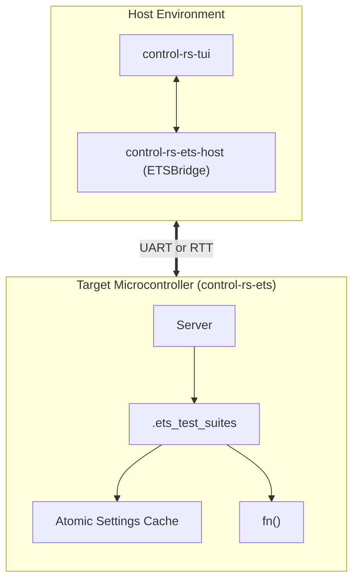

# Exportable Test Suites (Design Document)


---

### 1. Introduction

The standard Rust testing harness (`cargo test`) implicitly relies on the
standard library (`std`), which triggers compilation errors in bare-metal
environments. Attempting to bypass this by setting `harness = false` solves the
immediate compilation failure but leaves a functional void with no native
mechanism to automatically discover, execute or report tests.

This design document establishes the architecture for "Exportable Test Suites"
designed natively for bare-metal embedded Rust. It enables developers to declare
test or benchmark suites across multiple files without maintaining a central
registry, requiring zero boilerplate and little runtime overhead.

---

### 2. Requirements

#### 2.1 Functional Requirements

- **FR-1 — Distributed Suite Discovery**: Test suites and cases must be
  discoverable across modules and crates at runtime without central registration
  tables.
- **FR-2 — Dynamic Parameter Configuration**: Settings on the target must be
  adjustable from the host (`control-rs-tui` or `control-rs-ci`) via typed
  get/set accessors.
- **FR-3 — Embedded Metadata**: Test suites and cases must include descriptive
  metadata and doc-strings stored directly in Flash memory.

#### 2.2 Non-Functional Requirements

- **NFR-1 — Zero Runtime Registration Overhead**: The test registry must be
  constructed during the linking phase.
- **NFR-2 — High ROM/RAM Efficiency**: Test descriptors must reside directly in
  Flash memory (ROM) to conserve RAM.
- **NFR-3 — Low-Overhead Execution**: Running an empty test function must return
  immediately, costing only a few cycles.

#### 2.3 Constraints

- **C-1 — Strict `#![no_std]` Execution**: The target-side framework must
  compile under `#![no_std]` with zero dynamic heap allocation.
- **C-2 — Target Architecture Constraints**: ARM-V6/7/8 and RISC-V.
- **C-3 — Eradication of `static mut`**: All global state and configurable
  settings must use thread-safe interior mutability wrappers, not `static mut`.

---

### 3. Technical Overview

The Exportable Test Suites framework consists of three main components:

1. **Target-side Harness (`control-rs-ets`)**: The on-target interactive Server
   that manages target execution, dynamic settings configuration and CPU
   profiling.
2. **Procedural Macros (`control-rs-macros`)**: Attributes (`#[ets_suite]` and
   `#[ets_setup]`) that abstract the boilerplate of creating descriptors and
   wrapping test main functions.
3. **Host-side Tooling (`control-rs-ets-host` & `control-rs-ci`)**: Transport
   library and automation scripts that cross-compile firmware, parse ELF files
   to discover test suites and drive test execution headlessly or via
   `control-rs-tui`.



---

### 4. Architecture

#### 4.1. Linker-Based Distributed Test Discovery

Instead of building a dynamic test registry at runtime, the framework utilizes a
linker-based distributed slice mechanism. Procedural macros generate
`SuiteDescriptor` instances for each suite and place them in a custom ELF memory
section named `.ets_test_suites`.

During compilation, the `control-rs-ets` build script (`build.rs`) generates a
linker script fragment named `ets_suites.x` containing the following section
configuration:

```ld
SECTIONS
{
  .ets_test_suites :
  {
    . = ALIGN(4);
    PROVIDE_HIDDEN (__ets_test_suites_start = .);
    KEEP (*(.ets_test_suites));
    . = ALIGN(4);
    PROVIDE_HIDDEN (__ets_test_suites_end = .);
  } > FLASH
}
```

This forces the linker to aggregate all `SuiteDescriptor` static structures
contiguously inside Flash memory (ROM) bounded by the hidden start and end
symbols.


The mechanism this section specifies exists because cross-crate linker-section
registration is not automatic. A distributed slice gathers "static elements
into a contiguous section of the binary by the linker" and its elements "may be
defined in the same crate that declares the distributed slice or in any
downstream crate" [1]. In practice the dependency direction matters:
entries declared in a dependency crate have been observed not to appear in the
final slice [2], and the same asymmetry is reported for a plain
`#[used] #[link_section]` static, whose behaviour "is different when the
static is placed in a dependency or in the currently built crate"
[3]. The `KEEP` directive and the `build.rs`-generated linker
script below exist to close exactly that gap, and the descriptor-set
verification in §6.3 is what detects it if they fail.

#### 4.2. Linker Garbage Collection Mitigation

Embedded compilers invoke the linker with optimization flags like
`--gc-sections` to perform dead code elimination. Since the target firmware does
not reference `SuiteDescriptor` statics directly (accessing them only via
pointer arithmetic over the bounding symbols), the linker would normally discard
them.

To prevent this, the crate implements a multi-tiered retention strategy:

1. **`#[used]` Attribute**: Annotating static descriptors tells the
   compiler and linker to retain the symbol. On ELF targets, this generates the
   `SHF_GNU_RETAIN` flag.
2. **`KEEP` Linker Directive**: Wrapping the section wildcard as
   `KEEP (*(.ets_test_suites))` forces the linker to preserve these blocks
   regardless of references.
3. **`--gc-keep-exported` Linker Flag**: Injected via `build.rs` to retain
   default visibility symbols in the ELF dynamic symbol table, enabling host
   tools to resolve them by name.
4. **Undefined Symbol Forcing (`-u`)**: Forces the linker to treat specific
   symbols as undefined, compelling their inclusion from library archives.

This multi-tiered strategy also hedges against
[rust-lang/rust#67209](https://github.com/rust-lang/rust/issues/67209), an
open compiler defect in which `#[used]` + `#[link_section]` statics defined in
dependency (non-root) crates are silently discarded even when a `KEEP`
directive is present.

#### 4.3. Concurrency & State Management (Eradicating `static mut`)

To comply with Rust 2024/2027 and prevent undefined behavior from unsynchronized
interrupt preemption, all global state variables are protected via thread-safe
interior mutability.

1. **Type-Safe Atomic Wrappers**: Configurable settings and execution indices
   use atomic structures (like `AtomicU32Setting` and `AtomicBoolSetting`)
   implementing the `Setting` trait.
2. **Memory Ordering**: Telemetry and configuration variables use
   `Ordering::Relaxed`. Since these variables do not synchronize access to other
   shared buffers, `Relaxed` ordering eliminates the need for expensive memory
   barrier instructions (`DMB`/`DSB`), saving clock cycles.
3. **`SyncUnsafeCell`**: For complex data structures where atomic operations are
   not suitable, `core::cell::SyncUnsafeCell` is used to manage raw pointers (
   `*mut T`), isolating unsafe blocks strictly to the points of dereference.

#### 4.4. Core Trait & Struct Definitions

The core implementation in `control-rs-ets` defines the `SuiteDescriptor` and
`ExecDescriptor` structures, along with the `Setting` trait:

```rust
pub struct ExecDescriptor {
    pub description: &'static str,
    pub name: &'static str,
    pub test_fn: fn(),
}

pub type SettingsSlice = &'static [&'static dyn Setting];

pub struct SuiteDescriptor {
    pub description: &'static str,
    pub executables: &'static [ExecDescriptor],
    pub name: &'static str,
    pub settings: SettingsSlice,
}
```

The settings trait and its atomic implementations are defined as:

```rust
pub type SetResult = Result<(), &'static str>;

pub trait Setting: Sync {
    fn description(&self) -> &'static str;
    fn expected_type(&self) -> SettingType;
    fn get(&self) -> SettingValue;
    fn name(&self) -> &'static str;
    fn set(&self, value: SettingValue) -> SetResult;
}

pub enum SettingType {
    Bool,
    F32,
    I32,
    I8,
    U16,
    U32,
    U64,
    U8,
}

pub enum SettingValue {
    Bool(bool),
    F32(f32),
    I32(i32),
    I8(i8),
    U16(u16),
    U32(u32),
    U64(u64),
    U8(u8),
}
```

```rust
// An atomic setting implementation example from control-rs-ets
pub struct AtomicU32Setting {
    description: &'static str,
    name: &'static str,
    value: core::sync::atomic::AtomicU32,
}

impl AtomicU32Setting {
    pub const fn new(name: &'static str, description: &'static str, initial_value: u32) -> Self {
        Self {
            description,
            name,
            value: core::sync::atomic::AtomicU32::new(initial_value),
        }
    }
}

impl Setting for AtomicU32Setting {
    fn description(&self) -> &'static str { self.description }
    fn expected_type(&self) -> SettingType { SettingType::U32 }
    fn get(&self) -> SettingValue { SettingValue::U32(self.value.load(Ordering::Relaxed)) }
    fn name(&self) -> &'static str { self.name }
    fn set(&self, value: SettingValue) -> SetResult {
        if let SettingValue::U32(v) = value {
            self.value.store(v, Ordering::Relaxed);
            Ok(())
        } else {
            Err("Type mismatch: expected U32")
        }
    }
}
```

#### 4.5. Telemetry & Execution Lifecycle

Interactive testing sessions follow a strict state-machine flow:

1. **Deployment & Reset**: Firmware containing the test server and suites is
   deployed to the target via the target cargo runner (or external programmer).
   `control-rs-ets-host::ETSBridge` then connects to the already-running
   target. Isolation is cooperative (`Command::TryReset`) plus process restart
   on QEMU; a serial session without lab reset wiring cannot power-cycle the
   board.
2. **State Tracking**: Test execution status is evaluated via start and end
   timestamps recorded on the target:
    - **Pending**: No start timestamp recorded.
    - **Running/Failed**: A start timestamp is recorded, but no end timestamp.
      If the test panics, execution halts immediately and the end timestamp is
      never written.
    - **Passed**: Both start and end timestamps are successfully recorded.
3. **Global Indicators**: Global trackers `CURRENT_SUITE` and `CURRENT_TEST` of
   type `TestIndexIndicator` store the running indices, allowing panic handlers
   to report precisely where a crash occurred.

---

### 5. Alternatives

* **Constructor-based runtime registries (`inventory`, `ctor`)**: Rejected on
  mechanism. `inventory` registers types from "any source file linked into your
  application" with no central list [4], but relies on runtime initialization
  functions similar to `__attribute__((constructor))` in C [4]. Its documented
  platform support is restricted to hosted operating systems (Linux, macOS, iOS,
  FreeBSD, Android, Windows, WebAssembly) [4]; bare-metal targets are not
  supported. Similarly, `ctor` supplies constructors for hosted systems [5] and
  explicitly subverts Rust's execution model before `main`. Loader-less embedded
  targets lack dynamic loaders to execute pre-main constructors, and running code
  before hardware clock/peripheral setup induces hardware lockups.
* **`static_init` runtime initialization**: Rejected. `static_init` is `no_std`
  only on Linux or Redox using futex system calls, or relies on spin-loop runtime
  features [6], neither of which is viable on bare metal.
* **`linkme::DistributedSlice`**: Rejected for composite suite descriptors.
  `linkme` [1] is designed for flat, homogeneous slices. Adopting it would force
  splitting `SuiteDescriptor` into separate independently registered slices for
  tests and settings that require reconciliation at runtime. It also inherits
  cross-crate discard risks ([2], [3]), which the explicit linker script and
  `KEEP` directive defined in §4.1 resolve directly.
* **`embedded-test` test harness**: Rejected as the primary harness, though
  acknowledged as relevant prior art. `embedded-test` reads test information
  directly from the ELF file, flashes tests in batch, and resets the target device
  between cases [7]. ETS instead runs a persistent on-target server that
  dispatches tests interactively over a framed communication link, preserving
  target state across an entire test suite.
* **Command-line interface crates (`menu`, `embedded-cli`)**: Rejected for the
  settings surface. `menu` provides interactive command-line interfaces for
  `no_std` programs [8] and `embedded-cli` parses typed arguments via a
  `FromArgument` trait [9]. Both focus on interactive on-target ASCII terminal
  parsing, whereas ETS enforces structured, binary host-driven telemetry
  (`host-comm-design.md`) without on-target string processing.
* **Standard `cargo test` harness (libtest)**: Rejected. Requires host OS
  allocations (dynamic heap, threads, standard I/O) that are unavailable on
  bare-metal targets.
* **Nightly `custom_test_frameworks` feature**: Rejected. Relies on unstable
  compiler features (`#![feature(custom_test_frameworks)]`), violating stable
  toolchain compilation constraints.
* **`static mut` for state tracking**: Rejected. Violates Rust's strict
  aliasing rules, introduces data race risks, and is deprecated in current Rust
  editions. Interior mutability is achieved via target-safe atomic wrappers.
* **Semihosting-only telemetry**: Rejected. Binds target execution to an active
  JTAG/SWD debug probe, violating C-3 transport independence.

### 6. Verification & Validation

#### 6.1 Approach

The implementation must produce evidence that every declared suite reaches the
final binary regardless of which crate declared it, that the linker cannot
discard registrations, that discovery reports exactly what was declared, and
that none of this costs a heap allocation.

| Method | Mechanism |
|:-------|:----------|
| Requirements-based test | Descriptor set recovered from the linked ELF compared against the source annotations |
| Requirements-based test | The same comparison for suites declared in a dependency crate, not only in the top-level crate |
| Requirements-based test | Target dynamic setting value modification via typed get/set accessors |
| Compile-time shape check | Descriptor type mismatch between declaration and element is a compile error |
| Static analysis | Section presence after linking with `--gc-sections` |
| Resource usage evaluation | Execution overhead of an empty test function |
| Static analysis | `cargo clippy-ci`; inspection for allocation in registration and discovery |
| Inspection | Target architecture compilation across ARM-V6/7/8 and RISC-V |
| Static analysis | Eradication of `static mut` in favor of atomic interior mutability wrappers |
| Coverage measurement | `cargo coverage` on host-testable descriptor logic |

The dependency-crate case is called out separately because it is the case that
has been observed to fail in comparable schemes ([2], [3]).

Target: 80% line coverage of host-testable descriptor and discovery logic,
measured with `cargo coverage`.

Excluded: the linker script and `build.rs` generation, whose correctness is
observed through the ELF rather than through line coverage; and generated
descriptor statics, which are data.

1. **Multi-crate binary**: Build a firmware image whose suites are declared
   across at least two crates and confirm all of them are discovered.
2. **Hardware run**: Execute the discovered suites on a Teensy 4.1 through
   `control-rs-ets-host`.
3. **Downstream declaration**: Declare a suite in a crate outside this
   workspace and confirm it registers, which is the property distributed
   registration exists to provide [1].

#### 6.2 Acceptance

| Claim | Oracle | Measure | Bound |
|:------|:-------|:--------|:------|
| Registration completeness | Source annotations across all crates in the binary | Descriptors in the ELF section | Exact set equality |
| Dependency-crate registration | A suite declared in a dependency | Present in the final binary | Present |
| Dynamic setting mutation | Host get/set commands | Atomic setting value on target | Exact value match |
| Retention under GC | The same ELF linked with `--gc-sections` | Descriptors present | Unchanged |
| Type safety | A descriptor of the wrong type | Build outcome | Compile error, not a runtime mismatch |
| Discovery fidelity | Descriptors in the ELF | Suites and cases reported to the host | Exact set equality |
| Execution overhead | Empty test function invocation | CPU clock cycles | <= 10 cycles |
| Allocation freedom | Disassembly of a target build | Allocator symbols on the registration or discovery path | 0 |
| Section cost | A suite of *n* cases | Flash bytes in the descriptor section | Linear in *n*, no per-suite fixed overhead beyond the header |

#### 6.3 Limits

- Telemetry delivery latency (<16 ms) and host UI frame pacing are verified
  by `control-rs-tui` (`documentation/tui/tui-design.md`), not within target
  test-suite crate scope.
- ExecDescriptor attribute extensions (`#[should_panic]`, `#[ignore]`,
  `#[timeout]`): These attributes are deferred to future revisions; test
  execution in this release treats any target panic as an immediate suite
  failure.
- Linker behaviour outside the linkers the matrix uses. The section and script
  coordination is exercised with those only, and the cross-crate hazard above
  is linker-dependent.
- Behaviour when two crates declare the same suite name. Deduplication is
  unspecified and untested.
- Ordering of discovered suites. Nothing guarantees or tests a stable order
  across builds, and the host must not depend on one.
- Upper bound on suite or case count. No limit is stated and none is measured.
- Interaction with link-time optimization. Registration is verified for the
  workspace's current profile settings only.

### 7. Performance & Resource Considerations

* **ROM/RAM Overhead**: To operate within the 32 KB Flash and 8 KB RAM budget,
  the target Server utilizes zero heap allocations and avoids unnecessary string
  formatting on-device. All descriptors reside strictly in Flash.
* **Atomic Ordering**: Setting telemetry uses `Ordering::Relaxed` to bypass
  ARM memory barrier instructions (`DMB`/`DSB`), which can take multiple
  clock cycles.
* **Critical Sections**: On ARMv6-M architectures, software-emulated CAS
  operations disable interrupts. Developers must minimize the frequency of
  setting updates during time-critical control loops to avoid inducing interrupt
  latency jitter.

---

### 8. Risks & Open Questions

* **Linker Compatibility**: Older GNU ld or LLVM lld versions may not respect
  the `SHF_GNU_RETAIN` flag. Forcing symbol retention must rely heavily on the
  `KEEP` directive inside the generated `ets_suites.x` script as a fail-safe.
* **Cross-Crate Discovery (`rust-lang/rust#67209`)**: The open upstream defect
  drops `#[used]` + `#[link_section]` statics defined in dependency crates
  even with `KEEP`. Open question: must suites be declarable in separate
  crates or only separate modules within one crate? Multi-module discovery is
  unaffected; multi-crate discovery requires the retention strategy in §4.2 as
  a hedge and must be validated per target.
* **`ExecDescriptor` Attribute Extensibility**: While execution control
  attributes such as `#[should_panic]`, `#[ignore]`, and `#[timeout]` are
  standard in host harnesses, `ExecDescriptor` (§4.4) currently carries only
  `description`, `name`, and `test_fn`. Prior art (`embedded-test`) encodes
  these attributes as macro-generated ELF metadata rather than struct fields.
  Open question: whether to add struct fields (bitflags, `Option<Duration>`)
  or macro-time ELF metadata, under the zero-heap, Flash-resident constraint.
* **Settings Registry Generalization**: The `Setting` registry fills a genuine
  ecosystem gap. Open question whether it should eventually be generalized
  into a small standalone crate rather than remaining internal to
  `control-rs-ets`.

---

### 9. Development Plan

| Task / Feature                              | Description                                                                                                       | Estimated Effort |
|:--------------------------------------------|:------------------------------------------------------------------------------------------------------------------|:-----------------|
| **Step 1: Core Structs & Traits**           | Define `SuiteDescriptor`, `Setting` trait and type-safe atomic settings wrappers.                                 | 0.5 days         |
| **Step 2: Linker Script & Injection**       | Develop the `build.rs` script to generate the custom `ets_suites.x` script fragment containing `KEEP` directives. | 0.5 days         |
| **Step 3: Target Server State Machine**     | Implement the on-target Server's state machine, timestamp-based lifecycle tracking and panic handlers.            | 0.5 days         |
| **Step 4: Host-Side ELF Discovery** | Implement ELF section parsing (using `goblin`/`elf`) inside `control-rs-ets-host` to autodiscover suites.             | 0.5 days         |

---

### 10. Revision History

| Revision | Date           | Author          | Description                                                                                                           |
|:---------|:---------------|:----------------|:----------------------------------------------------------------------------------------------------------------------|
| 1.0      | May 23, 2026   | @MitchellDScott | Initial specification for exportable embedded test suites and descriptors.                                            |
| 1.1      | July 18, 2026  | @MitchellDScott | Linker discovery & atomics: integrated linker GC mitigation, ARMv6-M atomic wrappers, and `control-rs-ets` alignment. |
| 1.2      | August 6, 2026 | @MitchellDScott | Tooling hardening: unified linker script name (`ets_suites.x`) and host-side ELF section metadata parsing.            |
| 1.3      | September 9, 2026 | @MitchellDScott | Packaging alignment: allocated host discovery and transport to `control-rs-ets-host` and interactive driver to `control-rs-tui`. |
| 1.4 | September 9, 2026 | @MitchellDScott | Project split: relocated to `documentation/ets/test-suite-design.md`; host tooling references retargeted to `control-rs-ets-host` and `control-rs-ci`. |
| 1.5      | September 9, 2026 | @MitchellDScott | Citation pass: grounded the cross-crate registration hazard that motivates the `KEEP` directive, added evidence-backed rejections for `inventory`, `ctor`, `static_init`, `embedded-test` and the CLI crates, restructured §6 per `vv-standards.md`. |
| 1.6      | September 9, 2026 | @MitchellDScott | Structural hardening: demoted badge to Draft, numbered §2 subsections, eliminated rogue FR-4, mapped NFR-4 to §6.7, mapped C-2/C-3 in §6.4, clarified firmware deployment and attribute extensions, standardized references. |
| 1.7      | September 9, 2026 | @MitchellDScott | Dropped the author-year / `[n]` mapping table. |
| 1.8      | September 18, 2026 | @MitchellDScott | Serial/QEMU isolation: bridge connects to already-running firmware; `TryReset` is cooperative, not a power cycle. |

---

## References

[1] linkme, "linkme: safe cross-platform linker shenanigans," *GitHub, dtolnay/linkme*. [Online]. Available: https://github.com/dtolnay/linkme. Accessed: Aug. 7, 2026.

[2] kcuzner, "Distributed slice members in dependency crates are discarded (Issue #36)," *GitHub, dtolnay/linkme*. [Online]. Available: https://github.com/dtolnay/linkme/issues/36. Accessed: Aug. 7, 2026.

[3] jfrimmel, "#[link_section] is only usable from the root crate (Issue #67209)," *GitHub, rust-lang/rust*. [Online]. Available: https://github.com/rust-lang/rust/issues/67209. Accessed: Aug. 7, 2026.

[4] inventory, "inventory: typed distributed plugin registration," *GitHub, dtolnay/inventory*. [Online]. Available: https://github.com/dtolnay/inventory. Accessed: Aug. 7, 2026.

[5] ctor, "ctor," *docs.rs*. [Online]. Available: https://docs.rs/ctor/latest/ctor/. Accessed: Aug. 7, 2026.

[6] static_init, "static_init," *docs.rs*. [Online]. Available: https://docs.rs/static_init/latest/static_init/. Accessed: Aug. 7, 2026.

[7] embedded-test, "embedded_test," *docs.rs*. [Online]. Available: https://docs.rs/embedded-test/latest/embedded_test/. Accessed: Aug. 7, 2026.

[8] menu, "menu," *docs.rs*. [Online]. Available: https://docs.rs/menu/latest/menu/. Accessed: Aug. 7, 2026.

[9] embedded-cli, "embedded-cli," *lib.rs (mirror of crates.io README)*. [Online]. Available: https://lib.rs/crates/embedded-cli. Accessed: Aug. 7, 2026.
