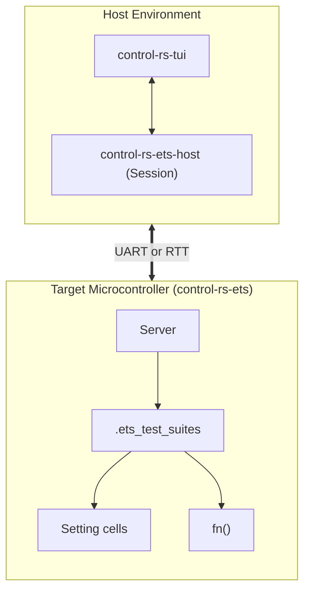

# Exportable Test Suites (Design Document)


---

### 1. Introduction

The standard Rust testing harness (`cargo test`) implicitly relies on the
standard library (`std`), which triggers compilation errors in bare-metal
environments. Attempting to bypass this by setting `harness = false` solves the
immediate compilation failure but leaves a functional void with no native
mechanism to automatically discover, execute or report tests.

This design document establishes the architecture for "Exportable Test Suites"
designed natively for bare-metal embedded Rust. It enables developers to declare
both single-shot atomic benchmark suites and continuous `LifecycleTask` suites
across multiple files without maintaining central registration tables, requiring
zero boilerplate and minimal runtime overhead.

Under the single-job executive (ADR-0002, `ets-executive-design.md`), developers
author typed contracts (`LifecycleTask`, `Packet` and settings) and
`#[ets_suite]` erases them into data-only descriptors with thin, monomorphic
function pointers. These reside in contiguous ROM linker sections without the
alignment or dyn-compatibility penalties of fat trait pointers (`dyn Trait`).

---

### 2. Requirements

#### 2.1 Functional Requirements

- **FR-1 — Distributed Suite Discovery**: Test suites and cases must be
  discoverable across modules and crates at runtime without central registration
  tables.
- **FR-2 — Dynamic Parameter Configuration**: Settings on the target must be
  adjustable from the host (`control-rs-tui` / `control-rs-ets-host`) via typed
  get/set accessors.
- **FR-3 — Embedded Metadata**: Test suites and cases must include descriptive
  metadata and doc-strings stored directly in Flash memory.
- **FR-4 — Lifecycle Task Registration**: Test suites must support registering
  both atomic test functions (`fn()`) and continuous lifecycle tasks
  (`LifecycleTask` trait implementors).
- **FR-5 — Monomorphic Wrapper Generation**: Procedural macros must generate
  five thin function pointers (`setup`, `step`, `reset`, `teardown` and
  `safe_state`) wrapping a lifecycle task, so descriptors fit contiguous Flash
  arrays without dynamic dispatch (`dyn`).
- **FR-6 — Named Primitive Settings**: Each setting is a named primitive
  (`u8`, `u16`, `u32`, `i32`, `f32` or `bool`) exposed as a ROM descriptor with
  name, description, bounds and typed `get` and `set` function pointers, so the
  host renders and edits it from its type alone.

#### 2.2 Non-Functional Requirements

- **NFR-1 — Zero Runtime Registration Overhead**: The test registry must be
  constructed during the linking phase.
- **NFR-2 — High ROM/RAM Efficiency**: Test descriptors must reside directly in
  Flash memory (ROM) to conserve RAM.
- **NFR-3 — Low-Overhead Execution**: Running an empty test function must return
  immediately, costing only a few cycles.

#### 2.3 Constraints

- **C-1 — Strict `#![no_std]` Execution**: The target-side framework must
  compile under `#![no_std]` with zero dynamic heap allocation.
- **C-2 — Target Architecture Constraints**: ARM-V6/7/8 and RISC-V.
- **C-3 — Eradication of `static mut`**: All global state and configurable
  settings must use interior-mutable cells, not `static mut`; settings cells are
  written only by the server (`ets-executive-design.md` C-4).

---

### 3. Technical Overview

The Exportable Test Suites framework consists of three main components:

1. **Target-side Harness (`control-rs-ets`)**: The on-target interactive Server
   that manages target execution, dynamic settings configuration and CPU
   profiling.
2. **Procedural Macros (`control-rs-macros`)**: Attributes (`#[ets_suite]` and
   `#[ets_setup]`) that abstract the boilerplate of creating descriptors and
   wrapping test main functions.
3. **Host-side Tooling (`control-rs-ets-host` & `control-rs-ci`)**: Transport
   library and gate binary that cross-compile firmware, discover suites over
   the wire in a discovery-mode session (`Command::TryReset`, then
   `Command::ListSuites`, answered by `TargetInfo`, then `SuiteInfo`,
   `ExecutableInfo` and `SettingInfo` telemetry) and
   drive test execution headlessly or via `control-rs-tui`. The host does not
   parse the ELF.


```mermaid
flowchart TD
    Host <==>|UART or RTT| MCU

    subgraph Host ["Host Environment"]
        direction TB
        TUI["control-rs-tui"]
        Bridge["control-rs-ets-host (Session)"]
        TUI <--> Bridge
    end

    subgraph MCU ["Target Microcontroller (control-rs-ets)"]
        direction TB
        Server["Server"]
        Suites[".ets_test_suites"]
        Settings["Setting cells"]
        Tests["fn() "]
        Server --> Suites
        Suites --> Settings
        Suites --> Tests
    end
```

---

### 4. Architecture

#### 4.1 Linker-Based Distributed Test Discovery

Instead of building a dynamic test registry at runtime, the framework utilizes a
linker-based distributed slice mechanism. Procedural macros generate one
`SuiteDescriptor` static per suite and place a `&'static SuiteDescriptor`
pointer to it (`SUITE_DESCRIPTOR_PTR`) in a custom ELF memory section named
`.ets_test_suites` (`macros-design.md` §4.1).

During compilation, the `control-rs-ets` build script (`build.rs`) generates a
linker script fragment named `ets_suites.x` containing the following section
configuration:

```ld
SECTIONS
{
  .ets_test_suites :
  {
    . = ALIGN(4);
    PROVIDE_HIDDEN (__ets_test_suites_start = .);
    KEEP (*(.ets_test_suites));
    . = ALIGN(4);
    PROVIDE_HIDDEN (__ets_test_suites_end = .);
  } > FLASH
}
```

This forces the linker to aggregate the descriptor pointers contiguously
inside Flash memory (ROM) bounded by the hidden start and end symbols, which
the server reads as a `&'static [&'static SuiteDescriptor]`
(`control-rs-ets::util`). The descriptors themselves stay in ordinary
read-only data.


The mechanism this section specifies exists because cross-crate linker-section
registration is not automatic. A distributed slice gathers "static elements
into a contiguous section of the binary by the linker" and its elements "may be
defined in the same crate that declares the distributed slice or in any
downstream crate" (linkme, 2026a). In practice the dependency direction matters:
entries declared in a dependency crate have been observed not to appear in the
final slice (kcuzner, 2021), and the same asymmetry is reported for a plain
`#[used] #[link_section]` static, whose behaviour "is different when the
static is placed in a dependency or in the currently built crate"
(jfrimmel, 2019). The `KEEP` directive and the `build.rs`-generated linker
script below exist to close exactly that gap, and the descriptor-set
verification in §6.3 is what detects it if they fail.

#### 4.2 Linker Garbage Collection Mitigation

Embedded compilers invoke the linker with optimization flags like
`--gc-sections` to perform dead code elimination. Since the target firmware does
not reference `SuiteDescriptor` statics directly (accessing them only via
pointer arithmetic over the bounding symbols), the linker would normally discard
them.

To prevent this, the crate implements a multi-tiered retention strategy:

1. **`#[used]` Attribute**: Annotating static descriptors tells the
   compiler and linker to retain the symbol. On ELF targets, this generates the
   `SHF_GNU_RETAIN` flag.
2. **`KEEP` Linker Directive**: Wrapping the section wildcard as
   `KEEP (*(.ets_test_suites))` forces the linker to preserve these blocks
   regardless of references.
Items 1 and 2 are the shipped strategy (`control-rs-ets/build.rs` emits the
`KEEP` fragment and no linker flags). Two further mitigations are not used:
`--gc-keep-exported` and undefined-symbol forcing (`-u`). Discovery runs over
the wire, so no host tool resolves descriptor symbols by name, and `KEEP` plus
the §6.3 descriptor-set check already cover the cross-crate discard risk.

This multi-tiered strategy also hedges against
[rust-lang/rust#67209](https://github.com/rust-lang/rust/issues/67209), an
open compiler defect in which `#[used]` + `#[link_section]` statics defined in
dependency (non-root) crates are silently discarded even when a `KEEP`
directive is present.

#### 4.3 Concurrency & State Management (Eradicating `static mut`)

To comply with Rust 2024 and prevent undefined behavior from aliased mutable
statics, all global state uses interior mutability.

1. **Setting Cells**: A setting is a `SettingCell<T>` static. The server is the
   master loop and the only writer; it writes whole values while idle or at a
   step boundary, when no executable code runs. Executable code reads a copy.
   The cells need no atomics, locks or sequence counters, and interrupt handlers
   have no access (`ets-executive-design.md` §4.4, C-6).
2. **Executive State**: The phase indicator, the active-descriptor pointer and
   the current-item indicator are written only in executive context and read by
   the fault path after it masks interrupts, so they need plain loads and
   stores: atomic load and store where the target has them and a plain cell
   elsewhere (`ets-executive-design.md` §4.9, C-10).
3. **`TaskSlot<T>`**: Lifecycle task state lives in one interior-mutable static
   per task. The `Sync` implementation is justified by one active run, server-thread
   access between arming and completion, and a fault path that never touches
   the slot.

#### 4.4 Core Trait & Struct Definitions

The core implementation in `control-rs-ets` defines data-only descriptors. A
plain case is a one-step `Atomic` executable whose other four function pointers
are shared no-ops:

```rust
pub struct ExecDescriptor {
    pub name: &'static str,
    pub description: &'static str,
    pub modes: u8,                       // allowed Atomic / Lockstep / FreeRunning / Periodic / Triggered
    pub input: PacketInfo,
    pub output: PacketInfo,
    pub link_timeout_ms: u32,
    pub setup: fn() -> Result<(), &'static str>,
    pub step: fn(&mut TaskIo<'_>) -> TaskOutcome,
    pub reset: fn() -> Result<(), &'static str>,
    pub teardown: fn() -> Result<(), &'static str>,
    pub safe_state: fn(),
}

pub struct SettingDescriptor {
    pub name: &'static str,
    pub description: &'static str,
    pub min: Param,
    pub max: Param,
    pub get: fn() -> Param,
    pub set: fn(Param) -> Result<(), SettingError>,
}

pub struct SuiteDescriptor {
    pub name: &'static str,
    pub description: &'static str,
    pub executables: &'static [ExecDescriptor],
    pub settings: &'static [SettingDescriptor],
}
```

Descriptors name no server, transport or profiler type.

#### 4.5 Typed Settings

A setting is a `static` of `SettingCell<T>` for one primitive `T`. The doc
comment is the description and an attribute gives the bounds:

```rust
/// Proportional pitch gain
#[setting(min = 0.0, max = 50.0)]
static KP_PITCH: SettingCell<f32> = SettingCell::new(1.0);
```

`get` returns the value as a typed `Param`, and `set` rejects a `Param` of
another type or a value outside the bounds before storing it. Discovery sends
the name, value, bounds and description of each setting
(`ets-link-design.md` §4.8), so the host renders and edits a setting from its
type. A group of related gains is several settings, and each write changes one
(`ets-executive-design.md` §4.4).

#### 4.6 Monomorphic Wrappers

Storing trait objects (`dyn LifecycleTask`) in Flash linker sections is
infeasible for three reasons:
1. **Fat Pointer Alignment**: `&dyn Trait` is two words. Arrays of fat pointers
   in linker sections risk alignment padding mismatches across architectures.
2. **Dyn Compatibility**: Associated types and constants on `LifecycleTask`
   make it non-dyn-compatible.
3. **Vtable Overhead**: Monomorphic inlining generates smaller and faster code
   than indirect dispatch.

`#[ets_suite]` therefore expands each `impl LifecycleTask for X` into a
`static SLOT: TaskSlot<X>` and five monomorphic wrappers stored in the
`ExecDescriptor`:

```rust
// Macro-generated wrapper (step)
fn __ets_step_attitude(io: &mut TaskIo<'_>) -> TaskOutcome {
    // decode Input from io.input, call X::step on SLOT, encode Output into io.output
}
```

The developer writes idiomatic Rust traits; the wrappers are the only place
typed code is erased to buffers. The run loop lives in the runner
(`ets-executive-design.md` §4.2), never in a wrapper.

#### 4.7 Telemetry & Execution Lifecycle

Interactive testing sessions follow a strict flow:

1. **Deployment & Reset**: Firmware containing the test server and suites is
   deployed to the target via the target cargo runner (or external programmer).
   `control-rs-ets-host::Session` then connects to the already-running target.
   Isolation is cooperative (`Command::TryReset`) plus process restart on QEMU;
   a blocked target needs a fed board watchdog or an external reset
   (`ets-executive-design.md` §4.6).
2. **State Tracking**: The runner reports `ItemState` messages (`Running`,
   then `Done` with the run verdict) for an item. A panic never returns to the runner; the
   fault path reports the failed state for the item in the current-item
   indicator.
3. **Global Indicators**: `CURRENT_ITEM` stores the running suite and item, so
   the fault path reports where a crash occurred.

---

### 5. Alternatives

* **Constructor-based runtime registries (`inventory`, `ctor`)**: Rejected on
  mechanism. `inventory` registers types from "any source file linked into your
  application" with no central list (inventory, 2026a), but relies on runtime initialization
  functions similar to `__attribute__((constructor))` in C (inventory, 2026a). Its documented
  platform support is restricted to hosted operating systems (Linux, macOS, iOS,
  FreeBSD, Android, Windows, WebAssembly) (inventory, 2026a); bare-metal targets are not
  supported. Similarly, `ctor` supplies constructors for hosted systems (ctor, 2026) and
  explicitly subverts Rust's execution model before `main`. Loader-less embedded
  targets lack dynamic loaders to execute pre-main constructors, and running code
  before hardware clock/peripheral setup induces hardware lockups.
* **`static_init` runtime initialization**: Rejected. `static_init` is `no_std`
  only on Linux or Redox using futex system calls, or relies on spin-loop runtime
  features (static_init, 2025), neither of which is viable on bare metal.
* **`linkme::DistributedSlice`**: Not adopted. `linkme` 0.3.37 is `#![no_std]` and handles `target_os = "none"` through the ELF `__start_`/`__stop_` section symbols (source of `linkme-impl` `declaration.rs`), so neither `std` nor element homogeneity rules it out: the `.ets_test_suites` section already holds a homogeneous slice of `&'static SuiteDescriptor`. The
  hand-rolled mechanism is a linker fragment and two boundary symbols, already
  shipped; on bare metal a custom `SECTIONS` script (for example
  `cortex-m-rt`'s `link.x`) must still place the section explicitly, so `linkme`
  would add a proc-macro dependency without removing linker-script work. It
  also inherits the cross-crate discard risk (kcuzner, 2021; jfrimmel, 2019) that §4.1's `KEEP`
  directive addresses.
* **`embedded-test` test harness**: Rejected as the primary harness, though
  acknowledged as relevant prior art. `embedded-test` reads test information
  directly from the ELF file, flashes tests in batch and resets the target device
  between cases (embedded-test, 2026). ETS instead runs a persistent on-target server that
  dispatches tests interactively over a message link (`ets-link-design.md`), preserving
  target state across an entire test suite.
* **Command-line interface crates (`menu`, `embedded-cli`)**: Rejected for the
  settings surface. `menu` provides interactive command-line interfaces for
  `no_std` programs (menu, 2024) and `embedded-cli` parses typed arguments via a
  `FromArgument` trait (embedded-cli, 2024). Both focus on interactive on-target ASCII terminal
  parsing, whereas ETS enforces structured, binary host-driven telemetry
  (`ets-link-design.md`) without on-target string processing.
* **Standard `cargo test` harness (libtest)**: Rejected. Requires host OS
  allocations (dynamic heap, threads, standard I/O) that are unavailable on
  bare-metal targets.
* **Nightly `custom_test_frameworks` feature**: Rejected. Relies on unstable
  compiler features (`#![feature(custom_test_frameworks)]`), violating stable
  toolchain compilation constraints.
* **`static mut` for state tracking**: Rejected. Violates Rust's strict
  aliasing rules, introduces data race risks and is deprecated in current Rust
  editions. Interior mutability is achieved via server-written cells.
* **Semihosting-only telemetry**: Rejected. Binds target execution to an active
  JTAG/SWD debug probe, violating C-3 transport independence.

### 6. Verification & Validation

#### 6.1 Verification

The implementation must produce evidence that every declared suite reaches the
final binary regardless of which crate declared it, that the linker cannot
discard registrations, that discovery reports exactly what was declared, and
that none of this costs a heap allocation.

| Condition | Requirement | Method | Target | Criterion |
|:----------|:------------|:-------|:-------|:----------|
| VC-1.1 | FR-1 | `libtest` | descriptor set recovered from the linked ELF | Equals the source annotations, including suites declared in a dependency crate |
| VC-2.1 | FR-2 | `libtest` | `control_rs_ets::settings::tests::typed_get_set` | A typed write replaces the whole value after bounds checking |
| VC-3.1 | FR-3 | `libtest` | `control_rs_ets::discovery::tests::metadata_reported` | Descriptions and bounds reach discovery unchanged |
| VC-4.1 | FR-4 | `libtest` | `control_rs_ets::lifecycle::tests::task_registration` | A registered task appears in discovery beside cases |
| VC-5.1 | FR-5 | Compile-time shape check | descriptor type mismatch | A mismatch between declaration and element is a compile error |
| VC-6.1 | FR-6 | `libtest` | `control_rs_ets::settings::tests::param_type_and_bounds` | A `set` with a mismatched `Param` type or an out-of-bounds value fails and leaves the cell unchanged |
| VC-21.1 | NFR-1 | Static analysis | section presence after `--gc-sections` | Registrations survive linking with no runtime registration code |
| VC-22.1 | NFR-2 | Inspection | ELF section sizes | Descriptors occupy Flash only |
| VC-23.1 | NFR-3 | Resource usage evaluation | empty test function on target | Cycles per call recorded and within the project target |
| VC-31.1 | C-1 | Static analysis | `cargo ci` (clippy stage); inspection | No allocation in registration and discovery |
| VC-32.1 | C-2 | Inspection | builds for ARM-V6/7/8 and RISC-V | Compiles on every listed architecture |
| VC-33.1 | C-3 | Static analysis | source search | No `static mut`; mutable state is a `SettingCell`, a `TaskSlot` or an executive state cell |

The dependency-crate case is called out separately because it is the case that
has been observed to fail in comparable schemes (kcuzner, 2021; jfrimmel, 2019).

Target: 80% line coverage of host-testable descriptor and discovery logic,
measured with `cargo coverage`.

Excluded: the linker script and `build.rs` generation, whose correctness is
observed through the ELF rather than through line coverage; and generated
descriptor statics, which are data.

1. **Multi-crate binary**: Build a firmware image whose suites are declared
   across at least two crates and confirm all of them are discovered.
2. **Hardware run**: Execute the discovered suites on a Teensy 4.1 through
   `control-rs-ets-host`.
3. **Downstream declaration**: Declare a suite in a crate outside this
   workspace and confirm it registers, which is the property distributed
   registration exists to provide (linkme, 2026a).

#### 6.2 Acceptance

| Claim | Oracle | Measure | Bound |
|:------|:-------|:--------|:------|
| Registration completeness | Source annotations across all crates in the binary | Descriptors in the ELF section | Exact set equality |
| Dependency-crate registration | A suite declared in a dependency | Present in the final binary | Present |
| Dynamic setting mutation | Host get/set commands | Setting cell value on target | Exact value match |
| Retention under GC | The same ELF linked with `--gc-sections` | Descriptors present | Unchanged |
| Type safety | A descriptor of the wrong type | Build outcome | Compile error, not a runtime mismatch |
| Discovery fidelity | Descriptors in the ELF | Suites and cases reported to the host | Exact set equality |
| Execution overhead | Empty test function invocation | CPU clock cycles | <= 10 cycles |
| Allocation freedom | Disassembly of a target build | Allocator symbols on the registration or discovery path | 0 |
| Section cost | A suite of *n* cases | Flash bytes in the descriptor section | Linear in *n*, no per-suite fixed overhead beyond the header |
| Lifecycle task registration | Macro annotated `LifecycleTask` | `ExecDescriptor` with five wrapper pointers | Present and callable |
| Setting descriptor | Annotated setting static | Name, type and bounds | Exact match with the declaration |

#### 6.3 Limits

- Telemetry delivery latency (<16 ms) and host UI frame pacing are verified
  by `control-rs-tui` (`documentation/ets/tui-design.md`), not within target
  test-suite crate scope.
- ExecDescriptor attribute extensions (`#[should_panic]`, `#[ignore]`,
  `#[timeout]`): These attributes are deferred to future revisions; test
  execution in this release treats any target panic as an immediate suite
  failure.
- Linker behaviour outside the linkers the matrix uses. The section and script
  coordination is exercised with those only, and the cross-crate hazard above
  is linker-dependent.
- Behaviour when two crates declare the same suite name. Deduplication is
  unspecified and untested.
- Ordering of discovered suites. Nothing guarantees or tests a stable order
  across builds, and the host must not depend on one.
- Upper bound on suite or case count. No limit is stated and none is measured.
- Interaction with link-time optimization. Registration is verified for the
  workspace's current profile settings only.

### 7. Performance & Resource Considerations

* **ROM/RAM Overhead**: To operate within the 32 KB Flash and 8 KB RAM budget,
  the target Server utilizes zero heap allocations and avoids unnecessary string
  formatting on-device. All descriptors and setting names, descriptions and bounds reside in Flash.
* **Setting Writes**: Writes are plain stores by the server at idle or a step
  boundary, so they add no atomic or interrupt-masking cost to control loops.
  Each setting costs one descriptor in Flash.

---

### 8. Risks & Open Questions

* **Linker Compatibility**: Older GNU ld or LLVM lld versions may not respect
  the `SHF_GNU_RETAIN` flag. Forcing symbol retention must rely heavily on the
  `KEEP` directive inside the generated `ets_suites.x` script as a fail-safe.
* **Cross-Crate Discovery (`rust-lang/rust#67209`)**: The open upstream defect
  drops `#[used]` + `#[link_section]` statics defined in dependency crates
  even with `KEEP`. Open question: must suites be declarable in separate
  crates or only separate modules within one crate? Multi-module discovery is
  unaffected; multi-crate discovery requires the retention strategy in §4.2 as
  a hedge and must be validated per target.
* **`ExecDescriptor` Attribute Extensibility**: While execution control
  attributes such as `#[should_panic]`, `#[ignore]`, and `#[timeout]` are
  standard in host harnesses, `ExecDescriptor` (§4.4) currently carries only
  `description`, `name` and `test_fn`. Prior art (`embedded-test`) encodes
  these attributes as macro-generated ELF metadata rather than struct fields.
  Open question: whether to add struct fields (bitflags, `Option<Duration>`)
  or macro-time ELF metadata, under the zero-heap, Flash-resident constraint.

---

### 9. Development Plan

| Phase | Delivers | Requirements | Effort | Status |
|:------|:---------|:-------------|:-------|:-------|
| 1. Core structs and traits | `SuiteDescriptor`, `ExecDescriptor`, `SettingDescriptor` and `SettingCell` | FR-3, FR-6, C-3 | 0.5 day | Planned |
| 2. Linker script and injection | `build.rs` generation of the `ets_suites.x` fragment with `KEEP` directives | FR-1, NFR-1, NFR-2 | 0.5 day | Planned |
| 3. Target server state machine | On-target server state machine, timestamp-based lifecycle tracking and panic handlers | FR-4, NFR-3 | 0.5 day | Planned |
| 4. Host-side wire discovery | Discovery session in `control-rs-ets-host` (`TryReset` and `ListSuites`, `SuiteInfo` and per-case replies, now `ExecutableInfo`); no ELF parsing | FR-1, FR-3 | Shipped | Complete |
| 5. Lifecycle tasks and settings | Monomorphic wrapper codegen in `#[ets_suite]` and setting descriptors with bounds from `#[setting]` | FR-2, FR-4, FR-5, FR-6 | 1.0 day | Planned |

---

### 10. Revision History

| Revision | Date           | Author          | Description                                                                                                           |
|:---------|:---------------|:----------------|:----------------------------------------------------------------------------------------------------------------------|
| 1.0      | May 23, 2026   | @MitchellDScott | Initial specification for exportable embedded test suites and descriptors.                                            |
| 1.1      | July 18, 2026  | @MitchellDScott | Linker discovery & atomics: integrated linker GC mitigation, ARMv6-M atomic wrappers, and `control-rs-ets` alignment. |
| 1.2      | August 6, 2026 | @MitchellDScott | Tooling hardening: unified linker script name (`ets_suites.x`) and host-side ELF section metadata parsing.            |
| 1.3      | September 9, 2026 | @MitchellDScott | Packaging alignment: allocated host discovery and transport to `control-rs-ets-host` and interactive driver to `control-rs-tui`. |
| 1.4 | September 9, 2026 | @MitchellDScott | Project split: relocated to `documentation/ets/test-suite-design.md`; host tooling references retargeted to `control-rs-ets-host` and `control-rs-ci`. |
| 1.5      | September 9, 2026 | @MitchellDScott | Citation pass: grounded the cross-crate registration hazard that motivates the `KEEP` directive, added evidence-backed rejections for `inventory`, `ctor`, `static_init`, `embedded-test` and the CLI crates, restructured §6 per `vv-standards.md`. |
| 1.6      | September 9, 2026 | @MitchellDScott | Structural hardening: demoted badge to Draft, numbered §2 subsections, eliminated rogue FR-4, mapped NFR-4 to §6.7, mapped C-2/C-3 in §6.4, clarified firmware deployment and attribute extensions, standardized references. |
| 1.7      | September 9, 2026 | @MitchellDScott | Dropped the author-year / `[n]` mapping table. |
| 1.8      | September 18, 2026 | @MitchellDScott | Serial/QEMU isolation: bridge connects to already-running firmware; `TryReset` is cooperative, not a power cycle. |
| 1.9      | September 24, 2026 | @MitchellDScott | FR-2 names `control-rs-tui` as the settings editor; the `control-rs-ci` `ets` gate runs suites headless and edits no settings. Discovery is over the wire (no host ELF parsing, Step 4 shipped); the section holds `&'static SuiteDescriptor` pointers; unused `--gc-keep-exported` / `-u` retention dropped; `linkme` row restated. |
| 1.10     | September 24, 2026 | @MitchellDScott | Discovery replies begin with `TargetInfo` (host-comm Step 4). |
| 2.0      | October 11, 2026 | @MitchellDScott | Overhaul for unified ETS and HIL (ADR-0002): added `LifecycleTask` registration (FR-4), monomorphic trampolines (FR-5), structured parameter reflection (FR-6), and dual execution descriptor models. |
| 3.0      | October 12, 2026 | @MitchellDScott | Aligned to the single-job executive: one `ExecDescriptor`, five monomorphic wrappers (FR-5 changed), typed setting schemas replace `ParamGroup` (FR-6 changed), `Setting` trait and atomic wrappers removed, C-3 reworded. |
| 3.1      | October 12, 2026 | @MitchellDScott | Added `Triggered` to the allowed modes and aligned recovery and link wording to `ets-executive-design.md` rev 1.4 and `ets-link-design.md`. |
| 3.2 | October 12, 2026 | @MitchellDScott | Converted numeric citations to author-year; executive state aligned to `ets-executive-design.md` §4.9. |
| 3.3 | October 12, 2026 | @MitchellDScott | Settings are named primitives with typed `get` and `set`: FR-6 reworded; schema derive removed. |
| 3.4 | October 12, 2026 | @MitchellDScott | State tracking uses `ItemState::Done`; shipped step names updated. |
| 3.5 | October 12, 2026 | @MitchellDScott | Development plan in the standard phase table. |
| 3.6 | October 13, 2026 | Claude Sonnet 5.5 | Header migrated to the Approval and Doc Status badge grammar; Approval set to Stale pending re-review. Affects FR-4, FR-5, FR-6. |

---

## References

[1] linkme, "linkme: safe cross-platform linker shenanigans," *GitHub, dtolnay/linkme*. [Online]. Available: https://github.com/dtolnay/linkme. Accessed: Aug. 7, 2026.

[2] kcuzner, "Distributed slice members in dependency crates are discarded (Issue #36)," *GitHub, dtolnay/linkme*. [Online]. Available: https://github.com/dtolnay/linkme/issues/36. Accessed: Aug. 7, 2026.

[3] jfrimmel, "#[link_section] is only usable from the root crate (Issue #67209)," *GitHub, rust-lang/rust*. [Online]. Available: https://github.com/rust-lang/rust/issues/67209. Accessed: Aug. 7, 2026.

[4] inventory, "inventory: typed distributed plugin registration," *GitHub, dtolnay/inventory*. [Online]. Available: https://github.com/dtolnay/inventory. Accessed: Aug. 7, 2026.

[5] ctor, "ctor," *docs.rs*. [Online]. Available: https://docs.rs/ctor/latest/ctor/. Accessed: Aug. 7, 2026.

[6] static_init, "static_init," *docs.rs*. [Online]. Available: https://docs.rs/static_init/latest/static_init/. Accessed: Aug. 7, 2026.

[7] embedded-test, "embedded_test," *docs.rs*. [Online]. Available: https://docs.rs/embedded-test/latest/embedded_test/. Accessed: Aug. 7, 2026.

[8] menu, "menu," *docs.rs*. [Online]. Available: https://docs.rs/menu/latest/menu/. Accessed: Aug. 7, 2026.

[9] embedded-cli, "embedded-cli," *lib.rs (mirror of crates.io README)*. [Online]. Available: https://lib.rs/crates/embedded-cli. Accessed: Aug. 7, 2026.
