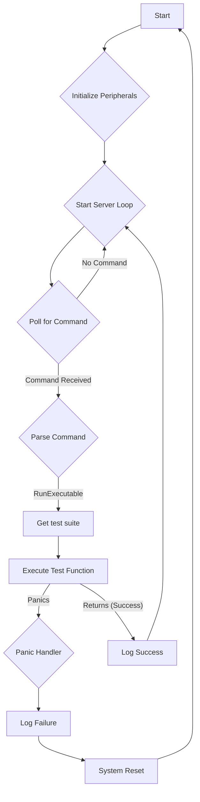

# HIL Runner Design Document


## 1. Context and Objective

Hardware-in-the-Loop (HIL) testing is a crucial part of developing reliable
embedded systems. It allows us to test the firmware on the actual target
hardware, providing a high-fidelity testing environment. The objective of the
HIL Runner is to provide an interactive test harness for the `control-rs`
project.

Instead of a traditional, sequential test suite that runs from top to bottom,
the HIL runner operates like a server. It resides on the target MCU, waiting for
commands from a host PC. This design allows a developer to selectively run
tests, inspect memory, and interact with the system in real-time through a
Terminal User Interface (TUI) on the host. This is particularly useful for
debugging and for running long-duration tests without having to re-flash the
device.

## 2. Architectural Overview

The HIL test system is split between the Host PC and the Target MCU.

- **Host PC**: Runs a Terminal User Interface (TUI) that allows the user to
  select and run tests. A driver handles the communication with the target.
- **Target MCU**:
    - **Test Server**: The core of the HIL runner. It initializes the system,
      waits for commands, and dispatches tests.
    - **HostComms**: A communication interface (trait) that abstracts the
      physical layer (e.g., UART, USB).
    - **Test Suite**: A collection of test functions, exposed to the runner
      through a special linker section.
    - **Panic Handler**: A custom panic handler that catches test failures, logs
      them, and gracefully restarts the test server.

## 3. Core Mechanics

### 3.1. Test Discovery

To make tests "discoverable" by the runner, we place them in a dedicated memory
section (e.g., `.hil_test_suites`). A custom linker script is used to place an
array
of `TestSuite` structs in this section. Each `TestSuite` contains a name and a
function pointer to the test.

```rust
// In the firmware
#[repr(C)]
pub struct TestSuite {
    pub name: &'static str,
    pub description: &'static str,
    pub function: fn() -> !,
}

#[link_section = ".hil_test_suites"]
#[used]
pub static TEST_SUITES: [TestSuite; 2] = [
    TestSuite {
        name: "test1",
        description: "This is the first test",
        function: test1,
    },
    TestSuite {
        name: "test2",
        description: "This is the second test",
        function: test2,
    },
];

fn test1() -> () {
    // Test implementation
    {}
}

fn test2() -> () {
    // Test implementation
    {}
}
```

The runner can then iterate through this array to get a list of all available
tests and send them to the host TUI.

### 3.2. Test Execution

The host sends a `RunExecutable { suite_id, test_id }` command. The
server receives this command and uses the index to look up the corresponding
`TestSuite` in the `.hil_test_suites` section. It then calls the function
pointer.

```rust
// Simplified server logic
fn server_loop() {
    loop {
        match comms::poll_command() {
            Some(Command::RunExecutable { suite_id, test_id }) => {
                // Bounds check omitted for brevity
                let test = &TEST_SUITES[suite_id as usize];
                (test.function)();
            }
            // Other commands
            _ => {}
        }
    }
}
```

The execution is non-preemptive. A test function has full control of the system
until it completes or panics.

### 3.3. Panic Recovery

A custom panic handler is essential for a robust test harness. When a test
function panics (e.g., due to an assertion failure), the panic handler takes
over. It logs the panic information, sends a failure message to the host, and
then resets the system to return to the idle server loop, ready for the next
command. This prevents the entire MCU from halting on a single test failure.

```rust
use panic_handler as _; // Custom panic handler crate

#[panic_handler]
fn panic(info: &core::panic::PanicInfo) -> ! {
    // Log the panic info to the host via the comms channel
    hprintln!("Test failed: {}", info);

    // Reset the device to return to the server loop
    cortex_m::peripheral::SCB::sys_reset();
}
```

### 3.4. Communication

Communications between the host and the target are abstracted through a
`HostComms` trait. This allows the runner to be agnostic of the underlying
physical layer. The implementation of this trait will handle the specifics of
the hardware (e.g., setting up UART, configuring DMA).

```rust
pub trait HostComms {
    type Error;

    /// Checks for and parses any incoming command from the host.
    /// This should be non-blocking and return `Ok(None)` if no full command is available.
    fn poll_command(&mut self) -> Result<Option<Command>, Self::Error>;

    /// Transmits a log or telemetry packet to the host.
    fn send_telemetry(&mut self, log: &LogMessage) -> Result<(), Self::Error>;

    /// Flushes any pending data out to the hardware peripheral.
    fn flush(&mut self) -> Result<(), Self::Error>;
}
```

This design makes the HIL runner portable across different microcontrollers and
communication interfaces.

## 4. Control Flow

The control flow is centered around the main server loop.

