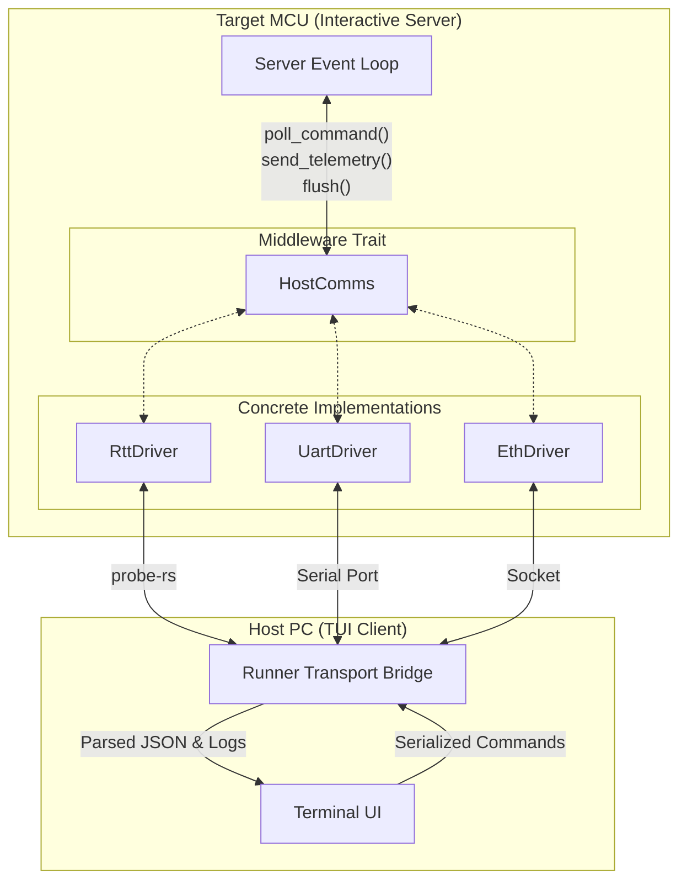

# HostComm Design Document


## 1. Context and Objective

The HIL harness will require a communication interface. The type of
communication peripherals available on each mcu are different; The interface
should also not depend on a specific hardware bus/device.

To achieve this, the system relies on a common abstraction over the transport
layer. This allows the core test runner logic to be oblivious to whether it's
communicating over Segger RTT, a UART serial port, or Ethernet. In an embedded
context (`#![no_std]`), this interface must be deterministic, non-blocking, and
allocation-free.

## 2. Architectural Overview



## 3. Core Mechanics

### 3.1. Middleware Trait

The core of the abstraction is the `HostComms` trait. Implementations of this
trait encapsulate the hardware-specific details of reading and writing bytes.

```rust
pub trait HostComms {
    type Error;

    /// Checks for and parses any incoming command from the host.
    /// This should be non-blocking and return `Ok(None)` if no full command is available.
    fn poll_command(&mut self) -> Result<Option<Command>, Self::Error>;

    /// Transmits a log or telemetry packet to the host.
    fn send_telemetry(&mut self, log: &LogMessage) -> Result<(), Self::Error>;

    /// Flushes any pending data out to the hardware peripheral.
    fn flush(&mut self) -> Result<(), Self::Error>;
}
```

The non-blocking nature of `poll_command` is essential to prevent the target MCU
from stalling the test execution loop while waiting for host intervention.

### 3.2. CMD Parsing

The user may send two types of commands:

* set param
* run executable

The HostComm should provide a way to construct, serialize and deserialize the
commands. In a `#![no_std]` environment, serialization frameworks like
`postcard` or `ssmarshal` (with fixed buffer sizes) are preferred over JSON to
minimize parsing overhead and memory usage.

```rust
#[derive(Debug, Clone, PartialEq, Eq)]
#[cfg_attr(feature = "serde", derive(serde::Serialize, serde::Deserialize))]
pub enum Command {
    /// Update a specific tuning parameter or configuration.
    SetParam {
        param_id: u32,
        value: f32,
    },
    /// Trigger the execution of a test suite or specific test.
    RunExecutable {
        suite_id: u16,
        test_id: u16,
    },
}
```

### 3.3. Log Reporting

Logs will be byte arrays with headers to help identify a timestamp, suite,
function and message. The runner will use the same format with a reserved suite
id so it seems like another suite running.

```rust
#[derive(Debug, Clone)]
#[cfg_attr(feature = "serde", derive(serde::Serialize, serde::Deserialize))]
pub struct LogMessage<'a> {
    pub timestamp_ms: u32,
    pub suite_id: u16,
    pub function_id: u16,
    /// Message payload. Constrained by max MTU or transport buffer.
    #[cfg_attr(feature = "serde", serde(borrow))]
    pub payload: &'a [u8],
}
```

The `defmt` crate could be a powerful tool to use here. `defmt` operates by
logging just the string indices and variable data on the device, while the host
uses the ELF file to reconstruct the formatted strings. This significantly
reduces firmware bloat, parsing overhead, and transport bandwidth.

Log messages have a maximum length determined by hardware constraints (e.g., RTT
buffer sizes or UART DMA block sizes).

The logger may either run on a timer interrupt or be invoked by the runner. The
interrupt case requires more synchronization primitives (such as
`critical_section` blocks or atomic queues like `heapless::spsc`) to safely
share the peripheral across execution contexts.

## 4. Usage

### 4.1. Client side (Target MCU)

This is the side the user must implement. For whatever project they are
using they will need to implement the trait for the hardware.

The users will be responsible for bridging the bytes from the suite output to
whatever hardware is available (e.g., passing the `LogMessage` through to an
Embassy UART driver or an `rtt-target` channel).

```rust
// Example skeleton for a target implementation
struct UartComms {
    uart: hardware::Uart,
    buffer: heapless::Vec<u8, 256>,
}

impl HostComms for UartComms {
    type Error = hardware::Error;
    // ... trait implementation ...
}
```

### 4.2. Host side (PC)

On the host users should not have to implement anything.

The hostcomms device they used for the firmware will be reused by the TUI (this
means rebuilding the tui when the device changes?). The TUI acts as the
demultiplexer (DEMUX in the architecture diagram). It listens to the designated
interface (e.g., serial port, USB interface, probe-rs channels), parses the
binary payloads back into `LogMessage` and `Command` representations, and
renders them to the screen.

Using `defmt-decoder` on the host side will be required if `defmt` is adopted
for log compression.