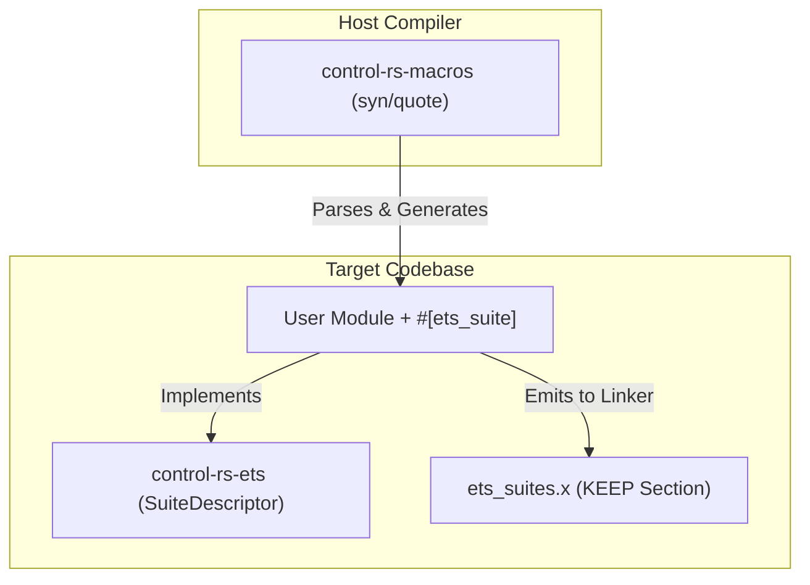

# Procedural Macros for Distributed Test Discovery (Design Document)


---

### 1. Introduction

Bare-metal embedded systems lack traditional operating system loaders, making
dynamic test discovery and runtime test registration difficult. Procedural
macros provide a compile-time solution by automatically analyzing source code
and generating the underlying test registry metadata.

This design document establishes the architecture for `control-rs-macros`, a
procedural macro library containing `#[ets_suite]` and `#[ets_setup]`. These
macros enable developers to declare ETS tests and
benchmarks directly in their modules with zero boilerplate. The macro generates
all registration hooks and places them in custom linker sections, permitting
automated discovery without a centralized registry.

---

### 2. Requirements

#### 2.1 Functional Requirements

- **FR-1 — Distributed Module Annotation**: Developers must declare a suite by
  tagging a module with `#[ets_suite]`.
- **FR-2 — Automatic Registration**: The macro must automatically identify
  non-underscore-prefixed functions within the module and generate test
  descriptors.
- **FR-3 — Type-Safe Settings Translation**: Any static variable declared inside
  the `#[ets_suite]` module must be translated into a thread-safe atomic setting
  structure.
- **FR-4 — Entrypoint & Setup Generation**: The `#[ets_setup]` macro must
  generate the `main()` entrypoint, call the user's hardware init code and
  instantiate the execution context.
- **FR-5 — Custom Panic Redirection**: The macro-generated entrypoint must
  register a custom panic handler that routes test panics through the host
  communications layer.

#### 2.2 Non-Functional Requirements

- **NFR-1 — Zero Static RAM at Idle**: Emitted test descriptors and registration
  tables reside entirely in read-only Flash/ROM (`.ets_test_suites`), consuming
  0 bytes of static RAM at idle.
- **NFR-2 — Linker Retention Safety**: Generated descriptors must survive
  aggressive linker garbage collection (`--gc-sections`) in release builds.
- **NFR-3 — Rust 2024/2027 Compliance**: Generated structures must eliminate
  `static mut` usage in favor of type-safe atomic wrappers and interior
  mutability.

#### 2.3 Constraints

- **C-1 — Strict `#![no_std]` and Zero Runtime Allocation**: Code emitted by the
  macros must compile on bare-metal targets without standard library or dynamic
  heap allocator runtime support.
- **C-2 — Target Independency**: The macros must emit target-agnostic Rust code
  that delegates hardware specifics to the user-defined profiler.

---

### 3. Technical Overview

The procedural macros are contained within the `control-rs-macros` library. This
library depends on standard compiler crates (`proc-macro`, `syn`, `quote`) and
operates as a compiler plugin. It interacts with other workspace crates to form
the test registry:



---

### 4. Architecture

#### 4.1. `#[ets_suite]` Module Parsing and Code Generation

When the compiler encounters `#[ets_suite]` on a module, the macro performs the
following transformations:

1. **Test Identification**: It traverses the module's items, locating all
   functions. For each function, it generates an `ExecDescriptor` containing the
   function's name, description and function pointer.
2. **Settings Translation**: It traverses static variables. To eradicate
   `static mut` (deprecated in Rust 2024 and prohibited in 2027), the macro
   converts standard type declarations into atomic settings. For example:
   ```rust
   // User declaration
   pub static MAX_RETRIES: u32 = 3;
   ```
   Is parsed and translated into:
   ```rust
   // Generated code
   pub static MAX_RETRIES: AtomicU32Setting = AtomicU32Setting::new(
       "MAX_RETRIES",
       "User-defined test parameter",
       3
   );
   ```
3. **Registry Emission**: The macro emits a static `SuiteDescriptor` that
   references the array of `ExecDescriptor`s and the list of settings. This
   descriptor is annotated with the link section attribute to ensure it is
   placed in the test registry:
    ```rust
    #[unsafe(link_section = ".ets_test_suites")]
    #[used]
    pub static SUITE_DESCRIPTOR_PTR: &::control_rs_ets::SuiteDescriptor = &SUITE_DESCRIPTOR;
    ```

#### 4.2. Linker Garbage Collection Mitigation

A critical issue in bare-metal Rust is that LLD linker passes the
`--gc-sections` flag by default. Because the application logic does not directly
call the static `SuiteDescriptor` variables, the linker views them as dead code
and strips them during compilation.

To prevent this, the workspace employs a multi-tiered retention architecture:

1. **`#[used]`**: Generated static variables use attributes directing LLVM to
   keep the symbol in the object file.
2. **Linker Script KEEP Directive**: The `control-rs-ets` crate packages a
   custom linker script snippet (`ets_suites.x`) that includes a `KEEP`
   directive for the `.ets_test_suites` section:
   ```ld
   KEEP(*(.ets_test_suites))
   ```
3. **Build Script Linker Argument Injection**: Target binary examples (like QEMU
   and Teensy 4) include a `build.rs` or `.cargo/config.toml` that injects the
   script to the linker command line:
   ```rust
   println!("cargo:rustc-link-arg=-Tets_suites.x");
   ```
   This prevents end-users from needing to manually manage linker configuration
   files.


The generated descriptors are placed by `#[link_section]`, which "specifies the
section of the object file that a function or static's content will be placed
into" (Rust Reference, 2026). The Reference also records that the attribute "is
unsafe as it allows users to place data and code into sections of memory not
expecting them, such as mutable data into read-only areas"
(Rust Reference, 2026). That is the reason the section name, its linker-script
entry and the descriptor type are owned by this crate together: the safety of
the placement is a property of the three agreeing, and it is not something a
user of `#[ets_suite]` can be asked to get right.

#### 4.3. `#[ets_setup]` Entrypoint and Panic Handling

The `#[ets_setup]` macro is applied to the user's hardware initialization
function. It replaces the function with the primary entrypoint:

1. **`main` Function Wrapper**: The macro emits the standard
   `#[no_mangle] pub extern "C" fn main() -> !` entrypoint.
2. **Setup Call**: It calls the user's custom setup function to initialize clock
   registers, configure peripherals (UART, SPI, DMA) and return the execution
   `Context`.
3. **Panic Hook Registration**: It registers a custom panic handler. This
   handler intercepts any panics, serializes the panic message and location and
   writes them directly to the `HostComms` interface:
    ```rust
    #[cfg(target_os = "none")]
    #[panic_handler]
    fn panic(info: &::core::panic::PanicInfo) -> ! {
        let mut msg_buf = [0u8; 128];
        let pos = {
            let mut writer = ::control_rs_ets::util::FailureBufWriter { buf: &mut msg_buf, pos: 0 };
            let _ = ::core::fmt::write(&mut writer, format_args!("{}", info.message()));
            writer.pos
        };
        let msg = ::core::str::from_utf8(&msg_buf[..pos]).unwrap_or("panic occurred");

        let file = info.location().map_or("unknown", |l| l.file());
        let line = info.location().map_or(0, |l| l.line());

        let server_ptr = ETS_SERVER.load(::core::sync::atomic::Ordering::Acquire);
        unsafe {
            if !server_ptr.is_null() {
                let server = &mut *server_ptr;
                let comms_ok = server.context.comms_lock.try_lock();
                ::control_rs_ets::util::handle_failure(
                    &mut server.context,
                    msg,
                    file,
                    line,
                    comms_ok,
                );
            } else {
                loop {
                    ::core::hint::spin_loop();
                }
            }
        }
    }
    ```
   This prevents the target from locking up silently and ensures the host TUI
   displays the failure.

---

### 5. Alternatives

* **Manual Registration Array**: Developers could manually declare a global
  array of function pointers. This is rejected due to high maintenance overhead,
  boilerplate and the risk of developer error when adding new tests.
* **`linkme::distributed_slice`**: Rejected, on ownership rather than on
  capability. The mechanism is architecturally identical to the hand-rolled
  section scheme: a distributed slice is "a collection of static elements that
  are gathered into a contiguous section of the binary by the linker"
  (linkme, 2026), whose elements "may be defined individually from anywhere in
  the dependency graph of the final binary" (linkme, 2026), which is exactly
  the property FR-2 needs. The crate describes itself as "safe cross-platform
  linker shenanigans" (linkme, 2026). Its documentation states no `no_std` or
  bare-metal support, so adopting it would make the target build depend on a
  property no primary source asserts; and it would surrender project-owned
  control of the `.ets_test_suites` section name and the
  `ets_suites.x` / `build.rs` linker coordination. *Assumption to verify if this
  is revisited: that `linkme` does not in fact support the Cortex-M and RISC-V
  targets in the matrix. The absence of a claim is not a claim of absence.*
* **`inventory` (constructor-based registration)**: Rejected on mechanism.
  `inventory` offers "typed distributed plugin registration" into which plugins
  "can be registered from any source file linked into your application"
  (inventory, 2026), and its registrations "all take effect simultaneously"
  without any call from `main` (inventory, 2026). Taking effect without being
  called from `main` is the property that makes it unsuitable here: it requires
  a pre-main constructor mechanism supplied by a loader, and a bare-metal
  target has no loader. The documented platform support extends to WebAssembly
  targets (inventory, 2026) but says nothing about bare metal.
* **Nightly `custom_test_frameworks`**: Rejected. This requires unstable
  compiler flags and nightly toolchains, which violates the strict reliability
  and safety-certification goals of `control-rs`.
* **Standard `#[test]` Harness (libtest)**: Rejected. It depends on `std`
  components like threads and dynamic memory, which are unavailable in
  bare-metal targets.
* **Global Compiler `-C link-dead-code` Flag**: Rejected. While it prevents test
  registry deletion, it also disables dead code elimination for the entire
  project, leading to bloated binaries that exceed the MCU's Flash capacity.

---

### 6. Verification & Validation

#### 6.1 Approach

The implementation must produce evidence that an annotated module registers
exactly the cases it declares, that malformed input is rejected at compile time
with a diagnostic pointing at the offending span, that registration survives
linker garbage collection, and that the generated code allocates nothing.

| Method | Mechanism |
|:-------|:----------|
| Compile-time shape check | `trybuild` pass cases over valid suite and setup forms |
| Compile-time shape check | `trybuild` compile-fail cases asserting spanned `syn::Error` diagnostics, not proc-macro panics |
| Requirements-based test | `#[test]` comparing the descriptor set recovered from a built ELF against the annotations in source |
| Static analysis | Section presence and retention checked in the linked ELF after `--gc-sections` |
| Static analysis | `cargo clippy-ci`; inspection of generated code for allocation |
| Compile-time shape check | Target builds for every supported triple |
| On-target execution | ETS discovery on a physical board and under QEMU |
| Coverage measurement | `cargo coverage` on the macro crate's host-side tests |

Target: 85% line coverage of the macro crate's host-side logic, measured with
`cargo coverage`.

Excluded: generated code, which is verified by the behaviour of the ELF rather
than by coverage of the generator; and `trybuild` fixtures, which are inputs.

* **Hardware integration**: Compile the Teensy 4.1 board tests using the macros
  and drive them through `control-rs-ets-host::ServerBridge`, confirming that
  every suite is discovered and that settings can be modified at runtime.
* **Third-party module**: Annotate a suite in a crate outside this workspace and
  confirm it registers, which is the property distributed registration exists to
  provide (linkme, 2026).

#### 6.2 Acceptance

| Claim | Oracle | Measure | Bound |
|:------|:-------|:--------|:------|
| Registration completeness | The annotations in the source tree | Descriptors recovered from the ELF | Exact set equality, no duplicates, no omissions |
| Retention under GC | Same ELF linked with `--gc-sections` | Descriptors present | Unchanged from the non-GC link |
| Diagnostic quality | Each compile-fail case | `trybuild` stderr | Matches the expected file, spans the offending token, no panic text |
| Allocation freedom | Disassembly of a target build | Allocator symbols reachable from generated code | 0 |
| Panic redirection | A deliberate panic on target | Path taken | The `#[ets_setup]` handler, not the default |
| Settings translation | A suite declaring each supported setting type | Runtime type of each registered setting | Matches the declared Rust type |

#### 6.3 Limits

- `#[analysis_budget]` procedural macro: Static analysis budget attributes
  requested by `control-rs-static-analyzer` are deferred and not verified in
  this release; budget metadata generation will be specified in a future
  macros revision.
- `#[ets_setup]` panic diagnostics: Error reporting via spanned `syn::Error`
  rather than macro panic is tracked as Step 5 hardening and is not verified in
  current builds.
- That the hand-rolled section scheme is more portable than `linkme`. Neither
  crate's documentation states bare-metal support, so the comparison in §5 rests
  on ownership and on the absence of a claim, not on measured portability.
- Linker behaviour outside LLD and GNU ld. The section and script coordination
  is exercised only with the linkers the matrix uses.
- Proc-macro hygiene against adversarial input. Compile-fail cases cover
  expected misuse, not deliberately hostile token streams.
- Compile-time cost of the macros at large suite counts. No bound is stated and
  none is measured.
- Behaviour when two crates in one binary declare the same suite name.
  Deduplication is unspecified.

### 7. Performance & Resource Considerations

* **Static Flash Storage**: Since the macro places all descriptors in
  `.ets_test_suites` marked as read-only, they reside entirely in Flash (ROM)
  and consume zero RAM during idle state.
* **Compiler Timing**: To maintain fast build times, the macro relies on minimal
  syn features and avoids complex, recursive macro expansion paths.

---

### 8. Risks & Open Questions

* **Linker Target Differences**: Different targets (e.g., MSP430 or custom
  architectures) might require variations of the linker script arguments. The
  build script must detect the target architecture and adapt the link flags
  accordingly.
* **Rust compiler updates**: Shifts in compiler syntax/AST structure in future
  Rust editions could disrupt the syn-based parser. Pinning dependencies in
  Cargo.toml mitigates this, supplemented by periodic dependency-tree audits:
  the workspace lockfile already carries syn 1.x (via TUI dependencies) and
  syn 2.x side by side, so version fragmentation is a live condition rather
  than a hypothetical.
* **`#[ets_setup]` Error Diagnostics**: The return-type and generic-extraction
  checks currently abort via `panic!`/`.expect()`, which surface as an opaque
  "proc-macro panicked" diagnostic. They must be migrated to the
  `syn::Error::new_spanned(...).to_compile_error()` pattern already used by
  `#[ets_suite]`.
* **Per-Test Opt-Out**: Test exclusion is limited to underscore-prefixed
  function names. `defmt-test` and `embedded-test` demonstrate attribute-based
  `#[ignore]`/`#[cfg]` opt-out in the same whole-module-rewrite macro shape;
  open question whether to add an equivalent attribute to the functional
  requirements.
* **syn Feature Scope**: The `extra-traits` feature only adds Debug/Eq/Hash
  impls that the transformation logic does not appear to use. A feature audit
  should confirm whether it can be dropped to narrow the proc-macro2/syn API
  surface.
* **`linkme` Re-Evaluation**: Ruling `linkme` in or out definitively requires
  exercising it against a real bare-metal target (QEMU or Teensy 4), since its
  official platform list conflicts with unofficial claims of embedded support.

---

### 9. Development Plan

Steps 1–4 are implemented in `control-rs-macros/src/lib.rs`; discovery via
`.ets_test_suites` is exercised by ETS (see
`../ets/embedded-test-server-design.md`). Step 5 covers remaining hardening.

| Task / Feature                                 | Description                                                                                                                      | Status / Effort |
|:-----------------------------------------------|:---------------------------------------------------------------------------------------------------------------------------------|:----------------|
| **Step 1: syn Parser Implementation**          | Implement parsing logic for `#[ets_suite]` modules and `#[ets_setup]` functions.                                                 | Shipped         |
| **Step 2: AST Code Generation**                | Develop codegen templates for `SuiteDescriptor` outputs and atomic settings translations.                                        | Shipped         |
| **Step 3: Linker Integration**                 | Write the `build.rs` layout injection code and build the `ets_suites.x` linker script file.                                      | Shipped         |
| **Step 4: Panic Handler Codegen**              | Implement code generation for the custom bare-metal panic handler in `#[ets_setup]`.                                             | Shipped         |
| **Step 5: Diagnostics & Ergonomics Hardening** | Migrate `#[ets_setup]` panics to spanned `syn::Error`s, audit the `extra-traits` feature, evaluate a per-test opt-out attribute. | 1.0 day         |

---

### 10. Revision History

| Revision | Date           | Author          | Description                                                                                                                   |
|:---------|:---------------|:----------------|:------------------------------------------------------------------------------------------------------------------------------|
| 1.0      | May 24, 2026   | @MitchellDScott | Initial specification for embedded test registration and discovery procedural macros.                                         |
| 1.1      | July 18, 2026  | @MitchellDScott | Linker section codegen: added distributed slice linker-section generation and bare-metal panic redirection in `#[ets_setup]`. |
| 1.2      | August 6, 2026 | @MitchellDScott | Tooling hardening: unified linker script name (`ets_suites.x`) and added compile-time AST span error diagnostics.             |
| 1.3      | September 9, 2026 | @MitchellDScott | Packaging alignment: updated host validation reference to `control-rs-ets-host::ServerBridge`.                               |
| 1.4 | September 9, 2026 | @MitchellDScott | Project split: relocated to `documentation/macros/` from the retired xtask project. |
| 1.5      | September 9, 2026 | @MitchellDScott | Evidence pass: replaced the pre-evidence research file with a quotes-only pair, cited the `linkme` and `inventory` rejections and the `link_section` semantics, corrected the linkme rejection from a capability claim to an ownership one, restructured §6 per `vv-standards.md`. |
| 1.6      | September 9, 2026 | @MitchellDScott | Structural hardening: numbered §2 subsections 2.1-2.3, fixed cross-reference to ../ets/embedded-test-server-design.md, recorded #[analysis_budget] deferral in §6.7, standardized reference ordering. |
| 1.7      | September 9, 2026 | @MitchellDScott | Dropped the author-year / `[n]` mapping table. |

---

## References

[1] D. Tolnay, *linkme*: safe cross-platform linker shenanigans. [Online].
Available: https://docs.rs/linkme. Accessed: Sep. 9, 2026.

[2] D. Tolnay, *inventory*: typed distributed plugin registration. [Online].
Available: https://docs.rs/inventory. Accessed: Sep. 9, 2026.

[3] Rust Project Developers, "Application Binary Interface," *The Rust
Reference*. [Online]. Available:
https://doc.rust-lang.org/beta/reference/abi.html. Accessed: Sep. 9, 2026.