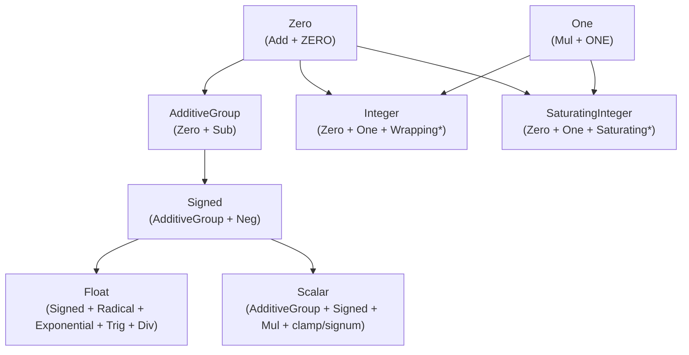

# Numeric Trait Hierarchy (`math::num_traits`) (Design Document)

---

### 1. Introduction

All numerical algorithms within the crate require a foundational numeric
abstraction layer.

The `math::num_traits` module provides this abstraction by defining a numeric
trait hierarchy. This hierarchy is designed around **hardware behavior** rather
than abstract mathematical theory. It enables control algorithms to run generic
code over primitive integers (`i8`..`i128`, `u8`..`u128`, `isize`, `usize`),
floating-point numbers (`f32`, `f64`), and composite numbers (`Complex<T>`),
while giving developers exact compile-time boundaries on overflow behavior (
wrapping vs. saturating).

The system-level goals of the numeric trait hierarchy are:

1. **Hardware Realism**: Reflect physical ALU/FPU overflow boundaries (wrapping
   vs. saturating) and execution realities rather than abstract algebraic rings
   and fields.
2. **Type-State Safety**: Leverage zero-cost validation wrappers (such as
   `NonZero<T>`) to enforce validation of sensor boundaries prior to executing
   arithmetic in the main control loop.
3. **`no_std` & Bare-Metal Compatibility**: Operate strictly within `core`,
   requiring zero dynamic memory allocation or OS-level runtime support.
4. **Zero-Cost Abstraction**: Resolve all associated constants and trait methods
   at compile time via static monomorphization.

---

### 2. Requirements

#### 2.1 Functional Requirements

##### FR-1: Granular Hardware Traits

The trait hierarchy shall break down basic numerical behaviors into small,
granular traits representing specific hardware capabilities.
`Clone + PartialEq + PartialOrd` is declared directly on these traits rather
than through a separate base-marker trait (the previous
`Scalar: Clone + PartialEq + PartialOrd` marker is retired; see FR-3).

- `Zero`: Additive identity constant (`ZERO`) and `Add` operator. Does not
  require `Sub`.
- `One`: Multiplicative identity constant (`ONE`) and `Mul` operator.
- `AdditiveGroup`: `Zero + Sub<Output = Self>`. The single explicit opt-in for
  types whose subtraction is total and non-panicking (signed integer primitives,
  floats, `Complex<T>` where `T: AdditiveGroup`). Unsigned primitives do not
  implement it, since `u8 - 1` is not closed.
- `Signed`: `AdditiveGroup + Neg + PartialOrd`, adding `abs()`,
  `is_sign_positive()`, and `is_sign_negative()`.
- `Unsigned`: Marker trait for unsigned types.
- `Radical`: Square root (`sqrt()`) and hypotenuse (`hypot()`).
- `Exponential`: Natural exponential (`exp()`), natural logarithm (`ln()`),
  base-10 logarithm (`log10()`), and power (`pow()`).
- `Trig`: Trigonometric and hyperbolic functions (`sin()`, `cos()`, `tan()`,
  `asin()`, `acos()`, `atan()`, `PI`).

##### FR-2: Flat Functional Containers

Granular traits shall be grouped into flat categories that represent the exact
behavior of hardware execution units:

- `Integer`: Flat category for integer types that wrap on overflow. Inherits
  `Zero + One + WrappingAdd + WrappingSub + WrappingMul`, and exposes constants
  like `MAX`, `MIN`, `MIN_POSITIVE`, and `TWO`. Implemented by **all** integer
  primitives, signed and unsigned alike — wrapping is a plain-ALU behavior
  available to both (`ADD`/`MUL` wrap regardless of signedness on every target
  this crate supports).
- `SaturatingInteger`: Flat category for integer types that saturate on
  overflow (essential for anti-windup in controllers). Inherits
  `Zero + One + SaturatingAdd + SaturatingSub + SaturatingMul`, and exposes the
  same constants. Also implemented by **all** integer primitives: Cortex-M's
  `SSAT`/`USAT` saturate signed and unsigned ranges equally, so wrap-vs-saturate
  is a choice of which trait bound an algorithm names, not a property of the
  type's signedness.
- `Float`: Flat category for floating-point types. Inherits
  `Clone + PartialEq + PartialOrd + Signed + Radical + Exponential + Trig + Div<Output = Self>`,
  and exposes hardware float constants (`INF`, `NAN`, `EPSILON`, `MAX`, `MIN`,
  `MIN_POSITIVE`, `TWO`), `epsilon()`, and checks/functions (`is_nan()`,
  `is_sign_positive()`, `is_sign_negative()`, `atan2()`, `sinh()`, `cosh()`).
  `Div` and `epsilon()` are scoped to `Float` specifically: IEEE-754 division
  never panics (it produces `inf`/`NaN` instead), so it is hardware-realistic
  here in a way it is not for integers (see FR-3).

##### FR-3: The Unified Target (`Scalar`)

The hierarchy shall expose a single, flat trait `Scalar` representing signed
control scalars. This replaces the previous lightweight
`Scalar: Clone + PartialEq + PartialOrd` marker entirely — there is one `Scalar`
trait in this design, not two.

- It inherits `AdditiveGroup + Signed + Mul<Output = Self>`.
- It defines essential control-loop utilities: `clamp()` and `signum()`.
- It does **not** require `Div` or `epsilon()`. Baking total division into every
  `Scalar` implementor would force plain signed integers to expose a panicking
  operation (`/0`, `i32::MIN / -1`), which contradicts the "hardware realism, no
  panics" goal in §1. Division and machine epsilon remain scoped to `Float` (
  FR-2); integer and fixed-point division continue to go through the existing
  `TryDiv` (`math::ops`) or a future `NonZero<T>`-gated `SafeDiv`, not through
  `Scalar` itself.
- Implemented independently by `f32`/`f64` and by signed integer primitives
  `i8..i128`/`isize` — both satisfy `AdditiveGroup + Signed + Mul`, but `Float`
  does not declare `Scalar` as a supertrait, so float types carry both
  implementations explicitly rather than deriving one from the other. Unsigned
  types do not implement `Scalar`, because control math requires negation and
  total subtraction; they implement `Integer`, `SaturatingInteger`, and
  `Unsigned` instead.
- **Migration note**: `subprograms.rs`'s `AXPY`/`GEMM` (`Scalar + Add + Mul`)
  and `Complex<T>`'s `impl<T: Scalar> Scalar for Complex<T>` currently bound
  against the lightweight marker being retired here. Since the new `Scalar` is
  strictly heavier (`AdditiveGroup + Signed + Mul`, not just
  `Clone + PartialEq + PartialOrd`), these call sites need their bounds
  revisited as part of implementation — see §9.

---

### 3. Technical Overview

This effort touches a single, self-contained module (`src/math/num_traits.rs`)
plus its generated `impl_*!` macros. The scope is the trait definitions
themselves, the primitive implementations, and `Complex<T>`'s delegating
implementations — it does not add new files or new consumers. It requires
familiarity with the target hardware's ALU/FPU overflow behavior (wrapping vs.
saturating instructions; see the research note's CMSIS-DSP/`SSAT`/`USAT`
findings) rather than abstract-algebra theory.

---

### 4. Core Architecture

#### 4.1 Trait Hierarchy Diagram

`Unsigned` (marker) and `Integer`/`SaturatingInteger` are the only traits
implemented by unsigned primitives; unsigned types do not appear in the
`AdditiveGroup`/`Signed`/`Scalar`/`Float` branch above.

#### 4.2 Architectural Layers

1. **Identity Tier (`Zero`, `One`)**:
    - `Zero` requires `Add<Output = Self>` and associated constant `ZERO`. It
      does not require `Sub`.
    - `One` requires `Mul<Output = Self>` and associated constant `ONE`.
2. **Subtraction Tier (`AdditiveGroup`)**:
    - Opt-in trait binding `Zero` and `Sub<Output = Self>`.
    - The single explicit grant of subtraction for types where `a - b` is
      total and non-panicking (signed integers, floats, `Complex<T>`).
      Unsigned primitives never implement it.
3. **Hardware Integer Tier (`Integer`, `SaturatingInteger`, `Unsigned`)**:
    - `Integer` and `SaturatingInteger` expose the wrap and saturate ALU
      behaviors respectively, plus range constants (`MAX`, `MIN`,
      `MIN_POSITIVE`, `TWO`). Both are implemented by every integer
      primitive, signed and unsigned — see FR-2's rationale.
    - `Unsigned` remains a `Sized`-only marker distinguishing unsigned
      primitives from `Scalar`-eligible signed types.
4. **Signed & Analytic Tier (`Signed`, `Float`, `Scalar`, `Radical`,
   `Exponential`, `Trig`)**:
    - `Signed` extends `AdditiveGroup` with `Neg<Output = Self>`, providing
      `abs()` and sign predicates.
    - `Float` requires `Signed + Radical + Exponential + Trig +
     Div<Output = Self>` plus `epsilon()`, scoping division and machine
      epsilon to floating-point types only (FR-2, FR-3).
    - `Scalar` requires `AdditiveGroup + Signed + Mul<Output = Self>` and adds
      `clamp()`/`signum()`, without `Div` — see FR-3's rationale. Implemented
      by signed integers and (transitively, via `Float`) `f32`/`f64`.

#### 4.3 Macro Code Generation

To prevent boilerplate duplication across primitive types, implementation blocks
are generated using internal declarative macros:

- `impl_int!`: Emits `Zero`, `One`, `Integer`, and `SaturatingInteger`
  implementations for all integer primitives (signed and unsigned).
- `impl_additive_group!`: Emits `AdditiveGroup` and `Signed` implementations
  for signed integer primitives and `f32`/`f64`.
- `impl_scalar!`: Emits `Scalar` implementations for signed integer
  primitives and `f32`/`f64`.
- `impl_float!`: Emits `Float`, `Radical`, `Exponential`, and `Trig`
  implementations for `f32` and `f64`.

---

### 5. Alternatives

1. **Retaining the Previously Approved `Ring`/`Field`/`AdditiveGroup`/
   `ClosedRing`/`Real` Hierarchy (2026-08-01)**:
    - _Considered_: Keeping the abstract-algebra tower this same document
      previously approved, and only adding the granular wrapping/saturating
      traits alongside it.
    - _Rejected_: Saturating arithmetic is mathematically non-associative, so
      folding it into a `Ring`-shaped trait misrepresents the operation to
      both readers and the compiler. The prior hierarchy also never resolved
      unsigned types being forced into `Ring`/`Zero` bounds implying total
      subtraction they cannot honor. A hardware-aligned hierarchy resolves
      both directly instead of patching them onto an algebraic frame.
2. **Full Abstract Algebra
   Taxonomy (`Magma` → `Monoid` → `Group` → `AbelianGroup`...)**:
    - _Considered_: Implementing a granular algebraic hierarchy matching formal
      abstract algebra.
    - _Rejected_: Too complex for practical control systems engineering. Rust's
      trait solver overhead and complex bound signatures outweigh the benefits.
      The pragmatic tiering (`Zero`, `AdditiveGroup`, `Integer`,
      `SaturatingInteger`, `Float`, `Scalar`) provides the exact boundaries
      required by numerical algorithms.
3. **Unconditional `Sub` Requirement on `Zero`**:
    - _Considered_: Requiring `Sub<Output = Self>` directly on `Zero`, as an
      earlier draft of this document did.
    - _Rejected_: Forces unsigned primitives (`u8`..`u128`) to expose
      subtraction through `Zero`, despite `0u8 - 1u8` underflowing and
      panicking in debug mode. Decoupling `Sub` into `AdditiveGroup` restores
      hardware honesty: unsigned types get wrapping/saturating subtraction via
      `Integer`/`SaturatingInteger` instead, which are total by construction.
4. **Blanket Derivation of `AdditiveGroup` from `Zero + Sub`**:
    - _Considered_: Adding
      `impl<T: Zero + Sub<Output = Self>> AdditiveGroup for T {}`.
    - _Rejected_: Standard library unsigned integers already implement
      `core::ops::Sub`. A blanket implementation would automatically grant
      `AdditiveGroup` to unsigned types, defeating the safety goal. Explicit
      per-type opt-in is required.
5. **Requiring `Div` on the Unified `Scalar` Trait**:
    - _Considered_: Giving `Scalar` a `Div<Output = Self>` bound directly, so
      one trait covers every arithmetic operator a control loop might need.
    - _Rejected_: Integer division is not total (`/0` panics, `i32::MIN / -1`
      overflows), so requiring it on every `Scalar` implementor — including
      plain signed integers — reintroduces exactly the panic surface this
      hierarchy exists to remove. Division stays on `Float`, where IEEE-754
      semantics make it genuinely total (`inf`/`NaN` instead of a panic).

---

### 6. Verification & Validation

#### 6.1 Verification

Verification ensures structural correctness and trait compliance across all
target environments:

1. **Unit Testing & Hardware-Boundary Verification**:
    - Test suites (`num_trait_tests.rs`) validate identity elements, wrapping
      behavior at `MAX`/`MIN`, and saturation behavior at `MAX`/`MIN` across
      primitive types and `Complex<T>`.
    - Regression tests verify that unsigned `Integer::wrapping_sub`/
      `SaturatingInteger::saturating_sub` behave as expected at `0u8`, and that
      `core::ops::Sub` remains inaccessible on unsigned types through this
      hierarchy (no `AdditiveGroup` impl).
2. **Compile-Time Marker Assertions**:
    - Marker tests verify at compile time that `AdditiveGroup` and `Scalar` are
      implemented for signed integer types and floats, and withheld from
      unsigned types.
3. **SIL/HIL Test Suite Integration**:
    - Unit tests within `num_traits` are wrapped with the `#[hil_suite]` proc
      macro infrastructure. This allows unit test logic to be compiled and
      executed directly within Software-in-the-Loop (SIL) and
      Hardware-in-the-Loop (HIL) test runners targeting embedded hardware
      targets (e.g., Teensy / Cortex-M).

#### 6.2 Validation

Validation confirms that high-level toolbox components integrate seamlessly with
the trait hierarchy:

- **Numerical Assertion Integration**: `assert_almost_eq!` and
  `assert_not_almost_eq!` macros operate seamlessly over `T: Float`.
- **DSP & Linear Algebra Integration**: Signal processing modules (FFT in
  `dsp.rs`) and BLAS subprograms (`subprograms.rs`) validate performance and
  compile-time ergonomics over generic `Float` and `Complex<T>` scalars.

---

### 7. Performance & Resource Considerations

The `math::num_traits` hierarchy incurs **zero runtime performance overhead**
and **zero memory footprint**:

- **Static Monomorphization**: All trait method calls and constant accesses are
  resolved statically by the Rust compiler.
- **Zero Memory Allocation**: Marker traits (`AdditiveGroup`, `Unsigned`)
  carry no fields or dynamic dispatch tables.
- **Stack & Bare-Metal Friendly**: Operations execute inline without stack frame
  expansion or heap interaction, adhering to strict bare-metal constraints (2–8
  kB stack limits).

---

### 8. Risks & Open Questions

1. **Ordering Semantics on `Complex<T>`**: `Signed` (and transitively `Scalar`)
   requires `PartialOrd`. `Complex<T>` implements `PartialOrd` via a
   lexicographic order. While convenient for comparison utilities,
   lexicographic ordering is not algebraically compatible with field
   multiplication. This boundary is documented in doc comments.
2. **`Scalar` Retirement Is a Breaking Change for Existing Bounds**:
   `subprograms.rs`'s `AXPY`/`GEMM` and `Complex<T>`'s `Scalar` impl currently
   rely on the lightweight `Clone + PartialEq + PartialOrd` marker being
   retired in this design. Implementation must re-bound each existing call
   site (widen to the new `Scalar`, or narrow to a more specific granular
   trait such as `Zero`/`One` where the algorithm doesn't actually need
   negation or subtraction) rather than assume the rename is transparent.
3. **`SafeDiv`/`NonZero<T>` Is Not Yet Specified**: This design confines `Div`
   to `Float` and defers integer/fixed-point division entirely to the
   existing `TryDiv` (`math::ops`). A future `NonZero<T>`-gated `SafeDiv` for
   validate-once/divide-many hot loops (per the research note's §4.4/§3.5) is
   out of scope for this revision and needs its own design pass, including
   how it handles `core::num::NonZero<T>`'s sealed `ZeroablePrimitive` trait
   not covering custom scalar types.
4. **Evolution of `const fn` Traits**: When Rust stabilizes `const_trait_impl`,
   associated trait functions (e.g., `is_zero()`) can be made `const fn`,
   expanding compile-time evaluation capabilities.

---

### 9. Development Plan

| Phase / Feature                                    | Description                                                                                                                                         | Estimated Effort |
|:---------------------------------------------------|:----------------------------------------------------------------------------------------------------------------------------------------------------|:-----------------|
| **Phase 1: Core Trait Hierarchy & Boundaries**     | Implement `Zero`, `One`, `AdditiveGroup`, `Signed`, `Integer`, `SaturatingInteger`, `Float`, `Scalar` with full doc comments                        | Medium           |
| **Phase 2: Primitive & Composite Implementations** | Write `impl_int!`, `impl_additive_group!`, `impl_scalar!`, `impl_float!` macros; update `Complex<T>` trait bridges                                  | Medium           |
| **Phase 3: Existing Call-Site Migration**          | Re-bound `AXPY`/`GEMV`/`GEMM`/`DOT`/`NRM2`/`IAMAX` (`subprograms.rs`), `FFT`/`Convolution`/`Discrete` (`dsp.rs`), and `assert.rs` to the new traits | Medium           |
| **Phase 4: Verification & Test Suite Integration** | Implement wrap/saturate boundary tests, compile-time marker assertions, and `#[hil_suite]` SIL/HIL runner test wrappers                             | Medium           |

---

### 10. Revision History

| Date       | Author          | Description                                                                                                                                                                                                                                                                                                                                                                                                                                                                                                                             |
|:-----------|:----------------|:----------------------------------------------------------------------------------------------------------------------------------------------------------------------------------------------------------------------------------------------------------------------------------------------------------------------------------------------------------------------------------------------------------------------------------------------------------------------------------------------------------------------------------------|
| 2026-08-01 | @mitchelldscott | Comprehensive design specification for `math::num_traits` hierarchy refinement, introducing `AdditiveGroup` and `ClosedRing`, updating Mermaid architectural diagrams, and integrating HIL/SIL verification suite standards.                                                                                                                                                                                                                                                                                                            |
| 2026-08-02 | @mitchelldscott | Superseded `Ring`/`Field`/`ClosedRing`/`Real` with the hardware-aligned `Zero`/`One`/`AdditiveGroup`/`Integer`/`SaturatingInteger`/`Float`/`Scalar` hierarchy (`ControlScalar` research pivot). Reverted status to Draft pending re-approval. |
