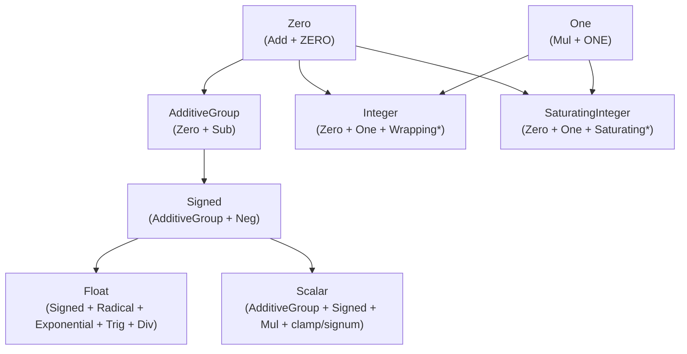

# Numeric Trait Hierarchy (Design Document)

---

### 1. Introduction

The `num_traits` module provides a numerical abstraction designed around
**hardware behavior** rather than abstract mathematical theory. It enables
control algorithms to implement generic code over primitive numerical types,
while giving developers exact compile-time boundaries on overflow behavior (
wrapping vs. saturating).

The system-level goals of the numeric trait hierarchy are:

1. **Hardware Realism**: Reflect physical ALU/FPU overflow boundaries (wrapping
   vs. saturating) and execution realities rather than abstract algebraic rings
   and fields.
2. **Type-State Safety**: Leverage zero-cost validation wrappers to enforce
   validation of boundaries prior to execution.

---

### 2. Requirements

#### 2.1 Functional Requirements

##### FR-1: Hardware Traits

The trait hierarchy shall break down basic numerical behaviors into small,
granular traits representing specific hardware capabilities. This mirrors the
`az` crate's split of numeric casts into one narrow trait per fallibility mode
(`Cast`, `CheckedCast`, `StrictCast`, `SaturatingCast`, `WrappingCast`,
`OverflowingCast`) rather than one monolithic conversion trait (Spiteri,
2026a). `Clone + PartialEq + PartialOrd` is declared directly on these traits
rather than through a separate base-marker trait (the previous
`Scalar: Clone + PartialEq + PartialOrd` marker is retired).

- `Zero`: Additive identity constant (`ZERO`) and `Add` operator. Does not
  require `Sub`.
- `One`: Multiplicative identity constant (`ONE`) and `Mul` operator.
- `AdditiveGroup`: `Zero + Sub<Output = Self>`. The single explicit opt-in for
  types whose subtraction is total and non-panicking (signed integer primitives,
  floats, `Complex<T>` where `T: AdditiveGroup`). Unsigned primitives do not
  implement it, since `u8 - 1` is not closed.
- `Signed`: `AdditiveGroup + Neg + PartialOrd`, adding `abs()`,
  `is_sign_positive()`, and `is_sign_negative()`.
- `Unsigned`: Marker trait for unsigned types.
- `Radical`: Square root (`sqrt()`) and hypotenuse (`hypot()`).
- `Exponential`: Natural exponential (`exp()`), natural logarithm (`ln()`),
  base-10 logarithm (`log10()`), and power (`pow()`).
- `Trig`: Trigonometric and hyperbolic functions (`sin()`, `cos()`, `tan()`,
  `asin()`, `acos()`, `atan()`, `PI`).

##### FR-2: Functional Containers

Granular traits shall be grouped into flat categories that represent the exact
behavior of hardware execution units:

- `Integer`: Flat category for integer types that wrap on overflow. Exposes
  constants like `MAX`, `MIN`, `MIN_POSITIVE`, and `TWO`.
- `SaturatingInteger`: Flat category for integer types that saturate on
  overflow. wrap-vs-saturate is a choice of which trait bound an algorithm
  names, not a property of the type's signedness.
- `Float`: Flat category for floating-point types. Exposes hardware float
  constants, `epsilon()`, and checks/functions. `Div` and `epsilon()` are
  scoped to `Float` specifically: IEEE-754 division never panics (it produces
  `inf`/`NaN` instead).

##### FR-3: The Unified Target (`Scalar`)

The hierarchy shall expose a single, flat trait `Scalar` representing signed
control scalars. This replaces the previous lightweight
`Scalar: Clone + PartialEq + PartialOrd` marker entirely — there is one `Scalar`
trait in this design, not two.

- It inherits `AdditiveGroup + Signed + Mul<Output = Self>`.
- It defines essential control-loop utilities: `clamp()` and `signum()`.
- It does **not** require `Div` or `epsilon()`. Division and machine epsilon
  remain scoped to `Float` (FR-2).
- Implemented independently by `f32`/`f64` and by signed integer primitives
  `i8..i128`/`isize` — both satisfy `AdditiveGroup + Signed + Mul`, but `Float`
  does not declare `Scalar` as a super trait, so float types carry both
  implementations explicitly rather than deriving one from the other.

---

### 3. Technical Overview

This effort touches a single, self-contained module (`src/math/num_traits.rs`)
plus its generated `impl_*!` macros. The scope is the trait definitions
themselves, the primitive implementations, and `Complex<T>`'s delegating
implementations — it does not add new files or new consumers.

---

### 4. Core Architecture

#### 4.1 Trait Hierarchy Diagram

`Unsigned` (marker) and `Integer`/`SaturatingInteger` are the only traits
implemented by unsigned primitives; unsigned types do not appear in the
`AdditiveGroup`/`Signed`/`Scalar`/`Float` branch above.

#### 4.2 Architectural Layers

1. **Identity Tier (`Zero`, `One`)**:
    - `Zero` requires `Add<Output = Self>` and associated constant `ZERO`.
    - `One` requires `Mul<Output = Self>` and associated constant `ONE`.
2. **Subtraction Tier (`AdditiveGroup`)**:
    - Opt-in trait binding `Zero` and `Sub<Output = Self>`.
    - The single explicit grant of subtraction for types where `a - b` is
      total and non-panicking (signed integers, floats, `Complex<T>`).
      Unsigned primitives never implement it.
3. **Hardware Integer Tier (`Integer`, `SaturatingInteger`, `Unsigned`)**:
    - `Integer` and `SaturatingInteger` expose the wrap and saturate ALU
      behaviors respectively, plus range constants (`MAX`, `MIN`,
      `MIN_POSITIVE`, `TWO`). Both are implemented by every integer
      primitive, signed and unsigned.
    - `Unsigned` remains a `Sized`-only marker distinguishing unsigned
      primitives from `Scalar`-eligible signed types.
4. **Signed & Analytic Tier (`Signed`, `Float`, `Scalar`, `Radical`,
   `Exponential`, `Trig`)**:
    - `Signed` extends `AdditiveGroup` with `Neg<Output = Self>`, providing
      `abs()` and sign predicates.
    - `Float` requires `Signed + Radical + Exponential + Trig +
     Div<Output = Self>` plus `epsilon()`, scoping division and machine
      epsilon to floating-point types only (FR-2, FR-3).
    - `Scalar` requires `AdditiveGroup + Signed + Mul<Output = Self>` and adds
      `clamp()`/`signum()`, without `Div` — see FR-3's rationale. Implemented
      by signed integers and (transitively, via `Float`) `f32`/`f64`.

#### 4.3 Macro Code Generation

To prevent boilerplate duplication across primitive types, implementation blocks
are generated using internal declarative macros:

- `impl_int!`: Emits `Zero`, `One`, `Integer`, and `SaturatingInteger`
  implementations for all integer primitives (signed and unsigned).
- `impl_additive_group!`: Emits `AdditiveGroup` and `Signed` implementations
  for signed integer primitives and `f32`/`f64`.
- `impl_scalar!`: Emits `Scalar` implementations for signed integer
  primitives and `f32`/`f64`.
- `impl_float!`: Emits `Float`, `Radical`, `Exponential`, and `Trig`
  implementations for `f32` and `f64`.

---

### 5. Alternatives

1. **Full Abstract Algebra
   Taxonomy (`Magma` → `Monoid` → `Group` → `AbelianGroup`...)**:
    - _Considered_: Implementing a granular algebraic hierarchy matching formal
      abstract algebra, of the kind the `noether` crate ships (`Magma`,
      `Semigroup`, `Monoid`, `Group`, `Ring`, `Field`) (warlock-labs, 2025).
    - _Rejected_: Too complex for practical control systems engineering. Rust's
      trait solver overhead and complex bound signatures outweigh the benefits
      — `noether`'s own documentation cautions that "extensive use of dispatch
      ... may incur some runtime cost" (warlock-labs, 2025; secondary,
      uncorroborated claim), a risk this design avoids entirely by not
      building a comparably deep tower. The pragmatic tiering (`Zero`,
      `AdditiveGroup`, `Integer`, `SaturatingInteger`, `Float`, `Scalar`)
      provides the exact boundaries required by numerical algorithms.
2. **Blanket Derivation of `AdditiveGroup` from `Zero + Sub`**:
    - _Considered_: Adding
      `impl<T: Zero + Sub<Output = Self>> AdditiveGroup for T {}`.
    - _Rejected_: Standard library unsigned integers already implement
      `core::ops::Sub`. A blanket implementation would automatically grant
      `AdditiveGroup` to unsigned types, defeating the safety goal. Explicit
      per-type opt-in is required.
3. **Requiring `Div` on the Unified `Scalar` Trait**:
    - _Considered_: Giving `Scalar` a `Div<Output = Self>` bound directly, so
      one trait covers every arithmetic operator a control loop might need.
    - _Rejected_: Integer division is not total (`/0` panics, `i32::MIN / -1`
      overflows), so requiring it on every `Scalar` implementor — including
      plain signed integers — reintroduces exactly the panic surface this
      hierarchy exists to remove. Division stays on `Float`, where IEEE-754
      semantics make it genuinely total (`inf`/`NaN` instead of a panic).
4. **Wrapper-Type Semantics (`fixed`-crate Pattern) Instead of Method-Level
   Traits**:
    - _Considered_: Expressing wrapping/saturating behavior through a new type
      wrapper — analogous to the `fixed` crate's `Saturating<F>`, which
      "provides saturating arithmetic on fixed-point numbers" by overloading
      operators on the wrapper rather than exposing named methods on the
      underlying type (Spiteri, 2026b) — instead of `Integer`/
      `SaturatingInteger` method calls (`wrapping_add()`, `saturating_add()`)
      on the scalar type itself.
    - _Rejected_: Requiring callers to convert into and out of a wrapper type at
      each boundary adds friction the trait-method approach avoids.

---

### 6. Verification & Validation

#### 6.1 Verification

Verification ensures structural correctness and trait compliance across all
target environments:

1. **Unit Testing & Hardware-Boundary Verification**:
    - Test suites (`num_trait_tests.rs`) validate identity elements, wrapping
      behavior at `MAX`/`MIN`, and saturation behavior at `MAX`/`MIN` across
      primitive types and `Complex<T>`.
2. **Compile-Time Marker Assertions**:
    - Marker tests verify at compile time that `AdditiveGroup` and `Scalar` are
      implemented for signed integer types and floats, and withheld from
      unsigned types.
3. **SIL/HIL Test Suite Integration**:
    - Unit tests within `num_traits` are wrapped with the `#[hil_suite]` proc
      macro infrastructure.

#### 6.2 Validation

Validation confirms that high-level toolbox components integrate seamlessly with
the trait hierarchy:

- **Numerical Assertion Integration**: `assert_almost_eq!` and
  `assert_not_almost_eq!` macros operate seamlessly over `T: Float`.
- **DSP & Linear Algebra Integration**: Signal processing modules (FFT in
  `dsp.rs`) and BLAS subprograms (`subprograms.rs`) validate performance and
  compile-time ergonomics over generic `Float` and `Complex<T>` scalars.

---

### 7. Performance & Resource Considerations

The `math::num_traits` hierarchy incurs **zero runtime performance overhead**
and **zero memory footprint**:

- **Static Monomorphization**: All trait method calls and constant accesses are
  resolved statically by the Rust compiler.
- **Zero Memory Allocation**: Marker traits (`AdditiveGroup`, `Unsigned`)
  carry no fields or dynamic dispatch tables.
- **Stack & Bare-Metal Friendly**: Operations execute inline without stack frame
  expansion or heap interaction, adhering to strict bare-metal constraints (2–8
  kB stack limits).

---

### 8. Risks & Open Questions

1. **Ordering Semantics on `Complex<T>`**: `Signed` (and transitively `Scalar`)
   requires `PartialOrd`. `Complex<T>` implements `PartialOrd` via a
   lexicographic order. While convenient for comparison utilities,
   lexicographic ordering is not algebraically compatible with field
   multiplication. This boundary is documented in doc comments.
2. **`Scalar` Retirement Is a Breaking Change for Existing Bounds**:
   Implementation must re-bound each existing call site rather than assume
   the rename is transparent.
3. **`SafeDiv`/`NonZero<T>` Is Not Yet Specified**: This design confines `Div`
   to `Float` and defers integer/fixed-point division entirely to the
   existing `TryDiv` (`math::ops`). A future `NonZero<T>`-gated `SafeDiv` for
   validate-once/divide-many hot loops is out of scope for this revision and
   needs its own design pass. Generic `NonZero<T>` itself is stable (Rust
   stabilized `generic_nonzero` after RFC 2307 replaced a single generic
   wrapper with twelve concrete per-primitive types) (Reitermarkus, 2024; RFC
   2307, 2018), but its `Zeroable`/`ZeroablePrimitive` sealing was adopted
   specifically because "it is unclear what happens ... when `T` is some type
   other than a raw pointer or a primitive integer" (RFC 2307, 2018) — a
   future `SafeDiv` needs its own answer for custom scalar types, since it
   cannot rely on `core::num::NonZero<T>` covering them.
4. **Evolution of `const fn` Traits**: When Rust stabilizes `const_trait_impl`,
   associated trait functions (e.g., `is_zero()`) can be made `const fn`,
   expanding compile-time evaluation capabilities. As of the 2025H1 Rust
   Project Goals, "the compiler now has a promising implementation of const
   traits ... [but] the feature is still firmly in experimental territory:
   there has never been an RFC describing its syntax," with stabilization
   itself still a stretch goal (Scherer, 2025).

---

### 9. Development Plan

| Phase / Feature                                    | Description                                                                                                                                         | Estimated Effort |
|:---------------------------------------------------|:----------------------------------------------------------------------------------------------------------------------------------------------------|:-----------------|
| **Phase 1: Core Trait Hierarchy & Boundaries**     | Implement `Zero`, `One`, `AdditiveGroup`, `Signed`, `Integer`, `SaturatingInteger`, `Float`, `Scalar` with full doc comments                        | Medium           |
| **Phase 2: Primitive & Composite Implementations** | Write `impl_int!`, `impl_additive_group!`, `impl_scalar!`, `impl_float!` macros; update `Complex<T>` trait bridges                                  | Medium           |
| **Phase 3: Existing Call-Site Migration**          | Re-bound `AXPY`/`GEMV`/`GEMM`/`DOT`/`NRM2`/`IAMAX` (`subprograms.rs`), `FFT`/`Convolution`/`Discrete` (`dsp.rs`), and `assert.rs` to the new traits | Medium           |
| **Phase 4: Verification & Test Suite Integration** | Implement wrap/saturate boundary tests, compile-time marker assertions, and `#[hil_suite]` SIL/HIL runner test wrappers                             | Medium           |

---

### 10. References

1. **num-traits (2024a).** _WrappingAdd_ (Version 0.2.19) [Software
   documentation]. rust-num, docs.rs.
   https://docs.rs/num-traits/latest/num_traits/ops/wrapping/trait.WrappingAdd.html
   (accessed Aug. 6, 2026) — Source of the `wrapping_add`-style operator
   names and "wraps around at the boundary of the type" semantics `Integer`
   (FR-2) reuses.
2. **num-traits (2024b).** _Saturating_ (Version 0.2.19) [Software
   documentation]. rust-num, docs.rs.
   https://docs.rs/num-traits/latest/num_traits/ops/saturating/trait.Saturating.html
   (accessed Aug. 6, 2026) — Documents the crate's own deprecation of a
   monolithic `Saturating` trait in favor of split `SaturatingAdd`/
   `SaturatingSub`/`SaturatingMul` traits, the precedent `SaturatingInteger`
   (FR-2) follows.
3. **Spiteri, T. (2026a).** _az_ (Version 1.3.0) [Software documentation].
   docs.rs. https://docs.rs/az/latest/az/ (accessed Aug. 6, 2026) — Prior art
   for splitting numeric-conversion behavior into narrow, per-fallibility-mode
   traits, cited in support of FR-1's granular-trait structure.
4. **systemonchips.com (2025).** _...and Correctly Using CMSIS-DSP
   Fixed-Point (Qx) Functions_ [Website].
   https://www.systemonchips.com/and-correctly-using-cmsis-dsp-fixed-point-qx-functions/
   (accessed Aug. 6, 2026) — Secondary source describing Cortex-M `SSAT`/
   `USAT` saturating instructions; the primary ARM reference could not be
   retrieved during research, so this evidence is uncorroborated.
5. **Crozet, S. (2020).** _Switch to Simba and make the base and geometry
   modules mostly SIMD AoSoA friendly_ (PR #713) [Repository].
   dimforge/nalgebra.
   https://github.com/dimforge/nalgebra/pull/713 (accessed Aug. 6, 2026) —
   Ecosystem precedent for retreating from a heavy abstract-algebra trait
   tower (`alga`) to a flatter one (`simba`), cited in Alternative 1.
6. **warlock-labs (2025).** _noether README_ (Version 0.3.0) [Repository].
   GitHub. https://github.com/warlock-labs/noether (accessed Aug. 6, 2026) —
   Concrete example of a full `Magma`→`Field` abstract-algebra tower in Rust,
   cited in Alternative 2; its dispatch-cost caveat is a secondary,
   uncorroborated claim.
7. **Spiteri, T. (2026b).** _fixed::Saturating_ (Version 1.31.0) [Software
   documentation].
   docs.rs. https://docs.rs/fixed/latest/fixed/struct.Saturating.html
   (accessed Aug. 6, 2026) — Source of the wrapper-type (`Saturating<F>`)
   pattern evaluated and rejected in Alternative 6.
8. **Reitermarkus, M. (2024).** _Tracking Issue for generic NonZero_ (issue
   #120257) [Repository]. rust-lang/rust.
   https://github.com/rust-lang/rust/issues/120257 (accessed Aug. 6, 2026) —
   Confirms `core::num::NonZero<T>` generic stabilization, cited in the
   `SafeDiv`/`NonZero<T>` risk item.
9. **RFC 2307 (2018).** _RFC 2307: Concrete NonZero Types_ [Technical report].
   Rust Project, Rust RFC Book.
   https://rust-lang.github.io/rfcs/2307-concrete-nonzero-types.html
   (accessed Aug. 6, 2026) — Rationale for `NonZero<T>`'s sealed
   `Zeroable`/`ZeroablePrimitive` design not extending to arbitrary custom
   types, cited in the `SafeDiv`/`NonZero<T>` risk item.
10. **Scherer, O. (2025).** _Prepare const traits for stabilization_
    [Website]. Rust Project Goals (2025H1).
    https://rust-lang.github.io/rust-project-goals/2025h1/const-trait.html
    (accessed Aug. 6, 2026) — Current status and stabilization timeline for
    `const_trait_impl`, cited in the `const fn` traits risk item.

---

### 11. Revision History

| Date       | Author          | Description                                                                                                                                                                                                                                                                                                                                                                                                                                                                                                                                                                                                                                                                                    |
|:-----------|:----------------|:-----------------------------------------------------------------------------------------------------------------------------------------------------------------------------------------------------------------------------------------------------------------------------------------------------------------------------------------------------------------------------------------------------------------------------------------------------------------------------------------------------------------------------------------------------------------------------------------------------------------------------------------------------------------------------------------------|
| 2026-08-01 | @mitchelldscott | Comprehensive design specification for `math::num_traits` hierarchy refinement, introducing `AdditiveGroup` and `ClosedRing`, updating Mermaid architectural diagrams, and integrating HIL/SIL verification suite standards.                                                                                                                                                                                                                                                                                                                                                                                                                                                                   |
| 2026-08-02 | @mitchelldscott | Superseded `Ring`/`Field`/`ClosedRing`/`Real` with the hardware-aligned `Zero`/`One`/`AdditiveGroup`/`Integer`/`SaturatingInteger`/`Float`/`Scalar` hierarchy (`ControlScalar` research pivot). Reverted status to Draft pending re-approval.                                                                                                                                                                                                                                                                                                                                                                                                                                                  |
| 2026-08-08 | @mitchelldscott | Updated citations to the author-year + numbered References standard, following `research/results/num-traits.json`'s structured bibliography. Added inline `(cite_author, year)` citations to FR-1's granular-trait rationale, FR-2's `Integer`/`SaturatingInteger` naming and Cortex-M `SSAT`/`USAT` claims, Technical Overview's hardware-behavior framing, Alternatives 1 and 2, a new Alternative 6 (`fixed`-crate wrapper-type pattern, rejected), and the `SafeDiv`/`NonZero<T>` and `const fn` traits Risks items. Added a new §10 References section (10 entries) and renumbered Revision History to §11. No factual claims were added, removed, or reworded — only citation apparatus. |
| 2026-08-09 | @mitchelldscott | Review and corrections                                                                                                                                                                                                                                                                                                                                                                                                                                                                                                                                                                                                                                                                         |
