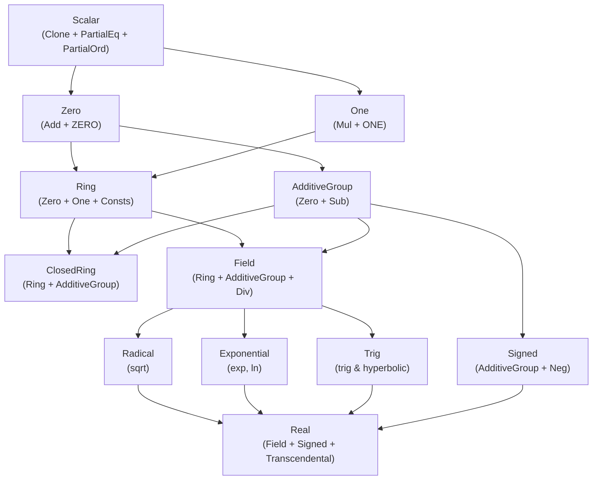

# Numeric Trait Hierarchy (`math::num_traits`) (Design Document)


---

### 1. Introduction

All numerical algorithms within the crate require a foundational numeric
abstraction layer.

The `math::num_traits` module provides this abstraction by defining a numeric
trait hierarchy. It enables mathematical components to operate generically over
primitive floating-point numbers (`f32`, `f64`), signed and unsigned integers (
`i8`..`i128`, `u8`..`u128`, `isize`, `usize`), and composite numbers (
`Complex<T>`).

The system-level goals of the numeric trait hierarchy are:

1. **Algebraic Safety**: Express mathematical properties (identities, closure
   under operations, total vs. partial operations) accurately through the Rust
   type system.
2. **`no_std` & Bare-Metal Compatibility**: Operate strictly within `core`,
   requiring zero dynamic memory allocation or OS-level runtime support.
3. **Zero-Cost Abstraction**: The traits provide access to constants so
   algorithms can access these values for any type with very little overhead.

---

### 2. Requirements

#### 2.1 Functional Requirements

##### FR-1: Core Scalar and Identity Abstractions

The hierarchy shall provide base scalar traits exposing equality, partial
ordering, and elemental identities:

- `Scalar`: Base trait requiring `Clone + PartialEq + PartialOrd`.
- `Zero`: Represents types with an additive identity constant (`ZERO`) and an
  addition operation (`Add<Output = Self>`). `Zero` does not mandate a
  subtraction operation.
- `One`: Represents types with a multiplicative identity constant (`ONE`) and a
  multiplication operation (`Mul<Output = Self>`).

##### FR-2: Explicit Total Subtraction (`AdditiveGroup`)

The hierarchy shall provide an explicit trait,
`AdditiveGroup: Zero + Sub<Output = Self>`, representing types whose subtraction
operation is total (defined and non-panicking over the full domain of the type).

- Must be implemented explicitly for `f32`, `f64`, signed integer primitives (
  `i8`..`i128`, `isize`), and `Complex<T>` where `T: AdditiveGroup`.
- Must **not** be implemented for unsigned integer primitives (`u8`..`u128`,
  `usize`), as unsigned subtraction can underflow.

##### FR-3: Signed and Unsigned Domain Markers

The hierarchy shall distinguish signed and unsigned domains:

- `Signed: AdditiveGroup + Neg<Output = Self>`: Provides absolute value
  calculation (`abs()`) and sign checks (`is_sign_positive()`,
  `is_sign_negative()`). Requires `AdditiveGroup` to guarantee closed negation
  and subtraction.
- `Unsigned: Scalar`: Marker trait for unsigned numeric types.

##### FR-4: Algebraic Ring Abstraction

The hierarchy shall provide a `Ring: One + Zero` trait representing structures
with both additive and multiplicative identities.

- Associated constants: `ZERO`, `ONE`, `TWO`, `MAX`, `MIN`, `MIN_POSITIVE`.
- Supported by both signed and unsigned numeric primitives, as `Ring` requires
  addition and multiplication but does not demand subtraction closure.

##### FR-5: Closed Ring Abstraction

The hierarchy shall provide a convenience trait,
`ClosedRing: Ring + AdditiveGroup`, with a blanket implementation:

```rust
impl<T: Ring + AdditiveGroup> ClosedRing for T {}
```

This enables generic algorithms requiring closed subtraction over ring
operations to specify a single concise bound (`T: ClosedRing`).

##### FR-6: Algebraic Field Abstraction

The hierarchy shall provide a `Field: Ring + AdditiveGroup + Div<Output = Self>`
trait representing algebraic fields.

- Requires `AdditiveGroup` to enforce total subtraction alongside division.
- Exposes `epsilon()` to supply machine epsilon for convergence and stability
  checks.

##### FR-7: Transcendental and Real Number Capabilities

The hierarchy shall provide specialized traits for advanced mathematical
operations:

- `Radical`: Square root (`sqrt()`).
- `Exponential`: Natural exponential (`exp()`) and natural logarithm (`ln()`).
- `Trig`: Trigonometric and hyperbolic functions (`sin`, `cos`, `tan`, `asin`,
  `acos`, `atan`, `sinh`, `cosh`, `tanh`).
- `Real: Field + Signed + Radical + Exponential + Trig`: Full mathematical real
  number abstraction, carrying physical constants (`PI`, `E`, `INF`, `NAN`).

##### FR-8: Primitive and Composite Implementations

The trait hierarchy must be fully implemented for:

- Primitive floats: `f32`, `f64`.
- Primitive signed integers: `i8`, `i16`, `i32`, `i64`, `i128`, `isize`.
- Primitive unsigned integers: `u8`, `u16`, `u32`, `u64`, `u128`, `usize`.
- Composite complex numbers: `Complex<T>`, conditionally delegating trait
  capabilities based on `T`.

#### 2.2 Non-Functional Requirements

##### NFR-1: `no_std` Compatibility

The entire module must depend exclusively on `core`. It must not require `std`
or `alloc`.

##### NFR-2: Zero Runtime Overhead

All traits, identity constants, and blanket implementations must resolve at
compile time via static monomorphization. Marker traits (`AdditiveGroup`,
`ClosedRing`, `Unsigned`) must carry no fields or vtables.

##### NFR-3: Code Quality and Lint Compliance

All public traits, methods, constants, and implementations must strictly satisfy
workspace lints (`missing_docs = "deny"` and `arbitrary_source_item_ordering 
= "deny"`), adhering to crate documentation standards (
`documentation/doc-standards.md`).

#### 2.3 Constraints

##### C-1: Stable Rust Compatibility

All associated constants and trait bounds must be supported by current stable
Rust, avoiding nightly-only features such as `const_trait_impl`.

##### C-2: Dependency Isolation

The module must have no external crate dependencies beyond Rust `core`.

---

### 3. Technical Overview

The `math::num_traits` module acts as the core interface contract between raw
scalar types and high-level control systems mathematics. The scope encompasses
trait definitions, compile-time associated constants, macro-based
implementations for primitive types, and generic delegates for `Complex<T>`.

---

### 4. Core Architecture

The core architecture organizes numerical capabilities into a strictly layered
super-trait hierarchy.

#### 4.1 Trait Hierarchy Diagram



#### 4.2 Architectural Layers

1. **Identity & Monoid Tier (`Scalar`, `Zero`, `One`)**:
    - `Zero` requires `Add<Output = Self>` and associated constant `ZERO`. It
      does not require `Sub`.
    - `One` requires `Mul<Output = Self>` and associated constant `ONE`.
2. **Subtraction Tier (`AdditiveGroup`)**:
    - Opt-in marker trait binding `Zero` and `Sub<Output = Self>`.
    - Serves as the single explicit grant of subtraction for types where `a - b`
      is mathematically closed and non-panicking.
3. **Ring & Group Tier (`Ring`, `ClosedRing`, `Signed`, `Unsigned`)**:
    - `Ring` combines `Zero` and `One`, exposing range constants (`MAX`, `MIN`,
      `MIN_POSITIVE`, `TWO`). Implemented by all integer and float primitives.
    - `ClosedRing` blanket-implements `Ring + AdditiveGroup` for types
      supporting total subtraction.
    - `Signed` extends `AdditiveGroup` with `Neg<Output = Self>`, providing
      `abs()` and sign predicates.
4. **Field & Analytic Tier (`Field`, `Radical`, `Exponential`, `Trig`, `Real`)
   **:
    - `Field` requires `Ring + AdditiveGroup + Div<Output = Self>` and
      `epsilon()`.
    - `Real` unplugs full transcendental math (`sin`, `cos`, `exp`, `log`,
      `sqrt`) and mathematical constants (`PI`, `E`, `INF`, `NAN`) for
      floating-point scalars.

#### 4.3 Macro Code Generation

To prevent boilerplate duplication across primitive types, implementation blocks
are generated using internal declarative macros:

- `impl_ring!`: Emits `Zero`, `One`, and `Ring` implementations for integer and
  floating-point types.
- `impl_field!`: Emits `Field` implementations for `f32` and `f64`.
- `impl_real!`: Emits `AdditiveGroup`, `Signed`, `Radical`, `Exponential`,
  `Trig`, and `Real` implementations for `f32` and `f64`.

---

### 5. Alternatives

1. **Full Abstract Algebra
   Taxonomy (`Magma` → `Monoid` → `Group` → `AbelianGroup`...)**:
    - *Considered*: Implementing a granular algebraic hierarchy matching formal
      abstract algebra.
    - *Rejected*: Too complex for practical control systems engineering. Rust's
      trait solver overhead and complex bound signatures outweigh the benefits.
      The pragmatic tiering (`Zero`, `AdditiveGroup`, `Ring`, `Field`, `Real`)
      provides the exact boundaries required by numerical algorithms.
2. **Unconditional `Sub` Requirement on `Zero`**:
    - *Considered*: Requiring `Sub<Output = Self>` directly on `Zero`.
    - *Rejected*: Forced unsigned primitives (`u8`..`u128`) to expose
      subtraction through `Ring`, despite `0u8 - 1u8` underflowing and panicking
      in debug mode. Decoupling `Sub` into `AdditiveGroup` restores algebraic
      honesty.
3. **Blanket Derivation of `AdditiveGroup` from `Zero + Sub`**:
    - *Considered*: Adding
      `impl<T: Zero + Sub<Output = Self>> AdditiveGroup for T {}`.
    - *Rejected*: Standard library unsigned integers already implement
      `core::ops::Sub`. A blanket implementation would automatically grant
      `AdditiveGroup` to unsigned types, defeating the safety goal. Explicit
      per-type opt-in is required.

---

### 6. Verification & Validation

#### 6.1 Verification

Verification ensures structural correctness and trait compliance across all
target environments:

1. **Unit Testing & Algebraic Axiom Verification**:
    - Test suites (`num_trait_tests.rs`) validate algebraic properties (identity
      elements, associativity, commutativity, distributivity) across primitive
      types and `Complex<T>`.
    - Regression tests verify that unsigned subtraction underflow (`0u8 - 1u8`)
      behaves as expected when explicitly invoked via `Sub`.
2. **Compile-Time Marker Assertions**:
    - Marker tests verify at compile time that `AdditiveGroup` and `ClosedRing`
      are implemented for signed types/floats and withheld from unsigned types.
3. **SIL/HIL Test Suite Integration**:
    - Unit tests within `num_traits` are wrapped with the `#[hil_suite]` proc
      macro infrastructure. This allows unit test logic to be compiled and
      executed directly within Software-in-the-Loop (SIL) and
      Hardware-in-the-Loop (HIL) test runners targeting embedded hardware
      targets (e.g., Teensy / Cortex-M).

#### 6.2 Validation

Validation confirms that high-level toolbox components integrate seamlessly with
the trait hierarchy:

- **Numerical Assertion Integration**: `assert_almost_eq!` and
  `assert_not_almost_eq!` macros operate seamlessly over `T: Field`.
- **DSP & Linear Algebra Integration**: Signal processing modules (FFT in
  `dsp.rs`) and BLAS subprograms (`subprograms.rs`) validate performance and
  compile-time ergonomics over generic `Real` and `Complex<T>` scalars.

---

### 7. Performance & Resource Considerations

The `math::num_traits` hierarchy incurs **zero runtime performance overhead**
and **zero memory footprint**:

- **Static Monomorphization**: All trait method calls and constant accesses are
  resolved statically by the Rust compiler.
- **Zero Memory Allocation**: Marker traits (`AdditiveGroup`, `ClosedRing`,
  `Unsigned`) carry no fields or dynamic dispatch tables.
- **Stack & Bare-Metal Friendly**: Operations execute inline without stack frame
  expansion or heap interaction, adhering to strict bare-metal constraints (2–8
  kB stack limits).

---

### 8. Risks & Open Questions

1. **Ordering Semantics on `Complex<T>`**: `Scalar` requires `PartialOrd`.
   `Complex<T>` implements `PartialOrd` via a lexicographic order. While
   convenient for comparison utilities, lexicographic ordering is not
   algebraically compatible with field multiplication. This boundary is
   documented in doc comments.
2. **Expansion of Operational Traits on `Unsigned`**: Currently, `Unsigned` is a
   marker trait. As integer-based DSP algorithms expand, dedicated
   wrapping/saturating operational traits may be integrated into the unsigned
   hierarchy.
3. **Evolution of `const fn` Traits**: When Rust stabilizes `const_trait_impl`,
   associated trait functions (e.g., `is_zero()`) can be made `const fn`,
   expanding compile-time evaluation capabilities.

---

### 9. Development Plan

| Phase / Feature                                    | Description                                                                                                       | Estimated Effort |
|:---------------------------------------------------|:------------------------------------------------------------------------------------------------------------------|:-----------------|
| **Phase 1: Core Trait Hierarchy & Boundaries**     | Refine `Zero`, `One`, `Signed`, `Field` traits; implement `AdditiveGroup` and `ClosedRing` with full doc comments | Medium           |
| **Phase 2: Primitive & Composite Implementations** | Update `impl_real!` macro, signed integer impls, and `Complex<T>` trait bridges                                   | Medium           |
| **Phase 3: Verification & Test Suite Integration** | Implement ring axiom tests, compile-time marker assertions, and `#[hil_suite]` SIL/HIL runner test wrappers       | Medium           |

---

### 10. Revision History

| Date       | Author          | Description                                                                                                                                                                                                                  |
|:-----------|:----------------|:-----------------------------------------------------------------------------------------------------------------------------------------------------------------------------------------------------------------------------|
| 2026-08-01 | @mitchelldscott | Comprehensive design specification for `math::num_traits` hierarchy refinement, introducing `AdditiveGroup` and `ClosedRing`, updating Mermaid architectural diagrams, and integrating HIL/SIL verification suite standards. |
