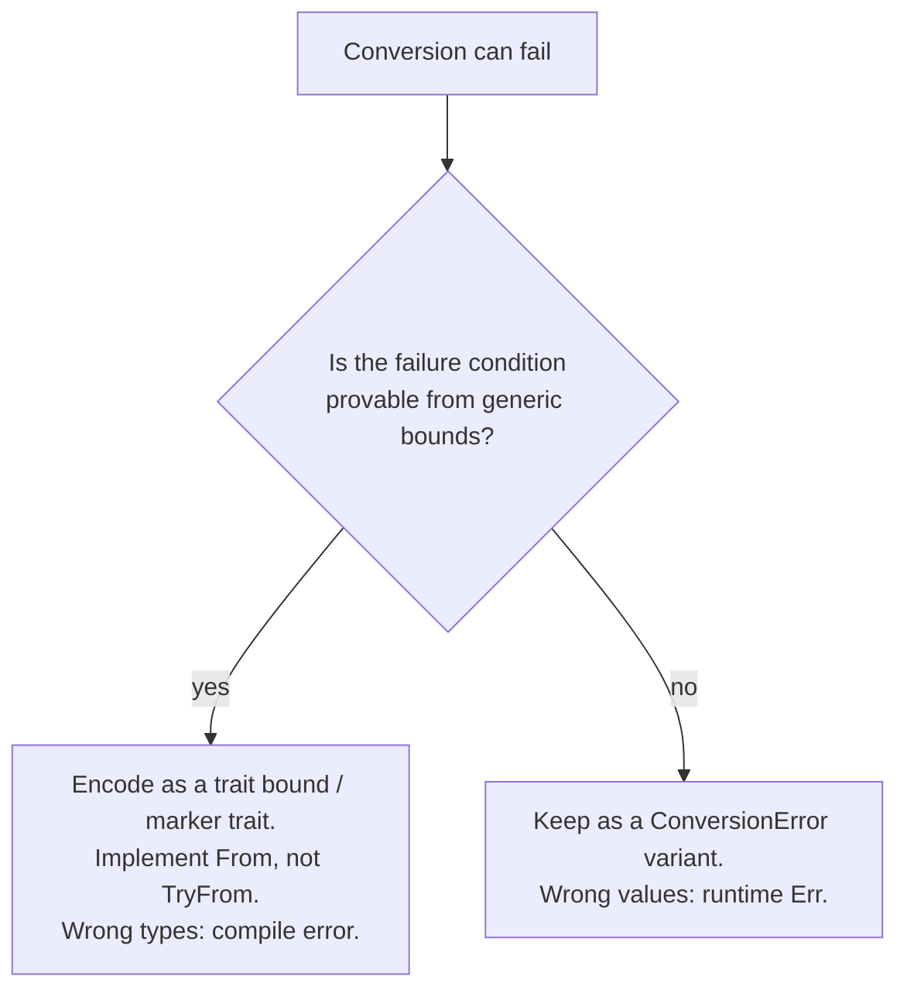

# Crate-Wide Error Module (Design Document)


---

### 1. Introduction

`control-rs::math` has three error types, all defined in `src/math/mod.rs`:

- `ArithmeticError` — Produced by `math::ops`'s `Try*` traits and consumed by
  `complex_num.rs` and `assert.rs`.
- `ConversionError` — Returned by numerical models during representation and
  layout conversion, shared across `Matrix`, `Polynomial` and `Tensor`.
- `LinAlgError` — Supplements `ArithmeticError` for `Matrix` factorization,
  inversion and system-solving failures.

This revision narrows `ConversionError`'s variant set. A `TryFrom` conversion
should return `Err` only for a condition its own type signature cannot
already rule out; a condition already pinned by a `where` bound is not a
runtime error, it is dead code wearing an `Err` arm.

---

### 2. Requirements

#### 2.1 Functional Requirements

- **FR-1 — Single Definition for Shared Error Types**: An error type consumed
  by more than one sibling module (`Matrix`, `Polynomial`, `Tensor`,
  `StateSpace`, `TransferFunction`) must be defined once, here.
- **FR-2 — No Statically-Decidable Failure Modes**: A `ConversionError`
  variant may only be returned for a condition that is not already provable
  from the producing conversion's own generic bounds. If a bound already
  guarantees the condition, the conversion must be infallible (`From`, not
  `TryFrom`) with respect to that condition.

#### 2.2 Non-Functional Requirements

- **NFR-1 — Convention Compliance**: Follows the crate-wide `thiserror`-enum
  convention already established by `matrix-design.md` and
  `state-space-design.md`.
- **NFR-2 — No Change to Shipped Conversions**: `StorageView`/
  `StorageViewMut::new` (`src/math/storage.rs`) are the only shipped
  `ConversionError` producers. Their `data.len() == R::USIZE * C::USIZE`
  check stays a runtime `Err`: `&[T]` erases length from its type, and
  `&[T; R::USIZE * C::USIZE]` requires `generic_const_exprs`, unstable on
  the toolchain this crate targets. This revision only affects the
  as-yet-unimplemented `Matrix`/`Polynomial`/`Tensor` `TryFrom` conversions
  specified in `../numerical-models/matrix-design.md`,
  `../numerical-models/polynomial-design.md` and
  `../numerical-models/tensor-design.md`.

---

### 3. Technical Overview

```rust
/// Representation and value-validity conversion errors, shared across
/// `Matrix`, `Polynomial` and `Tensor` conversions.
#[derive(Debug, Clone, Copy, PartialEq, Eq)]
pub enum ConversionError {
    /// Dimension or capacity overflow/underflow during calculations.
    DimensionMismatch,
    /// The polynomial is not monic (leading coefficient is not ONE),
    /// preventing companion matrix construction.
    NonMonicPolynomial,
}
```

`LayoutMismatch` is removed. Its two prior failure conditions (rank, size)
are absorbed into the type system (§4).

---

### 4. Architecture



**`DimensionMismatch` stays.** Two producers, both value/runtime-dependent:

- `StorageView`/`StorageViewMut::new` wrap a runtime `&[T]` slice; its
  length is not part of its type (NFR-2).
- `Matrix → Polynomial` (Faddeev–LeVerrier,
  `../numerical-models/matrix-design.md`
  §4.8.1) fails "if the scalar type cannot perform division, if numerical
  overflow occurs or if capacity is insufficient" — a numeric-value
  condition, not a size condition.

**`NonMonicPolynomial` stays.** `Polynomial → Matrix` companion-form
conversion (`../numerical-models/polynomial-design.md` §4.7.1) fails when
the leading coefficient is not `T::ONE` — a property of the polynomial's
runtime coefficient values, invisible to `N: Dim`. nalgebra's own
factorization APIs keep an equivalent value-dependent check at runtime:
`Cholesky::new` "Returns `None` if the input matrix is not
definite-positive" (nalgebra, 2026), with no compile-time alternative
offered. Eigen documents the same boundary from the other direction: fixed
size objects get compile-time checks, but a check that depends on the
matrix's actual entries cannot (Eigen, 2026).

**`LayoutMismatch` is removed.** Its two conditions were independent and
only one was ever a runtime property:

1. *Size.* `Matrix → Tensor` (`../numerical-models/matrix-design.md` §4.8.2),
   `Polynomial → Tensor` (`../numerical-models/polynomial-design.md` §4.7.2)
   and the reverse `Tensor →` conversions (
   `../numerical-models/tensor-design.md`
   §4.11) all already carry a `where Layout: TensorLayout<Size = ...>`
   bound. If that bound holds, a size mismatch cannot occur; returning
   `Err(LayoutMismatch)` for it duplicates the bound instead of trusting it
   (FR-2).
2. *Rank.* `Layout::RANK != 2` (or `!= 1`) checks a compile-time associated
   constant at runtime. Nothing about `RANK` is dynamic — it is fixed the
   moment `Layout` is chosen.

Both conditions are therefore statically decidable and belong in the type
system, not in `ConversionError`. Eigen's documented split is the direct
precedent: "there are many conditions can and should be detected at compile
time" for fixed-size objects, with runtime assertions reserved for
genuinely dynamic ones (Eigen, 2026). uom demonstrates the end state: its
dimensional-analysis conversions are rejected at compile time
(`error[E0308]`), with "operations on quantities (+, -, *, /, …) have zero
runtime cost over using the raw storage type" (uom, 2026) — no runtime
error type exists for a unit mismatch, because the type system already
prevents constructing one.

**Layout and Dimension Verification**: Infallible `From` conversions
(e.g., `From<Matrix<T, R, C, Dense<T, R, C, B>>> for Tensor<T, Layout, B>` where
`Layout: TensorLayout<Size = <R as DimMul<C>>::Output>`, and
`From<Polynomial<T, N, Dense<T, N, U1, B>>> for Tensor<T, Layout, B>` where
`Layout: TensorLayout<Size = N>`) guarantee compile-time shape alignment
without runtime branch evaluation or error wrapper overhead. A dimension or
rank mismatch fails at compile time (`error[E0277]` / `error[E0308]`),
matching the zero-cost compile-time dimension bounding strategy of `control-rs`.

---

### 5. Alternatives

- **Do nothing (status quo)**: Keep `LayoutMismatch` as a blanket runtime
  check covering both rank and size. Rejected: violates FR-2 for the size
  half, which the existing `TensorLayout<Size = ...>` bound already
  guarantees; the rank half checks a value (`Layout::RANK`) that never
  varies at runtime.
- **Collapse `ConversionError` to `Option`**, following nalgebra's
  `Cholesky::new -> Option<Self>` (nalgebra, 2026). Rejected:
  `storage_tests.rs` and downstream callers already branch on *which*
  condition failed (`DimensionMismatch` vs. a monic-ness check); ndarray,
  ndarray-linalg and LAPACK all keep a structured, multi-variant error for
  this reason — ndarray's `ErrorKind` distinguishes "incompatible shape"
  from "overflow when computing offset, length, etc." (ndarray, 2026),
  ndarray-linalg's `LinalgError` composes a shape variant with a wrapped
  LAPACK code rather than flattening both to one signal (ndarray-linalg,
  2026), and LAPACK's own `INFO` convention separates "illegal value of
  one or more arguments" from "failure in the course of computation" by
  sign (Anderson et al., 1999).
- **Per-strategy modules** (saturating/wrapping/strict), following the
  `fixed` crate's `Saturating`/`Wrapping`/`Strict` split (fixed, 2026).
  Rejected: that pattern trades a single fallible operation for several
  infallible ones under different numeric policies — applicable to
  `ArithmeticError`'s overflow domain, not to `ConversionError`'s
  shape/value-validity domain.
- **Approximate instead of error**, following micromath's infallible,
  precision-traded approximations (micromath, 2023). Not applicable:
  `ConversionError`'s conditions (dimension, monic-ness) are correctness
  properties with no valid approximate answer, unlike micromath's
  trigonometric/sqrt approximations.
- **Fold `ConversionError` into `ArithmeticError` (considered, deferred;
  carried over from rev 1.1)**: `ArithmeticError`'s existing variants
  (`DivisionByZero`, `Overflow`, `DomainViolation`, `PrecisionLoss`,
  `Underflow`, `Saturation`) are scalar-arithmetic-shaped, not
  layout/value-shaped.

---

### 6. Verification & Validation

1. `StorageView`/`StorageViewMut::new`'s `DimensionMismatch` path keeps its
   existing success/failure unit test pairs and proptest coverage
   (`src/math/tests/storage_tests.rs`) — unaffected by this revision
   (NFR-2).
2. When `Matrix → Polynomial` and `Polynomial → Matrix` land, each
   `ConversionError` variant they produce (`DimensionMismatch`,
   `NonMonicPolynomial`) needs a dedicated failure-path unit test, matching
   the existing pattern in `src/math/mod.rs`'s `Display` tests and
   `storage_tests.rs`.
3. When the `From` + `TensorLayout<Size = ...>` conversions (§4) land, add a
   `compile_fail` doctest demonstrating that a `Layout` whose `Size` does not
   match the source shape fails to compile rather than returning `Err`,
   matching the `compile_fail` doctest pattern already used in
   `src/math/num_types.rs` for the Peano trait-solver ceiling. Rank is a
   property of `Layout` at the moment it is chosen; it is not a separate
   marker-trait family.

---

### 7. Performance & Resource Considerations

Removing `LayoutMismatch` drops `ConversionError` from three variants to
two and removes a runtime `RANK` branch from every `Tensor` conversion,
replacing it with a monomorphization-time trait check — zero runtime cost,
consistent with NFR-1's existing convention.

---

### 8. Risks & Open Questions

- **Downstream Tensor conversions (closed, Rev 1.3)**:
  `../numerical-models/matrix-design.md` §4.8.2,
  `../numerical-models/polynomial-design.md` §4.7.2 and
  `../numerical-models/tensor-design.md` §4.11 specify infallible `From`
  bounded by `TensorLayout<Size = ...>`. Rank-marker traits (`Rank1Layout` /
  `Rank2Layout`) are not part of that surface; `Size` is the bound.
- **`faer-rs` unresearched (open, low priority)**:
  `documentation/math/research/error.json`
  query 9 could not resolve faer-rs's dimension-mismatch convention from
  its crate-level docs. Not pursued further — Eigen and the ndarray/LAPACK
  family already establish the relevant precedent for both branches of §4's
  decision (statically-decidable vs. value-dependent).
- **Assumption**: No `Matrix`/`Polynomial`/`Tensor` `TryFrom` conversions
  exist in shipped code (confirmed by repository search during review).
  This revision is a pre-implementation narrowing, not a breaking change to
  a shipped API.

---

### 9. Development Plan

| Task / Feature                   | Description                                                                                                       | Estimated Effort |
|:---------------------------------|:------------------------------------------------------------------------------------------------------------------|:-----------------|
| Step 1: Narrow `ConversionError` | Remove `LayoutMismatch` from the enum (§3); update `Display`/`Error` impls and their tests in `src/math/mod.rs`.  | Complete         |
| Step 2: Rank-marker traits       | Superseded. Rank and size are `TensorLayout<Size = ...>` bounds (§4), not a `Rank1Layout` / `Rank2Layout` family. | —                |
| Step 3: Align dependent docs     | `matrix-design.md` §4.8.2, `polynomial-design.md` §4.7.2, `tensor-design.md` §4.11 use the `From` + `Size` shape.  | Complete         |

---

### 10. Revision History

| Revision | Date            | Author          | Description                                                                                                                                                                                                                                                                                                                                                                                                                               |
|:---------|:----------------|:----------------|:------------------------------------------------------------------------------------------------------------------------------------------------------------------------------------------------------------------------------------------------------------------------------------------------------------------------------------------------------------------------------------------------------------------------------------------|
| 1.0      | August 2, 2026  | @MitchellDScott | Initial stub relocating `ConversionError` out of `matrix-design.md` per review feedback; minimal pending research.                                                                                                                                                                                                                                                                                                                        |
| 1.1      | August 9, 2026  | @MitchellDScott | Review and corrections.                                                                                                                                                                                                                                                                                                                                                                                                                   |
| 1.2      | August 18, 2026 | @MitchellDScott | Corrected §1's error-type count (three, not two: added `LinAlgError`). Added FR-2/NFR-2, §4 Architecture, §6 Verification & Validation, §7 Performance and §8 Risks & Open Questions. Removed `LayoutMismatch`, moving its rank/size checks into `TensorLayout` trait bounds (§4); added comparative alternatives (§5) grounded in `research/error.json`. Reverted Doc Status to Draft pending re-review of the `LayoutMismatch` removal. |
| 1.3      | August 18, 2026 | @MitchellDScott | Reconciled Doc Status badge to Reviewed-yellow; aligned downstream cross-model conversions in `matrix-design.md`, `polynomial-design.md`, and `tensor-design.md` to infallible compile-time `From` conversions via `TensorLayout<Size = ...>`, eliminating `LayoutMismatch` across design specifications and `src/math/mod.rs`.                                                  |
| 1.4      | August 18, 2026 | @MitchellDScott | Closed stale §8/§9 items against Rev 1.3: downstream `From` + `Size` alignment is complete; rank-marker traits are superseded; V&V item 3 tests the `Size` bound, not `RankNLayout`. |

---

## References

[1] nalgebra, *nalgebra* (Version 0.35.0). [Online]. Available:
https://docs.rs/nalgebra/latest/nalgebra/. Accessed: Aug. 18, 2026.

[2] Eigen, "Assertions," *Eigen documentation (nightly)*. [Online].
Available: https://libeigen.gitlab.io/eigen/docs-nightly/TopicAssertions.html.
Accessed: Aug. 18, 2026.

[3] uom, *uom* (Version 0.38.0). [Online]. Available:
https://docs.rs/uom/latest/uom/. Accessed: Aug. 18, 2026.

[4] ndarray, *ndarray* (Version 0.17.2). [Online]. Available:
https://docs.rs/ndarray/latest/ndarray/. Accessed: Aug. 18, 2026.

[5] ndarray-linalg, *ndarray-linalg* (Version 0.18.1). [Online]. Available:
https://docs.rs/ndarray-linalg/latest/ndarray_linalg/error/enum.LinalgError.html.
Accessed: Aug. 18, 2026.

[6] E. Anderson, Z. Bai, C. Bischof, S. Blackford, J. Dongarra, J. Du Croz,
A. Greenbaum, S. Hammarling, A. McKenney, and D. Sorensen, *LAPACK
Users' Guide*, 3rd ed. Philadelphia, PA, USA: SIAM, 1999.

[7] fixed, *fixed* (Version 1.31.0). [Online]. Available:
https://docs.rs/fixed. Accessed: Aug. 18, 2026.

[8] micromath, *micromath* (Version 2.1.0). [Online]. Available:
https://docs.rs/micromath/latest/micromath/. Accessed: Aug. 18, 2026.
