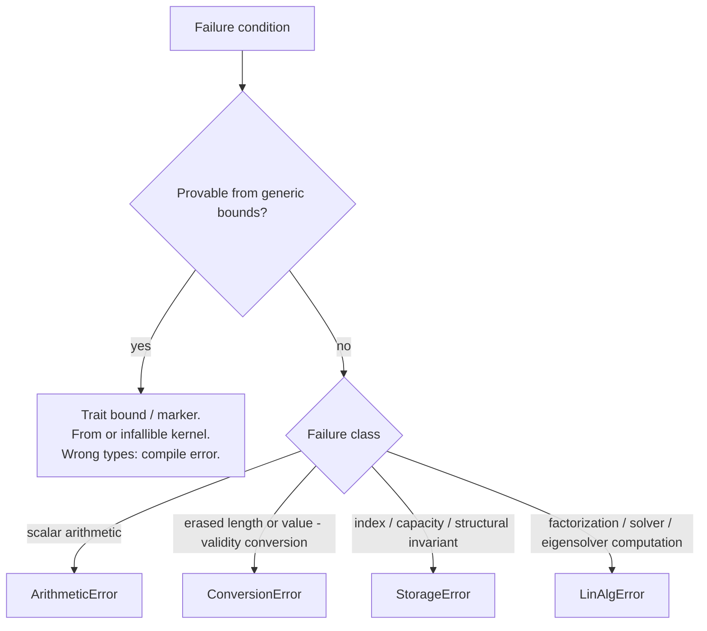

# Crate-Wide Error Module (Design Document)


---

### 1. Introduction

`control-rs::math` exposes four crate-wide error types, defined once in
`src/math/mod.rs`:

- `ArithmeticError` — Scalar `Try*` failures (`math::ops`), consumed by
  `complex_num.rs` and `assert.rs`.
- `ConversionError` — Representation and value-validity failures whose
  producing conversion's type signature cannot already rule them out.
- `StorageError` — Indexing, capacity, and structural-invariant failures on
  dense, packed, and sparse backends (`storage-design.md`).
- `LinAlgError` — Computational failures of factorizations, solvers, and
  spectral decompositions (`subprograms-design.md`).

`storage-design.md` and `subprograms-design.md` each introduce error
variants defined in this module. Conditions provable from generic bounds
fail at compile time rather than returning runtime error variants.
LAPACK's `INFO` split provides the layering foundation: illegal arguments versus
failure in the course of computation [1].

---

### 2. Requirements

#### 2.1 Functional Requirements

- **FR-1 — Shared error type definitions**: An error type consumed by more than
  one sibling module (`storage`, `subprograms`, `Matrix`, `Polynomial`,
  `Tensor`, `StateSpace`, `TransferFunction`) is defined once in this module.
  Single-consumer enums stay in their owning module.
- **FR-2 — Static failure exclusion**: A variant may be returned only for a
  condition that is not already provable from the producer's generic bounds. If
  a bound guarantees the condition, the API is infallible with respect to that
  condition.
- **FR-3 — Disjoint failure classification**: Map each runtime failure to
  exactly one enum partitioned by failure class (scalar arithmetic,
  representation conversion, storage indexing and structural invariants, or
  linear algebra computation) rather than by producing file. No failure
  condition may be represented across multiple crate-wide error enums.

#### 2.2 Non-Functional Requirements

- **NFR-1 — Explicit display and error traits**: All error types hand-roll
  `core::fmt::Display` and `core::error::Error` without external macro
  dependencies (such as `thiserror`), preserving zero-dependency `#![no_std]`
  compilation.

#### 2.3 Constraints

- **C-1 — `#![no_std]` compatibility**: All error definitions, enums, and trait
  implementations compile under `#![no_std]` using `core::fmt` without requiring
  standard library facilities.
- **C-2 — Zero dynamic allocation**: Error instances are fixed-size stack values
  implementing `Copy` and `Clone`; formatting and inspection never invoke
  dynamic heap allocation.
- **C-3 — No panics outside test code**: Library code encountering error
  conditions returns explicit `Result<T, E>` variants; panicking or assertions
  are prohibited in production paths.

---

### 3. Technical Overview

```rust
/// Scalar arithmetic errors encountered during fallible `Try*` operations.
#[derive(Debug, Clone, Copy, PartialEq, Eq)]
pub enum ArithmeticError {
    /// Attempted to divide by zero.
    DivisionByZero,
    /// The mathematical operation is undefined for the given inputs.
    DomainViolation,
    /// The result exceeded the maximum representable range of the type.
    Overflow,
    /// Quantization or rounding error resulting in loss of precision.
    PrecisionLoss,
    /// The value exceeded the range but was clamped to the limit.
    Saturation,
    /// The result is smaller than the smallest representable positive value.
    Underflow,
}

/// Representation and value-validity conversion errors, shared across
/// `Matrix`, `Polynomial`, `Tensor`, and fallible view wrapping.
#[derive(Debug, Clone, Copy, PartialEq, Eq)]
pub enum ConversionError {
    /// Buffer length or conversion capacity is incompatible with the
    /// destination shape (erased from the producing type).
    DimensionMismatch,
    /// The polynomial is not monic (leading coefficient is not ONE),
    /// preventing companion matrix construction.
    NonMonicPolynomial,
}

/// Indexing, capacity, and structural-invariant failures on storage backends.
#[derive(Debug, Clone, Copy, PartialEq, Eq)]
pub enum StorageError {
    /// Logical `(r, c)` (or packed `(i, j)`) exceeds the backend's dimensions.
    OutOfBounds,
    /// `nnz` would exceed the compile-time `MAX_NNZ` of a stack sparse leaf.
    CapacityExceeded,
    /// Write to a unit-diagonal slot of `TriangularPackedStorage`.
    ImmutableUnitDiagonal,
    /// Write of a non-real value to a Hermitian diagonal slot.
    InvalidHermitianDiagonal,
    /// Write to an unallocated sparse coordinate, or a compressed buffer
    /// that violates its offset/index contract.
    InvalidStructuralInvariant,
}

/// Computational failures of factorizations, solvers, and spectral decompositions.
#[derive(Debug, Clone, Copy, PartialEq, Eq)]
pub enum LinAlgError {
    /// Cholesky (`Potrf` / `Pptrf`) encountered a non-positive pivot.
    NotPositiveDefinite,
    /// LU (`Getrf`) or a triangular solve encountered an exact-zero pivot.
    SingularMatrix,
    /// Caller-provided `tau` / `work` / `ipiv` slice is shorter than required.
    WorkspaceTooSmall,
    /// Jacobi eigensolver (`Syev` / `Heev`) exhausted its iteration bound.
    MaxIterationsReached,
}

pub type ArithmeticResult<T> = Result<T, ArithmeticError>;
pub type ConversionResult<T> = Result<T, ConversionError>;
pub type StorageResult<T> = Result<T, StorageError>;
pub type LinAlgResult<T> = Result<T, LinAlgError>;
```

`ConversionError` has no `LayoutMismatch` arm. `LinAlgError` has no
`NonSquareMatrix` or `DimensionMismatch` arm.

---

### 4. Architecture



#### 4.1 Layering

ndarray keeps a dedicated shape/layout error whose `ErrorKind` distinguishes
"incompatible shape" from "overflow when computing offset, length, etc."
[2]. ndarray-linalg then composes that shape error with LAPACK
failure codes in a separate `LinalgError` [3]. LAPACK
itself splits the diagnostic argument: `INFO < 0` means an illegal argument
and no computation; `INFO > 0` means failure in the course of computation
[1]. This design uses three public enums for those
layers rather than wrapping, because `control-rs` dimensions are `Dim`
parameters rather than runtime ndarray shapes: a wrap would reintroduce a
shape variant on `LinAlgError` that FR-2 already forbids.

Subprogram kernels assume valid operand dimensions (`subprograms-design.md`
C-1) and keep `debug_assert_eq!` at the kernel boundary. High-level
containers enforce shape statically (`subprograms-design.md` NFR-3). Eigen
states the same split: many conditions on fixed-size objects "can and
should be detected at compile time" [4]. uom rejects illegal
dimensional conversions at compile time (`error[E0308]`) with "zero runtime
cost over using the raw storage type" [5].

#### 4.2 `ConversionError`

**`DimensionMismatch` representation.** Producers are value- or
slice-length-dependent:

- `StorageView` / `StorageViewMut::new_with_strides` wrap a runtime `&[T]`
  with caller strides; length is not part of the type (`storage-design.md`
  §3.1, §4.2, §4.6).
- `StaticStorageView` / `StaticStorageViewMut::new` (`LayoutMarker`-tagged)
  wrap a runtime `&[T]` whose length must equal `R::USIZE * C::USIZE`.
  Length is erased from `&[T]`;
  `&[T; R::USIZE * C::USIZE]` requires `generic_const_exprs`. Both view
  families remain the shipped `ConversionError` producers.
- `Matrix → Polynomial` (Faddeev–LeVerrier,
  `../numerical-models/matrix-design.md` §4.8.1) fails "if the scalar type
  cannot perform division, if numerical overflow occurs or if capacity is
  insufficient" — a numeric-value condition, not a `Dim` mismatch.
- Dense ↔ packed ↔ sparse conversions whose destination capacity is a
  runtime `nnz` against a typed `MAX_NNZ` use `StorageError`
  (`CapacityExceeded`); a shape incompatibility that survives the
  type signature (erased view length, DSP convolution against a runtime
  slice) uses `ConversionError::DimensionMismatch`.
  `src/math/dsp.rs` `Convolution` returns that arm when `output.len()` is
  shorter than `input_len + kernel_len - 1`. A panic or `#[should_panic]`
  test is a defect against FR-3. `polynomial-design.md` §4.5 names the same
  arm.

**`NonMonicPolynomial` representation.** `Polynomial → Matrix` companion-form
conversion (`../numerical-models/polynomial-design.md` §4.7.1) fails when
the leading coefficient is not `T::ONE` — a property of runtime
coefficient values, invisible to `N: Dim`. nalgebra's factorization APIs
keep an equivalent value-dependent check at runtime: `Cholesky::new`
"Returns `None` if the input matrix is not definite-positive" [6],
with no compile-time alternative offered.

**Compile-time layout checking.** Rank and size of
`Matrix` / `Polynomial` / `Tensor` conversions are `TensorLayout<Size = …>`
bounds. If that bound holds, a size mismatch cannot occur (FR-2). Rank is
an associated constant of `Layout`. Both belong in the type system.
Infallible `From` conversions (e.g.
`From<Matrix<T, R, C, …>> for Tensor<T, Layout, B>` where
`Layout: TensorLayout<Size = <R as DimMul<C>>::Output>`) fail at compile
time (`error[E0277]` / `error[E0308]`). A runtime `LayoutMismatch` variant
is therefore excluded.

#### 4.3 `StorageError`

Adopted from `storage-design.md` §3.3 / §4.6, with one deletion:
`DimensionMismatch` is not duplicated here (FR-3). Remaining variants are
all runtime properties of a live buffer, not of `Dim`:

| Variant                      | Producer                                                                                                                  | Why runtime                                                                                                          |
|:-----------------------------|:--------------------------------------------------------------------------------------------------------------------------|:---------------------------------------------------------------------------------------------------------------------|
| `OutOfBounds`                | `StorageMut::set`, `PackedStorageMut::set`, `SparseStorageMut::set`, `ArrayCooStorage::push`, `ArrayCsrStorage::from_coo` | `(r, c)` is a value; checked accessors return `Result` at library boundaries (`storage-design.md` FR-2). |
| `CapacityExceeded`           | `ArrayCooStorage::push`; dense → sparse when `nnz > MAX_NNZ`                                                              | `MAX_NNZ` is a type parameter; live `nnz` is not (ndarray's offset/length overflow class [2]).                       |
| `ImmutableUnitDiagonal`      | `TriangularPackedStorage::set` with `Diag::Unit`                                                                          | Unit diagonal is a construction flag; the write is a value at `(i, i)`.                                              |
| `InvalidHermitianDiagonal`   | `HermitianPackedStorage::set` on the diagonal                                                                             | $\mathrm{Im}(A_{i,i}) = 0$ is a value invariant (`storage-design.md` FR-5, FR-10).                                   |
| `InvalidStructuralInvariant` | `SparseStorageMut::set` on an unallocated coordinate; malformed CSR/CSC offsets                                           | Sparsity pattern is data, not a `Dim`.                                                                               |

Checked `get` continues to return `Option<&T>` (`None` = missing or
out-of-bounds). `set` returns `Result<(), StorageError>` because a failed
write must distinguish bounds, capacity, and invariant classes.
Unchecked accessors stay `unsafe` and infallible
(`storage-design.md` C-4).

Typed layout conversions whose shapes are in the type
(`SymmetricPackedStorage<T, N, L>` → `ArrayStorage<T, N, N>`) are `From`,
not `TryFrom` (FR-2). `ToDenseStorage` and inherent dense projections
(`from_dense_diagonal`, `from_dense_triangle`) return `StorageError` only
for capacity and structural failures, not for a `Dim` mismatch.
`storage-design.md` §3.3 / §4.6 match this enum: no
`StorageError::DimensionMismatch` arm.

#### 4.4 `LinAlgError`

Computational class only (`INFO > 0` [1]):

- **`NotPositiveDefinite`**: `Potrf` / `Pptrf` verify $L_{k,k} > 0$ before
  the square-root step (`subprograms-design.md` §4.3). Distinct from
  `SingularMatrix` so a Kalman / MPC loop can retry a different
  factorization. nalgebra collapses this to `Option` [6];
  §5 rejects that collapse.
- **`SingularMatrix`**: `Getrf` exact-zero pivot; LU, LDLT, and QR
  substitution routines in `src/matrix/decomposition.rs` and
  `src/matrix/specialized.rs` return this variant upon detecting rank
  deficiency.
- **`WorkspaceTooSmall`**: `Geqrf` / `Ormqr` / `Unmqr` / `Syev` / `Heev` /
  `Getrs` take `&mut [T]` (and `ipiv: &mut [usize]`). Slice length is
  erased, so the check is `INFO < 0`-shaped but cannot be a `Dim` bound
  unless the signatures switch to `[T; N]` (`subprograms-design.md` §4.3,
  §8).
- **`MaxIterationsReached`**: Jacobi `Syev` / `Heev` on the stack
  (`subprograms-design.md` §4.3). Iteration count is data-dependent.

**Excluded Variants:**

- **`DimensionMismatch`**: Excluded from `LinAlgError`.
  `subprograms-design.md` C-1 (kernels assume valid dimensions) and NFR-3
  (containers enforce shape statically) make illegal operand shape a
  compile error or a `debug_assert` at the kernel boundary, not a solver
  `Err` [1], [4]. DSP convolution against a
  runtime slice is `ConversionError::DimensionMismatch` (`src/math/dsp.rs`;
  `polynomial-design.md` §4.5).
- **`NonSquareMatrix`**: Excluded from `LinAlgError`. Square factorizations
  are statically typed as `Matrix<T, D, D>` / `Const<D>: Dim`. ndarray-linalg's
  `NotSquare`
  exists because ndarray shapes are runtime [3];
  that rationale does not apply under static shape parameters (FR-2).

In shipped matrix factorizations (`src/matrix/decomposition.rs`),
`CholeskyDecomposition` delegates to `Potrf` and returns
`LinAlgError::NotPositiveDefinite` on non-positive diagonal pivots.
`LdltDecomposition` intentionally checks `d_j.abs() < T::epsilon()` and
returns `LinAlgError::SingularMatrix`.

---

### 5. Alternatives

- **Blanket `LayoutMismatch` covering rank and size**: Keep `LayoutMismatch`
  as a runtime check covering both rank and size; leave `StorageError`
  unspecified in this module; retain runtime shape errors on `LinAlgError`.
  Rejected: `storage-design.md` and `subprograms-design.md` name additional
  shared failure modes (FR-1); `LayoutMismatch` still violates FR-2 for
  rank/size.
- **Keep `DimensionMismatch` on all three enums**. Rejected:
  FR-3; callers cannot match one condition; LAPACK and ndarray-linalg
  already separate shape from computation [1], [3]. Sibling UMLs omit the arm
  (`storage-design.md` §3.3, `subprograms-design.md` §3.3).
- **Fold `StorageError` into `ConversionError`**. Rejected: capacity and
  Hermitian-diagonal writes are not conversions. ndarray keeps overflow
  and incompatible-shape as distinct `ErrorKind`s on a layout type, and
  still does not fold those into LAPACK computational codes [2], [3].
- **Wrap `StorageError` / `ConversionError` inside `LinAlgError`**,
  following ndarray-linalg's `Shape` / `Lapack` composition
  [3]. Rejected: wrapping reintroduces a shape arm on
  the solver type; kernel preconditions are compile-time (
  `subprograms-design.md`
  C-1).
- **Collapse `LinAlgError` (and `ConversionError`) to `Option`**,
  following nalgebra's `Cholesky::new -> Option<Self>` [6].
  Rejected: `storage_tests.rs` and downstream callers already branch on
  _which_ condition failed; ndarray, ndarray-linalg and LAPACK all keep a
  structured, multi-variant error — ndarray's `ErrorKind` distinguishes
  "incompatible shape" from "overflow when computing offset, length, etc."
  [2], ndarray-linalg's `LinalgError` composes a shape variant
  with a wrapped LAPACK code [3], and LAPACK's `INFO`
  convention separates illegal arguments from computational failure by
  sign [1]. Distinguishing `NotPositiveDefinite` from
  `SingularMatrix` is the same requirement at the solver layer.
- **Per-strategy modules** (saturating/wrapping/strict), following the
  `fixed` crate's `Saturating`/`Wrapping`/`Strict` split [7].
  Rejected: that pattern trades a single fallible operation for several
  infallible ones under different numeric policies — applicable to
  `ArithmeticError`'s overflow domain, not to conversion, storage, or
  factorization domains.
- **Approximate instead of error**, following micromath's infallible,
  precision-traded approximations [8]. Not applicable:
  dimension, monic-ness, structural invariants, and singularity are
  correctness properties with no valid approximate answer.
- **Fold `ConversionError` into `ArithmeticError`**: `ArithmeticError`'s
  existing variants
  (`DivisionByZero`, `Overflow`, `DomainViolation`, `PrecisionLoss`,
  `Underflow`, `Saturation`) are scalar-arithmetic-shaped, not
  layout/value/storage-shaped.
- **Retain `NonSquareMatrix` variant**, following ndarray-linalg's
  `NotSquare` [3]. Rejected: that variant serves dynamically sized arrays;
  `control-rs` square solvers are statically typed `Matrix<T, D, D>` (FR-2).

---

### 6. Verification & Validation

#### 6.1 Approach

- Verify that shared error enums (`ConversionError`, `StorageError`,
  `LinAlgError`, `ArithmeticError`) correctly encapsulate all
  non-statically-decidable runtime failure conditions across sibling crates
  without overlap.
- Ensure that `Display` and `core::error::Error` implementations format
  accurately under `#![no_std]` without dynamic memory allocation.
- Ensure statically decidable dimension mismatches fail at compile time rather
  than returning runtime errors.
- Validate failure path returns across dense, packed, sparse storage, DSP
  convolution, and LAPACK-class linear algebra kernels.

| Method                   | Mechanism                                                                                                                                                                            |
|:-------------------------|:-------------------------------------------------------------------------------------------------------------------------------------------------------------------------------------|
| Requirements-based test  | Unit tests covering error variant constructors, conversion failures, buffer boundaries, workspace limits, Display formatting, round-trip discriminants, and disjoint failure domains |
| Compile-time shape check | Rustdoc `compile_fail` doctests asserting static rejection of invalid dimensions, and cargo builds under `--no-default-features` for `thumbv7em-none-eabihf`                         |
| Property-based test      | `proptest` coverage on storage views and slices asserting indexing and bounds failures consistently return expected error variants                                                   |
| Static analysis          | Source inspection confirming error enums derive `Copy` with zero dynamic heap allocation symbols                                                                                     |
| Coverage measurement     | `cargo coverage` measuring statement and branch coverage of error paths                                                                                                              |

- Target: 100% statement and branch coverage of all `Display` formatting, error
  constructors, and conversion pathways in `src/math/mod.rs`.
- Exclusions: Computational kernel internals owned by `storage-design.md` and
  `subprograms-design.md`.

- Cross-module integration tests in `matrix`, `polynomial`, and `storage`
  verifying consistent error propagation across the public API.

#### 6.2 Acceptance

| Claim                                  | Oracle                                                                | Measure                                         | Bound                                             |
|:---------------------------------------|:----------------------------------------------------------------------|:------------------------------------------------|:--------------------------------------------------|
| Error enum trait contracts             | Trait bounds (`Debug`, `Clone`, `Copy`, `PartialEq`, `Eq`, `Display`) | Compilation under `#![no_std]`                  | Satisfied without standard library                |
| Invalid slice view wrapping            | Length shorter than destination $R \times C$                          | Return value of `StorageView::new_with_strides` | Returns `Err(ConversionError::DimensionMismatch)` |
| DSP short convolution output           | Output slice shorter than $L_x + L_h - 1$                             | Return value of `dsp.rs` convolution            | Returns `Err(ConversionError::DimensionMismatch)` |
| Storage structural invariant violation | Invalid mutation in CSR/CSC backends                                  | Return value of `set()` / indexing              | Returns specified `StorageError` variant          |
| Cholesky non-SPD failure               | Indefinite or negative pivot matrix                                   | Return value of `Potrf` / `Pptrf`               | Returns `Err(LinAlgError::NotPositiveDefinite)`   |
| LU singular matrix failure             | Rank-deficient matrix with exact zero pivot                           | Return value of `Getrf`                         | Returns `Err(LinAlgError::SingularMatrix)`        |
| Workspace buffer underflow             | Buffer one element short of required length                           | Return value of LAPACK routines                 | Returns `Err(LinAlgError::WorkspaceTooSmall)`     |
| Jacobi iteration budget exhaustion     | Iteration budget set to zero                                          | Return value of `Syev` / `Heev`                 | Returns `Err(LinAlgError::MaxIterationsReached)`  |
| Statically decidable matrix dimensions | Dimension mismatch on `Gemv` / `Gemm`                                 | Rustdoc `compile_fail` doctest                  | Compilation rejected at compile time              |

#### 6.3 Limits

- Target execution (ETS) of error enums is omitted, as error types are
  host-verifiable data structures; execution on physical targets is covered by
  algorithm harnesses (`subprograms-design.md` §6.2).
- Downstream `TensorLayout<Size = ...>` doctests await implementation of
  `tensor-design.md`.

---

### 7. Performance & Resource Considerations

Tensor conversions have no runtime `RANK` branch. Omitting
`DimensionMismatch` from `StorageError` and `LinAlgError` keeps BLAS inner
loops and `set` match arms free of a dead shape class — zero runtime cost
on `ArrayStorage` kernels, consistent with `subprograms-design.md` NFR-4.
`StorageError` and the extra `LinAlgError` variants are `Copy` enums; they
add no allocation.

---

### 8. Risks & Open Questions

- **Downstream Tensor conversions**:
  `../numerical-models/matrix-design.md` §4.8.2,
  `../numerical-models/polynomial-design.md` §4.7.2 and
  `../numerical-models/tensor-design.md` §4.11 specify infallible `From`
  bounded by `TensorLayout<Size = …>`. Rank-marker traits (`Rank1Layout` /
  `Rank2Layout`) are not part of that surface; `Size` is the bound.
- **Sibling-doc alignment**:
  `storage-design.md` §3.3 / §4.6 omits `StorageError::DimensionMismatch`.
  `subprograms-design.md` §3.3 omits `LinAlgError::DimensionMismatch`.
  `polynomial-design.md` §4.5 names `ConversionError::DimensionMismatch`
  from `Convolution`. FR-3 holds across these modules. `src/math/dsp.rs`
  returns `ConversionError::DimensionMismatch` on short output buffers;
  this contract is verified in `src/math/tests/dsp_tests.rs`.
- **`faer-rs` unresearched (open, low priority)**:
  faer-rs's dimension-mismatch convention is not established from its
  crate-level docs. Eigen and the ndarray/LAPACK family already cover
  both branches of §4 (statically-decidable vs. value-dependent).
- **Matrix Cholesky mapping (resolved)**: `CholeskyDecomposition` in
  `src/matrix/decomposition.rs` delegates to `Potrf` and returns
  `NotPositiveDefinite` on non-positive diagonal pivots. `LdltDecomposition`
  intentionally retains `SingularMatrix` for rank-deficient pivots.
- **Workspace signatures (frozen)**: `subprograms-design.md` specifies caller-supplied
  slices `&mut [T]` and `ipiv: &mut [usize]` with runtime length checking, so
  `WorkspaceTooSmall` is permanently retained in `LinAlgError`. Fixed-capacity
  typed arrays `[T; N]` are rejected to avoid rigid dimension plumbing and static capacity caps.
- **Enum evolution**: `StorageError` is integrated across all storage backends
  in `src/math/storage.rs`. `LinAlgError::NonSquareMatrix` was removed
  without breakage since static dimension typing already prevented runtime
  non-square invocation.
- **Shipped producers**:
  `StorageView` / `StorageViewMut::new_with_strides` and
  `StaticStorageView` / `StaticStorageViewMut::new` remain shipped
  `ConversionError` producers (§4.2), alongside `dsp.rs` convolution.
  `StorageError` producers are live across dense, packed, and sparse storage
  backends in `src/math/storage.rs` (covering bounds, capacity, unit diagonal,
  and Hermitian diagonal invariants). Shipped `LinAlgError` producers return
  `SingularMatrix` (LU, LDLT, QR) and `NotPositiveDefinite` (Cholesky `Potrf`).
  `NonSquareMatrix` is removed. As-yet-unimplemented `Matrix` / `Polynomial` /
  `Tensor` conversions remain as specified in the numerical-model drafts.

---

### 9. Development Plan

| Phase                                   | Description                                                                                                                                            | Estimated Effort |
|:----------------------------------------|:-------------------------------------------------------------------------------------------------------------------------------------------------------|:-----------------|
| **Phase 1: Shared Error Enums**         | Land `ConversionError`, `StorageError`, and `LinAlgError` with `Display` and `core::error::Error` implementations in `src/math/mod.rs`.                | Complete         |
| **Phase 2: Static Layout Integration**  | Align `Matrix`, `Polynomial`, and `Tensor` specifications to compile-time layout bounds with infallible `From` conversions.                            | Complete         |
| **Phase 3: Runtime Producer Alignment** | Connect `dsp.rs` convolution validation returning `ConversionError::DimensionMismatch` on short output, and storage `set` mutation error returns.      | Complete         |
| **Phase 4: Cross-Module Verification**  | Validate exhaustive discriminant matching, `#![no_std]` compilation under `thumbv7em-none-eabihf`, and unit tests across sibling module failure paths. | Complete         |

---

### 10. Revision History

| Revision | Date              | Author          | Description                                                                                                                                                |
|:---------|:------------------|:----------------|:-----------------------------------------------------------------------------------------------------------------------------------------------------------|
| 1.0      | August 2, 2026    | @MitchellDScott | Initial draft defining crate-wide error handling architecture and `ConversionError`.                                                                       |
| 1.1      | August 18, 2026   | @MitchellDScott | Error type consolidation: introduced `LinAlgError` and `StorageError`, replacing ad-hoc errors across subprograms and storage modules.                     |
| 1.2      | August 18, 2026   | @MitchellDScott | Infallible conversions: transitioned cross-model conversions (`Matrix`, `Polynomial`, `Tensor`) to compile-time layout bounds, eliminating runtime checks. |
| 1.3      | August 22, 2026   | @MitchellDScott | Enum canonicalization: standardized error variants across `StorageError` and `LinAlgError` without cross-enum duplication.                                 |
| 1.4      | August 26, 2026   | @MitchellDScott | Storage retarget: updated error semantics for inherent structured projection constructors (`from_dense_diagonal`, `from_dense_triangle`).                  |
| 1.5      | September 9, 2026 | @MitchellDScott | Standardized §2 requirements/constraints, restructured §6 into formal 6.1–6.7 structure, and transitioned citations to standard IEEE style.                |
| 1.6      | September 10, 2026 | @MitchellDScott | Reconciled §4, §5, §8, §9 with shipped producers: documented Cholesky Potrf delegation, LDLT SingularMatrix mapping, live StorageError producers, dsp.rs error return, and removed references to live NonSquareMatrix. |
| 1.7      | September 10, 2026 | @MitchellDScott | Verification grounding & review closure: added ArithmeticError and ArithmeticResult to §3, updated NFR-1 to hand-rolled Display/Error, froze WorkspaceTooSmall in §8, updated §6.4 locators to kind:locator grammar, and repaired §6.7 reference. |
| 1.8      | September 10, 2026 | @MitchellDScott | Cite hygiene: retarget §4.3 StorageError producers to storage FR-2 / FR-5 / FR-10; align §7 zero-branch claim with subprograms NFR-4. |

---

## References

[1] E. Anderson, Z. Bai, C. Bischof, S. Blackford, J. Dongarra, J. Du Croz,
A. Greenbaum, S. Hammarling, A. McKenney, and D. Sorensen, _LAPACK
Users' Guide_, 3rd ed. Philadelphia, PA, USA: SIAM, 1999.

[2] ndarray, _ndarray_ (Version 0.17.2), 2026. [Online]. Available:
https://docs.rs/ndarray/latest/ndarray/. Accessed: Aug. 18, 2026.

[3] ndarray-linalg, _ndarray-linalg_ (Version 0.18.1), 2026. [Online].
Available:
https://docs.rs/ndarray-linalg/latest/ndarray_linalg/error/enum.LinalgError.html.
Accessed: Aug. 18, 2026.

[4] Eigen, "Assertions," _Eigen documentation (nightly)_, 2026. [Online].
Available: https://libeigen.gitlab.io/eigen/docs-nightly/TopicAssertions.html.
Accessed: Aug. 18, 2026.

[5] uom, _uom_ (Version 0.38.0), 2026. [Online]. Available:
https://docs.rs/uom/latest/uom/. Accessed: Aug. 18, 2026.

[6] nalgebra, _nalgebra_ (Version 0.35.0), 2026. [Online]. Available:
https://docs.rs/nalgebra/latest/nalgebra/. Accessed: Aug. 18, 2026.

[7] fixed, _fixed_ (Version 1.31.0), 2026. [Online]. Available:
https://docs.rs/fixed. Accessed: Aug. 18, 2026.

[8] micromath, _micromath_ (Version 2.1.0), 2023. [Online]. Available:
https://docs.rs/micromath/latest/micromath/. Accessed: Aug. 18, 2026.
