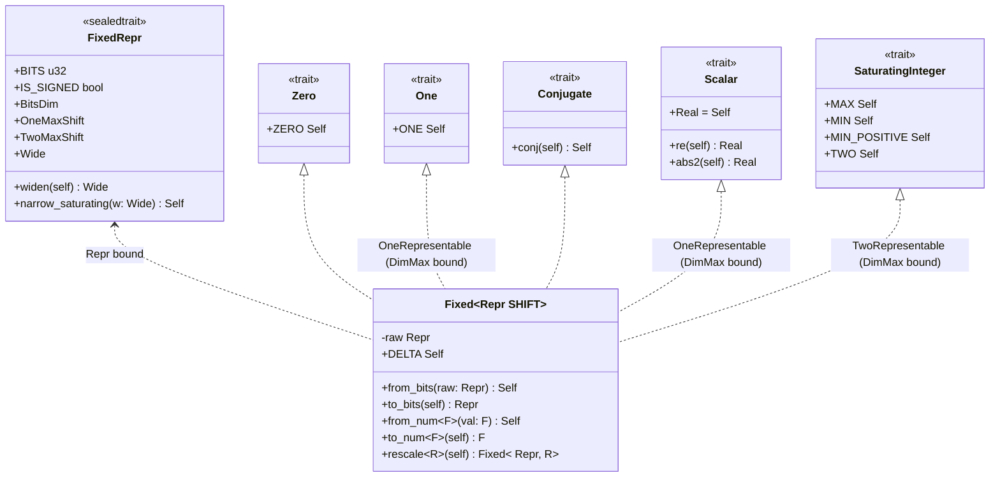
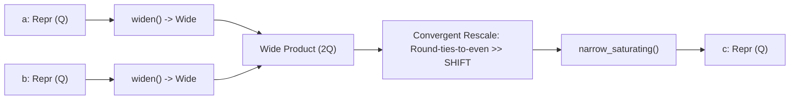

# Fixed-Point Scalar Type (Design Document)


---

### 1. Introduction

The [`src/math/fixed_num.rs`](../../src/math/fixed_num.rs) module introduces the
canonical fixed-point scalar type `Fixed<Repr, const SHIFT: usize>` (alongside
the `Quantized<Repr, SHIFT>` type alias), representing numbers in binary
Q-format where each value is $x = \text{raw} \cdot 2^{-\text{SHIFT}}$ with
fixed quantization step $\Delta = 2^{-\text{SHIFT}}$ [1]–[3].

---

### 2. Requirements

#### 2.1 Functional Requirements

- **FR-1 — Compile-time scale exponent**: The scale exponent `SHIFT` is a const generic
  type parameter validated at compile time via `Dim` trait bounds (`DimMax`). It
  is not stored at runtime.
- **FR-2 — Binary power-of-two scale**: A value with scale `SHIFT` is
  `raw · 2^(−SHIFT)`. Adjacent values differ by a constant `Δ = 2^(−SHIFT)`.
  Decimal (power-of-ten) scales are out of scope.
- **FR-3 — Total saturating arithmetic**: `Add`, `Sub`, `Mul` and `Neg` always
  return a value of the type. Overflow saturates to min or max; it does not wrap
  or panic. Overflow detection is provided via the `math::ops` `Try*` traits,
  which return `Result`.
- **FR-4 — Exact product rescale**: `Mul` forms the full product in a wider
  integer, then rescales to `SHIFT`. A same-width multiply is not used.
- **FR-5 — Scale conversion**: `rescale` converts `Fixed<Repr, Q>` to
  `Fixed<Repr, R>` by a left shift of `R − Q` or a right shift of
  `Q − R`. It always returns a value of the destination type. Overflow
  saturates to min or max.
- **FR-6 — Numeric trait participation**: The type implements `Zero`, `One`,
  `Conjugate` (identity), `Scalar` with `Real = Self`, and
  `SaturatingInteger`, subject to FR-7. It does not implement `Float`,
  `Radical`, `Exponential`, or `Trig`.
- **FR-7 — Representable-constant gating**: A trait is implemented only when
  its properties hold. Do not implement `One` when `1` is not representable:
  then `1 * n ≠ n`. `SaturatingInteger` also requires `2`.

#### 2.2 Non-Functional Requirements

- **NFR-1 — Single-word footprint**: `Fixed<Repr, SHIFT>` has the size
  and alignment of `Repr`. `SHIFT` occupies no storage.
- **NFR-2 — Zero-cost arithmetic**: Each operator compiles to the integer
  instructions a hand-scaled `Repr` implementation would emit. There is no
  runtime scale bookkeeping and no call trampoline.

#### 2.3 Constraints

- **C-1 — `#![no_std]` compatibility**: `core` only. No allocation. No `std`.
- **C-2 — No new dependencies**: No new crate dependencies. Width and scale
  use const generics and `math::num_types` already in this crate.
- **C-3 — Scale range**: `SHIFT` is in `0..=BITS`, where `BITS` is the bit
  width of `Repr`, enforced as a compile-time dimension bound (
  `Const<SHIFT>: Dim + DimMax<Repr::BitsDim, Output = Repr::BitsDim>`).
- **C-4 — No bare primitive arithmetic**: No operator uses a bare primitive
  `+`, `-`, or `*`. Arithmetic goes through `saturating_*` or `checked_*`.

---

### 3. Technical Overview

The fixed-point module is implemented in `src/math/fixed_num.rs`, exposed via
`pub mod fixed_num;` in `src/math/mod.rs`, and tested in
`src/math/tests/fixed_num_tests.rs`.

The module defines the primary struct `Fixed<Repr, const SHIFT: usize>` and the
canonical type alias `Quantized<Repr, SHIFT>`, supported by the sealed trait
`FixedRepr` that parameterizes widening and narrowing behaviors across primitive
integer widths.



_Figure 1: `Fixed<Repr, SHIFT>` architecture and numeric trait realizations.
Trait realization dashed lines indicate representability gates enforced at
compile time via `DimMax` bounds. `Float`, `Radical`, `Exponential` and `Trig`
are absent by
FR-6._

---

### 4. Architecture

#### 4.1 Type Representation & Encapsulation

```rust
#[repr(transparent)]
#[derive(Debug, Clone, Copy, PartialEq, Eq, PartialOrd, Ord, Hash)]
pub struct Fixed<Repr, const SHIFT: usize> {
    raw: Repr,
}

/// Canonical type alias for downstream numerical models.
pub type Quantized<Repr, const SHIFT: usize> = Fixed<Repr, SHIFT>;
```

The underlying field `raw` is private to preserve scale invariants. Values are
instantiated via explicit raw integer conversions (`from_bits`, `to_bits`) or
host-side float conversions (`from_num`, `to_num`). Const generic dimension
validation
ensures `SHIFT` remains within valid
bounds ($0 \le \text{SHIFT} \le \text{BITS}$)
at compile time via
`Const<SHIFT>: Dim + DimMax<Repr::BitsDim, Output = Repr::BitsDim>`.

#### 4.2 Sealed Representation Trait (`FixedRepr`)

The sealed trait `FixedRepr` parameterizes primitive integer widths, binds their
corresponding type-level dimension limits from `math::num_types`, and provides
doubled-width widening and saturating narrowing:

```rust
pub trait FixedRepr:
private::Sealed
+ Copy
+ Eq
+ Ord
+ core::fmt::Display
+ core::fmt::Debug
+ Sized
+ 'static
{
    /// Bit width of this primitive integer representation.
    const BITS: u32;

    /// Whether this primitive type is signed.
    const IS_SIGNED: bool;

    /// Type-level bit-width dimension (e.g. `U8`, `U16`, `U32`, `U64`).
    type BitsDim: Dim;

    /// Maximum scale exponent where 1.0 is strictly representable.
    type OneMaxShift: Dim;

    /// Maximum scale exponent where 2.0 is strictly representable.
    type TwoMaxShift: Dim;

    /// Doubled-width intermediate integer type for exact products and rescaling.
    type Wide: Copy + Eq + Ord + Sized + 'static;

    /// Widen this value into doubled-width intermediate format.
    fn widen(self) -> Self::Wide;

    /// Narrow the doubled-width intermediate back to `Self`, saturating at representation bounds.
    fn narrow_saturating(val: Self::Wide) -> Self;
}
```

The trait is implemented for signed (`i8`, `i16`, `i32`, `i64`) and unsigned
(`u8`, `u16`, `u32`, `u64`) primitives:

- `i8`: `BitsDim = U8`, `OneMaxShift = U6`, `TwoMaxShift = U5`, `Wide = i16`
- `i16`: `BitsDim = U16`, `OneMaxShift = U14`, `TwoMaxShift = U13`, `Wide = i32`
- `i32`: `BitsDim = U32`, `OneMaxShift = U30`, `TwoMaxShift = U29`, `Wide = i64`
- `i64`: `BitsDim = U64`, `OneMaxShift = U62`, `TwoMaxShift = U61`,
  `Wide = i128`
- `u8`: `BitsDim = U8`, `OneMaxShift = U7`, `TwoMaxShift = U6`, `Wide = u16`
- `u16`: `BitsDim = U16`, `OneMaxShift = U15`, `TwoMaxShift = U14`, `Wide = u32`
- `u32`: `BitsDim = U32`, `OneMaxShift = U31`, `TwoMaxShift = U30`, `Wide = u64`
- `u64`: `BitsDim = U64`, `OneMaxShift = U63`, `TwoMaxShift = U62`,
  `Wide = u128`

Core rescaling and rounding algorithms (convergent round-ties-to-even and
cross-scale shifting) are implemented as shared integer helper routines
operating over wide representations, eliminating code duplication across
representations.

#### 4.3 Arithmetic Operations

##### Addition, Subtraction, and Negation

Same-scale values operate directly on underlying integers, saturating at
representation bounds (FR-3):

- $\text{Add}(a, b) = \text{saturating\_add}(a_{\text{raw}}, b_{\text{raw}})$
- $\text{Sub}(a, b) = \text{saturating\_sub}(a_{\text{raw}}, b_{\text{raw}})$
- $\text{Neg}(a) = \text{saturating\_neg}(a_{\text{raw}})$

Because operands share identical scaling factors, no rescaling is required [1].

##### Widening Multiplication

Multiplying two numbers with scale factor $2^{-\text{SHIFT}}$ produces an
intermediate product with scale $2^{-2\text{SHIFT}}$ [1]. To prevent
overflow and retain precision prior to rescaling, multiplication executes across
four steps:



_Figure 2: Four-step widening multiplication path ensuring full intermediate
precision prior to convergent rounding and saturating narrowing._

##### Rescaling & Convergent Rounding

Right-shifting the widened product discards fractional bits. Narrowing applies
**round-ties-to-even** (convergent rounding) to eliminate systematic bias [4]–[7]. For fractional remainder
$\text{rem} = |x| \bmod 2^{\text{SHIFT}}$ and half-scale threshold
$\text{half} = 2^{\text{SHIFT}-1}$, values with $\text{rem} > \text{half}$ round
away from zero, values with $\text{rem} < \text{half}$ round toward zero.
Exact ties ($\text{rem} = \text{half}$) round to the nearest even integer. This
is followed by sign restoration and saturating narrowing into the
destination width. Internal algorithm invariants are verified with
`debug_assert!`
to ensure zero branching penalty in release MCU builds.

#### 4.4 Representability Gating (FR-7)

For a signed integer `Repr` of bit width $n$ and scale exponent $\text{SHIFT}$,
representable values span:
$$\text{MIN} = -\frac{2^{n-1}}{2^{\text{SHIFT}}}, \quad \text{MAX} = \frac{2^{n-1} - 1}{2^{\text{SHIFT}}}$$

Associated constants and trait bounds are gated as follows:

| Constant                          | Raw Value                | Signed Gate                          | Unsigned Gate                        | Type-Level Bound                                                      |
|:----------------------------------|:-------------------------|:-------------------------------------|:-------------------------------------|:----------------------------------------------------------------------|
| `ZERO`                            | `0`                      | $0 \le \text{SHIFT} \le \text{BITS}$ | $0 \le \text{SHIFT} \le \text{BITS}$ | `Const<SHIFT>: DimMax<Repr::BitsDim, Output = Repr::BitsDim>`         |
| `DELTA` / `MIN_POSITIVE`          | `1`                      | $0 \le \text{SHIFT} \le \text{BITS}$ | $0 \le \text{SHIFT} \le \text{BITS}$ | `Const<SHIFT>: DimMax<Repr::BitsDim, Output = Repr::BitsDim>`         |
| `MIN`, `MAX`                      | `Repr::MIN`, `Repr::MAX` | $0 \le \text{SHIFT} \le \text{BITS}$ | $0 \le \text{SHIFT} \le \text{BITS}$ | `Const<SHIFT>: DimMax<Repr::BitsDim, Output = Repr::BitsDim>`         |
| `ONE` (gates `One` & `Scalar`)    | `1 << SHIFT`             | $\text{SHIFT} \le \text{BITS} - 2$   | $\text{SHIFT} \le \text{BITS} - 1$   | `Const<SHIFT>: DimMax<Repr::OneMaxShift, Output = Repr::OneMaxShift>` |
| `TWO` (gates `SaturatingInteger`) | `1 << (SHIFT + 1)`       | $\text{SHIFT} \le \text{BITS} - 3$   | $\text{SHIFT} \le \text{BITS} - 2$   | `Const<SHIFT>: DimMax<Repr::TwoMaxShift, Output = Repr::TwoMaxShift>` |

##### Gate Realization

The scale bounds above ($A \le B \iff \max(A, B) = B$) are expressed using the
existing compile-time dimension maximum trait `DimMax` (
`math::num_types::DimMax`),
bridging `Const<SHIFT>` with representation limits without runtime overhead or
new traits:

```rust
pub trait OneRepresentable {}
pub trait TwoRepresentable: OneRepresentable {}

impl<Repr: FixedRepr, const SHIFT: usize> OneRepresentable for Fixed<Repr, SHIFT>
where
    Const<SHIFT>: Dim + DimMax<Repr::OneMaxShift, Output=Repr::OneMaxShift>,
{}

impl<Repr: FixedRepr, const SHIFT: usize> TwoRepresentable for Fixed<Repr, SHIFT>
where
    Const<SHIFT>: Dim + DimMax<Repr::TwoMaxShift, Output=Repr::TwoMaxShift>,
{}

impl<Repr: FixedRepr, const SHIFT: usize> One for Fixed<Repr, SHIFT>
where
    Self: OneRepresentable,
{ /* ... */ }
```

A scale outside the valid range does not satisfy the
`DimMax<Limit, Output = Limit>` bound
and has no marker impl, so the numeric trait has no impl, rejecting the type at
the call site
at compile time. This matches the dimension system where `Const<N>: Dim` holds
for supported dimensions
(`num-types-design.md` §6.3, "Out-of-bounds dimension rejection").

Inherent constants (`ZERO`, `DELTA`, `MIN`, `MAX`) and constructors are gated by
base scale
well-formedness (
`Const<SHIFT>: Dim + DimMax<Repr::BitsDim, Output = Repr::BitsDim>`),
guaranteeing compile-time validity while removing panicking assertions.

##### DSP Interchange Formats vs. Computational Scalars

Canonical DSP interchange formats (e.g. Q15 with $n=16, \text{SHIFT}=15$) span
$[-1.0, 1.0)$, where the maximum representable value
is $(2^{15}-1)/2^{15} \approx 0.999969$.
Because $1.0$ cannot be represented, Q15 implements `Zero` and `Conjugate`, but
withholds `One`, `Scalar`, and `SaturatingInteger` as **trait implementations**.
`fn f<T: Scalar>(x: T)` fails to compile for `Q15`. This maintains consistency
between FR-7 and FR-6: FR-6 admits `Fixed` into the `T: Scalar` kernels of
`subprograms-design.md`, and FR-7 decides which scales are admitted. If the
gate were constant evaluation rather than impl absence, a Q15 `Gemv` would
type-check and would fail only on the branches that name `T::ONE`, making
admission a property of the kernel's control flow rather than of the type.
Signals arriving in Q15 format rescale into computation-capable
configurations ($\text{SHIFT} \le \text{BITS} - 2$)
before participating in generic linear algebra kernels.

#### 4.5 Numeric Trait Realization

- **`Conjugate`**: Implemented as the identity function (`conj(self) -> Self`).
- **`Scalar`**: Implemented `where Self: OneRepresentable`
  ($\text{SHIFT} \le \text{BITS} - 2$ signed,
  $\text{SHIFT} \le \text{BITS} - 1$ unsigned), setting `Real = Self`,
  `re(self) = self`,
  `im(self) = ZERO`, and `abs2(self) = self * self`. The predicate is the
  marker, not `where Self: One`: routing `Scalar` through `One` makes the two
  gates inseparable and lets either one widen the other.
- **`AdditiveGroup` & `Signed`**: Implemented for signed representations (`i8`,
  `i16`, `i32`, `i64`).
- **`SaturatingInteger`**: Implemented `where Self: TwoRepresentable`
  ($\text{SHIFT} \le \text{BITS} - 3$ signed,
  $\text{SHIFT} \le \text{BITS} - 2$ unsigned), providing `TWO`,
  `MIN_POSITIVE`, `MIN`, `MAX`. The impl predicate is that TWO marker, not
  `where Self: One` (ONE is a looser bound, so routing through it admits one
  scale too many at every width).
- **Excluded Traits**: `Float`, `Radical`, `Exponential`, and `Trig` are
  explicitly
  withheld per FR-6.

#### 4.6 Standard Format Aliases

Named aliases correspond to standard Q notation where $Qm.n$ designates a format
with $n$ fractional bits (and implicit sign bit in the Texas Instruments
notation), yielding resolution $\Delta = 2^{-n}$ [8]:

```rust
pub type Q7 = Fixed<i8, 7>;
pub type Q15 = Fixed<i16, 15>;
pub type Q31 = Fixed<i32, 31>;
pub type Q63 = Fixed<i64, 63>;

pub type UQ7 = Fixed<u8, 7>;
pub type UQ15 = Fixed<u16, 15>;
pub type UQ31 = Fixed<u32, 31>;
pub type UQ63 = Fixed<u64, 63>;
```

#### 4.7 File Impact & Repository Placement

| File Path                                          | Description of Changes                                                                                 |
|:---------------------------------------------------|:-------------------------------------------------------------------------------------------------------|
| [`fixed_num.rs`](../../src/math/fixed_num.rs)      | New module: `Fixed<Repr, SHIFT>`, `Quantized` alias, `FixedRepr` sealed trait, operators, trait impls. |
| [`mod.rs`](../../src/math/mod.rs)                  | Register `pub mod fixed_num;` and re-export `Fixed`, `Quantized`, and Q-aliases.                       |
| [`src/math/tests/fixed_num_tests.rs`](../../src/math/tests/fixed_num_tests.rs) | Comprehensive unit, proptest, and `compile_fail` test suites.                                          |

---

### 5. Alternatives

1. **Depend on the reference `fixed` crate**:
    - _Considered_: Taking `FixedI8`…`FixedI128`/`FixedU8`…`FixedU128`
      directly [3] instead of defining a type.
    - _Rejected_: It pulls `az` and `typenum` as normal dependencies
      [3], against C-2, and `typenum` duplicates the type-level
      integer tower `num-types-design.md` already specifies. Its
      representation is also a family of twelve concrete types rather than
      one type generic over `Repr`, which does not compose with the crate's
      single-`T` generic kernels. The evidence base for this design is that
      crate's own documentation; the semantics are adopted, the dependency is
      not.
2. **Type-Level `Frac` Instead of a Const Generic**:
    - _Considered_: Parameterizing on a type-level unsigned in the reference
      crate's style, where the fractional-bit count is a `typenum` type
      bounded by a per-width trait such as `LeEqU32`, "implemented for all
      `Unsigned` integers ≤ 32" [9].
    - _Rejected_: That bound encoding predates stable integer const generics
      and carries the scale itself as a type parameter, which appears on
      every signature that mentions the format. Const generics combined with
      the `DimMax` trait (e.g. `Const<SHIFT>: DimMax<Limit, Output = Limit>`)
      bridge the const generic directly to type-level dimension checking without
      requiring an extra type parameter or new traits.
3. **Same-Width Multiply**:
    - _Considered_: Multiplying `raw` values directly and shifting, with no
      widening step.
    - _Rejected_: The product is in `2q`-form [1], so the exact
      result does not fit the representation and the high half is lost before
      the rescale can recover it. The alternative to widening is choosing `q`
      as the largest value for which intermediate calculations cannot
      overflow [1], which pushes the analysis onto every call site
      and costs fractional precision everywhere to protect one product.
4. **Runtime Scale Field**:
    - _Considered_: Storing the exponent beside the mantissa so one type
      covers every scale.
    - _Rejected_: An exponent held in a register and unknown at compile time
      is the definition of a floating-point number [1]. It also
      breaks NFR-1 and moves every scale check to runtime.
5. **Type Naming (`Fixed` vs. `Quantized`)**:
    - _Considered_: Exclusive naming as `Quantized` (model quantization) versus
      `Fixed` (representation).
    - _Decision_: Adopt `Fixed<Repr, const SHIFT: usize>` as the canonical
      struct name matching arithmetic naming conventions, and export
      `pub type Quantized<Repr, SHIFT> = Fixed<Repr, SHIFT>;` for drop-in
      compatibility with downstream model and tensor specifications.
6. **Decimal Fixed-Point**:
    - _Considered_: A power-of-ten scale, so authored decimal constants are
      exact.
    - _Rejected_: Binary fractions such as `1/2^4` are exactly representable
      and decimal fractions such as `0.001 = 1/10^3` are not [3]; a power-of-ten
      scale inverts that, replacing every shift with a multiply or divide by a
      power of ten. Control quantities originate at converters whose scale is
      binary.
7. **Const Assertion on the Gated Constant**:
    - _Considered_: Implementing `One`, `Scalar` and `SaturatingInteger`
      unconditionally, and placing the representability check inside the
      value of `ONE` / `TWO`, so an out-of-range scale fails when the
      constant is evaluated.
    - _Rejected_: It gates evaluation, not admission, and FR-7 needs
      admission. `Q15: Scalar` would hold, so a Q15 operand would pass every
      `T: Scalar` bound in `subprograms-design.md` and fail only if some
      monomorphized branch names `T::ONE`. Using `DimMax` marker traits provides
      admission gating at the type level.
8. **`generic_const_exprs` in a `where` Clause**:
    - _Considered_: Writing the gate directly, as
      `where [(); (SHIFT <= Repr::BITS as i32 - 2) as usize - 1]:`, so no
      marker trait is needed.
    - _Rejected_: The feature is unstable. The crate carries no
      `#![feature(...)]` gate and pins no nightly toolchain, and an unstable
      feature in `math` propagates to every downstream toolbox that
      instantiates a kernel over `Fixed`. Stable `DimMax` trait bounds provide
      the same guarantee cleanly on stable Rust.

Overflow semantics follow the method-level trait architecture specified in
`num-traits-design.md` §5 (Alternative 4); wrapper-type overloading (`Strict`
and `Wrapping` structs [3]) is not adopted.

---

### 6. Verification & Validation

#### 6.1 Approach

The implementation must produce evidence that `Fixed<Repr, SHIFT>` preserves
single-word footprint and alignment; that arithmetic operations saturate without
wrapping or panic; that multiplication performs exact widening before
convergent ties-to-even rescaling within a $\Delta/2$ bound; and that invalid
scale bounds and unrepresentable identity traits fail at compile time.

| Method | Mechanism |
|:-------|:----------|
| Compile-time shape check | Type-level `DimMax` scale bounds; rustdoc `compile_fail` doctests on trait admission |
| Requirements-based test | `#[test]` unit tests covering constants (`DELTA`, `MIN`, `MAX`), saturating operators, and `Try*` APIs |
| Property-based test | `proptest` over widening multiplication against `f64` and rescale round-trips |
| Resource usage evaluation | `size_of` and alignment assertions across all supported `FixedRepr` integer primitives |
| Static analysis | `cargo clippy-ci`, source inspection verifying direct integer instructions without trampolines |
| On-target execution | `#[ets_suite]` target execution on FPU-less Cortex-M and RISC-V targets |

Target: 95% statement coverage of `src/math/fixed_num.rs`, measured via `cargo coverage`.
Excluded: Debug-only formatting and panic paths inside internal const assertion helpers.

1. **Generic Kernel Integration**: A `Matrix` and a `Tensor` instantiated over a gate-satisfying `Fixed` compile and run through the `T: Scalar` ring kernels of `subprograms-design.md` with no kernel modification.
2. **Interchange Path**: A Q15 sample stream converts through `rescale` into a `Scalar`-capable representation, executes filtering subprograms, and converts back.
3. **Precision Comparison**: The same digital filter executed in `Fixed` and `f64`, recording and validating the quantization noise floor against theoretical precision boundaries.

#### 6.2 Acceptance

| Claim | Oracle | Measure | Bound |
|:------|:-------|:--------|:------|
| Quantization step | Closed-form $2^{-\text{SHIFT}}$ | Absolute difference from `from_bits(1)` | $0$, bit-identical |
| Range extrema | Analytical closed-form [7] | Comparison with `from_bits(MIN)` and `from_bits(MAX)` | $0$, bit-identical |
| Saturation invariance | Boundary definitions | `MAX + ONE == MAX`, `MIN - ONE == MIN`, `MAX * TWO == MAX` | $0$, bit-identical |
| Negative extreme saturation | Negation of minimum | `Neg` at `MIN` | Evaluates to `MAX`, saturating |
| Product exactness | `f64` product with ties-to-even rounding | Error $\|x_{\text{fixed}} - x_{\text{f64}}\|_\infty$ | $\le \Delta/2$ |
| Rescale round-trip | Identity or grid truncation | `rescale` from $q \to r \to q$ | Exact if $r \ge q$; error $\le \Delta_q/2$ if $r < q$ |
| Trait admission gating | Compile-time trait satisfaction | rustdoc `compile_fail` doctest | Compiles iff scale admits constant (`One`, `SaturatingInteger`) |
| Memory footprint | Size of `Repr` primitive | `size_of::<Fixed<Repr, SHIFT>>()` vs `size_of::<Repr>()` | Exact equality and matching alignment |

#### 6.3 Limits

- **128-bit fixed-point arithmetic**: Widening multiplication on 128-bit representations requires 256-bit software arithmetic, which is excluded from current bare-metal scope and unverified.
- **Negative scale parameters**: Negative `SHIFT` values (representing numbers with step size coarser than unity) are deferred and not supported in this revision.
- **Floating-point transcendental traits**: Traits `Float`, `Trig`, `Exp`, and `Radical` are intentionally omitted from `Fixed` and not verified.

---

### 7. Performance & Resource Considerations

`Fixed<Repr, SHIFT>` is a single-field struct over `Repr` and
monomorphizes to the bare integer (NFR-1). `Add`, `Sub` and `Neg` are one
saturating integer instruction. `Mul` is a widening multiply, a
round-ties-to-even rescale [4], [5] and a saturating narrow:
more than a floating-point
multiply on a part with an FPU, and far less than the software floating-point
sequence an integer core would otherwise run [1].

---

### 8. Risks & Open Questions

1. **`SaturatingInteger` on Q15/Q31 Interchange Formats**:
   Canonical DSP interchange formats (such as Q15 and Q31) allocate all
   fractional bits such that $\text{SHIFT} = \text{BITS} - 1$, spanning
   $[−1.0, 1.0)$. Because unity ($1.0$) and $2.0$ are outside this span,
   `One`, `Scalar`, and `SaturatingInteger` are withheld at these scales.
   Signal processing workflows must explicitly `rescale` interchange values to
   computational scales ($\text{SHIFT} \le \text{BITS} - 2$) before generic
   kernel computation.
2. **Downstream Rescale Models**: Downstream tensor models specifying
   `Quantized<i8, 7>` on `Scalar`-bound operations must be updated to either
   use computation scales ($\text{SHIFT} \le 5$) or introduce explicit
   interchange-to-computation rescales.
3. **Definition Placement**: `Fixed<Repr, SHIFT>` is canonically placed in
   `src/math/fixed_num.rs` with `Quantized` re-exported, cleanly decoupling
   tensor crates from fixed-point representation internals.
4. **128-Bit Fixed-Point Scaling**: 128-bit fixed-point scalars are excluded
   because
   primitive widening requires 256-bit arithmetic; no control MCU use case
   currently requires this width.
5. **Negative Scale Bounds**: Negative `SHIFT` values (coarser than unity) are
   deferred pending specific hardware encoder sensor requirements.
6. **Marker Enumeration Cost**: The §4.4 realization emits 464 marker impls.
   `num_types.rs` already carries a far larger enumeration without a measured
   compile-time problem, so the risk is assumed low, but neither figure has
   been measured. If it does become material, the enumeration can be narrowed
   to the widths downstream models actually instantiate.
7. **Marker Visibility (frozen)**: `OneRepresentable` and `TwoRepresentable` are
   public traits sealed by crate-private supertrait `private::SealedMarker`
   (`pub trait OneRepresentable: private::SealedMarker {}`). This allows them to
   appear in public `where` bounds (such as for `One`, `Scalar`, and
   `SaturatingInteger`) while preventing external downstream crates from
   implementing them on unauthorized scales.
8. **Sign-Aware Convergent Rounding**: Signed `Wide` intermediate product
   rounding requires verifying symmetry across positive and negative tie cases (§4.3).
9. **Hardware Accumulator Narrowing**: Mapping narrowing rules to target-specific
   DSP hardware instructions (ARM CMSIS-DSP, RISC-V NMSIS).

---

### 9. Development Plan

| Phase                                    | Description                                                                                                                                                                                               | Estimated Effort |
|:-----------------------------------------|:----------------------------------------------------------------------------------------------------------------------------------------------------------------------------------------------------------|:----------------:|
| **Phase 1: Representation & Core Type**  | Implement `Fixed<Repr, SHIFT>`, `Quantized` alias, sealed `FixedRepr` trait for `i8`–`i64` / `u8`–`u64`, `from_bits`/`to_bits`/`from_num`/`to_num`, and Q-format aliases.                                 |     Complete     |
| **Phase 2: Total Saturating Arithmetic** | Implement saturating `Add`, `Sub`, `Neg`, widening `Mul` with convergent rounding, `rescale`, and fallible `Try*` ops.                                                                                    |     Complete     |
| **Phase 3: Numeric Trait Integration**   | Implement sealed `OneRepresentable` / `TwoRepresentable` markers and their macro enumeration (§4.4), then `Zero`, `One`, `Conjugate`, `Scalar`, `Signed`, and `SaturatingInteger` gated on those markers. |     Complete     |
| **Phase 4: Verification Suite**          | Implement unit tests, proptest oracles, `compile_fail` doctests, memory footprint assertions, and `#[ets_suite]` verification.                                                                            |     Complete     |
| **Phase 5: Downstream Model Validation** | Validate generic instantiation in matrix and tensor kernels across control toolboxes.                                                                                                                     |      Small       |

---

### 10. Revision History

| Revision | Date            | Author          | Description                                                                                                                               |
|:---------|:----------------|:----------------|:------------------------------------------------------------------------------------------------------------------------------------------|
| 1.0      | August 24, 2026 | @MitchellDScott | Initial specification for `math::fixed_num`: `Fixed<Repr, SHIFT>` representation, sealed `FixedRepr` trait, and widening multiplication.  |
| 1.1      | August 24, 2026 | @MitchellDScott | Convergent rounding & architecture: grounded rescaling in IEEE 754-2019/DSP standards and established `Fixed` with `Quantized` alias.     |
| 1.2      | August 25, 2026 | @MitchellDScott | Representability gating: established sealed `OneRepresentable` / `TwoRepresentable` marker traits with compile-time failure verification. |
| 1.3      | August 31, 2026 | @MitchellDScott | Dim trait bound integration: formalize type-level `DimMax` bounds, streamline `FixedRepr`, and unify compile-time scale gating.           |
| 1.4      | September 9, 2026 | @MitchellDScott | Hardening: convert verification to standard 6.1–6.7 structure with acceptance criteria and bidirectional traceability tables.       |
| 1.5      | September 9, 2026 | @MitchellDScott | Hardening: sentence-case requirement titles, convert in-text citations to standard IEEE numeric format [1]–[9], and clean reference formatting. |
| 1.6      | September 10, 2026 | @MitchellDScott | Verification grounding & review closure: frozen marker trait visibility in §8, updated §9 Phase 1–4 to Complete, grounded §6.4 traceability locators to real tests in `src/math/tests/fixed_num_tests.rs`. |
| 1.7      | September 10, 2026 | @MitchellDScott | Retarget §4.4 num-types out-of-bounds pointer from retired §6.1 item 6 to §6.3 acceptance criterion. |
| 1.8      | September 16, 2026 | @MitchellDScott | Retired `vv-standards.md`: §6 authoring rules are `design-template.md` §6. |

---

## References

[1] Advanced RISC Machines Limited, "Fixed Point Arithmetic on the ARM," Advanced RISC Machines Limited, Cambridge, UK, Rep. no. ARM DAI 0033A, 1996. [Online]. Available: https://documentation-service.arm.com/static/5ed0fdc1ca06a95ce53f84b8. Accessed: Aug. 12, 2026.

[2] Analog Devices, Inc., "Fixed-Point vs. Floating-Point Digital Signal Processing," *Analog Devices Technical Articles*, 2015. [Online]. Available: https://www.analog.com/en/resources/technical-articles/fixedpoint-vs-floatingpoint-dsp.html. Accessed: Aug. 12, 2026.

[3] T. Spiteri, *fixed*: fixed-point numbers (Version 1.31.0). [Online]. Available: https://docs.rs/fixed/latest/fixed/. Accessed: Aug. 12, 2026.

[4] IEEE, "IEEE Standard for Floating-Point Arithmetic," Institute of Electrical and Electronics Engineers, Standard IEEE Std 754-2019, 2019. [Online]. Available: https://standards.ieee.org/standard/754-2019.html. Accessed: Aug. 24, 2026.

[5] AMD, "Rounding," in *Complex Multiplier LogiCORE IP Product Guide*, Advanced Micro Devices, Product Guide PG104, Version 6.0, 2024. [Online]. Available: https://docs.amd.com/r/en-US/pg104-cmpy/Rounding. Accessed: Aug. 24, 2026.

[6] The MathWorks, Inc., "Rounding Modes," *MATLAB & Simulink Documentation*, 2026. [Online]. Available: https://www.mathworks.com/help/fixedpoint/ug/rounding.html. Accessed: Aug. 24, 2026.

[7] T. Spiteri, "FixedI32," in *fixed::FixedI32* (Version 1.31.0). [Online]. Available: https://docs.rs/fixed/latest/fixed/struct.FixedI32.html. Accessed: Aug. 12, 2026.

[8] Wikipedia contributors, "Q (number format)," *Wikipedia*. [Online]. Available: https://en.wikipedia.org/wiki/Q_(number_format). Accessed: Aug. 12, 2026.

[9] T. Spiteri, "fixed::types::extra," in *fixed::types::extra* (Version 1.31.0). [Online]. Available: https://docs.rs/fixed/latest/fixed/types/extra/index.html. Accessed: Aug. 12, 2026.
