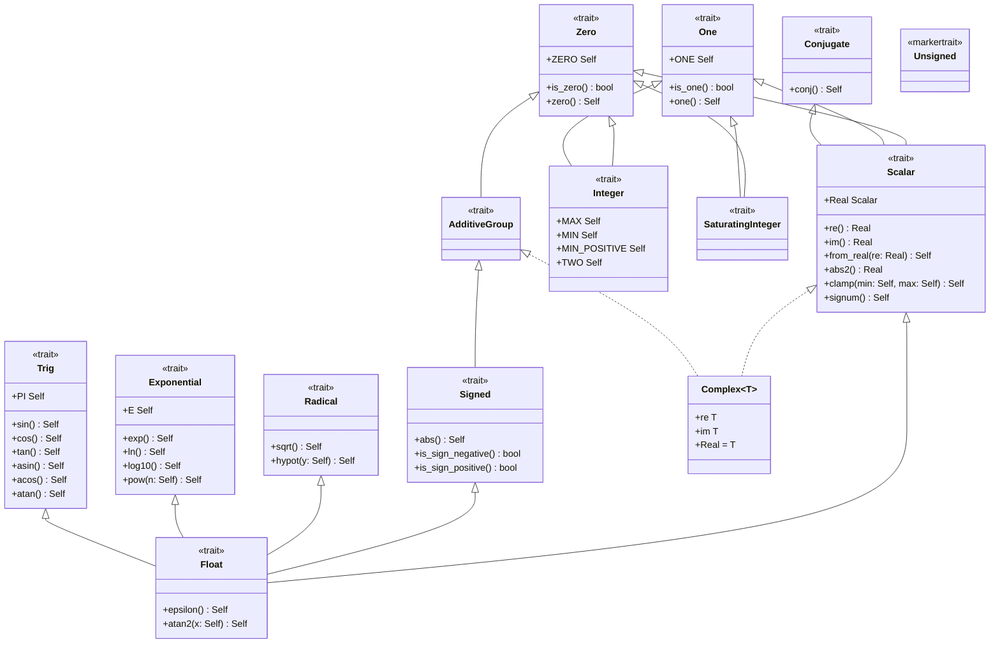

# Numeric Trait Hierarchy (Design Document)

---

### 1. Introduction

The `num_traits` module provides a numerical abstraction designed around
**hardware behavior** rather than abstract mathematical theory. It enables
control algorithms to implement generic code over primitive numerical types,
while giving developers compile-time constraints and overflow behavior (
wrapping vs. saturating).

---

### 2. Requirements

#### 2.1 Functional Requirements

- **FR-1 — Overflow Mode Disambiguation**: Primitive integer types explicitly
  partition overflow semantics into wrapping or saturating execution modes at
  compile time (num-traits, 2024a; num-traits, 2024b; Spiteri, 2026a).
- **FR-2 — Unsigned Primitive Ring Bound**: Unsigned integer primitives
  (`u8`, `u16`, `u32`, `u64`, `usize`) satisfy `Zero + One + Sub + Mul`.
  Linear-algebra kernels consume that bound via `T: Scalar`
  (`subprograms-design.md` FR-1); this document does not specify BLAS-loop
  monomorphization (num-traits, 2024a).
- **FR-3 — Reflexive & Complex Conjugation**: `Conjugate` is a `Scalar`
  super trait exposing `fn conj(self) -> Self`. Real scalars (integer
  primitives, `f32`, `f64`, `Quantized<Repr, SHIFT>`) implement it as the
  identity; `Complex<T>` implements it as imaginary-component negation. A
  value is real iff `self == self.conj()` (Proposal; not in evidence).
- **FR-4 — Real Projection**: Every `Scalar` exposes
  `type Real: Scalar<Real = Self> + PartialOrd` plus `re()`, `im()`,
  `from_real()`, and `abs2()` (`re² + im²`, no square root; Proposal; not in
  evidence). Real types
  set `Real = Self`; `Complex<T>` sets `Real = T`.
- **FR-5 — Implementor Partition**: `Scalar`, `Float`, `Complex<T>`, and
  `Quantized` occupy distinct implementor sets; the partition is the §4.3
  table.

#### 2.2 Non-Functional Requirements

- **NFR-1 — Zero-Cost Abstraction**: Trait calls, zero/one constants, and
  saturating/wrapping operations compile to direct primitive FPU/ALU
  instructions with zero runtime overhead or function call trampolines.

#### 2.3 Constraints

- **C-1 — `#![no_std]` Compatibility**: Numerical traits operate without
  standard library dependencies or dynamic allocation.

---

### 3. Technical Overview

This effort touches `src/math/num_traits.rs` (trait definitions and
`impl_*!` macros) and the `Complex<T>` bridges in `src/math/complex_num.rs`.
`Fixed<Repr, SHIFT>` / `Quantized<Repr, SHIFT>` live in
`src/math/fixed_num.rs` (`fixed-num-design.md`); this module states the
trait contract those types must satisfy. No new files.

_Figure 1: UML hierarchy for the numeric trait tower. Solid arrows are
supertrait bounds; dashed arrows are type realizations. `Complex<T>`
realizes `Scalar` (`Real = T`) and `AdditiveGroup`; it does not
realize `Float`, `Signed`, or the analytic traits. `Unsigned` is a `Sized`-only
marker with no supertrait bounds._

`Scalar` is the ring bound for generic linear algebra. `Conjugate` is a
`Scalar` supertrait (identity on reals, imaginary negation on `Complex<T>`).
`Float` extends `Scalar` and is implemented only by `f32` and `f64`.
`Complex<T>` implements `Scalar` with `Real = T` when `T: Neg` and does not
implement `Float`, `Signed`, or the analytic traits. `Integer`/
`SaturatingInteger`
cover every integer primitive; `Quantized<Repr, SHIFT>` uses saturating
arithmetic. `AdditiveGroup`/`Signed` remain signed-only; unsigned types
never enter that branch. `Complex<T>` implements `AdditiveGroup` when
`T: AdditiveGroup`.

---

### 4. Architecture

#### 4.1 Architectural Layers

1. **Identity Tier (`Zero`, `One`)**:
    - `Zero` requires `Clone + PartialEq + Add<Output = Self>`
      and associated constant `ZERO`.
    - `One` requires `Clone + PartialEq + Mul<Output = Self>`
      and associated constant `ONE`.
    - `PartialOrd` is not a supertrait of either. `Complex<T>` therefore
      implements `Zero`/`One`/`Scalar` without a total or partial order.
    - `clamp` / `signum` on `Scalar` (Proposal; not in evidence) are bounded
      `where Self: PartialOrd`; kernels clip through `T::Real`.
2. **Conjugation Tier (`Conjugate`)**:
    - `Conjugate` exposes `fn conj(self) -> Self` and is a `Scalar`
      supertrait (FR-3).
    - Identity on every real `Scalar`; imaginary negation on `Complex<T>`
      (`T: Neg`).
    - Realness predicate: `self == self.conj()`. Hermitian diagonal writes
      use this test; they do not require an `.im()` check on a separate
      complex trait.
3. **Subtraction Tier (`AdditiveGroup`)**:
    - Opt-in trait binding `Zero` and `Sub<Output = Self>`.
    - Marks types where `a - b` is underflow-free for ordinary values (
      signed integers, floats, `Complex<T>` when `T: AdditiveGroup`).
4. **Hardware Integer Tier (`Integer`, `SaturatingInteger`, `Unsigned`)**:
    - `Integer` and `SaturatingInteger` expose the wrap and saturate ALU
      behaviors respectively (num-traits, 2024a; num-traits, 2024b), plus range
      constants (`MAX`, `MIN`,
      `MIN_POSITIVE`, `TWO`). Both are implemented by every integer
      primitive, signed and unsigned.
    - `Quantized<Repr, SHIFT>` implements `SaturatingInteger` when `Repr`
      does; Q-format DSP types (`q15`, `q31`) follow the same saturating
      contract (systemonchips.com, 2025).
    - `Unsigned` remains a `Sized`-only marker distinguishing unsigned
      primitives from the `AdditiveGroup`/`Signed`/`Float` branch.
5. **Scalar Tier (`Scalar`)**:
    - `Scalar` requires `Zero + One + Sub + Mul + Conjugate` and adds
      `clamp()` / `signum()` (each `where Self: PartialOrd`), without `Div`
      (FR-2, Alternative 3).
    - Associated type `Real: Scalar<Real = Self> + PartialOrd` with `re()`,
      `im()`, `from_real()`, and `abs2()` (FR-4). `im()` returns `Real::ZERO`
      on real types. `abs2()` is `re² + im²` (equals `self * self` on reals).
      Ordering and clipping of complex values go through `T::Real`.
    - `signum()`'s negative branch is unreachable for unsigned types.
6. **Signed & Analytic Tier (`Signed`, `Float`, `Radical`, `Exponential`,
   `Trig`)**:
    - `Signed` extends `AdditiveGroup` with `Neg<Output = Self> + PartialOrd`,
      providing `abs()` and sign predicates. Withheld from `Complex<T>`: BLAS
      1-norms and `Iamax` project through `T::Real` / `abs2()`, not
      `Signed::abs` returning `Complex`.
    - `Float` requires
      `Scalar + Signed + Radical + Exponential + Trig + Div<Output = Self>` plus
      `epsilon()`. Implemented only by `f32` and
      `f64` (FR-5). Division on `Float` follows IEEE-754 (`inf`/`NaN`).
    - `Complex<T>` implements `Div` when `T: Div` without implementing
      `Float`. Integer and `Quantized` division remain on `TryDiv`.

#### 4.2 Macro Code Generation

To prevent boilerplate duplication across primitive types, implementation blocks
are generated using internal declarative macros:

- `impl_int!`: Emits `Zero`, `One`, `Integer`, and `SaturatingInteger`
  implementations for all integer primitives (signed and unsigned).
- `impl_additive_group!`: Emits `AdditiveGroup` and `Signed` implementations
  for signed integer primitives and `f32`/`f64`.
- `impl_scalar!`: Emits `Conjugate` (identity) and `Scalar` (`Real = Self`,
  `re`/`from_real` identity, `im` returns `ZERO`, `abs2` is `self * self`)
  for every integer primitive and for `f32`/`f64`. Emitting `Conjugate`
  strictly within `impl_scalar!` prevents duplicate trait implementations.
- `impl_float!`: Emits `Float`, `Radical`, `Exponential` and `Trig`
  implementations for `f32` and `f64`. `Float: Scalar` is already satisfied
  by the preceding `impl_scalar!` invocation.
- `Complex<T>`: hand-written `Conjugate` (imaginary negation, `T: Neg`),
  `Scalar` (`Real = T`, `T: Scalar<Real = T> + Neg`), `AdditiveGroup` (when
  `T: AdditiveGroup`), and `Div` (when `T: Div`). Does not receive
  `impl_float!`, `Signed`, `Radical`, `Exponential`, or `Trig`.
- `Quantized<Repr, SHIFT>`: implements `Scalar` / `Conjugate` (identity) in
  the quantized-scalar module, not via these macros.

#### 4.3 Implementor Partition (FR-5)

| Type                                                       | `Scalar` | `Real` | `Float` | `Integer` / `SaturatingInteger` | `AdditiveGroup` / `Signed` |
|:-----------------------------------------------------------|:--------:|:------:|:-------:|:-------------------------------:|:--------------------------:|
| signed integers                                            |   yes    | `Self` |   no    |              both               |            both            |
| unsigned integers                                          |   yes    | `Self` |   no    |              both               |          neither           |
| `f32`, `f64`                                               |   yes    | `Self` |   yes   |               no                |            both            |
| `Complex<T>` where `T: Scalar<Real = T> + Neg`             |   yes    |  `T`   |   no    |               no                |    `AdditiveGroup` only    |
| `Quantized<Repr, SHIFT>` where `Repr: Scalar<Real = Repr>` |   yes    | `Self` |   no    |    saturating when `Repr` is    |       follows `Repr`       |

`Div` is not a `Scalar` supertrait. `Float` requires it. `Complex<T>`
implements `Div` when `T: Div`. Integer and `Quantized` division stay on
`TryDiv`.

---

### 5. Alternatives

1. **Full Abstract Algebra Taxonomy**:
    - _Considered_: Implementing a granular algebraic hierarchy matching formal
      abstract algebra, of the kind the `noether` crate ships (`Magma`,
      `Semigroup`, `Monoid`, `Group`, `Ring`, `Field`) (warlock-labs, 2025).
    - _Rejected_: Too complex for practical control systems engineering. Rust's
      trait solver overhead and complex bound signatures outweigh the benefits
      — `noether`'s own documentation cautions that "extensive use of dispatch
      ... may incur some runtime cost" (warlock-labs, 2025; secondary,
      uncorroborated claim), a risk this design avoids entirely by not
      building a comparably deep tower. The pragmatic tiering (`Zero`,
      `Conjugate`, `AdditiveGroup`, `Integer`, `SaturatingInteger`, `Scalar`,
      `Float`) provides the exact boundaries required by numerical algorithms.
2. **Blanket Derivation of `AdditiveGroup` from `Zero + Sub`**:
    - _Considered_: Adding
      `impl<T: Zero + Sub<Output = Self>> AdditiveGroup for T {}`.
    - _Rejected_: Standard library unsigned integers already implement
      `core::ops::Sub`. A blanket implementation would automatically grant
      `AdditiveGroup` to unsigned types, defeating the safety goal. Explicit
      per-type opt-in is required.
3. **Requiring `Div` on the Unified `Scalar` Trait**:
    - _Considered_: Giving `Scalar` a `Div<Output = Self>` bound directly, so
      one trait covers every arithmetic operator a control loop might need.
    - _Rejected_: Integer division is not total (`/0` panics, `i32::MIN / -1`
      overflows), so requiring it on every `Scalar` implementor — including
      plain signed integers and `Quantized` — reintroduces exactly the panic
      surface this hierarchy exists to remove. `Div` stays off `Scalar`.
      `Float` requires it (IEEE-754 `inf`/`NaN`). `Complex<T>` implements
      `Div` when `T: Div` without implementing `Float`. Integer and
      `Quantized` division remain on `TryDiv`.
4. **Wrapper-Type Semantics (`fixed`-crate Pattern) Instead of Method-Level
   Traits**:
    - _Considered_: Expressing wrapping/saturating behavior through a new type
      wrapper — analogous to the `fixed` crate's `Saturating<F>`, which
      "provides saturating arithmetic on fixed-point numbers" by overloading
      operators on the wrapper rather than exposing named methods on the
      underlying type (Spiteri, 2026b) — instead of `Integer`/
      `SaturatingInteger` method calls (`wrapping_add()`, `saturating_add()`)
      on the scalar type itself.
    - _Rejected_: Requiring callers to convert into and out of a wrapper type at
      each boundary adds friction the trait-method approach avoids.
5. **`ComplexField` / `RealField` Tower**:
    - _Considered_: A second trait pair (`ComplexField` with associated
      `RealField`) in the style of nalgebra/simba, separate from `Scalar` (
      Crozet, 2020).
    - _Rejected_: `Scalar::Real` plus `Conjugate` as a `Scalar` supertrait
      gives ring kernels a single bound (`T: Scalar`) and projects norms,
      real α, and Givens cosine onto `T::Real` without a parallel algebra
      tower (Alternative 1).
6. **`Conjugate` as a Separate Bound, Not a `Scalar` Supertrait**:
    - _Considered_: Leaving `Conjugate` independent so ring kernels write
      `T: Scalar + Conjugate`.
    - _Rejected_: Every `Scalar` that participates in `Trans::ConjTrans` or
      Hermitian reflection needs `conj`. On reals the operation is identity
      and monomorphizes away, so the extra bound adds noise without excluding
      any intended implementor.
7. **`Float` for `Complex<T>`**:
    - _Considered_: `impl<T: Float> Float for Complex<T>` so one `T: Float`
      bound covers real and complex analytic kernels.
    - _Rejected_: BLAS `Nrm2`/`Asum` return a real (`SCNRM2`/`DZNRM2`), not
      a complex. `Float` also pulls in `Trig`/`Exponential`/`epsilon` that
      complex LAPACK does not need on `T` itself. Analytic operations run on
      `T::Real`. The shipped `complex_num.rs` `Float`/`Signed`/`Radical`/
      `Trig`/`Exponential` impls for `Complex<T>` are retracted by this
      revision.

---

### 6. Verification & Validation

#### 6.1 Verification

Verification ensures structural correctness and trait compliance across all
target environments:

1. **Unit Testing & Hardware-Boundary Verification**:
    - Test suites (`num_trait_tests.rs`) validate identity elements, wrapping
      behavior at `MAX`/`MIN` and saturation behavior at `MAX`/`MIN` across
      primitive types and `Complex<T>`.
2. **Compile-Time Marker Assertions**:
    - Negative trait bounds (`unsigned: AdditiveGroup`, `Complex<f64>: Float`,
      `Complex<u8>: Scalar`) are rustdoc `compile_fail` doctests on
      `num_traits` module docs. They do not live in `#[ets_suite]` / `cfg(test)`
      modules; rustdoc does not extract doctests from those.
    - Marker tests verify at compile time that `Scalar` is implemented for
      every integer and float primitive (signed and unsigned), that
      `Unsigned + Integer + SaturatingInteger` hold on unsigned primitives
      including `u128` and `usize`,
      and that `AdditiveGroup`/`Signed` are withheld from unsigned types (
      positive checks in `num_trait_tests.rs`).
    - `Complex<T>: Scalar` with `Real = T` when `T: Neg`; `compile_fail` that
      `Complex<f64>` does not implement `Float` or `Signed`, and that
      `Complex<u8>` does not implement `Scalar`.
    - Identity conjugation: `x.conj() == x` for every real primitive;
      `Complex::new(a, b).conj() == Complex::new(a, -b)`.
    - Real projection: `T::Real = T` and `x.re() == x`, `x.im() == T::ZERO`
      for real primitives; `Complex<T>::Real = T`, method `re()`/`im()` match
      the `re`/`im` fields, and
      `z.abs2() == z.re * z.re + z.im * z.im`.
    - `Quantized` / `Fixed` marker `compile_fail`s are specified in
      `fixed-num-design.md` §6.1.5 (`Q15: One`, `Q15: Scalar`,
      `Fixed<i16, 14>: SaturatingInteger` as trait bounds). They are no
      longer deferred to a tensor scalar type.
    - `Complex<T>` does not implement `PartialOrd`. A rustdoc `compile_fail`
      pins that bound. `clamp` / `signum` stay on `T: Scalar + PartialOrd`;
      `src/math/subprograms.rs` and `src/math/dsp.rs` clip through `T::Real`
      (`abs2`, `re`).
3. **Host tests and ETS suite wrap**:
    - Unit tests within `num_traits` are wrapped with the `#[ets_suite]` proc
      macro infrastructure. The ETS wrap covers wrap/saturate **runtime**
      tests only; it does not verify marker absence or type-level bounds
      beyond ZST `size_of`.

#### 6.2 Validation

Validation confirms that high-level toolbox components integrate seamlessly with
the trait hierarchy:

- **Numerical Assertion Integration**: `assert_almost_eq!` and
  `assert_not_almost_eq!` macros operate seamlessly over `T: Float`.
- **DSP & Linear Algebra Integration**: FFT in `dsp.rs` is scoped to
  `T: Float` (trigonometric twiddle factors). BLAS subprograms
  (`subprograms.rs`) validate compile-time ergonomics over `T: Scalar`
  (integers, floats, `Complex<T>`, and later `Quantized`). Field kernels
  (`Nrm2`, `Trsv`, LAPACK) bound `T: Scalar + Div` with
  `T::Real: Radical` / `Trig` as required, not `T: Float` as a stand-in
  for complex.

---

### 7. Performance & Resource Considerations

The `math::num_traits` hierarchy incurs **zero runtime performance overhead**
and **zero memory footprint**:

- **Static Monomorphization**: All trait method calls and constant accesses are
  resolved statically by the Rust compiler.
- **Zero Memory Allocation**: Marker traits (`AdditiveGroup`, `Unsigned`)
  carry no fields or dynamic dispatch tables.
- **Stack & Bare-Metal Friendly**: Operations execute inline without stack frame
  expansion or heap interaction, adhering to strict bare-metal constraints (2–8
  kB stack limits).

---

### 8. Risks & Open Questions

1. **No Order on `Complex<T>`**: `Zero`/`One` do not require `PartialOrd`.
   `Complex<T>` is unordered. Callers that need comparison or clipping bind
   `T: Scalar + PartialOrd` or project through `T::Real`.
2. **Associated Type and Supertrait Migration**: Adding `Conjugate` as a
   `Scalar` supertrait and `type Real` on `Scalar` is a breaking change for
   existing `T: Scalar` impls (including the shipped `impl<T: Scalar> Scalar
for Complex<T>`). Every implementor must name `Real` and provide
   projections. Call sites that used `T: Float` to accept `Complex<T>` must
   re-bind to `T: Scalar` (ring) or `T: Scalar + Div` with `T::Real: …`
   (field).
3. **`SafeDiv`/`NonZero<T>` Is Not Yet Specified**: This design keeps `Div`
   off `Scalar` and defers integer/`Quantized` division to `TryDiv`
   (`math::ops`). A future `NonZero<T>`-gated `SafeDiv` for
   validate-once/divide-many hot loops is out of scope for this revision and
   needs its own design pass. Generic `NonZero<T>` itself is stable (Rust
   stabilized `generic_nonzero` after RFC 2307 replaced a single generic
   wrapper with twelve concrete per-primitive types) (Reitermarkus, 2024; RFC
   2307, 2018), but its `Zeroable`/`ZeroablePrimitive` sealing was adopted
   specifically because "it is unclear what happens ... when `T` is some type
   other than a raw pointer or a primitive integer" (RFC 2307, 2018) — a
   future `SafeDiv` needs its own answer for custom scalar types, since it
   cannot rely on `core::num::NonZero<T>` covering them.
4. **Evolution of `const fn` Traits**: When Rust stabilizes `const_trait_impl`,
   associated trait functions (e.g., `is_zero()`) can be made `const fn`,
   expanding compile-time evaluation capabilities. As of the 2025H1 Rust
   Project Goals, "the compiler now has a promising implementation of const
   traits ... [but] the feature is still firmly in experimental territory:
   there has never been an RFC describing its syntax," with stabilization
   itself still a stretch goal (Scherer, 2025).
5. **Shipped `Complex: Float` Impls (closed)**: `complex_num.rs` previously
   implemented
   `Float`, `Signed`, `Radical`, `Trig`, and `Exponential` for `Complex<T>`.
   Those impls were retracted per FR-5 and Alternative 7; `Complex<T>` now
   implements `Scalar` (`Real = T`), `Conjugate`, `AdditiveGroup`, and inherent
   methods.
6. **2026 const-traits goal page absent from research**: Maintenance requested
   repointing the const-traits citation to the Rust Project Goals 2026H1 page.
   `documentation/math/research/num-traits.bib` contains only `scherer2025` (
   2025H1 URL). Inline cite and [10] remain at (Scherer, 2025) until
   `/cr-research math num-traits` backfills a 2026 goal-page entry.

---

### 9. Development Plan

| Phase / Feature                           | Description                                                                                                                                                      | Estimated Effort |
|:------------------------------------------|:-----------------------------------------------------------------------------------------------------------------------------------------------------------------|:-----------------|
| **Phase 1: Core hierarchy**               | `Zero`, `One`, `AdditiveGroup`, `Signed`, `Integer`, `SaturatingInteger`, `Float`, `Scalar` on primitives.                                                       | Complete         |
| **Phase 2: `Conjugate` + `Scalar::Real`** | `Conjugate` supertrait of `Scalar`; `type Real` with `re`/`im`/`from_real`/`abs2`; `impl_scalar!` emits identity conjugation and `Real = Self`; `Float: Scalar`. | Complete         |
| **Phase 3: `Complex<T>` retraction**      | `Complex<T>: Scalar` (`Real = T`) + `Conjugate` + `AdditiveGroup` + `Div`; remove `Float`/`Signed`/`Radical`/`Trig`/`Exponential`.                               | Complete         |
| **Phase 4: Call-site migration**          | Re-bound `subprograms.rs`, `dsp.rs`, `assert.rs`, and matrix decompositions that used `T: Float` as a complex stand-in.                                          | Complete         |
| **Phase 5: Verification**                 | Marker tests and `compile_fail` doctests for FR-3–FR-5; `#[ets_suite]` wrap/saturate suite verified. `Quantized` / `Fixed` negative oracles live in `fixed-num-design.md` §6.1.5. | Complete         |

---

### 10. Revision History

| Revision | Date            | Author          | Description                                                                                                                           |
|:---------|:----------------|:----------------|:--------------------------------------------------------------------------------------------------------------------------------------|
| 1.0      | August 1, 2026  | @MitchellDScott | Initial draft introducing numeric trait hierarchy and verification standards.                                                         |
| 1.1      | August 2, 2026  | @MitchellDScott | Hardware-aligned hierarchy: replaced algebraic Ring/Field with `Zero`, `One`, `Integer`, `Float`, and `Scalar`.                      |
| 1.2      | August 22, 2026 | @MitchellDScott | Complex scalar support: added `Conjugate` trait, `Scalar::Real` projection, and retracted `Complex: Float` in favor of `Complex: Scalar`. |
| 1.3      | August 24, 2026 | @MitchellDScott | Comparison decoupling: dropped `PartialOrd` from `Zero`/`One` and `Complex<T>`, restricting ordering to `Signed` and `Scalar::Real`.  |
| 1.4      | August 24, 2026 | @MitchellDScott | Full implementation and verification of numeric traits and complex number primitives.                                                 |

---

## References

[1] rust-num, "WrappingAdd," in *num_traits::ops::wrapping* (Version 0.2.19),

2024. [Online]. Available:
      https://docs.rs/num-traits/latest/num_traits/ops/wrapping/trait.WrappingAdd.html.
      Accessed: Aug. 6, 2026.

[2] rust-num, "Saturating," in *num_traits::ops::saturating* (Version 0.2.19),

2024. [Online]. Available:
      https://docs.rs/num-traits/latest/num_traits/ops/saturating/trait.Saturating.html.
      Accessed: Aug. 6, 2026.

[3] T. Spiteri, *az* (Version 1.3.0), 2026. [Online]. Available:
https://docs.rs/az/latest/az/. Accessed: Aug. 6, 2026.

[4] systemonchips.com, "...and Correctly Using CMSIS-DSP Fixed-Point (Qx)
Functions," 2025. [Online]. Available:
https://www.systemonchips.com/and-correctly-using-cmsis-dsp-fixed-point-qx-functions/.
Accessed: Aug. 6, 2026.

[5] S. Crozet, "Switch to Simba and make the base and geometry modules mostly
SIMD AoSoA friendly (PR #713)," in *dimforge/nalgebra*, 2020. [Online].
Available: https://github.com/dimforge/nalgebra/pull/713. Accessed: Aug. 6,

2026.

[6] warlock-labs, *noether README* (Version 0.3.0), 2025. [Online]. Available:
https://github.com/warlock-labs/noether. Accessed: Aug. 6, 2026.

[7] T. Spiteri, *fixed::Saturating* (Version 1.31.0), 2026. [Online].
Available: https://docs.rs/fixed/latest/fixed/struct.Saturating.html.
Accessed: Aug. 6, 2026.

[8] M. Reitermarkus, "Tracking Issue for generic NonZero (issue #120257)," in
*rust-lang/rust*, 2024. [Online]. Available:
https://github.com/rust-lang/rust/issues/120257. Accessed: Aug. 6, 2026.

[9] Rust Project, "RFC 2307: Concrete NonZero Types," *Rust RFC Book*, 2018.
[Online]. Available:
https://rust-lang.github.io/rfcs/2307-concrete-nonzero-types.html. Accessed:
Aug. 6, 2026.

[10] O. Scherer, "Prepare const traits for stabilization," *Rust Project Goals
(2025H1)*, 2025. [Online]. Available:
https://rust-lang.github.io/rust-project-goals/2025h1/const-trait.html.
Accessed: Aug. 6, 2026.
