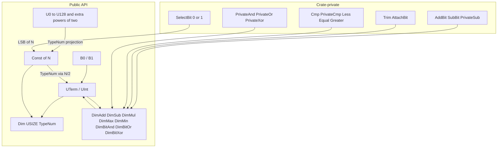

# Numeric Types (Design Document)


---

### 1. Introduction

Every numerical model in the crate is parameterized over dimensions that must
be known and checked before the program runs. Trait names belong in §4.

Primary usage scenarios:

- Reject a dimension mismatch at compile time rather than as a runtime panic.
- Write an ordinary integer literal that is a dimension.
- Form a type-level product large enough for a 128×128 flattened buffer
  ($16384$).

---

### 2. Requirements

#### 2.1 Functional Requirements

- **FR-1 — Compile-time dimension is a value and a type**: A dimension is
  available as a runtime integer and as a canonical type-level encoding.
  Concrete dimension types are copyable and equality-comparable.
- **FR-2 — Type-level arithmetic on dimensions**: Addition, subtraction,
  multiplication, maximum, and minimum on dimensions produce another
  dimension (FR-1).
- **FR-3 — Integer literals are dimensions**: Call sites write an ordinary
  integer literal that resolves to the canonical encoding. There is no runtime
  constructor that pairs a value with that literal. Every $N$ in C-1 exposes
  that canonical type.
- **FR-4 — Common sizes have short names**: A small checked-in subset of C-1
  has short names. Other dimensions in C-1 are spelled through the const-generic
  bridge.
- **FR-5 — Type-level bitwise operations on dimensions**: Bitwise and, or, and
  xor on dimensions produce a canonical encoding, trimming leading zeros where
  cancellations occur.

#### 2.2 Non-Functional Requirements

- **NFR-1 — Zero memory footprint**: Every dimension type must occupy zero bytes
  at runtime and not inflate the size of any struct carrying it as a type
  parameter.

#### 2.3 Constraints

- **C-1 — Const range bound**: `Const<N>` implements `Dim` for every
  $N \in 0..=1024$ and for $2048, 4096, 8192, 16384$. The range is an
  authoring bound for array-backed storage, not a trait-solver bound; binary
  encoding depth is $O(\log N)$. Impls are contiguous through $1024$ because
  `TypeNum` is defined from `Const<{N/2}>`.
- **C-2 — Unnamed canonical tree arithmetic**: `DimAdd`/`DimSub`/
  `DimMul`/`DimMax`/`DimMin`/`DimBit*` on canonical types (`UTerm`/`UInt`)
  succeed for operands whose bit-width stays within the solver budget. The
  result is a `UTerm`/`UInt` tree; it need not have a `U*` alias and need
  not equal `<Const<K> as Dim>::TypeNum` unless $K$ is in C-1. `Const`
  operands use the same operators through `TypeNum` (§4.3); a
  `Const`×`Const` product is not required to lie in C-1.
- **C-3 — `#![no_std]` compatibility**: The module must depend only on `core`,
  with no allocation and no OS or std-only feature dependency.

---

### 3. Technical Overview

The module has no runtime component. It lowers to zero-sized marker types and
associated-type bookkeeping: a binary unsigned encoding, bit-recursive
arithmetic, a const-generic bridge (`Const<N>`) whose `TypeNum` is that
encoding, and a small set of `U*` names for common values.



_Figure 1: Public dimension types and crate-private operators. Bits construct
the unsigned tree and do not implement `Dim`. `UTerm`/`UInt` and `Const<N>`
do; operator traits consume that tree and produce a new one. Carry, trim,
comparison, bitwise logic, and `SelectBit` stay crate-private._

---

### 4. Architecture

#### 4.1 Canonical Encoding

Bits are `B0` and `B1`. They implement `Bit` (`USIZE` is 0 or 1) and do not
implement `Dim`. Unsigned values are `UTerm` (zero) and `UInt<U, B>` (value
$(U \ll 1) \mid B$, `B` the LSB). Leading zeros are not canonical:
`UInt<UTerm, B0>` is not a value. `Dim` exposes `USIZE` and an associated
`TypeNum: Dim`. On canonical types `TypeNum = Self` and
`USIZE = 2 \cdot U::\mathrm{USIZE} + B::\mathrm{USIZE}`. `UTerm`, `UInt`,
`B0`, `B1`, and `Const<N>` are zero-sized (NFR-1) [1], [2].
The module is `core`-only (NFR-2) [3].

#### 4.2 Public Arithmetic and Bitwise Operations

`DimAdd`, `DimSub`, `DimMul`, `DimMax`, `DimMin`, `DimBitAnd`, `DimBitOr`,
and `DimBitXor` are implemented on `UTerm` / `UInt`. Each `Output: Dim`.
Specific `UTerm` versus `UInt` impls avoid overlapping blankets. Recipes
follow typenum's `UInt`/`UTerm` operators [3] without taking that
crate.

- **Add**: four LSB pairs. `B0`/`B0` and mixed bits write the sum bit and
  recurse on the MSBs; `B1`/`B1` writes `B0` and applies private `AddBit<B1>`
  (carry) to the MSB sum.
- **Sub**: private bitwise `PrivateSub` (borrow via `SubBit`), then `Trim` /
  `AttachBit` so a leading `UInt<UTerm, B0>` collapses and equal operands
  yield `UTerm`. There is no `SubBit<B1>` on `UTerm`: underflow has no impl
  and fails at compile time.
- **Mul**: shift-and-add. `UInt<Ul, B0> * Ur = UInt<Ul * Ur, B0>`; the `B1`
  case adds `Ur` onto that shift. Times `UTerm` is `UTerm`.
- **Max / min**: private `Cmp` (`Less` / `Equal` / `Greater`) with
  LSB-to-MSB `SoFar`, then `PrivateMax` / `PrivateMin` select an operand.
- **Bitwise AND (`DimBitAnd`)**: bit-recursive conjunction of bit pairs via
  private `PrivateAnd` (`UTerm & Rhs = UTerm`, `UInt & UTerm = UTerm`).
  Leading zeros are eliminated via `Trim` / `AttachBit`.
- **Bitwise OR (`DimBitOr`)**: bit-recursive disjunction of bit pairs via
  private `PrivateOr` (`UTerm | X = X`, `X | UTerm = X`). Because non-zero
  MSBs are preserved, output is canonical without trimming.
- **Bitwise XOR (`DimBitXor`)**: bit-recursive exclusive disjunction via
  private `PrivateXor` (`UTerm ^ X = X`, `X ^ UTerm = X`). Cancelled MSBs are
  trimmed to canonical form via `Trim` / `AttachBit` (`A ^ A = UTerm`).

Carry, borrow, trim, comparison, bitwise logic, and max/min selection stay
crate-private. Public traits name only dimension types.

#### 4.3 Const-Generic Bridge

`Const<const N: usize>` is a ZST front end, not a second arithmetic
implementation. `Const<0>::TypeNum = UTerm`. For $N > 0$:

```text
TypeNum = UInt< <Const<{N/2}> as Dim>::TypeNum , SelectBit<{N%2}> >
```

`{N/2}` and `{N%2}` are literal const expressions (stable since Rust 1.51.0;
no `generic_const_exprs`) [4]. `SelectBit` maps 0/1 to `B0`/`B1` and
is not part of the public `Dim` API. Because each impl mentions `Const<{N/2}>`,
C-1 impls are contiguous from 0 through 1024; the extra powers of two chain
through
that prefix (`16384 → 8192 → … → 1024 → … → 0`).

Const does not reimplement bit recursion. Five forwarding impls per
operator cover `Const`↔`UTerm`, `Const`↔`UInt`, `Const`↔`Const`, and the
reverse `UTerm`/`UInt`↔`Const`, each projecting both sides through
`TypeNum` and reusing the canonical operators. `DimMul` is not special:
`Const<100>: DimMul<Const<100>>` exists; `Output` is the `UInt` tree for
$10000$, which need not be a C-1 `Const` (C-2). Naming that product as
`Const<K>` still requires $K$ in C-1.

There is no `from_i8` / `from_u8` / `try_from_usize`: a runtime integer
cannot be tied to `N` in a way release builds or the type system enforce.
Array lengths remain caller `const R` / `const C` (storage C-4).

#### 4.4 Aliases and Call-Site Naming

Named identifiers exist for `U0..=U128` and `U256`, `U512`, `U1024`,
`U2048`, `U4096`, `U8192`, `U16384` (FR-4). Each alias is the projection
`type Un = <Const<n> as Dim>::TypeNum` (`U0 = UTerm`). They are not a
second encoding and are not required for every C-1 value.

| Need                                                | Spelling                                           |
|:----------------------------------------------------|:---------------------------------------------------|
| Array-backed storage / models                       | `Const<R>`, `Const<C>` with `Const<R>: Dim` (C-1)  |
| Small or power-of-two dimension in bounds and tests | `U5`, `U128`, `U16384`, …                          |
| C-1 value with no `U*` alias                        | `<Const<N> as Dim>::TypeNum`                       |
| Arithmetic result (C-2)                             | `<A as DimMul<B>>::Output` (a `UTerm`/`UInt` tree) |

#### 4.5 Generation

Declarative macros emit `impl Dim for Const<N>` from the halving rule.
Expansion stays under the default `recursion_limit` of 128 [5]:
a short recursive muncher may cover the `U1..=U128` alias band; the remaining
C-1
impls are a flat or chunked `impl_dim_single!(n)` sequence, not 1024 nested
recursive
calls. No proc-macro, `paste`, or checked-in `UInt` tree dump. Extra powers
of two are explicit `impl_dim_single!` invocations plus matching `U*`
projections.

---

### 5. Alternatives

1. **Peano / unary encoding (`Z` / `S<N>`).**
   _Considered_: successor recursion with a single inductive case per
   operation [6].
   _Rejected_: trait-solver depth scales with the value, so aliases stop at
   `U127` and pairwise `DimMul` fails earlier and asymmetrically. That cannot
   express `Const<128>` or $128 \times 128 = 16384$.

2. **Native const-generic expressions instead of a `Dim` trait hierarchy.**
   _Considered_: using bare `const N: usize` parameters and ordinary
   `usize` arithmetic (`N + M`) directly in type signatures, skipping the
   `Dim`/`DimAdd`/... traits entirely.
   _Rejected_: RFC 2000 does not unify abstract const expressions beyond
   literal AST identity, so `N + M` and `M + N` are different, non-unifying
   types to the compiler even though they denote the same value [7].
   Encoding dimensions as `Dim`-bound associated types makes
   commutativity provable through trait implementations — the existing
   `test_num_type_addition_commutativity` test depends on exactly this.

3. **Sealing the arithmetic traits.**
   _Considered_: sealing `DimAdd`/`DimSub`/`DimMul`/`DimMax`/`DimMin` so
   only this module can implement them, following `generic-array`'s
   `ArrayLength` [8].
   _Rejected_: `storage-design.md` leaves storage traits open so downstream
   code can add custom backends; sealing dimension traits would block a
   future custom `Dim` implementor from the same compile-time arithmetic.

4. **Dense `U*` identifiers through `U1024`.**
   _Considered_: a `U*` name for every C-1 value, via `paste`, a proc-macro,
   or a checked-in dump of nested `UInt` trees.
   _Rejected_: `macro_rules!` cannot synthesize `U537`. Extra names do not
   add solver power; `<Const<N> as Dim>::TypeNum` already names that tree.
   FR-4 stays a small convenience set.

5. **Runtime `Const` constructors (`from_u8`, `try_from_usize`).**
   _Considered_: hoisting a runtime integer onto `Const<N>` with a debug
   assert or a `u8` range cap to limit stack arrays.
   _Rejected_: `n == N` is not enforceable in release builds, and a matching
   runtime value does not prevent `Const::<16384>` existing as a type.
   Array lengths remain caller `const R` / `const C` (storage C-4).

6. **`typenum` crate dependency.**
   _Considered_: using `typenum` directly for `UInt`/`UTerm` and `core::ops`
   operators [3].
   _Rejected_: this crate minimizes dependencies and already exposes `Dim*`
   traits; an in-tree unsigned subset behind those traits is sufficient.

7. **Unary recursive muncher through 1024.**
   _Considered_: one recursive `macro_rules!` step per `N` from 1 to 1024.
   _Rejected_: the default `recursion_limit` is 128 [5].
   Raising it is out of scope. The `U1..=U128` band may use a short muncher;
   remaining `Const` impls use flat or chunked expansion.

8. **Deferred vs Upfront Structural Bounds (`nalgebra` vs `control-rs`).**
   _Considered_: implementing `Dim` generically for all `Const<N>`
   (`impl<const N: usize> Dim for Const<N>`) as `nalgebra` does [9],
   allowing arbitrary `usize` dimensions (up to `usize::MAX`) for simple storage
   and metadata without upfront macro bounds, while deferring type-level
   arithmetic to an auxiliary trait (e.g. `ToTypenum`) generated via macros for
   a limited range (e.g. `0..=127`).
   _Rejected_: neither library has a completely bounds-free solution on stable
   Rust without `generic_const_exprs`. `nalgebra`'s deferred approach permits
   unconstrained types like `Matrix<T, Const<10000>, Const<10000>>` for basic
   storage, but traps downstream callers when attempting type-level math (like
   concatenation or block operations) because `ToTypenum` fails at compile time
   with obscure trait errors far from the definition site. `control-rs` enforces
   structural bounds upfront: by requiring `type TypeNum: Dim` directly on
   `Dim`,
   any dimension that can be instantiated is statically guaranteed to support
   all type-level arithmetic operations reliably.

9. **Restrict `Const`×`Const` `DimMul` to products in C-1.**
   _Considered_: omit the generic `Const`↔`Const` `DimMul` forwarder and
   emit only pairs whose product is in C-1, either with
   `where Const<{N*M}>: Dim` or a literal factor table.
   _Rejected_: `{N*M}` in a where clause is an abstract const expression
   that RFC 2000 does not unify on stable [7]. A factor table
   special-cases `DimMul` against every other operator and does not produce
   `Const<{N*M}>: Dim` for array lengths; `storage-design.md` already notes
   that projection needs `generic_const_exprs`. C-1 already fails
   `Const<K>` outside the range at the `Dim` bound.

---

### 6. Verification & Validation

#### 6.1 Approach

The implementation must produce evidence that type-level dimensions and the
const-generic bridge compile to zero runtime memory footprint; that type-level
arithmetic and bitwise operations evaluate correctly at compile time; that
subtraction underflow and out-of-range dimensions fail immediately at compile
time; and that the system functions allocation-free under `#![no_std]`.

| Method                    | Mechanism                                                                                        |
|:--------------------------|:-------------------------------------------------------------------------------------------------|
| Compile-time shape check  | Const-generic parameter passing, type-level operator bounds, and rustdoc `compile_fail` doctests |
| Requirements-based test   | `#[test]` unit tests checking `Dim::USIZE` runtime projections and bitwise identities            |
| Resource usage evaluation | `size_of::<T>() == 0` assertions across all dimension markers                                    |
| Static analysis           | `cargo clippy-ci`, source inspection verifying `#![no_std]` and absence of allocator             |
| On-target execution       | `#[ets_suite]` target execution asserting zero-sized types on bare metal                         |

Target: 95% statement coverage of `src/math/num_types.rs`, measured via
`cargo coverage`.
Excluded: Unreachable branches in macro expansion artifacts.

1. **Matrix & Storage Integration**: `Storage<T, R: Dim, C: Dim>` binds
   `Const<R>` and `Const<C>` for dimensions across C-1.
2. **Flattened Large-Product Addressing**: Dimension multiplications that exceed
   C-1 (such as $128 \times 128 = 16384$) resolve to valid canonical trees for
   flattened array indexing.

#### 6.2 Acceptance

| Claim                             | Oracle                                            | Measure                                                                  | Bound                                             |
|:----------------------------------|:--------------------------------------------------|:-------------------------------------------------------------------------|:--------------------------------------------------|
| Zero runtime footprint            | Type system specification                         | `size_of::<UTerm>()`, `size_of::<UInt<U, B>>()`, `size_of::<Const<N>>()` | Exactly $0$ bytes                                 |
| Const bridge projection           | Literal integer value $N$                         | `<Const<N> as Dim>::USIZE`                                               | Exact integer equality for all $N \in \text{C-1}$ |
| Canonical alias mapping           | Type identity                                     | `let _: U5 = <Const<5> as Dim>::TypeNum`                                 | Bit-identical compile-time type equality          |
| Large product resolution          | Closed-form $128 \times 128 = 16384$              | `<U128 as DimMul<U128>>::Output::USIZE`                                  | Exact equality ($16384$)                          |
| Subtraction underflow             | Non-negative unsigned domain                      | rustdoc `compile_fail` on underflowing `DimSub`                          | Fails compilation at trait boundary               |
| Out-of-bounds dimension rejection | Range definition C-1 ($0..=1024$ and powers of 2) | rustdoc `compile_fail` on `Const<1025>: Dim`                             | Immediate compile-time failure                    |
| Bitwise logic identities          | Boolean algebra                                   | Masking ($A \mid 0 = A$), cancellation ($A \oplus A = 0$), power-of-two  | Bit-identical compile-time equality               |

#### 6.3 Limits

- **Type-level division and general ordering**: `DimDiv` and `DimOrd` beyond
  max/min are deferred until needed by downstream consumers and are unverified.
- **Arbitrary unaligned non-power-of-two dimensions above 1024**: Dimensions
  in $1025..16383$ other than powers of two do not implement `Dim` and are
  unverified.

---

### 7. Performance & Resource Considerations

- **Compile time, not runtime**: trait resolution only; no runtime data
  beyond consumer fields.
- **Zero memory footprint**: `UTerm`, `UInt<U, B>`, `B0`/`B1`, and `Const<N>`
  are zero-sized (NFR-1) [1], [2], [10].
- **Recursion depth scales with bit width**: `DimAdd`/`DimMul`/`DimBit*` on
  14-bit products ($16384$) stay far below the default solver budget of 128
  [7].
- **Fixed Const-impl cost**: one `impl Dim for Const<N>` per $N$ in C-1,
  checked once at definition time. Alias identifiers add no extra solver
  work.

---

### 8. Risks & Open Questions

1. **`Const<N>` still detours through `TypeNum`.** nalgebra's `Const<T>`
   reads `N` directly [9]. This module's `Const` arithmetic is
   $O(\log N)$ via the binary tree, not $O(1)$ from the literal. Not yet
   measured against crate build time.
2. **Sparse `Const<N>: Dim` above 1024.** Flattened sizes in $1025..16383$
   other than $2048, 4096, 8192, 16384$ have no `Dim` impl. Fill the gap only
   if a consumer's `as_array::<N>()` bound requires it.
3. **No type-level division or ordering beyond max/min.** `DimDiv` / `DimOrd`
   stay open until a consumer needs them.

---

### 9. Development Plan

| Phase / Feature                                | Description                                                                                                                                                                          | Estimated Effort |
|:-----------------------------------------------|:-------------------------------------------------------------------------------------------------------------------------------------------------------------------------------------|:-----------------|
| **Phase 1: Binary encoding and arithmetic**    | Replace `Z`/`S<N>` with `UTerm`/`UInt`/`B0`/`B1`; implement `Dim*` via private carry, shift-and-add, cmp, and trim; `Const` forwards through `TypeNum`; delete runtime constructors. | Complete         |
| **Phase 2: Names and Const range**             | Sparse `U*` aliases (`U0..=U128` plus extras) as `TypeNum` projections. `impl Dim for Const<N>` for every C-1 $N$ via `{N/2}`, under the default `recursion_limit` of 128 [5].       | Complete         |
| **Phase 3: Verification and downstream**       | `U128 * U128 = U16384`; underflow `compile_fail`; `Const<N>: Dim` pin for a C-1 value with no `U*` alias; storage/model C-1 wording uses `Const`/`TypeNum`, not dense `U*`.          | Complete         |
| **Phase 4: Type-level bitwise operations**     | `DimBitAnd`, `DimBitOr`, `DimBitXor` over `UTerm`, `UInt`, `Const<N>`, and `B0`/`B1` with leading-zero trimming and power-of-two static verification.                                | Complete         |
| **Phase 5: Extended arithmetic (conditional)** | Evaluate `DimDiv`/`DimOrd` (Risk 3) once a consumer needs them.                                                                                                                      | Small            |

---

### 10. Revision History

| Revision | Date              | Author          | Description                                                                                                                                 |
|:---------|:------------------|:----------------|:--------------------------------------------------------------------------------------------------------------------------------------------|
| 1.0      | August 7, 2026    | @MitchellDScott | Initial specification for type-level dimensions (`num_types.rs`).                                                                           |
| 1.1      | August 22, 2026   | @MitchellDScott | Binary encoding: transitioned from Peano integers to binary `UTerm`/`UInt` and macro-generated `Const<N>` aliases (`0..=1024`).             |
| 1.2      | August 23, 2026   | @MitchellDScott | Type-level bitwise operations: added `DimBitAnd`, `DimBitOr`, and `DimBitXor` traits and verification tests.                                |
| 1.3      | August 25, 2026   | @MitchellDScott | Operator forwarding: simplified dimension operator implementations across `DimAdd`, `DimSub`, and `DimMul`.                                 |
| 1.4      | August 25, 2026   | @MitchellDScott | Full test suite verification and compile-time dimension validation.                                                                         |
| 1.5      | September 9, 2026 | @MitchellDScott | Standardized §2 requirements/constraints, restructured §6 into formal 6.1–6.7 structure, and transitioned citations to standard IEEE style. |
| 1.6      | September 10, 2026 | @MitchellDScott | Verification grounding & review closure: reclassified no_std requirement to C-3, updated §6.2/§6.4 with kind:locator evidence from src/math/tests/num_type_tests.rs. |
| 1.7      | September 15, 2026 | @MitchellDScott | §1 jobs; FR titles named from needs, not traits. |
| 1.8      | September 16, 2026 | @MitchellDScott | Retired `vv-standards.md`: §6 authoring rules are `design-template.md` §6. |

---

## References

[1] Rust Project, "Glossary — Zero-sized type (ZST)," *The Rust Reference*,
2026. [Online].
Available: https://doc.rust-lang.org/reference/glossary.html#zero-sized-type-zst.
Accessed: Aug. 7, 2026.

[2] Rust Project, "PhantomData," *std::marker* (Version 1.97.1), 2026. [Online].
Available: https://doc.rust-lang.org/std/marker/struct.PhantomData.html.
Accessed: Aug. 7, 2026.

[3] paholg, *typenum* (Version 1.20.1), 2026. [Online].
Available: https://docs.rs/typenum/latest/typenum/. Accessed: Aug. 7, 2026.

[4] Rust Project, "Version 1.51.0 (2021-03-25) — RELEASES.md," *rust-lang/rust*,
2021. [Online].
Available: https://raw.githubusercontent.com/rust-lang/rust/1.51.0/RELEASES.md.
Accessed: Aug. 7, 2026.

[5] Rust Project, "recursion_limit," *The Rust Reference — Attributes*,
2026. [Online].
Available: https://doc.rust-lang.org/reference/attributes/limits.html. Accessed:
Aug. 24, 2026.

[6] paholg, *peano* (Version 1.0.2), 2016. [Online].
Available: https://docs.rs/peano/latest/peano/. Accessed: Aug. 7, 2026.

[7] Rust Project, "RFC 2000: Const Generics," *Rust RFC Book*, 2017. [Online].
Available: https://rust-lang.github.io/rfcs/2000-const-generics.html. Accessed:
Aug. 7, 2026.

[8] B. Kamiński and A. Trent, "ArrayLength," in *generic-array* (Version 1.4.4),
2026. [Online].
Available: https://docs.rs/generic-array/latest/generic_array/trait.ArrayLength.html.
Accessed: Aug. 7, 2026.

[9] S. Crozet, "src/base/dimension.rs," in *dimforge/nalgebra*, 2026. [Online].
Available: https://github.com/dimforge/nalgebra/blob/main/src/base/dimension.rs.
Accessed: Aug. 7, 2026.

[10] Rust Project, "Type layout — The Rust representation," *The Rust
Reference*, 2026. [Online].
Available: https://doc.rust-lang.org/reference/type-layout.html#the-rust-representation.
Accessed: Aug. 7, 2026.
